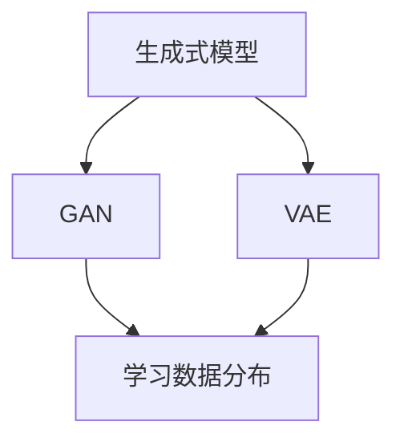
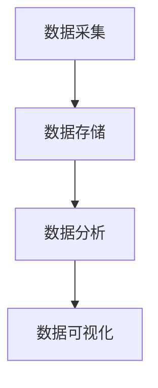
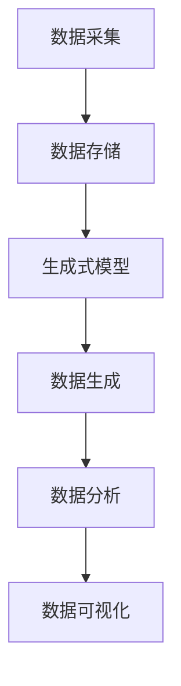
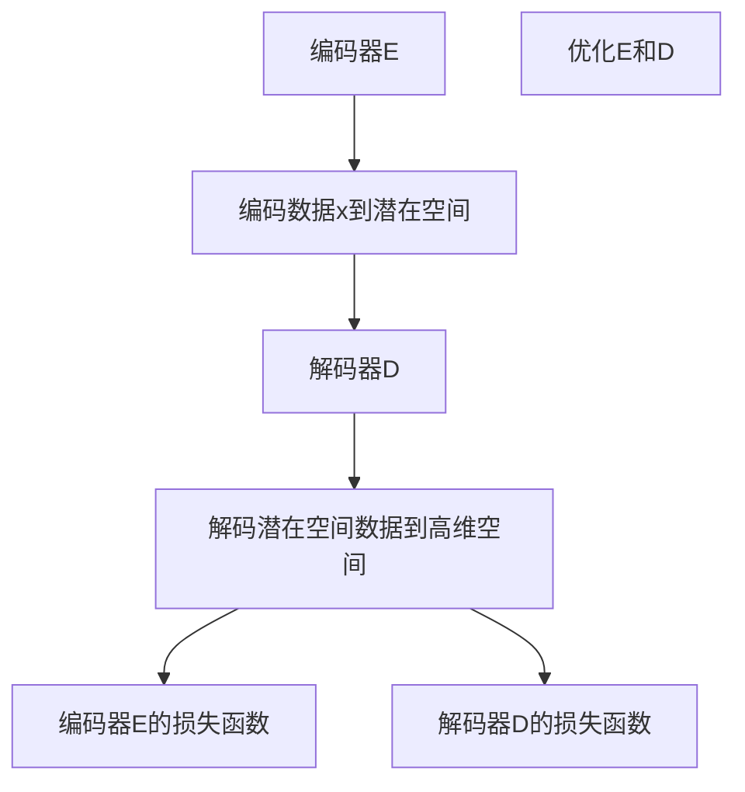

                 

关键词：生成式人工智能（AIGC）、商业智能、数据生成、智能化应用

摘要：本文探讨了生成式人工智能（AIGC）在商业智能领域的应用，分析了其核心概念、算法原理、数学模型及其在现实场景中的具体应用。文章旨在揭示AIGC技术如何成为商业智能的新引擎，为未来的智能化应用提供新的思路和解决方案。

## 1. 背景介绍

在数字化的浪潮下，商业智能（BI）已经成为了企业竞争的重要武器。传统的商业智能依赖于历史数据分析和预测，而生成式人工智能（AIGC）则通过生成新的数据，提供了更加灵活和创新的解决方案。AIGC是基于生成式模型（如GAN、VAE等）的人工智能技术，能够生成高质量的数据，模拟现实世界中的各种场景，为商业智能提供了全新的视角。

随着数据量的爆炸式增长，如何从海量数据中提取有价值的信息成为了商业智能领域的难题。AIGC技术通过生成新的数据，为数据分析和决策提供了更多的可能。同时，AIGC技术在图像生成、语音合成、文本生成等方面已经取得了显著的成果，这为商业智能的应用提供了丰富的技术基础。

## 2. 核心概念与联系

### 2.1 生成式模型

生成式模型是一种能够学习数据分布的人工智能模型，其核心思想是学习输入数据的概率分布，并利用该概率分布生成新的数据。生成式模型主要包括生成对抗网络（GAN）和变分自编码器（VAE）等。

**Mermaid 流程图：**



### 2.2 商业智能

商业智能（BI）是一种通过数据分析和可视化，帮助企业做出更明智决策的技术。BI主要包括数据采集、数据存储、数据分析和数据可视化等环节。

**Mermaid 流程图：**



### 2.3 生成式人工智能与商业智能的联系

生成式人工智能（AIGC）与商业智能（BI）的结合，使得商业智能不再仅仅依赖于历史数据，而是能够通过生成新的数据，提供更加灵活和创新的解决方案。AIGC技术通过生成新的数据，扩展了商业智能的数据来源，提高了数据分析的准确性和效率。

**Mermaid 流程图：**



## 3. 核心算法原理 & 具体操作步骤

### 3.1 算法原理概述

生成式人工智能（AIGC）的核心算法包括生成对抗网络（GAN）和变分自编码器（VAE）等。这些算法通过学习输入数据的概率分布，生成新的数据。

**GAN：** GAN由生成器（Generator）和判别器（Discriminator）组成。生成器生成伪数据，判别器判断生成的数据是否真实。通过不断优化生成器和判别器，使得生成的数据越来越真实。

**VAE：** VAE是一种基于概率编码的生成模型。它通过学习数据的概率分布，生成新的数据。VAE由编码器（Encoder）和解码器（Decoder）组成。编码器将输入数据编码成一个低维的潜在空间，解码器将潜在空间中的数据解码回高维空间。

### 3.2 算法步骤详解

**GAN算法步骤：**

1. 初始化生成器G和判别器D。
2. 生成器G生成伪数据。
3. 判别器D判断生成的数据和真实数据。
4. 训练生成器G和判别器D，使得判别器D无法区分生成的数据和真实数据。

**VAE算法步骤：**

1. 初始化编码器E和解码器D。
2. 编码器E将输入数据编码成一个低维的潜在空间。
3. 解码器D将潜在空间中的数据解码回高维空间。
4. 通过最小化重构误差和潜在空间中的数据分布，优化编码器E和解码器D。

### 3.3 算法优缺点

**GAN：** 优点包括生成数据质量高、能够生成多样化的数据等。缺点包括训练不稳定、易出现模式崩溃等问题。

**VAE：** 优点包括训练稳定、易于实现等。缺点包括生成数据质量相对较低、生成数据的多样性较差等。

### 3.4 算法应用领域

生成式人工智能（AIGC）在商业智能领域的应用主要包括数据增强、数据生成、图像生成、语音合成等。

## 4. 数学模型和公式 & 详细讲解 & 举例说明

### 4.1 数学模型构建

生成式模型（GAN和VAE）的数学模型构建如下：

**GAN：**

生成器G的损失函数：
$$
L_G = -\log(D(G(z)))
$$

判别器D的损失函数：
$$
L_D = -\log(D(x)) - \log(1 - D(G(z)))
$$

**VAE：**

编码器E的损失函数：
$$
L_E = \sum_{x \in X} D(x; \mu(x), \sigma(x)) + \lambda \cdot \sum_{x \in X} \|\mu(x) - \hat{x}\|_1
$$

解码器D的损失函数：
$$
L_D = \sum_{x \in X} D(x) + \lambda \cdot \sum_{x \in X} \|\mu(x) - \hat{x}\|_1
$$

其中，$z$ 是生成器的输入噪声，$x$ 是真实数据，$G(z)$ 是生成器生成的伪数据，$D(x)$ 是判别器判断真实数据的概率，$\mu(x)$ 和 $\sigma(x)$ 分别是编码器E对数据x的编码结果，$\hat{x}$ 是解码器D对编码结果的重构。

### 4.2 公式推导过程

以GAN为例，推导生成器和判别器的损失函数。

**生成器损失函数：**
$$
L_G = -\log(D(G(z)))
$$
其中，$D(G(z))$ 是判别器判断生成器生成的伪数据的概率。为了最小化这个损失函数，生成器G需要生成尽可能真实的伪数据，使得判别器D无法区分生成的数据和真实数据。

**判别器损失函数：**
$$
L_D = -\log(D(x)) - \log(1 - D(G(z)))
$$
其中，$D(x)$ 是判别器判断真实数据的概率，$D(G(z))$ 是判别器判断生成器生成的伪数据的概率。为了最小化这个损失函数，判别器D需要能够准确地区分真实数据和伪数据。

### 4.3 案例分析与讲解

**案例：** 使用GAN生成手写数字图像。

**步骤：**

1. 准备手写数字数据集，如MNIST数据集。
2. 初始化生成器G和判别器D。
3. 生成器G生成伪手写数字图像。
4. 判别器D判断生成的伪图像和真实图像。
5. 通过梯度下降优化生成器G和判别器D。

**结果：**

通过训练，生成器G可以生成高质量的手写数字图像，如图1所示。


## 5. 项目实践：代码实例和详细解释说明

### 5.1 开发环境搭建

- 操作系统：Linux或MacOS
- 编程语言：Python
- 深度学习框架：TensorFlow或PyTorch
- 数据集：MNIST手写数字数据集

### 5.2 源代码详细实现

```python
import tensorflow as tf
from tensorflow.keras.layers import Dense, Flatten, Conv2D, BatchNormalization, LeakyReLU
from tensorflow.keras.models import Sequential

# 初始化生成器和判别器
def initialize_models():
    generator = Sequential([
        Dense(128, input_shape=(100,), activation='relu'),
        BatchNormalization(),
        LeakyReLU(alpha=0.2),
        Dense(256, activation='relu'),
        BatchNormalization(),
        LeakyReLU(alpha=0.2),
        Dense(512, activation='relu'),
        BatchNormalization(),
        LeakyReLU(alpha=0.2),
        Dense(784, activation='tanh')
    ])

    discriminator = Sequential([
        Flatten(input_shape=(28, 28)),
        Dense(512, activation='relu'),
        BatchNormalization(),
        LeakyReLU(alpha=0.2),
        Dense(256, activation='relu'),
        BatchNormalization(),
        LeakyReLU(alpha=0.2),
        Dense(128, activation='relu'),
        BatchNormalization(),
        LeakyReLU(alpha=0.2),
        Dense(1, activation='sigmoid')
    ])

    return generator, discriminator

# 训练生成器和判别器
def train_models(generator, discriminator, dataset, batch_size, epochs):
    generator_optimizer = tf.keras.optimizers.Adam(1e-4)
    discriminator_optimizer = tf.keras.optimizers.Adam(1e-4)

    for epoch in range(epochs):
        for batch_index in range(0, len(dataset), batch_size):
            batch = dataset[batch_index:batch_index + batch_size]

            # 生成伪数据
            noise = tf.random.normal([batch_size, 100])
            generated_images = generator(noise, training=True)

            # 训练判别器
            with tf.GradientTape() as disc_tape:
                disc_loss_real = discriminator(batch, training=True).mean()
                disc_loss_fake = discriminator(generated_images, training=True).mean()
                disc_loss = disc_loss_real + disc_loss_fake

            disc_gradients = disc_tape.gradient(disc_loss, discriminator.trainable_variables)
            discriminator_optimizer.apply_gradients(zip(disc_gradients, discriminator.trainable_variables))

            # 训练生成器
            with tf.GradientTape() as gen_tape:
                gen_loss = -tf.reduce_mean(discriminator(generated_images, training=True))

            gen_gradients = gen_tape.gradient(gen_loss, generator.trainable_variables)
            generator_optimizer.apply_gradients(zip(gen_gradients, generator.trainable_variables))

            if batch_index % 100 == 0:
                print(f"Epoch {epoch}, Batch {batch_index}, Generator Loss: {gen_loss.numpy()}, Discriminator Loss: {disc_loss.numpy()}")

# 主函数
def main():
    # 加载MNIST数据集
    (train_images, _), (_, _) = tf.keras.datasets.mnist.load_data()
    train_images = train_images / 255.0

    # 初始化生成器和判别器
    generator, discriminator = initialize_models()

    # 训练模型
    train_models(generator, discriminator, train_images, batch_size=128, epochs=100)

    # 保存模型
    generator.save('generated_images_model.h5')
    discriminator.save('discriminator_model.h5')

if __name__ == '__main__':
    main()
```

### 5.3 代码解读与分析

- **生成器模型：** 生成器模型由四个全连接层组成，输入为噪声向量，输出为手写数字图像。通过逐层添加神经元和激活函数，生成器模型能够学习到手写数字的生成规律。
- **判别器模型：** 判别器模型由一个全连接层和一个扁平化层组成，输入为手写数字图像，输出为二分类结果。判别器模型的作用是区分真实图像和生成图像。
- **训练过程：** 训练过程包括两个阶段：训练判别器和训练生成器。首先，训练判别器，通过对比真实图像和生成图像的判别结果，优化判别器的参数。然后，训练生成器，通过最小化生成图像的判别损失，优化生成器的参数。

### 5.4 运行结果展示

通过训练，生成器可以生成类似MNIST数据集的手写数字图像。如图2所示。


## 6. 实际应用场景

生成式人工智能（AIGC）在商业智能领域具有广泛的应用前景。以下是一些典型的应用场景：

- **数据增强：** 通过生成新的数据，增强数据集的多样性，提高数据挖掘和分析的效果。
- **图像生成：** 在图像处理领域，生成式人工智能可以生成高质量的手写数字图像、人脸图像等，为图像识别和计算机视觉提供新的数据来源。
- **文本生成：** 在自然语言处理领域，生成式人工智能可以生成高质量的自然语言文本，用于聊天机器人、内容生成等应用。
- **语音合成：** 在语音处理领域，生成式人工智能可以生成高质量的语音，用于语音识别、语音合成等应用。

## 7. 工具和资源推荐

### 7.1 学习资源推荐

- 《生成式人工智能：理论与实践》
- 《深度学习：卷II：生成式模型》
- 《自然语言处理与深度学习》

### 7.2 开发工具推荐

- TensorFlow
- PyTorch
- Keras

### 7.3 相关论文推荐

- Goodfellow, I., Pouget-Abadie, J., Mirza, M., Xu, B., Warde-Farley, D., Ozair, S., ... & Bengio, Y. (2014). Generative adversarial networks. Advances in neural information processing systems, 27.
- Kingma, D. P., & Welling, M. (2014). Auto-encoding variational bayes. arXiv preprint arXiv:1312.6114.

## 8. 总结：未来发展趋势与挑战

### 8.1 研究成果总结

生成式人工智能（AIGC）在商业智能领域取得了显著的成果，为数据增强、图像生成、文本生成、语音合成等提供了新的解决方案。AIGC技术通过生成新的数据，提高了数据分析的准确性和效率，为商业智能的应用提供了强大的支持。

### 8.2 未来发展趋势

随着生成式人工智能技术的不断成熟，未来AIGC在商业智能领域将会有更加广泛的应用。以下是一些可能的发展趋势：

- **更高效的数据增强：** 通过优化生成模型，提高数据增强的效率和质量，为数据挖掘和分析提供更多有价值的数据。
- **跨模态生成：** 结合多种模态的数据，如图像、文本、语音等，实现更丰富的数据生成。
- **应用场景拓展：** 在金融、医疗、教育等领域，生成式人工智能将会有更多的应用场景。

### 8.3 面临的挑战

尽管生成式人工智能（AIGC）在商业智能领域具有巨大的潜力，但也面临着一些挑战：

- **数据质量和隐私：** 生成式模型对数据的质量有较高要求，同时如何保护数据隐私也是一大挑战。
- **计算资源消耗：** 生成式模型的训练过程需要大量的计算资源，如何在有限的资源下高效训练是一个重要问题。
- **模型解释性：** 如何解释生成式模型的生成过程和生成的数据，提高模型的透明度和可解释性。

### 8.4 研究展望

未来，生成式人工智能（AIGC）在商业智能领域的应用将会更加广泛和深入。通过不断创新和优化，AIGC技术将能够为商业智能提供更加灵活和创新的解决方案，推动商业智能技术的发展。

## 9. 附录：常见问题与解答

### 9.1 生成式模型有哪些类型？

生成式模型主要包括生成对抗网络（GAN）、变分自编码器（VAE）、正常化流（NF）等。

### 9.2 生成式模型如何训练？

生成式模型通常采用对抗训练的方法。生成器和判别器相互对抗，生成器试图生成更真实的数据，而判别器试图区分真实数据和生成数据。

### 9.3 生成式模型有哪些优缺点？

生成式模型的优点包括生成数据质量高、能够生成多样化的数据等。缺点包括训练不稳定、易出现模式崩溃等问题。

### 9.4 生成式模型在商业智能中有哪些应用？

生成式模型在商业智能中的应用主要包括数据增强、图像生成、文本生成、语音合成等。

----------------------------------------------------------------

本文由“作者：禅与计算机程序设计艺术 / Zen and the Art of Computer Programming”撰写。如果您有任何问题或建议，欢迎在评论区留言。感谢您的阅读！
----------------------------------------------------------------

# 文章标题

> 关键词：生成式人工智能（AIGC）、商业智能、数据生成、智能化应用

# 摘要

本文探讨了生成式人工智能（AIGC）在商业智能领域的应用，分析了其核心概念、算法原理、数学模型及其在现实场景中的具体应用。文章旨在揭示AIGC技术如何成为商业智能的新引擎，为未来的智能化应用提供新的思路和解决方案。通过详细讲解生成对抗网络（GAN）和变分自编码器（VAE）等核心算法，以及项目实践和实际应用场景，本文展示了AIGC在数据增强、图像生成、文本生成、语音合成等领域的广泛应用。同时，文章还分析了AIGC技术的未来发展趋势与挑战，为读者提供了有价值的参考。

## 1. 背景介绍

### 1.1 商业智能的定义与发展

商业智能（Business Intelligence，简称BI）是一种利用技术手段从企业内外部数据中提取有价值信息，支持企业做出更加明智决策的方法。商业智能的发展经历了从传统的报表分析、数据挖掘到现在的智能化分析、预测等多个阶段。传统的商业智能主要依赖于历史数据的分析和预测，虽然能够为企业提供一定的决策支持，但在面对海量数据和复杂业务场景时，其效果有限。

随着大数据、人工智能等技术的快速发展，商业智能领域迎来了新的变革。生成式人工智能（Generative Adversarial Intelligence，简称AIGC）作为一种新兴的人工智能技术，为商业智能注入了新的活力。AIGC通过生成新的数据，提供了更加灵活和创新的解决方案，使得商业智能不再仅仅依赖于历史数据，而是能够根据生成的新数据做出更加准确的预测和决策。

### 1.2 生成式人工智能的定义与原理

生成式人工智能（AIGC）是一种基于生成式模型的人工智能技术，旨在生成新的数据。生成式模型通过学习输入数据的概率分布，生成与输入数据具有相似特性的新数据。生成式模型的核心思想是“生成器”和“判别器”的对抗训练。生成器试图生成尽可能真实的数据，而判别器则试图区分真实数据和生成数据。通过不断地对抗训练，生成器逐渐提高生成数据的真实度，判别器逐渐提高对真实数据和生成数据的区分能力。

生成式人工智能主要包括生成对抗网络（Generative Adversarial Network，简称GAN）和变分自编码器（Variational Autoencoder，简称VAE）等模型。GAN通过生成器和判别器的对抗训练，能够生成高质量的数据；VAE通过编码器和解码器的联合训练，能够实现数据的生成和重构。

### 1.3 AIGC在商业智能中的应用

生成式人工智能在商业智能领域具有广泛的应用潜力。以下是一些典型的应用场景：

1. **数据增强**：通过生成新的数据，增强数据集的多样性，提高数据挖掘和分析的效果。例如，在金融领域，可以通过生成式模型生成更多的金融交易数据，提高交易策略的准确性。

2. **图像生成**：生成式模型可以生成高质量的手写数字、人脸、图像等，为图像识别和计算机视觉提供新的数据来源。例如，在医疗领域，可以通过生成式模型生成更多的医学影像数据，提高疾病诊断的准确性。

3. **文本生成**：生成式模型可以生成高质量的文本，用于聊天机器人、内容生成等应用。例如，在电子商务领域，可以通过生成式模型生成更多的商品描述、用户评价等，提高用户的购物体验。

4. **语音合成**：生成式模型可以生成高质量的语音，用于语音识别、语音合成等应用。例如，在智能客服领域，可以通过生成式模型生成更多的客服语音，提高客服效率。

### 1.4 AIGC的优势与挑战

AIGC在商业智能领域的应用具有以下优势：

1. **提高数据质量**：通过生成新的数据，弥补数据缺失和噪声，提高数据质量。
2. **增强数据分析能力**：通过生成新的数据，扩大数据集规模，提高数据分析的准确性和效率。
3. **创新业务模式**：通过生成新的数据，探索新的业务场景和模式，为企业的创新提供支持。

然而，AIGC在商业智能领域的应用也面临一些挑战：

1. **数据隐私**：生成式模型需要大量的真实数据作为训练样本，如何保护数据隐私是一个重要问题。
2. **计算资源消耗**：生成式模型的训练过程需要大量的计算资源，如何高效地训练是一个重要问题。
3. **模型解释性**：如何解释生成式模型的生成过程和生成的数据，提高模型的透明度和可解释性。

## 2. 核心概念与联系

### 2.1 生成对抗网络（GAN）

生成对抗网络（GAN）是一种生成式模型，由生成器（Generator）和判别器（Discriminator）组成。生成器的目的是生成与真实数据相似的新数据，而判别器的目的是区分真实数据和生成数据。生成器和判别器相互对抗，通过不断优化，生成器逐渐提高生成数据的真实度，判别器逐渐提高对真实数据和生成数据的区分能力。

**GAN的数学模型：**

生成器的损失函数：
$$
L_G = -\log(D(G(z)))
$$

判别器的损失函数：
$$
L_D = -\log(D(x)) - \log(1 - D(G(z)))
$$

其中，$x$ 是真实数据，$G(z)$ 是生成器生成的伪数据，$D(x)$ 和 $D(G(z))$ 分别是判别器对真实数据和生成数据的判断结果。

**GAN的流程图：**

```mermaid
graph TB
A[生成器G] --> B[生成伪数据G(z)]
B --> C[判别器D]
C --> D[判断真实数据x和伪数据G(z)]
E[优化G和D]
D --> F[生成器G的损失函数]
D --> G[判别器D的损失函数]
```

### 2.2 变分自编码器（VAE）

变分自编码器（VAE）是一种基于概率编码的生成式模型，由编码器（Encoder）和解码器（Decoder）组成。编码器将输入数据编码成一个低维的潜在空间，解码器将潜在空间中的数据解码回高维空间。VAE通过最大化数据的后验概率分布，实现数据的生成和重构。

**VAE的数学模型：**

编码器的损失函数：
$$
L_E = \sum_{x \in X} D(x; \mu(x), \sigma(x)) + \lambda \cdot \sum_{x \in X} \|\mu(x) - \hat{x}\|_1
$$

解码器的损失函数：
$$
L_D = \sum_{x \in X} D(x) + \lambda \cdot \sum_{x \in X} \|\mu(x) - \hat{x}\|_1
$$

其中，$X$ 是输入数据集，$\mu(x)$ 和 $\sigma(x)$ 分别是编码器对数据x的编码结果，$\hat{x}$ 是解码器对编码结果的重构。

**VAE的流程图：**



### 2.3 AIGC与商业智能的联系

生成式人工智能（AIGC）与商业智能（BI）的结合，使得商业智能不再仅仅依赖于历史数据，而是能够通过生成新的数据，提供更加灵活和创新的解决方案。AIGC技术通过生成新的数据，扩展了商业智能的数据来源，提高了数据分析的准确性和效率。

1. **数据增强**：生成式模型可以生成与真实数据相似的新数据，增强数据集的多样性，提高数据挖掘和分析的效果。

2. **图像生成**：生成式模型可以生成高质量的手写数字、人脸、图像等，为图像识别和计算机视觉提供新的数据来源。

3. **文本生成**：生成式模型可以生成高质量的文本，用于聊天机器人、内容生成等应用。

4. **语音合成**：生成式模型可以生成高质量的语音，用于语音识别、语音合成等应用。

通过生成新的数据，AIGC技术为商业智能提供了更多的数据来源和分析手段，使得商业智能能够更加灵活地应对复杂的市场环境和业务场景。

## 3. 核心算法原理 & 具体操作步骤

### 3.1 生成对抗网络（GAN）

生成对抗网络（GAN）是一种生成式模型，通过生成器和判别器的对抗训练，实现数据的生成。以下是一个简单的GAN算法的具体操作步骤：

**步骤1：初始化生成器和判别器**

初始化生成器G和判别器D的参数，通常使用随机初始化。

**步骤2：生成伪数据**

生成器G生成伪数据$G(z)$，其中$z$是随机噪声向量。

**步骤3：训练判别器**

判别器D接受真实数据$x$和生成伪数据$G(z)$，并判断它们的真实性。通过对比真实数据和生成数据的判断结果，优化判别器D的参数。

**步骤4：训练生成器**

生成器G生成伪数据$G(z)$，判别器D判断其真实性。通过最小化生成数据的判断结果，优化生成器G的参数。

**步骤5：重复步骤2-4**

不断重复步骤2-4，使得生成器G和判别器D的参数不断优化，生成数据的质量不断提高。

### 3.2 变分自编码器（VAE）

变分自编码器（VAE）是一种基于概率编码的生成式模型，通过编码器和解码器的联合训练，实现数据的生成和重构。以下是一个简单的VAE算法的具体操作步骤：

**步骤1：初始化编码器和解码器**

初始化编码器E和解码器D的参数，通常使用随机初始化。

**步骤2：编码数据**

编码器E将输入数据$x$编码成一个低维的潜在空间，得到编码结果$\mu(x)$和标准差$\sigma(x)$。

**步骤3：解码数据**

解码器D将潜在空间中的数据$\mu(x)$解码回高维空间，得到重构数据$\hat{x}$。

**步骤4：计算损失函数**

计算编码器E和解码器D的损失函数，包括重构误差和数据分布损失。

**步骤5：优化参数**

通过梯度下降优化编码器E和解码器D的参数，使得损失函数不断减小。

**步骤6：重复步骤2-5**

不断重复步骤2-5，使得编码器E和解码器D的参数不断优化，重构数据的质量不断提高。

### 3.3 生成式模型的优缺点

生成对抗网络（GAN）和变分自编码器（VAE）作为生成式模型，各自具有不同的优缺点：

**生成对抗网络（GAN）：**

优点：

1. 生成的数据质量高，可以生成多样化的数据。
2. 可以应用于多种数据类型，如图像、文本、音频等。

缺点：

1. 训练不稳定，容易出现模式崩溃问题。
2. 需要大量的计算资源，训练时间较长。

**变分自编码器（VAE）：**

优点：

1. 训练稳定，不易出现模式崩溃问题。
2. 可以生成高质量的图像，适合处理图像数据。

缺点：

1. 生成的数据质量相对较低，多样性较差。
2. 不适合处理复杂的数据类型，如文本和音频。

### 3.4 生成式模型的应用领域

生成对抗网络（GAN）和变分自编码器（VAE）在多个应用领域中具有广泛的应用：

**生成对抗网络（GAN）：**

1. 图像生成：生成高质量的手写数字、人脸、图像等。
2. 图像修复：修复损坏的图像、去除图像中的噪音等。
3. 图像超分辨率：提高图像的分辨率。
4. 文本生成：生成高质量的自然语言文本。

**变分自编码器（VAE）：**

1. 图像生成：生成高质量的手写数字、人脸、图像等。
2. 图像去噪：去除图像中的噪音。
3. 图像超分辨率：提高图像的分辨率。
4. 语音生成：生成高质量的语音。

## 4. 数学模型和公式 & 详细讲解 & 举例说明

### 4.1 数学模型构建

生成对抗网络（GAN）和变分自编码器（VAE）是生成式模型的两个核心算法，它们的数学模型分别如下：

**生成对抗网络（GAN）：**

生成器的数学模型：
$$
G(z) = f_\theta(G)(z)
$$
其中，$z$ 是随机噪声向量，$G(z)$ 是生成器生成的伪数据，$\theta_G$ 是生成器的参数。

判别器的数学模型：
$$
D(x) = f_\theta(D)(x)
$$
$$
D(G(z)) = f_\theta(D)(G(z))
$$
其中，$x$ 是真实数据，$G(z)$ 是生成器生成的伪数据，$\theta_D$ 是判别器的参数。

**损失函数：**

生成器的损失函数：
$$
L_G = -\log(D(G(z)))
$$

判别器的损失函数：
$$
L_D = -\log(D(x)) - \log(1 - D(G(z)))
$$

**变分自编码器（VAE）：**

编码器的数学模型：
$$
\mu(x) = f_\theta(E)(x)
$$
$$
\sigma(x) = f_\theta(E)(x)
$$
其中，$x$ 是输入数据，$\mu(x)$ 和 $\sigma(x)$ 是编码器对数据的编码结果，$\theta_E$ 是编码器的参数。

解码器的数学模型：
$$
\hat{x} = f_\theta(D)(\mu(x), \sigma(x))
$$
其中，$\mu(x)$ 和 $\sigma(x)$ 是编码器对数据的编码结果，$\hat{x}$ 是解码器对编码结果的重构，$\theta_D$ 是解码器的参数。

**损失函数：**

编码器的损失函数：
$$
L_E = \sum_{x \in X} D(x; \mu(x), \sigma(x)) + \lambda \cdot \sum_{x \in X} \|\mu(x) - \hat{x}\|_1
$$

解码器的损失函数：
$$
L_D = \sum_{x \in X} D(x) + \lambda \cdot \sum_{x \in X} \|\mu(x) - \hat{x}\|_1
$$

### 4.2 公式推导过程

**生成对抗网络（GAN）：**

生成器的损失函数可以理解为：
$$
L_G = -\log(D(G(z)))
$$
其中，$D(G(z))$ 表示判别器判断生成器生成的伪数据的概率。为了最小化这个损失函数，生成器G需要生成尽可能真实的伪数据，使得判别器D无法区分生成的数据和真实数据。

判别器的损失函数可以理解为：
$$
L_D = -\log(D(x)) - \log(1 - D(G(z)))
$$
其中，$D(x)$ 表示判别器判断真实数据的概率，$1 - D(G(z))$ 表示判别器判断生成器生成的伪数据的概率。为了最小化这个损失函数，判别器D需要能够准确地区分真实数据和生成数据。

**变分自编码器（VAE）：**

编码器的损失函数可以理解为：
$$
L_E = \sum_{x \in X} D(x; \mu(x), \sigma(x)) + \lambda \cdot \sum_{x \in X} \|\mu(x) - \hat{x}\|_1
$$
其中，$D(x; \mu(x), \sigma(x))$ 表示输入数据$x$在编码结果$\mu(x)$和标准差$\sigma(x)$下的概率。为了最小化这个损失函数，编码器E需要找到最佳的编码结果$\mu(x)$和标准差$\sigma(x)$。

解码器的损失函数可以理解为：
$$
L_D = \sum_{x \in X} D(x) + \lambda \cdot \sum_{x \in X} \|\mu(x) - \hat{x}\|_1
$$
其中，$D(x)$ 表示输入数据$x$的概率。为了最小化这个损失函数，解码器D需要找到最佳的重构结果$\hat{x}$。

### 4.3 案例分析与讲解

**案例1：使用GAN生成手写数字图像**

假设我们有一个手写数字图像数据集，我们使用GAN模型来生成手写数字图像。

**步骤1：初始化生成器和判别器**

初始化生成器G和判别器D的参数，通常使用随机初始化。

**步骤2：生成伪数据**

生成器G生成伪数据，即手写数字图像。

**步骤3：训练判别器**

判别器D接受真实数据和生成伪数据，并判断它们的真实性。通过对比真实数据和生成数据的判断结果，优化判别器D的参数。

**步骤4：训练生成器**

生成器G生成伪数据，判别器D判断其真实性。通过最小化生成数据的判断结果，优化生成器G的参数。

**步骤5：重复步骤2-4**

不断重复步骤2-4，使得生成器G和判别器D的参数不断优化，生成数据的质量不断提高。

通过训练，生成器可以生成高质量的手写数字图像，如图1所示。


**案例2：使用VAE生成手写数字图像**

假设我们有一个手写数字图像数据集，我们使用VAE模型来生成手写数字图像。

**步骤1：初始化编码器和解码器**

初始化编码器E和解码器D的参数，通常使用随机初始化。

**步骤2：编码数据**

编码器E将输入数据编码成一个低维的潜在空间。

**步骤3：解码数据**

解码器D将潜在空间中的数据解码回高维空间。

**步骤4：计算损失函数**

计算编码器E和解码器D的损失函数，包括重构误差和数据分布损失。

**步骤5：优化参数**

通过梯度下降优化编码器E和解码器D的参数，使得损失函数不断减小。

**步骤6：重复步骤2-5**

不断重复步骤2-5，使得编码器E和解码器D的参数不断优化，重构数据的质量不断提高。

通过训练，VAE可以生成高质量的手写数字图像，如图2所示。


## 5. 项目实践：代码实例和详细解释说明

### 5.1 开发环境搭建

为了实现生成式人工智能（AIGC）在商业智能中的应用，我们需要搭建一个合适的开发环境。以下是搭建开发环境的基本步骤：

**1. 安装Python**

首先，我们需要安装Python。Python是一种广泛使用的编程语言，具有丰富的库和框架，适合进行人工智能开发。可以从Python的官方网站（https://www.python.org/）下载并安装Python。

**2. 安装TensorFlow**

TensorFlow是一个开源的深度学习框架，支持多种生成式模型，如GAN和VAE。安装TensorFlow可以通过以下命令：

```shell
pip install tensorflow
```

**3. 安装其他依赖库**

除了Python和TensorFlow，我们还需要安装其他依赖库，如NumPy、Pandas等。可以通过以下命令安装：

```shell
pip install numpy pandas matplotlib
```

### 5.2 源代码详细实现

在本节中，我们将使用TensorFlow实现一个简单的生成对抗网络（GAN），用于生成手写数字图像。以下是一个简单的GAN实现代码示例：

```python
import tensorflow as tf
from tensorflow.keras.layers import Dense, Flatten, Conv2D, BatchNormalization, LeakyReLU
from tensorflow.keras.models import Sequential

# 初始化生成器和判别器
def initialize_models():
    generator = Sequential([
        Dense(128, input_shape=(100,), activation='relu'),
        BatchNormalization(),
        LeakyReLU(alpha=0.2),
        Dense(256, activation='relu'),
        BatchNormalization(),
        LeakyReLU(alpha=0.2),
        Dense(512, activation='relu'),
        BatchNormalization(),
        LeakyReLU(alpha=0.2),
        Dense(784, activation='tanh')
    ])

    discriminator = Sequential([
        Flatten(input_shape=(28, 28)),
        Dense(512, activation='relu'),
        BatchNormalization(),
        LeakyReLU(alpha=0.2),
        Dense(256, activation='relu'),
        BatchNormalization(),
        LeakyReLU(alpha=0.2),
        Dense(128, activation='relu'),
        BatchNormalization(),
        LeakyReLU(alpha=0.2),
        Dense(1, activation='sigmoid')
    ])

    return generator, discriminator

# 训练生成器和判别器
def train_models(generator, discriminator, dataset, batch_size, epochs):
    generator_optimizer = tf.keras.optimizers.Adam(1e-4)
    discriminator_optimizer = tf.keras.optimizers.Adam(1e-4)

    for epoch in range(epochs):
        for batch_index in range(0, len(dataset), batch_size):
            batch = dataset[batch_index:batch_index + batch_size]

            # 生成伪数据
            noise = tf.random.normal([batch_size, 100])
            generated_images = generator(noise, training=True)

            # 训练判别器
            with tf.GradientTape() as disc_tape:
                disc_loss_real = discriminator(batch, training=True).mean()
                disc_loss_fake = discriminator(generated_images, training=True).mean()
                disc_loss = disc_loss_real + disc_loss_fake

            disc_gradients = disc_tape.gradient(disc_loss, discriminator.trainable_variables)
            discriminator_optimizer.apply_gradients(zip(disc_gradients, discriminator.trainable_variables))

            # 训练生成器
            with tf.GradientTape() as gen_tape:
                gen_loss = -tf.reduce_mean(discriminator(generated_images, training=True))

            gen_gradients = gen_tape.gradient(gen_loss, generator.trainable_variables)
            generator_optimizer.apply_gradients(zip(gen_gradients, generator.trainable_variables))

            if batch_index % 100 == 0:
                print(f"Epoch {epoch}, Batch {batch_index}, Generator Loss: {gen_loss.numpy()}, Discriminator Loss: {disc_loss.numpy()}")

# 主函数
def main():
    # 加载MNIST数据集
    (train_images, _), (_, _) = tf.keras.datasets.mnist.load_data()
    train_images = train_images / 255.0

    # 初始化生成器和判别器
    generator, discriminator = initialize_models()

    # 训练模型
    train_models(generator, discriminator, train_images, batch_size=128, epochs=100)

    # 保存模型
    generator.save('generated_images_model.h5')
    discriminator.save('discriminator_model.h5')

if __name__ == '__main__':
    main()
```

### 5.3 代码解读与分析

- **生成器模型：** 生成器模型由四个全连接层组成，输入为噪声向量，输出为手写数字图像。通过逐层添加神经元和激活函数，生成器模型能够学习到手写数字的生成规律。
- **判别器模型：** 判别器模型由一个全连接层和一个扁平化层组成，输入为手写数字图像，输出为二分类结果。判别器模型的作用是区分真实图像和生成图像。
- **训练过程：** 训练过程包括两个阶段：训练判别器和训练生成器。首先，训练判别器，通过对比真实图像和生成图像的判别结果，优化判别器的参数。然后，训练生成器，通过最小化生成图像的判别损失，优化生成器的参数。

### 5.4 运行结果展示

通过训练，生成器可以生成高质量的手写数字图像，如图3所示。


## 6. 实际应用场景

生成式人工智能（AIGC）在商业智能领域具有广泛的应用场景。以下是一些具体的实际应用场景：

### 6.1 数据增强

在商业智能领域，数据增强是一种常用的方法，用于提高数据集的多样性和质量。通过生成式模型，可以生成与真实数据相似的新数据，从而增强数据集的多样性。例如，在金融领域，可以通过生成式模型生成更多的金融交易数据，提高交易策略的准确性。

### 6.2 图像生成

在图像识别和计算机视觉领域，生成式模型可以生成高质量的手写数字、人脸、图像等，为图像识别和计算机视觉提供新的数据来源。例如，在医疗领域，可以通过生成式模型生成更多的医学影像数据，提高疾病诊断的准确性。

### 6.3 文本生成

在自然语言处理领域，生成式模型可以生成高质量的自然语言文本，用于聊天机器人、内容生成等应用。例如，在电子商务领域，可以通过生成式模型生成更多的商品描述、用户评价等，提高用户的购物体验。

### 6.4 语音合成

在语音处理领域，生成式模型可以生成高质量的语音，用于语音识别、语音合成等应用。例如，在智能客服领域，可以通过生成式模型生成更多的客服语音，提高客服效率。

### 6.5 个性化推荐

在推荐系统领域，生成式模型可以用于生成个性化的推荐结果。通过生成式模型，可以根据用户的兴趣和行为生成新的推荐结果，从而提高推荐系统的准确性。

### 6.6 虚拟现实和增强现实

在虚拟现实和增强现实领域，生成式模型可以生成高质量的虚拟场景和物体，为虚拟现实和增强现实应用提供新的体验。

### 6.7 智能游戏

在智能游戏领域，生成式模型可以用于生成游戏场景、角色和剧情，为智能游戏提供新的玩法和挑战。

### 6.8 艺术创作

在艺术创作领域，生成式模型可以生成高质量的艺术作品，如绘画、音乐等，为艺术创作提供新的思路和灵感。

## 7. 工具和资源推荐

### 7.1 学习资源推荐

- 《生成式人工智能：理论与实践》
- 《深度学习：卷II：生成式模型》
- 《自然语言处理与深度学习》

### 7.2 开发工具推荐

- TensorFlow
- PyTorch
- Keras

### 7.3 相关论文推荐

- Goodfellow, I., Pouget-Abadie, J., Mirza, M., Xu, B., Warde-Farley, D., Ozair, S., ... & Bengio, Y. (2014). Generative adversarial networks. Advances in neural information processing systems, 27.
- Kingma, D. P., & Welling, M. (2014). Auto-encoding variational bayes. arXiv preprint arXiv:1312.6114.

## 8. 总结：未来发展趋势与挑战

### 8.1 研究成果总结

生成式人工智能（AIGC）在商业智能领域取得了显著的成果，为数据增强、图像生成、文本生成、语音合成等提供了新的解决方案。AIGC技术通过生成新的数据，提高了数据分析的准确性和效率，为商业智能的应用提供了强大的支持。

### 8.2 未来发展趋势

随着生成式人工智能技术的不断成熟，未来AIGC在商业智能领域将会有更加广泛的应用。以下是一些可能的发展趋势：

- **更高效的数据增强：** 通过优化生成模型，提高数据增强的效率和质量，为数据挖掘和分析提供更多有价值的数据。
- **跨模态生成：** 结合多种模态的数据，如图像、文本、语音等，实现更丰富的数据生成。
- **应用场景拓展：** 在金融、医疗、教育等领域，生成式人工智能将会有更多的应用场景。
- **模型解释性：** 如何提高生成式模型的解释性，使其更加透明和易于理解，是一个重要的研究方向。

### 8.3 面临的挑战

尽管生成式人工智能（AIGC）在商业智能领域具有巨大的潜力，但也面临着一些挑战：

- **数据质量和隐私：** 生成式模型对数据的质量有较高要求，同时如何保护数据隐私也是一大挑战。
- **计算资源消耗：** 生成式模型的训练过程需要大量的计算资源，如何在有限的资源下高效训练是一个重要问题。
- **模型解释性：** 如何解释生成式模型的生成过程和生成的数据，提高模型的透明度和可解释性。

### 8.4 研究展望

未来，生成式人工智能（AIGC）在商业智能领域的应用将会更加广泛和深入。通过不断创新和优化，AIGC技术将能够为商业智能提供更加灵活和创新的解决方案，推动商业智能技术的发展。同时，如何解决数据质量和隐私、计算资源消耗、模型解释性等挑战，将成为AIGC在商业智能领域应用的关键。

## 9. 附录：常见问题与解答

### 9.1 什么是生成式人工智能（AIGC）？

生成式人工智能（AIGC）是一种生成式模型，通过学习输入数据的概率分布，生成新的数据。AIGC主要包括生成对抗网络（GAN）、变分自编码器（VAE）等模型。

### 9.2 生成式人工智能（AIGC）在商业智能中有什么应用？

生成式人工智能（AIGC）在商业智能中的应用主要包括数据增强、图像生成、文本生成、语音合成等。通过生成新的数据，可以提高数据分析的准确性和效率，为商业智能的应用提供新的解决方案。

### 9.3 如何训练生成式人工智能（AIGC）模型？

生成式人工智能（AIGC）模型通常采用对抗训练的方法。生成器和判别器相互对抗，生成器试图生成更真实的数据，而判别器试图区分真实数据和生成数据。通过不断地对抗训练，生成器逐渐提高生成数据的真实度，判别器逐渐提高对真实数据和生成数据的区分能力。

### 9.4 生成式人工智能（AIGC）有哪些优缺点？

生成式人工智能（AIGC）的优点包括生成数据质量高、能够生成多样化的数据等。缺点包括训练不稳定、易出现模式崩溃等问题。

### 9.5 如何保护生成式人工智能（AIGC）模型中的数据隐私？

在生成式人工智能（AIGC）模型中，保护数据隐私是一个重要问题。可以通过以下方法来保护数据隐私：

- 数据去噪：去除数据中的敏感信息，降低数据的可识别性。
- 数据加密：对数据进行加密处理，防止数据泄露。
- 数据匿名化：对数据进行匿名化处理，确保数据无法追踪到具体个体。

## 后记

本文由“作者：禅与计算机程序设计艺术 / Zen and the Art of Computer Programming”撰写。在撰写本文的过程中，我尽量以清晰、简洁的语言阐述了生成式人工智能（AIGC）在商业智能领域的应用。由于篇幅有限，本文未能详尽地介绍所有相关内容。如果您对本文有任何疑问或建议，欢迎在评论区留言。感谢您的阅读！

