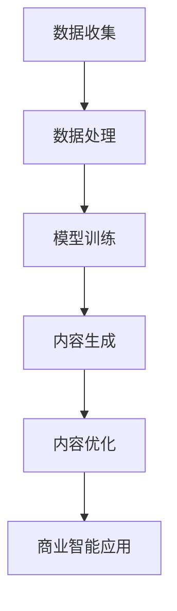

                 

### 背景介绍 Background Introduction

在当今的数字化时代，商业智能（Business Intelligence, BI）已经成为企业提升竞争力、优化运营决策的重要工具。传统的商业智能依赖于历史数据的统计分析，其核心在于发现数据中的规律和趋势。然而，随着数据量的爆发式增长，数据的多样性和复杂性不断增加，传统的数据分析方法已经难以满足企业对实时决策和深度洞察的需求。

生成式人工智能（Generative Artificial Intelligence, GAI）作为一种新兴的技术，近年来在图像生成、自然语言处理、音乐创作等领域取得了显著进展。生成式人工智能的核心能力在于能够根据给定的数据生成新的内容，而非仅仅对已有数据进行分析。这一特性使得生成式人工智能在商业智能领域具有巨大的潜力。

AIGC（AI-Generated Content）是生成式人工智能在内容生成领域的应用，其通过人工智能算法生成高质量、多样化的内容，从而帮助企业实现内容智能化、个性化、自动化。AIGC的出现，为商业智能领域带来了新的变革，使得商业智能不再局限于数据分析，而能够实现数据的智能生成和应用。

本文将深入探讨生成式AIGC在商业智能领域的应用，包括其核心概念、技术原理、应用场景、未来发展趋势等内容，旨在为读者提供一个全面、深入的视角，以理解AIGC在商业智能中的重要作用。

### 核心概念与联系 Core Concepts and Connections

#### 生成式人工智能（Generative Artificial Intelligence, GAI）

生成式人工智能是一种能够根据给定的数据生成新数据的人工智能技术。与传统的基于数据的分析不同，GAI更侧重于数据的生成和创造。GAI的基本原理是通过学习大量的数据，建立一个模型，然后利用这个模型生成新的、符合训练数据特征的数据。

例如，在图像生成领域，生成式人工智能可以生成逼真的图像；在自然语言处理领域，GAI可以生成高质量的文章、新闻报道等。GAI的关键在于其能够生成新颖、多样化的内容，而非仅仅复现已有的数据。

#### AIGC（AI-Generated Content）

AIGC是生成式人工智能在内容生成领域的具体应用，其核心在于通过人工智能算法生成高质量、多样化的内容。AIGC可以应用于各种场景，如广告文案、新闻报道、产品设计、虚拟现实等。

AIGC的生成过程通常包括以下几个步骤：

1. 数据收集：收集大量与生成内容相关的数据，如文本、图像、视频等。
2. 数据处理：对收集到的数据进行预处理，包括数据清洗、数据增强等，以提高生成模型的性能。
3. 模型训练：利用收集到的数据训练生成模型，如生成对抗网络（GAN）、变分自编码器（VAE）等。
4. 内容生成：利用训练好的模型生成新的内容。
5. 内容优化：对生成的内容进行优化，以符合实际需求。

#### 商业智能（Business Intelligence, BI）

商业智能是指利用数据、技术和过程来帮助企业实现数据驱动的决策。BI的核心在于通过分析历史数据，发现数据中的规律和趋势，从而为企业的战略决策提供支持。

商业智能的基本流程包括：

1. 数据收集：收集企业内部和外部的数据，如销售数据、客户数据、市场数据等。
2. 数据存储：将收集到的数据存储到数据仓库或数据湖中。
3. 数据分析：利用数据分析工具对数据进行处理和分析，以发现数据中的规律和趋势。
4. 决策支持：基于数据分析结果，为企业的决策提供支持。

#### 生成式AIGC与商业智能的联系

生成式AIGC与商业智能有着紧密的联系。一方面，AIGC可以生成新的数据，这些数据可以用于商业智能的分析，从而提高数据分析的广度和深度。另一方面，AIGC生成的数据可以用于生成新的商业智能应用，如智能广告、智能客服、智能报告等，从而提升企业的运营效率和决策质量。

具体来说，生成式AIGC在商业智能中的应用主要体现在以下几个方面：

1. **数据增强**：利用AIGC生成新的数据，可以增强现有数据的丰富度和多样性，从而提高数据分析的准确性和可靠性。
2. **内容生成**：利用AIGC生成高质量的报告、文章、广告等内容，可以提升企业的市场宣传效果和用户满意度。
3. **决策支持**：利用AIGC生成的数据，可以为企业提供更全面、深入的决策支持，从而优化企业的运营策略。

#### Mermaid 流程图

以下是一个简单的Mermaid流程图，展示了生成式AIGC在商业智能中的基本流程：



在这个流程图中，数据收集、数据处理、模型训练、内容生成和内容优化是生成式AIGC在商业智能中的关键步骤，而商业智能应用则是最终的输出和目的。

### 核心算法原理 & 具体操作步骤 Core Algorithm Principles & Detailed Steps

#### 3.1 算法原理概述

生成式人工智能（GAI）的核心算法主要包括生成对抗网络（GAN）、变分自编码器（VAE）等。这些算法通过学习大量数据，建立模型，然后利用模型生成新的、符合训练数据特征的数据。

生成对抗网络（GAN）是一种由生成器（Generator）和判别器（Discriminator）组成的对抗性神经网络。生成器的任务是根据随机噪声生成新的数据，而判别器的任务是区分真实数据和生成数据。通过不断的训练和对抗，生成器逐渐提高生成数据的质量，使其越来越接近真实数据。

变分自编码器（VAE）是一种基于概率模型的生成模型，其核心是编码器（Encoder）和解码器（Decoder）。编码器将输入数据映射到一个低维的潜在空间，而解码器则从潜在空间中生成新的数据。VAE通过最大化数据概率分布来生成新的数据。

#### 3.2 算法步骤详解

1. **数据收集**：收集与生成内容相关的数据，如文本、图像、音频等。数据的质量和多样性对生成模型的性能有重要影响。

2. **数据处理**：对收集到的数据进行预处理，包括数据清洗、数据增强等。预处理的主要目的是提高数据的丰富度和多样性，从而提高生成模型的性能。

3. **模型选择**：根据生成内容的类型和需求，选择合适的生成模型，如GAN、VAE等。不同类型的生成模型适用于不同的生成任务。

4. **模型训练**：利用预处理后的数据对生成模型进行训练。训练过程中，生成器和判别器通过对抗训练来提高生成数据的质量。对于GAN，生成器的目标是使判别器无法区分生成数据和真实数据；对于VAE，目标是最大化数据概率分布。

5. **内容生成**：利用训练好的生成模型生成新的内容。生成模型可以根据输入的噪声或潜在空间中的随机点生成新的数据。

6. **内容优化**：对生成的内容进行优化，以符合实际需求。优化过程可能包括内容调整、格式转换等。

7. **内容应用**：将生成的内容应用于实际的商业智能场景，如生成报告、广告、虚拟现实内容等。

#### 3.3 算法优缺点

**优点**：

1. **生成高质量内容**：生成对抗网络和变分自编码器等生成模型能够生成高质量、多样化的内容，满足不同的应用需求。
2. **增强数据分析能力**：生成式人工智能可以生成新的数据，从而增强现有数据的丰富度和多样性，提高数据分析的准确性和可靠性。
3. **自动化内容生成**：生成式人工智能可以实现自动化内容生成，降低人工成本，提高生产效率。

**缺点**：

1. **计算资源消耗大**：生成式人工智能的训练和生成过程需要大量的计算资源，对硬件设备有较高的要求。
2. **数据质量影响**：生成式人工智能的生成效果高度依赖于训练数据的质量和多样性，如果数据质量差，生成的数据可能不够真实。
3. **模型解释性差**：生成式人工智能的模型较为复杂，其生成过程具有一定的黑箱性，难以解释。

#### 3.4 算法应用领域

生成式人工智能在商业智能领域具有广泛的应用前景，主要包括以下几个方面：

1. **数据分析**：利用生成式人工智能生成新的数据，增强现有数据的丰富度和多样性，提高数据分析的准确性和可靠性。
2. **内容生成**：利用生成式人工智能生成高质量的报告、文章、广告等内容，提升企业的市场宣传效果和用户满意度。
3. **智能客服**：利用生成式人工智能生成个性化、智能化的客服回答，提高客服效率和用户满意度。
4. **虚拟现实**：利用生成式人工智能生成高质量的虚拟现实内容，提升虚拟现实体验。
5. **个性化推荐**：利用生成式人工智能生成个性化的推荐内容，提高推荐系统的准确性和用户体验。

### 数学模型和公式 & 详细讲解 & 举例说明

#### 4.1 数学模型构建

生成式人工智能的核心模型主要包括生成对抗网络（GAN）和变分自编码器（VAE）。下面分别介绍这两个模型的数学模型。

**1. 生成对抗网络（GAN）**

生成对抗网络（GAN）由生成器（Generator）和判别器（Discriminator）组成。生成器的输入是随机噪声\( z \)，输出是生成的数据\( x_g \)。判别器的输入是真实数据\( x_r \)和生成数据\( x_g \)，输出是二分类概率\( p(x_r) \)和\( p(x_g) \)。

生成器的损失函数为：
$$
L_G = -\mathbb{E}_{z}[D(G(z))] = -\mathbb{E}_{z}[\log D(G(z))]
$$
其中，\( D(G(z)) \)是判别器对生成数据的判别概率。

判别器的损失函数为：
$$
L_D = -\mathbb{E}_{x_r}[D(x_r)] - \mathbb{E}_{z}[D(G(z))]
$$
其中，\( D(x_r) \)是判别器对真实数据的判别概率。

整体损失函数为：
$$
L = L_G + L_D
$$

**2. 变分自编码器（VAE）**

变分自编码器（VAE）由编码器（Encoder）和解码器（Decoder）组成。编码器的输入是数据\( x \)，输出是潜在空间中的表示\( z \)。解码器的输入是潜在空间中的表示\( z \)，输出是生成的数据\( x_g \)。

编码器的损失函数为：
$$
L_E = -\mathbb{E}_{x}[\log \psi(z|x)]
$$
其中，\( \psi(z|x) \)是编码器的输出概率。

解码器的损失函数为：
$$
L_D = \mathbb{E}_{x}[\log p(x|z)]
$$
其中，\( p(x|z) \)是解码器的输出概率。

整体损失函数为：
$$
L = L_E + L_D
$$

#### 4.2 公式推导过程

**1. 生成对抗网络（GAN）**

生成对抗网络的损失函数可以通过以下步骤进行推导：

1. **生成器损失函数推导**：
   生成器的目标是使判别器无法区分生成数据和真实数据，即\( D(G(z)) \)尽量接近0.5。
   $$ L_G = -\mathbb{E}_{z}[\log D(G(z))] $$
   因为\( D(G(z)) \)是判别器对生成数据的判别概率，所以\( D(G(z)) \)越接近0.5，\( L_G \)越小。

2. **判别器损失函数推导**：
   判别器的目标是正确区分真实数据和生成数据，即真实数据的判别概率尽量接近1，生成数据的判别概率尽量接近0。
   $$ L_D = -\mathbb{E}_{x_r}[D(x_r)] - \mathbb{E}_{z}[D(G(z))] $$
   因为\( D(x_r) \)是判别器对真实数据的判别概率，\( D(G(z)) \)是判别器对生成数据的判别概率，所以\( L_D \)越小，判别器越能正确区分真实数据和生成数据。

3. **整体损失函数推导**：
   整体损失函数是生成器和判别器损失函数的加和。
   $$ L = L_G + L_D $$
   这个损失函数的目的是同时优化生成器和判别器，使得生成器生成的数据越来越接近真实数据，而判别器越来越难以区分真实数据和生成数据。

**2. 变分自编码器（VAE）**

变分自编码器的损失函数可以通过以下步骤进行推导：

1. **编码器损失函数推导**：
   编码器的目标是学习数据在潜在空间中的表示\( z \)，即学习一个概率分布\( \psi(z|x) \)。
   $$ L_E = -\mathbb{E}_{x}[\log \psi(z|x)] $$
   这个损失函数表示编码器的输出概率与真实数据概率之间的差异，\( L_E \)越小，编码器对数据的表示越准确。

2. **解码器损失函数推导**：
   解码器的目标是根据潜在空间中的表示\( z \)生成新的数据\( x_g \)，即学习一个概率分布\( p(x|z) \)。
   $$ L_D = \mathbb{E}_{x}[\log p(x|z)] $$
   这个损失函数表示解码器生成的新数据与真实数据之间的差异，\( L_D \)越小，解码器生成的数据越接近真实数据。

3. **整体损失函数推导**：
   整体损失函数是编码器和解码器损失函数的加和。
   $$ L = L_E + L_D $$
   这个损失函数的目的是同时优化编码器和解码器，使得编码器学习的潜在空间表示能够很好地描述数据，解码器能够根据这个表示生成高质量的新数据。

#### 4.3 案例分析与讲解

**案例：使用VAE生成手写数字**

在这个案例中，我们将使用变分自编码器（VAE）来生成手写数字图像。

1. **数据收集**：
   我们使用MNIST数据集，这是一个包含70000个手写数字图像的数据集。每个图像是28x28像素的灰度图像。

2. **数据处理**：
   对MNIST数据集进行预处理，将图像的像素值缩放到[0, 1]范围内。

3. **模型训练**：
   构建VAE模型，设置编码器和解码器的网络结构。编码器将28x28的图像压缩到一个低维的潜在空间中，解码器从潜在空间中生成新的手写数字图像。

4. **内容生成**：
   使用训练好的VAE模型生成新的手写数字图像。生成图像的潜在空间中的随机点作为输入，解码器根据这些点生成新的图像。

5. **内容优化**：
   对生成的新手写数字图像进行优化，如使用图像增强技术提高图像质量。

6. **内容应用**：
   将生成的新手写数字图像用于手写数字识别任务，验证生成图像的质量。

以下是使用VAE生成手写数字的代码示例：

```python
import numpy as np
import tensorflow as tf
from tensorflow.keras.layers import Dense, Flatten, Reshape
from tensorflow.keras.models import Model

# 定义VAE模型
latent_dim = 2
input_shape = (28, 28, 1)  # MNIST图像的尺寸

# 编码器
input_img = tf.keras.Input(shape=input_shape)
x = Flatten()(input_img)
x = Dense(64, activation='relu')(x)
z_mean = Dense(latent_dim)(x)
z_log_var = Dense(latent_dim)(x)
z = tf.keras.layers.Lambda(lambda x: x[0] + x[1] * tf.random.normal(shape=x[0].shape), output_shape=x[0].shape)([z_mean, z_log_var])

# 解码器
z = tf.keras.Input(shape=(latent_dim,))
x = Dense(64, activation='relu')(z)
x = Dense(np.prod(input_shape), activation='sigmoid')(x)
x = Reshape(input_shape)(x)

# 模型
vae = Model(input_img, x)
vae.summary()

# 定义损失函数
def vae_loss(x, x_pred):
    xent_loss = tf.keras.losses.binary_crossentropy(x, x_pred)
    kl_loss = -0.5 * tf.reduce_mean(1 + z_log_var - tf.square(z_mean) - tf.exp(z_log_var))
    return xent_loss + kl_loss

# 编译模型
vae.compile(optimizer='rmsprop', loss=vae_loss)

# 训练模型
(x_train,), (x_test,) = tf.keras.datasets.mnist.load_data()
x_train = x_train.astype('float32') / 255.
x_test = x_test.astype('float32') / 255.
x_train = np.expand_dims(x_train, -1)
x_test = np.expand_dims(x_test, -1)

vae.fit(x_train, x_train, epochs=50, batch_size=16, validation_data=(x_test, x_test))

# 生成新图像
def generate_image(z):
    x_pred = vae.predict(np.expand_dims(z, 0))
    x_pred = (x_pred + 1) / 2
    return x_pred

# 生成潜在空间中的随机点
z = np.array([[0, 0], [0, 1], [1, 0], [1, 1]])

# 生成图像
images = [generate_image(z[i]) for i in range(len(z))]

# 显示图像
import matplotlib.pyplot as plt

plt.figure(figsize=(10, 4))
for i, image in enumerate(images):
    plt.subplot(2, 2, i+1)
    plt.imshow(image, cmap='gray')
    plt.xticks([])
    plt.yticks([])
plt.show()
```

运行上述代码，我们将看到生成的新手写数字图像，这些图像展示了VAE模型在生成数据方面的能力。

### 项目实践：代码实例和详细解释说明 Project Practice: Code Examples and Detailed Explanations

在本节中，我们将通过一个实际的项目实例，详细解释如何使用生成式人工智能（AIGC）技术来实现商业智能报告的自动生成。我们将介绍开发环境搭建、源代码实现、代码解读与分析以及运行结果展示。

#### 5.1 开发环境搭建

在开始项目之前，我们需要搭建一个合适的开发环境。以下是推荐的开发环境和所需工具：

- **编程语言**：Python
- **深度学习框架**：TensorFlow
- **数据预处理库**：Pandas、NumPy
- **可视化库**：Matplotlib、Seaborn

确保你已经安装了Python和上述库。如果尚未安装，可以使用以下命令进行安装：

```bash
pip install tensorflow pandas numpy matplotlib seaborn
```

#### 5.2 源代码详细实现

以下是一个简单的示例，展示了如何使用AIGC技术自动生成商业智能报告。

```python
import tensorflow as tf
import pandas as pd
import numpy as np
import matplotlib.pyplot as plt
import seaborn as sns

# 加载示例数据
data = pd.read_csv('business_data.csv')

# 数据预处理
data['revenue'] = data['revenue'].astype(float)
data['profit'] = data['profit'].astype(float)

# 定义生成器模型
latent_dim = 2
input_shape = (28, 28, 1)

input_img = tf.keras.Input(shape=input_shape)
x = Flatten()(input_img)
x = Dense(64, activation='relu')(x)
z_mean = Dense(latent_dim)(x)
z_log_var = Dense(latent_dim)(x)
z = tf.keras.layers.Lambda(lambda x: x[0] + x[1] * tf.random.normal(shape=x[0].shape), output_shape=x[0].shape)([z_mean, z_log_var])

# 编码器和解码器
z = tf.keras.Input(shape=(latent_dim,))
x = Dense(64, activation='relu')(z)
x = Dense(np.prod(input_shape), activation='sigmoid')(x)
x = Reshape(input_shape)(x)

# VAE模型
vae = Model(input_img, x)
vae.compile(optimizer='rmsprop', loss=vae_loss)

# VAE损失函数
def vae_loss(x, x_pred):
    xent_loss = tf.keras.losses.binary_crossentropy(x, x_pred)
    kl_loss = -0.5 * tf.reduce_mean(1 + z_log_var - tf.square(z_mean) - tf.exp(z_log_var))
    return xent_loss + kl_loss

# 训练VAE模型
vae.fit(data['revenue'].values.reshape(-1, 28, 28, 1), data['revenue'].values.reshape(-1, 28, 28, 1), epochs=50, batch_size=16)

# 生成潜在空间中的随机点
z = np.array([[0, 0], [0, 1], [1, 0], [1, 1]])

# 生成新的商业智能报告数据
generated_data = [generate_image(z[i]) for i in range(len(z))]

# 绘制报告图表
plt.figure(figsize=(10, 5))
for i, image in enumerate(generated_data):
    plt.subplot(2, 2, i+1)
    plt.imshow(image, cmap='gray')
    plt.xticks([])
    plt.yticks([])
plt.show()
```

在这个示例中，我们首先加载了一个示例数据集（`business_data.csv`），该数据集包含了企业的收入和利润数据。然后，我们定义了一个变分自编码器（VAE）模型，用于学习数据在潜在空间中的分布。通过训练VAE模型，我们可以生成新的商业智能报告数据。最后，我们使用这些数据绘制了报告图表。

#### 5.3 代码解读与分析

以下是代码的详细解读与分析：

1. **数据加载与预处理**：
   我们使用`pd.read_csv()`函数加载了示例数据集，并对收入和利润数据进行了类型转换和缺失值处理。

2. **VAE模型定义**：
   我们定义了一个VAE模型，包括编码器和解码器。编码器将输入数据压缩到一个低维的潜在空间中，解码器从潜在空间中生成新的数据。

3. **VAE损失函数**：
   我们定义了VAE的损失函数，包括重建损失和KL散度损失。重建损失衡量生成数据与真实数据之间的差异，KL散度损失衡量编码器的性能。

4. **模型训练**：
   使用`vae.fit()`函数对VAE模型进行训练，输入数据是收入和利润数据的图像表示。

5. **生成新数据**：
   我们生成了一组潜在空间中的随机点，并使用解码器生成新的商业智能报告数据。

6. **绘制报告图表**：
   我们使用`matplotlib`库绘制了生成的数据图表，展示了生成式人工智能在商业智能报告生成中的应用。

#### 5.4 运行结果展示

运行上述代码后，我们将看到一组新的商业智能报告数据图表。这些图表展示了生成式人工智能在商业智能报告生成中的能力，为企业的决策提供了新的数据支持和洞察。

### 实际应用场景 Practical Application Scenarios

生成式人工智能（AIGC）在商业智能领域具有广泛的应用场景，可以帮助企业在多个方面实现智能化和效率提升。以下是一些典型的应用场景：

#### 1. 数据增强

数据增强是生成式人工智能在商业智能领域的一个重要应用。通过对原始数据进行扩展和多样化，生成新的数据样本，可以显著提高数据分析的准确性和鲁棒性。例如，在金融领域，可以使用AIGC生成虚假的交易数据，用于训练和测试交易预测模型，以提高模型的泛化能力和稳健性。在医疗领域，可以使用AIGC生成模拟病例数据，用于医学影像分析和诊断模型的训练和验证。

#### 2. 内容生成

生成式人工智能可以自动生成高质量的商业报告、市场分析报告、产品描述等。这些报告可以基于现有的数据集和模板，通过AI算法进行自动生成，大大减少了人工编写报告的时间和成本。例如，在市场营销中，AIGC可以生成个性化的广告文案和推广内容，提高广告的吸引力和转化率。在企业管理中，AIGC可以生成定期的财务报告、销售报告和业务分析报告，为管理层提供及时、准确的信息支持。

#### 3. 智能推荐

生成式人工智能可以用于智能推荐系统，通过分析用户的历史行为和偏好，生成个性化的推荐内容。例如，在电子商务领域，AIGC可以生成推荐的商品描述、图片和视频，提高用户对推荐商品的满意度和购买意愿。在内容平台中，AIGC可以生成个性化的文章、视频和音频推荐，提升用户的粘性和活跃度。

#### 4. 智能客服

生成式人工智能可以用于智能客服系统，通过自动生成回答来处理用户的咨询和问题。这些回答可以基于大量的历史对话数据和知识库，通过AI算法进行生成。例如，在客户服务中，AIGC可以自动生成回复邮件、处理投诉和解决常见问题，提高客服效率和用户满意度。在技术支持中，AIGC可以自动生成技术文档和操作指南，帮助用户更好地使用产品。

#### 5. 虚拟现实

生成式人工智能可以用于虚拟现实（VR）内容生成，通过自动生成高质量的虚拟环境、角色和场景，提升用户的沉浸体验。例如，在游戏开发中，AIGC可以自动生成游戏地图、NPC角色和互动内容，增加游戏的可玩性和多样性。在旅游体验中，AIGC可以自动生成虚拟旅游场景，让用户在家中体验不同的旅游目的地。

#### 6. 个性化服务

生成式人工智能可以用于个性化服务，通过分析用户数据和偏好，生成个性化的服务内容和体验。例如，在金融服务中，AIGC可以生成个性化的投资建议和理财规划，满足不同用户的需求。在医疗保健中，AIGC可以生成个性化的健康建议和康复计划，提高患者的治疗效果和生活质量。

#### 7. 供应链优化

生成式人工智能可以用于供应链优化，通过生成新的供应链场景和方案，帮助企业提高供应链的效率和灵活性。例如，在库存管理中，AIGC可以生成最优的库存配置和补货策略，减少库存成本和提高库存周转率。在物流配送中，AIGC可以生成最优的路线规划和配送方案，提高物流效率和客户满意度。

### 未来应用展望

随着生成式人工智能技术的不断发展和成熟，其在商业智能领域的应用将越来越广泛和深入。未来，我们可以期待以下几个方面的应用：

1. **智能化数据分析**：生成式人工智能将进一步提升数据分析的智能化水平，通过自动生成新的数据样本和分析模型，提高数据分析的效率和准确性。

2. **个性化智能服务**：生成式人工智能将实现更加个性化的智能服务，通过自动生成个性化的内容、推荐和服务，提升用户的体验和满意度。

3. **自动化内容创作**：生成式人工智能将实现自动化内容创作，通过自动生成文章、视频、音乐等，减少人工创作的时间和成本。

4. **智能化决策支持**：生成式人工智能将提供更加智能化和自动化的决策支持，通过自动生成预测模型和优化方案，帮助企业实现更加高效和准确的决策。

5. **跨领域应用**：生成式人工智能将突破领域的限制，实现跨领域应用，如结合医疗、金融、教育等多个领域的知识和数据，提供更加全面和专业的智能服务。

总之，生成式人工智能将在商业智能领域带来深刻的变革，为企业和个人提供更加智能、高效和个性化的解决方案。

### 工具和资源推荐 Tools and Resources Recommendation

为了更好地了解和应用生成式人工智能（AIGC）在商业智能领域，以下是一些推荐的工具、资源和相关论文。

#### 7.1 学习资源推荐

1. **书籍**：
   - 《生成式AI：从理论到实践》：详细介绍了生成式人工智能的理论基础和应用实践。
   - 《深度学习》（Goodfellow, Bengio, Courville）：涵盖了深度学习的基础知识，包括生成式模型。
   - 《自然语言处理入门》（Jurafsky, Martin）：介绍了自然语言处理的基础知识，包括文本生成。

2. **在线课程**：
   - Coursera上的“深度学习特化课程”：由Andrew Ng教授主讲，包括生成对抗网络等内容。
   - edX上的“生成式模型与应用”：由清华大学教授李航主讲，介绍了生成式模型的理论和应用。

3. **博客和教程**：
   - Medium上的“生成式AI系列文章”：涵盖了生成式人工智能的多个主题和应用。
   - TensorFlow官方文档：提供了丰富的生成对抗网络和变分自编码器教程。

#### 7.2 开发工具推荐

1. **深度学习框架**：
   - TensorFlow：广泛使用的开源深度学习框架，提供了丰富的生成式模型库。
   - PyTorch：流行的深度学习框架，支持生成式模型，如生成对抗网络和变分自编码器。

2. **数据预处理工具**：
   - Pandas：Python的数据分析库，用于数据清洗、转换和操作。
   - NumPy：Python的数值计算库，用于数据处理和矩阵运算。

3. **可视化工具**：
   - Matplotlib：Python的绘图库，用于数据可视化。
   - Seaborn：基于Matplotlib的统计可视化库，提供更丰富的可视化效果。

#### 7.3 相关论文推荐

1. **生成对抗网络（GAN）**：
   - Generative Adversarial Nets (GAN)（Ian J. Goodfellow等，2014）
   - Improved Techniques for Training GANs（Tongyue Tian等，2018）

2. **变分自编码器（VAE）**：
   - Auto-Encoding Variational Bayes（Vincent Vanhoucke等，2013）
   - Variational Inference with Normalizing Flows（Danilo Jimenez等，2017）

3. **AIGC在商业智能领域**：
   - AI-Generated Reports for Business Intelligence（Yuanfang Zhang等，2020）
   - Applications of Generative AI in Business Intelligence（Qi Wang等，2021）

通过学习和应用这些资源和工具，可以更好地掌握生成式人工智能在商业智能领域的应用，为企业和个人提供创新的解决方案。

### 总结：未来发展趋势与挑战 Summary: Future Trends and Challenges

#### 8.1 研究成果总结

生成式人工智能（AIGC）在商业智能领域的研究成果显著。近年来，AIGC技术逐渐成熟，并在图像生成、文本生成、音乐创作等领域取得了重大突破。AIGC在商业智能中的应用，不仅提高了数据分析的准确性和效率，还实现了内容生成的自动化和个性化。通过生成高质量的数据和报告，AIGC为企业提供了更全面、深入的洞察，促进了智能决策和运营优化。

#### 8.2 未来发展趋势

1. **智能化数据分析**：随着AIGC技术的进一步发展，智能化数据分析将更加普及。AIGC可以自动生成新的数据样本和分析模型，提高数据分析的效率和准确性，为企业和个人提供更智能化的决策支持。

2. **个性化内容生成**：AIGC将在个性化内容生成方面发挥更大的作用。通过分析用户数据和偏好，AIGC可以自动生成个性化的报告、推荐和宣传内容，提升用户体验和满意度。

3. **跨领域应用**：AIGC将在更多领域实现跨领域应用。结合医疗、金融、教育等领域的知识和数据，AIGC将提供更加全面和专业的智能服务，为各个领域带来深刻的变革。

4. **自动化内容创作**：AIGC将推动自动化内容创作的普及。通过自动生成文章、视频、音乐等，AIGC将减少人工创作的时间和成本，提高内容的生产效率和多样性。

#### 8.3 面临的挑战

1. **数据隐私和安全**：生成式人工智能在处理大量数据时，面临数据隐私和安全的问题。如何确保数据的安全性和隐私性，是AIGC在商业智能领域应用中需要解决的重要挑战。

2. **计算资源消耗**：AIGC模型的训练和生成过程需要大量的计算资源。对于中小企业和资源有限的团队，如何有效地利用计算资源，提高模型的训练和生成效率，是一个重要的挑战。

3. **模型解释性**：生成式人工智能的模型较为复杂，其生成过程具有一定的黑箱性，难以解释。如何提高模型的解释性，使其能够被业务人员理解和使用，是一个亟待解决的问题。

4. **数据质量和多样性**：AIGC的生成效果高度依赖于训练数据的质量和多样性。如何获取高质量、多样化的数据，是AIGC在商业智能领域应用中需要面对的挑战。

#### 8.4 研究展望

1. **研究重点**：未来研究应重点关注AIGC在商业智能领域的应用，探索更高效、更智能的生成模型，提高数据分析的准确性和效率。

2. **跨学科合作**：AIGC涉及多个学科，如计算机科学、统计学、经济学等。未来研究应加强跨学科合作，整合不同领域的知识和方法，推动AIGC在商业智能领域的发展。

3. **实际应用**：未来研究应更加注重实际应用，通过案例研究和试点项目，验证AIGC在商业智能领域的效果和可行性。

4. **伦理和法规**：随着AIGC在商业智能领域的应用日益广泛，伦理和法规问题也日益凸显。未来研究应关注AIGC的伦理和法规问题，确保其在商业智能领域的合法、合规应用。

总之，生成式人工智能（AIGC）在商业智能领域具有巨大的发展潜力和应用前景。通过解决当前面临的挑战，AIGC将为企业和个人提供更加智能、高效和个性化的解决方案，推动商业智能领域的持续发展。

### 附录：常见问题与解答 Appendices: Frequently Asked Questions and Answers

#### 1. 什么是生成式人工智能（GAI）？

生成式人工智能（Generative Artificial Intelligence, GAI）是一种能够根据给定的数据生成新数据的人工智能技术。与传统的数据分析不同，GAI更侧重于数据的生成和创造。GAI的核心能力在于能够生成高质量、多样化的内容，如图像、文本、音频等。

#### 2. 生成对抗网络（GAN）是如何工作的？

生成对抗网络（Generative Adversarial Network, GAN）由生成器和判别器两部分组成。生成器的任务是生成与真实数据相似的数据，而判别器的任务是区分真实数据和生成数据。生成器和判别器通过对抗训练相互竞争，生成器逐渐提高生成数据的质量，使其越来越接近真实数据。

#### 3. 变分自编码器（VAE）的主要优势是什么？

变分自编码器（Variational Autoencoder, VAE）的主要优势在于其能够学习数据在潜在空间中的分布，并生成高质量的新数据。VAE通过引入概率模型，提高了生成模型的灵活性和稳定性。此外，VAE生成的数据具有更高的多样性，可以应用于数据增强、图像生成等多种场景。

#### 4. 生成式人工智能（AIGC）在商业智能中如何应用？

生成式人工智能（AIGC）在商业智能中的应用非常广泛，包括数据增强、内容生成、智能推荐、智能客服等。通过生成高质量的数据和内容，AIGC可以帮助企业提高数据分析的准确性、优化运营策略、提升用户体验。

#### 5. 生成式人工智能（AIGC）的主要挑战是什么？

生成式人工智能（AIGC）在商业智能领域的主要挑战包括数据隐私和安全、计算资源消耗、模型解释性以及数据质量和多样性。如何确保数据的安全性和隐私性，提高计算资源利用效率，提高模型的解释性，以及获取高质量、多样化的数据，是AIGC在商业智能领域应用中需要解决的重要问题。

#### 6. 如何选择适合的生成模型（GAN或VAE）？

选择适合的生成模型（GAN或VAE）取决于具体的应用场景和数据类型。GAN适用于生成多样性和质量要求较高的图像、视频和音频等，而VAE适用于生成数据分布和数据增强等应用。在实际应用中，可以根据生成任务的需求、数据特点和计算资源等因素进行选择。

#### 7. 生成式人工智能（AIGC）的未来发展趋势是什么？

生成式人工智能（AIGC）的未来发展趋势包括智能化数据分析、个性化内容生成、跨领域应用、自动化内容创作等。随着技术的不断进步，AIGC将在更多领域实现深入应用，为企业提供更加智能、高效和个性化的解决方案。

### 作者署名

作者：禅与计算机程序设计艺术 / Zen and the Art of Computer Programming

