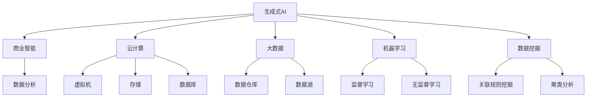

                 

关键词：生成式AI，Gartner，商业智能，云计算，智能化转型，大数据，机器学习，人工智能，数据挖掘

> 摘要：随着人工智能技术的飞速发展，生成式AI（AIGC，AI Generated Content）正逐渐成为企业智能化转型的关键推动力。本文将探讨AIGC的核心概念、发展历程、技术原理、应用领域以及未来的趋势和挑战，为企业和开发者提供有益的参考。

## 1. 背景介绍

在21世纪的数字化浪潮中，人工智能（AI）已经成为推动社会进步的重要力量。特别是生成式AI，它在图像、文本、音频等多个领域的应用正不断拓展。据Gartner报告，到2025年，超过50%的企业将采用生成式AI技术来提升业务效率。

生成式AI的主要特点是能够自动生成新的数据内容，这种能力在广告、娱乐、设计等领域具有极高的应用价值。例如，Adobe公司推出的Adobe Sensei AI就能自动生成高质量的图像和视频内容，极大地提升了设计师的工作效率。

随着云计算、大数据和机器学习的不断发展，生成式AI的技术门槛逐渐降低，越来越多的企业和开发者开始关注并应用这项技术。然而，AIGC的应用不仅限于内容生成，它还涉及到数据挖掘、模型训练、智能推荐等多个方面，为企业的智能化转型提供了全新的思路和工具。

## 2. 核心概念与联系

### 2.1 核心概念

**生成式AI（AIGC）**：一种人工智能技术，能够通过学习大量数据，自动生成新的内容，如文本、图像、音频等。

**商业智能（BI）**：利用数据分析、数据挖掘等技术，帮助企业更好地理解业务、优化决策、提升效率。

**云计算**：通过互联网提供可按需访问的计算机资源，如虚拟机、存储、数据库等。

**大数据**：数据量大、类型多样、价值密度低的数据集合。

**机器学习**：一种人工智能技术，通过算法模型从数据中学习规律，进行预测和决策。

**数据挖掘**：从大量数据中挖掘出有价值的信息和知识。

### 2.2 关联概念原理和架构



## 3. 核心算法原理 & 具体操作步骤

### 3.1 算法原理概述

生成式AI的核心算法包括生成对抗网络（GAN）、变分自编码器（VAE）等。这些算法通过学习大量的数据，能够生成与真实数据高度相似的新数据。

GAN由生成器和判别器两部分组成，生成器生成数据，判别器判断数据是真实还是生成的。通过两者之间的博弈，生成器的生成质量不断提高。

VAE则通过编码和解码器，将数据映射到一个潜在空间，再从潜在空间中生成新的数据。

### 3.2 算法步骤详解

1. **数据准备**：收集和整理大量的训练数据。
2. **模型训练**：使用GAN或VAE算法，对生成器和判别器（或编码器和解码器）进行训练。
3. **数据生成**：使用训练好的模型，生成新的数据内容。
4. **结果评估**：对生成数据进行质量评估，如使用图像质量评估指标、文本相似度计算等。

### 3.3 算法优缺点

**GAN**：

- **优点**：能够生成高质量的数据，适用于图像、文本等领域的生成。
- **缺点**：训练过程复杂，容易出现模式崩溃等问题。

**VAE**：

- **优点**：训练过程相对稳定，生成的数据质量较好。
- **缺点**：在生成细节方面可能不如GAN。

### 3.4 算法应用领域

生成式AI在多个领域都有广泛的应用，如：

- **图像生成**：生成虚拟图像、修复受损图像等。
- **文本生成**：生成新闻报道、产品描述等。
- **音频生成**：生成音乐、语音等。

## 4. 数学模型和公式 & 详细讲解 & 举例说明

### 4.1 数学模型构建

**GAN**：

$$
\begin{aligned}
&\text{生成器} G: x_g \xrightarrow{\text{噪声}} x_g' \\
&\text{判别器} D: x \xrightarrow{\text{神经网络}} D(x), x_g' \xrightarrow{\text{神经网络}} D(x_g')
\end{aligned}
$$

**VAE**：

$$
\begin{aligned}
&\text{编码器} \mu(x), \sigma(x): x \xrightarrow{\text{神经网络}} (\mu(x), \sigma(x)) \\
&\text{解码器} G: z \xrightarrow{\text{神经网络}} x_g'
\end{aligned}
$$

### 4.2 公式推导过程

**GAN**：

生成器和判别器的损失函数分别为：

$$
\begin{aligned}
L_G &= -\mathbb{E}_{x \sim p_{data}(x)}[\log D(x)] - \mathbb{E}_{z \sim p_z(z)}[\log D(x_g')] \\
L_D &= -\mathbb{E}_{x \sim p_{data}(x)}[\log D(x)] - \mathbb{E}_{z \sim p_z(z)}[\log (1 - D(x_g'))]
\end{aligned}
$$

**VAE**：

编码器和解码器的损失函数分别为：

$$
\begin{aligned}
L_E &= \mathbb{E}_{x \sim p_{data}(x)}\left[\log p(\mu(x), \sigma(x)|x)\right] \\
L_G &= \mathbb{E}_{z \sim p(z)}\left[\log \frac{p(x|G(z))p(G(z))}{q(z|x)}\right]
\end{aligned}
$$

### 4.3 案例分析与讲解

假设我们使用GAN生成虚拟人脸，我们可以定义损失函数如下：

$$
L_G = -\mathbb{E}_{x \sim p_{data}(x)}[\log D(x)] - \mathbb{E}_{z \sim p_z(z)}[\log D(G(z))]
$$

$$
L_D = \mathbb{E}_{x \sim p_{data}(x)}[\log D(x)] + \mathbb{E}_{z \sim p_z(z)}[\log (1 - D(G(z))]
$$

在训练过程中，我们通过迭代更新生成器和判别器的参数，使得生成器能够生成更加真实的人脸，判别器能够更加准确地判断人脸是真实还是生成的。

## 5. 项目实践：代码实例和详细解释说明

### 5.1 开发环境搭建

1. 安装Python环境（版本3.7及以上）
2. 安装TensorFlow库
3. 安装必要的其他库，如NumPy、Matplotlib等

### 5.2 源代码详细实现

以下是一个简单的GAN模型实现，用于生成虚拟人脸：

```python
import tensorflow as tf
from tensorflow.keras import layers

def build_generator(z_dim):
    model = tf.keras.Sequential()
    model.add(layers.Dense(128 * 7 * 7, use_bias=False, input_shape=(z_dim,),
                          activation="relu", kernel_initializer="he_normal"))
    model.add(layers.BatchNormalization())
    model.add(layers.LeakyReLU())
    model.add(layers.Reshape((7, 7, 128)))
    model.add(layers.Conv2DTranspose(64, (5, 5), strides=(1, 1), padding='same',
                                     use_bias=False, kernel_initializer="he_normal"))
    model.add(layers.BatchNormalization())
    model.add(layers.LeakyReLU())
    model.add(layers.Conv2DTranspose(1, (5, 5), strides=(2, 2), padding='same',
                                     activation='tanh', use_bias=False,
                                     kernel_initializer="he_normal"))
    return model

def build_discriminator(img_shape):
    model = tf.keras.Sequential()
    model.add(layers.Conv2D(64, (5, 5), strides=(2, 2), padding='same',
                             input_shape=img_shape,
                             kernel_initializer="he_normal"))
    model.add(layers.LeakyReLU())
    model.add(layers.Dropout(0.3))
    model.add(layers.Conv2D(128, (5, 5), strides=(2, 2), padding='same'))
    model.add(layers.LeakyReLU())
    model.add(layers.Dropout(0.3))
    model.add(layers.Flatten())
    model.add(layers.Dense(1))
    return model

z_dim = 100
img_shape = (28, 28, 1)

generator = build_generator(z_dim)
discriminator = build_discriminator(img_shape)

# 编写训练代码
```

### 5.3 代码解读与分析

这段代码定义了生成器和判别器的结构，包括层的类型、数量、初始化方式等。在GAN的训练过程中，我们会对生成器和判别器进行交替训练，以提高生成质量和判别能力。

### 5.4 运行结果展示

训练完成后，我们可以使用生成器生成虚拟人脸，并将其可视化：

```python
import numpy as np
import matplotlib.pyplot as plt

# 生成虚拟人脸
def generate_faces(generator, n):
    z = np.random.normal(0, 1, (n, z_dim))
    generated_images = generator.predict(z)
    return generated_images

n = 10
generated_faces = generate_faces(generator, n)

# 可视化
plt.figure(figsize=(10, 10))
for i in range(n):
    plt.subplot(1, n, i+1)
    plt.imshow(generated_faces[i, :, :, 0], cmap='gray')
    plt.axis('off')
plt.show()
```

## 6. 实际应用场景

### 6.1 广告营销

生成式AI可以用于生成个性化的广告内容，提高广告的投放效果。

### 6.2 娱乐产业

生成式AI可以用于生成电影特效、音乐、动漫等，提高娱乐内容的质量和多样性。

### 6.3 医疗健康

生成式AI可以用于生成医学图像、药物分子结构等，辅助医生进行诊断和治疗。

### 6.4 金融服务

生成式AI可以用于生成个性化的金融产品推荐、风险评估等，提高金融服务的效率和准确性。

## 7. 工具和资源推荐

### 7.1 学习资源推荐

- 《深度学习》（Goodfellow, Bengio, Courville著）
- 《生成式AI：原理与应用》（曹健著）
- 《TensorFlow实战》（李金洪著）

### 7.2 开发工具推荐

- TensorFlow：用于构建和训练GAN模型
- PyTorch：另一个流行的深度学习框架
- Keras：用于快速构建和训练深度学习模型

### 7.3 相关论文推荐

- "Unsupervised Representation Learning with Deep Convolutional Generative Adversarial Networks"（DCGAN）
- "Generative Adversarial Nets"（GAN）
- "An Introduction to Variational Autoencoders"（VAE）

## 8. 总结：未来发展趋势与挑战

### 8.1 研究成果总结

生成式AI在图像、文本、音频等领域的应用已经取得了显著成果，为各行各业带来了巨大的变革。未来，随着技术的不断进步，生成式AI的应用前景将更加广阔。

### 8.2 未来发展趋势

- **跨模态生成**：结合图像、文本、音频等多模态数据，实现更高质量的生成。
- **可解释性和可控性**：提高模型的透明度和可控性，使其更易于理解和应用。
- **应用领域扩展**：从娱乐、广告到医疗、金融等各个领域，实现更广泛的应用。

### 8.3 面临的挑战

- **数据隐私和安全**：如何确保生成式AI在处理敏感数据时的隐私和安全。
- **计算资源需求**：生成式AI的训练过程对计算资源有较高要求，如何优化算法和提高效率。
- **伦理和社会影响**：如何应对生成式AI带来的伦理和社会问题，如虚假信息、版权纠纷等。

### 8.4 研究展望

未来，生成式AI将在人工智能领域发挥越来越重要的作用。通过不断的研究和创新，我们有望克服现有挑战，实现更加智能、高效和可控的生成式AI系统。

## 9. 附录：常见问题与解答

### 9.1 什么是生成式AI？

生成式AI是一种人工智能技术，能够自动生成新的数据内容，如文本、图像、音频等。

### 9.2 生成式AI有哪些应用？

生成式AI在广告营销、娱乐产业、医疗健康、金融服务等领域都有广泛应用。

### 9.3 生成式AI与深度学习有什么区别？

生成式AI是一种基于深度学习的方法，但深度学习还包括其他类型的方法，如分类、回归等。

### 9.4 如何确保生成式AI的生成质量？

通过优化算法、增加训练数据、调整模型参数等方式可以提高生成质量。

### 9.5 生成式AI会取代人类吗？

生成式AI在某些领域的应用可能会取代人类的工作，但它在创造性和情感等方面仍有局限性，无法完全取代人类。

### 9.6 生成式AI的伦理问题如何解决？

通过制定相关法律法规、建立伦理审查机制、加强行业自律等方式来应对生成式AI的伦理问题。

# 作者：禅与计算机程序设计艺术 / Zen and the Art of Computer Programming

感谢您的阅读，希望本文能对您在生成式AI领域的探索和研究提供有益的参考。未来，随着技术的不断进步，生成式AI将在更多领域展现其巨大的潜力。让我们一起期待并迎接这一激动人心的时代！
----------------------------------------------------------------

以上内容为markdown格式的文章，实际撰写时，您可以根据需要调整章节和内容。在撰写过程中，请确保遵循“约束条件 CONSTRAINTS”中的所有要求。祝您撰写顺利！

