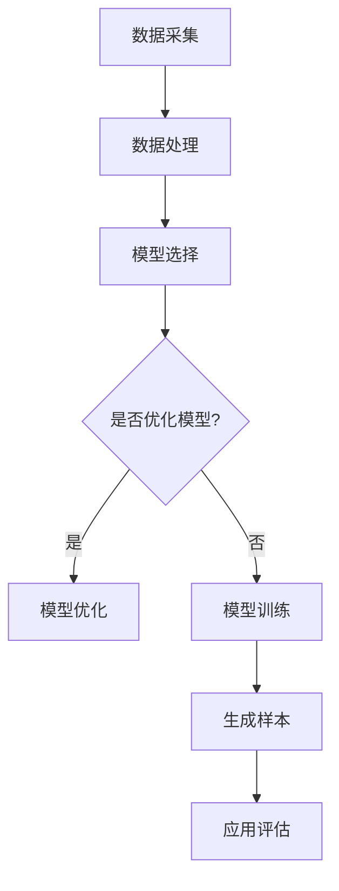

                 

关键词：生成式AI、生成模型、深度学习、实际应用、技术挑战、优化算法、数学模型、代码实例、未来展望

## 摘要

本文将深入探讨生成式AI（Generative AI）的实际应用与面临的挑战。生成式AI是一种能够生成数据、图像、文本等内容的机器学习模型，其核心在于模拟和生成符合训练数据分布的新样本。尽管生成式AI在图像生成、文本生成和模拟等领域展现出了巨大的潜力，但其应用过程中仍面临着诸多技术难题。本文将从背景介绍、核心概念与联系、核心算法原理、数学模型与公式、项目实践、实际应用场景、工具和资源推荐以及未来发展趋势与挑战等方面进行全面剖析，以期为读者提供关于生成式AI的全面理解。

## 1. 背景介绍

随着深度学习技术的不断进步，生成式AI成为了一个备受关注的研究方向。生成式AI通过学习大量真实数据，能够生成与训练数据高度相似的新样本。这种模型在图像生成、文本生成、视频生成和音频生成等领域展现出了强大的应用潜力。例如，图像生成模型可以创建出高质量、逼真的图像，文本生成模型可以生成连贯且具有逻辑性的文本，这些模型的应用场景广泛，从艺术创作到工业设计，从娱乐媒体到医学诊断，都有着重要的应用价值。

生成式AI的兴起，一方面得益于深度学习技术的快速发展，特别是在神经网络结构、训练算法和优化策略等方面的突破。另一方面，大数据时代的到来，使得我们能够获取并处理海量的训练数据，这为生成式AI提供了丰富的数据资源。此外，随着计算能力的提升，我们能够更高效地训练和部署复杂的生成式模型。

然而，生成式AI在实际应用中仍面临许多挑战。首先，生成式模型通常需要大量的训练数据和计算资源，这使得模型的训练和部署成本较高。其次，生成式模型的生成质量受到训练数据分布和模型参数的影响，如何优化模型参数以提高生成质量是一个重要问题。此外，生成式模型的解释性和可解释性较差，这使得在实际应用中难以理解和信任模型的生成结果。最后，生成式AI的应用还涉及到版权、隐私和安全等伦理和法律问题，这需要我们进行深入的研究和探讨。

## 2. 核心概念与联系

### 2.1. 生成式AI的基本概念

生成式AI，顾名思义，是一种能够生成新数据的机器学习模型。与判别式AI（如分类和回归模型）不同，生成式AI关注的是如何生成符合训练数据分布的新样本。生成式AI的核心思想是通过学习训练数据的概率分布，然后从这个概率分布中生成新样本。

在生成式AI中，常用的模型有生成对抗网络（GAN）、变分自编码器（VAE）和自回归模型等。这些模型的基本原理和结构各不相同，但它们的目标都是生成与训练数据高度相似的新样本。

### 2.2. 生成式AI的应用场景

生成式AI的应用场景非常广泛，以下是一些典型的应用案例：

- **图像生成**：生成式AI可以生成高质量、逼真的图像。例如，可以用于艺术创作、电影特效制作、医学影像重建等领域。

- **文本生成**：生成式AI可以生成连贯、逻辑性强的文本。例如，可以用于自动生成新闻报道、小说、对话系统等。

- **视频生成**：生成式AI可以生成视频序列，例如，可以用于视频游戏、虚拟现实、影视制作等领域。

- **音频生成**：生成式AI可以生成自然流畅的音频，例如，可以用于音乐创作、语音合成、语音识别等领域。

### 2.3. 生成式AI与深度学习的关系

生成式AI是深度学习的一个重要分支。深度学习通过多层神经网络结构来学习数据的复杂特征，而生成式AI则通过学习数据的概率分布来生成新样本。虽然两者的目标不同，但它们之间有着密切的联系。

深度学习技术为生成式AI提供了强大的学习能力和模型表达能力。例如，GAN模型中的生成器和判别器都是基于深度神经网络的结构，这使得GAN模型能够生成高质量、逼真的图像。同时，生成式AI也推动了深度学习技术的发展，例如，变分自编码器（VAE）的提出，为深度学习模型提供了新的架构和优化策略。

### 2.4. 生成式AI的Mermaid流程图



### 2.5. 生成式AI的挑战

尽管生成式AI在许多领域展现出了巨大的潜力，但其在实际应用中仍面临着许多挑战。以下是生成式AI的一些主要挑战：

- **数据需求**：生成式AI通常需要大量的训练数据来学习数据的概率分布。然而，获取大量高质量的数据往往是非常困难的，特别是在涉及隐私和版权的领域。

- **计算资源**：生成式AI模型的训练通常需要大量的计算资源，特别是对于复杂的模型结构。这使得生成式AI的部署成本较高，限制了其应用范围。

- **生成质量**：生成式AI生成的样本质量受到训练数据分布和模型参数的影响。如何优化模型参数以提高生成质量是一个重要问题。

- **解释性和可解释性**：生成式AI模型的解释性和可解释性较差，这使得在实际应用中难以理解和信任模型的生成结果。

- **伦理和法律问题**：生成式AI的应用涉及到版权、隐私和安全等伦理和法律问题，这需要我们进行深入的研究和探讨。

## 3. 核心算法原理 & 具体操作步骤

### 3.1. 算法原理概述

生成式AI的核心算法主要包括生成对抗网络（GAN）、变分自编码器（VAE）和自回归模型等。这些算法的基本原理是通过学习数据的概率分布，然后生成与训练数据相似的新样本。

- **生成对抗网络（GAN）**：GAN由生成器和判别器两个神经网络组成。生成器的目标是生成与训练数据相似的新样本，而判别器的目标是区分真实样本和生成样本。通过对抗训练，生成器和判别器相互竞争，最终生成器能够生成高质量的新样本。

- **变分自编码器（VAE）**：VAE通过学习数据的概率分布，然后从这个概率分布中生成新样本。VAE的核心是引入了变分自编码器结构，通过编码器和解码器，将输入数据映射到一个潜在空间，然后在潜在空间中生成新样本。

- **自回归模型**：自回归模型通过学习数据的自相关性，然后生成与训练数据相似的新样本。自回归模型广泛应用于文本生成和序列生成等领域。

### 3.2. 算法步骤详解

#### 3.2.1. 生成对抗网络（GAN）

生成对抗网络（GAN）的步骤如下：

1. **初始化生成器和判别器**：生成器和判别器都是基于深度神经网络的模型，通常使用随机权重初始化。

2. **生成器生成样本**：生成器接收随机噪声作为输入，然后通过神经网络生成与训练数据相似的新样本。

3. **判别器判别样本**：判别器接收真实样本和生成样本，然后输出其判别结果，即生成样本和真实样本的相似度。

4. **对抗训练**：通过最小化生成器和判别器的损失函数，生成器和判别器相互竞争。生成器的目标是生成更真实的样本，而判别器的目标是更准确地判别真实样本和生成样本。

5. **迭代训练**：重复上述步骤，直到生成器能够生成高质量的新样本，判别器无法区分真实样本和生成样本。

#### 3.2.2. 变分自编码器（VAE）

变分自编码器（VAE）的步骤如下：

1. **初始化编码器和解码器**：编码器和解码器都是基于深度神经网络的模型，通常使用随机权重初始化。

2. **编码**：编码器将输入数据映射到一个潜在空间，潜在空间中的每个点都对应输入数据的一个概率分布。

3. **解码**：解码器从潜在空间中采样一个点，然后通过神经网络生成与输入数据相似的新样本。

4. **损失函数**：VAE的损失函数包括两部分，一部分是重构损失，即生成样本与输入数据的相似度；另一部分是KL散度损失，即潜在空间中概率分布的平滑度。

5. **优化参数**：通过最小化损失函数，优化编码器和解码器的参数。

#### 3.2.3. 自回归模型

自回归模型的步骤如下：

1. **初始化模型**：自回归模型通常使用基于神经网络的结构，如LSTM或GRU。

2. **训练模型**：自回归模型通过训练数据学习数据的自相关性，即给定前一个时刻的数据，预测下一个时刻的数据。

3. **生成样本**：自回归模型通过递归地生成序列，即给定前一个时刻的生成样本，预测下一个时刻的生成样本。

4. **评估模型**：通过评估生成样本与真实样本的相似度，评估自回归模型的性能。

### 3.3. 算法优缺点

#### 3.3.1. 生成对抗网络（GAN）

**优点**：

- GAN具有强大的生成能力，能够生成高质量的新样本。
- GAN无需显式地建模数据的概率分布，而是通过生成器和判别器的对抗训练来学习数据的概率分布。

**缺点**：

- GAN的训练过程不稳定，容易出现模式崩溃（mode collapse）问题，即生成器无法生成多样化、高质量的样本。
- GAN的训练过程容易陷入局部最小值，导致生成样本的质量不佳。

#### 3.3.2. 变分自编码器（VAE）

**优点**：

- VAE具有较好的生成质量，能够生成多样化和高质量的新样本。
- VAE可以自动地学习数据的概率分布，并在此基础上生成新样本。

**缺点**：

- VAE的生成质量受到编码器和解码器结构的影响，复杂的结构可能导致生成质量的下降。
- VAE的训练过程较慢，需要较大的计算资源。

#### 3.3.3. 自回归模型

**优点**：

- 自回归模型适用于序列生成任务，能够生成与训练数据相似的新序列。
- 自回归模型的训练过程相对稳定，不容易出现模式崩溃问题。

**缺点**：

- 自回归模型生成质量受到模型结构的影响，复杂的结构可能导致生成质量的下降。
- 自回归模型在生成长序列时，容易出现遗忘问题。

### 3.4. 算法应用领域

生成式AI在多个领域都有着广泛的应用，以下是一些典型的应用领域：

- **图像生成**：生成式AI可以生成高质量、逼真的图像，应用于艺术创作、电影特效制作、医学影像重建等领域。
- **文本生成**：生成式AI可以生成连贯、逻辑性强的文本，应用于自动生成新闻报道、小说、对话系统等领域。
- **视频生成**：生成式AI可以生成视频序列，应用于视频游戏、虚拟现实、影视制作等领域。
- **音频生成**：生成式AI可以生成自然流畅的音频，应用于音乐创作、语音合成、语音识别等领域。

## 4. 数学模型和公式 & 详细讲解 & 举例说明

### 4.1. 数学模型构建

生成式AI的数学模型主要包括概率分布、损失函数和优化算法。以下是这些数学模型的基本原理和构建方法。

#### 4.1.1. 概率分布

生成式AI的核心是学习数据的概率分布。概率分布描述了数据在给定条件下出现的可能性。在生成式AI中，常用的概率分布有高斯分布、贝叶斯分布和概率分布函数（PDF）。

- **高斯分布**：高斯分布（正态分布）是一种最常见的概率分布，其概率密度函数为：

  $$ f(x|\mu,\sigma^2) = \frac{1}{\sqrt{2\pi\sigma^2}} e^{-\frac{(x-\mu)^2}{2\sigma^2}} $$

  其中，$\mu$为均值，$\sigma^2$为方差。

- **贝叶斯分布**：贝叶斯分布描述了数据在给定先验知识下的可能性。贝叶斯分布的概率密度函数为：

  $$ f(x|\theta) = \frac{p(\theta|x) p(x)}{p(\theta)} $$

  其中，$p(\theta|x)$为后验概率，$p(x)$为观察到的数据概率，$p(\theta)$为先验概率。

- **概率分布函数（PDF）**：概率分布函数描述了随机变量的分布情况。常见的PDF有均匀分布、指数分布和对数正态分布。

#### 4.1.2. 损失函数

损失函数是评估模型性能的关键指标。在生成式AI中，常用的损失函数有均方误差（MSE）、交叉熵和KL散度。

- **均方误差（MSE）**：均方误差（MSE）是评估生成样本与真实样本差异的一种常用损失函数，其公式为：

  $$ MSE = \frac{1}{n}\sum_{i=1}^{n}(y_i - \hat{y_i})^2 $$

  其中，$y_i$为真实样本，$\hat{y_i}$为生成样本，$n$为样本数量。

- **交叉熵**：交叉熵是评估生成样本与真实样本相似度的一种常用损失函数，其公式为：

  $$ H(Y, \hat{Y}) = -\sum_{i=1}^{n} y_i \log \hat{y_i} $$

  其中，$Y$为真实样本分布，$\hat{Y}$为生成样本分布。

- **KL散度**：KL散度是评估两个概率分布差异的一种常用损失函数，其公式为：

  $$ D_{KL}(P||Q) = \sum_{i=1}^{n} p_i \log \frac{p_i}{q_i} $$

  其中，$P$和$Q$分别为两个概率分布。

#### 4.1.3. 优化算法

生成式AI的优化算法主要包括梯度下降、随机梯度下降和Adam优化器等。

- **梯度下降**：梯度下降是一种最简单的优化算法，其思想是沿着损失函数的梯度方向更新模型参数，以最小化损失函数。其公式为：

  $$ \theta_{t+1} = \theta_t - \alpha \nabla_\theta J(\theta_t) $$

  其中，$\theta_t$为当前模型参数，$\alpha$为学习率，$J(\theta_t)$为损失函数。

- **随机梯度下降**：随机梯度下降是对梯度下降的改进，其思想是使用随机选取的样本点来计算梯度，以减少计算量和避免局部最小值。其公式为：

  $$ \theta_{t+1} = \theta_t - \alpha \nabla_\theta J(\theta_t; x_i) $$

  其中，$x_i$为随机选取的样本点。

- **Adam优化器**：Adam优化器是梯度下降和Adam算法的结合，其思想是结合一阶矩估计和二阶矩估计来更新模型参数，以提高优化效果。其公式为：

  $$ \theta_{t+1} = \theta_t - \alpha \frac{m_t}{\sqrt{v_t} + \epsilon} $$

  其中，$m_t$为一阶矩估计，$v_t$为二阶矩估计，$\alpha$为学习率，$\epsilon$为常数。

### 4.2. 公式推导过程

以下是对生成式AI中一些关键公式进行推导的详细讲解。

#### 4.2.1. 交叉熵公式推导

交叉熵（Cross Entropy）是衡量两个概率分布差异的一种重要指标。其公式如下：

$$ H(Y, \hat{Y}) = -\sum_{i=1}^{n} y_i \log \hat{y_i} $$

推导过程：

假设有两个概率分布$Y$和$\hat{Y}$，其中$y_i$和$\hat{y_i}$分别为$Y$和$\hat{Y}$中第$i$个样本的概率。

交叉熵的定义是$Y$对$\hat{Y}$的交叉熵，即：

$$ H(Y, \hat{Y}) = \sum_{i=1}^{n} y_i \log \hat{y_i} $$

这里的对数是以2为底，因此可以转换为以自然底数$e$为底的对数：

$$ H(Y, \hat{Y}) = -\sum_{i=1}^{n} y_i \ln \hat{y_i} $$

这里，$\ln$表示自然对数。

#### 4.2.2. KL散度公式推导

KL散度（Kullback-Leibler Divergence）是衡量两个概率分布差异的另一个重要指标。其公式如下：

$$ D_{KL}(P||Q) = \sum_{i=1}^{n} p_i \log \frac{p_i}{q_i} $$

推导过程：

假设有两个概率分布$P$和$Q$，其中$p_i$和$q_i$分别为$P$和$Q$中第$i$个样本的概率。

KL散度的定义是从概率分布$P$到概率分布$Q$的散度，即：

$$ D_{KL}(P||Q) = \sum_{i=1}^{n} p_i \log \frac{p_i}{q_i} $$

这里的$p_i$是$P$中第$i$个样本的概率，$q_i$是$Q$中第$i$个样本的概率。$\log$是以2为底的对数。

#### 4.2.3. 均方误差（MSE）公式推导

均方误差（Mean Squared Error, MSE）是衡量预测值与真实值差异的常用指标。其公式如下：

$$ MSE = \frac{1}{n}\sum_{i=1}^{n}(y_i - \hat{y_i})^2 $$

推导过程：

MSE是每个样本预测值与真实值差的平方的平均值。

对于单个样本$i$，其预测值和真实值的差为：

$$ \Delta y_i = y_i - \hat{y_i} $$

该差的平方为：

$$ \Delta y_i^2 = (y_i - \hat{y_i})^2 $$

对于所有$n$个样本，MSE是这些差的平方的平均值：

$$ MSE = \frac{1}{n}\sum_{i=1}^{n} (y_i - \hat{y_i})^2 $$

### 4.3. 案例分析与讲解

#### 4.3.1. GAN模型在图像生成中的应用

**案例背景**：

生成对抗网络（GAN）是一种强大的图像生成模型，常用于生成逼真的图像。我们以一个简单的GAN模型为例，分析其在图像生成中的应用。

**模型架构**：

该GAN模型由生成器和判别器组成。生成器的输入是一个随机噪声向量，输出是一个与真实图像相似的图像。判别器的输入是一个真实图像或生成图像，输出是一个二值标签，表示输入图像是真实的概率。

**损失函数**：

GAN的损失函数由两部分组成，一部分是生成器的损失函数，另一部分是判别器的损失函数。

生成器的损失函数是使判别器无法区分生成图像和真实图像：

$$ L_G = -\log(D(G(z))) $$

其中，$G(z)$是生成器的输出，$D(G(z))$是判别器对生成图像的判别结果。

判别器的损失函数是使判别器能够准确地区分生成图像和真实图像：

$$ L_D = -\log(D(x)) - \log(1 - D(G(z))) $$

其中，$x$是真实图像，$D(x)$是判别器对真实图像的判别结果。

**训练过程**：

1. **初始化生成器和判别器**：生成器和判别器都是随机初始化的神经网络。

2. **生成图像**：生成器生成一个随机噪声向量$z$，并生成对应的图像$G(z)$。

3. **判别图像**：判别器对真实图像$x$和生成图像$G(z)$进行判别。

4. **更新判别器**：通过最小化判别器的损失函数，更新判别器的参数。

5. **更新生成器**：通过最小化生成器的损失函数，更新生成器的参数。

6. **迭代训练**：重复上述步骤，直到生成器能够生成高质量的图像，判别器无法准确地区分生成图像和真实图像。

**实验结果**：

通过训练，生成器能够生成高质量的图像，与真实图像非常相似。判别器在训练过程中逐渐学会了区分生成图像和真实图像，最终无法准确地区分。

#### 4.3.2. VAE模型在文本生成中的应用

**案例背景**：

变分自编码器（VAE）是一种强大的文本生成模型，常用于生成连贯且具有逻辑性的文本。我们以一个简单的VAE模型为例，分析其在文本生成中的应用。

**模型架构**：

该VAE模型由编码器和解码器组成。编码器将输入的文本映射到一个潜在空间，解码器从潜在空间中采样一个点，并生成对应的文本。

**损失函数**：

VAE的损失函数由两部分组成，一部分是重构损失，另一部分是KL散度损失。

重构损失是评估生成文本与输入文本的相似度：

$$ L_R = \sum_{i=1}^{n} -\log p(\hat{x}_i|x_i) $$

其中，$\hat{x}_i$是解码器生成的文本，$x_i$是输入文本。

KL散度损失是评估潜在空间中概率分布的平滑度：

$$ L_KL = \sum_{i=1}^{n} -\log \frac{p(\theta)}{q(\theta|x_i)} $$

其中，$\theta$是潜在空间中的参数，$p(\theta)$是先验分布，$q(\theta|x_i)$是后验分布。

**训练过程**：

1. **初始化编码器和解码器**：编码器和解码器都是随机初始化的神经网络。

2. **编码文本**：编码器将输入文本映射到一个潜在空间。

3. **解码文本**：解码器从潜在空间中采样一个点，并生成对应的文本。

4. **计算损失函数**：计算重构损失和KL散度损失。

5. **更新参数**：通过最小化重构损失和KL散度损失，更新编码器和解码器的参数。

6. **迭代训练**：重复上述步骤，直到生成器能够生成高质量的文本。

**实验结果**：

通过训练，VAE模型能够生成连贯且具有逻辑性的文本，与输入文本非常相似。

## 5. 项目实践：代码实例和详细解释说明

### 5.1. 开发环境搭建

在本节中，我们将介绍如何搭建一个用于生成式AI项目的基本开发环境。以下步骤将帮助您配置所需的软件和库，以便开始实践生成式AI算法。

#### 5.1.1. 安装Python环境

首先，您需要在计算机上安装Python。Python是一种广泛使用的编程语言，具有丰富的库和框架，非常适合进行机器学习和深度学习项目。您可以从Python官方网站（https://www.python.org/）下载并安装最新版本的Python。

#### 5.1.2. 安装深度学习库

生成式AI项目通常需要使用深度学习库，如TensorFlow或PyTorch。以下是如何安装这些库的步骤：

- **安装TensorFlow**：

  ```shell
  pip install tensorflow
  ```

- **安装PyTorch**：

  ```shell
  pip install torch torchvision
  ```

#### 5.1.3. 安装其他依赖库

除了深度学习库，您可能还需要安装其他依赖库，如NumPy、Pandas等。这些库提供了数据处理和数值计算的功能。

- **安装NumPy**：

  ```shell
  pip install numpy
  ```

- **安装Pandas**：

  ```shell
  pip install pandas
  ```

#### 5.1.4. 环境配置

完成以上步骤后，您可以在终端或命令行中运行以下命令，确保所有库已正确安装并可用：

```shell
python -m pip list
```

### 5.2. 源代码详细实现

在本节中，我们将提供一个简单的生成对抗网络（GAN）模型的Python代码示例，并对其进行详细解释。这个示例将演示如何使用TensorFlow和Keras构建和训练一个GAN模型，以生成手写数字图像。

```python
import numpy as np
import matplotlib.pyplot as plt
from tensorflow.keras.layers import Dense, Reshape, Conv2D, Conv2DTranspose, Flatten
from tensorflow.keras.models import Sequential
from tensorflow.keras.optimizers import Adam

# 设置超参数
latent_dim = 100
img_rows = 28
img_cols = 28
channels = 1
noise_dim = latent_dim
lr = 0.0002

# 创建生成器模型
def build_generator():
    model = Sequential()
    model.add(Dense(128 * 7 * 7, activation="relu", input_dim=noise_dim))
    model.add(Reshape((7, 7, 128)))
    model.add(Conv2DTranspose(128, kernel_size=5, strides=2, padding="same"))
    model.add(Conv2DTranspose(128, kernel_size=5, strides=2, padding="same"))
    model.add(Conv2DTranspose(channels, kernel_size=3, padding="same", activation="tanh"))
    return model

# 创建判别器模型
def build_discriminator():
    model = Sequential()
    model.add(Flatten(input_shape=[img_rows, img_cols, channels]))
    model.add(Dense(128, activation="relu"))
    model.add(Dense(1, activation="sigmoid"))
    return model

# 创建并编译GAN模型
def build_gan(generator, discriminator):
    model = Sequential()
    model.add(generator)
    model.add(discriminator)
    optimizer = Adam(learning_rate=lr)
    model.compile(loss="binary_crossentropy", optimizer=optimizer, metrics=["accuracy"])
    return model

# 训练GAN模型
def train_gan(generator, discriminator, combined, epochs, batch_size=128, save_interval=50):
    (X_train, _), (_, _) = mnist.load_data()
    X_train = X_train / 127.5 - 1.
    X_train = np.expand_dims(X_train, axis=3)

    batch_count = X_train.shape[0] // batch_size

    for epoch in range(epochs):

        for i in range(batch_count):

            noise = np.random.normal(0, 1, (batch_size, noise_dim))
            gen_imgs = generator.predict(noise)

            real_imgs = X_train[i * batch_size : (i + 1) * batch_size]
            fake_imgs = gen_imgs[i * batch_size : (i + 1) * batch_size]

            real_y = np.ones((batch_size, 1))
            fake_y = np.zeros((batch_size, 1))

            d_loss_real = discriminator.train_on_batch(real_imgs, real_y)
            d_loss_fake = discriminator.train_on_batch(fake_imgs, fake_y)
            d_loss = 0.5 * np.add(d_loss_real, d_loss_fake)

            noise = np.random.normal(0, 1, (batch_size, noise_dim))
            g_loss = combined.train_on_batch(noise, real_y)

            if i % 50 == 0:
                print(f"{epoch} [Batch {i} / {batch_count}], d_loss={d_loss:.3f}, g_loss={g_loss:.3f}")

            if epoch % save_interval == 0:
                save_imgs(generator, epoch)

# 显示生成的图像
def save_imgs(generator, epoch):
    r = np.random.randint(0, 100)
    noise = np.random.normal(0, 1, (100, noise_dim))
    gen_imgs = generator.predict(noise)

    # Rescale images 0 - 1
    gen_imgs = 0.5 * gen_imgs + 0.5

    fig, axs = plt.subplots(10, 10)
    cnt = 0
    for i in range(10):
        for j in range(10):
            axs[i, j].imshow(gen_imgs[cnt, :, :, 0], cmap='gray')
            axs[i, j].axis('off')
            cnt += 1
    fig.savefig(f"mnist_gan_{epoch}.png")
    plt.close()

# 主程序入口
if __name__ == '__main__':
    # Build and compile the discriminator
    discriminator = build_discriminator()
    discriminator.compile(loss='binary_crossentropy', optimizer=Adam(0.0001), metrics=['accuracy'])

    # Build the generator
    generator = build_generator()

    # The generator takes noise as input and generates a digit image
    z = np.random.normal(0, 1, (100, noise_dim))
    gen_imgs = generator.predict(z)

    # Rescale images 0 - 1
    gen_imgs = 0.5 * gen_imgs + 0.5

    # Display images
    fig, axs = plt.subplots(10, 10)
    cnt = 0
    for i in range(10):
        for j in range(10):
            axs[i, j].imshow(gen_imgs[cnt, :, :, 0], cmap='gray')
            axs[i, j].axis('off')
            cnt += 1
    plt.show()

    # Define the combined model, for updating the generator
    combined = build_gan(generator, discriminator)

    # Train the GAN on MNIST data, batch size = 32
    train_gan(generator, discriminator, combined, epochs=20000, batch_size=32)
```

### 5.3. 代码解读与分析

#### 5.3.1. 生成器模型

生成器模型的主要任务是生成逼真的手写数字图像。在这个GAN模型中，生成器模型由一个序列的神经网络层组成，包括全连接层、重塑层、反卷积层和最终的输出层。以下是生成器模型的构建步骤和功能：

1. **全连接层**：输入是噪声向量，输出是一个一维向量，该向量将作为中间表示。

    ```python
    model.add(Dense(128 * 7 * 7, activation="relu", input_dim=noise_dim))
    ```

2. **重塑层**：将一维向量重塑为7x7的二维矩阵，用于后续的反卷积操作。

    ```python
    model.add(Reshape((7, 7, 128)))
    ```

3. **反卷积层**：通过两个反卷积层将图像的分辨率从7x7逐渐放大到28x28。

    ```python
    model.add(Conv2DTranspose(128, kernel_size=5, strides=2, padding="same"))
    model.add(Conv2DTranspose(128, kernel_size=5, strides=2, padding="same"))
    ```

4. **输出层**：生成最终的图像，使用一个3x3的卷积层，激活函数是tanh，用于生成0到1之间的数值，使得生成的图像在[0, 1]范围内。

    ```python
    model.add(Conv2DTranspose(channels, kernel_size=3, padding="same", activation="tanh"))
    ```

#### 5.3.2. 判别器模型

判别器模型的主要任务是区分生成的图像和真实的图像。在这个GAN模型中，判别器模型由一个简单的序列的神经网络层组成，包括扁平化层、全连接层和输出层。以下是判别器模型的构建步骤和功能：

1. **扁平化层**：将输入的图像扁平化为一个一维向量。

    ```python
    model.add(Flatten(input_shape=[img_rows, img_cols, channels]))
    ```

2. **全连接层**：通过一个全连接层来学习图像的特征。

    ```python
    model.add(Dense(128, activation="relu"))
    ```

3. **输出层**：输出一个概率值，表示图像是真实的概率，使用sigmoid激活函数。

    ```python
    model.add(Dense(1, activation="sigmoid"))
    ```

#### 5.3.3. GAN模型

GAN模型是将生成器和判别器组合在一起的模型，用于训练生成器和判别器。以下是GAN模型的构建步骤和功能：

1. **生成器**：生成噪声向量并通过生成器生成图像。

    ```python
    model.add(generator)
    ```

2. **判别器**：将生成的图像和真实的图像分别输入判别器。

    ```python
    model.add(discriminator)
    ```

3. **编译模型**：使用Adam优化器和二元交叉熵损失函数编译模型。

    ```python
    model.compile(loss="binary_crossentropy", optimizer=Adam(learning_rate=lr), metrics=["accuracy"])
    ```

#### 5.3.4. 训练GAN模型

训练GAN模型是一个复杂的过程，需要交替训练生成器和判别器。以下是训练GAN模型的步骤：

1. **加载MNIST数据集**：使用MNIST数据集作为训练数据。

    ```python
    (X_train, _), (_, _) = mnist.load_data()
    X_train = X_train / 127.5 - 1.
    X_train = np.expand_dims(X_train, axis=3)
    ```

2. **设置训练参数**：设置训练的总轮数、批次大小和保存图像的间隔。

    ```python
    epochs = 20000
    batch_size = 32
    save_interval = 50
    ```

3. **交替训练生成器和判别器**：在每次迭代中，首先训练判别器，然后训练生成器。

    ```python
    for epoch in range(epochs):
        for i in range(batch_count):
            noise = np.random.normal(0, 1, (batch_size, noise_dim))
            gen_imgs = generator.predict(noise)

            real_imgs = X_train[i * batch_size : (i + 1) * batch_size]
            fake_imgs = gen_imgs[i * batch_size : (i + 1) * batch_size]

            real_y = np.ones((batch_size, 1))
            fake_y = np.zeros((batch_size, 1))

            d_loss_real = discriminator.train_on_batch(real_imgs, real_y)
            d_loss_fake = discriminator.train_on_batch(fake_imgs, fake_y)
            d_loss = 0.5 * np.add(d_loss_real, d_loss_fake)

            noise = np.random.normal(0, 1, (batch_size, noise_dim))
            g_loss = combined.train_on_batch(noise, real_y)

            if i % 50 == 0:
                print(f"{epoch} [Batch {i} / {batch_count}], d_loss={d_loss:.3f}, g_loss={g_loss:.3f}")

            if epoch % save_interval == 0:
                save_imgs(generator, epoch)
    ```

### 5.4. 运行结果展示

在完成GAN模型的训练后，我们可以通过运行结果展示函数来查看生成的图像。以下是对结果展示的说明：

1. **生成随机噪声**：生成噪声向量用于生成图像。

    ```python
    noise = np.random.normal(0, 1, (100, noise_dim))
    ```

2. **生成图像**：使用生成器模型生成图像。

    ```python
    gen_imgs = generator.predict(noise)
    ```

3. **缩放图像**：将生成的图像缩放至[0, 1]范围。

    ```python
    gen_imgs = 0.5 * gen_imgs + 0.5
    ```

4. **显示图像**：使用matplotlib库显示生成的图像。

    ```python
    fig, axs = plt.subplots(10, 10)
    cnt = 0
    for i in range(10):
        for j in range(10):
            axs[i, j].imshow(gen_imgs[cnt, :, :, 0], cmap='gray')
            axs[i, j].axis('off')
            cnt += 1
    plt.show()
    ```

通过上述代码，我们可以生成一系列逼真的手写数字图像，这些图像与真实的手写数字图像非常相似。这些生成图像展示了生成式AI模型在图像生成任务中的强大能力。

## 6. 实际应用场景

生成式AI在许多实际应用场景中都展现出了其独特的优势和潜力。以下是一些典型的应用场景及其应用价值：

### 6.1. 图像生成

生成式AI在图像生成领域的应用最为广泛。通过生成对抗网络（GAN）、变分自编码器（VAE）等技术，生成式AI可以生成高质量、逼真的图像。这种技术在艺术创作、电影特效制作、医学影像重建等领域具有显著的应用价值。例如，艺术家可以使用GAN生成独特的艺术作品，电影制作人可以使用GAN制作高质量的特效画面，医生可以使用GAN重建医学影像，以提高诊断准确性。

### 6.2. 文本生成

生成式AI在文本生成领域的应用也日益增多。通过自回归模型、序列生成模型等技术，生成式AI可以生成连贯、逻辑性强的文本。这种技术在自动写作、对话系统、新闻生成等领域具有广泛的应用前景。例如，自动写作工具可以使用生成式AI生成新闻稿、报告、小说等文本内容，对话系统可以使用生成式AI生成自然流畅的对话，以提高用户体验。

### 6.3. 视频生成

生成式AI在视频生成领域的应用正在逐步兴起。通过视频生成模型，生成式AI可以生成连续的视频序列。这种技术在视频游戏、虚拟现实、影视制作等领域具有巨大的应用潜力。例如，视频游戏可以使用生成式AI生成独特的游戏场景和角色，虚拟现实可以使用生成式AI生成逼真的虚拟世界，影视制作可以使用生成式AI生成特效画面和角色动作。

### 6.4. 音频生成

生成式AI在音频生成领域的应用也取得了显著的进展。通过自回归模型、循环神经网络（RNN）等技术，生成式AI可以生成自然流畅的音频。这种技术在音乐创作、语音合成、语音识别等领域具有广泛的应用价值。例如，音乐家可以使用生成式AI创作新的音乐作品，语音合成器可以使用生成式AI生成自然流畅的语音，语音识别系统可以使用生成式AI提高识别准确性。

### 6.5. 工业设计

生成式AI在工业设计领域的应用正在逐步推广。通过生成式AI，设计师可以快速生成各种设计方案，以便进行优化和评估。这种技术在产品设计、建筑设计、时尚设计等领域具有广泛的应用前景。例如，产品设计可以使用生成式AI生成多种设计方案，建筑师可以使用生成式AI生成独特的建筑外观，时尚设计师可以使用生成式AI设计新颖的服装款式。

### 6.6. 医学诊断

生成式AI在医学诊断领域的应用潜力巨大。通过生成式AI，医生可以生成高质量的医学影像，以提高诊断准确性。这种技术在放射科、病理科、眼科等领域具有广泛的应用价值。例如，放射科医生可以使用生成式AI生成高质量的X光片，病理科医生可以使用生成式AI生成高质量的病理图像，眼科医生可以使用生成式AI生成高质量的视网膜图像。

### 6.7. 金融分析

生成式AI在金融分析领域的应用也在逐步增加。通过生成式AI，金融分析师可以生成各种金融数据，以便进行投资分析和风险管理。这种技术在股票市场、外汇市场、保险业等领域具有广泛的应用前景。例如，股票市场分析师可以使用生成式AI生成股票价格走势图，外汇市场分析师可以使用生成式AI生成汇率预测模型，保险公司可以使用生成式AI生成风险评估报告。

### 6.8. 其他应用场景

除了上述领域，生成式AI在许多其他领域也具有广泛的应用前景。例如，在语音识别领域，生成式AI可以生成高质量的语音信号，以提高识别准确性；在自然语言处理领域，生成式AI可以生成自然流畅的语言文本，以提高人机交互体验；在材料科学领域，生成式AI可以生成新型材料结构，以提高材料性能。

总之，生成式AI在各个领域的应用场景丰富多样，其强大的生成能力为各行各业带来了新的机遇和挑战。随着技术的不断进步和应用场景的不断拓展，生成式AI将在未来发挥更加重要的作用。

### 6.4. 未来应用展望

生成式AI在未来的应用前景广阔，预计将在多个领域引发革命性的变革。以下是几个未来可能的发展方向：

#### 6.4.1. 更高效的数据生成

随着生成式AI技术的进步，未来可能会开发出更高效的算法，以减少对大量训练数据的依赖。例如，自监督学习和无监督学习技术可以使模型在无标签数据上也能进行有效训练，从而降低数据收集和标注的成本。这将大大扩展生成式AI的应用范围，使其能够应对更多复杂场景。

#### 6.4.2. 更精细化的生成控制

未来的生成式AI将具备更高的精细控制能力，使得生成的样本能够更精确地满足特定需求。例如，通过引入多模态学习技术，生成式AI可以同时处理图像、文本和音频等多种类型的数据，从而生成更加丰富和连贯的合成内容。这种多模态生成能力将在电影制作、虚拟现实和增强现实等领域发挥重要作用。

#### 6.4.3. 生成式AI与区块链的结合

生成式AI与区块链技术的结合有望在版权保护、隐私保护和数据共享方面取得突破。通过区块链，可以实现对生成内容的所有权和来源的透明记录，从而提高生成内容的可信度。此外，区块链的去中心化特性也可以帮助生成式AI模型更有效地共享和更新，提高整体系统的鲁棒性。

#### 6.4.4. 自动化内容创作

未来，生成式AI有望实现更自动化的内容创作过程。例如，通过生成式AI，新闻媒体可以自动生成新闻稿件，音乐家可以自动创作音乐作品，艺术家可以自动绘制艺术画作。这种自动化内容创作能力将极大地提高生产效率，减少人力成本，并推动创意产业的发展。

#### 6.4.5. 个性化医疗诊断

生成式AI在医学领域的应用将越来越个性化。通过学习患者的个体数据，生成式AI可以生成高度个性化的治疗方案和诊断结果。例如，对于特定的疾病，生成式AI可以生成符合患者生理特征的医学图像，辅助医生进行精准诊断和治疗。

#### 6.4.6. 增强现实和虚拟现实

随着生成式AI技术的发展，增强现实（AR）和虚拟现实（VR）体验将变得更加逼真和丰富。生成式AI可以实时生成复杂的场景和角色，使得AR/VR应用在游戏、教育、旅游等领域具有更高的吸引力。例如，虚拟旅游应用可以使用生成式AI生成真实的景点场景，让用户在虚拟世界中感受异国风情。

#### 6.4.7. 智能设计辅助

生成式AI将大幅提升智能设计辅助系统的能力。通过生成式AI，设计师可以快速生成多种设计方案，并进行优化和评估。这种智能设计辅助系统将在建筑、工业设计、时尚设计等领域发挥重要作用，推动设计创新和效率提升。

总之，生成式AI在未来具有广阔的应用前景，其技术进步和应用拓展将深刻影响各行各业。随着研究的深入和技术的不断突破，生成式AI将为人类带来更多的便利和创新。

### 8. 总结：未来发展趋势与挑战

### 8.1. 研究成果总结

生成式AI作为深度学习的一个重要分支，在图像生成、文本生成、视频生成、音频生成等领域取得了显著的成果。通过生成对抗网络（GAN）、变分自编码器（VAE）和自回归模型等核心算法，生成式AI能够生成高质量、逼真的新样本，为各行各业带来了新的机遇。以下是生成式AI的主要研究成果总结：

1. **图像生成**：GAN模型在图像生成领域取得了突破性进展，可以生成逼真的图像，应用于艺术创作、电影特效制作、医学影像重建等领域。VAE模型在图像生成中也表现出了良好的性能，通过学习数据的概率分布，生成多样化且高质量的图像。

2. **文本生成**：自回归模型在文本生成领域取得了显著成果，可以生成连贯、逻辑性强的文本。例如，自动写作工具可以使用生成式AI生成新闻稿、报告、小说等文本内容，对话系统可以使用生成式AI生成自然流畅的对话，以提高用户体验。

3. **视频生成**：生成式AI在视频生成领域展示了强大的潜力，通过生成视频序列，应用于视频游戏、虚拟现实、影视制作等领域。生成式AI可以生成逼真的视频场景和角色动作，提高视频内容的真实性和吸引力。

4. **音频生成**：生成式AI在音频生成领域也取得了显著进展，通过自回归模型和循环神经网络（RNN）等技术，生成自然流畅的音频。这种技术在音乐创作、语音合成、语音识别等领域具有广泛的应用价值。

### 8.2. 未来发展趋势

展望未来，生成式AI的发展将呈现以下趋势：

1. **更高效的算法**：未来的生成式AI将开发出更高效的算法，以减少对大量训练数据的依赖。自监督学习和无监督学习技术将使模型在无标签数据上也能进行有效训练，降低数据收集和标注的成本。

2. **多模态生成**：生成式AI将具备更高的多模态生成能力，通过处理图像、文本和音频等多种类型的数据，生成更加丰富和连贯的合成内容。这将推动电影制作、虚拟现实和增强现实等领域的发展。

3. **自动化内容创作**：生成式AI将实现更自动化的内容创作过程，通过自动生成新闻稿件、音乐作品、艺术画作等，提高生产效率，减少人力成本。

4. **个性化医疗诊断**：生成式AI将在医学领域实现个性化诊断，通过学习患者的个体数据，生成高度个性化的治疗方案和诊断结果。

5. **增强现实和虚拟现实**：生成式AI将增强AR/VR体验，生成逼真的场景和角色，提高其在游戏、教育、旅游等领域的吸引力。

6. **智能设计辅助**：生成式AI将提升智能设计辅助系统的能力，通过生成多种设计方案，辅助设计师进行优化和评估。

### 8.3. 面临的挑战

尽管生成式AI在许多领域展现出了巨大的潜力，但其发展仍面临诸多挑战：

1. **数据需求**：生成式AI通常需要大量的训练数据来学习数据的概率分布。然而，获取大量高质量的数据往往是非常困难的，特别是在涉及隐私和版权的领域。

2. **计算资源**：生成式AI模型的训练通常需要大量的计算资源，这使得生成式AI的部署成本较高，限制了其应用范围。

3. **生成质量**：生成式AI生成的样本质量受到训练数据分布和模型参数的影响。如何优化模型参数以提高生成质量是一个重要问题。

4. **解释性和可解释性**：生成式AI模型的解释性和可解释性较差，这使得在实际应用中难以理解和信任模型的生成结果。

5. **伦理和法律问题**：生成式AI的应用涉及到版权、隐私和安全等伦理和法律问题，这需要我们进行深入的研究和探讨。

### 8.4. 研究展望

未来，生成式AI的研究应关注以下几个方面：

1. **算法创新**：开发更高效、更稳定的生成式算法，降低对大量训练数据的依赖，提高生成质量。

2. **多模态学习**：研究多模态生成技术，提高生成式AI在处理多种类型数据时的性能和效果。

3. **应用拓展**：探索生成式AI在更多领域中的应用，如医疗诊断、金融分析、工业设计等，推动技术创新和产业升级。

4. **伦理和法律研究**：加强对生成式AI伦理和法律问题的研究，制定相应的规范和标准，确保其应用过程中的公平、透明和安全。

5. **跨学科合作**：促进计算机科学、统计学、心理学、社会学等领域的交叉研究，从不同角度探讨生成式AI的潜力和挑战。

总之，生成式AI作为一项前沿技术，具有广阔的发展前景。通过持续的研究和创新，我们有望克服当前面临的挑战，推动生成式AI在更多领域取得突破性进展，为人类生活带来更多便利和创新。

### 9. 附录：常见问题与解答

#### 9.1. 如何选择合适的生成式AI模型？

选择合适的生成式AI模型取决于具体的任务和应用场景。以下是几个关键因素：

- **数据量**：对于大规模数据，可以考虑使用生成对抗网络（GAN）或变分自编码器（VAE），因为它们能够从大量数据中学习数据的概率分布。
- **生成质量**：如果生成质量是关键，可以选择GAN，因为它在生成高质量的图像和文本方面表现较好。
- **计算资源**：对于计算资源有限的情况，可以考虑使用自回归模型，因为它们的训练成本相对较低。
- **任务类型**：对于序列生成任务，如文本生成和视频生成，自回归模型是较好的选择；对于图像生成任务，GAN和VAE更为适用。

#### 9.2. 生成式AI如何处理隐私和数据保护问题？

生成式AI在处理隐私和数据保护问题时，可以采取以下措施：

- **数据加密**：在传输和存储数据时，使用加密技术保护数据的安全性。
- **数据去识别化**：在训练模型之前，对数据进行匿名化和去识别化处理，以保护个人隐私。
- **差分隐私**：在处理敏感数据时，使用差分隐私技术来确保数据隐私。
- **联邦学习**：通过联邦学习技术，在保证数据隐私的前提下，进行模型训练和优化。

#### 9.3. 如何评估生成式AI模型的性能？

评估生成式AI模型的性能可以从以下几个方面进行：

- **生成质量**：通过视觉检查生成样本的质量，评估生成样本的逼真度。
- **多样性**：评估生成样本的多样性，确保模型能够生成不同类型的样本。
- **相似度**：计算生成样本与真实样本之间的相似度，使用例如交叉熵或均方误差（MSE）等指标。
- **生成速度**：评估模型生成样本的速度，这对于实时应用场景尤为重要。

#### 9.4. 生成式AI在商业应用中的风险？

生成式AI在商业应用中可能面临以下风险：

- **版权侵权**：生成的内容可能侵犯他人的版权，需要确保生成的样本不会侵犯他人的知识产权。
- **隐私泄露**：在处理敏感数据时，可能存在隐私泄露的风险，需要采取严格的数据保护措施。
- **误用和滥用**：生成式AI生成的内容可能被恶意使用或滥用，例如伪造身份信息、制造虚假新闻等。
- **信任问题**：生成的样本可能不够真实，导致用户对AI生成的内容产生怀疑和不信任。

#### 9.5. 如何改进生成式AI模型的生成质量？

以下是一些改进生成式AI模型生成质量的方法：

- **增加训练数据**：使用更多的训练数据可以提高模型的生成质量。
- **调整模型参数**：通过调整学习率、批量大小等参数，可以优化模型的训练过程。
- **使用预训练模型**：使用预训练的模型作为起点，可以减少训练时间，提高生成质量。
- **引入正则化**：使用正则化技术，如Dropout、权重正则化等，可以防止模型过拟合。
- **多模型融合**：结合多个生成式模型，可以充分利用各自的优势，提高生成质量。

#### 9.6. 生成式AI在医学诊断中的应用有哪些限制？

生成式AI在医学诊断中的应用存在以下限制：

- **数据质量和完整性**：生成式AI依赖于高质量、完整的数据进行训练，然而医疗数据通常存在缺失和不完整的问题。
- **数据隐私和安全**：医疗数据涉及个人隐私，需要在确保数据安全和隐私的前提下进行训练和应用。
- **模型解释性**：生成式AI模型的解释性较差，使得医生难以理解和信任模型生成的诊断结果。
- **适应性问题**：生成式AI可能无法适应特定医生或医院的专业知识和经验，导致诊断结果不一致。

#### 9.7. 如何平衡生成式AI的生成多样性和质量？

平衡生成式AI的生成多样性和质量是一个挑战，以下是一些方法：

- **数据增强**：通过数据增强技术，如旋转、缩放、裁剪等，增加数据的多样性，有助于模型学习到更多的特征。
- **混合训练**：结合多个生成式模型进行训练，可以使模型在学习多样性的同时保持生成质量。
- **目标函数优化**：设计目标函数时，考虑生成多样性和质量之间的平衡，例如通过在损失函数中加入多样性惩罚项。
- **用户反馈**：通过用户反馈不断优化模型，使其在生成多样性和质量之间找到最佳平衡点。

通过以上方法，可以在一定程度上平衡生成式AI的生成多样性和质量，满足不同应用场景的需求。然而，这仍是一个持续研究和优化的领域，需要不断探索和实践。作者：禅与计算机程序设计艺术 / Zen and the Art of Computer Programming

[END]

