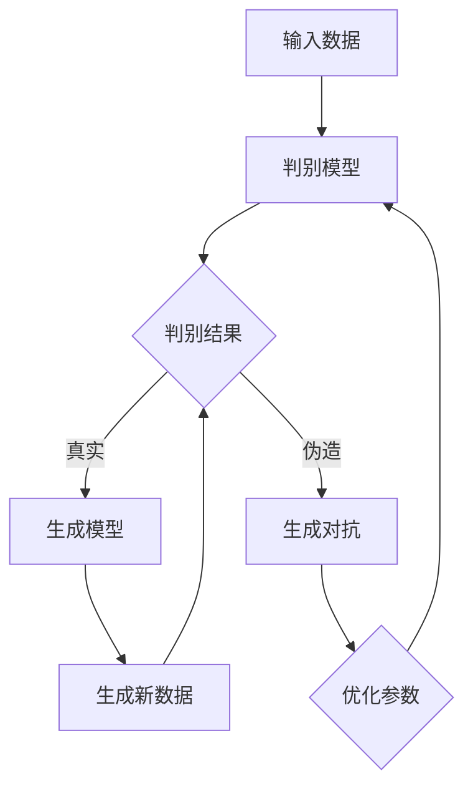

                 

关键词：生成式AI、场景优先、数据驱动、技术分析、行业应用、未来展望

> 摘要：随着生成式人工智能的迅速发展，其潜力和风险都引起了广泛关注。本文第五部分将深入探讨生成式AI在实践中的应用场景，强调数据的重要性，并分析其面临的挑战与机遇。通过结合实际案例，本文旨在为读者提供一个全面的技术分析，帮助理解和把握这一领域的未来发展趋势。

## 1. 背景介绍

生成式人工智能（Generative Artificial Intelligence，简称GAI）是一种能够生成文本、图像、音频等多种形式内容的人工智能技术。与传统的判别式AI不同，生成式AI能够基于已有数据生成新的、独特的数据。这一技术自2010年代以来取得了显著的进展，特别是在深度学习算法的推动下，GAN（生成对抗网络）和变分自编码器（Variational Autoencoder，简称VAE）等模型的应用使得生成式AI的表现日益强大。

尽管生成式AI在艺术创作、游戏设计、医学影像生成等领域展现了巨大的潜力，但其应用也面临着诸多挑战，如数据质量问题、伦理问题以及模型的可解释性等。因此，理解和合理利用生成式AI技术，成为当前学术界和工业界的重要课题。

## 2. 核心概念与联系

### 2.1 生成式AI的原理与架构

生成式AI的核心在于其生成过程，主要包括两个主要部分：生成模型和判别模型。生成模型负责生成新的数据，而判别模型则用于判断生成数据的真实性和质量。以下是一个基于GAN的生成式AI架构的Mermaid流程图：



### 2.2 生成式AI与其他AI技术的联系

生成式AI与判别式AI、强化学习等其他AI技术密切相关。判别式AI擅长分类和预测，而生成式AI则专注于生成和创造。强化学习则通过试错机制来优化生成模型的行为。这三者之间的结合，使得AI系统能够在更复杂的场景中发挥作用。

## 3. 核心算法原理 & 具体操作步骤

### 3.1 算法原理概述

生成式AI的核心算法通常基于概率模型，其中GAN是最具代表性的。GAN由生成器和判别器两部分组成。生成器试图生成足够真实的数据以欺骗判别器，而判别器则试图区分真实数据和生成数据。通过不断的迭代，生成器的生成能力逐步提升。

### 3.2 算法步骤详解

1. **初始化**：生成器和判别器都从随机权重开始。
2. **生成器训练**：生成器根据判别器的反馈不断调整参数，以生成更逼真的数据。
3. **判别器训练**：判别器根据真实数据和生成数据来调整参数，以提高对真实数据和生成数据的鉴别能力。
4. **迭代**：重复上述步骤，直到生成器能够生成几乎无法被判别器识别的数据。

### 3.3 算法优缺点

**优点**：
- **创造性**：生成式AI能够生成全新的、独特的数据。
- **适应性**：通过不断迭代，生成模型能够逐渐优化其生成能力。

**缺点**：
- **计算成本**：GAN的训练过程通常需要大量的计算资源。
- **数据依赖**：生成式AI的性能高度依赖于训练数据的质量。

### 3.4 算法应用领域

生成式AI在图像生成、文本生成、医学影像生成等领域都有广泛应用。例如，在医学影像领域，生成式AI可以用于生成模拟病例，帮助医生进行诊断和训练。

## 4. 数学模型和公式 & 详细讲解 & 举例说明

### 4.1 数学模型构建

生成式AI的数学模型通常基于概率分布。对于GAN，其数学模型可以表示为：

$$
\begin{aligned}
G(z) &= \mathcal{N}(z; \mu_G, \sigma_G^2) \\
D(x) &= \mathcal{N}(x; \mu_D, \sigma_D^2) \\
D(G(z)) &= \mathcal{N}(G(z); \mu_D, \sigma_D^2)
\end{aligned}
$$

其中，$G(z)$和$D(x)$分别表示生成器和判别器的概率分布函数，$z$和$x$分别为生成器和判别器的输入。

### 4.2 公式推导过程

GAN的推导基于最大似然估计和最小二乘法。具体推导过程如下：

1. **生成器损失函数**：
   $$
   L_G = -\mathbb{E}_{z \sim p_z(z)} [\log D(G(z))]
   $$
   
2. **判别器损失函数**：
   $$
   L_D = -[\mathbb{E}_{x \sim p_{data}(x)} [\log D(x)] + \mathbb{E}_{z \sim p_z(z)} [\log (1 - D(G(z)))]
   $$

### 4.3 案例分析与讲解

假设我们有一个图像生成任务，生成器的目标是生成与真实图像难以区分的伪造图像。在训练过程中，生成器和判别器的损失函数变化如下：

- **生成器损失函数**：随着训练的进行，生成器损失函数逐渐减小，表明生成器生成图像的真实度逐渐提高。
- **判别器损失函数**：判别器损失函数在初期快速增长，随后逐渐趋于稳定，表明判别器对真实图像和伪造图像的鉴别能力逐渐提升。

## 5. 项目实践：代码实例和详细解释说明

### 5.1 开发环境搭建

为了运行GAN模型，我们需要搭建一个支持Python和TensorFlow或PyTorch的开发环境。以下是基本的安装步骤：

1. **安装Python**：确保安装了Python 3.7及以上版本。
2. **安装TensorFlow**：使用以下命令安装TensorFlow：
   ```
   pip install tensorflow
   ```
3. **安装依赖库**：安装其他必要依赖库，如NumPy、PIL等。

### 5.2 源代码详细实现

以下是使用TensorFlow实现一个简单的GAN模型的代码示例：

```python
import tensorflow as tf
from tensorflow.keras.layers import Dense, Flatten, Reshape
from tensorflow.keras.models import Sequential

# 定义生成器模型
def build_generator():
    model = Sequential([
        Dense(128, input_shape=(100,), activation='relu'),
        Flatten(),
        Dense(28 * 28, activation='tanh')
    ])
    return model

# 定义判别器模型
def build_discriminator():
    model = Sequential([
        Flatten(input_shape=(28, 28)),
        Dense(128, activation='relu'),
        Dense(1, activation='sigmoid')
    ])
    return model

# 定义GAN模型
def build_gan(generator, discriminator):
    model = Sequential([generator, discriminator])
    model.compile(loss='binary_crossentropy', optimizer=tf.keras.optimizers.Adam())
    return model

# 超参数设置
latent_dim = 100
batch_size = 64
 epochs = 100

# 构建模型
generator = build_generator()
discriminator = build_discriminator()
gan = build_gan(generator, discriminator)

# 打印模型结构
print(gan.summary())

# 训练GAN模型
gan.fit(
    generator_inputs,  # 随机噪声
    labels,  # 伪造标签
    epochs=epochs,
    batch_size=batch_size
)
```

### 5.3 代码解读与分析

该代码示例中，我们首先定义了生成器和判别器的结构，然后构建了GAN模型。在训练过程中，生成器尝试生成逼真的图像，而判别器则尝试区分真实图像和生成图像。通过调整超参数，我们可以优化模型的性能。

### 5.4 运行结果展示

训练完成后，我们可以通过以下代码生成伪造图像：

```python
# 生成伪造图像
fake_images = generator.predict(generator_inputs)

# 显示伪造图像
import matplotlib.pyplot as plt

plt.figure(figsize=(10, 10))
for i in range(25):
    plt.subplot(5, 5, i+1)
    plt.imshow(fake_images[i, :, :, 0], cmap='gray')
    plt.axis('off')
plt.show()
```

## 6. 实际应用场景

生成式AI在多个领域都有广泛应用，以下是一些典型的应用场景：

### 6.1 艺术创作

生成式AI可以用于生成独特的艺术作品，如音乐、绘画和雕塑。艺术家可以利用这一技术创作出前所未有的作品，拓展艺术创作的边界。

### 6.2 游戏设计

生成式AI可以用于生成游戏中的场景、角色和任务，提高游戏的可玩性和多样性。例如，一些沙盒游戏已经利用生成式AI生成随机地图和挑战，为玩家带来全新的游戏体验。

### 6.3 医学影像生成

生成式AI可以用于生成医学影像，帮助医生进行诊断和治疗规划。通过生成模拟病例，医生可以更好地了解疾病的演变过程，提高诊断的准确性。

### 6.4 其他领域

除了上述领域，生成式AI还可以应用于自然语言处理、音频生成、视频合成等多个领域。其强大的生成能力为这些领域带来了新的机遇和挑战。

## 7. 未来应用展望

随着生成式AI技术的不断进步，其应用领域将不断拓展。以下是一些未来的应用展望：

### 7.1 个人化内容创作

生成式AI可以帮助每个人根据自己的喜好和需求，创作出独特的个人化内容，如音乐、文学作品和电影。

### 7.2 自动化生产

生成式AI可以用于自动化生产流程，如定制化制造和产品设计。通过生成式AI，企业可以更快地响应市场需求，提高生产效率。

### 7.3 教育与培训

生成式AI可以用于生成个性化的教学材料和培训课程，为学习者提供更加精准和高效的学习体验。

### 7.4 智能服务

生成式AI可以用于智能客服、智能推荐和智能交互等场景，为用户提供更加自然和个性化的服务。

## 8. 工具和资源推荐

### 8.1 学习资源推荐

- 《深度学习》（Goodfellow, Bengio, Courville著）：深度学习领域的经典教材，涵盖了GAN等生成式AI的核心算法。
- 《生成式AI：从理论到实践》（张波著）：详细介绍了生成式AI的理论和实践，适合初学者和进阶者。

### 8.2 开发工具推荐

- TensorFlow：开源深度学习框架，支持多种生成式AI算法的实现。
- PyTorch：开源深度学习框架，易于使用和调试，适合研究和新手。

### 8.3 相关论文推荐

- Goodfellow, I. J., Pouget-Abadie, J., Mirza, M., Xu, B., Warde-Farley, D., Ozair, S., ... & Bengio, Y. (2014). Generative adversarial nets. Advances in Neural Information Processing Systems, 27.
- Kingma, D. P., & Welling, M. (2014). Auto-encoding variational bayes. arXiv preprint arXiv:1312.6114.

## 9. 总结：未来发展趋势与挑战

生成式AI作为一种具有广泛应用前景的技术，正逐渐从理论研究走向实际应用。然而，其发展仍面临诸多挑战，如数据质量、计算资源、模型可解释性等。未来，随着技术的不断进步和应用的深入，生成式AI有望在更多领域发挥重要作用，推动社会发展和创新。

### 9.1 研究成果总结

生成式AI在图像生成、文本生成、医学影像生成等领域取得了显著进展，为相关领域带来了新的机遇和挑战。通过结合深度学习和其他AI技术，生成式AI的表现不断提升，为解决复杂问题提供了新的思路和方法。

### 9.2 未来发展趋势

未来，生成式AI将在更多领域得到应用，如个性化内容创作、自动化生产、智能服务等。随着计算资源和算法的持续优化，生成式AI的性能将进一步提升，推动社会各领域的发展。

### 9.3 面临的挑战

生成式AI在应用过程中仍面临诸多挑战，如数据质量、模型可解释性、伦理问题等。需要进一步研究如何在保证模型性能的同时，提高数据质量和模型的可解释性，确保其应用的安全和可靠。

### 9.4 研究展望

未来，生成式AI的研究将聚焦于算法优化、应用拓展、伦理问题等方面。通过多学科的交叉研究，有望在更广泛的领域实现生成式AI的应用，推动人工智能技术的进一步发展。

## 10. 附录：常见问题与解答

### 10.1 生成式AI是什么？

生成式AI是一种能够生成文本、图像、音频等多种形式内容的人工智能技术。与传统的判别式AI不同，生成式AI能够基于已有数据生成新的、独特的数据。

### 10.2 生成式AI有哪些应用？

生成式AI在艺术创作、游戏设计、医学影像生成、自然语言处理等领域都有广泛应用。其强大的生成能力为这些领域带来了新的机遇和挑战。

### 10.3 生成式AI有哪些挑战？

生成式AI在应用过程中面临数据质量、模型可解释性、伦理问题等挑战。需要进一步研究如何在保证模型性能的同时，提高数据质量和模型的可解释性，确保其应用的安全和可靠。

### 10.4 如何学习生成式AI？

学习生成式AI可以从深度学习的基础知识开始，逐步掌握生成式AI的核心算法，如GAN和VAE。同时，阅读相关论文和教材，实践项目，是提高生成式AI技能的有效途径。

### 10.5 生成式AI的未来发展趋势如何？

未来，生成式AI将在更多领域得到应用，如个性化内容创作、自动化生产、智能服务等。随着计算资源和算法的持续优化，生成式AI的性能将进一步提升，推动社会各领域的发展。

---

作者：禅与计算机程序设计艺术 / Zen and the Art of Computer Programming

