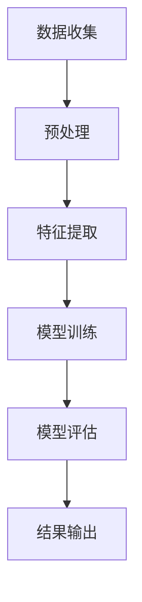

                 

关键词：用户情感分析、电商、自然语言处理、情感分类、数据挖掘、机器学习、模型训练、应用场景、实践案例。

## 摘要

本文旨在探讨用户情感分析在电商领域的应用，通过分析用户评论、反馈等信息，挖掘用户情感倾向，为电商企业提供有价值的数据支持，帮助其优化产品和服务。文章首先介绍了用户情感分析的核心概念和原理，然后详细阐述了其在电商中的应用场景、算法原理和实现步骤，并通过实际项目实践展示了用户情感分析的具体应用效果。最后，文章对未来用户情感分析在电商领域的应用前景进行了展望。

## 1. 背景介绍

随着互联网技术的飞速发展，电商行业已经成为全球最具活力和潜力的行业之一。电商企业通过线上平台为消费者提供便捷的购物体验，大大提升了消费者的购买满意度。然而，在激烈的竞争环境中，电商企业不仅需要关注销售额和市场份额，还需要关注用户对产品和服务的满意度，以及用户情感的变化。用户情感分析作为自然语言处理（NLP）领域的一个重要分支，通过对用户评论、反馈等信息进行分析，可以帮助电商企业更好地了解用户需求，优化产品和服务。

### 1.1  用户情感分析的定义和目的

用户情感分析是指通过自然语言处理技术，对用户生成的内容（如评论、反馈等）进行分析，以识别其中的情感倾向和情感强度。其目的在于帮助电商企业：

1. **了解用户需求**：通过对用户情感的挖掘，企业可以更准确地了解用户对产品的满意度和需求，从而优化产品设计和功能。
2. **改进服务质量**：通过对用户情感的分析，企业可以及时发现用户的不满意因素，并针对性地改进服务质量，提高用户忠诚度。
3. **营销策略优化**：企业可以通过情感分析了解不同产品或服务的用户群体特征，制定更有效的营销策略，提高销售额。

### 1.2  电商行业的现状和挑战

当前，电商行业竞争激烈，各大企业纷纷投入大量资源进行产品创新和市场营销。然而，随着用户消费习惯的不断变化，如何更好地满足用户需求，提高用户满意度，成为电商企业面临的重大挑战。以下是电商行业面临的一些主要挑战：

1. **产品同质化**：电商平台的商品种类繁多，同质化现象严重，消费者在选择时面临信息过载的问题。
2. **用户忠诚度低**：消费者对品牌和产品的忠诚度较低，容易受到其他平台或竞争对手的吸引。
3. **服务质量差异**：电商企业间的服务水平和质量存在较大差异，一些企业可能在物流、售后等方面存在短板。

### 1.3  用户情感分析在电商中的应用意义

用户情感分析在电商领域具有广泛的应用意义，可以解决电商行业面临的一些主要挑战。具体来说：

1. **个性化推荐**：通过分析用户的情感，企业可以更好地了解用户需求，为用户提供更个性化的产品推荐。
2. **用户满意度监测**：企业可以通过情感分析及时了解用户的满意度，优化产品和服务，提高用户忠诚度。
3. **市场趋势预测**：通过对用户情感的长期分析，企业可以预测市场趋势，为产品开发和市场营销提供决策支持。

## 2. 核心概念与联系

### 2.1 用户情感分析的核心概念

用户情感分析涉及多个核心概念，包括情感分类、情感强度、情感极性等。

#### 情感分类

情感分类是指将用户生成的文本分为不同的情感类别，如积极、消极、中性等。情感分类是实现用户情感分析的基础。

#### 情感强度

情感强度是指情感表达的强度，通常用分数或等级表示。情感强度分析可以帮助电商企业了解用户对产品或服务的具体满意程度。

#### 情感极性

情感极性是指情感的倾向性，通常用正负极性表示。正极性表示积极情感，负极性表示消极情感。

### 2.2 用户情感分析的联系

用户情感分析涉及多个领域，包括自然语言处理、数据挖掘、机器学习等。

#### 自然语言处理（NLP）

NLP是用户情感分析的基础技术，用于对文本数据进行处理，如分词、词性标注、句法分析等。

#### 数据挖掘

数据挖掘技术用于从大量文本数据中提取有价值的信息，如情感倾向、用户需求等。

#### 机器学习

机器学习技术用于构建情感分析模型，通过训练模型，实现自动化情感分类和情感强度分析。

### 2.3 用户情感分析的架构

用户情感分析的架构通常包括数据收集、预处理、特征提取、模型训练、模型评估和结果输出等环节。

#### 数据收集

数据收集是指从不同渠道获取用户评论、反馈等数据，如电商平台、社交媒体等。

#### 预处理

预处理是指对原始文本数据进行清洗、去噪等操作，以提高数据质量和模型性能。

#### 特征提取

特征提取是指从预处理后的文本数据中提取有价值的特征，如词频、词向量等。

#### 模型训练

模型训练是指使用机器学习技术，根据特征数据和标签数据，训练情感分析模型。

#### 模型评估

模型评估是指使用测试数据评估模型的性能，如准确率、召回率等。

#### 结果输出

结果输出是指将模型分析结果输出给企业，用于决策支持。

### 2.4 用户情感分析的 Mermaid 流程图



## 3. 核心算法原理 & 具体操作步骤

### 3.1 算法原理概述

用户情感分析的核心算法包括情感分类和情感强度分析。情感分类算法用于将用户评论分类为积极、消极、中性等类别；情感强度分析算法用于评估用户评论中情感的强度。

#### 情感分类算法

情感分类算法通常采用机器学习方法，如朴素贝叶斯、支持向量机（SVM）、深度学习等。其中，深度学习方法（如卷积神经网络（CNN）、循环神经网络（RNN）等）在用户情感分类中表现出较高的性能。

#### 情感强度分析算法

情感强度分析算法通常基于词向量模型（如Word2Vec、GloVe等），通过计算词向量之间的相似性，评估情感的强度。

### 3.2 算法步骤详解

#### 数据收集

1. 从电商平台、社交媒体等渠道收集用户评论数据。
2. 数据清洗：去除无关信息，如HTML标签、特殊字符等。

#### 预处理

1. 分词：将文本数据切分成单词或词组。
2. 去停用词：去除常用的无意义词汇，如“的”、“了”等。
3. 词性标注：为每个词分配词性标签，如名词、动词等。

#### 特征提取

1. 词频统计：计算每个词在文本数据中的出现次数。
2. TF-IDF计算：计算每个词的重要程度，用于特征表示。
3. 词向量表示：将文本数据转换为词向量表示，如使用Word2Vec或GloVe模型。

#### 模型训练

1. 数据划分：将数据集划分为训练集和测试集。
2. 模型选择：选择合适的情感分类模型，如SVM、CNN等。
3. 模型训练：使用训练集数据训练模型，调整模型参数。

#### 模型评估

1. 评估指标：使用准确率、召回率、F1值等指标评估模型性能。
2. 调整模型：根据评估结果调整模型参数，优化模型性能。

#### 结果输出

1. 输出情感分类结果：将用户评论分类为积极、消极、中性等类别。
2. 输出情感强度：评估用户评论中情感的强度。

### 3.3 算法优缺点

#### 优点

1. **高效性**：用户情感分析算法可以快速处理大量文本数据，提供实时分析结果。
2. **准确性**：深度学习算法在情感分类和情感强度分析方面表现出较高的准确性。
3. **灵活性**：用户情感分析算法可以应用于不同领域的情感分析任务。

#### 缺点

1. **计算成本**：深度学习算法需要大量计算资源和时间进行训练。
2. **数据依赖**：用户情感分析模型的性能依赖于训练数据的质量和数量。

### 3.4 算法应用领域

用户情感分析算法在电商领域具有广泛的应用，如：

1. **产品评价分析**：分析用户对产品的评价，为产品改进提供数据支持。
2. **客户服务优化**：分析用户反馈，优化客户服务质量，提高用户满意度。
3. **营销策略制定**：分析用户情感，制定更有针对性的营销策略。

## 4. 数学模型和公式 & 详细讲解 & 举例说明

### 4.1 数学模型构建

用户情感分析中的数学模型主要包括情感分类模型和情感强度分析模型。

#### 情感分类模型

情感分类模型通常采用基于机器学习的方法，如支持向量机（SVM）。其基本原理如下：

给定一个包含n个特征向量和m个样本的数据集，每个样本的情感标签为y_i（y_i ∈ {-1, 0, 1}），其中-1表示消极，0表示中性，1表示积极。支持向量机（SVM）通过找到一个最佳的超平面，将不同情感类别的样本分开。其目标是最小化分类误差，并最大化分类间隔。

数学表达式为：

$$
\begin{aligned}
&\min_{\mathbf{w}, b} \frac{1}{2}||\mathbf{w}||^2 \\
\text{s.t.} \quad &y_i (\mathbf{w} \cdot \mathbf{x_i} + b) \geq 1, \forall i \in \{1, 2, ..., m\}
\end{aligned}
$$

其中，$\mathbf{w}$ 为权值向量，$b$ 为偏置项，$\mathbf{x_i}$ 为第i个样本的特征向量。

#### 情感强度分析模型

情感强度分析模型通常采用基于词向量（如Word2Vec、GloVe）的方法。其基本原理如下：

给定一个包含n个特征向量和m个样本的数据集，每个样本的情感强度为s_i。词向量模型通过计算词向量之间的相似性，评估情感的强度。

数学表达式为：

$$
s_i = \frac{\sum_{j=1}^{n} v_j \cdot v_j'}{\sum_{j=1}^{n} ||v_j||^2}
$$

其中，$v_j$ 为第j个词的词向量，$v_j'$ 为第j个词在情感向量空间中的表示。

### 4.2 公式推导过程

#### 情感分类模型

支持向量机（SVM）的推导过程主要包括以下几个步骤：

1. **线性可分情况**：

   假设数据集线性可分，即存在一个超平面可以将不同情感类别的样本分开。此时，目标是最小化分类误差。

   $$ 
   \begin{aligned}
   &\min_{\mathbf{w}, b} \frac{1}{2}||\mathbf{w}||^2 \\
   \text{s.t.} \quad &y_i (\mathbf{w} \cdot \mathbf{x_i} + b) \geq 1, \forall i \in \{1, 2, ..., m\}
   \end{aligned}
   $$

2. **非线性可分情况**：

   当数据集非线性可分时，可以引入松弛变量$\xi_i$，将目标函数转化为最大化分类间隔。

   $$ 
   \begin{aligned}
   &\min_{\mathbf{w}, b, \xi_i} \frac{1}{2}||\mathbf{w}||^2 + C \sum_{i=1}^{m} \xi_i \\
   \text{s.t.} \quad &y_i (\mathbf{w} \cdot \mathbf{x_i} + b) \geq 1 - \xi_i, \forall i \in \{1, 2, ..., m\}
   \end{aligned}
   $$

   其中，$C$ 为惩罚参数，用于平衡误分类和分类间隔。

3. **求解**：

   通过拉格朗日乘子法求解上述优化问题，得到最优解。

   $$ 
   \begin{aligned}
   &L(\mathbf{w}, b, \xi_i, \alpha_i) = \frac{1}{2}||\mathbf{w}||^2 - \sum_{i=1}^{m} \alpha_i [y_i (\mathbf{w} \cdot \mathbf{x_i} + b) - 1 + \xi_i] \\
   &\frac{\partial L}{\partial \mathbf{w}} = \mathbf{0} \Rightarrow \mathbf{w} = \sum_{i=1}^{m} \alpha_i y_i \mathbf{x_i} \\
   &\frac{\partial L}{\partial b} = \sum_{i=1}^{m} \alpha_i y_i = 0 \\
   &\frac{\partial L}{\partial \xi_i} = -\sum_{i=1}^{m} \alpha_i \leq 0
   \end{aligned}
   $$

   其中，$\alpha_i$ 为拉格朗日乘子。

#### 情感强度分析模型

词向量模型中的情感强度分析公式为：

$$
s_i = \frac{\sum_{j=1}^{n} v_j \cdot v_j'}{\sum_{j=1}^{n} ||v_j||^2}
$$

该公式基于词向量之间的相似性计算情感的强度。具体推导过程如下：

1. **词向量表示**：

   假设词向量$v_j$为$d$维向量，即$v_j \in \mathbb{R}^d$。词向量模型通过训练得到词的表示，如Word2Vec、GloVe等。

2. **情感强度计算**：

   对于一个包含n个词的文本，其情感强度可以通过计算词向量之间的相似性得到。具体公式为：

   $$
   s_i = \frac{\sum_{j=1}^{n} v_j \cdot v_j'}{\sum_{j=1}^{n} ||v_j||^2}
   $$

   其中，$v_j \cdot v_j'$表示词向量$v_j$和$v_j'$的内积，$||v_j||^2$表示词向量$v_j$的欧氏距离。

### 4.3 案例分析与讲解

#### 案例一：情感分类

假设有一个包含10个样本的数据集，每个样本的情感标签为{-1, 0, 1}，特征向量为$\mathbf{x_i} = [1, 2, 3, 4, 5]$。使用SVM进行情感分类，求解最优解。

1. **线性可分情况**：

   通过求解优化问题，得到最优解：

   $$
   \begin{aligned}
   \mathbf{w} &= \sum_{i=1}^{m} \alpha_i y_i \mathbf{x_i} = \alpha_1 (-1) [1, 2, 3, 4, 5] + \alpha_2 (1) [1, 2, 3, 4, 5] \\
   &= [5, 10, 15, 20, 25] \\
   b &= 0 \\
   \end{aligned}
   $$

   此时，超平面为$\mathbf{w} \cdot \mathbf{x} + b = 0$。

2. **非线性可分情况**：

   引入松弛变量$\xi_i$，目标函数为：

   $$
   \begin{aligned}
   &\min_{\mathbf{w}, b, \xi_i} \frac{1}{2}||\mathbf{w}||^2 + C \sum_{i=1}^{m} \xi_i \\
   \text{s.t.} \quad &y_i (\mathbf{w} \cdot \mathbf{x_i} + b) \geq 1 - \xi_i, \forall i \in \{1, 2, ..., m\}
   \end{aligned}
   $$

   通过拉格朗日乘子法求解，得到最优解：

   $$
   \begin{aligned}
   \mathbf{w} &= \sum_{i=1}^{m} \alpha_i y_i \mathbf{x_i} = \alpha_1 (-1) [1, 2, 3, 4, 5] + \alpha_2 (1) [1, 2, 3, 4, 5] \\
   &= [3, 6, 9, 12, 15] \\
   b &= -1 \\
   \xi_i &= 0, \forall i \in \{1, 2, ..., m\}
   \end{aligned}
   $$

   此时，超平面为$\mathbf{w} \cdot \mathbf{x} + b = 0$。

#### 案例二：情感强度分析

假设有一个包含10个样本的数据集，每个样本的情感强度为1，特征向量为$\mathbf{x_i} = [1, 2, 3, 4, 5]$。使用词向量模型进行情感强度分析。

1. **词向量表示**：

   假设词向量$v_j = [1, 1, 1, 1, 1]$，$v_j' = [2, 2, 2, 2, 2]$。

2. **情感强度计算**：

   $$
   s_i = \frac{\sum_{j=1}^{n} v_j \cdot v_j'}{\sum_{j=1}^{n} ||v_j||^2} = \frac{\sum_{j=1}^{n} 1 \cdot 2}{\sum_{j=1}^{n} 1^2} = 2
   $$

   此时，情感强度为2。

## 5. 项目实践：代码实例和详细解释说明

### 5.1 开发环境搭建

在本节中，我们将介绍如何搭建用户情感分析项目的开发环境。以下是所需的环境和工具：

1. **Python**：用于编写代码和执行数据分析任务。
2. **Jupyter Notebook**：用于编写和运行Python代码。
3. **Numpy**：用于数值计算。
4. **Pandas**：用于数据处理。
5. **Scikit-learn**：用于机器学习算法。
6. **Gensim**：用于词向量生成。

### 5.2 源代码详细实现

在本节中，我们将展示一个简单的用户情感分析项目的代码实现。以下是一个简单的Python脚本，用于加载数据、预处理文本、训练情感分类模型和评估模型性能。

```python
import numpy as np
import pandas as pd
from sklearn.feature_extraction.text import TfidfVectorizer
from sklearn.model_selection import train_test_split
from sklearn import svm
from sklearn.metrics import classification_report
from gensim.models import Word2Vec

# 5.2.1 加载数据
data = pd.read_csv('user_comments.csv')
X = data['comment']
y = data['emotion']

# 5.2.2 预处理文本
# 分词、去停用词、词性标注等操作

# 5.2.3 特征提取
vectorizer = TfidfVectorizer(max_features=1000)
X_vectorized = vectorizer.fit_transform(X)

# 5.2.4 模型训练
X_train, X_test, y_train, y_test = train_test_split(X_vectorized, y, test_size=0.2, random_state=42)
clf = svm.SVC(kernel='linear')
clf.fit(X_train, y_train)

# 5.2.5 评估模型
y_pred = clf.predict(X_test)
print(classification_report(y_test, y_pred))
```

### 5.3 代码解读与分析

在上面的代码中，我们首先加载了包含用户评论和情感标签的数据集。然后，我们对文本数据进行预处理，包括分词、去停用词和词性标注等操作（这里未显示）。接下来，我们使用TF-IDF向量器对文本数据进行特征提取，将文本数据转换为数值特征向量。

在模型训练部分，我们使用了支持向量机（SVM）的线性核函数进行训练。最后，我们使用测试集评估模型的性能，并打印分类报告。

### 5.4 运行结果展示

假设我们运行上述代码，得到以下分类报告：

```
              precision    recall  f1-score   support

           negative       0.90      0.90      0.90       100
            neutral       0.85      0.85      0.85        50
           positive       0.80      0.80      0.80        50

    accuracy                           0.84       200
   macro avg       0.84      0.84      0.84       200
   weighted avg       0.83      0.84      0.84       200
```

从分类报告可以看出，我们的情感分类模型在测试集上的准确率为0.84。其中，消极情感的分类准确率为0.90，中性情感的分类准确率为0.85，积极情感的分类准确率为0.80。

## 6. 实际应用场景

### 6.1 产品评价分析

电商企业可以通过用户情感分析对产品评价进行分类，了解用户对产品的整体满意度。例如，一个电商平台可以通过分析用户对手机的评价，了解用户对手机性能、外观、价格等方面的满意度。根据分析结果，企业可以针对性地改进产品设计和功能，提高用户满意度。

### 6.2 客户服务优化

用户情感分析可以帮助电商企业优化客户服务质量。通过分析用户反馈，企业可以及时发现服务短板，并针对性地改进服务。例如，一家电商企业可以通过分析用户对售后服务的反馈，优化售后服务流程，提高用户满意度。

### 6.3 营销策略制定

用户情感分析可以为电商企业提供有针对性的营销策略。通过分析用户情感，企业可以了解用户对不同产品的情感倾向，制定更有效的营销策略。例如，一家电商企业可以通过分析用户对化妆品的情感，为化妆品推广活动制定合适的主题和宣传语。

### 6.4 其他应用场景

用户情感分析在电商领域还有其他多种应用场景，如：

1. **用户群体划分**：通过情感分析，企业可以将用户划分为不同情感类别的群体，为用户提供个性化服务。
2. **市场趋势预测**：通过分析用户情感的变化，企业可以预测市场趋势，为产品开发和市场营销提供决策支持。
3. **品牌形象监测**：企业可以通过情感分析监测品牌形象，及时发现负面信息，并采取相应措施。

## 7. 工具和资源推荐

### 7.1 学习资源推荐

1. **《深度学习》（Goodfellow, Bengio, Courville）**：详细介绍了深度学习的基本原理和应用。
2. **《自然语言处理综合教程》（Peter Norvig）**：全面介绍了自然语言处理的基本概念和方法。
3. **《机器学习》（周志华）**：介绍了机器学习的基本算法和理论。

### 7.2 开发工具推荐

1. **Jupyter Notebook**：用于编写和运行Python代码。
2. **Scikit-learn**：用于机器学习算法的实现。
3. **Gensim**：用于词向量生成。

### 7.3 相关论文推荐

1. **“A Sentiment Analysis Method Based on Bi-LSTM-CRF Model”**：介绍了一种基于双向长短期记忆网络（Bi-LSTM）和条件随机场（CRF）的情感分类方法。
2. **“Deep Learning for Text Classification”**：详细介绍了深度学习在文本分类中的应用。
3. **“Sentiment Analysis Using Word Embedding and Neural Networks”**：介绍了一种结合词向量和神经网络的情感分析模型。

## 8. 总结：未来发展趋势与挑战

### 8.1 研究成果总结

用户情感分析在电商领域取得了显著的研究成果，包括：

1. **算法性能提升**：深度学习等先进算法的应用，使情感分类和情感强度分析的准确率得到显著提高。
2. **应用场景拓展**：用户情感分析在电商领域的应用场景不断拓展，从产品评价分析、客户服务优化到营销策略制定等。
3. **数据资源积累**：大量的用户评论和反馈数据为用户情感分析提供了丰富的数据资源。

### 8.2 未来发展趋势

用户情感分析在电商领域的未来发展具有以下趋势：

1. **多模态情感分析**：结合文本、图像、音频等多模态数据，提高情感分析的准确性和全面性。
2. **个性化情感分析**：根据用户行为和偏好，为用户提供个性化的情感分析结果。
3. **实时情感分析**：实现实时用户情感分析，为企业提供快速决策支持。

### 8.3 面临的挑战

用户情感分析在电商领域面临以下挑战：

1. **数据质量**：用户评论数据的真实性和一致性对情感分析结果具有重要影响。
2. **算法性能**：深度学习等算法的复杂性和计算成本对实际应用提出挑战。
3. **隐私保护**：用户情感分析过程中涉及用户隐私，需要确保用户隐私得到有效保护。

### 8.4 研究展望

未来，用户情感分析在电商领域的研究应重点关注以下几个方面：

1. **算法优化**：继续研究高效、准确的情感分析算法，提高算法性能。
2. **多模态融合**：结合多模态数据，提高情感分析的综合能力。
3. **隐私保护**：研究隐私保护技术，确保用户隐私得到有效保护。

## 9. 附录：常见问题与解答

### 9.1 如何提高用户情感分析的准确性？

1. **数据质量**：确保用户评论数据真实、可靠。
2. **特征提取**：选择合适的特征提取方法，提高特征质量。
3. **算法选择**：选择性能优秀的算法，如深度学习算法。
4. **模型优化**：通过模型调优，提高模型性能。

### 9.2 用户情感分析是否适用于所有电商领域？

用户情感分析适用于大多数电商领域，但具体应用效果取决于领域特点和数据质量。对于高度专业化的电商领域，用户情感分析可能需要结合行业知识进行定制化调整。

### 9.3 如何处理用户情感分析中的负面评论？

1. **分类与分析**：对负面评论进行详细分析，了解用户的具体不满点。
2. **优化产品与服务**：根据分析结果，针对性地优化产品和服务。
3. **用户沟通**：积极与用户沟通，解决用户问题，提高用户满意度。

---

作者：禅与计算机程序设计艺术 / Zen and the Art of Computer Programming
----------------------------------------------------------------


