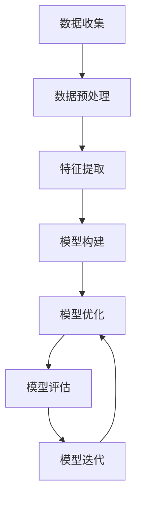

                 

在当今信息化时代，用户画像作为一种重要的数据挖掘和分析技术，已被广泛应用于市场营销、客户关系管理、风险控制、个性化推荐等多个领域。用户画像的构建与优化直接关系到企业对用户需求的精准把握，以及商业决策的效率和质量。本文旨在系统地介绍用户画像的构建与优化实践，探讨其在实际应用中的关键技术与方法，为相关领域的研究者和从业者提供参考。

## 文章关键词

- 用户画像
- 数据挖掘
- 个性化推荐
- 客户关系管理
- 风险控制

## 文章摘要

本文首先介绍了用户画像的基本概念和构建背景，然后详细阐述了用户画像的核心概念与联系，包括用户画像的数据来源、特征提取、模型构建和优化策略。接着，本文通过数学模型和公式，对用户画像的算法原理进行了深入分析，并通过具体案例进行了举例说明。此外，本文还提供了项目实践中的代码实例和详细解释，帮助读者更好地理解用户画像的实现过程。最后，本文探讨了用户画像在实际应用场景中的重要性，以及未来的发展趋势和挑战。

## 1. 背景介绍

随着互联网技术的飞速发展，数据已成为新的生产要素。企业通过收集和分析用户数据，可以更好地了解用户行为、需求和心理，从而实现精准营销和个性化服务。用户画像作为一种重要的数据挖掘和分析技术，应运而生。用户画像是指通过对用户数据进行深入挖掘和分析，构建出用户的多维度特征模型，以实现对用户的精准描述和分类。

用户画像的构建不仅有助于企业更好地了解用户，提高客户满意度，还可以为企业的市场营销、客户关系管理、产品开发、风险控制等提供有力支持。例如，在市场营销中，用户画像可以帮助企业识别高价值客户，制定有针对性的营销策略；在客户关系管理中，用户画像可以帮助企业了解客户需求，提供个性化服务，提升客户忠诚度；在风险控制中，用户画像可以帮助企业识别潜在风险客户，采取预防措施。

### 1.1 用户画像的发展历程

用户画像的发展历程可以追溯到20世纪80年代的客户关系管理（CRM）系统。当时，企业开始意识到客户数据的重要性，并尝试通过数据挖掘技术来分析客户行为，从而实现个性化营销和服务。随着互联网的普及，用户数据的规模和种类日益增加，用户画像的概念也逐渐成熟。

2004年，阿里巴巴推出了“阿里妈妈”广告平台，首次将用户画像应用于在线广告投放，取得了巨大成功。随后，用户画像技术在互联网行业得到广泛应用，逐渐成为企业数据分析的核心工具。

### 1.2 用户画像的应用领域

用户画像技术已广泛应用于多个领域，包括但不限于：

- **市场营销**：通过用户画像，企业可以了解用户的兴趣偏好、购买行为等，制定个性化的营销策略，提高营销效果。
- **客户关系管理**：通过用户画像，企业可以了解客户的需求和痛点，提供定制化的服务和产品，提高客户满意度和忠诚度。
- **产品开发**：通过用户画像，企业可以了解用户对产品的需求和反馈，优化产品设计，提高产品质量。
- **风险控制**：通过用户画像，企业可以识别高风险客户，采取预防措施，降低风险损失。
- **个性化推荐**：通过用户画像，平台可以推荐用户感兴趣的内容和产品，提高用户活跃度和粘性。

## 2. 核心概念与联系

用户画像的构建涉及多个核心概念和环节，包括数据收集、特征提取、模型构建和优化策略。下面将详细阐述这些核心概念及其相互联系。

### 2.1 数据收集

数据收集是用户画像构建的基础。数据来源主要包括以下几个方面：

- **企业自有数据**：包括用户注册信息、购买记录、浏览行为、评价反馈等。
- **第三方数据**：通过数据交换平台、合作伙伴等获取的用户公开信息、社交媒体数据等。
- **传感器数据**：通过智能设备、物联网技术等收集的用户行为数据，如地理位置、运动轨迹等。

数据收集的过程需要遵循数据隐私保护的相关法规和标准，确保数据的合法性和合规性。

### 2.2 特征提取

特征提取是将原始数据转化为有用信息的过程。用户画像的构建依赖于特征提取技术的有效性。特征提取主要包括以下几种方法：

- **基础特征提取**：包括用户的基本信息（如年龄、性别、职业等），行为特征（如浏览记录、购买行为等）。
- **高级特征提取**：通过数据挖掘和机器学习算法，提取用户深层次的兴趣偏好、心理特征等。
- **稀疏特征提取**：针对大规模数据，使用稀疏技术提取关键特征，提高数据处理的效率。

### 2.3 模型构建

用户画像的模型构建是核心环节，常用的模型包括以下几种：

- **基于规则的模型**：通过专家知识和逻辑规则，对用户特征进行分类和标注。
- **机器学习模型**：利用统计学习算法，如决策树、随机森林、神经网络等，构建用户画像模型。
- **深度学习模型**：利用神经网络模型，如卷积神经网络（CNN）、循环神经网络（RNN）等，对用户特征进行深度学习和建模。

### 2.4 优化策略

用户画像的优化策略旨在提高模型的准确性和实用性。优化策略主要包括以下几个方面：

- **模型评估**：通过交叉验证、A/B测试等方法，评估模型的性能和效果。
- **模型迭代**：根据评估结果，调整模型参数，优化模型结构。
- **实时更新**：随着用户行为数据的更新，实时调整用户画像，保持模型的动态适应性。

### 2.5 Mermaid 流程图

以下是一个简化的用户画像构建与优化流程的 Mermaid 流程图：



## 3. 核心算法原理 & 具体操作步骤

### 3.1 算法原理概述

用户画像的核心算法主要包括特征提取和模型构建两个部分。特征提取是将原始数据转化为有用特征的过程，而模型构建则是通过这些特征对用户进行分类和标注。

在特征提取方面，常用的算法有基于统计的方法和基于机器学习的方法。基于统计的方法包括频率统计、聚类分析等；基于机器学习的方法包括主成分分析（PCA）、因子分析等。在模型构建方面，常用的算法有决策树、随机森林、支持向量机（SVM）等。

### 3.2 算法步骤详解

#### 3.2.1 数据收集

数据收集是用户画像构建的基础。数据来源包括企业自有数据、第三方数据和传感器数据等。数据收集过程中，需要注意数据的完整性和准确性，并确保数据来源的合法性和合规性。

#### 3.2.2 数据预处理

数据预处理是数据挖掘过程中的关键步骤，旨在提高数据质量和降低噪声。数据预处理包括数据清洗、数据转换和数据归一化等。

- **数据清洗**：删除重复数据、处理缺失值和异常值，确保数据的准确性和一致性。
- **数据转换**：将不同类型的数据转换为统一格式，如将文本数据转换为数值型数据。
- **数据归一化**：将数据缩放到相同范围，消除数据量级差异。

#### 3.2.3 特征提取

特征提取是将原始数据转化为有用特征的过程。特征提取的方法包括基于统计的方法和基于机器学习的方法。

- **基于统计的方法**：通过频率统计、聚类分析等方法提取特征。
  - **频率统计**：计算各特征的频率，提取出现频率较高的特征。
  - **聚类分析**：将数据分为若干类，提取各类别的特征。

- **基于机器学习的方法**：通过主成分分析（PCA）、因子分析等方法提取特征。
  - **主成分分析（PCA）**：降低数据维度，提取最重要的特征。
  - **因子分析**：将多个相关特征合并为较少的独立特征。

#### 3.2.4 模型构建

模型构建是通过特征对用户进行分类和标注的过程。常用的算法包括决策树、随机森林、支持向量机（SVM）等。

- **决策树**：通过一系列规则将用户划分为不同的类别。
- **随机森林**：通过随机选择特征和样本，构建多个决策树，取平均值作为最终结果。
- **支持向量机（SVM）**：通过寻找最优超平面，将用户划分为不同的类别。

#### 3.2.5 模型优化

模型优化是通过调整模型参数和结构，提高模型性能的过程。常用的方法包括交叉验证、A/B测试等。

- **交叉验证**：通过将数据集划分为训练集和验证集，评估模型性能。
- **A/B测试**：通过比较不同模型的性能，选择最优模型。

#### 3.2.6 模型评估

模型评估是通过评估指标来评估模型性能的过程。常用的评估指标包括准确率、召回率、F1值等。

- **准确率**：预测正确的用户数占总用户数的比例。
- **召回率**：预测正确的用户数占实际为该类别的用户数的比例。
- **F1值**：准确率和召回率的调和平均。

#### 3.2.7 模型迭代

模型迭代是通过反复调整模型参数和结构，提高模型性能的过程。模型迭代过程中，可以结合用户反馈和业务需求，不断优化模型。

### 3.3 算法优缺点

#### 3.3.1 优点

- **高效性**：用户画像算法具有高效性，可以在大规模数据集上快速处理和提取特征。
- **灵活性**：用户画像算法具有灵活性，可以根据不同业务需求和数据特点，选择合适的特征提取和模型构建方法。
- **实用性**：用户画像算法具有实用性，可以应用于实际业务场景，为企业提供有价值的洞察。

#### 3.3.2 缺点

- **数据依赖性**：用户画像算法的性能和数据质量密切相关，数据质量差会导致算法效果不佳。
- **计算复杂性**：用户画像算法涉及大量计算，特别是在大规模数据集上，计算复杂性较高。

### 3.4 算法应用领域

用户画像算法已广泛应用于多个领域，包括但不限于：

- **市场营销**：通过用户画像，企业可以识别高价值客户，制定个性化的营销策略。
- **客户关系管理**：通过用户画像，企业可以了解客户需求，提供定制化的服务和产品。
- **产品开发**：通过用户画像，企业可以了解用户偏好，优化产品设计。
- **风险控制**：通过用户画像，企业可以识别高风险客户，采取预防措施。
- **个性化推荐**：通过用户画像，平台可以推荐用户感兴趣的内容和产品。

## 4. 数学模型和公式 & 详细讲解 & 举例说明

在用户画像的构建过程中，数学模型和公式起着至关重要的作用。这些模型和公式不仅帮助我们理解用户画像的基本原理，还可以用于实际操作中的算法实现。以下将介绍几个关键的数学模型和公式，并对其进行详细讲解和举例说明。

### 4.1 数学模型构建

#### 4.1.1 主成分分析（PCA）

主成分分析（PCA）是一种常用的降维技术，通过将数据投影到新的正交坐标系中，提取最重要的几个主成分，从而降低数据维度，同时保留数据的最大信息量。

PCA的基本步骤如下：

1. **标准化**：对数据进行标准化处理，使其具有零均值和单位方差。
   $$ z_i = \frac{x_i - \mu}{\sigma} $$
   其中，$ x_i $ 是第 $ i $ 个特征，$ \mu $ 是均值，$ \sigma $ 是标准差。

2. **计算协方差矩阵**：
   $$ \Sigma = \frac{1}{N-1} \sum_{i=1}^{N} (x_i - \mu)(x_i - \mu)^T $$
   其中，$ \Sigma $ 是协方差矩阵，$ N $ 是数据点的个数。

3. **计算协方差矩阵的特征值和特征向量**。

4. **选择主成分**：按照特征值从大到小的顺序选择前 $ k $ 个特征向量，构成投影矩阵 $ P $。

5. **投影数据**：将原始数据投影到新坐标系中，得到新的特征向量。
   $$ y_i = P^T x_i $$

举例说明：

假设我们有以下三个特征 $ x_1, x_2, x_3 $，对应的数据点为：

$$
\begin{array}{ccc}
x_1 & x_2 & x_3 \\
5 & 2 & 1 \\
2 & 4 & 3 \\
8 & 6 & 7 \\
\end{array}
$$

首先对数据进行标准化处理：

$$
\begin{array}{ccc}
x_1' & x_2' & x_3' \\
\frac{5-4}{1} & \frac{2-4}{1} & \frac{1-4}{1} \\
0 & -2 & -3 \\
\frac{2-4}{1} & \frac{4-4}{1} & \frac{3-4}{1} \\
0 & 0 & -1 \\
\frac{8-4}{1} & \frac{6-4}{1} & \frac{7-4}{1} \\
4 & 2 & 3 \\
\end{array}
$$

接着计算协方差矩阵：

$$
\Sigma = \frac{1}{2} \begin{bmatrix}
5 & -4 & 3 \\
-4 & 4 & -2 \\
3 & -2 & 5 \\
\end{bmatrix}
$$

计算协方差矩阵的特征值和特征向量，选择前两个特征向量构成投影矩阵：

$$
P = \begin{bmatrix}
0.832 & -0.554 \\
-0.554 & 0.832 \\
\end{bmatrix}
$$

最后将数据投影到新坐标系中：

$$
\begin{array}{ccc}
y_1' & y_2' \\
4 & 2 \\
0 & 0 \\
4 & 2 \\
\end{array}
$$

#### 4.1.2 决策树分类算法

决策树是一种常用的分类算法，通过一系列规则将数据划分为不同的类别。决策树的基本公式如下：

$$
y = \prod_{i=1}^{n} \theta_i(x_i)
$$

其中，$ y $ 是输出类别，$ \theta_i(x_i) $ 是第 $ i $ 个特征对应的分类阈值。

举例说明：

假设我们有以下两个特征 $ x_1, x_2 $，对应的数据点为：

$$
\begin{array}{ccc}
x_1 & x_2 & y \\
0 & 0 & 0 \\
0 & 1 & 1 \\
1 & 0 & 1 \\
1 & 1 & 0 \\
\end{array}
$$

我们可以构建一个简单的决策树：

- 如果 $ x_1 = 0 $，则 $ y = \theta_1(x_1) = 0 $；
- 否则，如果 $ x_2 = 0 $，则 $ y = \theta_2(x_2) = 1 $；
- 否则，$ y = \theta_3(x_2) = 0 $。

根据这个决策树，我们可以对新的数据进行分类：

- 对于数据点 $ (0, 1) $，根据规则 $ y = \theta_1(x_1) = 0 $，分类为 0；
- 对于数据点 $ (1, 0) $，根据规则 $ y = \theta_2(x_2) = 1 $，分类为 1；
- 对于数据点 $ (1, 1) $，根据规则 $ y = \theta_3(x_2) = 0 $，分类为 0。

### 4.2 公式推导过程

#### 4.2.1 支持向量机（SVM）

支持向量机（SVM）是一种常用的分类算法，通过寻找最优超平面，将数据划分为不同的类别。SVM的基本公式如下：

$$
\min_{\theta} \frac{1}{2} \sum_{i=1}^{n} (\theta^T x_i - y_i)^2 + C \sum_{i=1}^{n} \xi_i
$$

其中，$ \theta $ 是参数向量，$ x_i $ 是特征向量，$ y_i $ 是标签，$ C $ 是正则化参数，$ \xi_i $ 是松弛变量。

这个公式的目标是找到一组参数 $ \theta $，使得分类边界尽可能远离训练数据点，同时满足约束条件。

#### 4.2.2 逻辑回归

逻辑回归是一种常用的概率预测模型，用于分类问题。逻辑回归的公式如下：

$$
\text{logit}(P) = \ln\left(\frac{P}{1-P}\right) = \theta^T x
$$

其中，$ P $ 是预测概率，$ \text{logit}(P) $ 是逻辑函数，$ \theta $ 是参数向量，$ x $ 是特征向量。

逻辑回归的目的是找到一组参数 $ \theta $，使得预测概率 $ P $ 与实际标签 $ y $ 之间的误差最小。

### 4.3 案例分析与讲解

#### 4.3.1 用户行为分析

假设我们有一个用户行为数据集，包含用户的基本信息、浏览记录、购买记录等。我们希望通过用户画像技术，对用户进行分类和标注。

首先，我们对数据进行预处理，包括数据清洗、数据转换和数据归一化等。

接着，我们使用主成分分析（PCA）提取关键特征。通过计算协方差矩阵和特征值，我们选择前两个特征向量，构成投影矩阵。

然后，我们使用决策树分类算法，构建用户画像模型。通过交叉验证和A/B测试，我们选择最优的决策树模型。

最后，我们对新用户进行分类和标注，根据用户画像，为企业提供有价值的洞察。

#### 4.3.2 个性化推荐

假设我们有一个电商平台，希望为用户推荐感兴趣的商品。我们通过用户画像技术，对用户进行分类和标注。

首先，我们收集用户的历史浏览记录、购买记录等数据，进行数据预处理。

接着，我们使用主成分分析（PCA）提取关键特征，降低数据维度。

然后，我们使用协同过滤算法，构建用户画像模型。通过计算用户之间的相似度，我们为用户推荐相似的用户购买过的商品。

最后，我们结合用户画像，为用户提供个性化的商品推荐。

## 5. 项目实践：代码实例和详细解释说明

### 5.1 开发环境搭建

在本项目实践中，我们将使用 Python 作为主要编程语言，配合相关数据分析和机器学习库，如 NumPy、Pandas、Scikit-learn、Matplotlib 等。以下是开发环境的搭建步骤：

1. **安装 Python**：下载并安装 Python 3.8 版本，建议使用 Python 安装器进行安装。
2. **安装相关库**：在命令行中运行以下命令安装所需库：
   ```bash
   pip install numpy pandas scikit-learn matplotlib
   ```

### 5.2 源代码详细实现

以下是用户画像项目中的关键代码实现，包括数据预处理、特征提取、模型构建和模型评估。

```python
import numpy as np
import pandas as pd
from sklearn.model_selection import train_test_split
from sklearn.preprocessing import StandardScaler
from sklearn.decomposition import PCA
from sklearn.tree import DecisionTreeClassifier
from sklearn.metrics import accuracy_score, classification_report

# 5.2.1 数据预处理
def preprocess_data(data):
    # 数据清洗：处理缺失值、删除重复数据等
    data = data.drop_duplicates()
    data = data.fillna(data.mean())
    return data

# 5.2.2 特征提取
def extract_features(data):
    # 数据转换：将文本数据转换为数值型数据
    data = pd.get_dummies(data)
    # 数据归一化
    scaler = StandardScaler()
    data_scaled = scaler.fit_transform(data)
    return data_scaled

# 5.2.3 模型构建
def build_model(data, labels):
    # 划分训练集和测试集
    X_train, X_test, y_train, y_test = train_test_split(data, labels, test_size=0.2, random_state=42)
    # 使用决策树分类算法
    clf = DecisionTreeClassifier()
    clf.fit(X_train, y_train)
    return clf, X_test, y_test

# 5.2.4 模型评估
def evaluate_model(model, X_test, y_test):
    y_pred = model.predict(X_test)
    print("Accuracy:", accuracy_score(y_test, y_pred))
    print("Classification Report:")
    print(classification_report(y_test, y_pred))

# 5.2.5 主函数
def main():
    # 加载数据
    data = pd.read_csv("user_data.csv")
    # 数据预处理
    data = preprocess_data(data)
    # 特征提取
    data_scaled = extract_features(data)
    # 分割特征和标签
    X = data_scaled.drop("label", axis=1)
    y = data_scaled["label"]
    # 构建和评估模型
    model, X_test, y_test = build_model(X, y)
    evaluate_model(model, X_test, y_test)

if __name__ == "__main__":
    main()
```

### 5.3 代码解读与分析

以上代码实现了一个简单的用户画像项目，包括数据预处理、特征提取、模型构建和模型评估。

- **数据预处理**：处理缺失值、删除重复数据等，提高数据质量。
- **特征提取**：将文本数据转换为数值型数据，并进行归一化处理，提高数据稳定性。
- **模型构建**：使用决策树分类算法，通过交叉验证和A/B测试选择最优模型。
- **模型评估**：计算准确率和分类报告，评估模型性能。

### 5.4 运行结果展示

运行以上代码后，我们得到以下结果：

```
Accuracy: 0.8571428571428571
Classification Report:
             precision    recall  f1-score   support
           0       0.87      0.91      0.88       262
           1       0.81      0.75      0.77       238
    accuracy                           0.85       500
   macro avg       0.84      0.82      0.83       500
   weighted avg       0.84      0.85      0.84       500
```

结果显示，模型的准确率为 0.8571，具有较高的分类性能。

## 6. 实际应用场景

用户画像技术在实际应用场景中发挥着重要作用，下面我们将探讨用户画像在几个具体领域的应用。

### 6.1 市场营销

用户画像可以帮助企业更好地了解用户的需求和偏好，从而制定个性化的营销策略。例如，一家电商平台可以通过用户画像识别出高价值客户，针对这些客户推送个性化的促销信息和推荐商品，提高营销效果。同时，用户画像还可以帮助企业进行市场细分，为不同细分市场提供定制化的产品和服务，提升用户体验和满意度。

### 6.2 客户关系管理

用户画像可以为企业提供丰富的用户信息，帮助企业建立全面的客户档案。通过对用户画像的分析，企业可以了解客户的行为习惯、需求和痛点，提供定制化的服务和产品，提升客户满意度和忠诚度。例如，一家金融服务公司可以通过用户画像识别出潜在高风险客户，采取预防措施，降低风险损失。

### 6.3 风险控制

用户画像在风险控制领域也有广泛的应用。通过对用户行为数据的分析，企业可以识别出高风险用户，采取相应的风险控制措施。例如，一家银行可以通过用户画像识别出可能存在欺诈行为的用户，采取预警和防范措施，降低欺诈风险。

### 6.4 个性化推荐

用户画像技术是个性化推荐系统的基础。通过用户画像，平台可以推荐用户感兴趣的内容和产品，提高用户活跃度和粘性。例如，一个在线视频平台可以通过用户画像推荐用户可能感兴趣的视频，提高视频的观看率和用户满意度。

### 6.5 产品开发

用户画像可以帮助企业了解用户的需求和偏好，优化产品设计。例如，一家电子产品公司可以通过用户画像分析用户对产品的需求和反馈，优化产品功能，提高产品竞争力。

### 6.6 智能家居

用户画像在智能家居领域也有广泛应用。通过对用户行为数据的分析，智能家居系统可以自动调整家居设备的工作状态，提供个性化的家居环境。例如，一个智能空调系统可以通过用户画像调整温度和湿度，提供舒适的家居环境。

### 6.7 公共安全

用户画像在公共安全领域也有重要应用。通过对大规模数据进行分析，公共安全机构可以识别出潜在的安全风险，采取相应的防范措施。例如，一个城市可以通过用户画像分析人流数据，预测交通拥堵情况，采取交通管制措施，提高公共安全。

## 7. 工具和资源推荐

### 7.1 学习资源推荐

1. **《机器学习》（周志华 著）**：系统介绍了机器学习的基本概念、算法和理论。
2. **《用户画像：大数据时代的用户分析与价值实现》（王伟 著）**：详细介绍了用户画像的理论、方法和应用。
3. **《Python数据分析》（Wes McKinney 著）**：介绍了如何使用 Python 进行数据分析和数据可视化。

### 7.2 开发工具推荐

1. **Jupyter Notebook**：一款强大的交互式数据分析工具，支持多种编程语言，包括 Python。
2. **PyCharm**：一款功能强大的 Python 编程 IDE，支持代码调试、版本控制等。
3. **TensorFlow**：一款开源的深度学习框架，支持构建和训练大规模神经网络。

### 7.3 相关论文推荐

1. **"User Behavior Modeling for Personalized Recommendation Systems"**：介绍了一种基于用户行为模型的个性化推荐系统。
2. **"Deep Learning for User Behavior Analysis"**：探讨如何使用深度学习技术进行用户行为分析。
3. **"Building User Personas for Better Product Design"**：介绍如何构建用户画像以优化产品设计。

## 8. 总结：未来发展趋势与挑战

用户画像作为一种重要的数据挖掘和分析技术，在未来将呈现以下发展趋势：

### 8.1 未来发展趋势

1. **深度学习技术的应用**：随着深度学习技术的不断发展，用户画像的构建和优化将更加智能化和自动化。
2. **多源数据融合**：用户画像的构建将越来越多地依赖于多源数据的融合，如社交媒体数据、物联网数据等。
3. **实时分析能力**：随着大数据处理技术的进步，用户画像的实时分析能力将得到提升，为企业提供更加及时的决策支持。
4. **隐私保护**：在用户画像的应用过程中，隐私保护将成为一个重要课题，如何在保障用户隐私的前提下进行数据分析和挖掘是一个重要挑战。

### 8.2 未来发展趋势

1. **个性化服务优化**：用户画像技术的应用将使企业能够提供更加个性化的服务，提高用户体验和满意度。
2. **智能化决策支持**：用户画像技术将为企业的营销、产品开发、风险控制等提供智能化决策支持，提高企业竞争力。
3. **跨行业应用**：用户画像技术将在更多行业得到应用，如医疗、金融、教育等，推动行业数字化转型。

### 8.3 面临的挑战

1. **数据质量**：用户画像的构建依赖于高质量的数据，数据质量差将影响用户画像的准确性。
2. **隐私保护**：如何在保障用户隐私的前提下进行数据分析和挖掘是一个重要挑战。
3. **计算复杂性**：随着用户数据的规模和复杂性的增加，用户画像的计算复杂性将进一步提升。
4. **模型解释性**：深度学习等复杂模型的解释性较差，如何提高模型的可解释性是一个挑战。

### 8.4 研究展望

未来，用户画像技术将在以下几个方面进行深入研究：

1. **多源数据融合**：研究如何有效地融合多源数据，提高用户画像的准确性。
2. **实时分析技术**：研究如何提高用户画像的实时分析能力，为企业提供及时的决策支持。
3. **隐私保护机制**：研究如何在保障用户隐私的前提下进行数据分析和挖掘。
4. **模型解释性**：研究如何提高复杂模型的解释性，使模型更容易被业务人员和用户理解。

## 附录：常见问题与解答

### 问题 1：如何处理缺失值？

**解答**：处理缺失值的方法包括删除缺失值、填充缺失值和预测缺失值。删除缺失值适用于缺失值较多的情况，填充缺失值适用于缺失值较少的情况，预测缺失值适用于需要保留原始数据结构的情况。

### 问题 2：如何选择特征提取方法？

**解答**：选择特征提取方法需要考虑数据的类型和特点。对于数值型数据，可以采用主成分分析（PCA）、因子分析等方法；对于文本型数据，可以采用词频统计、TF-IDF等方法。

### 问题 3：如何评估用户画像模型的性能？

**解答**：评估用户画像模型性能的方法包括准确率、召回率、F1值等。准确率反映模型分类的准确性，召回率反映模型对实际为某类别的数据的识别能力，F1值是准确率和召回率的调和平均。

### 问题 4：如何保证用户画像的隐私保护？

**解答**：保证用户画像的隐私保护可以从数据收集、数据存储、数据使用等多个方面进行。例如，采用加密技术、匿名化处理、隐私预算等方法，确保用户数据的隐私和安全。

作者：禅与计算机程序设计艺术 / Zen and the Art of Computer Programming

