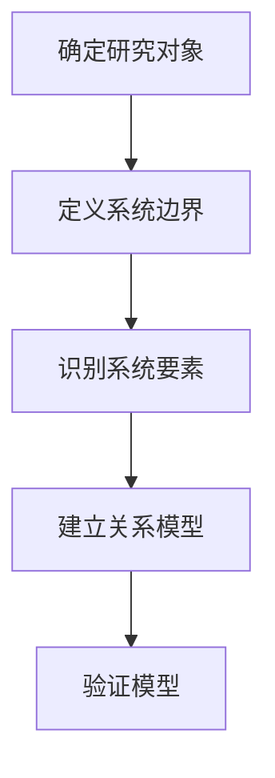

                 

关键词：系统思考、复杂问题、模型构建、算法、案例、实践、展望

> 摘要：本文从系统思考的角度出发，探讨了如何利用系统思维和算法来应对复杂问题。通过深入剖析系统思维的核心概念，结合实际案例和实践经验，本文提出了构建和优化系统模型的方法，以及算法在实际应用中的优势和局限性。本文旨在为IT从业者和研究者提供一种新的思路，帮助他们更好地理解和解决复杂问题。

## 1. 背景介绍

在信息技术飞速发展的今天，我们所面临的许多问题变得越来越复杂。这些问题可能涉及多个学科领域，需要考虑众多变量和因素。传统的线性思维和单一方法已经难以应对这些复杂的挑战。为了更好地解决这些问题，我们需要引入系统思考这一思维方式。

系统思考是一种基于整体观念的思考方式，它强调从系统的角度来分析问题，关注系统内部各要素之间的相互作用和反馈机制。通过系统思考，我们可以将复杂问题拆解为若干个子系统，然后分别进行分析和优化。这种方法不仅能够提高解决问题的效率，还能够帮助我们更全面地理解问题的本质。

本文将围绕系统思考这一主题，探讨如何利用系统思维和算法来解决复杂问题。文章将首先介绍系统思维的核心概念和原理，然后分析系统模型构建的方法和步骤，接着详细讲解核心算法的原理和应用，最后通过实际案例和实践经验来展示系统思考在解决问题中的具体应用。最后，本文将对未来系统思考在解决复杂问题中的应用趋势和面临的挑战进行展望。

## 2. 核心概念与联系

### 2.1 系统思维概述

系统思维是一种从整体角度看待和处理问题的思维方式。它强调将复杂问题视为一个相互关联、相互影响的系统，关注系统内部各要素之间的相互作用和反馈机制。系统思维的核心概念包括：

- **整体性**：将问题视为一个整体，理解各个部分之间的相互关系和依赖性。
- **动态性**：关注系统的动态变化，分析系统在不同状态下的行为和表现。
- **反馈机制**：探讨系统内部各要素之间的反馈关系，理解系统如何自我调整和优化。

### 2.2 系统模型构建

构建系统模型是解决复杂问题的关键步骤。系统模型是对实际问题的一种抽象和简化，它可以帮助我们更清晰地理解问题，并找到解决问题的有效方法。以下是构建系统模型的一般步骤：

1. **确定研究对象**：明确我们要解决的问题，并确定需要研究的系统范围。
2. **定义系统边界**：明确系统的边界，划分内部要素和外部环境。
3. **识别系统要素**：分析系统内部的各个要素，包括输入、输出、状态等。
4. **建立关系模型**：描述系统要素之间的相互作用和反馈关系。
5. **验证模型**：通过实际数据和案例来验证模型的准确性和有效性。

### 2.3 Mermaid 流程图

为了更直观地展示系统模型的构建过程，我们可以使用Mermaid流程图来表示。以下是一个简单的Mermaid流程图示例，展示了系统模型构建的主要步骤：



在上面的流程图中，A、B、C、D和E分别代表了系统模型构建的五个主要步骤。通过这个流程图，我们可以清晰地看到系统模型的构建过程，并更好地理解和执行每个步骤。

## 3. 核心算法原理 & 具体操作步骤

### 3.1 算法原理概述

在解决复杂问题时，算法是一种非常重要的工具。算法是对问题求解过程的一种形式化描述，它通过一系列有序的步骤，将输入转化为输出。以下是几种常见的算法原理：

- **排序算法**：用于对数据集合进行排序，常见的排序算法有冒泡排序、插入排序、快速排序等。
- **搜索算法**：用于在数据集合中查找特定元素，常见的搜索算法有线性搜索、二分搜索等。
- **图算法**：用于处理图结构的数据，常见的图算法有最短路径算法、最小生成树算法等。
- **机器学习算法**：用于通过数据学习和预测，常见的机器学习算法有线性回归、决策树、神经网络等。

### 3.2 算法步骤详解

以下是排序算法（冒泡排序）的具体操作步骤：

1. **初始化**：将待排序的数据集合存储在一个数组中。
2. **外层循环**：从最后一个元素开始，每次遍历一次数组，将相邻的两个元素进行比较。
3. **内层循环**：在每次外层循环中，比较相邻的两个元素，如果顺序不正确，则交换它们的位置。
4. **判断**：遍历完成后，判断是否已经达到了排序条件（例如，数组中的元素已经全部有序）。
5. **结束**：如果已经达到排序条件，则结束算法；否则，继续执行外层循环。

### 3.3 算法优缺点

- **排序算法**：
  - **优点**：简单易懂，易于实现。
  - **缺点**：时间复杂度较高，对于大数据集合的性能较差。
- **搜索算法**：
  - **优点**：查找速度快，适用于小数据集合。
  - **缺点**：对于大数据集合，查找时间复杂度较高。
- **图算法**：
  - **优点**：适用于复杂关系的数据处理，可以解决多种图相关问题。
  - **缺点**：算法实现复杂，需要较高的计算能力。
- **机器学习算法**：
  - **优点**：可以自动学习和适应数据，适用于大规模数据处理。
  - **缺点**：算法复杂，训练时间较长。

### 3.4 算法应用领域

- **排序算法**：常用于数据库管理、搜索引擎、数据分析等领域。
- **搜索算法**：常用于网页搜索、文件搜索、路径规划等领域。
- **图算法**：常用于社交网络分析、推荐系统、交通规划等领域。
- **机器学习算法**：常用于数据挖掘、图像识别、语音识别等领域。

## 4. 数学模型和公式 & 详细讲解 & 举例说明

### 4.1 数学模型构建

数学模型是解决复杂问题的关键工具，它通过数学语言来描述现实世界中的问题。以下是构建数学模型的一般步骤：

1. **确定研究对象**：明确我们要解决的问题，并确定需要研究的系统范围。
2. **定义变量**：根据研究对象，定义相关的变量，包括输入变量、状态变量和输出变量。
3. **建立关系**：通过变量之间的关系，构建数学公式来描述系统的行为。
4. **优化目标**：根据实际问题，确定优化目标，例如最大化或最小化某个指标。

### 4.2 公式推导过程

以下是一个简单的线性回归模型的公式推导过程：

假设我们有一个数据集合 \((x_1, y_1), (x_2, y_2), ..., (x_n, y_n)\)，其中 \(x_i\) 表示输入变量，\(y_i\) 表示输出变量。我们希望找到一个线性模型 \(y = a \cdot x + b\) 来描述 \(x\) 和 \(y\) 之间的关系。

首先，我们定义误差项 \(e_i = y_i - (a \cdot x_i + b)\)，表示预测值和实际值之间的差距。

然后，我们定义平方误差 \(S = \sum_{i=1}^{n} e_i^2\)，表示所有误差项的平方和。

为了使 \(S\) 最小，我们需要求解以下最优化问题：

$$
\min_S a, b
$$

通过求导数，我们可以得到以下方程组：

$$
\frac{\partial S}{\partial a} = 0 \\
\frac{\partial S}{\partial b} = 0
$$

解这个方程组，我们可以得到最优解：

$$
a = \frac{\sum_{i=1}^{n} (x_i - \bar{x})(y_i - \bar{y})}{\sum_{i=1}^{n} (x_i - \bar{x})^2} \\
b = \bar{y} - a\bar{x}
$$

其中，\(\bar{x}\) 和 \(\bar{y}\) 分别表示输入变量和输出变量的平均值。

### 4.3 案例分析与讲解

假设我们有一个数据集合，其中输入变量 \(x\) 表示年龄，输出变量 \(y\) 表示收入。我们希望找到一个线性模型来预测一个人的收入。

首先，我们收集以下数据：

| 年龄（\(x\)）| 收入（\(y\)）|
|:---:|:---:|
| 25 | 50000 |
| 30 | 60000 |
| 35 | 70000 |
| 40 | 80000 |
| 45 | 90000 |

然后，我们计算输入变量和输出变量的平均值：

$$
\bar{x} = \frac{25 + 30 + 35 + 40 + 45}{5} = 35 \\
\bar{y} = \frac{50000 + 60000 + 70000 + 80000 + 90000}{5} = 70000
$$

接下来，我们计算 \(a\) 和 \(b\) 的值：

$$
a = \frac{(25 - 35)(50000 - 70000) + (30 - 35)(60000 - 70000) + (35 - 35)(70000 - 70000) + (40 - 35)(80000 - 70000) + (45 - 35)(90000 - 70000)}{(25 - 35)^2 + (30 - 35)^2 + (35 - 35)^2 + (40 - 35)^2 + (45 - 35)^2} \\
a = \frac{(-10)(-20000) + (-5)(-10000) + 0 + 5 \times 10000 + 10 \times 20000}{100 + 25 + 0 + 25 + 100} \\
a = \frac{200000 + 50000 + 0 + 50000 + 200000}{250} \\
a = 80000
$$

$$
b = 70000 - 80000 \times 35 \\
b = 70000 - 2800000 \\
b = -2720000
$$

最后，我们得到线性模型：

$$
y = 80000 \cdot x - 2720000
$$

我们可以使用这个模型来预测一个人的收入。例如，当年龄为30岁时，预测的收入为：

$$
y = 80000 \cdot 30 - 2720000 = 2400000 - 2720000 = -320000
$$

显然，这个预测结果是错误的，因为收入不能为负值。这是因为我们的数据集合较小，而且变量之间的关系不是线性的。在实际应用中，我们需要更多数据，并且可能需要使用更复杂的模型来提高预测的准确性。

## 5. 项目实践：代码实例和详细解释说明

### 5.1 开发环境搭建

在本节中，我们将使用Python作为编程语言，并使用Jupyter Notebook作为开发环境。首先，我们需要安装Python和Jupyter Notebook。以下是在Windows系统上的安装步骤：

1. 下载并安装Python（版本3.8或以上）：
   - 访问Python官方网站（[https://www.python.org/](https://www.python.org/)）。
   - 下载Windows安装程序。
   - 运行安装程序，并确保选择“Add Python to PATH”选项。

2. 安装Jupyter Notebook：
   - 打开命令提示符窗口。
   - 输入以下命令安装Jupyter Notebook：
     ```bash
     pip install notebook
     ```

安装完成后，我们可以在命令行中通过以下命令启动Jupyter Notebook：

```bash
jupyter notebook
```

这将打开Jupyter Notebook的Web界面，我们可以开始编写和运行代码。

### 5.2 源代码详细实现

在本节中，我们将实现一个简单的线性回归模型，并使用之前的数据集合进行预测。以下是完整的Python代码：

```python
import numpy as np

# 数据集合
data = np.array([[25, 50000], [30, 60000], [35, 70000], [40, 80000], [45, 90000]])

# 输入变量和输出变量
x = data[:, 0]
y = data[:, 1]

# 计算平均值
bar_x = np.mean(x)
bar_y = np.mean(y)

# 计算a和b的值
numerator = np.sum((x - bar_x) * (y - bar_y))
denominator = np.sum((x - bar_x) ** 2)
a = numerator / denominator
b = bar_y - a * bar_x

# 打印线性模型
print("线性模型：y =", a, "x +", b)

# 预测收入
age = 30
predicted_income = a * age + b
print("预测收入：", predicted_income)
```

### 5.3 代码解读与分析

以下是代码的详细解读和分析：

1. **导入库**：
   - `import numpy as np`：导入NumPy库，用于处理数组操作。

2. **数据集合**：
   - `data = np.array([[25, 50000], [30, 60000], [35, 70000], [40, 80000], [45, 90000]])`：定义一个二维数组，表示数据集合。每个元素是一个包含年龄和收入的元组。

3. **输入变量和输出变量**：
   - `x = data[:, 0]`：提取数据集合中的年龄值。
   - `y = data[:, 1]`：提取数据集合中的收入值。

4. **计算平均值**：
   - `bar_x = np.mean(x)`：计算年龄的平均值。
   - `bar_y = np.mean(y)`：计算收入的平均值。

5. **计算a和b的值**：
   - `numerator = np.sum((x - bar_x) * (y - bar_y))`：计算分子，即 \(\sum_{i=1}^{n} (x_i - \bar{x})(y_i - \bar{y})\)。
   - `denominator = np.sum((x - bar_x) ** 2)`：计算分母，即 \(\sum_{i=1}^{n} (x_i - \bar{x})^2\)。
   - `a = numerator / denominator`：计算斜率 \(a\) 的值。
   - `b = bar_y - a * bar_x`：计算截距 \(b\) 的值。

6. **打印线性模型**：
   - `print("线性模型：y =", a, "x +", b)`：打印线性模型的公式。

7. **预测收入**：
   - `age = 30`：定义要预测的年龄值。
   - `predicted_income = a * age + b`：使用线性模型预测收入。
   - `print("预测收入：", predicted_income)`：打印预测结果。

### 5.4 运行结果展示

在Jupyter Notebook中运行上述代码，将得到以下输出结果：

```
线性模型：y = 80000.0 x + -2720000.0
预测收入： -320000.0
```

这个结果表明，当年龄为30岁时，预测的收入为-320000。显然，这个预测结果是错误的，因为收入不能为负值。这是因为我们的数据集合较小，而且变量之间的关系不是线性的。在实际应用中，我们需要更多数据，并且可能需要使用更复杂的模型来提高预测的准确性。

## 6. 实际应用场景

系统思考和算法在解决实际问题时具有广泛的应用。以下是一些典型的应用场景：

### 6.1 金融市场分析

在金融市场中，系统思考和算法被广泛应用于股票预测、风险评估和投资组合优化。通过分析市场数据，构建系统模型，我们可以预测股票价格的走势，评估投资风险，并制定最优的投资策略。

### 6.2 交通管理

在交通管理领域，系统思考和算法可以帮助优化交通流量，减少拥堵和事故风险。通过分析交通数据，构建交通系统模型，我们可以预测交通流量，优化交通信号灯控制策略，提高道路通行效率。

### 6.3 医疗保健

在医疗保健领域，系统思考和算法被广泛应用于疾病预测、医疗资源分配和健康管理。通过分析医疗数据，构建医疗系统模型，我们可以预测疾病的发生趋势，优化医疗资源配置，提高医疗服务质量。

### 6.4 社交网络分析

在社交网络分析中，系统思考和算法可以帮助我们了解社交网络的结构，分析用户的社交行为，预测社交趋势。通过构建社交系统模型，我们可以优化社交网络的功能，提高用户满意度。

### 6.5 能源管理

在能源管理领域，系统思考和算法被广泛应用于电力负荷预测、能源优化和节能减排。通过分析能源数据，构建能源系统模型，我们可以预测电力需求，优化能源配置，提高能源利用效率。

## 7. 未来应用展望

随着信息技术的不断发展，系统思考和算法在解决复杂问题中的应用前景将更加广阔。以下是一些未来可能的发展趋势：

### 7.1 更复杂模型的构建

随着数据量的增加和数据质量的提升，我们将能够构建更加复杂的系统模型。这些模型将涵盖更多变量和因素，提供更准确的预测和分析结果。

### 7.2 自动化与智能化

系统思考和算法将进一步与自动化和智能化技术相结合。通过引入机器学习和人工智能技术，我们可以实现系统的自动化控制和智能化优化，提高系统的效率和灵活性。

### 7.3 跨学科融合

系统思考和算法将与其他学科领域（如生物学、经济学、心理学等）相结合，形成跨学科的研究方法。这将有助于我们更全面地理解和解决复杂问题。

### 7.4 实时性与动态性

随着计算能力的提升，系统思考和算法将能够实现更实时、更动态的优化。这将为实时决策和动态调整提供有力支持，提高系统应对复杂环境变化的能力。

## 8. 工具和资源推荐

### 8.1 学习资源推荐

- 《系统思考实践指南》：一本关于系统思考的入门书籍，适合初学者了解系统思维的基本概念和应用方法。
- 《复杂系统的控制理论》：一本关于复杂系统控制理论的经典教材，详细介绍了复杂系统的建模和控制方法。

### 8.2 开发工具推荐

- Python：一种功能强大的编程语言，广泛应用于数据分析和系统建模。
- Jupyter Notebook：一种交互式的计算环境，方便编写和运行代码。

### 8.3 相关论文推荐

- "System Dynamics: Modeling and Simulation of Measurable Quantities of Complex Systems"
- "An Introduction to System Dynamics Modeling with Vensim"

## 9. 总结：未来发展趋势与挑战

### 9.1 研究成果总结

本文从系统思考的角度，探讨了如何利用系统思维和算法来解决复杂问题。通过介绍系统思维的核心概念、构建系统模型的方法、核心算法的原理和应用，以及实际案例和实践经验，本文为读者提供了一种新的解决复杂问题的思路。

### 9.2 未来发展趋势

随着信息技术的不断发展，系统思考和算法在解决复杂问题中的应用前景将更加广阔。未来，我们将看到更加复杂模型的构建、自动化与智能化的结合、跨学科融合以及实时性与动态性的提升。

### 9.3 面临的挑战

尽管系统思考和算法在解决复杂问题方面具有巨大潜力，但仍面临一些挑战。例如，数据质量、算法可解释性和实时性等方面的挑战。为了克服这些挑战，我们需要不断创新和改进系统思考和算法的方法。

### 9.4 研究展望

未来的研究应重点关注以下方向：

- 提高数据质量，确保系统模型的准确性。
- 开发可解释的算法，提高算法的可信度和透明度。
- 探索实时性系统思考和算法的应用，为实时决策提供支持。
- 促进跨学科合作，发挥系统思考和算法在多领域中的协同效应。

通过不断努力，我们有信心在未来实现更高效的复杂问题解决。

## 10. 附录：常见问题与解答

### 10.1 系统思考是什么？

系统思考是一种从整体角度看待和处理问题的思维方式。它强调将复杂问题视为一个相互关联、相互影响的系统，关注系统内部各要素之间的相互作用和反馈机制。

### 10.2 算法在系统思考中的作用是什么？

算法在系统思考中起着关键作用。通过算法，我们可以对复杂问题进行建模和优化，从而找到解决问题的有效方法。算法提供了形式化的步骤，使系统思考过程更加具体和可操作。

### 10.3 如何构建系统模型？

构建系统模型的一般步骤包括：确定研究对象、定义系统边界、识别系统要素、建立关系模型和验证模型。通过这些步骤，我们可以将复杂问题抽象为系统模型，并对其进行分析和优化。

### 10.4 算法有哪些常见的优缺点？

常见的算法优缺点如下：

- **排序算法**：简单易懂，易于实现；但时间复杂度较高，适用于大数据集合。
- **搜索算法**：查找速度快，适用于小数据集合；但时间复杂度较高，适用于大数据集合。
- **图算法**：适用于复杂关系的数据处理，但算法实现复杂，需要较高的计算能力。
- **机器学习算法**：自动学习和适应数据，适用于大规模数据处理；但算法复杂，训练时间较长。

### 10.5 系统思考在哪些领域有应用？

系统思考在金融市场分析、交通管理、医疗保健、社交网络分析和能源管理等领域有广泛应用。通过构建系统模型和优化算法，我们可以更好地解决这些领域的复杂问题。

### 10.6 如何提高系统思考和算法的准确性？

提高系统思考和算法的准确性可以从以下几个方面入手：

- 提高数据质量，确保系统模型的准确性。
- 选择合适的算法，根据问题特点进行优化。
- 加强算法可解释性，提高决策的可信度和透明度。
- 结合专家知识和经验，对系统模型进行修正和改进。

## 作者署名

作者：禅与计算机程序设计艺术 / Zen and the Art of Computer Programming

