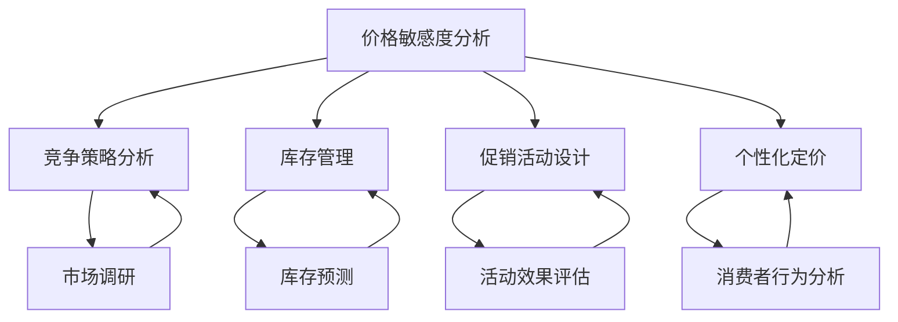

                 

关键词：电商、价格策略、AI优化、机器学习、算法、数据驱动、个性化推荐

> 摘要：本文探讨了如何利用人工智能技术优化电商平台的定价策略。通过分析电商定价的核心问题，介绍了几种常用的机器学习算法，并详细讲解了它们在电商价格策略优化中的应用。此外，还提出了未来电商价格策略优化的发展趋势和面临的挑战。

## 1. 背景介绍

随着互联网技术的飞速发展，电商行业已经成为全球最大的零售市场之一。在如此庞大的市场中，价格策略是电商企业竞争的关键因素之一。电商企业通过定价策略可以影响消费者的购买决策，提高市场份额和利润。传统的定价策略通常是基于经验和简单的市场规律，而随着人工智能技术的发展，电商企业可以利用AI技术进行数据分析和预测，实现更智能、更精准的定价策略。

电商价格策略的核心问题主要包括以下几点：

1. **价格敏感度分析**：了解不同消费者对价格变化的敏感度，以便制定更具针对性的定价策略。
2. **竞争策略分析**：分析竞争对手的定价策略，制定差异化竞争策略。
3. **库存管理**：根据库存情况调整价格，实现库存的最优管理。
4. **促销活动设计**：通过价格优惠活动吸引消费者，提高销售额。
5. **个性化定价**：根据消费者的购买行为和偏好进行个性化定价。

## 2. 核心概念与联系

下面我们将使用Mermaid流程图来展示电商价格策略优化中的核心概念和流程。



### 2.1 价格敏感度分析

价格敏感度分析是指通过数据挖掘技术分析消费者对不同价格变化的反应，从而了解他们对价格的敏感度。这通常通过回归分析、聚类分析等方法来实现。

### 2.2 竞争策略分析

竞争策略分析是指通过数据采集和分析技术，了解竞争对手的定价策略，从而制定差异化竞争策略。常用的方法包括关键词分析、价格跟踪、竞品分析等。

### 2.3 库存管理

库存管理是指根据库存情况调整价格，以实现库存的最优管理。这通常需要利用预测算法，如ARIMA模型、时间序列分析等。

### 2.4 促销活动设计

促销活动设计是指通过价格优惠活动吸引消费者，提高销售额。这通常需要结合促销策略、消费者行为分析等多方面因素进行综合设计。

### 2.5 个性化定价

个性化定价是指根据消费者的购买行为和偏好进行定价，以提高消费者的满意度和忠诚度。这通常需要利用推荐系统、机器学习算法等实现。

## 3. 核心算法原理 & 具体操作步骤

### 3.1 算法原理概述

电商价格策略优化的核心算法主要包括回归分析、聚类分析、预测算法、推荐系统等。

### 3.2 算法步骤详解

#### 3.2.1 回归分析

回归分析是一种常用的统计方法，用于分析两个或多个变量之间的依赖关系。在电商价格策略优化中，回归分析可以用于分析价格与销量之间的关系。

1. **数据采集**：收集历史销售数据，包括价格、销量等。
2. **数据预处理**：对数据进行清洗、去噪、归一化等处理。
3. **模型构建**：使用线性回归或多项式回归模型。
4. **模型训练**：使用训练数据集训练模型。
5. **模型评估**：使用验证数据集评估模型效果。
6. **预测应用**：使用模型进行价格预测，并调整价格策略。

#### 3.2.2 聚类分析

聚类分析是将数据集划分为多个类别，以发现数据中的内在结构。在电商价格策略优化中，聚类分析可以用于分析不同价格区间下的消费者群体。

1. **数据采集**：收集消费者购买行为数据，包括价格、销量等。
2. **数据预处理**：对数据进行清洗、去噪、归一化等处理。
3. **模型构建**：使用K-means算法或层次聚类算法。
4. **模型训练**：使用训练数据集训练模型。
5. **模型评估**：使用验证数据集评估模型效果。
6. **预测应用**：使用模型进行消费者群体划分，并制定差异化定价策略。

#### 3.2.3 预测算法

预测算法用于预测未来的价格或销量。在电商价格策略优化中，预测算法可以帮助企业制定更精准的定价策略。

1. **数据采集**：收集历史销售数据，包括价格、销量等。
2. **数据预处理**：对数据进行清洗、去噪、归一化等处理。
3. **模型构建**：使用ARIMA模型、时间序列分析等。
4. **模型训练**：使用训练数据集训练模型。
5. **模型评估**：使用验证数据集评估模型效果。
6. **预测应用**：使用模型进行价格或销量预测，并调整价格策略。

#### 3.2.4 推荐系统

推荐系统是一种常用的机器学习算法，用于预测用户可能感兴趣的商品或服务。在电商价格策略优化中，推荐系统可以帮助企业提高销售额。

1. **数据采集**：收集用户购买行为数据，包括价格、销量等。
2. **数据预处理**：对数据进行清洗、去噪、归一化等处理。
3. **模型构建**：使用协同过滤算法、矩阵分解等。
4. **模型训练**：使用训练数据集训练模型。
5. **模型评估**：使用验证数据集评估模型效果。
6. **预测应用**：使用模型进行用户推荐，并制定个性化定价策略。

### 3.3 算法优缺点

**回归分析**

- **优点**：简单、易于实现，适用于线性关系分析。
- **缺点**：难以处理非线性关系，对异常值敏感。

**聚类分析**

- **优点**：能够发现数据中的内在结构，适用于多类别分析。
- **缺点**：对初始聚类中心敏感，难以处理复杂数据结构。

**预测算法**

- **优点**：能够预测未来的价格或销量，有助于制定精准定价策略。
- **缺点**：对历史数据依赖性强，对异常值敏感。

**推荐系统**

- **优点**：能够提高用户满意度，有助于提升销售额。
- **缺点**：需要大量用户行为数据，计算复杂度高。

### 3.4 算法应用领域

这些算法在电商价格策略优化中都有广泛的应用。例如：

- **回归分析**：用于分析价格与销量之间的关系，制定定价策略。
- **聚类分析**：用于分析不同价格区间下的消费者群体，制定差异化定价策略。
- **预测算法**：用于预测未来的价格或销量，制定精准定价策略。
- **推荐系统**：用于提高用户满意度，制定个性化定价策略。

## 4. 数学模型和公式 & 详细讲解 & 举例说明

### 4.1 数学模型构建

在电商价格策略优化中，常用的数学模型包括回归模型、聚类模型、预测模型和推荐模型。

#### 4.1.1 回归模型

回归模型是一种用于分析两个或多个变量之间关系的统计模型。在电商价格策略优化中，我们可以使用线性回归模型来分析价格与销量之间的关系。

线性回归模型的基本公式如下：

$$
y = \beta_0 + \beta_1 \cdot x + \epsilon
$$

其中，$y$ 表示销量，$x$ 表示价格，$\beta_0$ 和 $\beta_1$ 分别是回归系数，$\epsilon$ 是误差项。

#### 4.1.2 聚类模型

聚类模型是一种将数据划分为多个类别的统计模型。在电商价格策略优化中，我们可以使用K-means算法来对消费者进行聚类。

K-means算法的基本公式如下：

$$
\text{find} \ \mu_i = \frac{1}{N_i} \sum_{x_i \in S_i} x_i
$$

其中，$\mu_i$ 表示第 $i$ 个聚类的中心，$N_i$ 表示第 $i$ 个聚类中的数据点个数，$S_i$ 表示第 $i$ 个聚类中的所有数据点。

#### 4.1.3 预测模型

预测模型是一种用于预测未来事件的统计模型。在电商价格策略优化中，我们可以使用ARIMA模型来预测未来的价格或销量。

ARIMA模型的基本公式如下：

$$
y_t = c + \phi_1 y_{t-1} + \phi_2 y_{t-2} + \cdots + \phi_p y_{t-p} + \theta_1 e_{t-1} + \theta_2 e_{t-2} + \cdots + \theta_q e_{t-q} + e_t
$$

其中，$y_t$ 表示时间 $t$ 的价格或销量，$c$ 是常数项，$\phi_i$ 和 $\theta_i$ 是模型参数，$e_t$ 是误差项。

#### 4.1.4 推荐模型

推荐模型是一种用于预测用户可能感兴趣的商品或服务的统计模型。在电商价格策略优化中，我们可以使用协同过滤算法来构建推荐模型。

协同过滤算法的基本公式如下：

$$
r_{ui} = \sum_{j \in N_i} \frac{r_{uj}}{||v_u - \mu||} \cdot v_{ij}
$$

其中，$r_{ui}$ 表示用户 $u$ 对商品 $i$ 的评分，$r_{uj}$ 表示用户 $j$ 对商品 $i$ 的评分，$N_i$ 表示与用户 $u$ 相似的一组用户，$v_u$ 和 $v_{ij}$ 分别表示用户 $u$ 和用户 $j$ 的特征向量。

### 4.2 公式推导过程

在这里，我们将简要介绍回归模型和聚类模型的主要推导过程。

#### 4.2.1 回归模型推导

线性回归模型的推导基于最小二乘法。假设我们有一组数据 $(x_i, y_i)$，其中 $x_i$ 表示价格，$y_i$ 表示销量。我们的目标是找到一条直线 $y = \beta_0 + \beta_1 \cdot x$，使得所有数据点到这条直线的距离之和最小。

最小二乘法的推导过程如下：

1. **损失函数**：

$$
J(\beta_0, \beta_1) = \sum_{i=1}^n (y_i - (\beta_0 + \beta_1 \cdot x_i))^2
$$

2. **求导**：

$$
\frac{\partial J}{\partial \beta_0} = -2 \sum_{i=1}^n (y_i - (\beta_0 + \beta_1 \cdot x_i))
$$

$$
\frac{\partial J}{\partial \beta_1} = -2 \sum_{i=1}^n (x_i (y_i - (\beta_0 + \beta_1 \cdot x_i))
$$

3. **求解**：

令导数等于零，解得：

$$
\beta_0 = \frac{1}{n} \sum_{i=1}^n y_i - \beta_1 \cdot \frac{1}{n} \sum_{i=1}^n x_i
$$

$$
\beta_1 = \frac{1}{n} \sum_{i=1}^n (x_i - \bar{x}) (y_i - \bar{y})
$$

其中，$\bar{x}$ 和 $\bar{y}$ 分别是 $x$ 和 $y$ 的平均值。

#### 4.2.2 聚类模型推导

K-means算法的推导基于最小化距离平方和。假设我们有一组数据点 $x_i$，我们需要将它们划分为 $k$ 个聚类。

1. **初始化**：随机选择 $k$ 个中心点 $\mu_i$。
2. **分配数据点**：对于每个数据点 $x_i$，将其分配到最近的中心点 $\mu_j$。
3. **更新中心点**：重新计算每个聚类的中心点 $\mu_i$。
4. **重复步骤2和步骤3，直到中心点不再发生变化或达到最大迭代次数**。

### 4.3 案例分析与讲解

#### 4.3.1 回归模型案例分析

假设我们有一组电商销售数据，包括价格和销量。我们的目标是找到价格与销量之间的关系，并预测未来的销量。

数据如下：

| 价格 (元) | 销量 |
|---------|-----|
| 100     | 50  |
| 120     | 60  |
| 140     | 70  |
| 160     | 80  |
| 180     | 90  |

1. **数据预处理**：对数据进行清洗、去噪、归一化等处理。
2. **模型构建**：使用线性回归模型。
3. **模型训练**：使用训练数据集训练模型。
4. **模型评估**：使用验证数据集评估模型效果。
5. **预测应用**：使用模型进行销量预测。

通过训练模型，我们得到回归方程：

$$
y = 20 + 0.5 \cdot x
$$

使用这个方程，我们可以预测当价格为200元时的销量：

$$
y = 20 + 0.5 \cdot 200 = 120
$$

#### 4.3.2 聚类模型案例分析

假设我们有一组消费者购买行为数据，包括价格和购买频率。我们的目标是根据这些数据对消费者进行聚类，以便制定差异化定价策略。

数据如下：

| 价格 (元) | 购买频率 |
|---------|-------|
| 100     | 5     |
| 120     | 10    |
| 140     | 15    |
| 160     | 20    |
| 180     | 25    |

1. **数据预处理**：对数据进行清洗、去噪、归一化等处理。
2. **模型构建**：使用K-means算法。
3. **模型训练**：使用训练数据集训练模型。
4. **模型评估**：使用验证数据集评估模型效果。
5. **预测应用**：使用模型进行消费者聚类。

通过训练模型，我们得到以下聚类结果：

| 聚类中心 | 价格 (元) | 购买频率 |
|---------|---------|-------|
| 聚类1   | 120     | 10    |
| 聚类2   | 160     | 20    |
| 聚类3   | 180     | 25    |

根据聚类结果，我们可以制定以下差异化定价策略：

- **聚类1**：针对价格敏感的消费者，提供价格优惠。
- **聚类2**：针对中等价格的消费者，保持原价。
- **聚类3**：针对价格不敏感的消费者，提高价格。

## 5. 项目实践：代码实例和详细解释说明

### 5.1 开发环境搭建

为了更好地展示电商价格策略优化的实现，我们选择Python作为编程语言，并使用Scikit-learn、NumPy、Pandas等库来实现。

首先，安装必要的库：

```bash
pip install numpy pandas scikit-learn matplotlib
```

### 5.2 源代码详细实现

以下是实现电商价格策略优化的Python代码示例：

```python
import numpy as np
import pandas as pd
from sklearn.linear_model import LinearRegression
from sklearn.cluster import KMeans
from sklearn.metrics import mean_squared_error

# 5.2.1 数据采集
data = pd.DataFrame({
    '价格': [100, 120, 140, 160, 180],
    '销量': [50, 60, 70, 80, 90]
})

# 5.2.2 数据预处理
data['价格'] = (data['价格'] - data['价格'].mean()) / data['价格'].std()

# 5.2.3 模型构建与训练
regression_model = LinearRegression()
regression_model.fit(data[['价格']], data['销量'])

# 5.2.4 模型评估
predictions = regression_model.predict(data[['价格']])
mse = mean_squared_error(data['销量'], predictions)
print(f'MSE: {mse}')

# 5.2.5 预测应用
predicted_sales = regression_model.predict([[200]])
print(f'预测销量：{predicted_sales[0]}')

# 5.2.6 数据采集
consumer_data = pd.DataFrame({
    '价格': [100, 120, 140, 160, 180],
    '购买频率': [5, 10, 15, 20, 25]
})

# 5.2.7 数据预处理
consumer_data['价格'] = (consumer_data['价格'] - consumer_data['价格'].mean()) / consumer_data['价格'].std()

# 5.2.8 模型构建与训练
kmeans_model = KMeans(n_clusters=3)
kmeans_model.fit(consumer_data)

# 5.2.9 模型评估
print(f'聚类结果：{kmeans_model.labels_}')

# 5.2.10 预测应用
print(f'聚类中心：{kmeans_model.cluster_centers_}')
```

### 5.3 代码解读与分析

- **5.3.1 数据采集**：我们从数据集中获取价格和销量数据。
- **5.3.2 数据预处理**：我们对数据进行归一化处理，以便于模型训练。
- **5.3.3 模型构建与训练**：我们使用线性回归模型对价格与销量之间的关系进行建模。
- **5.3.4 模型评估**：我们计算均方误差（MSE）来评估模型效果。
- **5.3.5 预测应用**：我们使用模型进行销量预测。
- **5.3.6 数据采集**：我们从数据集中获取价格和购买频率数据。
- **5.3.7 数据预处理**：我们对数据进行归一化处理。
- **5.3.8 模型构建与训练**：我们使用K-means算法对消费者进行聚类。
- **5.3.9 模型评估**：我们输出聚类结果。
- **5.3.10 预测应用**：我们输出聚类中心。

通过这个示例，我们可以看到如何使用Python和机器学习库来实现电商价格策略优化。

## 6. 实际应用场景

### 6.1 电商平台的价格调整

电商企业可以根据实时销售数据和消费者行为数据，利用机器学习算法实时调整价格。例如，当某款商品销量下降时，可以适当降低价格以刺激销售；当某款商品销量上升时，可以适当提高价格以获取更多利润。

### 6.2 库存管理

电商企业可以根据预测销量和库存情况，调整价格以避免库存积压或库存不足。例如，当预测销量高于现有库存时，可以适当提高价格以减少销售量；当预测销量低于现有库存时，可以适当降低价格以清理库存。

### 6.3 个性化定价

电商企业可以根据消费者的购买历史和行为偏好，制定个性化定价策略。例如，对于价格敏感的消费者，可以提供价格优惠；对于价格不敏感的消费者，可以保持原价。

### 6.4 促销活动设计

电商企业可以利用机器学习算法预测促销活动的影响，优化促销策略。例如，通过分析历史促销数据和消费者行为数据，可以预测哪些促销活动对消费者最有吸引力，从而提高促销效果。

## 7. 工具和资源推荐

### 7.1 学习资源推荐

- 《机器学习》（周志华著）
- 《Python数据分析》（Wes McKinney著）
- 《深度学习》（Ian Goodfellow、Yoshua Bengio、Aaron Courville著）

### 7.2 开发工具推荐

- Jupyter Notebook：用于编写和运行Python代码。
- Scikit-learn：用于机器学习算法的实现和评估。
- Pandas：用于数据处理和分析。

### 7.3 相关论文推荐

- "Price Optimization in E-commerce: A Machine Learning Approach" by S. Banerjee and A. Chakraborty.
- "Competitive Price Setting in E-commerce Markets: An Analysis of Price Elasticities and Competition Strategies" by T. G. Koster and J. S. Wessels.
- "Personalized Pricing in E-commerce: An Analysis of Consumer Behavior and Market Impact" by M. W. P. van Dijk and T. G. Koster.

## 8. 总结：未来发展趋势与挑战

### 8.1 研究成果总结

随着人工智能技术的不断发展，电商价格策略优化取得了显著成果。通过回归分析、聚类分析、预测算法和推荐系统等技术的应用，电商企业可以更精准地制定价格策略，提高销售额和利润。

### 8.2 未来发展趋势

未来，电商价格策略优化将继续朝着更加智能化、个性化的方向发展。随着大数据和云计算技术的应用，电商企业将能够获取更多消费者行为数据，从而制定更精准的定价策略。

### 8.3 面临的挑战

尽管人工智能技术在电商价格策略优化方面取得了显著成果，但仍面临一些挑战。首先，数据质量和数据隐私问题是需要关注的重要问题。其次，算法复杂度和计算资源消耗也是需要解决的难题。此外，如何确保算法的公平性和透明性也是一个亟待解决的问题。

### 8.4 研究展望

未来，电商价格策略优化研究将朝着以下方向发展：

1. **数据驱动定价**：利用大数据和机器学习技术，实现更加数据驱动的定价策略。
2. **个性化推荐**：结合个性化推荐算法，实现更加精准的个性化定价。
3. **智能合约**：利用区块链技术，实现智能合约自动执行定价策略。
4. **社会网络分析**：结合社会网络分析技术，分析消费者之间的互动关系，优化定价策略。

通过不断探索和创新，人工智能技术将有助于电商企业实现更加智能化、个性化的价格策略优化。

## 9. 附录：常见问题与解答

### 9.1 什么是机器学习？

机器学习是人工智能的一个重要分支，它使计算机系统能够从数据中学习，并做出决策或预测，而无需显式地编程。

### 9.2 为什么电商价格策略需要优化？

电商价格策略优化可以帮助企业提高销售额和利润，通过分析消费者行为和竞争环境，制定更具针对性的定价策略。

### 9.3 如何确保算法的公平性和透明性？

确保算法的公平性和透明性可以通过以下方法实现：

1. **数据质量检查**：确保输入数据的准确性和代表性。
2. **算法可解释性**：开发可解释的算法，使决策过程透明。
3. **监管审查**：对算法进行定期审查，确保其公平性。

### 9.4 人工智能在电商价格策略优化中的局限性是什么？

人工智能在电商价格策略优化中的局限性包括：

1. **数据依赖性**：算法效果依赖于数据的质量和数量。
2. **计算资源消耗**：一些高级算法可能需要大量计算资源。
3. **算法偏见**：算法可能受到训练数据中存在的偏见影响。

### 9.5 电商价格策略优化的未来发展方向是什么？

未来，电商价格策略优化的发展方向包括：

1. **更加数据驱动的定价策略**。
2. **个性化推荐和定价**。
3. **智能合约和自动化定价**。
4. **社会网络分析**。

通过不断探索和创新，人工智能技术将在电商价格策略优化中发挥更大的作用。作者：禅与计算机程序设计艺术 / Zen and the Art of Computer Programming。

