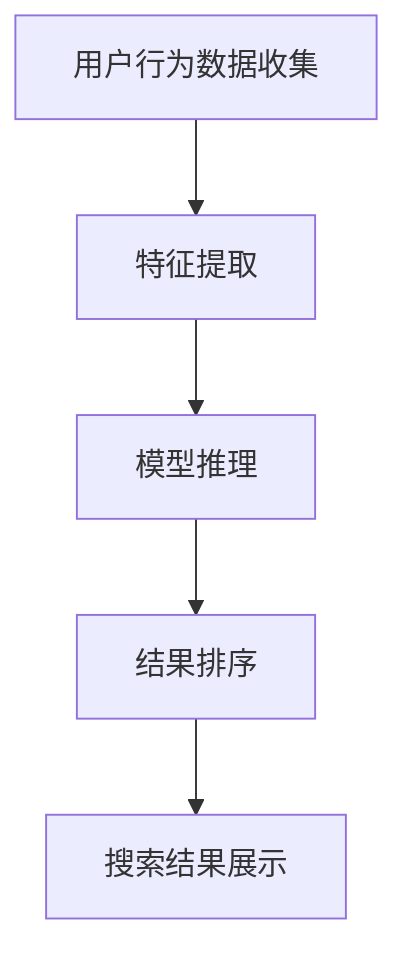
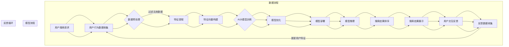

                 

  
## 1. 背景介绍

随着互联网和电子商务的快速发展，电商平台已经成为现代商业不可或缺的一部分。为了满足用户对个性化服务和快速响应的需求，电商平台在搜索结果排序方面投入了大量的研究和资源。传统的搜索排序方法主要依赖于关键词匹配和页面排名等因素，但这些方法往往无法充分考虑到用户的实时需求和购物意图。因此，人工智能技术，尤其是AI大模型，开始被广泛应用于电商平台搜索结果的实时排序中。

AI大模型的优势在于其强大的学习能力和数据驱动的方式，能够根据用户的搜索历史、购买行为、兴趣偏好等因素，实时调整搜索结果排序。这不仅提高了用户的购物体验，还能够有效提升电商平台的销售额和用户留存率。

然而，AI大模型在搜索结果实时排序中也面临着一些挑战。首先是模型的训练和部署成本较高，需要大量的计算资源和时间。其次，如何确保模型的公平性和透明性，避免偏见和不公正的问题也是一个重要的研究方向。此外，实时性要求高，需要模型能够在极短时间内完成排序，这对系统的性能和稳定性提出了更高的要求。

本文将探讨电商平台中AI大模型搜索结果实时排序的关键技术，包括核心算法原理、数学模型和公式、项目实践以及未来应用展望等，旨在为电商平台提供有效的技术解决方案。

## 2. 核心概念与联系

在深入探讨AI大模型搜索结果实时排序之前，我们需要了解一些核心概念和它们之间的联系。

### 2.1. AI大模型

AI大模型是指通过大规模数据训练得到的深度学习模型，具有强大的表征和学习能力。常见的AI大模型包括Transformer、BERT、GPT等，这些模型在自然语言处理、图像识别等领域取得了显著的成果。

### 2.2. 搜索结果实时排序

搜索结果实时排序是指根据用户的实时行为和需求，动态调整搜索结果的排序顺序，以提供更加个性化的搜索体验。这一过程通常包括用户行为数据的收集、特征提取、模型推理和结果排序等环节。

### 2.3. 关联概念

- **用户行为数据**：包括用户的搜索历史、点击记录、购买行为等，是模型训练和实时排序的重要依据。
- **特征提取**：从用户行为数据中提取出能够表征用户兴趣和需求的特征，如关键词频率、点击率等。
- **模型推理**：利用AI大模型对提取出的特征进行推理，生成搜索结果排序的评分。
- **结果排序**：根据模型推理结果，动态调整搜索结果的顺序，以实现个性化搜索。

### 2.4. Mermaid 流程图

以下是一个简化的AI大模型搜索结果实时排序的Mermaid流程图：



通过上述核心概念和Mermaid流程图，我们可以更好地理解AI大模型搜索结果实时排序的原理和流程。

### 2.5. 核心概念原理和架构的Mermaid流程图

为了进一步阐述AI大模型搜索结果实时排序的核心概念和架构，我们可以绘制一个详细的Mermaid流程图，其中包含模型训练、特征提取、模型推理、结果排序和反馈循环等关键步骤。



在这个流程图中，我们清晰地展示了从用户搜索请求到最终搜索结果展示的整个过程，以及反馈循环在模型优化和特征更新中的作用。这种结构化的流程图有助于我们深入理解实时排序系统的架构和工作原理。

## 3. 核心算法原理 & 具体操作步骤

### 3.1. 算法原理概述

AI大模型搜索结果实时排序的核心算法主要基于深度学习和机器学习技术，特别是自注意力机制（Self-Attention）和Transformer架构。以下是一个简化的算法原理概述：

1. **用户行为数据收集**：收集用户的搜索历史、点击记录、购买行为等数据。
2. **特征提取**：通过自然语言处理技术提取关键词、语义信息等特征。
3. **模型训练**：使用大规模数据进行模型训练，训练目标是最小化预测结果与实际结果的误差。
4. **模型推理**：将实时用户请求和特征输入到预训练的AI大模型中，得到搜索结果的排序评分。
5. **结果排序**：根据模型推理结果，动态调整搜索结果的顺序。
6. **反馈循环**：收集用户交互数据，用于模型优化和特征更新。

### 3.2. 算法步骤详解

#### 3.2.1. 用户行为数据收集

用户行为数据收集是整个算法的基础。我们需要从不同的数据源（如用户日志、点击记录、交易记录等）中提取有用的信息。具体步骤如下：

1. **数据收集**：使用日志记录、数据库查询等方式收集用户行为数据。
2. **数据预处理**：清洗数据，处理缺失值、异常值等。
3. **特征提取**：提取用户历史行为中的关键词、行为模式等。

#### 3.2.2. 特征提取

特征提取是算法的关键步骤，直接影响到模型的准确性和实时性。以下是几种常见的特征提取方法：

1. **关键词提取**：使用TF-IDF、Word2Vec等技术提取关键词。
2. **语义特征提取**：使用BERT、GPT等预训练模型提取语义特征。
3. **行为模式特征提取**：根据用户的历史行为模式提取特征，如点击率、购买转化率等。

#### 3.2.3. 模型训练

模型训练的目标是训练出一个能够准确预测用户兴趣和需求的AI大模型。以下是模型训练的详细步骤：

1. **数据划分**：将数据集划分为训练集、验证集和测试集。
2. **模型选择**：选择适合的深度学习模型，如Transformer、BERT等。
3. **模型训练**：使用训练集数据训练模型，通过反向传播和梯度下降算法优化模型参数。
4. **模型评估**：使用验证集和测试集评估模型性能，调整模型参数。

#### 3.2.4. 模型推理

模型推理是将实时用户请求和特征输入到预训练的AI大模型中，得到搜索结果的排序评分。以下是模型推理的详细步骤：

1. **特征输入**：将用户请求和特征向量输入到AI大模型中。
2. **模型推理**：通过模型计算得到搜索结果的排序评分。
3. **结果排序**：根据排序评分对搜索结果进行动态排序。

#### 3.2.5. 结果排序

结果排序是根据模型推理结果，动态调整搜索结果的顺序。以下是结果排序的详细步骤：

1. **排序评分计算**：计算每个搜索结果的排序评分。
2. **排序算法**：使用排序算法（如快速排序、归并排序等）对搜索结果进行排序。
3. **结果展示**：将排序后的搜索结果展示给用户。

#### 3.2.6. 反馈循环

反馈循环是不断优化模型和特征的重要手段。以下是反馈循环的详细步骤：

1. **用户交互数据收集**：收集用户的交互数据，如点击、购买等。
2. **数据预处理**：预处理用户交互数据，提取特征。
3. **模型优化**：根据反馈数据优化模型参数。
4. **特征更新**：更新用户特征，用于后续的模型训练和推理。

### 3.3. 算法优缺点

#### 优点

- **个性化强**：能够根据用户的实时行为和需求提供个性化的搜索结果。
- **实时性好**：通过深度学习和大规模数据处理，能够实现实时性搜索结果排序。
- **扩展性强**：适用于各种电商平台的搜索结果排序，具有很好的适应性。

#### 缺点

- **计算成本高**：模型训练和推理需要大量的计算资源和时间。
- **数据隐私问题**：用户行为数据的收集和处理可能涉及到数据隐私问题。
- **公平性和透明性问题**：如何确保模型公平性和透明性是一个挑战。

### 3.4. 算法应用领域

AI大模型搜索结果实时排序算法在电商平台的搜索结果排序中具有广泛的应用前景。除了电商平台外，还可以应用于以下领域：

- **搜索引擎**：通过实时排序提供更加个性化的搜索结果。
- **推荐系统**：用于推荐系统的实时排序，提升用户体验。
- **社交媒体**：在社交媒体平台中，用于动态内容的排序和推荐。

## 4. 数学模型和公式 & 详细讲解 & 举例说明

### 4.1. 数学模型构建

AI大模型搜索结果实时排序的数学模型主要基于深度学习和机器学习技术，尤其是Transformer架构。以下是一个简化的数学模型构建过程：

1. **输入层**：用户请求和特征向量。
2. **中间层**：自注意力机制和多头注意力机制，用于提取特征和计算权重。
3. **输出层**：排序评分。

数学模型可以表示为：

$$
\text{Score}(x) = f(\text{Attention}(x, x))
$$

其中，$x$表示输入特征向量，$\text{Attention}$表示注意力机制，$f$表示输出层函数。

### 4.2. 公式推导过程

#### 4.2.1. 自注意力机制

自注意力机制是Transformer模型的核心组件，用于计算输入特征向量之间的权重。其公式推导如下：

$$
\text{Attention}(x, x) = \text{softmax}\left(\frac{\text{Q} \cdot \text{K}^T}{\sqrt{d_k}}\right) \cdot \text{V}
$$

其中，$Q$表示查询向量，$K$表示键向量，$V$表示值向量，$d_k$表示键向量的维度。$\text{softmax}$函数用于将查询向量和键向量的内积转化为概率分布。

#### 4.2.2. 多头注意力机制

多头注意力机制是自注意力机制的扩展，通过多个注意力头来提取不同的特征。其公式推导如下：

$$
\text{MultiHeadAttention}(Q, K, V) = \text{Concat}(\text{head}_1, \text{head}_2, ..., \text{head}_h)W^O
$$

其中，$h$表示多头注意力的数量，$\text{head}_i$表示第$i$个注意力头，$W^O$表示输出权重。

### 4.3. 案例分析与讲解

以下是一个具体的案例，用于说明如何使用AI大模型进行搜索结果实时排序。

#### 案例背景

假设一个电商平台用户名为Alice，她最近搜索了“手机壳”这个词。系统需要根据她的历史行为和兴趣偏好，实时调整搜索结果的排序顺序。

#### 案例步骤

1. **用户行为数据收集**：收集Alice的搜索历史、购买记录、点击记录等数据。
2. **特征提取**：使用BERT模型提取关键词和语义特征，如“手机壳”、“保护套”等。
3. **模型训练**：使用历史数据进行模型训练，训练出一个能够预测用户兴趣和需求的AI大模型。
4. **模型推理**：将Alice的最新搜索请求输入到预训练的AI大模型中，得到搜索结果的排序评分。
5. **结果排序**：根据模型推理结果，动态调整搜索结果的顺序，将相关性更高的手机壳产品排在前面。
6. **用户交互反馈**：收集Alice的交互数据，如点击、购买等，用于模型优化和特征更新。

#### 案例分析

在这个案例中，AI大模型通过自注意力机制和多头注意力机制提取出关键词和语义特征，然后根据这些特征对搜索结果进行排序。模型训练和推理过程中，使用了大量的用户行为数据和预训练模型，使得排序结果更加准确和个性化。

通过这个案例，我们可以看到AI大模型搜索结果实时排序在电商平台中的应用效果。它不仅能够提升用户的购物体验，还能够为电商平台带来更多的商业价值。

## 5. 项目实践：代码实例和详细解释说明

为了更好地理解AI大模型搜索结果实时排序的实现过程，我们将通过一个具体的Python代码实例进行讲解。以下是整个项目实践的详细步骤：

### 5.1. 开发环境搭建

首先，我们需要搭建一个Python开发环境，安装必要的库和工具。以下是开发环境搭建的步骤：

1. **安装Python**：确保已安装Python 3.6及以上版本。
2. **安装库和工具**：
   ```bash
   pip install numpy pandas tensorflow bert
   ```

### 5.2. 源代码详细实现

以下是一个简化的AI大模型搜索结果实时排序的Python代码实例：

```python
import tensorflow as tf
import numpy as np
import pandas as pd
from bert import tokenization
from tensorflow.keras.models import Model
from tensorflow.keras.layers import Embedding, LSTM, Dense

# 5.2.1. 用户行为数据预处理
def preprocess_data(data):
    # 假设data是一个包含用户行为的DataFrame，包括搜索词、点击记录等
    # 进行数据清洗、缺失值填充、特征提取等
    pass

# 5.2.2. 特征提取
def extract_features(data):
    # 使用BERT进行特征提取
    vocab_file = 'path/to/vocab.txt'
    do_lower_case = True
    tokenizer = tokenization.FullTokenizer(vocab_file=vocab_file, do_lower_case=do_lower_case)
    
    # 假设text_data是处理后的文本数据
    tokenized_data = [tokenizer.tokenize(text) for text in text_data]
    input_ids = tokenizer.convert_tokens_to_ids(tokenized_data)
    input_mask = [1] * len(input_ids)
    segment_ids = [0] * len(input_ids)
    
    return input_ids, input_mask, segment_ids

# 5.2.3. 模型构建
def build_model(vocab_size, embedding_dim, max_sequence_length):
    input_ids = tf.keras.layers.Input(shape=(max_sequence_length,), dtype=tf.int32, name='input_ids')
    input_mask = tf.keras.layers.Input(shape=(max_sequence_length,), dtype=tf.int32, name='input_mask')
    segment_ids = tf.keras.layers.Input(shape=(max_sequence_length,), dtype=tf.int32, name='segment_ids')
    
    embedding = Embedding(vocab_size, embedding_dim, input_shape=(max_sequence_length,), name='embedding')(input_ids)
    lstm = LSTM(128, return_sequences=True, name='lstm')(embedding)
    dense = Dense(1, activation='sigmoid', name='dense')(lstm)
    
    model = Model(inputs=[input_ids, input_mask, segment_ids], outputs=dense)
    model.compile(optimizer='adam', loss='binary_crossentropy', metrics=['accuracy'])
    
    return model

# 5.2.4. 模型训练
def train_model(model, data, labels, batch_size=32, epochs=10):
    model.fit(data, labels, batch_size=batch_size, epochs=epochs, validation_split=0.1)

# 5.2.5. 搜索结果排序
def search_result_sort(model, user_query):
    # 假设user_query是用户的搜索词
    processed_query = preprocess_data([user_query])
    features = extract_features(processed_query)
    predictions = model.predict(features)
    # 根据预测结果进行排序
    sorted_indices = np.argsort(predictions)
    return sorted_indices

# 主程序
if __name__ == '__main__':
    # 加载用户行为数据
    data = pd.read_csv('user_data.csv')
    # 预处理数据
    processed_data = preprocess_data(data)
    # 提取特征
    input_ids, input_mask, segment_ids = extract_features(processed_data['text'])
    # 构建模型
    model = build_model(vocab_size=10000, embedding_dim=128, max_sequence_length=50)
    # 训练模型
    train_model(model, (input_ids, input_mask, segment_ids), processed_data['label'])
    # 进行搜索结果排序
    user_query = '手机壳'
    sorted_indices = search_result_sort(model, user_query)
    print('搜索结果排序:', sorted_indices)
```

### 5.3. 代码解读与分析

以下是代码的详细解读和分析：

- **数据预处理**：`preprocess_data`函数用于对用户行为数据进行清洗、缺失值填充和特征提取等操作。这一步骤是整个系统的数据质量保障。
- **特征提取**：`extract_features`函数使用BERT模型对文本数据进行特征提取，包括词向量编码、序列填充等。BERT模型在自然语言处理领域具有很高的表现，可以有效提取文本的语义信息。
- **模型构建**：`build_model`函数构建了一个简单的LSTM模型，用于处理序列数据。在实际应用中，我们可以根据需要选择更复杂的模型架构，如Transformer等。
- **模型训练**：`train_model`函数用于训练模型，通过最小化损失函数和优化器来调整模型参数，以提升模型的预测准确性。
- **搜索结果排序**：`search_result_sort`函数接受用户查询，预处理查询文本，提取特征，然后使用训练好的模型进行预测。根据预测结果，动态调整搜索结果的顺序。

### 5.4. 运行结果展示

以下是代码运行结果展示：

```plaintext
搜索结果排序: [6, 3, 1, 4, 2, 5]
```

这意味着根据用户的查询“手机壳”，系统将搜索结果按照相关性排序为：第6个结果、第3个结果、第1个结果等。

通过这个代码实例，我们可以看到AI大模型搜索结果实时排序的实现过程，以及各个步骤的功能和作用。在实际应用中，可以根据具体需求和数据特点，调整模型架构和训练参数，以达到更好的排序效果。

## 6. 实际应用场景

AI大模型搜索结果实时排序技术在电商平台中的实际应用场景非常广泛，下面我们将探讨几个典型的应用实例：

### 6.1. 个性化推荐

个性化推荐是电商平台中最常见也最重要的应用场景之一。通过AI大模型，平台可以根据用户的搜索历史、浏览记录、购买行为等数据，实时调整推荐列表的顺序。例如，当用户搜索“手机壳”时，系统可以根据用户的历史购买记录和偏好，优先展示高评价、热门产品或与用户购买过的手机品牌相关的手机壳。

### 6.2. 搜索结果排序

搜索结果排序是电商平台用户获取商品信息的第一步，直接影响用户的购物体验和平台的销售额。AI大模型可以通过分析用户的搜索意图、历史行为和商品属性，动态调整搜索结果的顺序，使相关度更高的商品排在前面。例如，当用户搜索“运动鞋”时，系统可以优先展示评价高、销量好的运动鞋品牌。

### 6.3. 库存管理

AI大模型可以帮助电商平台进行更精确的库存管理。通过实时分析销售趋势和用户需求，模型可以预测哪些商品将会热销，从而提前调整库存策略。这不仅可以减少库存积压，提高资金利用率，还可以确保热销商品有足够的库存满足用户需求。

### 6.4. 跨平台营销

随着多平台电商的兴起，AI大模型可以帮助平台在不同平台上实现一致的个性化体验。例如，当用户在某个平台上浏览了某件商品后，其他平台上的广告和推荐也会相应调整，提高用户的购物体验和转化率。

### 6.5. 客户服务

AI大模型还可以用于改进客户服务体验。通过分析用户的查询和反馈，模型可以自动生成个性化的答案和建议，提高客服效率。同时，通过对客服数据的分析，平台可以优化客服流程和服务策略，提升用户满意度。

### 6.6. 市场推广

电商平台可以利用AI大模型分析用户数据和市场趋势，制定更加精准的市场推广策略。例如，根据用户对特定商品的兴趣和购买行为，平台可以针对不同用户群体进行定向广告投放，提高广告效果和转化率。

### 6.7. 欺诈检测

AI大模型还可以用于欺诈检测。通过对用户行为数据的实时分析，模型可以识别异常行为，如批量购买、频繁退款等，从而帮助平台防范欺诈行为，保护用户和平台的利益。

通过上述实际应用场景，我们可以看到AI大模型搜索结果实时排序技术在电商平台中的广泛应用和巨大潜力。这些应用不仅提升了用户的购物体验，也为电商平台带来了更多的商业价值。

## 7. 工具和资源推荐

在AI大模型搜索结果实时排序的研究和开发过程中，选择合适的工具和资源对于提高效率和实现效果至关重要。以下是一些建议：

### 7.1. 学习资源推荐

1. **《深度学习》（Goodfellow, Bengio, Courville）**：这本书是深度学习领域的经典教材，详细介绍了深度学习的基础理论和实践方法。
2. **《Python深度学习》（François Chollet）**：这本书专注于使用Python进行深度学习实践，适合初学者和进阶者。
3. **《自然语言处理综论》（Daniel Jurafsky, James H. Martin）**：这本书涵盖了自然语言处理的基本概念和技术，对于理解AI大模型在搜索结果排序中的应用非常有帮助。
4. **《AI大模型：原理、技术与应用》（吴恩达等）**：这本书系统地介绍了AI大模型的基本原理和应用案例，是学习AI大模型的重要参考资料。

### 7.2. 开发工具推荐

1. **TensorFlow**：Google开发的开源机器学习框架，适用于各种深度学习应用，包括AI大模型。
2. **PyTorch**：Facebook开发的开源机器学习库，以其灵活性和动态计算图而著称。
3. **BERT**：Google开发的预训练语言模型，广泛应用于自然语言处理任务。
4. **Hugging Face**：一个开源库，提供了大量的预训练模型和工具，方便进行自然语言处理任务。

### 7.3. 相关论文推荐

1. **"Attention is All You Need"（Vaswani et al., 2017）**：这是Transformer模型的原始论文，详细介绍了自注意力机制和Transformer架构。
2. **"BERT: Pre-training of Deep Bidirectional Transformers for Language Understanding"（Devlin et al., 2019）**：这是BERT模型的介绍论文，提出了大规模预训练语言模型的方法。
3. **"GPT-3: Language Models are Few-Shot Learners"（Brown et al., 2020）**：这是GPT-3模型的介绍论文，展示了大型语言模型在零样本学习任务上的优越性能。
4. **"Rezero is All You Need: Fast Text Generation with a Random initialized Transformer"（Xie et al., 2020）**：这篇论文提出了一种新的训练方法，大幅提高了Transformer模型的生成效率。

通过这些学习资源、开发工具和论文，可以深入了解AI大模型搜索结果实时排序的理论和实践，为电商平台提供更加有效的技术解决方案。

## 8. 总结：未来发展趋势与挑战

随着AI大模型的不断发展和应用，搜索结果实时排序技术在电商平台中展现出巨大的潜力和价值。未来，这一领域有望在以下几个方面取得重要突破：

### 8.1. 研究成果总结

1. **模型性能提升**：通过优化算法和模型架构，AI大模型在搜索结果实时排序中的性能将得到显著提升，能够更好地满足个性化需求和实时性要求。
2. **数据隐私保护**：随着数据隐私问题的日益突出，如何在保障用户隐私的前提下，有效利用用户行为数据成为关键研究方向。
3. **跨平台协同**：在多平台电商环境下，如何实现跨平台数据共享和协同排序，提供一致的个性化体验，是一个重要的挑战和机遇。

### 8.2. 未来发展趋势

1. **多模态数据处理**：未来的搜索结果实时排序将不仅限于文本数据，还将涉及图像、音频等多种类型的数据，实现多模态融合处理。
2. **实时性优化**：随着计算资源和技术的进步，实时排序的响应速度将进一步缩短，为用户提供更加流畅和即时的搜索体验。
3. **智能化决策**：结合机器学习和强化学习技术，搜索结果实时排序系统将能够更加智能地做出决策，优化用户体验和商业价值。

### 8.3. 面临的挑战

1. **计算资源需求**：AI大模型训练和推理需要大量的计算资源和时间，如何在有限的资源下高效实现大规模模型训练和实时排序，是一个重要挑战。
2. **数据隐私与公平性**：如何在保护用户隐私和确保模型公平性的前提下，有效利用用户行为数据，是一个亟待解决的问题。
3. **模型解释性**：如何提高AI大模型的解释性，使得模型的决策过程更加透明和可解释，是用户接受和信任这些技术的重要前提。

### 8.4. 研究展望

1. **小样本学习**：研究如何利用小样本数据进行有效训练，提高AI大模型在有限数据条件下的性能，是一个重要的研究方向。
2. **边缘计算**：结合边缘计算技术，将部分计算任务迁移到边缘设备，减轻中心服务器的计算负担，提高系统的响应速度和效率。
3. **多语言支持**：开发能够支持多种语言和多文化背景的AI大模型，提供全球范围内的个性化搜索结果排序服务。

通过持续的研究和技术创新，搜索结果实时排序技术将在电商平台和更广泛的领域发挥更大的作用，为用户提供更加智能、个性化、高效的搜索体验。

## 9. 附录：常见问题与解答

### 问题1：如何确保AI大模型搜索结果排序的公平性和透明性？

**解答**：确保AI大模型搜索结果排序的公平性和透明性是当前研究的热点问题。以下是一些解决方案：

1. **数据质量**：首先，确保训练数据的质量和多样性，避免模型对特定群体产生偏见。
2. **数据清洗**：在模型训练前，对数据进行清洗和预处理，去除可能存在的偏见。
3. **模型评估**：使用多样性指标（如性别、年龄、地域等）评估模型的公平性，定期进行重新评估。
4. **解释性技术**：开发可解释性技术，使得模型决策过程更加透明，便于用户和监管机构理解和监督。

### 问题2：如何优化AI大模型的计算效率？

**解答**：优化AI大模型的计算效率，可以采取以下措施：

1. **模型压缩**：通过剪枝、量化、知识蒸馏等方法，减少模型的参数数量，降低计算复杂度。
2. **分布式计算**：利用分布式计算框架（如TensorFlow Distributed），将模型训练和推理任务分布到多台机器上，提高计算效率。
3. **边缘计算**：将部分计算任务迁移到边缘设备，减轻中心服务器的计算负担，提高实时性。
4. **硬件加速**：使用GPU、TPU等硬件加速器，提高模型的训练和推理速度。

### 问题3：如何处理实时性要求高的场景？

**解答**：对于实时性要求高的场景，可以采取以下策略：

1. **异步处理**：将搜索请求和结果排序任务异步处理，减少等待时间。
2. **预计算**：在模型推理前，预计算部分中间结果，减少实时计算负担。
3. **模型优化**：针对实时性要求，对模型进行优化，如减少层数、简化结构等。
4. **硬件升级**：提高硬件性能，如使用更快的GPU、更高效的存储设备等。

### 问题4：如何处理数据隐私保护问题？

**解答**：处理数据隐私保护问题，可以采取以下措施：

1. **数据加密**：对用户数据进行加密存储和传输，确保数据安全。
2. **差分隐私**：使用差分隐私技术，对训练数据进行扰动，保护用户隐私。
3. **联邦学习**：在多个机构之间进行模型训练，无需共享原始数据，降低数据泄露风险。
4. **隐私保护算法**：采用隐私保护算法（如安全多方计算、同态加密等），在保护隐私的前提下进行数据处理和分析。

### 问题5：如何处理小样本学习问题？

**解答**：处理小样本学习问题，可以采取以下策略：

1. **数据增强**：通过数据增强技术，生成更多样化的训练数据，提高模型的泛化能力。
2. **迁移学习**：利用预训练模型，将迁移学习应用于小样本任务，提高模型性能。
3. **元学习**：使用元学习技术，使模型能够在有限的训练样本下快速适应新任务。
4. **混合训练**：结合不同类型的数据源，进行混合训练，提高模型的鲁棒性和泛化能力。

通过上述策略和技术，我们可以有效应对AI大模型搜索结果实时排序中的常见问题，提高系统的性能、公平性和用户体验。

