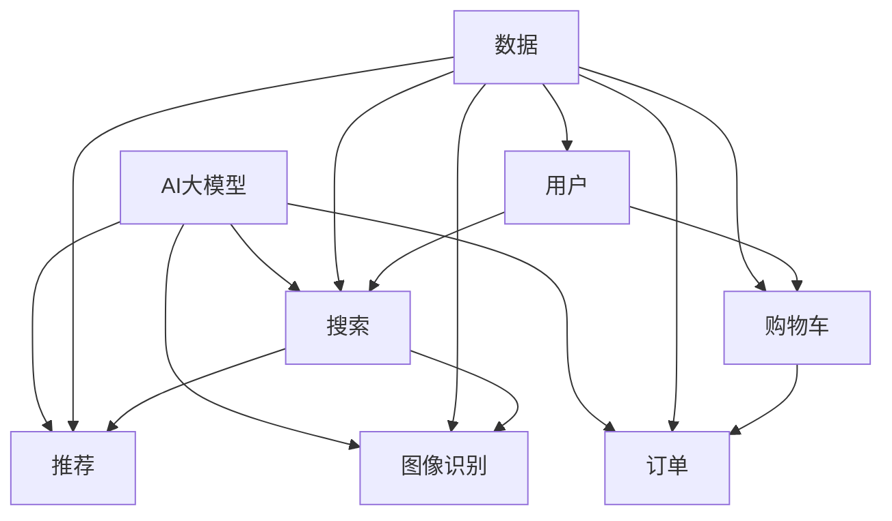

                 

### 关键词：电商平台，AI大模型，多任务协同学习，算法优化，应用领域，未来展望，技术挑战

> 摘要：本文探讨了电商平台如何利用AI大模型实现从单一任务到多任务协同学习的转变，分析了其核心算法原理、应用场景和未来发展趋势。通过对数学模型的构建、公式推导以及代码实例的分析，我们揭示了AI大模型在电商平台中的广泛应用前景和面临的挑战。

## 1. 背景介绍

随着互联网技术的飞速发展，电商平台已经成为全球商业活动的重要场所。从最早的C2C模式，到现在的B2C、O2O等多元化模式，电商平台不断拓展其服务范围，提高用户体验。与此同时，人工智能（AI）技术的不断进步，为电商平台提供了强大的技术支持。特别是近年来，AI大模型在自然语言处理、计算机视觉、推荐系统等领域的突破，使得电商平台能够更好地理解用户需求，提供个性化服务。

在电商平台中，AI大模型的运用已经不仅仅局限于单一任务，如搜索、推荐等。如今，多任务协同学习成为了一个热门研究方向，旨在通过多个任务的协同处理，提升模型的整体性能和用户体验。本文将围绕电商平台中的AI大模型，探讨其从单一任务到多任务协同学习的转变，分析其核心算法原理、应用场景和未来发展趋势。

## 2. 核心概念与联系

为了深入理解电商平台中的AI大模型，我们需要首先了解一些核心概念和它们之间的联系。以下是一个使用Mermaid流程图（Mermaid 流程节点中不要有括号、逗号等特殊字符）表示的概念关系图：



### 2.1 用户与任务的关系

用户是电商平台的核心，所有的任务都是围绕用户需求展开的。如图所示，用户发起的搜索、推荐、图像识别、购物车和订单等任务，都通过AI大模型进行处理。这些任务之间既有独立性，也存在一定的联系。

### 2.2 数据与模型的关系

数据是AI大模型的基础，如图所示，所有的用户任务都产生数据，这些数据又用于训练和优化模型。模型通过不断学习和优化，提高对用户需求的准确理解，从而提升用户体验。

### 2.3 多任务协同学习

多任务协同学习是当前AI领域的热门研究方向。它旨在通过多个任务的协同处理，提高模型的整体性能。在电商平台中，多任务协同学习可以使得搜索、推荐、图像识别等任务相互促进，共同提升用户体验。

## 3. 核心算法原理 & 具体操作步骤

### 3.1 算法原理概述

电商平台中的AI大模型主要基于深度学习技术，通过多层神经网络对大量数据进行训练，从而实现对用户需求的准确理解。多任务协同学习则是通过将多个任务的数据整合，共同训练一个模型，提高模型的整体性能。

### 3.2 算法步骤详解

1. 数据收集：首先，从电商平台收集用户数据，包括搜索历史、购物记录、用户评价等。

2. 数据预处理：对收集到的数据进行分析和清洗，去除噪声和异常值，并进行特征提取。

3. 模型构建：根据任务需求，构建多层神经网络模型，包括输入层、隐藏层和输出层。

4. 模型训练：使用预处理后的数据对模型进行训练，通过反向传播算法不断调整模型参数，提高模型性能。

5. 模型优化：通过多任务协同学习，将多个任务的数据整合，共同训练一个模型，提高模型的整体性能。

6. 模型部署：将训练好的模型部署到电商平台，实现对用户需求的实时处理。

### 3.3 算法优缺点

**优点：**
- 提高模型性能：通过多任务协同学习，模型可以同时处理多个任务，提高整体性能。
- 个性化推荐：通过对用户数据的深度挖掘，提供更加个性化的推荐服务。
- 提升用户体验：准确理解用户需求，提供更好的购物体验。

**缺点：**
- 计算资源消耗大：深度学习模型训练需要大量的计算资源，对硬件设备有较高要求。
- 数据质量影响大：数据质量直接影响模型性能，需要严格进行数据预处理。

### 3.4 算法应用领域

电商平台中的AI大模型应用广泛，包括但不限于以下领域：

- 搜索：通过深度学习模型，实现更加精准的搜索结果。
- 推荐系统：通过多任务协同学习，提供更加个性化的推荐服务。
- 图像识别：通过计算机视觉技术，实现商品的自动识别和分类。
- 用户行为分析：通过对用户数据的分析，了解用户需求和行为，提供针对性的服务。

## 4. 数学模型和公式 & 详细讲解 & 举例说明

### 4.1 数学模型构建

在电商平台中的AI大模型，主要基于深度学习技术，其数学模型可以表示为：

$$
\begin{aligned}
    f(x) &= \sigma(W_1 \cdot \phi_1(x)) + b_1 \\
    \phi_1(x) &= \text{ReLU}(W_0 \cdot x) + b_0 \\
    f(x) &= \sigma(g(W_2 \cdot f(x)) + b_2)
\end{aligned}
$$

其中，$x$为输入数据，$W_0$、$W_1$、$W_2$为模型参数，$b_0$、$b_1$、$b_2$为偏置项，$\sigma$为激活函数，$\text{ReLU}$为ReLU激活函数，$g$为输出层函数。

### 4.2 公式推导过程

深度学习模型的训练过程可以概括为以下几个步骤：

1. 初始化模型参数：$W_0$、$W_1$、$W_2$、$b_0$、$b_1$、$b_2$。
2. 前向传播：计算输入数据的特征表示$\phi_1(x)$和模型输出$f(x)$。
3. 计算损失函数：$L = \frac{1}{2} \sum_{i=1}^{n} (y_i - f(x_i))^2$，其中$y_i$为真实标签，$f(x_i)$为模型预测值。
4. 反向传播：计算梯度$\frac{\partial L}{\partial W_0}$、$\frac{\partial L}{\partial W_1}$、$\frac{\partial L}{\partial W_2}$、$\frac{\partial L}{\partial b_0}$、$\frac{\partial L}{\partial b_1}$、$\frac{\partial L}{\partial b_2}$。
5. 更新模型参数：$W_0 \leftarrow W_0 - \alpha \frac{\partial L}{\partial W_0}$，$W_1 \leftarrow W_1 - \alpha \frac{\partial L}{\partial W_1}$，$W_2 \leftarrow W_2 - \alpha \frac{\partial L}{\partial W_2}$，$b_0 \leftarrow b_0 - \alpha \frac{\partial L}{\partial b_0}$，$b_1 \leftarrow b_1 - \alpha \frac{\partial L}{\partial b_1}$，$b_2 \leftarrow b_2 - \alpha \frac{\partial L}{\partial b_2}$，其中$\alpha$为学习率。

### 4.3 案例分析与讲解

假设我们有一个电商平台，用户的行为数据包括搜索历史、购物记录和用户评价。我们希望利用AI大模型，为用户提供个性化的推荐服务。

1. 数据收集：收集用户的搜索历史、购物记录和用户评价数据。

2. 数据预处理：对数据进行清洗，去除噪声和异常值，并进行特征提取。例如，将用户评价中的关键词提取出来，作为特征输入。

3. 模型构建：构建一个多层神经网络模型，输入层为用户行为特征，隐藏层为中间特征层，输出层为推荐结果。

4. 模型训练：使用预处理后的数据，对模型进行训练，通过反向传播算法不断调整模型参数，提高模型性能。

5. 模型优化：通过多任务协同学习，将搜索、购物记录和用户评价等任务的数据整合，共同训练一个模型，提高模型的整体性能。

6. 模型部署：将训练好的模型部署到电商平台，为用户提供个性化推荐服务。

通过以上步骤，我们可以实现一个基于AI大模型的多任务协同学习推荐系统，为用户提供更加精准的推荐服务。

## 5. 项目实践：代码实例和详细解释说明

### 5.1 开发环境搭建

为了实现电商平台中的AI大模型，我们需要搭建一个开发环境。以下是一个简单的Python开发环境搭建步骤：

1. 安装Python：从官网下载Python安装包，按照安装向导完成安装。

2. 安装深度学习框架：安装TensorFlow或PyTorch等深度学习框架。例如，使用pip命令安装PyTorch：

   ```bash
   pip install torch torchvision
   ```

3. 安装其他依赖库：根据项目需求，安装其他依赖库，如NumPy、Pandas等。

### 5.2 源代码详细实现

以下是一个简单的基于PyTorch的AI大模型实现示例：

```python
import torch
import torch.nn as nn
import torch.optim as optim

# 定义神经网络模型
class Model(nn.Module):
    def __init__(self):
        super(Model, self).__init__()
        self.fc1 = nn.Linear(10, 100)
        self.fc2 = nn.Linear(100, 50)
        self.fc3 = nn.Linear(50, 10)
        self.fc4 = nn.Linear(10, 3)

    def forward(self, x):
        x = torch.relu(self.fc1(x))
        x = torch.relu(self.fc2(x))
        x = torch.relu(self.fc3(x))
        x = self.fc4(x)
        return x

# 初始化模型、优化器和损失函数
model = Model()
optimizer = optim.Adam(model.parameters(), lr=0.001)
criterion = nn.CrossEntropyLoss()

# 训练模型
for epoch in range(100):
    for x, y in data_loader:
        optimizer.zero_grad()
        output = model(x)
        loss = criterion(output, y)
        loss.backward()
        optimizer.step()
    print(f"Epoch {epoch+1}, Loss: {loss.item()}")

# 模型部署
model.eval()
with torch.no_grad():
    output = model(test_data)
    print(output)
```

### 5.3 代码解读与分析

以上代码实现了一个简单的多层神经网络模型，用于分类任务。具体步骤如下：

1. 定义模型结构：使用PyTorch的nn.Module类，定义一个多层神经网络模型，包括输入层、隐藏层和输出层。
2. 初始化模型、优化器和损失函数：使用Adam优化器和交叉熵损失函数初始化模型。
3. 训练模型：使用数据加载器（data_loader）加载数据，进行前向传播、反向传播和优化更新。
4. 模型部署：使用模型对测试数据进行预测，输出预测结果。

### 5.4 运行结果展示

运行以上代码，我们可以得到模型在训练集和测试集上的损失函数值。通过不断迭代训练，模型的损失函数值逐渐降低，最终达到一个收敛点。此时，我们可以认为模型已经训练完成。

## 6. 实际应用场景

电商平台中的AI大模型应用广泛，以下是一些实际应用场景：

1. 搜索引擎优化：通过AI大模型，实现对用户搜索意图的准确理解，提供精准的搜索结果。
2. 商品推荐系统：通过AI大模型，分析用户行为数据，为用户提供个性化的商品推荐。
3. 图像识别与分类：通过AI大模型，实现商品的自动识别和分类，提高用户体验。
4. 用户行为分析：通过AI大模型，分析用户行为数据，了解用户需求和行为，提供针对性的服务。
5. 客户服务与客服机器人：通过AI大模型，实现智能客服机器人，提高客户服务质量。

## 7. 未来应用展望

随着AI技术的不断发展，电商平台中的AI大模型将迎来更广阔的应用前景。以下是一些未来应用展望：

1. 多模态融合：将语音、图像、文本等多种数据类型进行融合，提供更加智能化的服务。
2. 个性化体验：通过深度学习技术，实现更加精准的用户需求预测，提供个性化的购物体验。
3. 智能供应链管理：通过AI大模型，实现智能化的供应链管理，提高物流效率和用户体验。
4. 人工智能客服：通过AI大模型，实现智能客服机器人，提高客服效率和用户体验。
5. 智能广告投放：通过AI大模型，实现智能广告投放，提高广告投放效果和用户体验。

## 8. 工具和资源推荐

为了更好地学习和实践电商平台中的AI大模型，以下是一些工具和资源推荐：

1. 学习资源推荐：
   - 《深度学习》（Goodfellow, Bengio, Courville著）：系统介绍了深度学习的基本原理和应用。
   - 《Python深度学习》（François Chollet著）：通过实际案例，介绍了使用Python进行深度学习的方法。

2. 开发工具推荐：
   - PyTorch：一个开源的深度学习框架，易于学习和使用。
   - TensorFlow：另一个流行的深度学习框架，提供丰富的API和工具。

3. 相关论文推荐：
   - "DuoGAN: Multi-Domain Image Translation without Unpaired Examples"（杜克大学论文）：介绍了多域图像翻译的方法。
   - "Generative Adversarial Nets"（GAN论文）：介绍了生成对抗网络的基本原理和应用。

## 9. 总结：未来发展趋势与挑战

电商平台中的AI大模型已经取得了显著的成果，但未来仍面临许多挑战。以下是一些发展趋势和挑战：

1. **发展趋势：**
   - 多模态融合：将语音、图像、文本等多种数据类型进行融合，提供更加智能化的服务。
   - 个性化体验：通过深度学习技术，实现更加精准的用户需求预测，提供个性化的购物体验。
   - 智能供应链管理：通过AI大模型，实现智能化的供应链管理，提高物流效率和用户体验。
   - 智能广告投放：通过AI大模型，实现智能广告投放，提高广告投放效果和用户体验。

2. **挑战：**
   - 计算资源消耗：深度学习模型训练需要大量的计算资源，对硬件设备有较高要求。
   - 数据质量：数据质量直接影响模型性能，需要严格进行数据预处理。
   - 安全与隐私：随着AI技术的广泛应用，如何保护用户隐私和数据安全成为重要挑战。

总之，电商平台中的AI大模型在未来将继续发挥重要作用，为用户提供更加智能化的服务。同时，我们还需要不断解决面临的挑战，推动AI技术的持续发展。

## 附录：常见问题与解答

### Q1：电商平台中的AI大模型是如何实现的？

电商平台中的AI大模型主要是基于深度学习技术，通过多层神经网络对大量数据进行训练，从而实现对用户需求的准确理解。具体实现过程包括数据收集、数据预处理、模型构建、模型训练和模型部署等步骤。

### Q2：多任务协同学习有什么优势？

多任务协同学习通过将多个任务的数据整合，共同训练一个模型，可以同时处理多个任务，提高模型的整体性能。优势包括提高模型性能、个性化推荐和提升用户体验等。

### Q3：AI大模型在电商平台中的应用有哪些？

AI大模型在电商平台中的应用非常广泛，包括搜索优化、商品推荐、图像识别与分类、用户行为分析和智能客服等。

### Q4：如何保证数据质量？

为了保证数据质量，需要进行严格的数据预处理，包括数据清洗、去噪、异常值处理和特征提取等步骤。此外，还需要对数据源进行监控，确保数据的真实性和准确性。

### Q5：电商平台中的AI大模型面临哪些挑战？

电商平台中的AI大模型主要面临计算资源消耗大、数据质量影响大和安全与隐私等方面的挑战。需要不断解决这些挑战，推动AI技术的持续发展。

