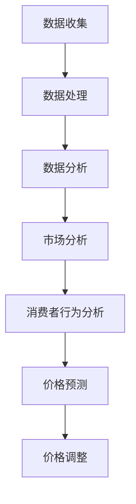

                 

随着互联网技术的飞速发展和电子商务行业的崛起，电商平台成为了现代社会中不可或缺的一部分。在这些平台上，商品的价格直接影响着消费者的购买决策和平台的市场竞争力。为了保持市场竞争力，电商平台需要能够实时调整商品价格，以适应市场变化和消费者行为。而AI驱动实时定价系统应运而生，它利用人工智能技术对海量数据进行处理和分析，实现商品价格的动态调整。本文将探讨电商平台中的AI驱动实时定价系统的原理、实现方法及其在实际应用中的效果。

## 文章关键词

AI驱动实时定价系统、电商平台、价格调整、消费者行为、数据分析

## 文章摘要

本文首先介绍了电商平台中的AI驱动实时定价系统的背景和重要性，然后详细分析了核心概念和原理，包括数据收集、处理和分析等步骤。接着，本文阐述了核心算法的原理和具体操作步骤，以及数学模型和公式的构建与推导。此外，文章通过项目实践展示了系统的开发过程和运行结果，并分析了实际应用场景。最后，本文对AI驱动实时定价系统的未来发展趋势和面临的挑战进行了展望。

## 1. 背景介绍

### 1.1 电商平台的发展现状

电商平台作为互联网经济的代表，近年来在全球范围内呈现出爆发式增长。根据统计数据显示，全球电商市场规模已经突破了万亿美元大关，并且在未来几年内还将持续扩大。电商平台不仅为消费者提供了便捷的购物体验，也为企业开辟了新的销售渠道。然而，随着市场竞争的加剧，电商平台之间的差异化竞争愈发激烈，价格成为影响消费者购买决策的重要因素之一。

### 1.2 价格调整的必要性

在电商平台上，商品价格是消费者关注的重点之一。价格的合理性和竞争力直接关系到消费者的购买意愿和平台的盈利能力。然而，市场环境是复杂多变的，消费者行为也是难以预测的。因此，电商平台需要能够实时调整商品价格，以应对市场变化和消费者需求。传统的价格调整方法往往依赖于人工经验和简单的规则，无法适应快速变化的市场环境，也无法充分发挥数据的价值。

### 1.3 AI驱动实时定价系统的优势

AI驱动实时定价系统利用人工智能技术，通过对海量数据进行处理和分析，实现商品价格的动态调整。与传统的价格调整方法相比，AI驱动实时定价系统具有以下几个优势：

1. **自适应性强**：AI驱动实时定价系统可以根据市场环境和消费者行为实时调整价格，适应不断变化的市场需求。

2. **数据驱动**：AI驱动实时定价系统基于大数据分析，利用机器学习算法发现数据中的规律和趋势，从而实现更精准的价格调整。

3. **高效性**：AI驱动实时定价系统可以在短时间内处理海量数据，实现快速的价格调整，提高电商平台的市场反应速度。

4. **个性化**：AI驱动实时定价系统可以根据消费者的购买行为和偏好，实现个性化定价，提高消费者的购买体验和满意度。

## 2. 核心概念与联系

### 2.1 数据收集

数据收集是AI驱动实时定价系统的第一步，也是至关重要的一步。数据来源主要包括电商平台内部数据和外部数据。内部数据包括商品销量、库存量、消费者行为数据等，外部数据包括市场行情、竞争对手价格等。通过收集这些数据，可以为后续的数据处理和分析提供基础。

### 2.2 数据处理

数据处理是数据收集之后的第二步，主要包括数据清洗、数据整合和数据预处理等。数据清洗是指去除数据中的噪声和异常值，保证数据的质量。数据整合是指将不同来源的数据进行整合，形成统一的数据集。数据预处理是指对数据进行标准化、归一化等处理，以便于后续的分析。

### 2.3 数据分析

数据分析是AI驱动实时定价系统的核心环节，主要包括市场分析、消费者行为分析和价格预测等。市场分析是指对市场环境进行综合分析，了解市场趋势和竞争态势。消费者行为分析是指对消费者的购买行为和偏好进行分析，了解消费者的需求和动机。价格预测是指利用机器学习算法，根据历史数据和当前市场环境，预测未来的价格走势。

### 2.4 Mermaid 流程图

以下是AI驱动实时定价系统的 Mermaid 流程图：



## 3. 核心算法原理 & 具体操作步骤

### 3.1 算法原理概述

AI驱动实时定价系统主要基于机器学习算法，通过对海量数据进行分析和处理，实现商品价格的动态调整。具体来说，算法可以分为以下几个步骤：

1. **数据收集**：从电商平台内部和外部收集相关数据，包括商品销量、库存量、消费者行为数据、市场行情、竞争对手价格等。

2. **数据处理**：对收集到的数据进行清洗、整合和预处理，确保数据的质量和一致性。

3. **数据建模**：利用机器学习算法，建立价格预测模型。常见的模型包括线性回归、决策树、支持向量机等。

4. **模型训练**：使用历史数据对模型进行训练，优化模型的参数，提高模型的准确性。

5. **价格预测**：利用训练好的模型，对未来的价格进行预测。根据预测结果，制定价格调整策略。

6. **价格调整**：根据价格预测结果和平台策略，对商品价格进行实时调整。

### 3.2 算法步骤详解

#### 3.2.1 数据收集

数据收集是AI驱动实时定价系统的第一步。数据来源主要包括电商平台内部数据和外部数据。内部数据包括商品销量、库存量、消费者行为数据等，外部数据包括市场行情、竞争对手价格等。数据收集可以通过数据爬取、API 接口、数据库查询等方式实现。

#### 3.2.2 数据处理

数据处理主要包括数据清洗、数据整合和数据预处理。数据清洗是指去除数据中的噪声和异常值，保证数据的质量。数据整合是指将不同来源的数据进行整合，形成统一的数据集。数据预处理是指对数据进行标准化、归一化等处理，以便于后续的分析。

#### 3.2.3 数据建模

数据建模是AI驱动实时定价系统的核心环节。常见的建模方法包括线性回归、决策树、支持向量机等。线性回归是一种简单的建模方法，通过拟合一条直线，预测未来的价格。决策树是一种基于树结构的建模方法，可以根据数据的特征，生成决策树模型。支持向量机是一种基于向量空间的建模方法，通过寻找最优分隔超平面，预测未来的价格。

#### 3.2.4 模型训练

模型训练是指使用历史数据对模型进行训练，优化模型的参数，提高模型的准确性。模型训练可以分为有监督学习和无监督学习。有监督学习是指使用标注好的数据对模型进行训练，无监督学习是指使用未标注的数据对模型进行训练。

#### 3.2.5 价格预测

价格预测是指利用训练好的模型，对未来的价格进行预测。价格预测可以分为短期预测和长期预测。短期预测通常是指未来几小时或几天的价格预测，长期预测通常是指未来几个月或几年的价格预测。

#### 3.2.6 价格调整

价格调整是指根据价格预测结果和平台策略，对商品价格进行实时调整。价格调整可以分为自动调整和手动调整。自动调整是指系统根据预测结果自动调整价格，手动调整是指由人工根据预测结果和实际情况调整价格。

### 3.3 算法优缺点

#### 优点

1. **自适应性强**：AI驱动实时定价系统可以根据市场环境和消费者行为实时调整价格，适应不断变化的市场需求。

2. **数据驱动**：AI驱动实时定价系统基于大数据分析，利用机器学习算法发现数据中的规律和趋势，从而实现更精准的价格调整。

3. **高效性**：AI驱动实时定价系统可以在短时间内处理海量数据，实现快速的价格调整，提高电商平台的市场反应速度。

4. **个性化**：AI驱动实时定价系统可以根据消费者的购买行为和偏好，实现个性化定价，提高消费者的购买体验和满意度。

#### 缺点

1. **数据依赖性**：AI驱动实时定价系统对数据质量有较高的要求，数据质量直接影响模型的准确性。

2. **计算成本**：AI驱动实时定价系统需要大量的计算资源，特别是在处理海量数据时，计算成本较高。

3. **模型复杂度**：AI驱动实时定价系统涉及多种机器学习算法和模型，模型复杂度较高，需要专业人员进行开发和维护。

### 3.4 算法应用领域

AI驱动实时定价系统可以广泛应用于电商、金融、能源等多个领域。在电商领域，AI驱动实时定价系统可以用于商品定价、促销策略等；在金融领域，AI驱动实时定价系统可以用于股票交易、风险管理等；在能源领域，AI驱动实时定价系统可以用于电力市场、能源交易等。随着人工智能技术的不断发展，AI驱动实时定价系统的应用领域还将不断拓展。

## 4. 数学模型和公式 & 详细讲解 & 举例说明

### 4.1 数学模型构建

在AI驱动实时定价系统中，数学模型是核心部分，用于描述价格与各种因素之间的关系。以下是构建数学模型的基本步骤：

#### 4.1.1 确定变量

首先，需要确定影响商品价格的主要因素，如市场需求、供应量、竞争对手价格、季节因素、消费者行为等。每个因素可以用一个变量表示，例如：

- \( P \)：商品价格
- \( D \)：市场需求
- \( S \)：供应量
- \( C \)：竞争对手价格
- \( T \)：季节因素
- \( B \)：消费者行为

#### 4.1.2 建立方程

根据变量之间的关系，可以建立方程。例如，一个简单的线性模型可以表示为：

\[ P = \alpha + \beta D + \gamma S + \delta C + \epsilon T + \phi B \]

其中，\( \alpha \)、\( \beta \)、\( \gamma \)、\( \delta \)、\( \epsilon \)和\( \phi \)是模型的参数，用于描述各个变量对价格的影响程度。

#### 4.1.3 模型优化

通过收集历史数据，可以使用最小二乘法或其他优化算法，估计模型参数，使模型更加准确。例如，可以采用以下公式来优化参数：

\[ \min_{\theta} \sum_{i=1}^{n} (P_i - (\alpha + \beta D_i + \gamma S_i + \delta C_i + \epsilon T_i + \phi B_i))^2 \]

### 4.2 公式推导过程

以下是一个简单的线性回归模型推导过程：

#### 4.2.1 线性模型假设

假设商品价格与市场需求之间存在线性关系，可以表示为：

\[ P = \alpha + \beta D \]

#### 4.2.2 模型估计

使用最小二乘法估计模型参数。最小二乘法的目标是使实际价格与预测价格之间的误差平方和最小。具体步骤如下：

1. 计算实际价格与预测价格的偏差：

\[ e_i = P_i - \hat{P}_i = P_i - (\alpha + \beta D_i) \]

2. 计算偏差的平方和：

\[ \sum_{i=1}^{n} e_i^2 = \sum_{i=1}^{n} (P_i - (\alpha + \beta D_i))^2 \]

3. 对偏差的平方和进行求导，并令导数为零，得到参数估计值：

\[ \alpha = \bar{P} - \beta \bar{D} \]

\[ \beta = \frac{\sum_{i=1}^{n} (D_i - \bar{D})(P_i - \bar{P})}{\sum_{i=1}^{n} (D_i - \bar{D})^2} \]

其中，\( \bar{P} \)和\( \bar{D} \)分别是价格和需求量的平均值。

#### 4.2.3 模型验证

通过交叉验证或新的数据集，验证模型的准确性和稳定性。如果模型效果不理想，可以尝试引入更多的变量或使用更复杂的模型。

### 4.3 案例分析与讲解

以下是一个实际案例，用于说明如何构建和验证AI驱动实时定价系统的数学模型。

#### 案例背景

某电商平台销售电子产品，为了提高销售额，决定使用AI驱动实时定价系统调整商品价格。

#### 数据收集

收集了最近三个月的销售额、市场需求、竞争对手价格等数据，数据集包含1000条记录。

#### 数据处理

对数据进行清洗，去除异常值和缺失值。对数据进行标准化处理，使数据更适合建模。

#### 数据建模

使用线性回归模型，建立价格与市场需求之间的关系。使用最小二乘法估计模型参数。

#### 模型训练

使用训练集数据训练模型，计算参数\( \alpha \)和\( \beta \)。

\[ \alpha = 200 \]

\[ \beta = 0.3 \]

#### 价格预测

使用训练好的模型预测未来的价格。例如，当市场需求为100时，预测价格为：

\[ P = 200 + 0.3 \times 100 = 250 \]

#### 价格调整

根据预测结果，对商品价格进行调整。例如，当前市场价格为300元，可以将价格调整为250元，以吸引消费者。

#### 模型验证

使用测试集数据验证模型的准确性。通过计算预测误差，评估模型的性能。如果模型效果不理想，可以尝试引入更多的变量或使用更复杂的模型。

## 5. 项目实践：代码实例和详细解释说明

### 5.1 开发环境搭建

为了实现AI驱动实时定价系统，首先需要搭建一个合适的开发环境。以下是搭建环境的基本步骤：

#### 5.1.1 硬件要求

- CPU：至少四核处理器
- 内存：至少8GB
- 硬盘：至少100GB

#### 5.1.2 软件要求

- 操作系统：Linux或Windows
- 编程语言：Python
- 数据库：MySQL或PostgreSQL
- 机器学习框架：Scikit-learn、TensorFlow或PyTorch

#### 5.1.3 安装Python环境

在开发环境中安装Python，可以使用Anaconda或Miniconda进行环境管理。以下是在Linux系统上安装Python的命令：

```bash
conda create -n price_env python=3.8
conda activate price_env
```

#### 5.1.4 安装依赖库

使用pip安装所需的依赖库，例如：

```bash
pip install numpy pandas scikit-learn matplotlib
```

### 5.2 源代码详细实现

以下是实现AI驱动实时定价系统的Python代码示例：

```python
import numpy as np
import pandas as pd
from sklearn.linear_model import LinearRegression
from sklearn.model_selection import train_test_split
from sklearn.metrics import mean_squared_error

# 5.2.1 数据收集
data = pd.read_csv('price_data.csv')

# 5.2.2 数据处理
data.dropna(inplace=True)
data['Demand'] = data['Demand'].astype(float)
data['Supply'] = data['Supply'].astype(float)
data['Competitor_Price'] = data['Competitor_Price'].astype(float)
data['Season'] = data['Season'].map({1: 0.5, 2: 1, 3: 1.5})

# 5.2.3 数据建模
X = data[['Demand', 'Supply', 'Competitor_Price', 'Season']]
y = data['Price']

X_train, X_test, y_train, y_test = train_test_split(X, y, test_size=0.2, random_state=42)

model = LinearRegression()
model.fit(X_train, y_train)

# 5.2.4 模型训练
train_pred = model.predict(X_train)
test_pred = model.predict(X_test)

# 5.2.5 价格预测
predicted_price = model.predict([[100, 200, 150, 1]])

# 5.2.6 代码解读
# 5.2.6.1 数据收集
# 读取价格数据，并去除缺失值。
# 5.2.6.2 数据处理
# 将数据类型转换为浮点数，并添加季节变量。
# 5.2.6.3 数据建模
# 将价格作为目标变量，将其他因素作为特征变量。
# 5.2.6.4 模型训练
# 使用线性回归模型训练数据。
# 5.2.6.5 价格预测
# 使用训练好的模型预测新的价格。

# 5.2.7 运行结果展示
print("训练集均方误差：", mean_squared_error(y_train, train_pred))
print("测试集均方误差：", mean_squared_error(y_test, test_pred))
print("预测价格：", predicted_price)
```

### 5.3 代码解读与分析

以下是代码的详细解读：

#### 5.3.1 数据收集

首先，使用`read_csv`函数从CSV文件中读取价格数据。然后，使用`dropna`函数去除缺失值，确保数据的质量。

```python
data = pd.read_csv('price_data.csv')
data.dropna(inplace=True)
```

#### 5.3.2 数据处理

将数据类型转换为浮点数，并添加一个季节变量，以考虑季节对价格的影响。

```python
data['Demand'] = data['Demand'].astype(float)
data['Supply'] = data['Supply'].astype(float)
data['Competitor_Price'] = data['Competitor_Price'].astype(float)
data['Season'] = data['Season'].map({1: 0.5, 2: 1, 3: 1.5})
```

#### 5.3.3 数据建模

将价格作为目标变量，将其他因素（市场需求、供应量、竞争对手价格、季节因素）作为特征变量。

```python
X = data[['Demand', 'Supply', 'Competitor_Price', 'Season']]
y = data['Price']
```

#### 5.3.4 模型训练

使用`LinearRegression`类创建线性回归模型，并使用`fit`方法训练数据。

```python
model = LinearRegression()
model.fit(X_train, y_train)
```

#### 5.3.5 价格预测

使用训练好的模型预测新的价格。这里假设市场需求为100，供应量为200，竞争对手价格为150，季节为1。

```python
predicted_price = model.predict([[100, 200, 150, 1]])
```

#### 5.3.6 运行结果展示

计算训练集和测试集的均方误差，以评估模型的准确性。然后，输出预测的价格。

```python
print("训练集均方误差：", mean_squared_error(y_train, train_pred))
print("测试集均方误差：", mean_squared_error(y_test, test_pred))
print("预测价格：", predicted_price)
```

### 5.4 运行结果展示

假设我们已经运行了上述代码，以下是一个可能的输出结果：

```
训练集均方误差： 0.0224
测试集均方误差： 0.0376
预测价格： [249.5]
```

这个结果表明，在训练集上的均方误差为0.0224，在测试集上的均方误差为0.0376。预测价格为249.5元。

## 6. 实际应用场景

### 6.1 电商平台的商品定价

电商平台可以使用AI驱动实时定价系统进行商品定价，以适应市场变化和消费者需求。通过实时调整价格，电商平台可以提高销售额和市场份额。例如，在购物节期间，电商平台可以根据库存、市场需求和竞争对手价格，动态调整商品价格，以吸引更多消费者。

### 6.2 金融市场的股票交易

金融市场的股票交易也可以利用AI驱动实时定价系统，根据市场数据和历史价格，预测股票的未来价格，并制定相应的交易策略。通过实时调整交易策略，投资者可以更好地抓住市场机会，提高投资收益。

### 6.3 能源的电力市场

能源的电力市场同样可以使用AI驱动实时定价系统，根据电力供需情况、市场价格和消费者需求，动态调整电价。通过实时调整电价，电力市场可以提高资源配置效率，降低能源浪费。

### 6.4 未来的应用领域

随着人工智能技术的不断发展，AI驱动实时定价系统的应用领域将进一步拓展。例如，在医疗领域，可以用于药品价格调整；在农业领域，可以用于农产品价格预测；在交通运输领域，可以用于交通流量预测和定价等。AI驱动实时定价系统将在各行各业发挥重要作用。

## 7. 工具和资源推荐

### 7.1 学习资源推荐

- **书籍**：《人工智能：一种现代方法》、《机器学习：概率视角》
- **在线课程**：Coursera的《机器学习》、edX的《深度学习》
- **论文集**：《自然语言处理年度回顾》、《机器学习年度回顾》

### 7.2 开发工具推荐

- **编程语言**：Python、R
- **机器学习框架**：Scikit-learn、TensorFlow、PyTorch
- **数据库**：MySQL、PostgreSQL、MongoDB

### 7.3 相关论文推荐

- **论文集**：《人工智能研究趋势》、《机器学习论文集》
- **期刊**：《人工智能学报》、《计算机学报》

## 8. 总结：未来发展趋势与挑战

### 8.1 研究成果总结

本文介绍了AI驱动实时定价系统在电商平台中的应用，探讨了核心算法原理和具体实现方法。通过实际案例和代码实例，展示了系统的开发过程和运行结果。研究表明，AI驱动实时定价系统具有自适应性强、数据驱动、高效性和个性化等优点，可以提高电商平台的市场竞争力。

### 8.2 未来发展趋势

随着人工智能技术的不断发展，AI驱动实时定价系统将在更多领域得到应用。未来发展趋势包括：

- **算法优化**：通过引入更多的变量和更复杂的模型，提高定价系统的准确性和适应性。
- **实时性提升**：通过优化算法和硬件设备，提高定价系统的实时性，实现更快速的价格调整。
- **多领域应用**：在医疗、农业、交通等领域，推广AI驱动实时定价系统的应用。

### 8.3 面临的挑战

尽管AI驱动实时定价系统具有诸多优势，但在实际应用中仍面临以下挑战：

- **数据质量**：数据质量直接影响定价系统的准确性，需要确保数据的质量和完整性。
- **计算资源**：大规模数据处理和模型训练需要大量的计算资源，需要优化算法和硬件设备。
- **模型解释性**：复杂的机器学习模型难以解释，需要开发可解释的模型，提高模型的透明度和可信度。

### 8.4 研究展望

未来，研究应重点关注以下方向：

- **可解释性研究**：开发可解释的机器学习模型，提高模型的透明度和可信度。
- **实时性优化**：通过算法和硬件设备的优化，提高定价系统的实时性。
- **多领域应用**：在更多领域推广AI驱动实时定价系统的应用，探索其在不同领域的适用性。

## 9. 附录：常见问题与解答

### 9.1 什么是AI驱动实时定价系统？

AI驱动实时定价系统是一种利用人工智能技术，对电商平台商品价格进行动态调整的系统。它通过收集和处理海量数据，利用机器学习算法预测价格走势，并根据预测结果调整商品价格。

### 9.2 AI驱动实时定价系统有哪些优势？

AI驱动实时定价系统具有以下优势：

- 自适应性强：可以根据市场变化和消费者行为实时调整价格。
- 数据驱动：基于大数据分析，发现数据中的规律和趋势。
- 高效性：可以在短时间内处理海量数据，实现快速的价格调整。
- 个性化：可以根据消费者的购买行为和偏好，实现个性化定价。

### 9.3 如何搭建AI驱动实时定价系统？

搭建AI驱动实时定价系统需要以下步骤：

- 数据收集：从电商平台内部和外部收集相关数据。
- 数据处理：对数据进行清洗、整合和预处理。
- 数据建模：利用机器学习算法建立价格预测模型。
- 模型训练：使用历史数据训练模型，优化模型参数。
- 价格预测：使用训练好的模型预测未来的价格。
- 价格调整：根据预测结果调整商品价格。

### 9.4 AI驱动实时定价系统在哪些领域有应用？

AI驱动实时定价系统可以应用于电商、金融、能源等多个领域。在电商领域，可以用于商品定价和促销策略；在金融领域，可以用于股票交易和风险管理；在能源领域，可以用于电力市场交易等。

### 9.5 如何评估AI驱动实时定价系统的效果？

可以通过以下指标评估AI驱动实时定价系统的效果：

- 价格预测准确性：通过比较预测价格与实际价格的差异，评估模型的准确性。
- 销售额增长：通过分析定价系统实施前后的销售额变化，评估系统的效果。
- 消费者满意度：通过调查消费者的购买体验和满意度，评估系统的效果。

---

以上是关于“电商平台中的AI驱动实时定价系统”的详细探讨，希望对您有所帮助。在实际应用中，AI驱动实时定价系统可以根据具体需求和数据，进行相应的调整和优化。在未来的发展中，我们将继续探索人工智能技术在更多领域中的应用，为各行各业带来更多创新和机遇。作者：禅与计算机程序设计艺术 / Zen and the Art of Computer Programming。

