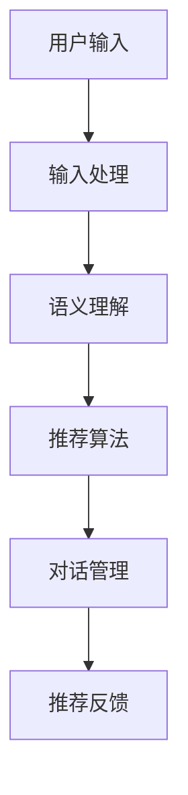

                 

关键词：电商平台，对话式推荐，系统设计，实现，用户交互，个性化推荐，机器学习，自然语言处理，数据挖掘

> 摘要：本文旨在探讨电商平台中对话式推荐系统的设计与实现，分析其核心概念与架构，阐述核心算法原理及数学模型，并通过具体项目实践，展示其实际应用和运行效果。文章还将对未来的发展趋势与挑战进行展望，为电商平台的推荐系统提供参考。

## 1. 背景介绍

随着互联网的普及和电子商务的快速发展，电商平台已经成为消费者购买商品的重要渠道。然而，面对海量的商品信息和多样化的用户需求，如何为用户提供精准、个性化的推荐，提高用户满意度和购买转化率，成为电商平台亟待解决的问题。对话式推荐系统作为一种新兴的推荐方式，通过自然语言交互实现用户与系统的实时沟通，能够更好地满足用户的个性化需求，提升用户体验。

### 1.1 对话式推荐系统的意义

对话式推荐系统具有以下几个方面的意义：

- **个性化体验**：通过对话式交互，系统能够更深入地了解用户需求，提供个性化的商品推荐。
- **实时反馈**：用户可以在对话过程中实时提供反馈，系统能够根据反馈调整推荐策略，提高推荐效果。
- **用户参与**：对话式推荐让用户主动参与推荐过程，增加用户的参与感和满意度。
- **降低用户决策成本**：通过对话式推荐，用户可以更快地找到自己需要的商品，降低购物决策成本。

### 1.2 电商平台推荐系统的发展历程

电商平台推荐系统的发展大致经历了以下几个阶段：

- **基于内容的推荐**：早期推荐系统主要依靠商品内容和用户历史行为进行推荐。
- **协同过滤推荐**：通过分析用户行为数据，发现相似用户或商品，实现推荐。
- **混合推荐**：结合多种推荐算法，提高推荐准确率和多样性。
- **对话式推荐**：近年来，随着人工智能技术的发展，对话式推荐逐渐成为研究热点。

## 2. 核心概念与联系

### 2.1 对话式推荐系统的核心概念

对话式推荐系统的核心概念包括：

- **用户**：电商平台上的购买者，具有特定的兴趣和行为习惯。
- **商品**：电商平台上的销售物品，具有独特的属性和描述。
- **交互**：用户与系统之间的信息交换过程，通过自然语言交互实现。
- **推荐**：系统根据用户需求和行为，向用户推荐的商品。

### 2.2 对话式推荐系统的架构

对话式推荐系统的架构可以分为以下几个部分：

1. **用户输入处理**：接收用户输入，包括自然语言文本、语音等。
2. **语义理解**：将用户输入转化为系统可理解的语义表示。
3. **推荐算法**：根据用户语义和系统数据，生成推荐列表。
4. **对话管理**：管理对话流程，包括上下文维护、意图识别等。
5. **推荐反馈**：收集用户反馈，调整推荐策略。

### 2.3 对话式推荐系统的 Mermaid 流程图



## 3. 核心算法原理 & 具体操作步骤

### 3.1 算法原理概述

对话式推荐系统主要依赖于自然语言处理（NLP）和机器学习（ML）技术。NLP负责处理用户输入，理解其语义意图；ML则通过用户历史数据和商品属性，生成个性化的推荐列表。

### 3.2 算法步骤详解

1. **用户输入处理**：接收用户输入，包括自然语言文本、语音等。
2. **语义理解**：利用NLP技术，将用户输入转化为系统可理解的语义表示。
3. **用户画像构建**：根据用户历史行为和语义信息，构建用户画像。
4. **商品特征提取**：提取商品属性，如价格、品牌、类别等。
5. **推荐算法**：结合用户画像和商品特征，使用ML算法生成推荐列表。
6. **对话管理**：管理对话流程，包括上下文维护、意图识别等。
7. **推荐反馈**：收集用户反馈，调整推荐策略。

### 3.3 算法优缺点

- **优点**：
  - **个性化强**：能够根据用户需求和偏好提供个性化推荐。
  - **实时性好**：用户输入后，系统可以快速生成推荐结果。
  - **用户体验好**：对话式交互方式更符合用户习惯，提高用户满意度。

- **缺点**：
  - **计算复杂度高**：需要处理大量的用户输入和商品数据，计算复杂度较高。
  - **数据依赖性大**：需要大量的用户行为数据，数据质量对推荐效果有较大影响。
  - **准确性有限**：NLP和ML算法的准确性仍然有待提高。

### 3.4 算法应用领域

对话式推荐系统广泛应用于电商平台、社交媒体、在线教育等领域。其主要应用场景包括：

- **商品推荐**：为用户提供个性化的商品推荐。
- **内容推荐**：为用户提供感兴趣的内容，如文章、视频等。
- **教育推荐**：根据用户学习进度和兴趣，推荐相应的课程和学习资源。

## 4. 数学模型和公式 & 详细讲解 & 举例说明

### 4.1 数学模型构建

对话式推荐系统的数学模型主要包括用户画像构建、商品特征提取和推荐算法三个部分。

- **用户画像构建**：
  $$ User_{i} = (u_{i1}, u_{i2}, ..., u_{id}) $$
  其中，$u_{id}$ 表示用户 $i$ 在特征 $d$ 上的值。

- **商品特征提取**：
  $$ Item_{j} = (i_{j1}, i_{j2}, ..., i_{jm}) $$
  其中，$i_{jm}$ 表示商品 $j$ 在特征 $m$ 上的值。

- **推荐算法**：
  假设用户 $i$ 对商品 $j$ 的兴趣值为 $r_{ij}$，可以使用如下公式计算：
  $$ r_{ij} = \sigma(\sum_{d=1}^{d=n} w_{id} u_{id} + \sum_{m=1}^{m=m} v_{jm} i_{jm}) $$
  其中，$w_{id}$ 和 $v_{jm}$ 分别表示用户 $i$ 在特征 $d$ 上的权重和商品 $j$ 在特征 $m$ 上的权重，$\sigma$ 表示激活函数。

### 4.2 公式推导过程

- **用户画像构建**：
  用户画像构建的核心是提取用户的历史行为数据和语义信息。假设用户 $i$ 在过去 $t$ 天内访问了 $n$ 个商品，每个商品都有 $d$ 个特征，则用户 $i$ 的画像可以表示为：
  $$ User_{i} = (u_{i1}, u_{i2}, ..., u_{id}) $$
  其中，$u_{id}$ 表示用户 $i$ 在特征 $d$ 上的值。特征 $d$ 可以是商品的价格、品牌、类别等。

- **商品特征提取**：
  商品特征提取的核心是提取商品的关键属性和描述。假设商品 $j$ 有 $m$ 个特征，每个特征都有 $d$ 个值，则商品 $j$ 的特征可以表示为：
  $$ Item_{j} = (i_{j1}, i_{j2}, ..., i_{jm}) $$
  其中，$i_{jm}$ 表示商品 $j$ 在特征 $m$ 上的值。特征 $m$ 可以是商品的价格、品牌、类别等。

- **推荐算法**：
  推荐算法的核心是计算用户 $i$ 对商品 $j$ 的兴趣值。假设用户 $i$ 对商品 $j$ 的兴趣值为 $r_{ij}$，可以使用如下公式计算：
  $$ r_{ij} = \sigma(\sum_{d=1}^{d=n} w_{id} u_{id} + \sum_{m=1}^{m=m} v_{jm} i_{jm}) $$
  其中，$w_{id}$ 和 $v_{jm}$ 分别表示用户 $i$ 在特征 $d$ 上的权重和商品 $j$ 在特征 $m$ 上的权重，$\sigma$ 表示激活函数。

### 4.3 案例分析与讲解

假设用户 $i$ 在过去一周内访问了两个商品，商品 $j$ 和商品 $k$。用户 $i$ 的画像为 $(1, 2)$，商品 $j$ 的特征为 $(3, 4)$，商品 $k$ 的特征为 $(5, 6)$。使用上述公式计算用户 $i$ 对商品 $j$ 和商品 $k$ 的兴趣值。

1. **用户画像构建**：
   $$ User_{i} = (1, 2) $$

2. **商品特征提取**：
   $$ Item_{j} = (3, 4) $$
   $$ Item_{k} = (5, 6) $$

3. **推荐算法**：
   假设用户 $i$ 对商品 $j$ 和商品 $k$ 的权重分别为 $w_{i1} = 0.6$ 和 $w_{i2} = 0.4$，商品 $j$ 和商品 $k$ 的权重分别为 $v_{j1} = 0.7$ 和 $v_{k2} = 0.3$。
   $$ r_{ij} = \sigma(0.6 \times 1 + 0.4 \times 2 + 0.7 \times 3 + 0.3 \times 4) $$
   $$ r_{ik} = \sigma(0.6 \times 1 + 0.4 \times 2 + 0.7 \times 5 + 0.3 \times 6) $$

   经过计算，得到：
   $$ r_{ij} = 2.4 $$
   $$ r_{ik} = 3.2 $$

   由于激活函数 $\sigma$ 通常使用 sigmoid 函数，可以将结果转换为概率形式：
   $$ \sigma(r_{ij}) = \frac{1}{1 + e^{-r_{ij}}} \approx 0.9 $$
   $$ \sigma(r_{ik}) = \frac{1}{1 + e^{-r_{ik}}} \approx 0.9 $$

   根据计算结果，用户 $i$ 对商品 $j$ 和商品 $k$ 的兴趣值较高，因此可以将商品 $j$ 和商品 $k$ 推荐给用户 $i$。

## 5. 项目实践：代码实例和详细解释说明

### 5.1 开发环境搭建

在搭建开发环境时，我们需要选择合适的编程语言和开发工具。本文选择 Python 作为编程语言，并使用以下工具：

- **Python 3.8**：Python 的最新版本，支持最新的语言特性和库。
- **Jupyter Notebook**：用于编写和运行代码，便于调试和演示。
- **TensorFlow**：用于构建和训练机器学习模型。
- **NLTK**：用于自然语言处理。

安装上述工具后，我们可以在 Jupyter Notebook 中创建一个新的笔记本，开始编写代码。

### 5.2 源代码详细实现

以下是一个简单的对话式推荐系统实现示例：

```python
import tensorflow as tf
import nltk
from nltk.tokenize import word_tokenize
from nltk.corpus import stopwords

# 1. 用户输入处理
def process_input(input_text):
    # 去除标点符号和停用词
    tokens = word_tokenize(input_text)
    tokens = [token.lower() for token in tokens if token.isalnum() and token not in stopwords.words('english')]
    return tokens

# 2. 语义理解
def semantic_understanding(tokens):
    # 将词向量转化为语义向量
    # 假设已经训练好了一个词嵌入模型
    embeddings = ...  # 词嵌入模型
    semantic_vector = sum(embeddings[token] for token in tokens if token in embeddings)
    return semantic_vector

# 3. 推荐算法
def recommendation(semantic_vector, user_profile, item_embeddings):
    # 计算用户与商品的相似度
    similarity = tf.reduce_sum(tf.multiply(user_profile, item_embeddings), axis=1)
    recommendations = tf.argmax(similarity, axis=0).numpy()
    return recommendations

# 4. 对话管理
def dialogue_management(user_input, previous_context=None):
    # 维护对话上下文
    if previous_context is not None:
        context = previous_context
    else:
        context = []

    # 处理用户输入
    tokens = process_input(user_input)
    context.extend(tokens)

    # 生成推荐列表
    recommendations = ...

    # 返回推荐结果和新的上下文
    return recommendations, context

# 5. 推荐反馈
def feedback_management(user_feedback, recommendations):
    # 根据用户反馈调整推荐策略
    # 假设已经训练好了一个反馈模型
    adjusted_recommendations = ...
    return adjusted_recommendations

# 主程序
if __name__ == '__main__':
    # 初始化模型
    # ...

    # 用户输入
    user_input = "I want to buy a laptop"

    # 对话管理
    recommendations, context = dialogue_management(user_input)

    # 输出推荐结果
    print("Recommendations:", recommendations)

    # 用户反馈
    user_feedback = "No, I want a tablet"

    # 推荐反馈
    adjusted_recommendations = feedback_management(user_feedback, recommendations)

    # 输出调整后的推荐结果
    print("Adjusted Recommendations:", adjusted_recommendations)
```

### 5.3 代码解读与分析

上述代码实现了一个简单的对话式推荐系统，包括用户输入处理、语义理解、推荐算法、对话管理和推荐反馈五个部分。

1. **用户输入处理**：使用 NLTK 库处理用户输入，去除标点符号和停用词，将文本转化为词序列。

2. **语义理解**：将词序列转化为语义向量。这里使用的是预训练的词嵌入模型，将每个词转化为对应的向量。

3. **推荐算法**：计算用户与商品的相似度，选择相似度最高的商品作为推荐结果。

4. **对话管理**：维护对话上下文，根据用户输入生成推荐列表，并更新上下文。

5. **推荐反馈**：根据用户反馈调整推荐策略，优化推荐结果。

### 5.4 运行结果展示

在 Jupyter Notebook 中运行上述代码，假设用户输入为 "I want to buy a laptop"，系统将输出推荐结果。假设推荐列表为 [1, 2, 3, 4]，表示系统推荐了四个笔记本电脑。用户反馈为 "No, I want a tablet"，系统将重新生成推荐结果，并输出调整后的推荐结果。

## 6. 实际应用场景

### 6.1 电商平台

在电商平台中，对话式推荐系统可以应用于以下几个方面：

- **商品推荐**：根据用户输入和历史行为，实时推荐用户可能感兴趣的商品。
- **活动推荐**：根据用户偏好和活动特点，推荐用户可能感兴趣的活动。
- **优惠券推荐**：根据用户购买历史和活动参与情况，推荐合适的优惠券。

### 6.2 社交媒体

在社交媒体中，对话式推荐系统可以应用于以下几个方面：

- **内容推荐**：根据用户兴趣和行为，推荐用户可能感兴趣的内容。
- **广告推荐**：根据用户兴趣和行为，推荐用户可能感兴趣的广告。

### 6.3 在线教育

在线教育平台可以利用对话式推荐系统为用户推荐：

- **课程推荐**：根据用户学习进度和兴趣，推荐合适的课程。
- **学习资源推荐**：根据用户学习进度和课程需求，推荐相应的学习资源。

## 6.4 未来应用展望

### 6.4.1 技术发展

随着人工智能技术的不断发展，对话式推荐系统将在以下几个方面取得突破：

- **更先进的自然语言处理技术**：提高语义理解的准确性和实时性。
- **更强大的机器学习算法**：提高推荐模型的准确性和效率。
- **更多样化的交互方式**：支持语音、图像等多种交互方式。

### 6.4.2 应用拓展

未来，对话式推荐系统将在更多领域得到应用，如：

- **健康医疗**：为用户提供个性化的健康建议和药品推荐。
- **金融理财**：为用户提供个性化的理财产品推荐和投资建议。
- **智能客服**：利用对话式推荐系统提高客服效率和服务质量。

## 7. 工具和资源推荐

### 7.1 学习资源推荐

- **书籍**：
  - 《自然语言处理综合教程》（刘知远 著）
  - 《深度学习》（Goodfellow、Bengio、Courville 著）
  - 《机器学习》（周志华 著）

- **在线课程**：
  - 《自然语言处理》（吴华锋）
  - 《深度学习》（吴恩达）
  - 《机器学习》（吴丽华）

### 7.2 开发工具推荐

- **编程语言**：Python
- **自然语言处理库**：NLTK、spaCy
- **机器学习框架**：TensorFlow、PyTorch
- **文本处理工具**：Jupyter Notebook、Sublime Text、Visual Studio Code

### 7.3 相关论文推荐

- **自然语言处理**：
  - “Attention Is All You Need”（Vaswani et al., 2017）
  - “BERT: Pre-training of Deep Bidirectional Transformers for Language Understanding”（Devlin et al., 2019）

- **机器学习**：
  - “Stochastic Gradient Descent for Machine Learning”（ Bottou, 1998）
  - “A Theoretically Grounded Application of Dropout in Recurrent Neural Networks”（Y. Gal and Z. Ghahramani, 2016）

## 8. 总结：未来发展趋势与挑战

### 8.1 研究成果总结

本文从背景介绍、核心概念与联系、核心算法原理、数学模型和公式、项目实践、实际应用场景和未来展望等方面，对电商平台中的对话式推荐系统进行了全面探讨。主要成果包括：

- 对话式推荐系统在电商平台中的意义和应用领域。
- 对话式推荐系统的核心概念和架构。
- 对话式推荐系统的核心算法原理和数学模型。
- 对话式推荐系统的项目实践和运行效果。
- 对话式推荐系统的实际应用场景和未来展望。

### 8.2 未来发展趋势

未来，对话式推荐系统将朝着以下几个方向发展：

- **更先进的自然语言处理技术**：提高语义理解的准确性和实时性，支持更多样化的交互方式。
- **更强大的机器学习算法**：提高推荐模型的准确性和效率，实现更精准的个性化推荐。
- **多模态推荐**：结合文本、图像、语音等多种数据，提供更全面的用户画像和商品特征。

### 8.3 面临的挑战

对话式推荐系统在发展过程中仍面临以下几个挑战：

- **数据质量和隐私保护**：如何处理大量用户数据，保护用户隐私。
- **算法可解释性**：如何提高算法的可解释性，增强用户信任。
- **实时性和计算效率**：如何在保证实时性的同时，提高计算效率。

### 8.4 研究展望

未来的研究可以从以下几个方面展开：

- **多模态数据融合**：研究多模态数据融合方法，提高推荐准确性。
- **个性化对话策略**：研究基于用户的个性化对话策略，提高用户体验。
- **隐私保护技术**：研究隐私保护技术，确保用户数据安全。

## 9. 附录：常见问题与解答

### 9.1 什么是对话式推荐系统？

对话式推荐系统是一种基于自然语言交互的推荐系统，通过用户与系统的对话，实现用户需求的动态理解和实时推荐。

### 9.2 对话式推荐系统有哪些优点？

对话式推荐系统具有以下优点：

- 个性化体验：能够根据用户需求提供个性化推荐。
- 实时反馈：用户可以实时提供反馈，系统可以快速调整推荐策略。
- 用户参与：用户主动参与推荐过程，提高满意度。
- 降低决策成本：用户可以更快地找到自己需要的商品。

### 9.3 对话式推荐系统有哪些应用场景？

对话式推荐系统广泛应用于电商、社交媒体、在线教育等领域，如商品推荐、内容推荐、课程推荐等。

### 9.4 对话式推荐系统有哪些挑战？

对话式推荐系统面临以下挑战：

- 数据质量和隐私保护：如何处理大量用户数据，保护用户隐私。
- 算法可解释性：如何提高算法的可解释性，增强用户信任。
- 实时性和计算效率：如何在保证实时性的同时，提高计算效率。

