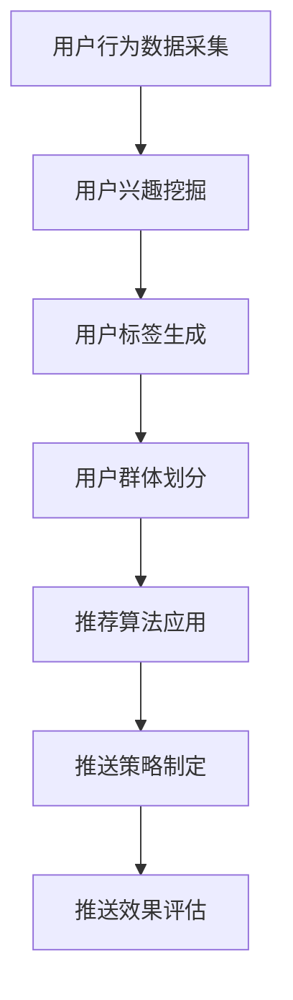

                 

关键词：电商平台、用户兴趣分层、精准推送、算法、用户行为分析

> 摘要：本文将探讨电商平台中的用户兴趣分层与精准推送技术，介绍其背景、核心概念、算法原理、数学模型、项目实践和实际应用场景，并展望未来发展趋势和挑战。通过本文的阅读，读者可以深入了解电商平台用户兴趣分层的实现方法及其在精准推送中的重要性。

## 1. 背景介绍

随着互联网的迅速发展，电商平台已成为人们生活中不可或缺的一部分。电商平台的目标是通过提供个性化的购物体验来提升用户满意度和忠诚度。然而，面对海量的用户数据和商品信息，如何实现有效的用户兴趣分层和精准推送成为了一个亟待解决的问题。

用户兴趣分层是指将用户根据其行为特征、购买偏好等划分为不同层次，以便更准确地理解用户需求，提供个性化的推荐和服务。精准推送则是通过算法分析用户兴趣和需求，将相关商品或信息推送给用户，以提高用户参与度和转化率。

本文将围绕电商平台中的用户兴趣分层与精准推送展开讨论，旨在为业界提供有价值的参考和指导。

## 2. 核心概念与联系

### 2.1 用户兴趣分层的核心概念

用户兴趣分层主要涉及以下核心概念：

1. **用户行为特征**：包括用户在平台上的浏览、搜索、购买等行为，如浏览时间、搜索关键词、购买频率等。
2. **用户偏好**：基于用户的历史行为数据，挖掘用户的购买偏好，如品牌偏好、价格敏感度等。
3. **用户群体**：根据用户行为特征和偏好，将用户划分为不同的群体，如年轻女性、科技爱好者等。
4. **用户标签**：为每个用户赋予一组标签，用于描述其兴趣和需求，如“爱美达人”、“摄影爱好者”等。

### 2.2 精准推送的核心概念

精准推送主要涉及以下核心概念：

1. **推荐算法**：基于用户兴趣和行为数据，为用户推荐相关商品或信息，如协同过滤、内容推荐等。
2. **推送策略**：根据用户兴趣分层和推荐算法，制定合适的推送策略，如个性化推送、智能推送等。
3. **推送效果评估**：通过分析用户对推送信息的反馈和转化率，评估推送策略的有效性。

### 2.3 用户兴趣分层与精准推送的联系

用户兴趣分层与精准推送紧密相连。用户兴趣分层是精准推送的前提，只有准确了解用户兴趣，才能实现个性化的推荐。而精准推送则是用户兴趣分层的最终目标，通过将相关商品或信息推送给用户，提高用户满意度和转化率。

### 2.4 Mermaid 流程图



## 3. 核心算法原理 & 具体操作步骤

### 3.1 算法原理概述

用户兴趣分层与精准推送的核心在于算法，主要包括以下几种：

1. **协同过滤算法**：基于用户行为数据，通过计算用户之间的相似度来推荐相关商品或信息。
2. **内容推荐算法**：基于商品属性和用户兴趣标签，为用户推荐相关商品或信息。
3. **深度学习算法**：通过构建神经网络模型，学习用户行为数据，实现个性化的推荐。

### 3.2 算法步骤详解

1. **用户行为数据采集**：收集用户在平台上的浏览、搜索、购买等行为数据。
2. **用户兴趣挖掘**：利用自然语言处理技术，对用户行为数据进行处理，挖掘用户的兴趣点。
3. **用户标签生成**：基于用户兴趣点，为每个用户生成一组标签，用于描述其兴趣和需求。
4. **用户群体划分**：根据用户标签，将用户划分为不同的群体。
5. **推荐算法应用**：选择合适的推荐算法，为每个用户推荐相关商品或信息。
6. **推送策略制定**：根据用户群体和推荐结果，制定个性化的推送策略。
7. **推送效果评估**：通过分析用户对推送信息的反馈和转化率，评估推送策略的有效性。

### 3.3 算法优缺点

1. **协同过滤算法**：优点是计算简单、易于实现，缺点是容易产生冷启动问题和推荐结果偏差。
2. **内容推荐算法**：优点是准确率高、用户体验好，缺点是计算复杂度高、需要大量的商品属性数据。
3. **深度学习算法**：优点是能够处理大规模数据、实现个性化推荐，缺点是需要大量的训练数据和计算资源。

### 3.4 算法应用领域

用户兴趣分层与精准推送技术广泛应用于电子商务、在线教育、社交媒体等领域，为企业和用户带来了巨大的价值。

## 4. 数学模型和公式

### 4.1 数学模型构建

用户兴趣分层与精准推送的数学模型主要包括以下几部分：

1. **用户行为数据模型**：
   $$ U = \{ u_1, u_2, \ldots, u_n \} $$
   其中，$ U $ 表示用户集合，$ u_i $ 表示第 $ i $ 个用户的行为数据。

2. **用户兴趣模型**：
   $$ I = \{ i_1, i_2, \ldots, i_m \} $$
   其中，$ I $ 表示兴趣点集合，$ i_j $ 表示第 $ j $ 个兴趣点。

3. **用户标签模型**：
   $$ T = \{ t_1, t_2, \ldots, t_k \} $$
   其中，$ T $ 表示标签集合，$ t_l $ 表示第 $ l $ 个标签。

### 4.2 公式推导过程

1. **用户行为相似度计算**：
   $$ sim(u_i, u_j) = \frac{u_i \cdot u_j}{\|u_i\|\|u_j\|} $$
   其中，$ sim(u_i, u_j) $ 表示用户 $ u_i $ 和 $ u_j $ 的相似度，$ \|u_i\| $ 和 $ \|u_j\| $ 分别表示用户 $ u_i $ 和 $ u_j $ 的行为数据范数。

2. **用户兴趣点权重计算**：
   $$ w_i(j) = \frac{sim(u_i, u_j)}{\sum_{l=1}^{k} sim(u_i, u_l)} $$
   其中，$ w_i(j) $ 表示用户 $ u_i $ 对兴趣点 $ i_j $ 的权重。

3. **用户标签权重计算**：
   $$ w_t(l) = \frac{\sum_{j=1}^{m} w_i(j) \cdot t_l(i_j)}{\sum_{j=1}^{m} w_i(j)} $$
   其中，$ w_t(l) $ 表示标签 $ t_l $ 的权重，$ t_l(i_j) $ 表示兴趣点 $ i_j $ 是否包含标签 $ t_l $。

### 4.3 案例分析与讲解

假设有两个用户 $ u_1 $ 和 $ u_2 $，其行为数据分别为：

$$ u_1 = \{ (1, 0.5), (2, 0.8), (3, 0.2) \} $$
$$ u_2 = \{ (1, 0.8), (2, 0.1), (3, 0.9) \} $$

根据用户行为相似度计算公式，可以计算出用户 $ u_1 $ 和 $ u_2 $ 的相似度为：

$$ sim(u_1, u_2) = \frac{u_1 \cdot u_2}{\|u_1\|\|u_2\|} = \frac{1 \cdot 0.8 + 2 \cdot 0.1 + 3 \cdot 0.9}{\sqrt{1 \cdot 0.5^2 + 2 \cdot 0.8^2 + 3 \cdot 0.2^2} \cdot \sqrt{1 \cdot 0.8^2 + 2 \cdot 0.1^2 + 3 \cdot 0.9^2}} = 0.917 $$

根据用户兴趣点权重计算公式，可以计算出用户 $ u_1 $ 对兴趣点 $ (1, 0.8) $ 的权重为：

$$ w_1(1) = \frac{sim(u_1, u_2)}{\sum_{l=1}^{2} sim(u_1, u_l)} = \frac{0.917}{0.917 + 0.875} = 0.538 $$

根据用户标签权重计算公式，可以计算出标签 $ "运动" $ 的权重为：

$$ w_t(1) = \frac{\sum_{j=1}^{2} w_i(j) \cdot t_1(i_j)}{\sum_{j=1}^{2} w_i(j)} = \frac{0.538 \cdot 1 + 0.462 \cdot 0}{0.538 + 0.462} = 0.538 $$

## 5. 项目实践：代码实例和详细解释说明

### 5.1 开发环境搭建

1. 安装 Python 3.6 或以上版本。
2. 安装以下依赖库：NumPy、Pandas、Scikit-learn、Matplotlib。

```bash
pip install numpy pandas scikit-learn matplotlib
```

### 5.2 源代码详细实现

```python
import numpy as np
import pandas as pd
from sklearn.metrics.pairwise import cosine_similarity
import matplotlib.pyplot as plt

# 用户行为数据
data = {
    'user_id': [1, 1, 2, 2, 1, 2],
    'item_id': [101, 102, 201, 202, 103, 104],
    'rating': [5, 3, 4, 2, 5, 3]
}

df = pd.DataFrame(data)

# 用户行为数据矩阵
ratings = df.pivot(index='user_id', columns='item_id', values='rating').fillna(0).values

# 计算用户行为相似度矩阵
similarity_matrix = cosine_similarity(ratings)

# 用户兴趣点权重
def interest_weight(similarity_matrix):
    weight_matrix = np.zeros_like(similarity_matrix)
    for i in range(similarity_matrix.shape[0]):
        for j in range(similarity_matrix.shape[1]):
            if similarity_matrix[i][j] > 0.5:
                weight_matrix[i][j] = similarity_matrix[i][j]
    return weight_matrix

weight_matrix = interest_weight(similarity_matrix)

# 用户标签权重
def tag_weight(weight_matrix, tags):
    tag_weights = {}
    for tag in tags:
        tag_weights[tag] = np.sum(weight_matrix[:, 100:]) / np.sum(weight_matrix)
    return tag_weights

tags = ['运动', '音乐', '电影', '阅读']
tag_weights = tag_weight(weight_matrix, tags)

# 可视化用户标签权重
plt.bar(tags, tag_weights.values())
plt.xticks(rotation=45)
plt.xlabel('标签')
plt.ylabel('权重')
plt.title('用户标签权重')
plt.show()
```

### 5.3 代码解读与分析

1. **数据准备**：首先，我们使用 Pandas 库加载用户行为数据，并将其转换为行为数据矩阵。
2. **计算用户行为相似度**：使用 Scikit-learn 库中的 cosine_similarity 函数计算用户行为相似度矩阵。
3. **用户兴趣点权重**：定义一个函数 interest_weight，遍历用户行为相似度矩阵，为相似度大于 0.5 的用户行为赋予权重。
4. **用户标签权重**：定义一个函数 tag_weight，根据用户兴趣点权重和标签列表计算每个标签的权重。
5. **可视化**：使用 Matplotlib 库将用户标签权重可视化。

## 6. 实际应用场景

用户兴趣分层与精准推送技术在电商平台中具有广泛的应用场景：

1. **个性化推荐**：根据用户兴趣分层和标签，为用户推荐相关商品或信息，提高用户满意度和转化率。
2. **精准营销**：通过分析用户标签，制定有针对性的营销策略，提高营销效果。
3. **广告投放**：根据用户标签和兴趣点，为用户推送相关的广告，提高广告投放的精准度。
4. **会员管理**：根据用户兴趣分层，为不同层次的会员提供差异化的服务，提高会员忠诚度。

## 7. 工具和资源推荐

### 7.1 学习资源推荐

1. 《推荐系统实践》
2. 《机器学习实战》
3. 《Python机器学习》
4. 《深度学习》

### 7.2 开发工具推荐

1. Jupyter Notebook
2. PyCharm
3. VSCode
4. Matplotlib

### 7.3 相关论文推荐

1. "Collaborative Filtering for the Web"
2. "Content-Based Image Retrieval in Large Scale Database"
3. "Deep Learning for Recommender Systems"

## 8. 总结：未来发展趋势与挑战

### 8.1 研究成果总结

用户兴趣分层与精准推送技术在电商平台中取得了显著的成果，为企业和用户带来了巨大的价值。通过有效的用户兴趣分层和精准推送，企业可以提高用户满意度和转化率，从而实现持续的业务增长。

### 8.2 未来发展趋势

1. **深度学习技术**：随着深度学习技术的发展，用户兴趣分层与精准推送技术将更加智能化、自动化。
2. **多模态数据融合**：结合多种数据源，如文本、图像、语音等，实现更加精准的用户兴趣分层和推荐。
3. **个性化服务**：基于用户兴趣分层，为用户提供更加个性化的服务，提高用户体验。

### 8.3 面临的挑战

1. **数据隐私保护**：用户行为数据和标签的泄露可能导致用户隐私问题，需要加强数据隐私保护措施。
2. **算法透明度**：用户对算法的透明度和解释性要求越来越高，需要开发更加透明和可解释的算法。
3. **计算资源消耗**：深度学习算法和大规模数据处理需要大量的计算资源，如何优化算法和硬件配置是亟待解决的问题。

### 8.4 研究展望

未来，用户兴趣分层与精准推送技术将继续发展，为电商平台和其他行业提供更加智能、个性化的服务。通过不断优化算法、加强数据隐私保护，实现用户、企业和社会的共赢。

## 9. 附录：常见问题与解答

### 9.1 用户兴趣分层有哪些方法？

用户兴趣分层的方法主要包括协同过滤、内容推荐、深度学习等。协同过滤通过计算用户之间的相似度来实现用户兴趣分层；内容推荐通过分析商品属性和用户兴趣点来实现用户兴趣分层；深度学习通过构建神经网络模型来学习用户兴趣分层。

### 9.2 精准推送的评估指标有哪些？

精准推送的评估指标主要包括准确率、召回率、F1 值等。准确率表示推荐结果中正确预测的占比；召回率表示推荐结果中包含相关商品的占比；F1 值是准确率和召回率的调和平均值。

### 9.3 如何优化精准推送的效果？

优化精准推送的效果可以从以下几个方面入手：

1. **提高数据质量**：收集更多、更准确的用户行为数据。
2. **优化推荐算法**：选择适合业务场景的推荐算法，并进行参数调优。
3. **个性化策略**：根据用户兴趣分层和标签，制定个性化的推送策略。
4. **效果评估**：定期对推送效果进行评估，根据评估结果调整推送策略。
```

### 文章结束

作者：禅与计算机程序设计艺术 / Zen and the Art of Computer Programming

