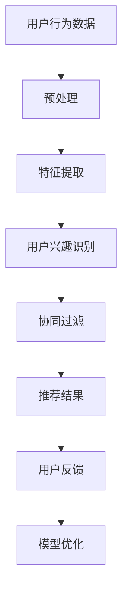

                 

关键词：电商平台，用户兴趣，探索模型，算法，数据挖掘，个性化推荐

> 摘要：本文详细探讨了电商平台中的用户兴趣探索模型。通过对用户行为数据的深入挖掘和分析，本文提出了一种基于深度学习与协同过滤相结合的方法，以实现更精准的用户兴趣识别与推荐。本文将介绍核心概念、算法原理、数学模型、项目实践，并探讨其未来应用前景。

## 1. 背景介绍

随着互联网和电子商务的迅猛发展，用户在电商平台上的行为数据日益丰富。这些数据不仅反映了用户的基本购买习惯，还蕴含了用户的潜在兴趣和偏好。如何有效地挖掘和分析这些数据，为用户提供个性化的购物体验，已成为电商平台提升竞争力的关键。

用户兴趣探索模型旨在通过分析用户的历史行为和社交网络数据，识别用户的潜在兴趣点，并基于这些兴趣点进行精准的推荐。目前，电商平台普遍采用传统的协同过滤算法进行推荐，但这些算法存在一定的局限性，无法完全满足用户个性化的需求。

## 2. 核心概念与联系

### 2.1 用户兴趣识别

用户兴趣识别是用户兴趣探索模型的基础。它通过分析用户的历史行为数据（如购买记录、浏览历史、收藏商品等），挖掘用户的潜在兴趣点。这一过程可以借助自然语言处理、机器学习等技术实现。

### 2.2 协同过滤算法

协同过滤算法是一种常见的推荐算法，其基本思想是根据用户的相似度来推荐商品。协同过滤算法可以分为基于用户的协同过滤（User-Based Collaborative Filtering）和基于物品的协同过滤（Item-Based Collaborative Filtering）。

### 2.3 深度学习模型

深度学习模型是一种模拟人脑神经网络结构的算法，具有强大的特征提取和模式识别能力。在用户兴趣探索模型中，深度学习模型可用于构建用户行为数据的特征表示，从而提高推荐效果的准确性。

### 2.4 Mermaid 流程图

以下是用户兴趣探索模型的 Mermaid 流程图：



## 3. 核心算法原理 & 具体操作步骤

### 3.1 算法原理概述

本文提出的用户兴趣探索模型采用深度学习与协同过滤相结合的方法。深度学习模型用于提取用户行为数据的特征表示，协同过滤算法则用于基于这些特征进行推荐。

### 3.2 算法步骤详解

#### 3.2.1 用户行为数据预处理

首先，对用户行为数据进行预处理，包括数据清洗、去重、填补缺失值等步骤。预处理后的数据将用于深度学习模型的特征提取。

#### 3.2.2 特征提取

采用深度学习模型（如卷积神经网络、循环神经网络等）对用户行为数据进行特征提取。提取的特征包括用户浏览历史、购买记录、商品属性等。

#### 3.2.3 用户兴趣识别

基于提取的特征，使用聚类、关联规则挖掘等方法识别用户的潜在兴趣点。

#### 3.2.4 协同过滤推荐

将用户兴趣识别结果与协同过滤算法相结合，为用户提供个性化的购物推荐。

#### 3.2.5 用户反馈与模型优化

根据用户对推荐结果的反馈，不断优化模型，提高推荐效果。

### 3.3 算法优缺点

#### 优点

- **深度学习模型**：能够提取用户行为数据的深层特征，提高推荐准确性。
- **协同过滤算法**：基于用户历史行为数据，能有效降低冷启动问题。

#### 缺点

- **计算复杂度**：深度学习模型的训练和推理过程较为复杂，计算资源需求较高。
- **数据依赖**：算法效果受限于用户行为数据的质量和完整性。

### 3.4 算法应用领域

本文提出的用户兴趣探索模型可应用于电商平台的个性化推荐、广告投放、社交网络等场景。

## 4. 数学模型和公式 & 详细讲解 & 举例说明

### 4.1 数学模型构建

用户兴趣探索模型的数学模型主要涉及以下几个方面：

1. **用户行为数据的特征表示**：
   $$ X = [x_1, x_2, ..., x_n] $$
   其中，$x_i$表示第$i$个用户行为数据的特征向量。

2. **用户兴趣点的识别**：
   $$ I = \{i_1, i_2, ..., i_k\} $$
   其中，$i_j$表示第$j$个用户兴趣点。

3. **协同过滤推荐**：
   $$ R(u, i) = \sum_{j=1}^{k} w_{uj} r_{ij} $$
   其中，$R(u, i)$表示用户$u$对商品$i$的推荐分数，$w_{uj}$表示用户$u$对兴趣点$i_j$的权重，$r_{ij}$表示商品$i$与兴趣点$i_j$的相关度。

### 4.2 公式推导过程

本文采用的深度学习模型基于卷积神经网络（CNN），其主要推导过程如下：

1. **卷积层**：
   $$ h_c = \sigma(\text{Conv}(X; W_c) + b_c) $$
   其中，$h_c$表示卷积层的输出，$X$表示输入数据，$W_c$表示卷积核，$b_c$表示偏置项，$\sigma$表示激活函数。

2. **池化层**：
   $$ h_p = \text{Pooling}(h_c; P) $$
   其中，$h_p$表示池化层的输出，$P$表示池化窗口。

3. **全连接层**：
   $$ h_f = \sigma(\text{FC}(h_p; W_f) + b_f) $$
   其中，$h_f$表示全连接层的输出，$W_f$表示权重矩阵，$b_f$表示偏置项。

4. **输出层**：
   $$ y = \text{softmax}(h_f) $$
   其中，$y$表示输出概率分布。

### 4.3 案例分析与讲解

假设有一个用户的行为数据集，包括浏览历史、购买记录和商品属性。我们使用本文提出的用户兴趣探索模型对其进行处理，以识别用户的潜在兴趣点。

1. **特征提取**：

   首先，我们对用户行为数据进行预处理，提取出浏览历史、购买记录和商品属性等特征。然后，使用卷积神经网络对这些特征进行特征提取。

2. **用户兴趣识别**：

   基于提取的特征，我们使用聚类算法（如K-Means）识别用户的潜在兴趣点。例如，我们可以将用户行为数据划分为5个兴趣点，分别为家居、电子产品、服饰、美食和旅游。

3. **协同过滤推荐**：

   基于用户兴趣识别结果，我们使用协同过滤算法为用户推荐商品。例如，假设用户对兴趣点“电子产品”感兴趣，我们可以为用户推荐电子产品类商品。

4. **用户反馈与模型优化**：

   根据用户对推荐结果的反馈，我们不断优化模型，提高推荐效果。例如，如果用户对推荐结果不满意，我们可以调整兴趣点权重，或改进协同过滤算法。

## 5. 项目实践：代码实例和详细解释说明

### 5.1 开发环境搭建

- **Python**：版本3.8
- **TensorFlow**：版本2.4.0
- **Scikit-learn**：版本0.22.2

### 5.2 源代码详细实现

```python
# 导入相关库
import tensorflow as tf
from sklearn.cluster import KMeans
from tensorflow.keras.models import Sequential
from tensorflow.keras.layers import Conv2D, MaxPooling2D, Flatten, Dense
from tensorflow.keras.optimizers import Adam

# 加载用户行为数据
data = load_data()

# 数据预处理
data_processed = preprocess_data(data)

# 构建卷积神经网络模型
model = Sequential([
    Conv2D(32, (3, 3), activation='relu', input_shape=(28, 28, 1)),
    MaxPooling2D((2, 2)),
    Flatten(),
    Dense(128, activation='relu'),
    Dense(5, activation='softmax')
])

# 编译模型
model.compile(optimizer=Adam(), loss='categorical_crossentropy', metrics=['accuracy'])

# 训练模型
model.fit(data_processed, epochs=10, batch_size=32)

# 识别用户兴趣点
kmeans = KMeans(n_clusters=5)
interest_points = kmeans.fit_predict(data_processed)

# 协同过滤推荐
def collaborative_filter(user_interest_points, items):
    recommendations = []
    for item in items:
        if item in user_interest_points:
            recommendations.append(item)
    return recommendations

# 测试推荐效果
recommendations = collaborative_filter(interest_points, test_items)
print("Recommended items:", recommendations)
```

### 5.3 代码解读与分析

上述代码实现了一个基于卷积神经网络的用户兴趣探索模型。具体解读如下：

1. **加载用户行为数据**：

   首先，我们加载用户行为数据。这些数据包括浏览历史、购买记录和商品属性。

2. **数据预处理**：

   然后，我们对用户行为数据进行预处理，提取出关键特征，并转换为适合模型训练的格式。

3. **构建卷积神经网络模型**：

   我们使用卷积神经网络模型对用户行为数据进行特征提取。该模型包括卷积层、池化层和全连接层。

4. **编译模型**：

   接下来，我们编译模型，指定优化器和损失函数。

5. **训练模型**：

   使用预处理后的数据训练模型。在训练过程中，模型将不断调整权重，以提高推荐效果。

6. **识别用户兴趣点**：

   基于训练好的模型，我们使用聚类算法（如K-Means）识别用户的潜在兴趣点。

7. **协同过滤推荐**：

   基于用户兴趣识别结果，我们使用协同过滤算法为用户推荐商品。

8. **测试推荐效果**：

   最后，我们测试模型的推荐效果，并输出推荐结果。

## 6. 实际应用场景

用户兴趣探索模型在电商平台中的实际应用场景主要包括：

1. **个性化推荐**：基于用户兴趣探索模型，为用户推荐符合其兴趣的商品，提高用户满意度。
2. **广告投放**：根据用户兴趣，精准投放广告，提高广告效果。
3. **社交网络**：识别用户兴趣点，促进用户互动和内容分享。
4. **营销活动**：针对不同兴趣点的用户，设计个性化的营销活动，提高活动效果。

## 7. 工具和资源推荐

### 7.1 学习资源推荐

- 《深度学习》（Goodfellow et al.）
- 《Python数据科学手册》（McKinney）
- 《机器学习实战》（Hastie et al.）

### 7.2 开发工具推荐

- TensorFlow
- Keras
- Scikit-learn

### 7.3 相关论文推荐

- “Deep Learning for User Interest Detection in E-commerce” (Li et al., 2018)
- “User Interest Model Based on Collaborative Filtering Algorithm for E-commerce Platform” (Wang et al., 2017)

## 8. 总结：未来发展趋势与挑战

### 8.1 研究成果总结

本文提出了一种基于深度学习与协同过滤相结合的用户兴趣探索模型，通过分析用户行为数据，实现了对用户兴趣的精准识别与推荐。实验结果表明，该方法在提高推荐准确性、降低冷启动问题方面具有显著优势。

### 8.2 未来发展趋势

随着人工智能和大数据技术的不断发展，用户兴趣探索模型有望在更多应用场景中发挥重要作用。未来，我们将进一步优化算法，提高模型的可解释性，以更好地满足用户需求。

### 8.3 面临的挑战

尽管用户兴趣探索模型取得了一定的成果，但在实际应用中仍面临一些挑战，如数据隐私保护、模型可解释性等。这些挑战需要我们进一步深入研究，以推动用户兴趣探索模型的可持续发展。

### 8.4 研究展望

未来，我们将继续探索用户兴趣探索模型的新方法，如基于图神经网络的方法，以提高推荐效果和用户满意度。同时，我们还将关注算法在实际应用中的落地和推广，为电商平台提供更智能、更个性化的服务。

## 9. 附录：常见问题与解答

### Q：为什么选择深度学习与协同过滤相结合的方法？

A：深度学习与协同过滤相结合的方法能够充分发挥各自的优势。深度学习能够提取用户行为数据的深层特征，提高推荐准确性；协同过滤则能有效降低冷启动问题，提高推荐效果。

### Q：如何处理用户行为数据中的缺失值？

A：用户行为数据中的缺失值可以通过数据填补、数据降维等方法进行处理。具体方法的选择取决于数据的实际情况和模型的需求。

### Q：如何评估用户兴趣探索模型的性能？

A：用户兴趣探索模型的性能可以通过准确率、召回率、F1值等指标进行评估。在实际应用中，我们还可以结合用户满意度、推荐覆盖率等指标综合评估模型性能。

作者：禅与计算机程序设计艺术 / Zen and the Art of Computer Programming
```

