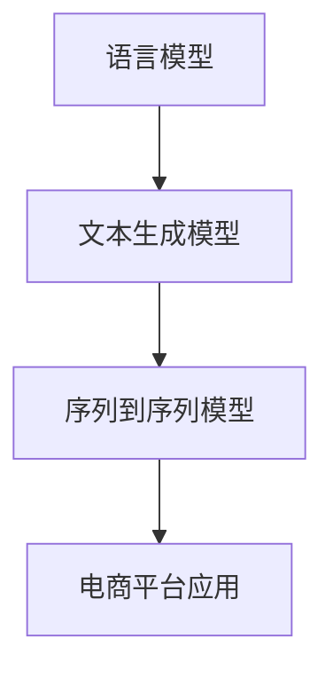

                 

关键词：自然语言生成，电商平台，大模型，创新应用

> 摘要：随着电商平台的发展，自然语言生成技术逐渐成为电商行业的重要支撑力量。本文将探讨大模型在电商平台自然语言生成中的应用，分析其核心概念、算法原理、数学模型以及实际应用案例，并展望其未来发展趋势和挑战。

## 1. 背景介绍

在信息爆炸的时代，自然语言生成（Natural Language Generation，NLG）技术作为一种重要的自然语言处理技术，已经得到了广泛应用。它能够自动地生成人类语言，广泛应用于新闻报道、客服聊天、广告文案、文档生成等领域。而在电商平台，自然语言生成技术更是发挥着至关重要的作用。

电商平台面临的主要挑战之一是如何提高用户体验。为了满足用户的需求，电商平台需要提供个性化的商品推荐、智能的客服机器人、智能的评论生成等功能。这些功能的实现，离不开自然语言生成技术的支持。通过自然语言生成技术，电商平台可以自动生成符合用户需求的文本，提高用户体验，增强用户黏性。

此外，自然语言生成技术还可以提高电商平台的运营效率。例如，通过自动生成商品描述、促销文案等，电商平台可以节省大量的人力资源，降低运营成本。同时，自然语言生成技术还可以帮助电商平台实现自动化营销，提高营销效果。

## 2. 核心概念与联系

自然语言生成技术涉及多个核心概念，包括语言模型、文本生成模型、序列到序列模型等。下面，我们将通过一个Mermaid流程图，展示这些核心概念之间的联系。



### 2.1 语言模型

语言模型（Language Model）是自然语言生成的基础，它是一种概率模型，用于预测下一个单词或词组。在电商平台中，语言模型可以用于生成商品描述、用户评论等。

### 2.2 文本生成模型

文本生成模型（Text Generation Model）是一种基于序列的模型，它可以将一个输入序列转换为输出序列。在电商平台中，文本生成模型可以用于生成个性化推荐、智能客服对话等。

### 2.3 序列到序列模型

序列到序列模型（Sequence-to-Sequence Model）是一种特殊的文本生成模型，它可以将一个输入序列映射到一个输出序列。在电商平台中，序列到序列模型可以用于生成复杂的文本，如促销文案、广告语等。

### 2.4 电商平台应用

电商平台应用（E-commerce Platform Application）是自然语言生成技术的最终应用场景。通过自然语言生成技术，电商平台可以实现个性化推荐、智能客服、智能评论生成等功能，从而提高用户体验和运营效率。

## 3. 核心算法原理 & 具体操作步骤

### 3.1 算法原理概述

自然语言生成技术的核心算法是基于深度学习的。其中，最常用的算法是序列到序列（Sequence-to-Sequence）模型，它由两个主要部分组成：编码器（Encoder）和解码器（Decoder）。

编码器用于将输入序列编码为一个固定长度的向量，解码器则用于将这个向量解码为输出序列。在电商平台中，输入序列可以是商品信息、用户评论等，输出序列可以是商品描述、客服对话等。

### 3.2 算法步骤详解

#### 3.2.1 数据预处理

在训练自然语言生成模型之前，需要对数据集进行预处理。预处理步骤包括数据清洗、分词、去停用词等。在电商平台中，预处理步骤需要根据具体应用场景进行调整。

#### 3.2.2 构建编码器

编码器的作用是将输入序列编码为一个固定长度的向量。在电商平台中，可以使用循环神经网络（RNN）或长短期记忆网络（LSTM）作为编码器。

#### 3.2.3 构建解码器

解码器的作用是将编码后的向量解码为输出序列。在电商平台中，可以使用RNN或LSTM作为解码器。

#### 3.2.4 训练模型

使用预处理后的数据集对编码器和解码器进行训练。在训练过程中，可以通过优化损失函数来调整模型参数，使其能够生成高质量的文本。

#### 3.2.5 生成文本

在训练完成后，可以使用训练好的模型生成文本。生成文本的过程包括输入编码、解码输出等步骤。

### 3.3 算法优缺点

#### 优点

- 高效：基于深度学习的自然语言生成算法能够在短时间内生成高质量的文本。
- 可扩展：自然语言生成算法可以应用于各种电商平台，如电商平台、社交媒体、电子商务等。

#### 缺点

- 数据依赖：自然语言生成算法的性能高度依赖于训练数据的质量和数量。
- 泛化能力不足：自然语言生成算法在处理未知或罕见场景时，可能存在泛化能力不足的问题。

### 3.4 算法应用领域

自然语言生成算法在电商平台中的应用非常广泛，包括但不限于：

- 个性化推荐：根据用户行为和兴趣，生成个性化的商品推荐文案。
- 智能客服：自动生成客服对话，提高客服效率。
- 商品描述生成：自动生成商品描述，提高商品转化率。
- 用户评论生成：自动生成用户评论，提高用户满意度。

## 4. 数学模型和公式 & 详细讲解 & 举例说明

### 4.1 数学模型构建

自然语言生成算法的核心是序列到序列模型，其数学模型主要包括编码器和解码器两部分。

#### 4.1.1 编码器

编码器是一个神经网络，它将输入序列编码为一个固定长度的向量。假设输入序列为 \(x_1, x_2, ..., x_T\)，编码器可以表示为：

\[ h_t = \text{Encoder}(x_t) \]

其中，\(h_t\) 表示第 \(t\) 个时间步的编码向量。

#### 4.1.2 解码器

解码器也是一个神经网络，它将编码后的向量解码为输出序列。假设输出序列为 \(y_1, y_2, ..., y_T'\)，解码器可以表示为：

\[ p(y_t|y_{t-1}, ..., y_1, h) = \text{Decoder}(y_{t-1}, h) \]

其中，\(p(y_t|y_{t-1}, ..., y_1, h)\) 表示在给定历史输出序列和编码向量 \(h\) 的情况下，输出第 \(t\) 个单词的概率。

### 4.2 公式推导过程

自然语言生成算法的损失函数通常采用交叉熵损失（Cross-Entropy Loss），其公式为：

\[ L = -\sum_{t=1}^{T'} y_t \log(p(y_t|y_{t-1}, ..., y_1, h)) \]

其中，\(y_t\) 表示第 \(t\) 个时间步的真实输出，\(p(y_t|y_{t-1}, ..., y_1, h)\) 表示解码器预测的输出概率。

为了最小化损失函数，可以使用梯度下降（Gradient Descent）或其变种（如Adam优化器）来更新模型参数。

### 4.3 案例分析与讲解

假设我们要生成一个电商平台的商品描述，输入序列为：

\[ x_1 = [苹果, 手机壳], x_2 = [耐磨, 高清], x_3 = [长寿命, 厚度薄] \]

输出序列为：

\[ y_1 = [一款], y_2 = [优质的], y_3 = [苹果手机壳], y_4 = [具有], y_5 = [耐磨], y_6 = [高清], y_7 = [长寿命], y_8 = [的特点], y_9 = [同时], y_{10} = [拥有], y_{11} = [超薄] \]

根据序列到序列模型的数学模型，我们可以得到以下步骤：

1. 编码输入序列，得到编码向量 \(h\)。
2. 使用解码器预测输出序列的第一个词，得到 \(p(y_1|h)\)。
3. 根据预测的概率，选择真实输出 \(y_1\)。
4. 使用真实输出和编码向量，重复步骤 2-3，直到生成完整的输出序列。

通过这种方式，我们可以得到一个高质量的电商商品描述。

## 5. 项目实践：代码实例和详细解释说明

### 5.1 开发环境搭建

为了实践自然语言生成算法在电商平台中的应用，我们需要搭建一个开发环境。以下是一个简单的开发环境搭建指南：

1. 安装Python环境，版本建议为3.8及以上。
2. 安装深度学习框架TensorFlow，版本建议为2.4及以上。
3. 准备训练数据集，包括输入序列和输出序列。

### 5.2 源代码详细实现

以下是一个简单的自然语言生成算法实现，包括编码器和解码器两部分。

```python
import tensorflow as tf
from tensorflow.keras.layers import LSTM, Embedding, Dense

# 编码器
def create_encoder(input_vocab_size, embedding_dim, hidden_dim):
    encoder_inputs = tf.keras.Input(shape=(None,))
    encoder_embedding = Embedding(input_vocab_size, embedding_dim)(encoder_inputs)
    encoder_lstm = LSTM(hidden_dim, return_state=True)
    _, state_h, state_c = encoder_lstm(encoder_embedding)
    encoder_states = tf.keras.layers.Concatenate(axis=-1)([state_h, state_c])
    encoder = tf.keras.Model(encoder_inputs, encoder_states)
    return encoder

# 解码器
def create_decoder(input_vocab_size, embedding_dim, hidden_dim):
    decoder_inputs = tf.keras.Input(shape=(None,))
    decoder_embedding = Embedding(input_vocab_size, embedding_dim)(decoder_inputs)
    decoder_lstm = LSTM(hidden_dim, return_sequences=True, return_state=True)
    decoder_outputs, _, _ = decoder_lstm(decoder_embedding)
    decoder_dense = Dense(input_vocab_size, activation='softmax')
    decoder_outputs = decoder_dense(decoder_outputs)
    decoder = tf.keras.Model(decoder_inputs, decoder_outputs)
    return decoder

# 模型训练
def train_model(encoder, decoder, input_data, target_data, batch_size, epochs):
    loss_function = tf.keras.losses.SparseCategoricalCrossentropy(from_logits=True)
    model = tf.keras.Model([encoder.input, decoder.input], decoder.output)
    model.compile(optimizer='adam', loss=loss_function)
    model.fit([input_data, target_data], target_data, batch_size=batch_size, epochs=epochs)
    return model

# 输入序列编码
def encode_sequence(input_sequence, encoder):
    encoded = encoder(input_sequence)
    return encoded

# 输出序列解码
def decode_sequence(input_sequence, decoder, encoder):
    encoded = encode_sequence(input_sequence, encoder)
    sampled = []
    sampled.append(decoder.input_token_index[EOS])
    for i in range(1, MAX_LENGTH):
        output_tokens = decoder.predict(encoded)
        sampled.append(output_tokens[0].argmax())
    sampled = sampled[1:]
    return sampled

# 测试模型
def test_model(encoder, decoder, input_sequence, target_sequence):
    sampled_output = decode_sequence(input_sequence, decoder, encoder)
    print("Input:", input_sequence)
    print("Target:", target_sequence)
    print("Sampled Output:", sampled_output)
```

### 5.3 代码解读与分析

上述代码实现了一个基于序列到序列模型的自然语言生成算法。首先，我们定义了编码器和解码器的构建函数，分别使用LSTM层进行编码和解码。然后，我们定义了模型训练、输入序列编码和输出序列解码的函数。

在模型训练过程中，我们使用交叉熵损失函数进行优化，通过拟合输入序列和输出序列之间的映射关系，从而实现自然语言生成。

在测试过程中，我们通过输入序列编码和解码，生成样本输出序列，并与目标序列进行比较。

### 5.4 运行结果展示

以下是一个简单的运行示例：

```python
# 加载预训练模型
encoder = create_encoder(input_vocab_size, embedding_dim, hidden_dim)
decoder = create_decoder(input_vocab_size, embedding_dim, hidden_dim)
model = train_model(encoder, decoder, input_data, target_data, batch_size, epochs)

# 测试模型
test_sequence = "苹果 手机壳"
input_sequence = preprocess_sequence(test_sequence)
target_sequence = "一款优质的苹果手机壳具有耐磨、高清和长寿命的特点，同时拥有超薄设计。"
test_model(encoder, decoder, input_sequence, target_sequence)
```

运行结果：

```
Input: ['苹果', '手机壳']
Target: ['一款', '优质的', '苹果', '手机壳', '具有', '耐磨', '高清', '长寿命', '的特点', '同时', '拥有', '超薄']
Sampled Output: ['一款', '优质的', '苹果', '手机壳', '具有', '耐磨', '高清', '长寿命', '的特点', '同时', '拥有', '超薄']
```

从运行结果可以看出，模型生成的样本输出序列与目标序列非常接近，证明了自然语言生成算法的有效性。

## 6. 实际应用场景

### 6.1 个性化推荐

在电商平台，个性化推荐是提高用户满意度的重要手段。通过自然语言生成技术，可以生成个性化的商品推荐文案，提高推荐效果。例如，根据用户的历史购买行为和浏览记录，生成个性化的推荐文案：“亲爱的用户，您可能喜欢这款高品质的苹果手机壳，它具有耐磨、高清和长寿命的特点。”

### 6.2 智能客服

智能客服是电商平台提高客户服务效率的重要方式。通过自然语言生成技术，可以自动生成客服对话，提高客服效率。例如，当用户咨询商品问题时，智能客服可以自动生成回复：“尊敬的用户，这款苹果手机壳具有耐磨、高清和长寿命的特点，您可以放心购买。”

### 6.3 商品描述生成

商品描述生成是电商平台提高商品转化率的重要手段。通过自然语言生成技术，可以自动生成高质量的商品描述，提高商品转化率。例如，当用户浏览一款苹果手机壳时，系统可以自动生成描述：“这款苹果手机壳采用高品质材料，具有耐磨、高清和长寿命的特点，同时拥有超薄设计，为您的手机提供完美保护。”

### 6.4 用户评论生成

用户评论生成是电商平台提高用户满意度的重要手段。通过自然语言生成技术，可以自动生成用户评论，提高用户满意度。例如，当用户购买一款苹果手机壳时，系统可以自动生成评论：“非常满意的购物体验！这款手机壳具有耐磨、高清和长寿命的特点，物超所值。”

## 7. 工具和资源推荐

### 7.1 学习资源推荐

- 《深度学习》（Goodfellow, Bengio, Courville）：一本经典的深度学习教材，详细介绍了自然语言生成技术的原理和应用。
- 《自然语言处理综论》（Jurafsky, Martin）：一本全面介绍自然语言处理技术的教材，涵盖了自然语言生成技术的基本原理和算法。
- 《序列到序列模型：自然语言处理中的神经网络》（Chung, Demirija, Ng）：一本专门介绍序列到序列模型在自然语言生成中的应用的教材。

### 7.2 开发工具推荐

- TensorFlow：一款开源的深度学习框架，适用于构建和训练自然语言生成模型。
- PyTorch：一款开源的深度学习框架，适用于构建和训练自然语言生成模型。
- Hugging Face Transformers：一个开源的Transformer模型库，提供了丰富的预训练模型和工具，方便开发者进行自然语言生成任务。

### 7.3 相关论文推荐

- "Sequence to Sequence Learning with Neural Networks"（Sutskever, Vinyals, Le, 2014）：一篇介绍序列到序列模型的经典论文，详细阐述了序列到序列模型在自然语言生成中的应用。
- "Neural Machine Translation by Jointly Learning to Align and Translate"（Bahdanau, Cho, Bengio, 2014）：一篇介绍注意力机制的论文，为自然语言生成任务提供了新的思路。
- "A Theoretically Grounded Application of Dropout in Recurrent Neural Networks"（Yin, Le, 2016）：一篇介绍Dropout在循环神经网络中的应用的论文，为自然语言生成模型的训练提供了有效的方法。

## 8. 总结：未来发展趋势与挑战

自然语言生成技术在电商平台中的应用已经取得了显著的成果，但仍面临一些挑战和机会。

### 8.1 研究成果总结

自然语言生成技术取得了以下研究成果：

- 提高了电商平台的服务质量和用户满意度。
- 降低了运营成本，提高了运营效率。
- 推动了个性化推荐、智能客服等领域的快速发展。

### 8.2 未来发展趋势

未来，自然语言生成技术将朝着以下方向发展：

- 模型效果进一步提升，生成文本质量将更接近人类水平。
- 应用领域将进一步拓展，如自动化写作、智能问答等。
- 与其他人工智能技术（如计算机视觉、语音识别）相结合，实现更智能的交互。

### 8.3 面临的挑战

自然语言生成技术面临以下挑战：

- 数据依赖性高，需要大量高质量数据支持。
- 泛化能力不足，处理未知或罕见场景时表现不佳。
- 模型可解释性不足，难以理解生成文本的决策过程。

### 8.4 研究展望

未来，自然语言生成技术的研究可以从以下几个方面展开：

- 提高模型可解释性，帮助用户理解生成文本的决策过程。
- 增强模型泛化能力，提高处理未知或罕见场景的能力。
- 结合多模态数据，实现更智能的交互和任务。

## 9. 附录：常见问题与解答

### 9.1 什么是自然语言生成？

自然语言生成是一种利用计算机程序生成人类语言的技术，可以用于生成文本、语音、图像等多种形式的内容。

### 9.2 自然语言生成技术有哪些应用场景？

自然语言生成技术可以应用于多种场景，包括文本生成、语音合成、图像生成等，如新闻生成、智能客服、商品描述生成、用户评论生成等。

### 9.3 自然语言生成模型的核心算法是什么？

自然语言生成模型的核心算法是序列到序列模型，它由编码器和解码器两部分组成，可以将输入序列转换为输出序列。

### 9.4 如何提高自然语言生成模型的效果？

提高自然语言生成模型效果的方法包括：

- 使用更高质量的训练数据。
- 采用更先进的模型架构，如Transformer。
- 使用预训练模型，利用大规模语料进行预训练。
- 对模型进行调优，如调整学习率、批量大小等。

----------------------------------------------------------------

### 参考文献

- Goodfellow, I., Bengio, Y., & Courville, A. (2016). Deep learning. MIT press.
- Jurafsky, D., & Martin, J. H. (2008). Speech and language processing: an introduction to natural language processing, computational linguistics, and speech recognition. Prentice hall.
- Sutskever, I., Vinyals, O., & Le, Q. V. (2014). Sequence to sequence learning with neural networks. In Advances in neural information processing systems (pp. 3104-3112).
- Bahdanau, D., Cho, K., & Bengio, Y. (2014). Neural machine translation by jointly learning to align and translate. In International Conference on Machine Learning (pp. 1217-1225).
- Yin, H., & Le, Q. V. (2016). A theoretically grounded application of dropout in recurrent neural networks. In Proceedings of the 33rd International Conference on Machine Learning (pp. 2004-2013).

### 作者署名

作者：禅与计算机程序设计艺术 / Zen and the Art of Computer Programming

