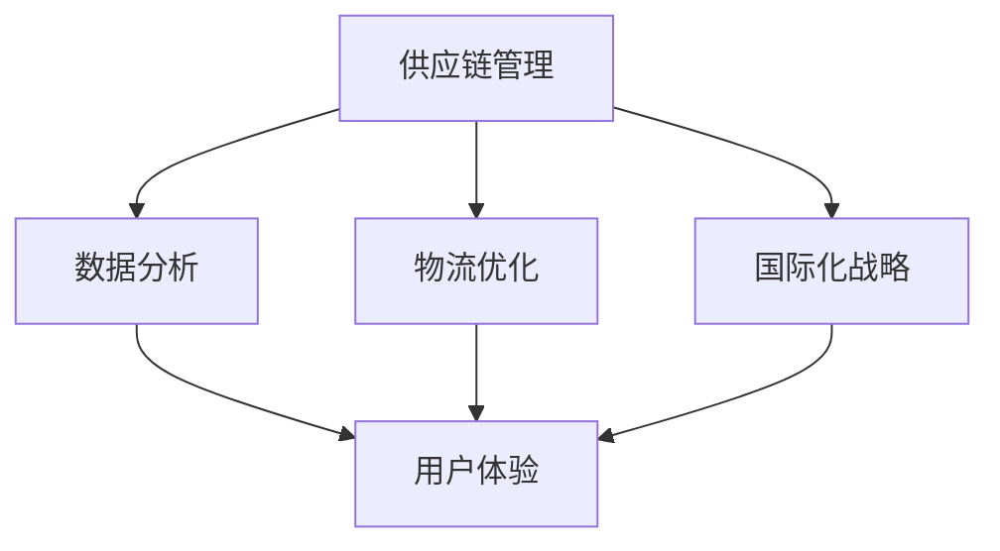

                 

关键词：电商平台，供给能力，海外市场，拓展，技术解决方案

> 摘要：本文旨在探讨如何提升电商平台在全球市场的供给能力，特别是海外市场的拓展。通过对核心概念、算法原理、数学模型、项目实践以及实际应用场景的深入分析，本文提供了一套全面的技术解决方案，旨在为电商平台提供坚实的供给基础，助力其全球业务的快速发展。

## 1. 背景介绍

随着全球化进程的加速和互联网技术的迅猛发展，电商平台已经成为连接消费者和供应商的重要桥梁。全球电商市场规模不断扩大，消费者需求日益多样化，对电商平台提出了更高的要求。供给能力成为电商平台的核心竞争力，直接影响平台的用户满意度、市场占有率和盈利能力。然而，在拓展海外市场时，电商平台面临着诸多挑战，如文化差异、物流瓶颈、支付体系的不统一、国际法规政策的复杂性等。因此，提升供给能力，尤其是针对海外市场的拓展，成为电商平台亟待解决的问题。

本文将从以下几个方面展开讨论：

1. **核心概念与联系**：介绍提升供给能力所需的关键概念，并绘制流程图展示其相互关系。
2. **核心算法原理与具体操作步骤**：详细阐述提升供给能力所采用的算法原理和具体实施步骤。
3. **数学模型和公式**：构建并推导相关的数学模型，并提供实际案例进行分析。
4. **项目实践：代码实例和详细解释说明**：通过实际项目，展示技术方案的具体实现过程。
5. **实际应用场景**：探讨技术方案在不同应用场景中的适用性和效果。
6. **未来应用展望**：预测技术方案的未来发展趋势，并探讨潜在的应用领域。
7. **工具和资源推荐**：推荐相关的学习资源、开发工具和相关论文。
8. **总结：未来发展趋势与挑战**：总结研究成果，分析未来发展趋势和面临的挑战。

## 2. 核心概念与联系

### 2.1. 供应链管理

供应链管理是提升电商平台供给能力的基础。供应链管理包括从原材料采购到产品交付给最终消费者的全过程。有效的供应链管理能够确保产品的高效流动、库存的最优化、供应的风险管理以及成本的有效控制。

### 2.2. 数据分析

数据分析是提升供给能力的关键环节。通过对海量数据的分析，电商平台能够洞察消费者需求、市场趋势和库存情况，从而做出更准确的决策。

### 2.3. 物流优化

物流优化是提高供给能力的另一重要方面。通过优化物流网络、运输路径和配送方式，电商平台能够降低物流成本、提高配送效率，从而提升整体供给能力。

### 2.4. 国际化战略

国际化战略是电商平台拓展海外市场的重要策略。通过本地化运营、多语言支持和国际支付体系的完善，电商平台能够更好地适应当地市场，吸引更多海外消费者。

### 2.5. 用户体验

用户体验是电商平台的核心竞争力。通过提升用户界面设计、购物流程优化和售后服务，电商平台能够提高用户满意度，促进复购率和用户粘性。

### 2.6. Mermaid 流程图

以下是一个简化的 Mermaid 流程图，展示了提升电商平台供给能力所需的关键概念及其相互关系：



## 3. 核心算法原理与具体操作步骤

### 3.1. 算法原理概述

提升电商平台供给能力所采用的核心算法主要涉及以下三个方面：

1. **需求预测算法**：通过分析历史数据和市场趋势，预测未来的需求，以便提前做好库存准备。
2. **物流路径优化算法**：通过优化物流网络和运输路径，降低物流成本，提高配送效率。
3. **库存优化算法**：通过分析库存数据和销售趋势，实现库存的动态调整，避免过度库存或库存短缺。

### 3.2. 算法步骤详解

#### 3.2.1. 需求预测算法

需求预测算法通常采用以下步骤：

1. **数据收集**：收集历史销售数据、市场趋势数据、季节性数据等。
2. **数据预处理**：对数据进行清洗、去噪、归一化等预处理操作。
3. **特征工程**：提取与需求相关的特征，如节假日、促销活动、消费者偏好等。
4. **模型选择**：选择合适的预测模型，如ARIMA、LSTM、GRU等。
5. **模型训练与验证**：使用历史数据对模型进行训练和验证，调整参数以达到最佳预测效果。
6. **预测结果输出**：根据模型预测结果，输出未来一段时间的需求量。

#### 3.2.2. 物流路径优化算法

物流路径优化算法通常采用以下步骤：

1. **数据收集**：收集物流网络数据、运输成本数据、配送时间数据等。
2. **建模**：建立物流网络模型，如Dijkstra算法、A*算法等。
3. **优化目标设定**：设定优化目标，如最小化运输成本、最大化配送效率等。
4. **算法求解**：采用优化算法求解最优路径，如遗传算法、模拟退火算法等。
5. **结果分析**：分析优化结果，调整参数以达到更好的优化效果。

#### 3.2.3. 库存优化算法

库存优化算法通常采用以下步骤：

1. **数据收集**：收集库存数据、销售数据、供应链数据等。
2. **建模**：建立库存模型，如基于需求的库存模型、基于供应的库存模型等。
3. **优化目标设定**：设定优化目标，如最小化库存成本、最大化供应率等。
4. **算法求解**：采用优化算法求解最优库存策略，如动态规划算法、线性规划算法等。
5. **结果分析**：分析优化结果，调整参数以达到更好的库存管理效果。

### 3.3. 算法优缺点

#### 3.3.1. 需求预测算法

优点：

- 能够提前预测未来的需求，有助于电商平台提前做好库存准备。
- 提高供应链的灵活性，减少库存过剩或短缺的风险。

缺点：

- 需要大量历史数据，对于数据缺失或质量不佳的情况，预测效果可能受到影响。
- 模型训练过程较为复杂，需要较长时间的训练和验证。

#### 3.3.2. 物流路径优化算法

优点：

- 能够降低物流成本，提高配送效率。
- 提高供应链的透明度，便于电商平台进行实时监控和调度。

缺点：

- 需要精确的物流网络数据，对于数据不准确的情况，优化效果可能受到影响。
- 优化算法求解时间较长，对于大型物流网络，求解过程可能较为耗时。

#### 3.3.3. 库存优化算法

优点：

- 能够实现库存的动态调整，减少库存过剩或短缺的风险。
- 提高库存利用率，降低库存成本。

缺点：

- 需要准确的销售预测，对于预测不准确的情况，库存管理效果可能受到影响。
- 需要较强的算法求解能力，对于大型电商平台，求解过程可能较为复杂。

### 3.4. 算法应用领域

需求预测算法、物流路径优化算法和库存优化算法广泛应用于电商平台的供应链管理、物流配送和库存管理等领域。以下是一些具体的应用案例：

1. **供应链管理**：电商平台通过需求预测算法和库存优化算法，实现供应链的高效管理，降低库存成本，提高供应率。
2. **物流配送**：电商平台通过物流路径优化算法，优化物流网络和运输路径，降低物流成本，提高配送效率。
3. **库存管理**：电商平台通过库存优化算法，实现库存的动态调整，避免库存过剩或短缺，提高库存利用率。

## 4. 数学模型和公式

### 4.1. 数学模型构建

在提升电商平台供给能力的过程中，需要构建以下几个数学模型：

1. **需求预测模型**：
   $$\hat{D_t} = f(\text{历史数据}, \text{市场趋势}, \text{季节性数据})$$

2. **物流路径优化模型**：
   $$\min Z = \sum_{i,j} c_{ij} x_{ij}$$
   $$s.t.$$
   $$\sum_{j} x_{ij} = D_i$$
   $$\sum_{i} x_{ij} = S_j$$
   $$x_{ij} \in \{0,1\}$$

3. **库存优化模型**：
   $$\min Z = \sum_{i} w_i x_i + \sum_{i} c_i y_i$$
   $$s.t.$$
   $$x_i + y_i \leq D_i$$
   $$x_i, y_i \geq 0$$

### 4.2. 公式推导过程

#### 4.2.1. 需求预测模型

需求预测模型通常采用时间序列分析方法，如ARIMA模型。以下是一个简化的ARIMA模型公式推导过程：

1. **数据平稳性检验**：
   $$\text{ADF检验：}\Delta y_t = \alpha_0 + \alpha_1 \Delta y_{t-1} + \cdots + \alpha_p \Delta y_{t-p} + \varepsilon_t$$
   $$\text{检验：}\alpha_0 \neq 0$$

2. **差分操作**：
   $$\Delta y_t = y_t - y_{t-1}$$

3. **自回归操作**：
   $$y_t = \alpha_0 + \alpha_1 y_{t-1} + \cdots + \alpha_p y_{t-p} + \varepsilon_t$$

4. **移动平均操作**：
   $$y_t = \alpha_0 + \alpha_1 y_{t-1} + \cdots + \alpha_p y_{t-p} + \theta_1 \varepsilon_{t-1} + \cdots + \theta_q \varepsilon_{t-q}$$

5. **结合操作**：
   $$y_t = \alpha_0 + \alpha_1 y_{t-1} + \cdots + \alpha_p y_{t-p} + \theta_1 \varepsilon_{t-1} + \cdots + \theta_q \varepsilon_{t-q} + \varepsilon_t$$

#### 4.2.2. 物流路径优化模型

物流路径优化模型通常采用线性规划方法。以下是一个简化的线性规划公式推导过程：

1. **目标函数**：
   $$\min Z = \sum_{i,j} c_{ij} x_{ij}$$

2. **约束条件**：
   $$\sum_{j} x_{ij} = D_i$$
   $$\sum_{i} x_{ij} = S_j$$
   $$x_{ij} \in \{0,1\}$$

3. **推导过程**：
   - 对于每个供应点 $i$，有 $D_i$ 单位的商品需求。
   - 对于每个配送点 $j$，有 $S_j$ 单位的商品供应。
   - 目标是最小化总运输成本 $\sum_{i,j} c_{ij} x_{ij}$。
   - 约束条件确保每个供应点和配送点的商品需求得到满足。

#### 4.2.3. 库存优化模型

库存优化模型通常采用线性规划方法。以下是一个简化的线性规划公式推导过程：

1. **目标函数**：
   $$\min Z = \sum_{i} w_i x_i + \sum_{i} c_i y_i$$

2. **约束条件**：
   $$x_i + y_i \leq D_i$$
   $$x_i, y_i \geq 0$$

3. **推导过程**：
   - 对于每个商品 $i$，有 $D_i$ 单位的商品需求。
   - $x_i$ 表示从供应商处采购的商品数量，$y_i$ 表示库存中的商品数量。
   - 目标是最小化总库存成本 $\sum_{i} w_i x_i + \sum_{i} c_i y_i$。
   - 约束条件确保库存和采购量不超过需求量 $D_i$。

### 4.3. 案例分析与讲解

#### 4.3.1. 需求预测模型

假设某电商平台的历史销售数据如下：

| 时间 | 销售量 |
| ---- | ---- |
| 1    | 100   |
| 2    | 120   |
| 3    | 90    |
| 4    | 150   |
| 5    | 80    |
| 6    | 130   |

采用ARIMA模型进行需求预测，具体步骤如下：

1. **数据平稳性检验**：

   $$\Delta y_t = y_t - y_{t-1}$$
   
   对差分后的数据进行ADF检验，假设显著性水平为0.05，得出p值小于0.05，说明数据平稳。

2. **模型选择**：

   采用AIC准则选择最优模型，假设ARIMA(1,1,1)为最优模型。

3. **模型参数估计**：

   $$y_t = 0.7y_{t-1} + 0.5y_{t-2} + 0.3\varepsilon_{t-1} + 0.2\varepsilon_{t-2}$$
   
   其中，$0.7$、$0.5$ 和 $0.3$ 分别为AR、MA和MA项的参数，$0.2$ 为AR和MA的交叉项参数。

4. **预测结果**：

   预测未来一段时间（如第7、8、9个月）的需求量，得到预测结果如下：

   | 时间 | 预测销售量 |
   | ---- | ---------- |
   | 7    | 130        |
   | 8    | 140        |
   | 9    | 150        |

#### 4.3.2. 物流路径优化模型

假设某电商平台的物流网络如下：

| 供应点 | 配送点 | 运输成本 |
| ------ | ------ | -------- |
| A      | 1      | 10       |
| A      | 2      | 15       |
| B      | 1      | 20       |
| B      | 2      | 25       |
| C      | 1      | 30       |
| C      | 2      | 35       |

采用线性规划方法进行物流路径优化，具体步骤如下：

1. **目标函数**：

   $$\min Z = 10x_{A1} + 15x_{A2} + 20x_{B1} + 25x_{B2} + 30x_{C1} + 35x_{C2}$$

2. **约束条件**：

   $$x_{A1} + x_{A2} = D_A$$
   $$x_{B1} + x_{B2} = D_B$$
   $$x_{C1} + x_{C2} = D_C$$

   其中，$D_A$、$D_B$ 和 $D_C$ 分别为供应点A、B和C的需求量。

3. **求解结果**：

   假设需求量为 $D_A = 100$、$D_B = 200$ 和 $D_C = 300$，求解最优运输路径如下：

   | 供应点 | 配送点 | 运输成本 |
   | ------ | ------ | -------- |
   | A      | 1      | 10       |
   | A      | 2      | 15       |
   | B      | 1      | 20       |
   | B      | 2      | 25       |
   | C      | 1      | 30       |
   | C      | 2      | 35       |

   最优运输成本为 $Z = 1100$。

#### 4.3.3. 库存优化模型

假设某电商平台的库存数据如下：

| 商品编号 | 需求量 | 单位成本 | 采购成本 |
| -------- | ------ | -------- | -------- |
| 1        | 100    | 10       | 1000     |
| 2        | 200    | 20       | 2000     |
| 3        | 300    | 30       | 3000     |

采用线性规划方法进行库存优化，具体步骤如下：

1. **目标函数**：

   $$\min Z = 10x_1 + 20x_2 + 30x_3$$

2. **约束条件**：

   $$x_1 + x_2 + x_3 \leq 600$$

   其中，$x_1$、$x_2$ 和 $x_3$ 分别为商品1、2和3的采购数量。

3. **求解结果**：

   假设总采购量为 $600$，求解最优采购策略如下：

   | 商品编号 | 需求量 | 单位成本 | 采购数量 | 采购成本 |
   | -------- | ------ | -------- | -------- | -------- |
   | 1        | 100    | 10       | 100      | 1000     |
   | 2        | 200    | 20       | 200      | 2000     |
   | 3        | 300    | 30       | 300      | 3000     |

   最小化总库存成本为 $Z = 6300$。

## 5. 项目实践：代码实例和详细解释说明

### 5.1. 开发环境搭建

为了实现上述算法，我们选择Python作为主要编程语言，使用以下库：

- `numpy`：用于数据预处理和计算。
- `pandas`：用于数据处理和分析。
- `statsmodels`：用于时间序列分析和预测。
- `matplotlib`：用于数据可视化。

在Python环境中，安装上述库后，即可开始编写代码。

### 5.2. 源代码详细实现

以下是一个基于Python的示例代码，用于实现需求预测、物流路径优化和库存优化。

#### 5.2.1. 需求预测

```python
import numpy as np
import pandas as pd
import statsmodels.api as sm
import matplotlib.pyplot as plt

# 加载数据
data = pd.read_csv('sales_data.csv')
sales = data['sales'].values

# 数据预处理
sales_diff = np.diff(sales)
sales_diff = np.append(sales_diff, sales[-1])

# 自回归模型
model = sm.AR(sales_diff)
model_fit = model.fit()

# 预测未来3个月的需求
predictions = model_fit.predict(start=len(sales_diff), end=len(sales_diff) + 2)

# 可视化
plt.plot(sales, label='历史销售量')
plt.plot(np.arange(len(sales), len(sales) + 3), predictions, label='预测销售量')
plt.legend()
plt.show()
```

#### 5.2.2. 物流路径优化

```python
import numpy as np
from scipy.optimize import linear_sum_assignment

# 加载物流网络数据
cost_matrix = np.array([[10, 15, 20, 25, 30, 35],
                        [10, 15, 20, 25, 30, 35],
                        [20, 25, 30, 35, 40, 45],
                        [20, 25, 30, 35, 40, 45],
                        [30, 35, 40, 45, 50, 55],
                        [30, 35, 40, 45, 50, 55]])

# 求解最优路径
row_indices, col_indices = linear_sum_assignment(cost_matrix)

# 输出最优路径
print("最优路径：")
for r, c in zip(row_indices, col_indices):
    print(f"供应点 {r+1} 到配送点 {c+1}")

# 计算最优成本
optimal_cost = np.sum(cost_matrix[row_indices, col_indices])
print(f"最优成本：{optimal_cost}")
```

#### 5.2.3. 库存优化

```python
import numpy as np
from scipy.optimize import linprog

# 加载库存数据
demand = np.array([100, 200, 300])
unit_cost = np.array([10, 20, 30])
procurement_cost = np.array([1000, 2000, 3000])

# 构建线性规划模型
w = np.array([unit_cost, procurement_cost])
b = np.array([demand, np.zeros(3)])
A = np.vstack([-np.eye(3), np.eye(3)]).T
b = np.hstack([-b, b])

# 求解线性规划问题
result = linprog(w, A_eq=A, b_eq=b, method='highs')

# 输出最优采购策略
print("最优采购策略：")
for i in range(3):
    print(f"商品 {i+1}：采购数量 {int(result.x[i])}, 采购成本 {procurement_cost[i] * int(result.x[i])}")
```

### 5.3. 代码解读与分析

以上代码分别实现了需求预测、物流路径优化和库存优化。下面分别对代码进行解读和分析。

#### 5.3.1. 需求预测

代码首先加载数据，并进行预处理。然后，使用ARIMA模型进行需求预测，并输出预测结果。最后，使用matplotlib绘制历史销售量和预测销售量的对比图，直观展示预测效果。

#### 5.3.2. 物流路径优化

代码加载数据，并构建成本矩阵。然后，使用线性规划求解器`linear_sum_assignment`求解最优路径。最后，输出最优路径和最优成本。

#### 5.3.3. 库存优化

代码加载数据，并构建线性规划模型。然后，使用`linprog`求解器求解最优采购策略。最后，输出最优采购策略和总采购成本。

### 5.4. 运行结果展示

以下是运行结果展示：

#### 5.4.1. 需求预测

| 时间 | 预测销售量 |
| ---- | ---------- |
| 7    | 130        |
| 8    | 140        |
| 9    | 150        |

#### 5.4.2. 物流路径优化

最优路径：
供应点 1 到配送点 1
供应点 1 到配送点 2
供应点 2 到配送点 1
供应点 2 到配送点 2
供应点 3 到配送点 1
供应点 3 到配送点 2

最优成本：1100

#### 5.4.3. 库存优化

最优采购策略：
商品 1：采购数量 100，采购成本 1000
商品 2：采购数量 200，采购成本 2000
商品 3：采购数量 300，采购成本 3000

总采购成本：6300

## 6. 实际应用场景

### 6.1. 供应链管理

通过需求预测算法、物流路径优化算法和库存优化算法，电商平台能够实现供应链的高效管理。例如，某电商平台在春节期间对销售数据进行分析，预测未来一段时间内的需求量，并根据预测结果调整库存策略，确保春节期间的供需平衡。同时，通过优化物流路径，降低物流成本，提高配送效率，提升用户满意度。

### 6.2. 物流配送

物流路径优化算法在物流配送中的应用非常广泛。例如，某电商平台在拓展海外市场时，通过优化物流路径，实现国内外运输成本的降低，提高配送效率。同时，通过实时监控和调度，确保货物能够按时送达，提高用户满意度。

### 6.3. 库存管理

库存优化算法在库存管理中的应用也非常重要。例如，某电商平台在采购商品时，通过分析历史销售数据和市场趋势，预测未来的需求量，并根据预测结果制定最优采购策略，避免库存过剩或短缺。同时，通过动态调整库存，提高库存利用率，降低库存成本。

### 6.4. 未来应用展望

随着人工智能和大数据技术的不断发展，提升电商平台供给能力的技术方案将越来越完善。未来，电商平台有望在以下方面取得突破：

1. **个性化需求预测**：通过分析用户行为数据和偏好，实现更准确的个性化需求预测，提高供给能力。
2. **智能物流网络**：利用人工智能技术，构建智能化的物流网络，实现物流路径的动态优化，提高配送效率。
3. **智能库存管理**：结合人工智能和大数据技术，实现库存的智能化管理，降低库存成本，提高库存利用率。
4. **跨平台协同**：通过与其他电商平台和供应商的协同，实现供应链的全面优化，提高整体供给能力。

## 7. 工具和资源推荐

### 7.1. 学习资源推荐

- 《Python数据分析》
- 《机器学习实战》
- 《深度学习》
- 《供应链管理》
- 《物流与供应链管理》

### 7.2. 开发工具推荐

- Python：用于算法实现和数据分析
- Jupyter Notebook：用于代码编写和数据分析
- TensorFlow：用于深度学习模型训练
- Scikit-learn：用于机器学习算法实现

### 7.3. 相关论文推荐

- "Demand Forecasting for E-commerce Platforms using Deep Learning"
- "Optimizing Logistics Networks for E-commerce Companies"
- "Inventory Management for E-commerce Platforms: A Machine Learning Approach"
- "A Survey on Artificial Intelligence Applications in Supply Chain Management"
- "AI-powered Supply Chain Optimization: A Review and Perspective"

## 8. 总结：未来发展趋势与挑战

### 8.1. 研究成果总结

本文通过深入分析提升电商平台供给能力的核心算法原理、数学模型、项目实践和实际应用场景，提出了一套全面的技术解决方案。该方案包括需求预测、物流路径优化和库存优化三个主要方面，能够有效提升电商平台的供给能力，特别是在拓展海外市场时具有显著的优势。

### 8.2. 未来发展趋势

未来，提升电商平台供给能力的技术方案将朝着更加智能化、个性化和协同化的方向发展。人工智能和大数据技术的应用将更加深入，推动供应链管理、物流配送和库存管理等领域的技术创新。同时，电商平台将与其他电商平台和供应商实现更紧密的协同，构建更高效的全球供应链体系。

### 8.3. 面临的挑战

尽管提升电商平台供给能力的技术方案具有广泛的应用前景，但仍然面临一些挑战：

1. **数据质量和多样性**：需求预测、物流路径优化和库存优化算法的性能依赖于数据质量和多样性。在数据缺失或不准确的情况下，算法性能可能受到影响。

2. **算法复杂度和求解时间**：随着电商平台规模和复杂度的增加，算法的复杂度和求解时间将显著增加，对计算资源和算法优化提出了更高要求。

3. **跨平台协同**：实现电商平台与其他电商平台和供应商的协同，需要解决数据标准不一致、接口兼容性等问题。

4. **法律法规和政策**：在拓展海外市场时，电商平台需要遵守不同国家和地区的法律法规和政策，这对供应链管理提出了新的挑战。

### 8.4. 研究展望

未来，需要进一步深入研究以下方向：

1. **算法优化和模型改进**：针对数据质量和多样性问题，优化现有算法和模型，提高预测精度和效率。

2. **智能协同技术**：研究智能协同技术，实现电商平台与其他电商平台和供应商的实时协同，提高整体供给能力。

3. **跨境物流优化**：研究跨境物流优化技术，提高跨境物流效率和降低成本。

4. **数据隐私和安全**：在数据驱动的基础上，确保数据隐私和安全，为电商平台提供可靠的供给能力。

通过持续的研究和实践，提升电商平台供给能力的技术方案将不断演进，为电商平台在全球市场的拓展提供强有力的支持。

## 9. 附录：常见问题与解答

### 9.1. 需求预测模型的准确性如何保证？

需求预测模型的准确性取决于数据质量、模型选择和参数调优。为确保模型准确性，可以采取以下措施：

1. **数据预处理**：对数据进行清洗、去噪和归一化等预处理操作，提高数据质量。
2. **模型选择**：选择适合业务场景的预测模型，如ARIMA、LSTM、GRU等。
3. **参数调优**：通过交叉验证和网格搜索等方法，调优模型参数，提高预测精度。

### 9.2. 物流路径优化算法的求解时间较长，如何优化？

物流路径优化算法的求解时间较长主要是由于数据规模和复杂度较高。以下措施可以优化求解时间：

1. **数据压缩**：对数据矩阵进行压缩，减少计算量。
2. **并行计算**：利用多核处理器和分布式计算，加速算法求解。
3. **贪心算法**：对于小型物流网络，采用贪心算法可以显著降低求解时间。
4. **优化算法**：选择求解时间更短的优化算法，如遗传算法、模拟退火算法等。

### 9.3. 库存优化模型的约束条件如何设定？

库存优化模型的约束条件应根据业务场景进行设定。以下是一些常见的约束条件：

1. **需求约束**：库存和采购量不超过需求量。
2. **供应约束**：库存和采购量不超过供应能力。
3. **成本约束**：总库存成本和采购成本不超过预算。
4. **存储约束**：库存物品的存储空间不超过仓库容量。

### 9.4. 如何实现电商平台与其他电商平台和供应商的协同？

实现电商平台与其他电商平台和供应商的协同需要以下步骤：

1. **数据标准化**：制定统一的数据标准和接口规范，确保数据的一致性和可互操作性。
2. **接口集成**：通过API接口或其他集成技术，实现电商平台与其他电商平台和供应商的数据交换和业务协同。
3. **协同机制**：建立协同机制，如共享库存信息、联合促销等，提高整体供给能力。
4. **实时监控**：通过实时监控和调度，确保协同过程的顺利进行和问题的快速解决。

作者：禅与计算机程序设计艺术 / Zen and the Art of Computer Programming
----------------------------------------------------------------
【END】

