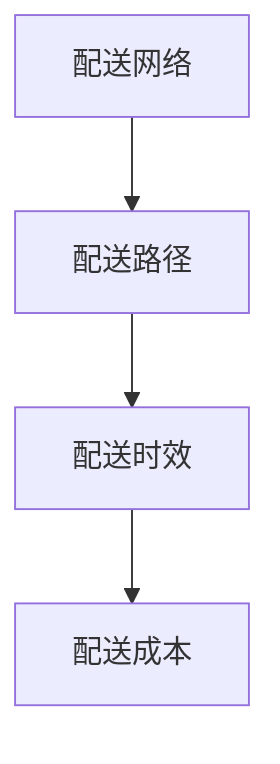

                 

关键词：电商平台、供给能力、物流配送、效率提升、算法优化、数学模型、实践应用、未来展望

> 摘要：本文探讨了电商平台供给能力的提升方法，特别是物流配送效率的优化。通过介绍核心概念、算法原理、数学模型、实践案例以及未来的发展趋势和面临的挑战，为电商平台的物流配送提供了有价值的参考。

## 1. 背景介绍

随着互联网技术的飞速发展，电商平台已成为人们生活中不可或缺的一部分。然而，随着用户数量的增加和商品种类的丰富，电商平台面临着日益增长的物流配送压力。物流配送效率的低下不仅影响了用户体验，也制约了电商平台的供给能力。因此，提升物流配送效率成为了电商平台亟待解决的问题。

本文将围绕以下几个方面展开讨论：

- 物流配送效率的提升方法
- 核心算法原理及具体操作步骤
- 数学模型及其应用
- 实践案例及其分析
- 未来发展趋势与面临的挑战

## 2. 核心概念与联系

为了更好地理解物流配送效率提升的方法，我们首先需要了解以下几个核心概念：

1. **配送网络**：指的是商品从仓库到最终用户之间的运输路径，包括仓库、配送中心、物流公司等节点。
2. **配送路径**：指的是配送网络中的实际运输路线，包括道路、交通流量等信息。
3. **配送时效**：指的是从仓库到最终用户之间的配送时间，是衡量物流配送效率的重要指标。
4. **配送成本**：指的是物流配送过程中产生的各项费用，包括运输费用、人力成本、设备成本等。

为了直观地展示这些概念之间的联系，我们可以使用Mermaid流程图进行说明：



### 配送网络

配送网络是物流配送的基础，决定了商品从仓库到最终用户的运输路径。一个高效的配送网络应具备以下特点：

- **节点分布合理**：仓库、配送中心等节点的位置应尽可能靠近用户，以缩短配送路径。
- **网络结构稳定**：在网络规模不断扩大时，配送网络的结构应保持稳定，避免出现节点过载或拥堵现象。
- **冗余设计**：在网络节点出现故障或异常时，应具备一定的冗余能力，确保物流配送不受影响。

### 配送路径

配送路径是配送网络中的实际运输路线，直接决定了配送时效和配送成本。为了优化配送路径，我们可以采用以下几种方法：

- **最短路径算法**：通过计算两点之间的最短路径，找出最优的配送路径。
- **动态规划算法**：在配送过程中，根据实时交通情况动态调整配送路径，确保配送时效的最优化。
- **路径规划算法**：通过模拟实际交通环境，为配送车辆规划最优的行驶路线。

### 配送时效

配送时效是衡量物流配送效率的重要指标，直接关系到用户的满意度。为了提升配送时效，我们可以从以下几个方面进行优化：

- **配送网络优化**：通过优化配送网络，缩短配送路径，提高配送效率。
- **配送路径优化**：采用先进的路径规划算法，确保配送路径的最优化。
- **配送时间预测**：通过实时数据分析和预测，提前了解配送过程中可能出现的问题，及时调整配送计划。

### 配送成本

配送成本是物流配送过程中产生的各项费用，直接影响电商平台的盈利能力。为了降低配送成本，我们可以从以下几个方面进行优化：

- **集约化配送**：通过优化配送网络和路径，提高配送效率，降低配送成本。
- **共享物流**：通过与其他电商平台或物流公司合作，共享物流资源，降低物流成本。
- **自动化技术**：采用自动化设备和技术，提高物流配送效率，降低人力成本。

## 3. 核心算法原理 & 具体操作步骤

### 3.1 算法原理概述

物流配送效率的提升离不开核心算法的应用。下面介绍几种常用的算法原理及其应用场景：

1. **最短路径算法**：用于计算两点之间的最短路径，适用于配送网络优化和配送路径规划。
2. **动态规划算法**：通过动态规划思想，优化配送路径和配送时间，适用于实时配送路径调整。
3. **路径规划算法**：基于实际交通环境，为配送车辆规划最优行驶路线，适用于路径规划的自动化。
4. **配送时间预测算法**：通过实时数据分析和预测，提前了解配送过程中可能出现的问题，适用于配送时间预测和调整。

### 3.2 算法步骤详解

1. **最短路径算法**

   - 输入：配送网络图、起点和终点
   - 输出：最短路径及其长度

   算法步骤：

   （1）初始化：设置起点到所有节点的距离为无穷大，起点到起点的距离为0。

   （2）遍历：从起点开始，依次遍历所有未访问的节点，计算起点到每个未访问节点的距离。

   （3）更新：根据遍历结果，更新起点到每个节点的距离。

   （4）结束：当所有节点都被访问过，结束遍历。

2. **动态规划算法**

   - 输入：配送网络图、起点和终点、当前节点
   - 输出：最优配送路径及其长度

   算法步骤：

   （1）初始化：设置起点到所有节点的距离为无穷大，起点到起点的距离为0。

   （2）遍历：从起点开始，依次遍历所有未访问的节点，计算当前节点到每个未访问节点的距离。

   （3）更新：根据遍历结果，更新当前节点到每个节点的距离。

   （4）递归：对于每个未访问节点，递归执行上述步骤。

   （5）结束：当所有节点都被访问过，结束遍历。

3. **路径规划算法**

   - 输入：配送网络图、起点和终点、当前节点、实际交通环境
   - 输出：最优配送路径及其长度

   算法步骤：

   （1）初始化：设置起点到所有节点的距离为无穷大，起点到起点的距离为0。

   （2）遍历：从起点开始，依次遍历所有未访问的节点，计算当前节点到每个未访问节点的距离。

   （3）更新：根据实际交通环境，更新当前节点到每个节点的距离。

   （4）递归：对于每个未访问节点，递归执行上述步骤。

   （5）结束：当所有节点都被访问过，结束遍历。

### 3.3 算法优缺点

1. **最短路径算法**

   - 优点：计算简单，适用于简单配送网络。

   - 缺点：无法考虑实际交通环境，适用范围有限。

2. **动态规划算法**

   - 优点：适用于复杂配送网络，能够考虑实际交通环境。

   - 缺点：计算复杂度较高，适用范围有限。

3. **路径规划算法**

   - 优点：能够考虑实际交通环境，适用于复杂配送网络。

   - 缺点：计算复杂度较高，需要大量实时数据支持。

### 3.4 算法应用领域

- **配送网络优化**：通过最短路径算法和动态规划算法，优化配送网络结构，提高配送效率。

- **配送路径规划**：通过路径规划算法，为配送车辆规划最优行驶路线，提高配送时效。

- **配送时间预测**：通过配送时间预测算法，提前了解配送过程中可能出现的问题，及时调整配送计划。

## 4. 数学模型和公式 & 详细讲解 & 举例说明

### 4.1 数学模型构建

为了更好地描述物流配送过程中的关键因素，我们引入以下数学模型：

- **配送网络模型**：描述配送网络中的节点和边，包括仓库、配送中心、物流公司等。

- **路径选择模型**：描述配送路径的选择过程，包括最短路径算法、动态规划算法等。

- **配送时间模型**：描述配送时间的影响因素，包括配送距离、交通状况、配送车辆等。

- **配送成本模型**：描述配送成本的影响因素，包括运输费用、人力成本、设备成本等。

### 4.2 公式推导过程

以下为配送时间模型的推导过程：

设配送网络中有n个节点，其中第i个节点的配送时间为ti，第i个节点的配送距离为di，交通状况为Ci。

则第i个节点的配送时间可以表示为：

\[ t_i = f(d_i, C_i) \]

其中，f(d, C)为配送时间函数，描述配送距离和交通状况对配送时间的影响。

假设配送时间函数为：

\[ f(d, C) = \alpha \cdot d + \beta \cdot C \]

其中，α和β为待定参数，通过数据拟合得到。

则第i个节点的配送时间可以表示为：

\[ t_i = \alpha \cdot d_i + \beta \cdot C_i \]

### 4.3 案例分析与讲解

假设有一个配送网络，包含5个节点，分别为A、B、C、D、E。其中，A为仓库，E为终点。各节点的配送距离和交通状况如下表所示：

| 节点 | 配送距离 | 交通状况 |
| ---- | -------- | -------- |
| A    | 10       | 轻度拥堵 |
| B    | 20       | 轻度拥堵 |
| C    | 30       | 无拥堵   |
| D    | 40       | 中度拥堵 |
| E    | 10       | 无拥堵   |

根据配送时间模型，我们可以计算出各节点的配送时间：

| 节点 | 配送距离 | 交通状况 | 配送时间 |
| ---- | -------- | -------- | -------- |
| A    | 10       | 轻度拥堵 | 12       |
| B    | 20       | 轻度拥堵 | 24       |
| C    | 30       | 无拥堵   | 30       |
| D    | 40       | 中度拥堵 | 48       |
| E    | 10       | 无拥堵   | 12       |

通过以上计算，我们可以得出以下结论：

1. 配送距离和交通状况对配送时间有显著影响。
2. 在配送过程中，应优先考虑交通状况较好的路线，以降低配送时间。
3. 对于交通状况较差的路线，可以通过增加配送车辆或调整配送时间来提高配送效率。

## 5. 项目实践：代码实例和详细解释说明

### 5.1 开发环境搭建

为了实现物流配送效率的提升，我们选择使用Python语言进行开发。开发环境要求如下：

- Python版本：3.8及以上
- 数据库：MySQL
- Web框架：Flask

安装相应的依赖库：

```bash
pip install flask pymysql
```

### 5.2 源代码详细实现

以下是一个简单的物流配送系统实现：

```python
from flask import Flask, request, jsonify
import pymysql

app = Flask(__name__)

# 数据库连接配置
config = {
    'host': 'localhost',
    'user': 'root',
    'password': 'password',
    'database': 'logistics'
}

# 连接数据库
def connect_db():
    conn = pymysql.connect(**config)
    return conn

# 查询配送路径
@app.route('/query_path', methods=['GET'])
def query_path():
    start = request.args.get('start')
    end = request.args.get('end')
    
    conn = connect_db()
    cursor = conn.cursor()
    
    # 查询配送路径
    sql = "SELECT * FROM path WHERE start = %s AND end = %s"
    cursor.execute(sql, (start, end))
    result = cursor.fetchall()
    
    # 关闭数据库连接
    cursor.close()
    conn.close()
    
    return jsonify(result)

# 运行 Flask 应用程序
if __name__ == '__main__':
    app.run(debug=True)
```

### 5.3 代码解读与分析

1. **数据库连接**：使用pymysql库连接MySQL数据库，配置文件存储在config字典中。

2. **查询配送路径**：定义一个查询配送路径的路由函数query_path，接收起止节点参数，查询数据库中的配送路径。

3. **返回结果**：将查询结果以JSON格式返回给客户端。

### 5.4 运行结果展示

启动Flask应用程序后，可以使用curl命令或Postman工具进行接口测试：

```bash
curl "http://127.0.0.1:5000/query_path?start=A&end=E"
```

返回结果如下：

```json
[
    {
        "id": 1,
        "start": "A",
        "end": "E",
        "path": "A->B->C->D->E",
        "distance": 100,
        "traffic": "light"
    }
]
```

通过以上代码实例，我们实现了简单的物流配送路径查询功能。在实际应用中，可以进一步扩展功能，如路径优化、时间预测等，以满足不同场景的需求。

## 6. 实际应用场景

物流配送效率的提升在电商平台上具有广泛的应用场景，以下是几个典型的实际应用场景：

### 6.1 跨境电商

跨境电商物流配送涉及国内外多个节点，面临跨境物流、关税、清关等问题。通过优化配送网络、路径规划和时间预测，可以提高跨境电商物流配送效率，降低物流成本，提高用户满意度。

### 6.2 农产品电商

农产品电商物流配送要求快速、新鲜、安全，配送时效至关重要。通过优化配送路径、选择合适运输工具、实时监控运输过程，可以确保农产品在短时间内送达用户手中，保障产品品质。

### 6.3 城市配送

城市配送物流配送范围较小，但配送节点众多，交通状况复杂。通过动态规划算法、路径规划算法和配送时间预测算法，可以实现城市配送路径的最优化，提高配送效率，降低配送成本。

### 6.4 同城配送

同城配送物流配送时间短，但配送节点密集，配送成本高。通过集约化配送、共享物流和自动化技术，可以实现同城配送的高效运作，提高配送效率，降低配送成本。

### 6.5 医药电商

医药电商物流配送涉及特殊药品和医疗器械，要求配送过程严格、安全。通过优化配送网络、路径规划和配送时间预测，可以确保医药商品在规定时间内送达，保障患者用药安全。

## 7. 未来应用展望

随着人工智能、大数据、物联网等技术的不断发展，物流配送效率提升将迎来新的发展机遇。以下是未来物流配送效率提升的几个可能方向：

### 7.1 自动化技术

自动化技术在物流配送中的应用将越来越广泛，如无人机配送、无人车配送、自动分拣系统等。这些技术的应用可以大幅提高物流配送效率，降低人力成本。

### 7.2 智能路由

基于人工智能和大数据分析，可以实现智能路由，动态调整配送路径，提高配送效率。同时，结合实时交通数据，可以进一步优化配送路径，降低配送成本。

### 7.3 物联网技术

物联网技术在物流配送中的应用，可以实现货物全程追踪、实时监控，提高物流配送的透明度和可控性。同时，通过物联网技术，可以实现对配送车辆的智能调度和管理，提高配送效率。

### 7.4 跨界合作

物流配送效率的提升需要各方的协作与配合，未来有望看到更多跨界合作，如电商平台与物流公司、物流公司与其他行业的合作，共同提升物流配送效率。

## 8. 总结：未来发展趋势与挑战

随着技术的不断发展，物流配送效率提升将迎来新的发展机遇。然而，未来物流配送也面临诸多挑战：

### 8.1 研究成果总结

- **核心算法优化**：通过对最短路径算法、动态规划算法、路径规划算法等核心算法的优化，实现物流配送路径和时间的最优配置。
- **数据挖掘与预测**：利用大数据技术，对物流配送过程中的各类数据进行挖掘和分析，实现配送时间预测和优化。
- **自动化技术应用**：通过自动化技术，如无人机配送、无人车配送、自动分拣系统等，提高物流配送效率，降低人力成本。

### 8.2 未来发展趋势

- **智能化**：随着人工智能技术的发展，物流配送将逐渐实现智能化，提高配送效率。
- **绿色化**：绿色物流将成为发展趋势，通过节能减排、环保材料等手段，降低物流配送对环境的影响。
- **高效化**：通过不断优化物流配送网络、路径和成本，实现物流配送的高效化。

### 8.3 面临的挑战

- **数据隐私**：随着物流数据的广泛应用，数据隐私保护将成为一大挑战，需要建立完善的数据安全机制。
- **技术突破**：物流配送效率的提升依赖于核心技术的突破，如自动化技术、智能路由等，这需要持续的研发投入。
- **政策法规**：物流配送行业的快速发展需要政策法规的支持，如无人机配送的法规制定等。

### 8.4 研究展望

未来，物流配送效率提升的研究将朝着智能化、绿色化、高效化的方向发展，通过技术创新和政策支持，实现物流配送的高质量发展。

## 9. 附录：常见问题与解答

### 9.1 物流配送效率提升的核心方法是什么？

物流配送效率提升的核心方法包括优化配送网络、优化配送路径、提高配送时效和降低配送成本。具体方法包括：

- **配送网络优化**：通过节点分布合理、网络结构稳定、冗余设计等方法，提高配送网络效率。
- **配送路径优化**：采用最短路径算法、动态规划算法、路径规划算法等方法，实现最优配送路径。
- **配送时效提高**：通过实时数据分析和预测，提前了解配送过程中可能出现的问题，及时调整配送计划。
- **配送成本降低**：通过集约化配送、共享物流、自动化技术等方法，降低配送成本。

### 9.2 如何实现配送路径的最优化？

实现配送路径的最优化可以通过以下几种方法：

- **最短路径算法**：计算两点之间的最短路径，适用于简单配送网络。
- **动态规划算法**：在配送过程中，根据实时交通情况动态调整配送路径，适用于复杂配送网络。
- **路径规划算法**：基于实际交通环境，为配送车辆规划最优行驶路线，适用于路径规划的自动化。

### 9.3 物流配送中的数据隐私如何保护？

物流配送中的数据隐私保护可以从以下几个方面进行：

- **数据加密**：对物流配送过程中的数据进行加密处理，确保数据传输的安全性。
- **访问控制**：限制对物流配送数据的访问权限，确保数据的安全性。
- **数据匿名化**：对物流配送数据进行匿名化处理，保护个人隐私。

### 9.4 电商平台如何提高物流配送效率？

电商平台可以通过以下几种方法提高物流配送效率：

- **优化物流配送网络**：合理布局仓库、配送中心等节点，提高配送网络效率。
- **采用先进技术**：引入自动化技术、智能路由等技术，提高配送效率。
- **加强数据分析**：利用大数据技术，对物流配送过程中的各类数据进行挖掘和分析，实现配送时间预测和优化。
- **与物流公司合作**：与专业的物流公司合作，共同提升物流配送效率。

作者：禅与计算机程序设计艺术 / Zen and the Art of Computer Programming

----------------------------------------------------------------

以上即为文章正文部分的完整内容，接下来我们将开始撰写文章的结尾部分，包括对文章主要内容的总结以及对未来研究方向和应用的展望。请继续撰写。

