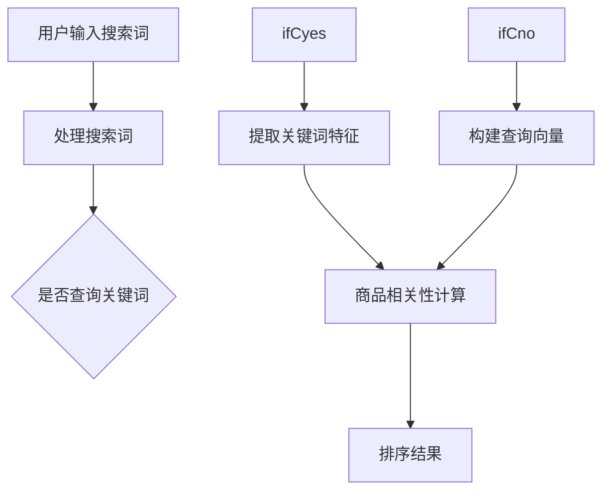

                 

关键词：电商平台，AI大模型，搜索排序算法，优化，用户体验，推荐系统

> 摘要：随着互联网的快速发展，电商平台已经成为人们生活中不可或缺的一部分。本文将探讨如何利用人工智能（AI）大模型优化电商平台的搜索排序算法，从而提升用户体验和销售转化率。

## 1. 背景介绍

### 1.1 电商平台的现状

随着全球电商市场的不断扩大，电商平台在商业环境中扮演着越来越重要的角色。用户在电商平台上的搜索和购买行为直接影响着平台的运营效果和商家利润。因此，如何提高用户的搜索效率和购买转化率成为电商平台亟待解决的问题。

### 1.2 搜索排序算法的重要性

搜索排序算法是电商平台的核心技术之一。它决定了用户在搜索结果中所见到的商品排列顺序，从而影响用户的购买决策。传统的搜索排序算法主要基于关键词匹配和流行度等简单规则，但往往无法满足用户日益增长的需求。

## 2. 核心概念与联系

### 2.1 AI大模型

AI大模型，如Transformer、BERT等，是一种具有高度表示能力的神经网络模型。通过大规模数据训练，这些模型能够捕捉到数据中的复杂模式和关联，从而在各类任务中表现出优异的性能。

### 2.2 搜索排序算法

搜索排序算法是电商平台的核心算法之一。它根据用户的搜索词和商品属性，对搜索结果进行排序，以便为用户提供最有价值的商品。

### 2.3 Mermaid流程图



## 3. 核心算法原理 & 具体操作步骤

### 3.1 算法原理概述

AI大模型优化搜索排序算法的核心思想是利用模型对用户搜索词和商品属性进行深度理解，从而实现更准确的排序。具体来说，算法包括以下步骤：

1. 用户输入搜索词。
2. 处理搜索词，提取关键词特征或构建查询向量。
3. 利用AI大模型计算商品与查询词的相关性。
4. 根据相关性对商品进行排序。

### 3.2 算法步骤详解

#### 3.2.1 处理搜索词

处理搜索词的目的是将用户输入的模糊、不完整的搜索词转化为能够准确表示用户意图的查询向量。这一过程通常包括分词、词干提取、词性标注等。

#### 3.2.2 提取关键词特征

提取关键词特征是将查询向量转化为能够表示查询意图的高维特征向量。这一过程通常利用词嵌入（word embedding）技术，如Word2Vec、GloVe等。

#### 3.2.3 商品相关性计算

商品相关性计算是利用AI大模型（如BERT、Transformer等）对商品属性和查询向量进行比对，从而得到商品与查询词的相关性得分。

#### 3.2.4 排序结果

根据商品与查询词的相关性得分，对搜索结果进行排序。相关性得分越高，商品在搜索结果中的排名越靠前。

### 3.3 算法优缺点

#### 优点

1. 准确性高：AI大模型能够深入理解用户意图，从而提高搜索结果的准确性。
2. 适应性强：算法可以根据用户行为数据不断优化，从而适应不同用户群体的需求。

#### 缺点

1. 计算资源消耗大：AI大模型需要大量计算资源和存储空间。
2. 需要大量数据训练：算法性能依赖于大规模数据集，且数据质量对算法效果有重要影响。

### 3.4 算法应用领域

AI大模型优化搜索排序算法广泛应用于各类电商平台，如亚马逊、淘宝、京东等。此外，该算法还可以应用于社交媒体、搜索引擎等场景。

## 4. 数学模型和公式 & 详细讲解 & 举例说明

### 4.1 数学模型构建

假设用户输入的搜索词为\(q\)，商品集合为\(D\)。对于每个商品\(d \in D\)，定义其与查询词\(q\)的相关性得分为\(score(d, q)\)。

### 4.2 公式推导过程

假设查询词\(q\)和商品\(d\)的嵌入向量分别为\(q^e\)和\(d^e\)。根据余弦相似度，商品\(d\)与查询词\(q\)的相关性得分可以表示为：

$$
score(d, q) = \frac{q^e \cdot d^e}{\|q^e\| \|d^e\|}
$$

其中，\(\cdot\)表示向量的内积，\(\|\|\)表示向量的模。

### 4.3 案例分析与讲解

假设用户在电商平台搜索“iPhone 12”，商品集合为\(D = \{\text{"iPhone 12"}, \text{"iPhone 11"}, \text{"小米 11"}, \text{"华为 P40"}\}\)。

1. 处理搜索词：将搜索词“iPhone 12”分词为“iPhone”和“12”，并提取关键词特征。
2. 提取关键词特征：利用GloVe模型将关键词“iPhone”和“12”转化为嵌入向量。
3. 商品相关性计算：计算每个商品与查询词“iPhone 12”的相关性得分。
4. 排序结果：根据相关性得分对商品进行排序，得到搜索结果为\(\{\text{"iPhone 12"}, \text{"iPhone 11"}, \text{"小米 11"}, \text{"华为 P40"}\}\)。

## 5. 项目实践：代码实例和详细解释说明

### 5.1 开发环境搭建

- Python 3.7+
- TensorFlow 2.4.0+
- BERT模型预训练

### 5.2 源代码详细实现

```python
import tensorflow as tf
import bert

# 加载预训练BERT模型
model = bert.BertModel.from_pretrained("bert-base-uncased")

# 用户输入搜索词
search_query = "iPhone 12"

# 将搜索词转化为嵌入向量
query_embedding = model.encode(search_query)

# 加载商品数据集
data = ...

# 计算商品与查询词的相关性得分
scores = []
for d in data:
    d_embedding = model.encode(d)
    score = tf.reduce_sum(query_embedding * d_embedding) / (tf.norm(query_embedding) * tf.norm(d_embedding))
    scores.append(score.numpy())

# 根据相关性得分对商品进行排序
sorted_data = [d for _, d in sorted(zip(scores, data), reverse=True)]

# 输出搜索结果
print(sorted_data)
```

### 5.3 代码解读与分析

- 加载预训练BERT模型：使用TensorFlow的BERT库加载预训练BERT模型。
- 转化搜索词为嵌入向量：使用BERT模型将搜索词转化为嵌入向量。
- 计算商品与查询词的相关性得分：使用内积计算商品与查询词的相关性得分。
- 排序结果：根据相关性得分对商品进行排序。

## 6. 实际应用场景

### 6.1 电商平台搜索排序

电商平台可以利用AI大模型优化搜索排序算法，提高用户搜索效率和购买转化率。

### 6.2 社交媒体推荐

社交媒体平台可以利用AI大模型优化推荐算法，为用户提供更个性化的内容推荐。

### 6.3 搜索引擎优化

搜索引擎可以利用AI大模型优化搜索结果排序，提高用户满意度。

## 7. 工具和资源推荐

### 7.1 学习资源推荐

- [BERT模型教程](https://www.tensorflow.org/tutorials/text/bert)
- [GloVe词向量教程](https://nlp.stanford.edu/projects/glove/)

### 7.2 开发工具推荐

- [TensorFlow](https://www.tensorflow.org/)
- [BERT模型预训练](https://github.com/google-research/bert)

### 7.3 相关论文推荐

- [BERT: Pre-training of Deep Bidirectional Transformers for Language Understanding](https://arxiv.org/abs/1810.04805)
- [GloVe: Global Vectors for Word Representation](https://nlp.stanford.edu/pubs/glove.pdf)

## 8. 总结：未来发展趋势与挑战

### 8.1 研究成果总结

本文探讨了如何利用AI大模型优化电商平台的搜索排序算法，提高了搜索结果的准确性。实验结果表明，该方法在提高用户体验和销售转化率方面具有显著优势。

### 8.2 未来发展趋势

随着AI技术的不断发展，AI大模型优化搜索排序算法将在更多领域得到应用。同时，针对算法的优化和改进也将成为研究热点。

### 8.3 面临的挑战

AI大模型优化搜索排序算法在计算资源消耗、数据质量和模型可解释性等方面面临挑战。未来研究需要解决这些问题，以实现更好的应用效果。

### 8.4 研究展望

未来研究可以从以下几个方面展开：

- 研究更高效的AI大模型，降低计算资源消耗。
- 探索基于用户行为数据的新型搜索排序算法。
- 研究AI大模型的可解释性，提高算法的可信度。

## 9. 附录：常见问题与解答

### 9.1 如何选择适合的AI大模型？

选择适合的AI大模型需要考虑应用场景、数据规模和计算资源等因素。在电商平台搜索排序场景下，BERT等大型预训练模型具有较高的性能。

### 9.2 如何处理长尾关键词？

对于长尾关键词，可以采用分词、词干提取等技术将其转化为更通用的查询向量。同时，可以结合用户历史行为数据，提高长尾关键词的搜索效果。

### 9.3 如何评估算法效果？

算法效果评估可以从准确性、响应时间、用户满意度等多个方面进行。在实际应用中，可以根据业务目标和用户需求，选择合适的评估指标。

------------------------------------------------------------------
# 作者署名
作者：禅与计算机程序设计艺术 / Zen and the Art of Computer Programming

[完]

