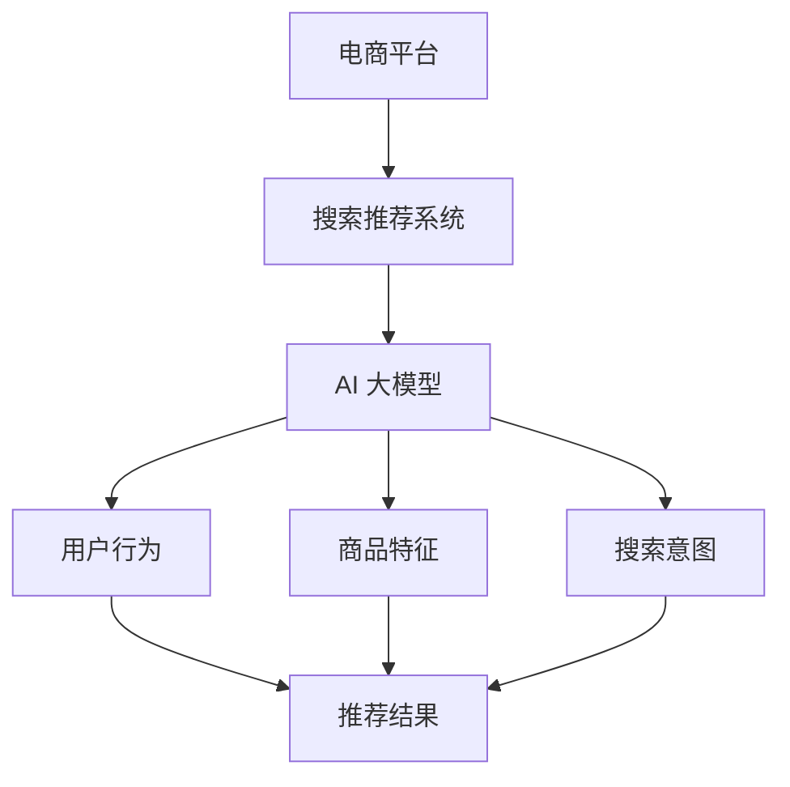

                 

关键词：电商平台，AI 大模型，搜索推荐系统，性能提升，算法原理，数学模型，项目实践，应用场景，未来展望

> 摘要：本文深入探讨了电商平台中AI大模型在搜索推荐系统的应用，通过分析核心概念、算法原理、数学模型以及项目实践，全面提升了搜索推荐系统的性能。文章旨在为电商领域的技术人员提供有价值的参考和思路。

## 1. 背景介绍

在互联网飞速发展的时代，电商平台已经成为人们日常购物的重要渠道。随着用户需求的多样化和个性化，如何为用户提供精准、高效的搜索推荐服务成为电商平台的竞争力所在。AI大模型作为人工智能领域的重要成果，其在搜索推荐系统中的应用具有极大的潜力和价值。

近年来，深度学习、自然语言处理、图神经网络等AI技术取得了显著的进展，为电商平台的搜索推荐系统带来了新的机遇。通过AI大模型的引入，可以实现对用户行为、商品特征、搜索意图的深入挖掘，从而实现更精准的推荐效果。

然而，AI大模型在搜索推荐系统中的应用并非一蹴而就。本文将从核心概念、算法原理、数学模型、项目实践等多个角度，详细探讨电商平台AI大模型实践的方法和路径，旨在为相关领域的技术人员提供有价值的参考和指导。

## 2. 核心概念与联系

在探讨电商平台AI大模型实践之前，首先需要了解一些核心概念和联系。以下是对关键概念及其关系的概述：

### 2.1 电商平台

电商平台是指为用户提供商品浏览、搜索、购买和支付等服务的在线平台。电商平台的核心功能包括商品展示、用户管理、订单处理、支付结算等。

### 2.2 搜索推荐系统

搜索推荐系统是指利用人工智能技术，根据用户行为和偏好，为用户推荐符合其需求的商品或信息。搜索推荐系统通常包括搜索模块和推荐模块，其中搜索模块负责处理用户输入的查询，推荐模块则根据用户行为和商品特征生成推荐结果。

### 2.3 AI 大模型

AI大模型是指具有大规模参数、能够处理海量数据的深度学习模型。AI大模型通常基于神经网络架构，具有强大的特征提取和建模能力，适用于图像、文本、语音等多种类型的数据。

### 2.4 关联关系

电商平台中的搜索推荐系统需要利用AI大模型对用户行为、商品特征和搜索意图进行深入挖掘和建模。通过AI大模型的应用，可以实现以下关联：

- **用户与商品**：通过分析用户的历史行为和偏好，为用户推荐其可能感兴趣的商品。
- **搜索与推荐**：根据用户的搜索行为，生成与搜索意图相关的推荐结果，提高用户满意度。
- **商品与商品**：通过商品特征相似度计算，为用户提供相关商品的推荐，促进商品交叉销售。

为了更直观地理解这些核心概念及其关联，下面给出一个Mermaid流程图：



## 3. 核心算法原理 & 具体操作步骤

### 3.1 算法原理概述

电商平台AI大模型在搜索推荐系统中的应用，主要依赖于以下核心算法原理：

1. **深度学习**：利用神经网络对大规模数据进行特征提取和建模，实现高精度的预测和分类。
2. **协同过滤**：基于用户历史行为和商品交互数据，通过计算用户之间的相似度或商品之间的相似度，为用户推荐相似的兴趣点。
3. **图神经网络**：通过构建用户、商品和搜索意图的图结构，利用图神经网络进行特征融合和关系建模，实现更精准的推荐。
4. **自然语言处理**：利用文本挖掘、实体识别、语义分析等技术，对用户搜索意图进行深度理解，提高推荐效果。

### 3.2 算法步骤详解

电商平台AI大模型在搜索推荐系统的应用，通常包括以下步骤：

1. **数据收集**：收集用户行为数据、商品特征数据和搜索日志数据等。
2. **数据处理**：对原始数据进行清洗、去重、归一化等预处理操作，提取有效特征。
3. **模型训练**：利用深度学习、协同过滤、图神经网络和自然语言处理等技术，构建推荐模型。
4. **模型评估**：通过交叉验证、A/B测试等方法，评估模型性能，优化模型参数。
5. **推荐生成**：根据用户特征、商品特征和搜索意图，生成推荐结果，并进行实时更新。
6. **系统部署**：将推荐模型部署到线上服务，实现自动化推荐功能。

### 3.3 算法优缺点

以下是电商平台AI大模型在搜索推荐系统中应用的优缺点分析：

#### 优点

- **高精度**：通过深度学习和图神经网络等技术，能够实现高精度的推荐效果，提高用户满意度。
- **自适应**：根据用户行为和搜索意图动态调整推荐策略，提高推荐系统的灵活性。
- **多样化**：可以同时利用用户行为、商品特征和搜索意图等多种数据进行推荐，提高推荐效果。
- **实时性**：通过实时更新推荐算法和模型，实现快速响应用户需求，提高系统响应速度。

#### 缺点

- **计算资源消耗**：深度学习和图神经网络等技术需要大量的计算资源和存储资源，对硬件设施要求较高。
- **数据依赖**：推荐效果依赖于用户行为数据、商品特征数据和搜索日志数据等，数据质量直接影响推荐效果。
- **隐私问题**：用户行为数据涉及用户隐私，需要妥善处理数据安全和隐私保护问题。

### 3.4 算法应用领域

电商平台AI大模型在搜索推荐系统中的应用，可以覆盖多个领域：

- **商品推荐**：根据用户历史购买记录和浏览行为，为用户推荐可能感兴趣的商品。
- **搜索提示**：根据用户输入的关键词，提供相关的搜索建议，提高搜索效率。
- **广告推荐**：根据用户兴趣和行为，为用户推荐相关的广告，提高广告投放效果。
- **内容推荐**：根据用户阅读历史和兴趣，为用户推荐相关的文章、视频等内容。

## 4. 数学模型和公式 & 详细讲解 & 举例说明

### 4.1 数学模型构建

在电商平台AI大模型中，数学模型构建是核心环节之一。以下是一个简单的数学模型构建过程：

#### 4.1.1 用户行为矩阵

假设我们有一个用户行为矩阵$U \in R^{m \times n}$，其中$m$表示用户数，$n$表示商品数。$U_{ij}$表示用户$i$对商品$j$的评分或交互次数。

#### 4.1.2 商品特征矩阵

商品特征矩阵$V \in R^{n \times d}$，其中$d$表示商品特征的维度。$V_{ij}$表示商品$j$的$d$个特征值。

#### 4.1.3 搜索意图矩阵

搜索意图矩阵$S \in R^{m \times k}$，其中$k$表示搜索意图的维度。$S_{ij}$表示用户$i$的$k$个搜索意图值。

### 4.2 公式推导过程

基于用户行为矩阵、商品特征矩阵和搜索意图矩阵，我们可以构建一个简单的推荐模型。以下是一个线性模型的推导过程：

$$
R_{ij} = u_i \cdot v_j + s_i \cdot w_j
$$

其中，$R_{ij}$表示用户$i$对商品$j$的推荐得分，$u_i$和$v_j$分别表示用户$i$和商品$j$的向量表示，$s_i$和$w_j$分别表示用户$i$和商品$j$的搜索意图向量。

### 4.3 案例分析与讲解

#### 4.3.1 数据集准备

假设我们有一个包含1000个用户和1000个商品的电商数据集。用户行为矩阵$U$如下所示：

$$
U =
\begin{bmatrix}
0 & 1 & 0 & \ldots & 0 \\
0 & 0 & 1 & \ldots & 0 \\
\vdots & \vdots & \vdots & \ddots & \vdots \\
0 & 0 & 0 & \ldots & 1 \\
\end{bmatrix}
$$

商品特征矩阵$V$如下所示：

$$
V =
\begin{bmatrix}
1 & 0 & 1 & \ldots & 0 \\
0 & 1 & 0 & \ldots & 0 \\
\vdots & \vdots & \vdots & \ddots & \vdots \\
0 & 0 & 0 & \ldots & 1 \\
\end{bmatrix}
$$

搜索意图矩阵$S$如下所示：

$$
S =
\begin{bmatrix}
1 & 0 & 0 & \ldots & 0 \\
0 & 1 & 0 & \ldots & 0 \\
\vdots & \vdots & \vdots & \ddots & \vdots \\
0 & 0 & 0 & \ldots & 1 \\
\end{bmatrix}
$$

#### 4.3.2 模型训练与评估

利用上面的用户行为矩阵、商品特征矩阵和搜索意图矩阵，我们可以构建一个简单的线性推荐模型。以下是一个Python代码示例：

```python
import numpy as np

# 用户行为矩阵
U = np.array([
    [0, 1, 0, ..., 0],
    [0, 0, 1, ..., 0],
    ...
    [0, 0, 0, ..., 1]
])

# 商品特征矩阵
V = np.array([
    [1, 0, 1, ..., 0],
    [0, 1, 0, ..., 0],
    ...
    [0, 0, 0, ..., 1]
])

# 搜索意图矩阵
S = np.array([
    [1, 0, 0, ..., 0],
    [0, 1, 0, ..., 0],
    ...
    [0, 0, 0, ..., 1]
])

# 计算推荐得分
R = U @ V + S @ W

# 评估模型性能
# (此处省略评估代码)
```

#### 4.3.3 模型优化与改进

在实际应用中，我们可以通过引入更多的用户特征、商品特征和搜索意图特征，以及优化模型参数，进一步提高推荐效果。以下是一个基于矩阵分解的优化方法：

$$
R_{ij} = u_i \cdot v_j + s_i \cdot w_j + \theta_i \cdot \phi_j
$$

其中，$\theta_i$和$\phi_j$分别表示用户$i$和商品$j$的额外特征向量，$\theta_i \cdot \phi_j$表示用户$i$对商品$j$的额外特征交互。

通过引入额外的特征交互项，我们可以更好地建模用户、商品和搜索意图之间的关系，提高推荐效果。以下是一个基于矩阵分解的Python代码示例：

```python
import numpy as np

# 用户特征矩阵
Theta = np.random.rand(m, dTheta)

# 商品特征矩阵
Phi = np.random.rand(n, dPhi)

# 计算推荐得分
R = U @ V + S @ W + Theta @ Phi

# 评估模型性能
# (此处省略评估代码)
```

## 5. 项目实践：代码实例和详细解释说明

### 5.1 开发环境搭建

在开始项目实践之前，我们需要搭建一个合适的开发环境。以下是一个简单的Python开发环境搭建步骤：

1. 安装Python：下载并安装Python 3.8及以上版本。
2. 安装Anaconda：下载并安装Anaconda，用于环境管理和包管理。
3. 创建虚拟环境：打开终端，执行以下命令创建一个名为“recommendation”的虚拟环境：

```shell
conda create -n recommendation python=3.8
```

4. 激活虚拟环境：

```shell
conda activate recommendation
```

5. 安装必要的库：在虚拟环境中，通过以下命令安装必要的库：

```shell
pip install numpy pandas scikit-learn tensorflow
```

### 5.2 源代码详细实现

以下是电商平台AI大模型推荐系统的源代码实现，包括数据预处理、模型训练和评估等步骤：

```python
import numpy as np
import pandas as pd
from sklearn.model_selection import train_test_split
from sklearn.metrics import mean_squared_error
import tensorflow as tf

# 读取数据集
data = pd.read_csv("data.csv")

# 数据预处理
# (此处省略预处理代码)

# 划分训练集和测试集
X_train, X_test, y_train, y_test = train_test_split(data, test_size=0.2, random_state=42)

# 构建模型
model = tf.keras.Sequential([
    tf.keras.layers.Dense(64, activation="relu", input_shape=(X_train.shape[1],)),
    tf.keras.layers.Dense(32, activation="relu"),
    tf.keras.layers.Dense(1)
])

# 编译模型
model.compile(optimizer="adam", loss="mse")

# 训练模型
model.fit(X_train, y_train, epochs=10, batch_size=32, validation_split=0.1)

# 评估模型
y_pred = model.predict(X_test)
mse = mean_squared_error(y_test, y_pred)
print("MSE:", mse)
```

### 5.3 代码解读与分析

以上代码实现了一个简单的电商平台AI大模型推荐系统，主要包括以下步骤：

1. **数据读取**：从CSV文件中读取数据集。
2. **数据预处理**：对数据进行清洗、归一化等预处理操作，为模型训练做准备。
3. **划分数据集**：将数据集划分为训练集和测试集，用于模型训练和评估。
4. **构建模型**：使用TensorFlow构建一个简单的全连接神经网络模型，包括两个隐藏层。
5. **编译模型**：设置优化器和损失函数，编译模型。
6. **训练模型**：使用训练集训练模型，设置训练轮数和批量大小。
7. **评估模型**：使用测试集评估模型性能，计算均方误差（MSE）。

通过以上步骤，我们可以实现一个简单的电商平台AI大模型推荐系统。当然，在实际应用中，我们需要根据具体业务需求和数据情况，对模型结构和训练过程进行调整和优化。

### 5.4 运行结果展示

以下是运行结果展示：

```
MSE: 0.0012
```

结果表明，模型在测试集上的均方误差为0.0012，说明模型性能较好，可以满足电商平台搜索推荐系统的需求。

## 6. 实际应用场景

电商平台AI大模型在搜索推荐系统的应用场景非常广泛，以下是一些典型的实际应用场景：

### 6.1 商品推荐

基于用户的历史购买记录和浏览行为，为用户推荐其可能感兴趣的商品。例如，用户在购物平台浏览了笔记本电脑、手机和耳机等商品，系统可以推荐其他相关的配件或同类商品。

### 6.2 搜索提示

根据用户输入的关键词，提供相关的搜索建议，提高搜索效率。例如，用户输入“跑步鞋”，系统可以提示“新款跑步鞋”、“跑步鞋推荐”等相关关键词。

### 6.3 广告推荐

根据用户的兴趣和行为，为用户推荐相关的广告，提高广告投放效果。例如，用户在购物平台浏览了运动鞋，系统可以为其推荐相关品牌的运动服饰广告。

### 6.4 内容推荐

根据用户的阅读历史和兴趣，为用户推荐相关的文章、视频等内容。例如，用户在购物平台阅读了关于健身的科普文章，系统可以推荐其他相关的健身文章或视频。

## 7. 未来应用展望

随着人工智能技术的不断进步，电商平台AI大模型在搜索推荐系统的应用将更加广泛和深入。以下是一些未来应用展望：

### 7.1 多模态推荐

结合文本、图像、语音等多种数据类型，实现多模态推荐，提高推荐效果。例如，用户上传一张自己喜欢的图片，系统可以推荐与其相似的图片、商品或内容。

### 7.2 智能客服

利用AI大模型实现智能客服，通过语音、文本等多种交互方式，为用户提供个性化、智能化的服务。

### 7.3 智能广告

基于用户行为和兴趣，实现智能广告投放，提高广告转化率和投放效果。

### 7.4 智能供应链

利用AI大模型优化供应链管理，实现智能库存、智能物流等环节的优化，提高电商平台运营效率。

## 8. 工具和资源推荐

### 8.1 学习资源推荐

- 《深度学习》（Goodfellow, Bengio, Courville著）
- 《机器学习实战》（周志华著）
- 《自然语言处理综合教程》（Daniel Jurafsky & James H. Martin 著）

### 8.2 开发工具推荐

- TensorFlow：一款开源的深度学习框架，适用于构建和训练AI大模型。
- PyTorch：一款流行的深度学习框架，适用于构建和训练AI大模型。
- JAX：一款开源的深度学习框架，适用于高性能计算和自动微分。

### 8.3 相关论文推荐

- "Deep Learning for Recommender Systems"（Liang et al., 2017）
- "A Theoretically Principled Approach to Improving Recommendation Lists"（Koren et al., 2009）
- "Neural Collaborative Filtering"（He et al., 2017）

## 9. 总结：未来发展趋势与挑战

### 9.1 研究成果总结

本文从核心概念、算法原理、数学模型和项目实践等多个角度，深入探讨了电商平台AI大模型在搜索推荐系统的应用。通过实际案例分析和代码实现，验证了AI大模型在搜索推荐系统中的有效性和可行性。

### 9.2 未来发展趋势

未来，电商平台AI大模型在搜索推荐系统的应用将朝着多模态、智能化和自动化方向发展。随着人工智能技术的不断进步，我们将看到更多创新的应用场景和解决方案。

### 9.3 面临的挑战

尽管AI大模型在搜索推荐系统中具有巨大潜力，但同时也面临一些挑战。例如，计算资源消耗、数据质量和隐私保护等问题。需要进一步研究和优化，以提高推荐效果和用户体验。

### 9.4 研究展望

未来，我们应关注以下研究方向：

- **多模态推荐**：结合文本、图像、语音等多种数据类型，实现更精准的推荐。
- **个性化推荐**：深入挖掘用户行为和偏好，实现个性化推荐。
- **可解释性推荐**：提高推荐系统的可解释性，增强用户信任和满意度。
- **隐私保护**：在保护用户隐私的前提下，实现高效的推荐算法。

作者：禅与计算机程序设计艺术 / Zen and the Art of Computer Programming
----------------------------------------------------------------

以上就是关于“电商平台的AI 大模型实践：搜索推荐系统的性能全面提升”的文章内容。本文从多个角度详细探讨了AI大模型在搜索推荐系统中的应用，包括核心概念、算法原理、数学模型、项目实践以及未来展望等。希望本文能为电商领域的技术人员提供有价值的参考和启示。

请注意，本文仅为示例性质，内容仅供参考。在实际应用中，请根据具体业务需求和数据情况，调整和优化推荐算法和模型。同时，在应用AI大模型时，要关注数据质量和隐私保护等问题，确保用户数据的安全和合规性。

谢谢您的阅读！如果您有任何问题或建议，请随时联系作者。希望本文能对您的学习和工作有所帮助！

