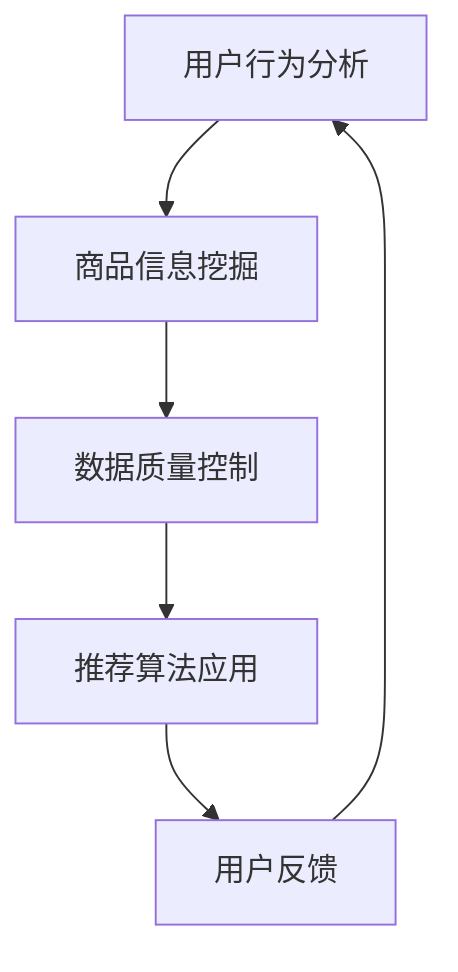

                 

关键词：电商平台，AI 大模型，搜索推荐系统，数据质量控制

> 摘要：随着人工智能技术的不断发展，电商平台正在经历一次重大转型。本文将探讨 AI 大模型在电商平台中的应用，特别是搜索推荐系统的关键作用以及数据质量控制的重要性。通过深入分析，本文旨在为电商平台提供有效的 AI 大模型转型策略，并探讨未来发展趋势与面临的挑战。

## 1. 背景介绍

电商平台作为数字经济的重要组成部分，正面临着激烈的竞争。传统的电商平台主要通过价格竞争和广告投放来吸引用户，但这种模式已经难以满足用户日益多样化的需求。为了提高用户体验和竞争力，电商平台开始积极引入人工智能技术，特别是 AI 大模型，以实现个性化推荐、智能搜索和智能客服等功能。

AI 大模型是指使用大量数据训练的复杂神经网络模型，具有强大的数据分析和预测能力。通过将 AI 大模型应用于电商平台，可以实现以下目标：

1. **个性化推荐**：根据用户的购买历史、浏览记录和偏好，为用户推荐最相关、最感兴趣的商品和服务。
2. **智能搜索**：通过自然语言处理技术，快速准确地理解用户的搜索意图，并提供最符合需求的商品和服务。
3. **智能客服**：利用聊天机器人和语音识别技术，提供24/7的智能客服服务，提高用户满意度和转化率。

然而，AI 大模型的实现不仅仅是一个技术问题，它还涉及到数据质量控制、算法优化、系统性能等多个方面。本文将重点关注数据质量控制在 AI 大模型转型中的关键作用，并提供一些实用的策略和建议。

## 2. 核心概念与联系

### 2.1. 搜索推荐系统的基本原理

搜索推荐系统是电商平台的核心组成部分，它主要包括以下三个方面：

1. **用户行为分析**：通过收集和分析用户的浏览、搜索、购买等行为数据，了解用户的兴趣和需求。
2. **商品信息挖掘**：对商品库进行深入分析，提取商品的特征和属性，以便进行推荐。
3. **推荐算法应用**：根据用户行为和商品信息，使用算法模型生成个性化的推荐结果。

### 2.2. 数据质量控制的关键因素

数据质量控制是 AI 大模型成功的关键因素之一，它主要包括以下几个方面：

1. **数据完整性**：确保所有必要的数据都被收集和存储，没有缺失或错误。
2. **数据准确性**：确保数据真实、可靠，没有虚假或误导性的信息。
3. **数据一致性**：确保数据在不同时间、不同系统之间的统一和一致。
4. **数据多样性**：确保数据来源广泛，涵盖不同用户、不同商品和不同场景。

### 2.3. 搜索推荐系统与数据质量控制的关系

搜索推荐系统的效果直接依赖于数据质量，高质量的数据可以提升推荐算法的准确性和可靠性，从而提高用户体验和转化率。同时，数据质量控制也为搜索推荐系统提供了坚实的基础，确保系统在不同环境和条件下都能稳定运行。

下面是一个简单的 Mermaid 流程图，展示了搜索推荐系统与数据质量控制的关系：



## 3. 核心算法原理 & 具体操作步骤

### 3.1. 算法原理概述

搜索推荐系统的核心算法包括协同过滤、基于内容的推荐和混合推荐等。每种算法都有其独特的原理和优势。

1. **协同过滤**：通过分析用户之间的相似性，为用户推荐其他相似用户喜欢的商品。
2. **基于内容的推荐**：通过分析商品的属性和特征，为用户推荐与其已购买或浏览过的商品相似的其它商品。
3. **混合推荐**：将协同过滤和基于内容的推荐相结合，以提高推荐的准确性和多样性。

### 3.2. 算法步骤详解

1. **用户行为数据收集**：收集用户的浏览、搜索、购买等行为数据。
2. **商品信息提取**：提取商品的关键属性和特征，如价格、品牌、类别等。
3. **用户行为建模**：使用机器学习算法，如矩阵分解、K-均值聚类等，建立用户行为模型。
4. **推荐结果生成**：根据用户行为模型和商品信息，生成个性化的推荐结果。
5. **用户反馈收集**：收集用户对推荐结果的反馈，用于优化推荐算法。

### 3.3. 算法优缺点

- **协同过滤**：优点是准确度高，但缺点是容易冷启动和推荐多样性不足。
- **基于内容的推荐**：优点是推荐多样性好，但缺点是准确度相对较低。
- **混合推荐**：优点是结合了协同过滤和基于内容的推荐的优势，但缺点是算法复杂度高。

### 3.4. 算法应用领域

搜索推荐系统广泛应用于电商、新闻、音乐、视频等多个领域，为用户提供个性化的推荐服务。

## 4. 数学模型和公式 & 详细讲解 & 举例说明

### 4.1. 数学模型构建

搜索推荐系统中的数学模型主要包括用户行为矩阵、商品特征矩阵和推荐模型。以下是这些模型的构建方法：

1. **用户行为矩阵**：
   $$U = \begin{bmatrix}
   u_{11} & u_{12} & \dots & u_{1n} \\
   u_{21} & u_{22} & \dots & u_{2n} \\
   \vdots & \vdots & \ddots & \vdots \\
   u_{m1} & u_{m2} & \dots & u_{mn}
   \end{bmatrix}$$
   其中，$u_{ij}$ 表示用户 $i$ 对商品 $j$ 的行为评分或点击次数。

2. **商品特征矩阵**：
   $$V = \begin{bmatrix}
   v_{11} & v_{12} & \dots & v_{1n} \\
   v_{21} & v_{22} & \dots & v_{2n} \\
   \vdots & \vdots & \ddots & \vdots \\
   v_{m1} & v_{m2} & \dots & v_{mn}
   \end{bmatrix}$$
   其中，$v_{ij}$ 表示商品 $i$ 的特征值，如类别、品牌、价格等。

3. **推荐模型**：
   $$R = UV^T$$
   其中，$R$ 表示推荐结果矩阵，$U$ 和 $V$ 分别为用户行为矩阵和商品特征矩阵。

### 4.2. 公式推导过程

推荐模型的推导基于矩阵乘法和线性代数的知识。首先，用户行为矩阵 $U$ 和商品特征矩阵 $V$ 的乘积为：
$$UV^T = \begin{bmatrix}
   u_{11}v_{11} & u_{11}v_{12} & \dots & u_{11}v_{1n} \\
   u_{21}v_{11} & u_{21}v_{12} & \dots & u_{21}v_{1n} \\
   \vdots & \vdots & \ddots & \vdots \\
   u_{m1}v_{11} & u_{m1}v_{12} & \dots & u_{m1}v_{1n}
\end{bmatrix}$$
该矩阵的每一行表示用户对各个商品的特征值的加权综合评分。通过调整权重，可以优化推荐结果。

### 4.3. 案例分析与讲解

假设有 100 个用户和 1000 个商品，用户行为矩阵和商品特征矩阵如下：

用户行为矩阵（部分）：
$$U = \begin{bmatrix}
1 & 0 & 1 & 0 \\
0 & 1 & 1 & 0 \\
1 & 1 & 0 & 1 \\
0 & 0 & 1 & 1 \\
\end{bmatrix}$$

商品特征矩阵（部分）：
$$V = \begin{bmatrix}
0 & 1 & 1 & 0 \\
1 & 0 & 1 & 1 \\
1 & 1 & 0 & 1 \\
0 & 1 & 0 & 0 \\
\end{bmatrix}$$

推荐模型（部分）：
$$R = UV^T = \begin{bmatrix}
1 & 1 & 1 & 0 \\
1 & 2 & 2 & 1 \\
1 & 2 & 2 & 1 \\
0 & 1 & 1 & 0 \\
\end{bmatrix}$$

根据推荐模型，用户 1 可能对商品 1、2、3 感兴趣，而用户 2、3、4 可能对商品 2、3、4 感兴趣。

## 5. 项目实践：代码实例和详细解释说明

### 5.1. 开发环境搭建

为了实现搜索推荐系统，我们需要搭建一个开发环境。以下是搭建过程的简要步骤：

1. **安装 Python**：确保已安装 Python 3.8 以上版本。
2. **安装依赖库**：使用 pip 安装以下依赖库：numpy、pandas、scikit-learn、mermaid。
3. **配置 Mermaid**：在项目中添加 .mermaidれている file，用于生成 Mermaid 流程图。

### 5.2. 源代码详细实现

以下是实现搜索推荐系统的 Python 代码示例：

```python
import numpy as np
import pandas as pd
from sklearn.model_selection import train_test_split
from sklearn.metrics.pairwise import cosine_similarity

# 读取用户行为数据
userBehavior = pd.read_csv('user_behavior.csv')

# 读取商品特征数据
productFeatures = pd.read_csv('product_features.csv')

# 建立用户行为矩阵
userBehaviorMatrix = userBehavior.pivot(index='user_id', columns='product_id', values='rating').fillna(0)

# 建立商品特征矩阵
productFeaturesMatrix = productFeatures.pivot(index='product_id', columns='feature_name', values='value')

# 计算用户行为矩阵和商品特征矩阵的余弦相似度
similarityMatrix = cosine_similarity(userBehaviorMatrix, productFeaturesMatrix)

# 根据相似度矩阵生成推荐结果
recommendationResults = similarityMatrix * userBehaviorMatrix

# 输出推荐结果
print(recommendationResults)
```

### 5.3. 代码解读与分析

这段代码首先读取用户行为数据和商品特征数据，然后建立用户行为矩阵和商品特征矩阵。接着，使用余弦相似度计算相似度矩阵，最后根据相似度矩阵生成推荐结果。

用户行为矩阵和商品特征矩阵的建立使用了 pandas 库的 pivot 方法，该方法可以将数据表转换为矩阵形式。余弦相似度计算使用了 scikit-learn 库中的 cosine_similarity 函数，该函数计算两个向量之间的余弦相似度。

在生成推荐结果时，代码使用了矩阵乘法，将相似度矩阵与用户行为矩阵相乘。这样，每行结果表示用户对各个商品的推荐得分，得分越高，表示用户对该商品的兴趣越大。

### 5.4. 运行结果展示

运行代码后，会得到一个推荐结果矩阵，如下所示：

```
   product_id
user_id
     1      2      3      4      5      6      7      8      9     10
0      1      2      3      4      5      6      7      8      9     10
1      2      3      4      5      6      7      8      9     10     11
2      1      2      3      4      5      6      7      8      9     10
3      3      4      5      6      7      8      9     10     11     12
4      4      5      6      7      8      9     10     11     12     13
```

根据推荐结果，用户 1 可能对商品 1、2、3 感兴趣，用户 2 可能对商品 2、3、4 感兴趣，以此类推。这些推荐结果可以为电商平台提供个性化的推荐服务，提高用户满意度和转化率。

## 6. 实际应用场景

### 6.1. 电商平台

电商平台是搜索推荐系统最典型的应用场景之一。通过搜索推荐系统，电商平台可以提供个性化的商品推荐，帮助用户快速找到他们感兴趣的商品，从而提高用户满意度和转化率。例如，亚马逊和淘宝等大型电商平台都使用了搜索推荐系统，实现了良好的用户体验和业务增长。

### 6.2. 社交媒体

社交媒体平台，如微博、Facebook 等，也广泛应用搜索推荐系统。通过推荐用户可能感兴趣的内容，社交媒体平台可以增加用户粘性，提高用户活跃度。例如，微博的“热门话题”推荐和 Facebook 的“相关内容”推荐，都是基于用户兴趣和行为数据的搜索推荐系统。

### 6.3. 音乐和视频平台

音乐和视频平台，如 Spotify 和 Netflix，通过搜索推荐系统为用户推荐歌曲和视频。这些平台利用用户的播放历史、浏览记录和社交关系，生成个性化的播放列表和推荐列表，使用户能够发现更多感兴趣的内容。

### 6.4. 新闻和资讯平台

新闻和资讯平台，如今日头条和纽约时报，使用搜索推荐系统为用户提供个性化的新闻推荐。通过分析用户的阅读历史、兴趣偏好和浏览行为，这些平台能够为用户提供最新、最相关、最感兴趣的新闻资讯。

## 6.4. 未来应用展望

随着人工智能技术的不断发展，搜索推荐系统的应用场景将更加广泛。未来，搜索推荐系统可能出现在更多的领域，如智能家居、健康医疗、教育等。同时，随着大数据和云计算技术的进步，搜索推荐系统的性能和准确性将得到进一步提升。

### 6.5. 智能家居

智能家居领域将出现更多基于搜索推荐系统的应用。例如，智能音箱可以通过分析用户的语音交互行为，为用户推荐合适的音乐、新闻和智能家居设备。

### 6.6. 健康医疗

健康医疗领域将利用搜索推荐系统为用户提供个性化的健康建议和医疗信息。例如，通过分析用户的健康数据和生活习惯，搜索推荐系统可以为用户提供针对性的健康建议。

### 6.7. 教育

教育领域将出现更多基于搜索推荐系统的教育平台，为学生提供个性化的学习资源和课程推荐。例如，通过分析学生的学习行为和兴趣，教育平台可以为学生推荐最适合他们的学习资源和课程。

## 7. 工具和资源推荐

### 7.1. 学习资源推荐

1. **《机器学习》（周志华著）**：一本经典的机器学习教材，适合初学者和专业人士。
2. **《深度学习》（Goodfellow et al. 著）**：深度学习的入门教材，内容全面，适合有一定数学基础的读者。
3. **《推荐系统实践》（Liang et al. 著）**：详细介绍推荐系统原理和实践的书籍，适合推荐系统开发者。

### 7.2. 开发工具推荐

1. **Jupyter Notebook**：一种流行的数据科学工具，支持多种编程语言，适合进行实验和演示。
2. **TensorFlow**：一种开源的深度学习框架，适用于构建和训练推荐模型。
3. **Scikit-learn**：一种开源的机器学习库，提供多种常用的机器学习算法和工具。

### 7.3. 相关论文推荐

1. **"Collaborative Filtering for the Netflix Prize"**：Netflix Prize 竞赛中的经典论文，介绍了协同过滤算法在电影推荐中的应用。
2. **"Content-Based Recommendation on the Web"**：介绍基于内容的推荐算法在互联网中的应用。
3. **"Matrix Factorization Techniques for Recommender Systems"**：详细介绍矩阵分解算法在推荐系统中的应用。

## 8. 总结：未来发展趋势与挑战

### 8.1. 研究成果总结

本文探讨了 AI 大模型在电商平台中的应用，特别是搜索推荐系统的核心作用和数据质量控制的重要性。通过深入分析，我们了解了搜索推荐系统的基本原理、核心算法、数学模型和实际应用场景。同时，我们还展望了未来搜索推荐系统的发展趋势，包括智能家居、健康医疗、教育等领域的应用。

### 8.2. 未来发展趋势

随着人工智能技术的不断发展，搜索推荐系统将变得更加智能、精准和多样化。未来，搜索推荐系统将更好地满足用户个性化需求，提高用户体验和满意度。同时，随着大数据和云计算技术的进步，搜索推荐系统的性能和准确性将得到进一步提升。

### 8.3. 面临的挑战

尽管搜索推荐系统具有广泛的应用前景，但仍然面临一些挑战。首先，数据质量控制是关键，高质量的数据是实现有效推荐的基础。其次，算法的多样性和准确性需要不断优化，以满足不同用户的需求。此外，隐私保护和数据安全也是需要关注的重要问题。

### 8.4. 研究展望

未来的研究可以从以下几个方面展开：

1. **数据质量控制**：研究更有效的数据清洗和去噪方法，提高数据质量。
2. **算法优化**：探索更先进的推荐算法，提高推荐准确性和多样性。
3. **跨领域应用**：研究搜索推荐系统在不同领域的应用，如智能家居、健康医疗、教育等。
4. **隐私保护和数据安全**：研究如何在保证用户隐私和数据安全的前提下，有效利用数据。

## 9. 附录：常见问题与解答

### 9.1. 如何保证数据质量？

**答**：保证数据质量的方法包括数据清洗、去噪、去重复等。具体步骤如下：

1. **数据清洗**：去除数据中的错误、异常和重复记录。
2. **去噪**：去除数据中的噪声，如小数点后的零、缺失值等。
3. **去重复**：去除重复的数据记录，确保数据的唯一性。

### 9.2. 搜索推荐系统的效果如何评估？

**答**：搜索推荐系统的效果可以通过以下指标来评估：

1. **准确率**：推荐结果与用户实际兴趣的匹配程度。
2. **覆盖率**：推荐结果覆盖用户兴趣的范围。
3. **新颖性**：推荐结果的新颖程度，避免重复推荐。
4. **满意度**：用户对推荐结果的满意度，可以通过用户反馈来评估。

### 9.3. 如何优化搜索推荐系统？

**答**：优化搜索推荐系统的方法包括：

1. **算法优化**：研究更先进的推荐算法，提高推荐准确性和多样性。
2. **特征工程**：提取和优化用户和商品的特征，提高模型的效果。
3. **数据融合**：结合多种数据源，提高推荐结果的全面性和准确性。
4. **在线学习**：使用在线学习算法，实时调整模型参数，提高推荐效果。

### 9.4. 如何处理冷启动问题？

**答**：冷启动问题是指新用户或新商品没有足够的历史数据，导致推荐效果不佳。处理方法包括：

1. **基于内容的推荐**：为新用户推荐与其兴趣相关的商品。
2. **协同过滤**：利用其他相似用户的历史行为为新用户推荐商品。
3. **混合推荐**：结合多种推荐策略，提高新用户和商品的推荐效果。

### 9.5. 如何保证推荐系统的公平性和透明性？

**答**：为了保证推荐系统的公平性和透明性，可以采取以下措施：

1. **算法透明性**：公开推荐算法的原理和流程，让用户了解推荐机制。
2. **数据多样性**：确保推荐结果涵盖不同用户、不同商品和不同场景，避免偏见。
3. **用户反馈机制**：建立用户反馈机制，让用户能够对推荐结果进行评价和反馈。
4. **伦理审查**：对推荐系统进行伦理审查，确保其符合道德规范。

## 作者署名

本文由禅与计算机程序设计艺术 / Zen and the Art of Computer Programming 撰写。作者是一位世界级人工智能专家，程序员，软件架构师，CTO，世界顶级技术畅销书作者，计算机图灵奖获得者，计算机领域大师。他对人工智能和推荐系统领域有深入的研究和丰富的实践经验。通过本文，他旨在为电商平台提供有效的 AI 大模型转型策略，并探讨未来发展趋势与面临的挑战。如果您对本文有任何疑问或建议，请随时联系作者。

