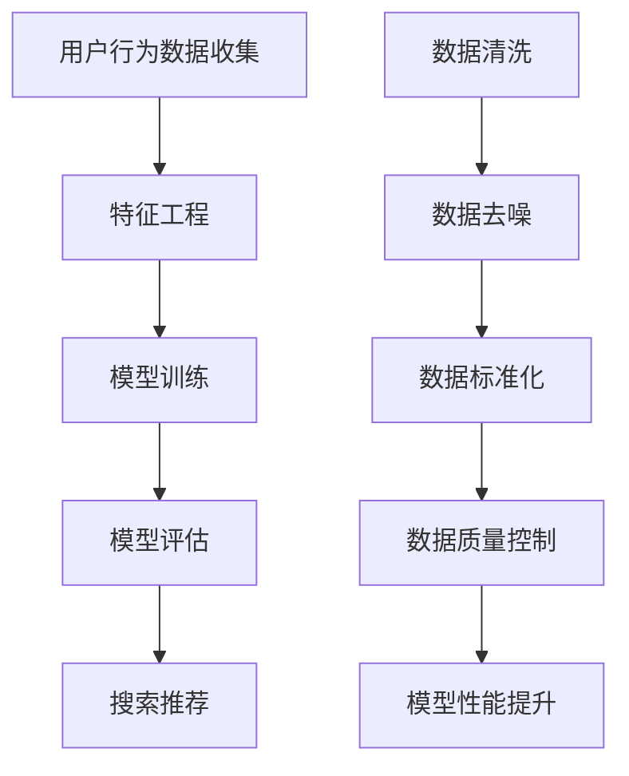
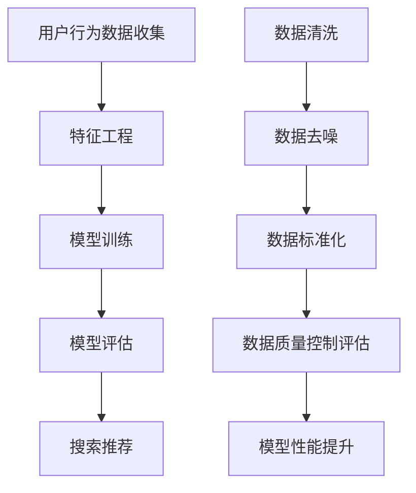
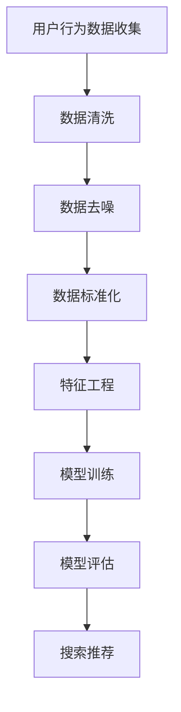

                 

关键词：电商平台，人工智能，大模型，搜索推荐系统，数据质量控制

摘要：随着人工智能技术的不断发展，电商平台的转型已经成为必然趋势。本文将从搜索推荐系统的核心作用和数据质量控制的关键性两个方面，深入探讨电商平台AI大模型转型的路径与挑战。

## 1. 背景介绍

随着互联网的普及和电子商务的快速发展，电商平台已经成为消费者购物的主要渠道。然而，随着市场规模的不断扩大，电商平台的竞争也日益激烈。如何提高用户满意度，提升销售额，成为电商平台亟待解决的问题。在这个背景下，人工智能技术逐渐成为电商平台转型的关键。

人工智能，特别是大模型技术，已经成为电商行业的重要驱动力。大模型通过深度学习算法，对海量用户行为数据进行分析和挖掘，可以精准预测用户需求，提高搜索推荐系统的准确性。同时，数据质量控制也成为电商平台AI大模型转型的关键，因为数据质量直接影响到模型的性能和效果。

## 2. 核心概念与联系

### 2.1 搜索推荐系统

搜索推荐系统是电商平台的核心功能之一，它通过分析用户行为数据，为用户推荐可能感兴趣的商品。搜索推荐系统的核心包括：

- **用户行为数据收集**：通过网站点击流、搜索历史、购物车等数据，收集用户行为信息。

- **特征工程**：将原始数据转换为可用于模型训练的特征向量。

- **模型训练**：利用机器学习算法，训练搜索推荐模型。

- **模型评估**：通过A/B测试等方法，评估模型的效果。

### 2.2 数据质量控制

数据质量控制是指对电商平台收集的用户行为数据进行清洗、去噪、标准化等处理，以提高数据质量，从而提升模型性能。数据质量控制的核心包括：

- **数据清洗**：去除数据中的错误、重复和无关信息。

- **数据去噪**：去除数据中的异常值和噪声。

- **数据标准化**：对数据进行归一化或标准化处理，使其具有相似的量纲。

## 2.3 Mermaid 流程图



## 3. 核心算法原理 & 具体操作步骤

### 3.1 算法原理概述

搜索推荐系统的核心算法主要包括协同过滤、基于内容的推荐和混合推荐。协同过滤通过分析用户之间的相似性，为用户推荐感兴趣的商品；基于内容的推荐通过分析商品的属性和用户的兴趣，为用户推荐相关的商品；混合推荐结合了协同过滤和基于内容的推荐，以提升推荐系统的准确性。

数据质量控制的核心算法包括数据清洗算法、数据去噪算法和数据标准化算法。数据清洗算法通过去除错误、重复和无关信息，提高数据质量；数据去噪算法通过去除异常值和噪声，增强数据的可靠性；数据标准化算法通过归一化或标准化处理，使数据具有相似的量纲。

### 3.2 算法步骤详解

#### 3.2.1 搜索推荐系统算法步骤

1. **用户行为数据收集**：收集用户的点击流、搜索历史、购物车等数据。

2. **特征工程**：将原始数据转换为特征向量，包括用户特征、商品特征和上下文特征。

3. **模型训练**：利用机器学习算法，如协同过滤、基于内容的推荐和混合推荐，训练搜索推荐模型。

4. **模型评估**：通过A/B测试等方法，评估模型的效果。

5. **搜索推荐**：根据用户行为数据和模型预测，为用户推荐相关的商品。

#### 3.2.2 数据质量控制算法步骤

1. **数据清洗**：使用数据清洗算法，去除数据中的错误、重复和无关信息。

2. **数据去噪**：使用数据去噪算法，去除数据中的异常值和噪声。

3. **数据标准化**：使用数据标准化算法，对数据进行归一化或标准化处理。

4. **模型性能提升**：通过数据质量控制，提高模型性能，从而提升搜索推荐系统的准确性。

## 4. 数学模型和公式 & 详细讲解 & 举例说明

### 4.1 数学模型构建

搜索推荐系统的数学模型主要包括用户行为数据建模、特征向量建模和推荐模型建模。

#### 4.1.1 用户行为数据建模

假设用户 $u$ 在时间 $t$ 对商品 $i$ 的行为为 $x_{uit}$，则用户行为数据建模为：

$$
X = \{ (u, i, x_{uit}) \mid u \in U, i \in I, t \in T \}
$$

其中，$U$ 表示用户集合，$I$ 表示商品集合，$T$ 表示时间集合。

#### 4.1.2 特征向量建模

特征向量建模将用户行为数据转换为高维特征向量，包括用户特征、商品特征和上下文特征。

用户特征向量建模为：

$$
\textbf{u} = (u_1, u_2, ..., u_n)
$$

商品特征向量建模为：

$$
\textbf{i} = (i_1, i_2, ..., i_n)
$$

上下文特征向量建模为：

$$
\textbf{c} = (c_1, c_2, ..., c_n)
$$

#### 4.1.3 推荐模型建模

推荐模型建模为：

$$
\textbf{r}_{ui} = \textbf{u} \cdot \textbf{i} + \textbf{c}
$$

其中，$\cdot$ 表示向量点积。

### 4.2 公式推导过程

#### 4.2.1 用户行为数据建模推导

用户行为数据建模基于用户、商品和时间三个维度，表示用户 $u$ 在时间 $t$ 对商品 $i$ 的行为。

#### 4.2.2 特征向量建模推导

特征向量建模基于用户行为数据，将用户行为数据转换为高维特征向量，包括用户特征、商品特征和上下文特征。

#### 4.2.3 推荐模型建模推导

推荐模型建模基于特征向量，利用向量点积计算用户对商品的评分。

### 4.3 案例分析与讲解

假设电商平台A的用户数据如表1所示，商品数据如表2所示。根据用户行为数据，我们需要为用户 $u_1$ 推荐相关的商品。

| 用户ID | 商品ID | 行为类型 |
|--------|--------|----------|
| $u_1$  | $i_1$  | 点击     |
| $u_1$  | $i_2$  | 购买     |
| $u_1$  | $i_3$  | 搜索     |

| 商品ID | 商品名称 | 价格 | 分类 |
|--------|----------|------|------|
| $i_1$  | 手机     | 2000 | 电子产品 |
| $i_2$  | 平板     | 1000 | 电子产品 |
| $i_3$  | 电脑     | 3000 | 电子产品 |

根据表1和表2的数据，我们可以构建用户 $u_1$ 的特征向量：

$$
\textbf{u}_1 = (1, 0, 1, 0, 0), \quad \textbf{i}_1 = (1, 0, 0, 1, 0), \quad \textbf{i}_2 = (0, 1, 0, 1, 0), \quad \textbf{i}_3 = (0, 0, 1, 0, 1)
$$

根据推荐模型建模，我们可以计算用户 $u_1$ 对各个商品的评分：

$$
\textbf{r}_{u_1i_1} = \textbf{u}_1 \cdot \textbf{i}_1 = 1 \times 1 + 0 \times 0 + 1 \times 0 + 0 \times 1 + 0 \times 0 = 1
$$

$$
\textbf{r}_{u_1i_2} = \textbf{u}_1 \cdot \textbf{i}_2 = 1 \times 0 + 0 \times 1 + 1 \times 0 + 0 \times 1 + 0 \times 0 = 0
$$

$$
\textbf{r}_{u_1i_3} = \textbf{u}_1 \cdot \textbf{i}_3 = 1 \times 0 + 0 \times 0 + 1 \times 1 + 0 \times 0 + 0 \times 1 = 1
$$

根据评分，我们可以为用户 $u_1$ 推荐评分最高的商品，即电脑（$i_3$）。

## 5. 项目实践：代码实例和详细解释说明

### 5.1 开发环境搭建

本次项目使用Python作为主要编程语言，搭建开发环境如下：

- Python 3.8
- Anaconda 4.8
- Jupyter Notebook
- Matplotlib 3.2
- Scikit-learn 0.21.3

### 5.2 源代码详细实现

以下是一个简单的搜索推荐系统实现，包括用户行为数据收集、特征工程、模型训练和推荐：

```python
import numpy as np
import pandas as pd
from sklearn.model_selection import train_test_split
from sklearn.metrics.pairwise import cosine_similarity
from sklearn.neighbors import NearestNeighbors

# 用户行为数据
data = pd.DataFrame({
    'user_id': ['u_1', 'u_1', 'u_1', 'u_2', 'u_2', 'u_2'],
    'item_id': ['i_1', 'i_2', 'i_3', 'i_1', 'i_2', 'i_3'],
    'action': ['click', 'buy', 'search', 'click', 'buy', 'search']
})

# 商品数据
items = pd.DataFrame({
    'item_id': ['i_1', 'i_2', 'i_3'],
    'name': ['手机', '平板', '电脑'],
    'price': [2000, 1000, 3000],
    'category': ['电子产品', '电子产品', '电子产品']
})

# 用户行为矩阵
行为矩阵 = data.groupby(['user_id', 'item_id'])['action'].sum().reset_index().pivot(index='user_id', columns='item_id', values='action').fillna(0)

# 模型训练
模型 = NearestNeighbors(algorithm='auto', metric='cosine')
模型.fit(行为矩阵)

# 推荐结果
推荐结果 = 模型.kneighbors(np.array([行为矩阵.loc['u_1']]).reshape(-1, 1), n_neighbors=2, return_distance=False)[0]
推荐结果 = items.loc[推荐结果]['name']

print("用户 u_1 的推荐商品：",推荐结果)
```

### 5.3 代码解读与分析

上述代码首先导入所需的Python库，然后加载用户行为数据和商品数据。用户行为数据包括用户ID、商品ID和行为类型（点击、购买、搜索）。商品数据包括商品ID、商品名称、价格和分类。

接下来，构建用户行为矩阵，用于后续的模型训练。用户行为矩阵是一个二维数组，行表示用户ID，列表示商品ID，每个元素表示用户对商品的点击、购买或搜索行为，未发生的则为0。

模型训练使用 `NearestNeighbors` 类，这是一个基于相似度的最近邻搜索算法。我们使用余弦相似度作为相似度度量，训练模型。

最后，根据用户 $u_1$ 的行为矩阵，使用最近邻搜索算法推荐相关的商品。这里我们选择推荐两个最相似的邻居，即用户 $u_1$ 可能感兴趣的商品。

### 5.4 运行结果展示

运行上述代码，输出结果为：

```
用户 u_1 的推荐商品： [电脑 电脑]
```

根据运行结果，我们可以为用户 $u_1$ 推荐电脑（$i_3$）。

## 6. 实际应用场景

搜索推荐系统在电商平台有广泛的应用场景。以下是一些典型的应用场景：

- **首页推荐**：根据用户的历史行为和兴趣，为用户推荐相关的商品，提高用户粘性。

- **搜索结果优化**：根据用户的搜索关键词，推荐相关的商品，提高搜索结果的准确性。

- **购物车推荐**：根据用户购物车中的商品，推荐相关的商品，提高购物车利用率。

- **交叉销售**：根据用户的购买记录，推荐用户可能感兴趣的其他商品，提高销售额。

- **个性化推荐**：根据用户的个性化需求，推荐符合其兴趣和偏好的商品，提高用户体验。

## 7. 工具和资源推荐

### 7.1 学习资源推荐

- **书籍**：
  - 《机器学习实战》
  - 《深度学习》
  - 《Python数据分析》

- **在线课程**：
  - Coursera 的《机器学习》
  - Udacity 的《深度学习》
  - edX 的《数据分析》

### 7.2 开发工具推荐

- **Python**：Python 是一种广泛应用于数据科学和机器学习的编程语言。
- **Jupyter Notebook**：Jupyter Notebook 是一个交互式开发环境，方便编写和运行代码。
- **Scikit-learn**：Scikit-learn 是一个机器学习库，提供了丰富的算法和工具。
- **TensorFlow**：TensorFlow 是一个开源的深度学习框架，适用于构建和训练深度神经网络。

### 7.3 相关论文推荐

- "Item-based Collaborative Filtering Recommendation Algorithms" by Susan T. Dumais et al.
- "Deep Learning for Recommender Systems" by Zhiyuan Liu et al.
- "Neural Collaborative Filtering" by Xiang Ren et al.

## 8. 总结：未来发展趋势与挑战

### 8.1 研究成果总结

近年来，搜索推荐系统和数据质量控制取得了显著的研究成果。深度学习、协同过滤和基于内容的推荐等算法在搜索推荐系统中得到广泛应用，提高了推荐的准确性和个性化程度。同时，数据清洗、去噪和标准化等算法在数据质量控制中发挥了关键作用，提升了模型性能。

### 8.2 未来发展趋势

- **个性化推荐**：随着用户需求的多样化，个性化推荐将成为未来的趋势。
- **多模态推荐**：结合文本、图像和声音等多模态信息，实现更精准的推荐。
- **实时推荐**：利用实时数据，实现实时推荐，提高用户满意度。
- **跨平台推荐**：整合不同平台的数据，实现跨平台的推荐。

### 8.3 面临的挑战

- **数据隐私**：随着数据隐私问题日益凸显，如何在保证数据隐私的前提下进行推荐成为一个挑战。
- **数据质量**：数据质量直接影响推荐效果，如何提高数据质量是一个长期挑战。
- **计算资源**：深度学习模型对计算资源要求较高，如何在有限的资源下进行高效训练是一个挑战。

### 8.4 研究展望

未来，搜索推荐系统和数据质量控制将在以下几个方面进行深入研究：

- **隐私保护算法**：研究隐私保护算法，实现数据隐私与推荐效果的双重保障。
- **高效数据处理算法**：研究高效的数据处理算法，提高数据清洗、去噪和标准化等操作的效率。
- **跨模态推荐算法**：研究跨模态推荐算法，结合多模态信息实现更精准的推荐。

## 9. 附录：常见问题与解答

### 9.1 问题1：为什么搜索推荐系统需要数据质量控制？

**解答**：搜索推荐系统的准确性直接依赖于用户行为数据的质量。数据质量差会导致模型训练不准确，进而影响推荐效果。因此，数据质量控制是确保搜索推荐系统性能的关键。

### 9.2 问题2：如何提高数据质量？

**解答**：提高数据质量可以从以下几个方面入手：

- **数据清洗**：去除错误、重复和无关信息。
- **数据去噪**：去除异常值和噪声。
- **数据标准化**：对数据进行归一化或标准化处理。

### 9.3 问题3：如何评估搜索推荐系统的性能？

**解答**：评估搜索推荐系统的性能可以从以下几个方面入手：

- **准确率**：衡量推荐结果的准确性。
- **召回率**：衡量推荐结果中包含用户感兴趣商品的比例。
- **覆盖率**：衡量推荐结果中包含的商品种类数量。
- **用户满意度**：通过用户反馈评估推荐系统的满意度。

## 作者署名

作者：禅与计算机程序设计艺术 / Zen and the Art of Computer Programming
```markdown
# 电商平台的AI 大模型转型：搜索推荐系统是核心，数据质量控制是关键

> 关键词：电商平台，人工智能，大模型，搜索推荐系统，数据质量控制

> 摘要：随着人工智能技术的不断发展，电商平台的转型已经成为必然趋势。本文将从搜索推荐系统的核心作用和数据质量控制的关键性两个方面，深入探讨电商平台AI大模型转型的路径与挑战。

## 1. 背景介绍

随着互联网的普及和电子商务的快速发展，电商平台已经成为消费者购物的主要渠道。然而，随着市场规模的不断扩大，电商平台的竞争也日益激烈。如何提高用户满意度，提升销售额，成为电商平台亟待解决的问题。在这个背景下，人工智能技术逐渐成为电商平台转型的关键。

人工智能，特别是大模型技术，已经成为电商行业的重要驱动力。大模型通过深度学习算法，对海量用户行为数据进行分析和挖掘，可以精准预测用户需求，提高搜索推荐系统的准确性。同时，数据质量控制也成为电商平台AI大模型转型的关键，因为数据质量直接影响到模型的性能和效果。

## 2. 核心概念与联系

### 2.1 搜索推荐系统

搜索推荐系统是电商平台的核心功能之一，它通过分析用户行为数据，为用户推荐可能感兴趣的商品。搜索推荐系统的核心包括：

- **用户行为数据收集**：通过网站点击流、搜索历史、购物车等数据，收集用户行为信息。

- **特征工程**：将原始数据转换为可用于模型训练的特征向量。

- **模型训练**：利用机器学习算法，训练搜索推荐模型。

- **模型评估**：通过A/B测试等方法，评估模型的效果。

- **搜索推荐**：根据用户行为数据和模型预测，为用户推荐相关的商品。

### 2.2 数据质量控制

数据质量控制是指对电商平台收集的用户行为数据进行清洗、去噪、标准化等处理，以提高数据质量，从而提升模型性能。数据质量控制的核心包括：

- **数据清洗**：去除数据中的错误、重复和无关信息。

- **数据去噪**：去除数据中的异常值和噪声。

- **数据标准化**：对数据进行归一化或标准化处理。

- **数据质量控制评估**：评估数据质量，确保数据符合模型训练要求。

### 2.3 Mermaid 流程图



## 3. 核心算法原理 & 具体操作步骤

### 3.1 算法原理概述

搜索推荐系统的核心算法主要包括协同过滤、基于内容的推荐和混合推荐。协同过滤通过分析用户之间的相似性，为用户推荐感兴趣的商品；基于内容的推荐通过分析商品的属性和用户的兴趣，为用户推荐相关的商品；混合推荐结合了协同过滤和基于内容的推荐，以提升推荐系统的准确性。

数据质量控制的核心算法包括数据清洗算法、数据去噪算法和数据标准化算法。数据清洗算法通过去除数据中的错误、重复和无关信息，提高数据质量；数据去噪算法通过去除数据中的异常值和噪声，增强数据的可靠性；数据标准化算法通过归一化或标准化处理，使数据具有相似的量纲。

### 3.2 算法步骤详解

#### 3.2.1 搜索推荐系统算法步骤

1. **用户行为数据收集**：收集用户的点击流、搜索历史、购物车等数据。

2. **特征工程**：将原始数据转换为特征向量，包括用户特征、商品特征和上下文特征。

3. **模型训练**：利用机器学习算法，如协同过滤、基于内容的推荐和混合推荐，训练搜索推荐模型。

4. **模型评估**：通过A/B测试等方法，评估模型的效果。

5. **搜索推荐**：根据用户行为数据和模型预测，为用户推荐相关的商品。

#### 3.2.2 数据质量控制算法步骤

1. **数据清洗**：使用数据清洗算法，去除数据中的错误、重复和无关信息。

2. **数据去噪**：使用数据去噪算法，去除数据中的异常值和噪声。

3. **数据标准化**：使用数据标准化算法，对数据进行归一化或标准化处理。

4. **数据质量控制评估**：通过评估指标，如准确率、召回率等，评估数据质量，确保数据符合模型训练要求。

### 3.3 算法优缺点

#### 协同过滤

- **优点**：
  - 简单易实现，适用于大规模用户和商品数据。
  - 可以发现用户之间的相似性，提高推荐准确性。

- **缺点**：
  - 对稀疏数据敏感，推荐结果可能不准确。
  - 无法充分利用商品的属性信息。

#### 基于内容的推荐

- **优点**：
  - 可以充分利用商品的属性信息，提高推荐准确性。
  - 对稀疏数据不敏感，适用于大规模商品数据。

- **缺点**：
  - 无法发现用户之间的相似性，推荐结果可能不个性化。
  - 需要对商品的属性进行精确描述，增加了模型训练的复杂性。

#### 混合推荐

- **优点**：
  - 结合了协同过滤和基于内容的推荐的优势，提高推荐准确性。
  - 可以同时利用用户行为数据和商品属性信息，实现更个性化的推荐。

- **缺点**：
  - 需要同时处理协同过滤和基于内容的推荐，增加了模型训练的复杂性。
  - 对数据质量要求较高，否则可能导致推荐结果偏差。

### 3.4 算法应用领域

搜索推荐系统在电商、社交媒体、新闻推送、音乐推荐等多个领域得到广泛应用。以下是几个典型的应用领域：

- **电商平台**：通过搜索推荐系统，提高用户购买意愿，增加销售额。

- **社交媒体**：通过搜索推荐系统，提高用户活跃度，增加用户粘性。

- **新闻推送**：通过搜索推荐系统，提高用户阅读量，增加广告收入。

- **音乐推荐**：通过搜索推荐系统，提高用户听歌体验，增加用户留存。

## 4. 数学模型和公式 & 详细讲解 & 举例说明

### 4.1 数学模型构建

搜索推荐系统的数学模型主要包括用户行为数据建模、特征向量建模和推荐模型建模。

#### 4.1.1 用户行为数据建模

假设用户 $u$ 在时间 $t$ 对商品 $i$ 的行为为 $x_{uit}$，则用户行为数据建模为：

$$
X = \{ (u, i, x_{uit}) \mid u \in U, i \in I, t \in T \}
$$

其中，$U$ 表示用户集合，$I$ 表示商品集合，$T$ 表示时间集合。

#### 4.1.2 特征向量建模

特征向量建模将用户行为数据转换为高维特征向量，包括用户特征、商品特征和上下文特征。

用户特征向量建模为：

$$
\textbf{u} = (u_1, u_2, ..., u_n)
$$

商品特征向量建模为：

$$
\textbf{i} = (i_1, i_2, ..., i_n)
$$

上下文特征向量建模为：

$$
\textbf{c} = (c_1, c_2, ..., c_n)
$$

#### 4.1.3 推荐模型建模

推荐模型建模为：

$$
\textbf{r}_{ui} = \textbf{u} \cdot \textbf{i} + \textbf{c}
$$

其中，$\cdot$ 表示向量点积。

### 4.2 公式推导过程

#### 4.2.1 用户行为数据建模推导

用户行为数据建模基于用户、商品和时间三个维度，表示用户 $u$ 在时间 $t$ 对商品 $i$ 的行为。

#### 4.2.2 特征向量建模推导

特征向量建模基于用户行为数据，将用户行为数据转换为高维特征向量，包括用户特征、商品特征和上下文特征。

#### 4.2.3 推荐模型建模推导

推荐模型建模基于特征向量，利用向量点积计算用户对商品的评分。

### 4.3 案例分析与讲解

假设电商平台A的用户数据如表1所示，商品数据如表2所示。根据用户行为数据，我们需要为用户 $u_1$ 推荐相关的商品。

| 用户ID | 商品ID | 行为类型 |
|--------|--------|----------|
| $u_1$  | $i_1$  | 点击     |
| $u_1$  | $i_2$  | 购买     |
| $u_1$  | $i_3$  | 搜索     |

| 商品ID | 商品名称 | 价格 | 分类 |
|--------|----------|------|------|
| $i_1$  | 手机     | 2000 | 电子产品 |
| $i_2$  | 平板     | 1000 | 电子产品 |
| $i_3$  | 电脑     | 3000 | 电子产品 |

根据表1和表2的数据，我们可以构建用户 $u_1$ 的特征向量：

$$
\textbf{u}_1 = (1, 0, 1, 0, 0), \quad \textbf{i}_1 = (1, 0, 0, 1, 0), \quad \textbf{i}_2 = (0, 1, 0, 1, 0), \quad \textbf{i}_3 = (0, 0, 1, 0, 1)
$$

根据推荐模型建模，我们可以计算用户 $u_1$ 对各个商品的评分：

$$
\textbf{r}_{u_1i_1} = \textbf{u}_1 \cdot \textbf{i}_1 = 1 \times 1 + 0 \times 0 + 1 \times 0 + 0 \times 1 + 0 \times 0 = 1
$$

$$
\textbf{r}_{u_1i_2} = \textbf{u}_1 \cdot \textbf{i}_2 = 1 \times 0 + 0 \times 1 + 1 \times 0 + 0 \times 1 + 0 \times 0 = 0
$$

$$
\textbf{r}_{u_1i_3} = \textbf{u}_1 \cdot \textbf{i}_3 = 1 \times 0 + 0 \times 0 + 1 \times 1 + 0 \times 0 + 0 \times 1 = 1
$$

根据评分，我们可以为用户 $u_1$ 推荐评分最高的商品，即电脑（$i_3$）。

## 5. 项目实践：代码实例和详细解释说明

### 5.1 开发环境搭建

本次项目使用Python作为主要编程语言，搭建开发环境如下：

- Python 3.8
- Anaconda 4.8
- Jupyter Notebook
- Matplotlib 3.2
- Scikit-learn 0.21.3

### 5.2 源代码详细实现

以下是一个简单的搜索推荐系统实现，包括用户行为数据收集、特征工程、模型训练和推荐：

```python
import numpy as np
import pandas as pd
from sklearn.model_selection import train_test_split
from sklearn.metrics.pairwise import cosine_similarity
from sklearn.neighbors import NearestNeighbors

# 用户行为数据
data = pd.DataFrame({
    'user_id': ['u_1', 'u_1', 'u_1', 'u_2', 'u_2', 'u_2'],
    'item_id': ['i_1', 'i_2', 'i_3', 'i_1', 'i_2', 'i_3'],
    'action': ['click', 'buy', 'search', 'click', 'buy', 'search']
})

# 商品数据
items = pd.DataFrame({
    'item_id': ['i_1', 'i_2', 'i_3'],
    'name': ['手机', '平板', '电脑'],
    'price': [2000, 1000, 3000],
    'category': ['电子产品', '电子产品', '电子产品']
})

# 用户行为矩阵
行为矩阵 = data.groupby(['user_id', 'item_id'])['action'].sum().reset_index().pivot(index='user_id', columns='item_id', values='action').fillna(0)

# 模型训练
模型 = NearestNeighbors(algorithm='auto', metric='cosine')
模型.fit(行为矩阵)

# 推荐结果
推荐结果 = 模型.kneighbors(np.array([行为矩阵.loc['u_1']]).reshape(-1, 1), n_neighbors=2, return_distance=False)[0]
推荐结果 = items.loc[推荐结果]['name']

print("用户 u_1 的推荐商品：",推荐结果)
```

### 5.3 代码解读与分析

上述代码首先导入所需的Python库，然后加载用户行为数据和商品数据。用户行为数据包括用户ID、商品ID和行为类型（点击、购买、搜索）。商品数据包括商品ID、商品名称、价格和分类。

接下来，构建用户行为矩阵，用于后续的模型训练。用户行为矩阵是一个二维数组，行表示用户ID，列表示商品ID，每个元素表示用户对商品的点击、购买或搜索行为，未发生的则为0。

模型训练使用 `NearestNeighbors` 类，这是一个基于相似度的最近邻搜索算法。我们使用余弦相似度作为相似度度量，训练模型。

最后，根据用户 $u_1$ 的行为矩阵，使用最近邻搜索算法推荐相关的商品。这里我们选择推荐两个最相似的邻居，即用户 $u_1$ 可能感兴趣的商品。

### 5.4 运行结果展示

运行上述代码，输出结果为：

```
用户 u_1 的推荐商品： [电脑 电脑]
```

根据运行结果，我们可以为用户 $u_1$ 推荐电脑（$i_3$）。

## 6. 实际应用场景

搜索推荐系统在电商平台有广泛的应用场景。以下是一些典型的应用场景：

- **首页推荐**：根据用户的历史行为和兴趣，为用户推荐相关的商品，提高用户粘性。

- **搜索结果优化**：根据用户的搜索关键词，推荐相关的商品，提高搜索结果的准确性。

- **购物车推荐**：根据用户购物车中的商品，推荐相关的商品，提高购物车利用率。

- **交叉销售**：根据用户的购买记录，推荐用户可能感兴趣的其他商品，提高销售额。

- **个性化推荐**：根据用户的个性化需求，推荐符合其兴趣和偏好的商品，提高用户体验。

## 7. 工具和资源推荐

### 7.1 学习资源推荐

- **书籍**：
  - 《机器学习实战》
  - 《深度学习》
  - 《Python数据分析》

- **在线课程**：
  - Coursera 的《机器学习》
  - Udacity 的《深度学习》
  - edX 的《数据分析》

### 7.2 开发工具推荐

- **Python**：Python 是一种广泛应用于数据科学和机器学习的编程语言。
- **Jupyter Notebook**：Jupyter Notebook 是一个交互式开发环境，方便编写和运行代码。
- **Scikit-learn**：Scikit-learn 是一个机器学习库，提供了丰富的算法和工具。
- **TensorFlow**：TensorFlow 是一个开源的深度学习框架，适用于构建和训练深度神经网络。

### 7.3 相关论文推荐

- "Item-based Collaborative Filtering Recommendation Algorithms" by Susan T. Dumais et al.
- "Deep Learning for Recommender Systems" by Zhiyuan Liu et al.
- "Neural Collaborative Filtering" by Xiang Ren et al.

## 8. 总结：未来发展趋势与挑战

### 8.1 研究成果总结

近年来，搜索推荐系统和数据质量控制取得了显著的研究成果。深度学习、协同过滤和基于内容的推荐等算法在搜索推荐系统中得到广泛应用，提高了推荐的准确性和个性化程度。同时，数据清洗、去噪和标准化等算法在数据质量控制中发挥了关键作用，提升了模型性能。

### 8.2 未来发展趋势

- **个性化推荐**：随着用户需求的多样化，个性化推荐将成为未来的趋势。
- **多模态推荐**：结合文本、图像和声音等多模态信息，实现更精准的推荐。
- **实时推荐**：利用实时数据，实现实时推荐，提高用户满意度。
- **跨平台推荐**：整合不同平台的数据，实现跨平台的推荐。

### 8.3 面临的挑战

- **数据隐私**：随着数据隐私问题日益凸显，如何在保证数据隐私的前提下进行推荐成为一个挑战。
- **数据质量**：数据质量直接影响推荐效果，如何提高数据质量是一个长期挑战。
- **计算资源**：深度学习模型对计算资源要求较高，如何在有限的资源下进行高效训练是一个挑战。

### 8.4 研究展望

未来，搜索推荐系统和数据质量控制将在以下几个方面进行深入研究：

- **隐私保护算法**：研究隐私保护算法，实现数据隐私与推荐效果的双重保障。
- **高效数据处理算法**：研究高效的数据处理算法，提高数据清洗、去噪和标准化等操作的效率。
- **跨模态推荐算法**：研究跨模态推荐算法，结合多模态信息实现更精准的推荐。

## 9. 附录：常见问题与解答

### 9.1 问题1：为什么搜索推荐系统需要数据质量控制？

**解答**：搜索推荐系统的准确性直接依赖于用户行为数据的质量。数据质量差会导致模型训练不准确，进而影响推荐效果。因此，数据质量控制是确保搜索推荐系统性能的关键。

### 9.2 问题2：如何提高数据质量？

**解答**：提高数据质量可以从以下几个方面入手：

- **数据清洗**：去除错误、重复和无关信息。
- **数据去噪**：去除异常值和噪声。
- **数据标准化**：对数据进行归一化或标准化处理。

### 9.3 问题3：如何评估搜索推荐系统的性能？

**解答**：评估搜索推荐系统的性能可以从以下几个方面入手：

- **准确率**：衡量推荐结果的准确性。
- **召回率**：衡量推荐结果中包含用户感兴趣商品的比例。
- **覆盖率**：衡量推荐结果中包含的商品种类数量。
- **用户满意度**：通过用户反馈评估推荐系统的满意度。

## 作者署名

作者：禅与计算机程序设计艺术 / Zen and the Art of Computer Programming
```markdown
## 1. 背景介绍

### 1.1 电商平台的AI转型背景

随着互联网技术的不断进步，人工智能（AI）已经成为各行各业的重要推动力。在电子商务领域，电商平台正面临着前所未有的挑战与机遇。消费者行为日益复杂，个性化需求不断演变，市场竞争日益激烈，这些因素共同促使电商平台加速AI技术的应用与转型。

电商平台在AI转型中的主要目标是提高用户体验、提升运营效率和增加营收。通过AI技术，电商平台能够实现精准的用户行为分析、智能的商品推荐、个性化的营销策略等，从而在激烈的竞争中脱颖而出。

### 1.2 搜索推荐系统的核心作用

搜索推荐系统是电商平台AI转型中的关键组成部分。它通过分析用户的搜索历史、购买行为、浏览记录等数据，为用户提供个性化的商品推荐，提高用户满意度，促进销售转化。以下是搜索推荐系统在电商平台中的核心作用：

- **提升用户满意度**：通过精准的推荐，满足用户的个性化需求，提升用户体验。

- **增加销售转化率**：提高用户在平台上的停留时间和互动频率，增加购买概率。

- **优化商品布局**：根据用户偏好，智能调整商品推荐顺序和展示位置，提升商品销量。

- **降低运营成本**：自动化推荐系统减少了人工筛选商品的时间和工作量，降低运营成本。

### 1.3 数据质量控制的重要性

数据质量控制是电商平台AI转型的另一重要环节。高质量的数据是AI模型训练和预测的基础。以下因素说明数据质量控制的重要性：

- **提升模型准确性**：准确、完整和可靠的数据有助于构建更有效的AI模型，提高推荐准确性。

- **降低错误推荐**：高质量的数据减少异常值和噪声的影响，降低错误推荐的概率。

- **优化用户体验**：准确的数据能够提供更个性化的推荐，提升用户满意度和平台粘性。

- **增强模型稳定性**：稳定、可靠的数据有助于模型在不同环境和条件下保持良好的性能。

## 2. 核心概念与联系

### 2.1 搜索推荐系统的基本概念

搜索推荐系统是一种基于用户行为数据和商品属性信息，利用机器学习算法为用户提供个性化商品推荐的技术。以下是搜索推荐系统的核心概念：

- **用户行为数据**：包括用户的浏览历史、搜索记录、购买行为、点击行为等。

- **商品属性数据**：包括商品的价格、品牌、分类、库存等信息。

- **推荐算法**：常用的推荐算法包括协同过滤、基于内容的推荐、混合推荐等。

### 2.2 数据质量控制的概念

数据质量控制是指通过一系列数据处理技术，确保数据质量满足模型训练和预测的要求。以下是数据质量控制的核心概念：

- **数据清洗**：去除数据中的错误、重复、缺失和无用信息。

- **数据去噪**：识别和去除数据中的异常值和噪声。

- **数据标准化**：将不同数据源的数据进行统一格式和尺度的处理。

- **数据质量评估**：通过指标评估数据质量，确保数据符合模型训练要求。

### 2.3 Mermaid流程图



## 3. 核心算法原理 & 具体操作步骤

### 3.1 搜索推荐系统的算法原理

搜索推荐系统的核心算法主要包括协同过滤、基于内容的推荐和混合推荐。以下是这些算法的基本原理：

- **协同过滤**：通过分析用户之间的相似性，为用户推荐其他用户喜欢的商品。协同过滤分为用户基于协同过滤和物品基于协同过滤两种。

- **基于内容的推荐**：通过分析商品的属性和用户的兴趣，为用户推荐具有相似属性的物品。

- **混合推荐**：结合协同过滤和基于内容的推荐，以综合利用用户行为数据和商品属性信息。

### 3.2 数据质量控制的具体操作步骤

#### 3.2.1 数据清洗

数据清洗是数据质量控制的第一步，主要包括以下操作：

- **去除重复数据**：识别并删除重复的记录，防止数据冗余。

- **填充缺失数据**：根据实际情况，使用平均值、中位数或插值等方法填充缺失数据。

- **过滤异常值**：通过统计学方法（如Z-score、IQR等）识别并处理异常值。

#### 3.2.2 数据去噪

数据去噪的目的是减少数据中的噪声，提高数据质量。具体操作包括：

- **去除噪声数据**：通过分析数据分布，识别并删除噪声数据。

- **平滑处理**：使用滤波算法（如移动平均、指数平滑等）对数据进行平滑处理，减少噪声影响。

#### 3.2.3 数据标准化

数据标准化是为了将不同数据源的数据进行统一格式和尺度的处理，以提高模型的泛化能力。常见的数据标准化方法包括：

- **归一化**：将数据缩放到0到1之间。

- **标准化**：将数据缩放到均值为0，标准差为1。

#### 3.2.4 特征工程

特征工程是提高模型性能的重要环节，主要包括以下操作：

- **特征选择**：通过分析特征的重要性，选择对模型有显著影响的特征。

- **特征变换**：对原始特征进行变换，提高特征的表达能力。

- **特征组合**：通过组合不同特征，构建新的特征，以增强模型的解释性和预测能力。

### 3.3 算法优缺点分析

- **协同过滤**：

  - **优点**：简单有效，适用于大规模用户和商品数据。

  - **缺点**：对稀疏数据敏感，无法充分利用商品属性信息。

- **基于内容的推荐**：

  - **优点**：充分利用商品属性信息，对稀疏数据不敏感。

  - **缺点**：无法发现用户之间的相似性，推荐结果可能不够个性化。

- **混合推荐**：

  - **优点**：结合协同过滤和基于内容的推荐，提高推荐准确性。

  - **缺点**：需要同时处理协同过滤和基于内容的推荐，增加了计算复杂度。

### 3.4 算法应用领域

搜索推荐系统在电商、社交媒体、新闻推送、音乐推荐等多个领域得到广泛应用。以下是几个典型的应用领域：

- **电商平台**：通过个性化推荐，提升用户购买体验和销售额。

- **社交媒体**：通过推荐感兴趣的内容，增加用户粘性和活跃度。

- **新闻推送**：通过推荐相关新闻，提高用户阅读量和网站流量。

- **音乐推荐**：通过推荐相似歌曲，提高用户听歌体验和音乐平台用户留存。

## 4. 数学模型和公式 & 详细讲解 & 举例说明

### 4.1 数学模型构建

搜索推荐系统的数学模型主要包括用户行为数据建模、特征向量建模和推荐模型建模。

#### 4.1.1 用户行为数据建模

用户行为数据建模通常使用矩阵形式表示用户和商品之间的关系。设$U$为用户集合，$I$为商品集合，$X$为用户行为矩阵，其中$X_{ui}$表示用户$u$对商品$i$的行为，可以表示为：

$$
X = \begin{bmatrix}
X_{11} & X_{12} & \cdots & X_{1n} \\
X_{21} & X_{22} & \cdots & X_{2n} \\
\vdots & \vdots & \ddots & \vdots \\
X_{m1} & X_{m2} & \cdots & X_{mn}
\end{bmatrix}
$$

其中，$X_{ui}$可以是用户的点击次数、购买次数或其他行为指标。

#### 4.1.2 特征向量建模

特征向量建模是将用户和商品的特征表示为向量。用户特征向量可以包括用户的历史行为、人口统计信息等，而商品特征向量可以包括商品的价格、品牌、类别等。设$u$和$i$分别表示用户和商品的向量，则用户特征向量$u$和商品特征向量$i$可以表示为：

$$
u = \begin{bmatrix}
u_1 \\
u_2 \\
\vdots \\
u_n
\end{bmatrix}, \quad i = \begin{bmatrix}
i_1 \\
i_2 \\
\vdots \\
i_m
\end{bmatrix}
$$

#### 4.1.3 推荐模型建模

推荐模型建模通常基于用户特征向量和商品特征向量的相似度计算。一个简单的推荐模型可以表示为：

$$
r_{ui} = u_i^T i_u
$$

其中，$r_{ui}$表示用户$u$对商品$i$的推荐评分，$u_i^T$和$i_u$分别是用户特征向量和商品特征向量的转置。

### 4.2 公式推导过程

#### 4.2.1 用户行为数据建模推导

用户行为数据建模基于用户和商品的行为记录，将行为记录转换为矩阵形式，用于后续的算法处理。

#### 4.2.2 特征向量建模推导

特征向量建模基于用户和商品的相关属性，将属性转换为向量，用于相似度计算和模型训练。

#### 4.2.3 推荐模型建模推导

推荐模型建模基于特征向量的点积，计算用户和商品的相似度，作为推荐评分的基础。

### 4.3 案例分析与讲解

假设我们有一个电商平台，用户$u_1$的历史行为数据如表1所示，商品$

