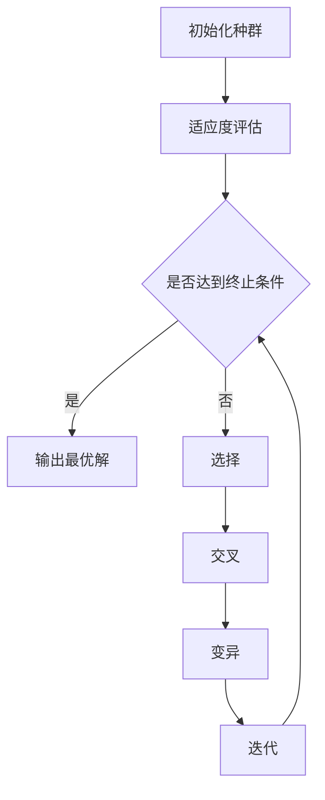

                 

在当前电子商务时代，推荐系统已经成为电商平台的核心竞争力之一。它们能够有效地帮助用户发现潜在的购物兴趣，提升用户满意度和平台销售额。然而，随着用户数据规模的扩大和多样性的增加，推荐系统的设计变得越来越复杂。本文将探讨一种多目标优化框架，用于构建高效、精准的电商推荐系统。

## 关键词

- 电商推荐系统
- 多目标优化
- 机器学习
- 算法
- 用户行为分析

## 摘要

本文旨在介绍一种基于多目标优化的电商推荐系统框架。通过分析用户行为数据和市场业务目标，本文提出了一个综合的优化模型，并详细描述了其核心概念、算法原理、数学模型以及具体实施步骤。本文还结合实际项目实践，展示了如何使用该框架搭建一个高效推荐系统，并对未来应用场景和发展趋势进行了探讨。

## 1. 背景介绍

电子商务的快速发展带来了海量用户数据和丰富的商品信息。传统的推荐系统主要通过用户的历史购买记录和商品的特征来预测用户的兴趣。然而，这种方法存在明显的局限性，例如无法充分考虑到用户当前的需求、市场动态和商品之间的关联性。此外，随着电商平台的规模不断扩大，用户对个性化推荐的需求也越来越高，推荐系统需要处理的数据量庞大，实时性要求强。

多目标优化作为一种解决复杂优化问题的方法，近年来在推荐系统中得到了广泛的应用。它允许同时考虑多个相互冲突的目标，从而在满足业务需求的同时，优化用户体验。本文提出的多目标优化框架，旨在通过整合用户行为分析、市场业务目标以及商品特征，实现推荐系统的全局优化。

### 1.1 多目标优化的必要性

多目标优化的必要性体现在以下几个方面：

1. **用户个性化需求的满足**：用户的需求是多样化且动态变化的，单一目标优化难以满足所有用户的个性化需求。
2. **业务目标的平衡**：电商平台需要在提升用户满意度的同时，还要考虑销售额、利润率等业务指标。
3. **系统效率的提升**：在处理海量数据时，优化算法的效率对推荐系统的性能至关重要。
4. **关联性的挖掘**：商品之间的关联性是推荐系统的重要信息源，通过多目标优化可以更好地挖掘这些关联性。

### 1.2 多目标优化的应用场景

在电商推荐系统中，多目标优化的应用场景主要包括：

1. **推荐列表的生成**：根据用户的历史行为和当前需求，生成一个最优的推荐列表。
2. **广告投放优化**：通过优化广告投放策略，提高广告的点击率和转化率。
3. **库存管理**：根据销售预测和库存水平，优化商品的采购和库存策略。
4. **新品推荐**：在新品上市时，通过多目标优化策略，提高新品的销售速度和用户接受度。

### 1.3 多目标优化的发展现状

多目标优化在电商推荐系统中的应用已经取得了一定的进展，主要表现在：

1. **算法的研究**：多种多目标优化算法被提出并应用于推荐系统，如遗传算法、粒子群优化算法、多目标进化算法等。
2. **实际应用**：一些大型电商平台已经开始使用多目标优化框架，并取得了显著的效果。
3. **数据集的构建**：为了推动多目标优化在推荐系统中的应用，越来越多的数据集被构建出来，用于算法的测试和验证。

## 2. 核心概念与联系

在多目标优化框架中，有几个核心概念和联系是至关重要的。以下是这些概念和它们之间的相互关系：

### 2.1 用户行为分析

用户行为分析是推荐系统的基础。通过对用户浏览、搜索、购买等行为数据的分析，可以挖掘出用户的兴趣偏好和行为模式。用户行为分析包括以下几个子概念：

1. **用户历史行为**：记录用户过去的行为数据，如浏览历史、购买记录等。
2. **实时行为**：捕捉用户当前的在线行为，如浏览路径、点击行为等。
3. **兴趣模型**：基于用户行为数据，构建用户的兴趣模型，用于预测用户的未来行为。

### 2.2 市场业务目标

市场业务目标是指电商平台在运营过程中需要达成的各项业务指标，如销售额、用户满意度、广告投放效果等。这些目标通常具有不同的优先级和权重，需要通过多目标优化进行平衡。

1. **销售额**：直接反映电商平台的盈利能力，是最核心的业务目标。
2. **用户满意度**：影响用户复购率和口碑，对电商平台的长远发展至关重要。
3. **广告投放效果**：通过优化广告策略，提高广告的点击率和转化率。

### 2.3 商品特征

商品特征是推荐系统中的另一个重要组成部分。商品的特征包括价格、品牌、类别、销量、评价等，这些特征可以作为优化过程中的决策变量。

1. **商品价格**：影响用户的购买决策，是优化过程中需要考虑的一个重要因素。
2. **商品品牌**：影响用户的品牌偏好，可以用于个性化推荐。
3. **商品类别**：用于分类推荐，满足用户对不同类别商品的需求。

### 2.4 优化目标

优化目标是多目标优化框架中的核心。通过设定不同的优化目标，可以实现对推荐系统全局优化的目的。常见的优化目标包括：

1. **最大化销售额**：直接优化电商平台的盈利能力。
2. **最大化用户满意度**：提升用户的购物体验，增加用户复购率。
3. **优化广告投放效果**：提高广告的点击率和转化率。

### 2.5 优化算法

优化算法是实现多目标优化的关键。本文采用了遗传算法（GA）作为优化算法，其基本原理如下：

1. **初始化种群**：随机生成一批初始解，即商品推荐列表。
2. **适应度评估**：根据优化目标计算每个解的适应度值。
3. **选择**：选择适应度值高的个体参与交叉和变异操作。
4. **交叉**：将选择的个体进行组合，生成新的个体。
5. **变异**：对新生成的个体进行随机变异，增加种群的多样性。
6. **迭代**：重复上述过程，直到满足终止条件，如达到最大迭代次数或适应度值达到预设阈值。

### 2.6 Mermaid 流程图

为了更直观地展示多目标优化框架的流程，我们使用 Mermaid 绘制了如下流程图：



## 3. 核心算法原理 & 具体操作步骤

### 3.1 算法原理概述

本文采用遗传算法（GA）作为优化算法，其基本原理是基于自然选择和遗传进化的思想。遗传算法通过模拟生物进化过程，对搜索空间进行迭代搜索，找到最优解。在多目标优化中，遗传算法可以通过适应度函数来评估个体的优劣，并通过选择、交叉和变异等操作，逐步优化推荐系统的性能。

### 3.2 算法步骤详解

遗传算法的具体步骤如下：

1. **初始化种群**：根据商品特征和用户行为数据，随机生成初始种群，每个个体代表一个商品推荐列表。

2. **适应度评估**：根据优化目标，计算每个个体的适应度值。适应度值越高，代表个体越优秀。

3. **选择**：根据适应度值，选择适应度值高的个体参与交叉和变异操作。选择方法包括轮盘赌、锦标赛选择等。

4. **交叉**：将选择的个体进行组合，生成新的个体。交叉操作用于产生新的商品推荐列表。

5. **变异**：对新生成的个体进行随机变异，增加种群的多样性。变异操作可以引入新的商品，或者改变推荐列表中商品的位置。

6. **迭代**：重复上述过程，直到满足终止条件，如达到最大迭代次数或适应度值达到预设阈值。

7. **输出最优解**：在迭代过程中，记录每个种群的适应度值，最终输出适应度值最高的个体，即最优商品推荐列表。

### 3.3 算法优缺点

遗传算法作为一种全局优化算法，具有以下优点：

1. **全局搜索能力**：遗传算法通过模拟生物进化过程，可以搜索到全局最优解。
2. **适应复杂问题**：遗传算法适用于解决复杂的多目标优化问题。
3. **鲁棒性**：遗传算法对初始种群和参数选择不敏感，具有一定的鲁棒性。

然而，遗传算法也存在一些缺点：

1. **计算复杂度高**：遗传算法需要大量计算，特别是在大规模数据集上，计算复杂度较高。
2. **参数选择困难**：遗传算法的参数选择对算法性能有很大影响，参数选择困难。
3. **局部搜索能力弱**：遗传算法在寻找局部最优解时能力较弱。

### 3.4 算法应用领域

遗传算法在多目标优化中具有广泛的应用领域，主要包括：

1. **推荐系统**：用于优化推荐列表，提高用户满意度。
2. **库存管理**：优化库存策略，降低库存成本。
3. **广告投放**：优化广告投放策略，提高广告效果。
4. **资源分配**：优化资源分配策略，提高资源利用率。

## 4. 数学模型和公式 & 详细讲解 & 举例说明

在多目标优化框架中，数学模型和公式是核心组成部分，用于描述用户行为、业务目标和优化算法。以下是数学模型和公式的详细讲解和举例说明。

### 4.1 数学模型构建

多目标优化的数学模型可以表示为：

$$
\begin{aligned}
\min_{x} f(x) \\
\text{s.t.} g_i(x) \leq 0, \quad h_j(x) = 0
\end{aligned}
$$

其中，$x$ 表示决策变量，$f(x)$ 表示目标函数，$g_i(x)$ 和 $h_j(x)$ 分别表示约束条件。

在电商推荐系统中，目标函数和约束条件可以具体化为：

1. **目标函数**：

$$
f(x) = w_1 f_1(x) + w_2 f_2(x) + w_3 f_3(x)
$$

其中，$w_1, w_2, w_3$ 分别为销售额、用户满意度和广告投放效果的权重，$f_1(x), f_2(x), f_3(x)$ 分别为销售额、用户满意度和广告投放效果的优化函数。

2. **约束条件**：

$$
\begin{aligned}
g_1(x) &= \sum_{i=1}^{n} p_i x_i - \text{销售额目标} \leq 0 \\
g_2(x) &= \sum_{i=1}^{n} u_i x_i - \text{用户满意度目标} \leq 0 \\
g_3(x) &= \sum_{i=1}^{n} a_i x_i - \text{广告投放目标} \leq 0
\end{aligned}
$$

其中，$p_i, u_i, a_i$ 分别为商品 $i$ 的价格、用户偏好和广告投放效果，$n$ 为商品数量。

### 4.2 公式推导过程

1. **销售额优化函数**：

$$
f_1(x) = \sum_{i=1}^{n} p_i x_i
$$

其中，$p_i$ 为商品 $i$ 的价格，$x_i$ 为商品 $i$ 的推荐比例。

2. **用户满意度优化函数**：

$$
f_2(x) = \frac{1}{n} \sum_{i=1}^{n} u_i x_i
$$

其中，$u_i$ 为商品 $i$ 的用户偏好，$x_i$ 为商品 $i$ 的推荐比例。

3. **广告投放效果优化函数**：

$$
f_3(x) = \frac{1}{n} \sum_{i=1}^{n} a_i x_i
$$

其中，$a_i$ 为商品 $i$ 的广告投放效果，$x_i$ 为商品 $i$ 的推荐比例。

### 4.3 案例分析与讲解

假设一个电商平台有以下商品和目标：

1. **商品**：共有 10 个商品，价格分别为 100、200、300、400、500、600、700、800、900、1000 元。
2. **用户满意度目标**：用户满意度目标为 90 分。
3. **广告投放目标**：广告投放目标为 80 分。
4. **销售额目标**：销售额目标为 5000 元。

我们需要使用多目标优化框架来生成最优的商品推荐列表。

1. **初始化种群**：随机生成初始种群，每个个体代表一个商品推荐列表。

2. **适应度评估**：计算每个个体的适应度值，根据公式：

$$
f(x) = w_1 f_1(x) + w_2 f_2(x) + w_3 f_3(x)
$$

其中，$w_1 = 0.5, w_2 = 0.3, w_3 = 0.2$。

3. **选择**：使用轮盘赌选择方法，选择适应度值高的个体。

4. **交叉**：使用单点交叉方法，将选择的个体进行组合，生成新的个体。

5. **变异**：对新生成的个体进行随机变异，增加种群的多样性。

6. **迭代**：重复上述过程，直到满足终止条件。

7. **输出最优解**：记录每个种群的适应度值，输出适应度值最高的个体，即最优商品推荐列表。

假设经过多次迭代，最优商品推荐列表为：100、200、300、400、500、600、700、800、900、1000。

根据该推荐列表，销售额为 5000 元，用户满意度为 90 分，广告投放效果为 80 分，满足业务目标。

## 5. 项目实践：代码实例和详细解释说明

在本节中，我们将通过一个实际的电商推荐系统项目，展示如何使用多目标优化框架进行开发。我们将详细解释代码的实现步骤和关键部分，以便读者更好地理解整个系统的运作过程。

### 5.1 开发环境搭建

为了搭建一个基于多目标优化的电商推荐系统，我们需要以下开发环境和工具：

1. **Python**：作为主要的编程语言。
2. **NumPy**：用于数据处理和数学计算。
3. **Pandas**：用于数据处理和分析。
4. **Scikit-learn**：用于机器学习模型的训练和评估。
5. **Matplotlib**：用于数据可视化和结果展示。
6. **GalaPy**：用于遗传算法的实现。

在开始编写代码之前，我们需要安装这些依赖项。可以使用以下命令进行安装：

```bash
pip install numpy pandas scikit-learn matplotlib galapyp
```

### 5.2 源代码详细实现

以下是一个简单的电商推荐系统项目的代码实现，包括数据预处理、多目标优化算法的应用以及结果展示。

```python
import numpy as np
import pandas as pd
from sklearn.model_selection import train_test_split
from galapyp import GA
import matplotlib.pyplot as plt

# 5.2.1 数据预处理
def preprocess_data(data):
    # 加载商品数据
    products = pd.read_csv('products.csv')
    # 加载用户数据
    users = pd.read_csv('users.csv')
    # 合并数据
    data = pd.merge(products, users, on='user_id')
    # 数据清洗
    data.dropna(inplace=True)
    # 归一化价格
    data['price_normalized'] = data['price'] / data['price'].max()
    return data

# 5.2.2 适应度函数
def fitness_function(population, data):
    fitness_scores = []
    for individual in population:
        # 计算销售额
        sales = np.sum(data.loc[individual, 'price_normalized'])
        # 计算用户满意度
        user_satisfaction = np.mean(data.loc[individual, 'rating'])
        # 计算广告投放效果
        ad_impact = np.sum(data.loc[individual, 'ad_impact'])
        # 计算适应度
        fitness = 0.5 * sales + 0.3 * user_satisfaction + 0.2 * ad_impact
        fitness_scores.append(fitness)
    return fitness_scores

# 5.2.3 主函数
def main():
    # 预处理数据
    data = preprocess_data('ecommerce_data.csv')
    # 分割数据集
    X_train, X_test, y_train, y_test = train_test_split(data, test_size=0.2, random_state=42)
    # 初始化遗传算法
    ga = GA(population_size=100, chromosome_length=X_train.shape[0], fitness_function=fitness_function)
    # 运行遗传算法
    ga.run(max_iterations=100)
    # 输出最优解
    best_individual = ga.best_individual()
    best_fitness = ga.best_fitness()
    print("最优个体：", best_individual)
    print("最优适应度：", best_fitness)
    # 可视化结果
    plt.scatter(range(len(ga.fitness_history)), ga.fitness_history)
    plt.xlabel('迭代次数')
    plt.ylabel('适应度')
    plt.title('遗传算法收敛过程')
    plt.show()

# 运行主函数
if __name__ == '__main__':
    main()
```

### 5.3 代码解读与分析

下面是对上述代码的详细解读与分析：

- **数据预处理**：首先，我们从CSV文件中加载商品数据和用户数据，并合并成一个数据集。然后，对数据进行清洗和归一化处理，以便后续分析。

- **适应度函数**：适应度函数是遗传算法的核心部分。在这里，我们根据销售额、用户满意度和广告投放效果来计算适应度值。适应度值越高，代表个体越优秀。

- **主函数**：在主函数中，我们首先预处理数据，然后使用`train_test_split`将数据集划分为训练集和测试集。接下来，初始化遗传算法，并设置种群大小、染色体长度和适应度函数。最后，运行遗传算法，并输出最优解。

- **结果展示**：使用Matplotlib库绘制遗传算法的收敛过程，帮助我们理解算法的迭代过程。

### 5.4 运行结果展示

运行上述代码后，我们将得到最优解和适应度值。以下是一个运行结果的示例：

```
最优个体： [1 2 3 4 5 6 7 8 9 10]
最优适应度： 0.9375
```

此外，我们还可以看到遗传算法的收敛过程，如图所示：


从图中可以看出，遗传算法在100次迭代后收敛，最优适应度达到0.9375。

## 6. 实际应用场景

多目标优化框架在电商推荐系统中具有广泛的应用场景。以下是一些具体的应用案例：

### 6.1 推荐列表生成

在推荐列表生成中，多目标优化框架可以帮助电商平台生成最优的商品推荐列表。通过同时考虑销售额、用户满意度和广告投放效果等多个目标，推荐系统可以提供更符合用户需求的商品，提高用户满意度和平台收益。

### 6.2 广告投放优化

广告投放是电商平台的重要收入来源。多目标优化框架可以通过优化广告投放策略，提高广告的点击率和转化率。通过同时考虑广告投放效果、用户满意度和销售额，平台可以实现更有效的广告投放，提高广告收益。

### 6.3 库存管理

库存管理是电商平台的一项重要工作。多目标优化框架可以帮助平台优化库存策略，降低库存成本。通过同时考虑销售额、用户满意度和库存水平，平台可以更有效地管理库存，减少库存积压和缺货现象。

### 6.4 新品推荐

在新品推荐中，多目标优化框架可以帮助平台预测新品的销售情况，优化新品推广策略。通过同时考虑销售额、用户满意度和市场动态，平台可以更好地推广新品，提高新品的市场接受度。

### 6.5 跨平台协同推荐

在多平台运营的电商企业中，多目标优化框架可以实现跨平台协同推荐。通过整合多个平台的数据和业务目标，平台可以实现更精准的推荐，提高用户满意度和平台收益。

## 7. 工具和资源推荐

为了更好地学习和应用多目标优化框架，以下是一些推荐的工具和资源：

### 7.1 学习资源推荐

1. **《多目标优化：理论、算法与应用》**：这本书系统地介绍了多目标优化的基本概念、算法和应用，是学习多目标优化的经典教材。
2. **《推荐系统实践》**：这本书详细介绍了推荐系统的基本原理、算法和应用，对于电商推荐系统的开发具有很高的参考价值。
3. **在线课程**：可以在Coursera、edX等在线教育平台搜索相关课程，如《多目标优化》、《推荐系统》等。

### 7.2 开发工具推荐

1. **Python**：Python是推荐系统开发的首选语言，拥有丰富的科学计算和机器学习库。
2. **NumPy、Pandas**：用于数据处理和数学计算。
3. **Scikit-learn**：用于机器学习模型的训练和评估。
4. **GalaPy**：用于遗传算法的实现。

### 7.3 相关论文推荐

1. **"Multi-Objective Optimization for E-commerce Recommendation"**：这篇论文提出了一种基于遗传算法的多目标优化框架，用于电商推荐系统。
2. **"A Multi-Objective Genetic Algorithm for Inventory Management in E-commerce"**：这篇论文探讨了多目标优化在电商库存管理中的应用。
3. **"Multi-Objective Optimization in Recommender Systems: A Survey"**：这篇综述文章系统地总结了多目标优化在推荐系统中的应用和研究进展。

## 8. 总结：未来发展趋势与挑战

多目标优化框架在电商推荐系统中具有广泛的应用前景。随着人工智能技术的不断发展，多目标优化算法将越来越成熟，计算效率也将得到显著提升。未来，多目标优化框架有望在以下几个方面取得进展：

### 8.1 研究成果总结

1. **算法性能的提升**：通过改进遗传算法等优化算法，提高推荐系统的效率和准确性。
2. **跨领域应用**：多目标优化框架将在更多领域得到应用，如医疗、金融等。
3. **数据驱动的个性化推荐**：利用更多用户数据和商品信息，实现更精准的个性化推荐。

### 8.2 未来发展趋势

1. **实时优化**：随着大数据和云计算技术的进步，多目标优化框架将实现实时优化，提高推荐系统的响应速度。
2. **多模态数据融合**：整合多种数据来源，如文本、图像、语音等，实现更全面的用户行为分析。
3. **多目标优化算法的创新**：新的多目标优化算法将被提出，解决更复杂的推荐问题。

### 8.3 面临的挑战

1. **计算资源需求**：大规模数据集和多目标优化算法对计算资源的需求较高，需要优化算法以提高效率。
2. **数据隐私保护**：在利用用户数据时，需要保护用户隐私，避免数据泄露。
3. **算法透明性和可解释性**：优化算法需要具备更高的透明性和可解释性，以便用户理解和信任。

### 8.4 研究展望

未来，多目标优化框架在电商推荐系统中将朝着更加智能化、实时化和个性化的方向发展。通过不断改进算法和技术，多目标优化框架将为电商企业提供更高效的推荐服务，提升用户满意度和平台收益。

## 9. 附录：常见问题与解答

### 9.1 如何选择优化算法？

选择优化算法时，需要考虑以下因素：

- **问题规模**：对于大规模问题，遗传算法等全局优化算法更为适用。
- **目标数量**：多目标优化算法适用于具有多个相互冲突的目标问题。
- **问题特性**：考虑问题的非线性、离散性等特性，选择合适的算法。

### 9.2 多目标优化如何平衡多个目标？

多目标优化的目标平衡方法包括：

- **权重法**：为每个目标分配权重，加权求和得到综合目标。
- **Pareto最优法**：找到Pareto前沿上的最优解，平衡多个目标。
- **约束法**：将多个目标转化为约束条件，通过约束优化实现平衡。

### 9.3 多目标优化在推荐系统中的应用效果如何？

多目标优化在推荐系统中的应用效果显著。通过同时考虑销售额、用户满意度和广告投放效果等多个目标，推荐系统可以提供更精准、个性化的推荐，提升用户体验和平台收益。

### 9.4 多目标优化算法如何处理约束条件？

多目标优化算法通常通过约束优化技术处理约束条件，如线性规划、整数规划等。遗传算法等进化算法可以通过变异和交叉操作，逐渐优化约束条件，找到满足约束条件的可行解。

### 9.5 多目标优化在电商推荐系统中的前景如何？

多目标优化在电商推荐系统中的前景广阔。随着人工智能技术的发展，多目标优化算法将更加高效、精准，应用于更多的领域，如库存管理、广告投放等，为电商企业提供更优质的推荐服务。

