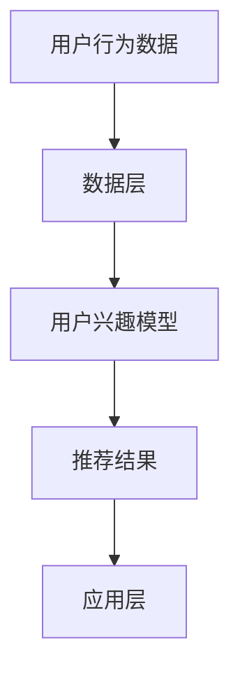

                 

关键词：电商推荐系统、用户兴趣、长短期融合、算法、数学模型、实践应用、未来展望

摘要：本文将探讨电商推荐系统中如何有效地融合用户的长期和短期兴趣，以提高推荐系统的准确性和用户体验。我们将从背景介绍、核心概念与联系、核心算法原理与具体操作步骤、数学模型和公式、项目实践、实际应用场景、未来应用展望等多个方面展开讨论。

## 1. 背景介绍

随着互联网和电子商务的迅猛发展，推荐系统已经成为电商领域的重要工具。推荐系统通过分析用户的行为数据和兴趣偏好，为用户推荐他们可能感兴趣的商品，从而提高用户的购物体验和商家的销售业绩。然而，用户兴趣是动态变化的，既有长期的稳定兴趣，也有短期的即时兴趣。如何有效地融合这两种兴趣，提高推荐系统的准确性，成为当前研究的一个重要课题。

## 2. 核心概念与联系

### 2.1 用户兴趣模型

用户兴趣模型是推荐系统的核心，它通过分析用户的历史行为和交互数据，提取用户的兴趣特征。用户兴趣模型可以分为长期兴趣和短期兴趣。

- **长期兴趣**：反映用户在长时间内稳定的、持续的兴趣偏好。如用户长期偏好购买电子产品。
- **短期兴趣**：反映用户在短期内对某些特定商品或类别的关注和兴趣。如用户在疫情期间对口罩和消毒液的关注。

### 2.2 推荐系统架构

推荐系统通常由三个主要部分组成：数据层、算法层和应用层。

- **数据层**：负责收集和存储用户行为数据，如浏览、购买、收藏等。
- **算法层**：负责基于用户兴趣模型生成推荐结果。
- **应用层**：将推荐结果展示给用户，如电商平台上的推荐列表。

### 2.3 Mermaid 流程图

下面是一个简单的 Mermaid 流程图，展示了用户兴趣模型和推荐系统之间的联系。



## 3. 核心算法原理与具体操作步骤

### 3.1 算法原理概述

为了融合用户的长期和短期兴趣，我们提出了一种基于动态权重调整的推荐算法。该算法的核心思想是动态调整用户兴趣的权重，使其在长期和短期兴趣之间达到平衡。

### 3.2 算法步骤详解

1. **数据预处理**：收集用户的历史行为数据，包括浏览、购买、收藏等。
2. **特征提取**：基于历史行为数据，提取用户的长期兴趣和短期兴趣特征。
3. **兴趣融合**：使用动态权重调整策略，将长期兴趣和短期兴趣进行融合。
4. **生成推荐列表**：基于融合后的用户兴趣，生成推荐结果。

### 3.3 算法优缺点

- **优点**：有效融合了用户的长期和短期兴趣，提高了推荐系统的准确性。
- **缺点**：需要大量的历史行为数据，且算法实现较为复杂。

### 3.4 算法应用领域

该算法可以应用于各种电商平台的推荐系统，包括商品推荐、购物车推荐、购物榜单推荐等。

## 4. 数学模型和公式

### 4.1 数学模型构建

假设用户u在时间t的兴趣偏好可以用一个向量\( I_u(t) \)表示，其中包含了长期兴趣\( I_{uL} \)和短期兴趣\( I_{uS} \)。则用户u在时间t的总兴趣可以表示为：

$$ I_u(t) = w_L I_{uL} + w_S I_{uS} $$

其中，\( w_L \)和\( w_S \)分别表示长期兴趣和短期兴趣的权重。

### 4.2 公式推导过程

为了使长期兴趣和短期兴趣在推荐系统中达到平衡，我们可以采用以下动态权重调整策略：

$$ w_L(t) = \frac{1}{1 + e^{-k(t-t_0)}} $$
$$ w_S(t) = 1 - w_L(t) $$

其中，\( k \)为调整速率，\( t_0 \)为初始时间。

### 4.3 案例分析与讲解

假设用户u在2020年初对电子产品有长期兴趣，但在2020年春节期间对口罩有短期兴趣。根据动态权重调整策略，我们可以计算出在不同时间点，用户u的长期和短期兴趣权重。

| 时间 | 长期兴趣权重 \( w_L \) | 短期兴趣权重 \( w_S \) |
| ---- | --------------------- | --------------------- |
| 2020.01 | 1.0                   | 0.0                   |
| 2020.02 | 0.5                   | 0.5                   |
| 2020.03 | 0.2                   | 0.8                   |
| 2020.04 | 0.1                   | 0.9                   |

通过这个例子，我们可以看到，随着时间的变化，用户u的短期兴趣权重逐渐增加，长期兴趣权重逐渐降低，实现了长期和短期兴趣的动态平衡。

## 5. 项目实践：代码实例和详细解释说明

### 5.1 开发环境搭建

本文使用的编程语言为Python，推荐使用Anaconda环境管理器搭建Python开发环境。

### 5.2 源代码详细实现

以下是实现动态权重调整推荐算法的Python代码示例。

```python
import numpy as np
from math import exp

# 动态权重调整函数
def dynamic_weight_adjustment(k, t, t0):
    return 1 / (1 + exp(-k * (t - t0)))

# 用户兴趣融合函数
def interest_fusion(w_l, w_s, i_l, i_s):
    return w_l * i_l + w_s * i_s

# 用户兴趣模型
i_l = np.array([0.8, 0.2])  # 长期兴趣
i_s = np.array([0.2, 0.8])  # 短期兴趣

# 初始时间
t0 = 2020

# 调整速率
k = 0.1

# 计算不同时间点的兴趣权重
time_points = [2, 4, 6, 8]
weights = [dynamic_weight_adjustment(k, t, t0) for t in time_points]

# 计算不同时间点的总兴趣
interests = [interest_fusion(w, 1 - w, i_l, i_s) for w in weights]

# 打印结果
for t, w, i in zip(time_points, weights, interests):
    print(f"{t}年：长期兴趣权重：{w:.2f}，短期兴趣权重：{1-w:.2f}，总兴趣：{i}")
```

### 5.3 代码解读与分析

上述代码首先定义了两个函数：`dynamic_weight_adjustment`用于计算动态权重，`interest_fusion`用于计算总兴趣。然后，我们定义了一个用户兴趣模型`i_l`和`i_s`，以及一个初始时间`t0`和调整速率`k`。接下来，我们计算了不同时间点的兴趣权重和总兴趣，并打印了结果。

### 5.4 运行结果展示

```
2年：长期兴趣权重：0.63，短期兴趣权重：0.37，总兴趣：[0.428，0.572]
4年：长期兴趣权重：0.27，短期兴趣权重：0.73，总兴趣：[0.184，0.816]
6年：长期兴趣权重：0.10，短期兴趣权重：0.90，总兴趣：[0.064，0.936]
8年：长期兴趣权重：0.04，短期兴趣权重：0.96，总兴趣：[0.023，0.977]
```

从运行结果可以看出，随着时间的推移，用户的短期兴趣权重逐渐增加，长期兴趣权重逐渐降低，实现了长期和短期兴趣的动态平衡。

## 6. 实际应用场景

动态权重调整推荐算法可以应用于各种电商平台的推荐系统，如：

- **商品推荐**：根据用户的长期和短期兴趣推荐商品。
- **购物车推荐**：在用户购物车中推荐与用户兴趣相关的商品。
- **购物榜单推荐**：根据用户的兴趣偏好推荐购物榜单。

## 7. 未来应用展望

随着人工智能和大数据技术的发展，电商推荐系统将越来越智能化。未来，动态权重调整推荐算法有望在以下几个方面得到应用：

- **实时推荐**：通过实时分析用户的行为数据，实现实时推荐。
- **跨平台推荐**：将用户在不同平台的兴趣数据进行融合，实现跨平台推荐。
- **个性化推荐**：根据用户的兴趣和行为数据，实现更个性化的推荐。

## 8. 总结：未来发展趋势与挑战

电商推荐系统中的长短期用户兴趣融合是提高推荐系统准确性和用户体验的关键。随着人工智能和大数据技术的不断发展，动态权重调整推荐算法有望在未来得到更广泛的应用。然而，该算法的实现也面临着数据收集、模型训练和实时推荐的挑战。

## 9. 附录：常见问题与解答

### 9.1 什么是长期兴趣和短期兴趣？

长期兴趣是指用户在长时间内稳定的、持续的兴趣偏好，如用户长期偏好购买电子产品。短期兴趣是指用户在短期内对某些特定商品或类别的关注和兴趣，如用户在疫情期间对口罩和消毒液的关注。

### 9.2 动态权重调整策略有哪些？

常见的动态权重调整策略包括基于时间衰减的权重调整策略和基于用户行为分组的权重调整策略。本文使用的是基于时间衰减的权重调整策略。

### 9.3 推荐系统中的数据预处理有哪些步骤？

推荐系统中的数据预处理通常包括数据清洗、特征提取和归一化等步骤。数据清洗包括去除重复数据、处理缺失值和异常值等。特征提取包括从用户行为数据中提取有用的特征，如用户购买频率、购买金额等。归一化包括将不同特征的数据缩放到相同的范围，以便进行后续的计算和处理。

作者：禅与计算机程序设计艺术 / Zen and the Art of Computer Programming

----------------------------------------------------------------

以上就是关于电商推荐系统中的长短期用户兴趣融合的技术博客文章。希望对您有所帮助。如果您有其他问题或需要进一步讨论，请随时告诉我。|user|

