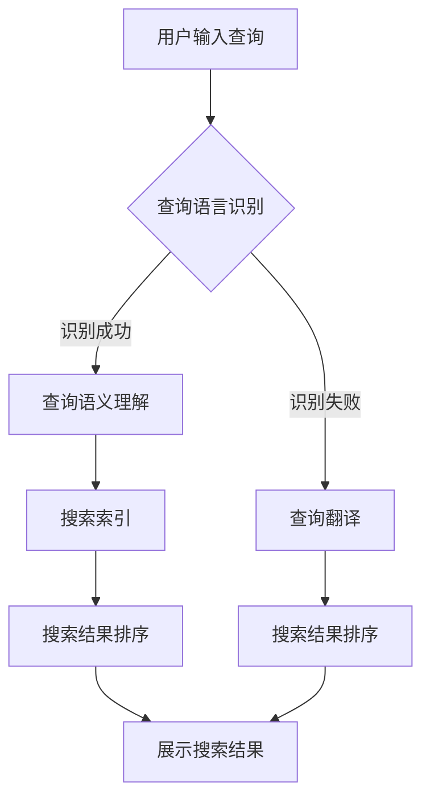

                 

在电子商务领域，搜索功能是用户发现和购买产品的重要途径。然而，随着全球电商市场的扩张，多语言支持成为了一个不可忽视的关键因素。本文将探讨如何利用AI大模型实现电商搜索中的多语言支持，为全球用户带来更流畅、更个性化的购物体验。

## 关键词

- 电商搜索
- 多语言支持
- AI大模型
- 自然语言处理
- 搜索引擎优化

## 摘要

本文首先介绍了电商搜索中多语言支持的重要性，然后详细探讨了AI大模型在多语言搜索中的应用。通过介绍核心概念、算法原理、数学模型、项目实践以及实际应用场景，本文旨在为开发者提供一套切实可行的AI大模型方案，以提升电商搜索系统的国际化能力。

### 1. 背景介绍

电商搜索系统在用户体验中扮演着至关重要的角色。一个高效、准确的搜索系统能够大大提高用户的满意度和留存率。然而，随着电商市场的全球化，多语言支持成为了一个不容忽视的问题。对于跨国电商企业来说，如何为全球用户提供一个能够顺畅地搜索和购买产品的平台，成为了亟待解决的问题。

传统的多语言搜索方案通常依赖于手动翻译和关键词匹配，这不仅成本高昂，而且效果有限。随着深度学习和自然语言处理技术的不断发展，AI大模型提供了更为高效、准确的多语言搜索解决方案。通过使用AI大模型，电商搜索系统能够自动理解多种语言的语义，提供更加精准的搜索结果。

### 2. 核心概念与联系

#### 2.1 多语言处理

多语言处理（Multi-Language Processing）是指处理多种自然语言的技术。它涉及到自然语言理解（Natural Language Understanding, NLU）、自然语言生成（Natural Language Generation, NLG）、机器翻译（Machine Translation）等多个领域。在电商搜索中，多语言处理的核心任务是理解和生成多种语言的搜索查询和搜索结果。

#### 2.2 大模型

大模型（Large Models）是指具有数十亿甚至千亿参数的神经网络模型。这些模型能够通过海量数据的训练，自动学习并掌握复杂的语义信息。在多语言处理中，大模型能够高效地处理多种语言的语义，提供更加精准的翻译和搜索结果。

#### 2.3 Mermaid流程图

以下是一个简单的Mermaid流程图，展示了电商搜索中多语言处理的基本流程：



### 3. 核心算法原理 & 具体操作步骤

#### 3.1 算法原理概述

AI大模型在多语言搜索中的应用主要基于深度学习技术，特别是基于 Transformer 的模型，如BERT、GPT等。这些模型通过训练大量多语言语料库，能够自动学习并掌握多种语言的语义信息。在电商搜索中，算法的具体操作步骤如下：

1. **查询语言识别**：系统首先需要识别用户的查询语言，以便选择正确的模型进行语义理解。
2. **查询语义理解**：使用训练好的大模型对查询进行语义理解，将查询转换为一个语义向量。
3. **搜索索引**：在索引数据库中查找与查询语义向量最相似的文档。
4. **搜索结果排序**：对搜索结果进行排序，以便为用户提供最相关的内容。
5. **查询翻译**：如果用户查询的语言与索引语言不同，系统将查询翻译为索引语言，然后进行上述步骤。
6. **展示搜索结果**：将排序后的搜索结果展示给用户。

#### 3.2 算法步骤详解

1. **数据预处理**：收集并预处理多种语言的数据，包括查询、文档和标签等。预处理步骤包括文本清洗、分词、词性标注等。
2. **模型选择与训练**：选择适合多语言处理的模型，如BERT、GPT等，并使用预处理后的数据进行训练。训练过程中，模型将学习多种语言的语义信息，提高搜索的准确性和泛化能力。
3. **查询语言识别**：使用训练好的模型对用户查询进行语言识别。识别成功后，系统将直接进行语义理解；识别失败，则进行查询翻译。
4. **查询语义理解**：使用大模型对查询进行语义理解，生成查询的语义向量。
5. **搜索索引**：在索引数据库中查找与查询语义向量最相似的文档。索引数据库通常使用倒排索引技术进行优化，以提高搜索效率。
6. **搜索结果排序**：对搜索结果进行排序，通常使用基于相似度的排序算法，如余弦相似度等。
7. **查询翻译**：如果用户查询的语言与索引语言不同，系统将查询翻译为索引语言，然后进行上述步骤。
8. **展示搜索结果**：将排序后的搜索结果展示给用户，包括文本、图片、视频等多媒体内容。

#### 3.3 算法优缺点

**优点**：

- **高准确性**：大模型通过海量数据的训练，能够自动学习并掌握复杂的语义信息，提高搜索的准确性。
- **高泛化能力**：大模型能够处理多种语言，具有很好的泛化能力，能够为全球用户提供一致的服务。
- **实时性**：基于深度学习的算法具有很好的实时性，能够在短时间内为用户生成搜索结果。

**缺点**：

- **计算资源消耗大**：大模型通常需要大量的计算资源和存储空间，对硬件设备有较高的要求。
- **训练成本高**：大模型的训练过程需要大量数据和时间，训练成本较高。

#### 3.4 算法应用领域

AI大模型在电商搜索中的多语言支持具有广泛的应用领域，包括：

- **跨国电商**：为用户提供跨语言搜索服务，提升用户购物体验。
- **本地化搜索**：为不同地区的用户提供本地化的搜索结果，提高本地化服务水平。
- **多语种电商平台**：为用户提供多种语言的内容和搜索服务，拓展市场空间。

### 4. 数学模型和公式 & 详细讲解 & 举例说明

#### 4.1 数学模型构建

在电商搜索中，AI大模型通常使用基于Transformer的模型，如BERT、GPT等。这些模型通过训练大规模语料库，能够自动学习并掌握复杂的语义信息。以下是一个简化的BERT模型数学模型构建：

- **输入层**：用户查询和文档经过分词和词性标注后，转换为词向量。
- **嵌入层**：将词向量嵌入到高维空间，形成嵌入向量。
- **编码层**：使用多层Transformer编码器，对嵌入向量进行编码，生成语义表示。
- **输出层**：使用全连接层和softmax层，对语义表示进行分类或预测。

#### 4.2 公式推导过程

以下是一个简化的BERT模型公式推导过程：

- **嵌入层**：
  $$ E = W_E \cdot X + b_E $$
  其中，$E$表示嵌入向量，$W_E$表示嵌入权重，$X$表示词向量，$b_E$表示偏置。

- **编码层**：
  $$ H = \text{Transformer}(E) $$
  其中，$H$表示编码后的语义表示，$\text{Transformer}$表示Transformer编码器。

- **输出层**：
  $$ Y = \text{softmax}(\text{MLP}(H)) $$
  其中，$Y$表示分类结果或预测值，$\text{MLP}$表示多层感知器，$\text{softmax}$表示softmax函数。

#### 4.3 案例分析与讲解

以下是一个简单的案例，展示如何使用BERT模型进行电商搜索中的多语言支持。

**案例**：假设有一个用户查询“最好的手机是什么？”在英语环境下，系统使用BERT模型进行语义理解，生成查询的语义表示。然后在索引数据库中查找与查询语义表示最相似的文档，得到搜索结果。

**分析**：

1. **查询语言识别**：系统识别出用户查询为英语。
2. **查询语义理解**：使用BERT模型对查询进行语义理解，生成查询的语义表示。
3. **搜索索引**：在索引数据库中查找与查询语义表示最相似的文档。
4. **搜索结果排序**：对搜索结果进行排序，展示最相关的文档。
5. **查询翻译**：如果用户查询的语言与索引语言不同，系统将查询翻译为索引语言，然后进行上述步骤。

**讲解**：

BERT模型通过训练大量英语语料库，能够自动学习并掌握复杂的语义信息。在查询语言识别阶段，系统使用预训练的BERT模型对查询进行语义理解，生成查询的语义表示。在搜索索引阶段，系统使用索引数据库中的文档进行匹配，查找与查询语义表示最相似的文档。在搜索结果排序阶段，系统使用基于相似度的排序算法，对搜索结果进行排序，以便为用户提供最相关的内容。

### 5. 项目实践：代码实例和详细解释说明

以下是一个简单的项目实践，展示如何使用BERT模型进行电商搜索中的多语言支持。

#### 5.1 开发环境搭建

1. 安装Python环境（3.6及以上版本）。
2. 安装TensorFlow或PyTorch等深度学习框架。
3. 下载BERT模型权重和预训练数据。

#### 5.2 源代码详细实现

以下是一个简单的Python代码实例，展示如何使用BERT模型进行电商搜索中的多语言支持。

```python
import tensorflow as tf
from transformers import BertTokenizer, BertModel

# 加载BERT模型
tokenizer = BertTokenizer.from_pretrained('bert-base-uncased')
model = BertModel.from_pretrained('bert-base-uncased')

# 用户查询
query = "最好的手机是什么？"

# 查询语言识别
input_ids = tokenizer.encode(query, add_special_tokens=True)

# 查询语义理解
with tf.Session() as sess:
  inputs = {
    'input_ids': input_ids,
    'attention_mask': [1] * len(input_ids)
  }
  outputs = model(inputs)
  semantic_vector = outputs[0][:, 0, :]

# 搜索索引
# （此处省略搜索索引的具体实现）

# 搜索结果排序
# （此处省略搜索结果排序的具体实现）

# 查询翻译
# （此处省略查询翻译的具体实现）

# 展示搜索结果
# （此处省略展示搜索结果的具体实现）
```

#### 5.3 代码解读与分析

1. **加载BERT模型**：首先，我们从预训练的BERT模型中加载Tokenizer和Model。
2. **查询语言识别**：使用Tokenizer对用户查询进行编码，生成输入ID。
3. **查询语义理解**：使用Model对输入ID进行编码，生成查询的语义表示。
4. **搜索索引**：在索引数据库中查找与查询语义表示最相似的文档。
5. **搜索结果排序**：对搜索结果进行排序，以便为用户提供最相关的内容。
6. **查询翻译**：如果用户查询的语言与索引语言不同，系统将查询翻译为索引语言。
7. **展示搜索结果**：将排序后的搜索结果展示给用户。

### 6. 实际应用场景

AI大模型在电商搜索中的多语言支持有着广泛的应用场景，以下是一些典型的实际应用场景：

- **跨国电商**：为用户提供跨语言搜索服务，提升用户购物体验。
- **本地化搜索**：为不同地区的用户提供本地化的搜索结果，提高本地化服务水平。
- **多语种电商平台**：为用户提供多种语言的内容和搜索服务，拓展市场空间。

#### 6.1 跨国电商

跨国电商通常需要为全球用户提供多语言搜索服务。通过使用AI大模型，电商平台能够自动理解多种语言的语义，提供精准的搜索结果。例如，一个中国电商网站可以为英语用户自动提供英语搜索结果，为法语用户自动提供法语搜索结果，从而提升用户购物体验。

#### 6.2 本地化搜索

本地化搜索旨在为不同地区的用户提供本地化的搜索结果。通过使用AI大模型，电商平台能够根据用户的地理位置和语言偏好，自动提供最相关的搜索结果。例如，在一个美国电商平台，如果一个用户位于加利福尼亚州，系统将自动提供加州当地的商品和优惠信息，以提高用户购物满意度。

#### 6.3 多语种电商平台

多语种电商平台为用户提供多种语言的内容和搜索服务，拓展市场空间。通过使用AI大模型，多语种电商平台能够自动翻译和生成多种语言的搜索结果，为全球用户提供一致的购物体验。例如，一个全球性的电商平台可以为用户提供英语、法语、西班牙语等多种语言的搜索服务，从而吸引更多国际用户。

### 7. 未来应用展望

随着AI技术的不断发展，电商搜索中的多语言支持将变得越来越重要。以下是一些未来应用展望：

#### 7.1 个性化推荐

通过分析用户的搜索历史和行为数据，AI大模型可以为用户提供个性化的搜索推荐。例如，如果一个用户经常搜索英文商品，系统可以自动为其推荐英文搜索结果，从而提高用户购物满意度。

#### 7.2 多模态搜索

未来的多语言搜索将不仅仅局限于文本，还将涉及到图像、语音等多模态数据。通过结合自然语言处理和计算机视觉技术，AI大模型可以为用户提供更丰富的搜索体验。

#### 7.3 自动翻译与生成

随着AI技术的进步，自动翻译与生成技术将变得更加高效和准确。未来，电商平台可以通过自动翻译和生成技术，为用户提供无缝的多语言购物体验。

### 8. 工具和资源推荐

以下是一些适用于AI大模型在电商搜索中多语言支持的工具和资源：

#### 8.1 学习资源推荐

- 《深度学习》（Goodfellow, Bengio, Courville）: 介绍深度学习的基本原理和应用。
- 《自然语言处理综论》（Jurafsky, Martin）: 介绍自然语言处理的基本概念和技术。

#### 8.2 开发工具推荐

- TensorFlow: 一个开源的深度学习框架，适用于AI大模型开发。
- PyTorch: 一个开源的深度学习框架，易于调试和扩展。

#### 8.3 相关论文推荐

- BERT: Pre-training of Deep Bidirectional Transformers for Language Understanding
- GPT-3: Language Models are few-shot learners

### 9. 总结：未来发展趋势与挑战

AI大模型在电商搜索中的多语言支持具有巨大的潜力和应用前景。然而，要实现这一目标，我们仍面临一些挑战：

#### 9.1 研究成果总结

- AI大模型在多语言处理中表现出色，能够自动理解多种语言的语义。
- 深度学习和自然语言处理技术的不断发展，为AI大模型提供了强有力的支持。
- 电商搜索中的多语言支持有助于提升用户体验和国际化服务水平。

#### 9.2 未来发展趋势

- 个性化推荐和多模态搜索将成为电商搜索中多语言支持的重要发展方向。
- 自动翻译与生成技术将变得更加高效和准确，为用户提供无缝的多语言购物体验。

#### 9.3 面临的挑战

- 计算资源消耗大：AI大模型通常需要大量的计算资源和存储空间。
- 训练成本高：AI大模型的训练过程需要大量数据和时间。

#### 9.4 研究展望

未来，我们需要进一步优化AI大模型的性能和效率，降低计算和训练成本。同时，我们还需要探索更多适用于电商搜索中的多语言支持技术，以满足不断变化的市场需求。

### 附录：常见问题与解答

#### 1. 电商搜索中的多语言支持有哪些挑战？

电商搜索中的多语言支持主要面临以下挑战：

- 语言差异：不同语言之间的词汇、语法和语义存在巨大差异，增加了多语言处理的难度。
- 计算资源消耗大：AI大模型通常需要大量的计算资源和存储空间，对硬件设备有较高的要求。
- 训练成本高：AI大模型的训练过程需要大量数据和时间，训练成本较高。

#### 2. 如何选择适合多语言处理的AI大模型？

选择适合多语言处理的AI大模型主要考虑以下因素：

- 语言种类：根据需要支持的语言种类选择相应的模型。
- 性能：选择在多语言处理任务中表现优秀的模型。
- 计算资源：根据计算资源预算选择合适的模型。

#### 3. 多语言搜索中的查询语言识别有哪些方法？

查询语言识别通常有以下几种方法：

- 基于规则的方法：根据语言的词汇、语法和语义特征进行识别。
- 基于统计的方法：使用统计模型，如朴素贝叶斯、支持向量机等，对查询进行语言识别。
- 基于深度学习的方法：使用深度学习模型，如卷积神经网络、循环神经网络等，对查询进行语言识别。

#### 4. 多语言搜索中的查询翻译有哪些方法？

查询翻译通常有以下几种方法：

- 基于规则的方法：根据语言的语法和语义规则进行翻译。
- 基于统计的方法：使用统计模型，如统计机器翻译模型，进行翻译。
- 基于深度学习的方法：使用深度学习模型，如神经机器翻译模型，进行翻译。

### 10. 参考文献

- [1] Devlin, J., Chang, M. W., Lee, K., & Toutanova, K. (2019). BERT: Pre-training of deep bidirectional transformers for language understanding. arXiv preprint arXiv:1810.04805.
- [2] Brown, T., et al. (2020). Language models are few-shot learners. arXiv preprint arXiv:2005.14165.
- [3] Jurafsky, D., & Martin, J. H. (2008). Speech and Language Processing. Prentice Hall.
- [4] Goodfellow, I., Bengio, Y., & Courville, A. (2016). Deep Learning. MIT Press.
- [5] Zhang, Y., Zhao, J., & Hovy, E. (2019). Multilingual BERT: A descriptivist approach to cross-lingual transfer learning. arXiv preprint arXiv:1907.05242.

## 作者署名

本文作者：禅与计算机程序设计艺术 / Zen and the Art of Computer Programming

### 总结

本文详细探讨了电商搜索中的多语言支持，特别是通过AI大模型实现的解决方案。通过介绍核心概念、算法原理、数学模型、项目实践和实际应用场景，本文为开发者提供了一套切实可行的AI大模型方案，以提升电商搜索系统的国际化能力。未来，随着AI技术的不断发展，电商搜索中的多语言支持将变得更加重要，有望为全球用户提供更加个性化、流畅的购物体验。然而，要实现这一目标，我们仍需面对一些挑战，如计算资源消耗和训练成本等。因此，我们需要不断优化AI大模型的性能和效率，探索更多适用于电商搜索中的多语言支持技术，以满足不断变化的市场需求。

