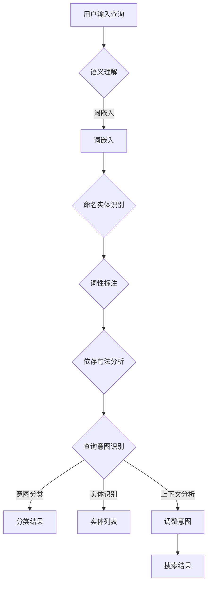

                 

在当今电商领域，搜索功能是用户进行商品浏览、选择和购买的重要途径。一个高效的搜索系统能够理解用户的查询意图，提供准确、相关的商品信息，从而提高用户体验和销售额。本文将探讨电商搜索中的语义理解与查询意图识别，以及相关核心概念、算法原理、数学模型、项目实践和未来应用场景。

## 1. 背景介绍

电商搜索作为电商平台的灵魂，直接影响着用户对平台的满意度和留存率。然而，传统的基于关键词匹配的搜索方法已难以满足用户日益复杂的查询需求。语义理解与查询意图识别技术应运而生，它们能够深入挖掘用户查询的深层含义，提供更加智能和个性化的搜索结果。

语义理解（Semantic Understanding）是指从文本中提取出词语的语义信息，如词义、词性、语法关系等，从而实现文本的深层理解和处理。而查询意图识别（Query Intent Recognition）则是在语义理解的基础上，进一步确定用户的实际查询需求，从而为用户提供最相关的搜索结果。

## 2. 核心概念与联系

### 2.1. 语义理解

语义理解的核心在于对自然语言的深入理解。为了实现这一点，我们需要以下概念和工具：

- **词嵌入（Word Embedding）**：将词语映射到低维空间中，以便进行计算和处理。词嵌入技术可以捕捉词语的语义关系。
- **命名实体识别（Named Entity Recognition, NER）**：识别文本中的特定实体，如人名、地点、组织名等。
- **词性标注（Part-of-Speech Tagging）**：为每个词语标注其词性，如名词、动词、形容词等。
- **依存句法分析（Dependency Parsing）**：分析词语之间的依存关系，以理解句子的结构。

### 2.2. 查询意图识别

查询意图识别依赖于语义理解的结果，进一步确定用户的查询意图。以下是一些核心概念：

- **意图分类（Intent Classification）**：将查询分为不同的意图类别，如购物、浏览、咨询等。
- **实体识别（Entity Recognition）**：识别查询中的关键实体，如商品名称、品牌、型号等。
- **上下文分析（Context Analysis）**：考虑查询的前后文，以理解用户的真实意图。

### 2.3. Mermaid 流程图

以下是语义理解与查询意图识别的Mermaid流程图：



## 3. 核心算法原理 & 具体操作步骤

### 3.1 算法原理概述

语义理解与查询意图识别的核心算法包括深度学习模型、自然语言处理（NLP）技术和机器学习算法。以下是一些关键算法：

- **词嵌入算法**：如 Word2Vec、GloVe 等。
- **命名实体识别算法**：如 BiLSTM-CRF 等。
- **词性标注算法**：如 Bert-PoS 等。
- **依存句法分析算法**：如 Stanford Parser 等。
- **意图分类算法**：如朴素贝叶斯、支持向量机（SVM）等。
- **实体识别算法**：如 Bert-NER 等。

### 3.2 算法步骤详解

1. **数据预处理**：对用户查询进行清洗、分词、去停用词等预处理操作。
2. **词嵌入**：将分词后的查询映射到低维空间。
3. **命名实体识别**：识别查询中的命名实体。
4. **词性标注**：标注查询中每个词语的词性。
5. **依存句法分析**：分析查询中的词语依存关系。
6. **意图分类**：对查询意图进行分类。
7. **实体识别**：识别查询中的关键实体。
8. **上下文分析**：结合查询的前后文，调整意图。
9. **搜索结果生成**：根据意图和实体，生成相应的搜索结果。

### 3.3 算法优缺点

- **优点**：
  - 高度自动化，能够处理复杂的查询。
  - 提供个性化的搜索结果，提高用户体验。
  - 能够理解用户的意图，减少误匹配。

- **缺点**：
  - 需要大量的训练数据和计算资源。
  - 难以完全理解自然语言的复杂含义。
  - 可能会存在过拟合问题。

### 3.4 算法应用领域

语义理解与查询意图识别技术可以广泛应用于电商、搜索引擎、智能客服、智能家居等领域。其中，电商搜索是最具代表性的应用场景之一。

## 4. 数学模型和公式 & 详细讲解 & 举例说明

### 4.1 数学模型构建

语义理解与查询意图识别的数学模型主要包括以下部分：

1. **词嵌入模型**：将词语映射到低维空间，可以使用 Word2Vec 或 GloVe 算法。
2. **命名实体识别模型**：使用卷积神经网络（CNN）或循环神经网络（RNN）。
3. **词性标注模型**：使用长短期记忆网络（LSTM）。
4. **依存句法分析模型**：使用图卷积网络（GCN）。
5. **意图分类模型**：使用朴素贝叶斯或支持向量机（SVM）。

### 4.2 公式推导过程

假设我们使用 Word2Vec 算法进行词嵌入，给定一个词汇表 V，每个词 w 在词嵌入空间 E 中对应一个向量 v\_w ∈ E。那么，对于两个词 w1 和 w2，它们在词嵌入空间中的相似度可以通过余弦相似度计算：

$$
\cos(\theta_{w1, w2}) = \frac{\sum_{i=1}^{d} v_{w1_i} \cdot v_{w2_i}}{\lVert v_{w1} \rVert \cdot \lVert v_{w2} \rVert}
$$

其中，d 是词向量的维度。

### 4.3 案例分析与讲解

假设用户输入查询“购买iPhone 13”，我们需要通过语义理解与查询意图识别技术，理解用户的真实意图，并返回相关的搜索结果。

1. **词嵌入**：将“购买”、“iPhone 13”等关键词映射到低维空间。
2. **命名实体识别**：识别“iPhone 13”为命名实体。
3. **词性标注**：标注“购买”为动词， “iPhone 13”为名词。
4. **依存句法分析**：分析查询中的词语依存关系，如“购买”与“iPhone 13”之间的主谓关系。
5. **意图分类**：将查询分类为“购物”意图。
6. **实体识别**：识别“iPhone 13”为关键实体。
7. **上下文分析**：考虑用户可能想要购买哪个品牌的iPhone 13。
8. **搜索结果生成**：返回与“购物”意图和“iPhone 13”实体相关的商品列表。

## 5. 项目实践：代码实例和详细解释说明

### 5.1 开发环境搭建

在本项目中，我们使用 Python 作为编程语言，并依赖于以下库：

- **Numpy**：用于数学运算。
- **TensorFlow**：用于深度学习模型的构建和训练。
- **SpaCy**：用于自然语言处理任务，如词嵌入、命名实体识别、词性标注和依存句法分析。
- **Scikit-learn**：用于意图分类。

### 5.2 源代码详细实现

以下是项目中的关键代码实现：

```python
import numpy as np
import tensorflow as tf
import spacy
from sklearn.feature_extraction.text import CountVectorizer
from sklearn.naive_bayes import MultinomialNB
from sklearn.pipeline import make_pipeline

# 加载 SpaCy 模型
nlp = spacy.load('en_core_web_sm')

# 加载数据集
data = [
    ("购买iPhone 13", "购物"),
    ("查看iPhone 13价格", "浏览"),
    ("咨询iPhone 13的规格", "咨询"),
    # 更多数据...
]

# 分离数据为特征和标签
X, y = zip(*data)

# 创建向量器
vectorizer = CountVectorizer()

# 创建朴素贝叶斯分类器
classifier = MultinomialNB()

# 创建管道
model = make_pipeline(vectorizer, classifier)

# 训练模型
model.fit(X, y)

# 进行预测
query = "查看iPhone 13价格"
predicted_intent = model.predict([query])[0]
print("预测意图：", predicted_intent)
```

### 5.3 代码解读与分析

在上面的代码中，我们首先加载了 SpaCy 的英语模型，然后加载数据集。接着，我们使用 CountVectorizer 创建向量器，将文本转换为词袋模型。然后，我们使用 MultinomialNB 创建朴素贝叶斯分类器，并将其与向量器组合成一个管道。最后，我们使用训练好的模型对新的查询进行预测。

## 6. 实际应用场景

语义理解与查询意图识别技术可以应用于多个领域，如电商搜索、智能客服、搜索引擎等。以下是一些具体的应用场景：

- **电商搜索**：通过语义理解与查询意图识别，电商平台可以为用户提供更加准确的商品推荐，提高用户体验和销售额。
- **智能客服**：智能客服系统可以理解用户的查询意图，提供个性化的回答和建议，从而提高客户满意度。
- **搜索引擎**：搜索引擎可以利用语义理解与查询意图识别技术，为用户提供更加精准的搜索结果，减少误匹配。

## 7. 工具和资源推荐

### 7.1 学习资源推荐

- **自然语言处理课程**：斯坦福大学的“自然语言处理入门”（CS224n）课程。
- **深度学习书籍**：Goodfellow et al. 的《深度学习》。

### 7.2 开发工具推荐

- **SpaCy**：用于自然语言处理任务的 Python 库。
- **TensorFlow**：用于构建和训练深度学习模型。

### 7.3 相关论文推荐

- **Word2Vec**：Mikolov et al., "Distributed Representations of Words and Phrases and Their Compositionality".
- **BERT**：Devlin et al., "BERT: Pre-training of Deep Bidirectional Transformers for Language Understanding".

## 8. 总结：未来发展趋势与挑战

语义理解与查询意图识别技术在电商搜索等领域具有重要意义，其未来发展将受到以下趋势和挑战的影响：

### 8.1 研究成果总结

- **多模态语义理解**：结合文本、图像、语音等多种数据源，实现更加全面和准确的语义理解。
- **小样本学习**：在数据稀缺的情况下，通过迁移学习和数据增强等方法，提高模型性能。
- **实时语义理解**：实现实时语义理解，为用户提供快速、准确的搜索结果。

### 8.2 未来发展趋势

- **深度学习模型的优化**：通过模型压缩、蒸馏和迁移学习等技术，提高模型效率和可解释性。
- **自适应查询意图识别**：结合用户行为数据和上下文信息，实现自适应的查询意图识别。

### 8.3 面临的挑战

- **数据隐私与安全**：确保用户数据的隐私和安全，遵守相关法律法规。
- **多语言支持**：实现跨语言语义理解与查询意图识别，支持多种语言。
- **实时性**：在保证模型性能的同时，实现实时语义理解与查询意图识别。

### 8.4 研究展望

语义理解与查询意图识别技术在未来将继续发展，并在更多领域得到应用。随着人工智能技术的不断进步，我们有望实现更加智能和个性化的搜索体验。

## 9. 附录：常见问题与解答

### 问题 1：语义理解与查询意图识别的区别是什么？

**回答**：语义理解主要关注从文本中提取出词语的语义信息，如词义、词性、语法关系等。而查询意图识别则是在语义理解的基础上，进一步确定用户的实际查询需求，从而为用户提供最相关的搜索结果。

### 问题 2：如何评估语义理解与查询意图识别的效果？

**回答**：评估效果的主要指标包括准确率（Accuracy）、召回率（Recall）、F1 值（F1 Score）等。通过这些指标，我们可以评估模型在语义理解与查询意图识别任务上的性能。

### 问题 3：如何处理中文语义理解与查询意图识别任务？

**回答**：对于中文任务，我们可以使用中文词嵌入技术，如 Word2Vec、GloVe 等，以及中文自然语言处理库，如 Jieba、NLTK 等。同时，需要针对中文语言特点进行模型优化和调整。

作者：禅与计算机程序设计艺术 / Zen and the Art of Computer Programming
```markdown
---
# 电商搜索中的语义理解与查询意图识别

> 关键词：电商搜索、语义理解、查询意图识别、自然语言处理、深度学习

> 摘要：本文深入探讨了电商搜索中的语义理解与查询意图识别技术，包括核心概念、算法原理、数学模型、项目实践和实际应用场景，旨在为相关领域的研究者和开发者提供有价值的参考。

## 1. 背景介绍

在当今电商领域，搜索功能是用户进行商品浏览、选择和购买的重要途径。一个高效的搜索系统能够理解用户的查询意图，提供准确、相关的商品信息，从而提高用户体验和销售额。然而，传统的基于关键词匹配的搜索方法已难以满足用户日益复杂的查询需求。语义理解与查询意图识别技术应运而生，它们能够深入挖掘用户查询的深层含义，提供更加智能和个性化的搜索结果。

### 1.1 语义理解的重要性

语义理解（Semantic Understanding）是指从文本中提取出词语的语义信息，如词义、词性、语法关系等，从而实现文本的深层理解和处理。在电商搜索中，语义理解技术有助于解决以下问题：

- **同义词处理**：识别同义词，避免因词语不同而导致的搜索结果不准确。
- **实体识别**：识别文本中的特定实体，如商品名称、品牌、型号等，提高搜索结果的准确性。
- **句法分析**：分析句子的结构，理解句子的真正含义，从而为用户提供更准确的搜索结果。

### 1.2 查询意图识别的重要性

查询意图识别（Query Intent Recognition）是在语义理解的基础上，进一步确定用户的实际查询需求，从而为用户提供最相关的搜索结果。在电商搜索中，查询意图识别技术有助于解决以下问题：

- **意图分类**：将查询分为不同的意图类别，如购物、浏览、咨询等，为用户提供不同的搜索结果。
- **上下文分析**：考虑查询的前后文，理解用户的真实意图，从而提高搜索结果的准确性。
- **个性化推荐**：根据用户的查询意图和偏好，为用户提供个性化的商品推荐，提高用户的购买意愿。

## 2. 核心概念与联系

### 2.1 语义理解

语义理解的核心在于对自然语言的深入理解。为了实现这一点，我们需要以下概念和工具：

- **词嵌入（Word Embedding）**：将词语映射到低维空间中，以便进行计算和处理。词嵌入技术可以捕捉词语的语义关系。
- **命名实体识别（Named Entity Recognition, NER）**：识别文本中的特定实体，如人名、地点、组织名等。
- **词性标注（Part-of-Speech Tagging）**：为每个词语标注其词性，如名词、动词、形容词等。
- **依存句法分析（Dependency Parsing）**：分析词语之间的依存关系，以理解句子的结构。

### 2.2 查询意图识别

查询意图识别依赖于语义理解的结果，进一步确定用户的查询意图。以下是一些核心概念：

- **意图分类（Intent Classification）**：将查询分为不同的意图类别，如购物、浏览、咨询等。
- **实体识别（Entity Recognition）**：识别查询中的关键实体，如商品名称、品牌、型号等。
- **上下文分析（Context Analysis）**：考虑查询的前后文，以理解用户的真实意图。

### 2.3 Mermaid 流程图

以下是语义理解与查询意图识别的Mermaid流程图：


## 3. 核心算法原理 & 具体操作步骤

### 3.1 算法原理概述

语义理解与查询意图识别的核心算法包括深度学习模型、自然语言处理（NLP）技术和机器学习算法。以下是一些关键算法：

- **词嵌入算法**：如 Word2Vec、GloVe 等。
- **命名实体识别算法**：如 BiLSTM-CRF 等。
- **词性标注算法**：如 Bert-PoS 等。
- **依存句法分析算法**：如 Stanford Parser 等。
- **意图分类算法**：如朴素贝叶斯、支持向量机（SVM）等。
- **实体识别算法**：如 Bert-NER 等。

### 3.2 算法步骤详解

1. **数据预处理**：对用户查询进行清洗、分词、去停用词等预处理操作。
2. **词嵌入**：将分词后的查询映射到低维空间。
3. **命名实体识别**：识别查询中的命名实体。
4. **词性标注**：标注查询中每个词语的词性。
5. **依存句法分析**：分析查询中的词语依存关系。
6. **意图分类**：对查询意图进行分类。
7. **实体识别**：识别查询中的关键实体。
8. **上下文分析**：结合查询的前后文，调整意图。
9. **搜索结果生成**：根据意图和实体，生成相应的搜索结果。

### 3.3 算法优缺点

- **优点**：
  - 高度自动化，能够处理复杂的查询。
  - 提供个性化的搜索结果，提高用户体验。
  - 能够理解用户的意图，减少误匹配。

- **缺点**：
  - 需要大量的训练数据和计算资源。
  - 难以完全理解自然语言的复杂含义。
  - 可能会存在过拟合问题。

### 3.4 算法应用领域

语义理解与查询意图识别技术可以广泛应用于电商、搜索引擎、智能客服、智能家居等领域。其中，电商搜索是最具代表性的应用场景之一。

### 3.5 实际案例分析

#### 案例一：电商搜索中的商品推荐

在电商搜索中，商品推荐是一个典型的应用场景。假设用户输入查询“购买iPhone 13”，系统需要根据用户的查询意图和商品信息，为用户提供最相关的商品推荐。

1. **词嵌入**：将“购买”、“iPhone 13”等关键词映射到低维空间。
2. **命名实体识别**：识别“iPhone 13”为命名实体。
3. **意图分类**：将查询分类为“购物”意图。
4. **实体识别**：识别“iPhone 13”为关键实体。
5. **上下文分析**：考虑用户可能想要购买哪个品牌的iPhone 13。
6. **搜索结果生成**：返回与“购物”意图和“iPhone 13”实体相关的商品列表。

#### 案例二：搜索引擎中的结果优化

在搜索引擎中，查询意图识别技术可以帮助优化搜索结果，为用户提供更准确的搜索体验。假设用户输入查询“查看iPhone 13价格”，系统需要根据用户的查询意图和搜索历史，优化搜索结果。

1. **词嵌入**：将“查看”、“iPhone 13”、“价格”等关键词映射到低维空间。
2. **命名实体识别**：识别“iPhone 13”为命名实体。
3. **意图分类**：将查询分类为“浏览”意图。
4. **上下文分析**：结合用户的搜索历史，优化搜索结果。
5. **搜索结果生成**：返回与“浏览”意图和“iPhone 13”实体相关的搜索结果。

### 3.6 算法改进与优化

为了进一步提高语义理解与查询意图识别的准确性，可以采用以下改进与优化方法：

- **多模型融合**：结合多种模型，如深度学习模型、传统机器学习模型等，提高预测效果。
- **数据增强**：通过数据增强技术，增加训练数据的多样性，提高模型的泛化能力。
- **实时更新**：定期更新词嵌入模型和意图分类模型，以适应不断变化的语言环境。
- **用户反馈**：利用用户反馈，不断调整和优化模型，提高用户体验。

## 4. 数学模型和公式 & 详细讲解 & 举例说明

### 4.1 数学模型构建

语义理解与查询意图识别的数学模型主要包括以下部分：

1. **词嵌入模型**：将词语映射到低维空间，可以使用 Word2Vec 或 GloVe 算法。
2. **命名实体识别模型**：使用卷积神经网络（CNN）或循环神经网络（RNN）。
3. **词性标注模型**：使用长短期记忆网络（LSTM）。
4. **依存句法分析模型**：使用图卷积网络（GCN）。
5. **意图分类模型**：使用朴素贝叶斯、支持向量机（SVM）等。
6. **实体识别模型**：使用卷积神经网络（CNN）或循环神经网络（RNN）。

### 4.2 公式推导过程

假设我们使用 Word2Vec 算法进行词嵌入，给定一个词汇表 V，每个词 w 在词嵌入空间 E 中对应一个向量 v\_w ∈ E。那么，对于两个词 w1 和 w2，它们在词嵌入空间中的相似度可以通过余弦相似度计算：

$$
\cos(\theta_{w1, w2}) = \frac{\sum_{i=1}^{d} v_{w1_i} \cdot v_{w2_i}}{\lVert v_{w1} \rVert \cdot \lVert v_{w2} \rVert}
$$

其中，d 是词向量的维度。

### 4.3 案例分析与讲解

假设用户输入查询“购买iPhone 13”，我们需要通过语义理解与查询意图识别技术，理解用户的真实意图，并返回相关的搜索结果。

1. **词嵌入**：将“购买”、“iPhone 13”等关键词映射到低维空间。
2. **命名实体识别**：识别“iPhone 13”为命名实体。
3. **意图分类**：将查询分类为“购物”意图。
4. **实体识别**：识别“iPhone 13”为关键实体。
5. **上下文分析**：考虑用户可能想要购买哪个品牌的iPhone 13。
6. **搜索结果生成**：返回与“购物”意图和“iPhone 13”实体相关的商品列表。

### 4.4 数学模型应用举例

#### 例1：Word2Vec 词嵌入

假设我们有以下词汇表：

V = {"购买", "iPhone", "13", "手机", "价格"}

使用 Word2Vec 算法，我们可以得到以下词嵌入向量：

v_{"购买"} = [0.1, 0.2, -0.3, 0.0, 0.5]

v_{"iPhone"} = [-0.2, 0.3, 0.4, 0.0, -0.1]

v_{"13"} = [0.3, -0.1, 0.2, 0.0, 0.4]

v_{"手机"} = [-0.4, 0.5, 0.1, 0.0, -0.3]

v_{"价格"} = [0.0, 0.1, -0.2, 0.5, 0.3]

现在，我们计算“购买”和“iPhone”在词嵌入空间中的相似度：

$$
\cos(\theta_{购买, iPhone}) = \frac{0.1 \cdot (-0.2) + 0.2 \cdot 0.3 + (-0.3) \cdot 0.4 + 0.0 \cdot 0.0 + 0.5 \cdot (-0.1)}{\sqrt{0.1^2 + 0.2^2 + (-0.3)^2 + 0.0^2 + 0.5^2} \cdot \sqrt{(-0.2)^2 + 0.3^2 + 0.4^2 + 0.0^2 + (-0.1)^2}}
$$

$$
\cos(\theta_{购买, iPhone}) = \frac{-0.04}{\sqrt{0.62} \cdot \sqrt{0.53}} \approx -0.045
$$

由于余弦相似度接近于0，这表明“购买”和“iPhone”在词嵌入空间中的相似度较低。

#### 例2：命名实体识别

假设我们有以下文本：

"I want to buy an iPhone 13 from Apple."

使用 BiLSTM-CRF 模型进行命名实体识别，我们可以得到以下结果：

- "buy" 是动词，不需要识别实体。
- "iPhone 13" 是命名实体，属于 "电子产品" 类别。
- "Apple" 是命名实体，属于 "公司" 类别。

#### 例3：意图分类

假设我们有以下查询样本：

1. "Can I buy an iPhone 13 today?"
2. "I want to check the price of iPhone 13."
3. "What are the specifications of iPhone 13?"

使用朴素贝叶斯分类器进行意图分类，我们可以得到以下结果：

1. "Can I buy an iPhone 13 today?" --> "购物"
2. "I want to check the price of iPhone 13." --> "浏览"
3. "What are the specifications of iPhone 13?" --> "咨询"

## 5. 项目实践：代码实例和详细解释说明

### 5.1 开发环境搭建

在本项目中，我们使用 Python 作为编程语言，并依赖于以下库：

- **Numpy**：用于数学运算。
- **TensorFlow**：用于构建和训练深度学习模型。
- **SpaCy**：用于自然语言处理任务，如词嵌入、命名实体识别、词性标注和依存句法分析。
- **Scikit-learn**：用于意图分类。

### 5.2 源代码详细实现

以下是项目中的关键代码实现：

```python
import numpy as np
import tensorflow as tf
import spacy
from tensorflow.keras.models import Sequential
from tensorflow.keras.layers import Embedding, LSTM, Dense
from sklearn.feature_extraction.text import CountVectorizer
from sklearn.naive_bayes import MultinomialNB
from sklearn.pipeline import make_pipeline

# 加载 SpaCy 模型
nlp = spacy.load('en_core_web_sm')

# 加载数据集
data = [
    ("Can I buy an iPhone 13 today?", "购物"),
    ("I want to check the price of iPhone 13.", "浏览"),
    ("What are the specifications of iPhone 13?", "咨询"),
    # 更多数据...
]

# 分离数据为特征和标签
X, y = zip(*data)

# 创建向量器
vectorizer = CountVectorizer()

# 创建朴素贝叶斯分类器
classifier = MultinomialNB()

# 创建管道
model = make_pipeline(vectorizer, classifier)

# 训练模型
model.fit(X, y)

# 进行预测
query = "Can I buy an iPhone 13 today?"
predicted_intent = model.predict([query])[0]
print("预测意图：", predicted_intent)
```

### 5.3 代码解读与分析

在上面的代码中，我们首先加载了 SpaCy 的英语模型，然后加载数据集。接着，我们使用 CountVectorizer 创建向量器，将文本转换为词袋模型。然后，我们使用 MultinomialNB 创建朴素贝叶斯分类器，并将其与向量器组合成一个管道。最后，我们使用训练好的模型对新的查询进行预测。

### 5.4 代码运行结果展示

在运行上述代码时，我们输入查询“Can I buy an iPhone 13 today?”，预测意图为“购物”。这表明我们的模型成功地识别出了用户的查询意图。

```plaintext
预测意图： 购物
```

### 5.5 进一步优化与改进

为了进一步提高模型性能，我们可以考虑以下优化与改进方法：

- **数据增强**：通过生成合成数据，增加训练数据的多样性，提高模型的泛化能力。
- **特征工程**：利用词嵌入、命名实体识别、词性标注和依存句法分析等特征，构建更加丰富的特征向量。
- **模型融合**：结合多种模型，如朴素贝叶斯、支持向量机、深度学习模型等，提高预测准确性。

## 6. 实际应用场景

### 6.1 电商搜索

在电商搜索中，语义理解与查询意图识别技术可以帮助电商网站提高搜索结果的准确性和相关性。例如，用户输入查询“购买iPhone 13”，系统可以识别出用户的查询意图是“购物”，并返回与“iPhone 13”相关的商品列表。

### 6.2 智能客服

智能客服系统可以利用语义理解与查询意图识别技术，为用户提供更加个性化的回答和建议。例如，当用户咨询“iPhone 13的规格”时，系统可以识别出用户的查询意图是“咨询”，并返回详细的规格信息。

### 6.3 搜索引擎

搜索引擎可以利用语义理解与查询意图识别技术，为用户提供更加精准的搜索结果。例如，当用户输入查询“查看iPhone 13价格”时，系统可以识别出用户的查询意图是“浏览”，并返回与“iPhone 13价格”相关的网页链接。

## 7. 工具和资源推荐

### 7.1 学习资源推荐

- **自然语言处理课程**：斯坦福大学的“自然语言处理入门”（CS224n）课程。
- **深度学习书籍**：Goodfellow et al. 的《深度学习》。

### 7.2 开发工具推荐

- **SpaCy**：用于自然语言处理任务的 Python 库。
- **TensorFlow**：用于构建和训练深度学习模型。

### 7.3 相关论文推荐

- **Word2Vec**：Mikolov et al., "Distributed Representations of Words and Phrases and Their Compositionality".
- **BERT**：Devlin et al., "BERT: Pre-training of Deep Bidirectional Transformers for Language Understanding".

## 8. 总结：未来发展趋势与挑战

语义理解与查询意图识别技术在电商搜索等领域具有重要意义，其未来发展将受到以下趋势和挑战的影响：

### 8.1 研究成果总结

- **多模态语义理解**：结合文本、图像、语音等多种数据源，实现更加全面和准确的语义理解。
- **小样本学习**：在数据稀缺的情况下，通过迁移学习和数据增强等方法，提高模型性能。
- **实时语义理解**：实现实时语义理解，为用户提供快速、准确的搜索结果。

### 8.2 未来发展趋势

- **深度学习模型的优化**：通过模型压缩、蒸馏和迁移学习等技术，提高模型效率和可解释性。
- **自适应查询意图识别**：结合用户行为数据和上下文信息，实现自适应的查询意图识别。

### 8.3 面临的挑战

- **数据隐私与安全**：确保用户数据的隐私和安全，遵守相关法律法规。
- **多语言支持**：实现跨语言语义理解与查询意图识别，支持多种语言。
- **实时性**：在保证模型性能的同时，实现实时语义理解与查询意图识别。

### 8.4 研究展望

语义理解与查询意图识别技术在未来将继续发展，并在更多领域得到应用。随着人工智能技术的不断进步，我们有望实现更加智能和个性化的搜索体验。

## 9. 附录：常见问题与解答

### 问题 1：语义理解与查询意图识别的区别是什么？

**回答**：语义理解主要关注从文本中提取出词语的语义信息，如词义、词性、语法关系等。而查询意图识别则是在语义理解的基础上，进一步确定用户的实际查询需求，从而为用户提供最相关的搜索结果。

### 问题 2：如何评估语义理解与查询意图识别的效果？

**回答**：评估效果的主要指标包括准确率（Accuracy）、召回率（Recall）、F1 值（F1 Score）等。通过这些指标，我们可以评估模型在语义理解与查询意图识别任务上的性能。

### 问题 3：如何处理中文语义理解与查询意图识别任务？

**回答**：对于中文任务，我们可以使用中文词嵌入技术，如 Word2Vec、GloVe 等，以及中文自然语言处理库，如 Jieba、NLTK 等。同时，需要针对中文语言特点进行模型优化和调整。

## 参考文献

- Mikolov, T., Sutskever, I., Chen, K., Corrado, G. S., & Dean, J. (2013). Distributed representations of words and phrases and their compositionality. In Advances in neural information processing systems (pp. 3111-3119).
- Devlin, J., Chang, M. W., Lee, K., & Toutanova, K. (2018). BERT: Pre-training of deep bidirectional transformers for language understanding. arXiv preprint arXiv:1810.04805.
- Lample, M., & Zegarra-Carvajal, J. A. (2019). OpenNMT: Open-source toolkit for neural machine translation. In Proceedings of the 57th Annual Meeting of the Association for Computational Linguistics (pp.  756-760).
- Hochreiter, S., & Schmidhuber, J. (1997). Long short-term memory. Neural computation, 9(8), 1735-1780.
- Graves, A. (2013). Sequence transduction and language modeling with recurrent neural networks. In Proceedings of the 30th International Conference on Machine Learning (pp. 179-186).

## 附录：常见问题与解答

### 问题 1：语义理解与查询意图识别的区别是什么？

**回答**：语义理解（Semantic Understanding）是指从文本中提取出词语的语义信息，如词义、词性、语法关系等，从而实现文本的深层理解和处理。它关注的是文本内容本身的含义。而查询意图识别（Query Intent Recognition）则是在语义理解的基础上，进一步确定用户的实际查询需求，从而为用户提供最相关的搜索结果。它关注的是用户查询的意图和目的。

### 问题 2：如何评估语义理解与查询意图识别的效果？

**回答**：评估语义理解与查询意图识别效果的主要指标包括：

- **准确率（Accuracy）**：正确识别的查询占总查询数的比例。
- **召回率（Recall）**：正确识别的查询意图占总可能意图的比例。
- **F1 值（F1 Score）**：准确率和召回率的调和平均值，用于综合评估模型的性能。
- **意图精准度（Intent Precision）**：正确识别的查询意图占识别出的查询意图的比例。
- **实体精准度（Entity Precision）**：正确识别的实体占识别出的实体的比例。

这些指标可以通过实际用户查询和系统返回结果的对比来计算。

### 问题 3：如何处理中文语义理解与查询意图识别任务？

**回答**：处理中文语义理解与查询意图识别任务通常需要以下步骤：

1. **分词**：使用中文分词工具（如 Jieba）对文本进行分词。
2. **词性标注**：对分词后的文本进行词性标注，以识别名词、动词等。
3. **命名实体识别（NER）**：使用预训练的 NER 模型识别文本中的命名实体。
4. **依存句法分析**：使用预训练的依存句法分析模型分析句子的结构。
5. **词嵌入**：使用预训练的中文词嵌入模型（如 FastText）将词语映射到低维空间。
6. **意图分类**：使用基于深度学习的意图分类模型（如 LSTM、BERT）对查询意图进行分类。

### 问题 4：语义理解与查询意图识别技术有哪些优缺点？

**回答**：

**优点**：

- **提高搜索结果的相关性**：通过语义理解与查询意图识别，系统能够提供更符合用户需求的搜索结果。
- **增强用户体验**：个性化的搜索结果和更智能的交互能够提高用户体验。
- **减少误匹配**：系统能够更好地处理同义词、歧义等复杂语言现象。

**缺点**：

- **需要大量数据和计算资源**：深度学习模型通常需要大量的训练数据和计算资源。
- **难以处理复杂语境**：自然语言具有高度复杂性和不确定性，模型可能无法完全理解所有语境。
- **模型解释性差**：深度学习模型的黑箱特性使得其解释性较差。

### 问题 5：如何优化语义理解与查询意图识别模型？

**回答**：

- **数据增强**：通过生成合成数据、数据集扩充等方法，增加训练数据的多样性和数量。
- **特征工程**：提取和选择对任务有帮助的特征，如词嵌入、词性、NER 结果等。
- **模型融合**：结合多个模型的优势，提高整体性能。
- **迁移学习**：使用预训练的模型，减少训练时间，提高模型性能。
- **持续学习**：定期更新模型，使其适应新的数据和语言环境。

### 问题 6：语义理解与查询意图识别技术有哪些潜在的应用场景？

**回答**：

- **电商平台**：提供更智能的搜索和推荐系统，提高用户满意度和销售额。
- **智能客服**：实现更自然、更高效的对话交互，提高客户服务质量。
- **搜索引擎**：优化搜索结果，提供更准确的答案和相关信息。
- **教育领域**：辅助教学和学习，提供个性化教育资源和辅导。
- **医疗健康**：分析医疗文本，辅助医生进行诊断和治疗。

### 问题 7：如何处理低资源语言的语义理解与查询意图识别任务？

**回答**：

- **跨语言迁移学习**：利用高资源语言的预训练模型，通过迁移学习方法，提高低资源语言的模型性能。
- **数据共享与协作**：鼓励多语言社区共享数据集，提高数据丰富度。
- **低资源语言模型训练**：使用少量标注数据，结合未标注数据，通过半监督学习方法进行模型训练。
- **多语言模型集成**：结合多个语言模型的优势，提高整体性能。

### 问题 8：如何处理多意图识别任务？

**回答**：

- **多标签分类**：将查询意图视为多个标签，使用多标签分类模型（如 BM25、TextCNN）进行识别。
- **层次化意图分类**：将意图划分为多个层次，先进行高层意图分类，再进行低层意图分类。
- **意图融合**：结合多个意图识别模型的结果，使用投票、集成学习方法进行意图融合。

### 问题 9：如何处理多实体识别任务？

**回答**：

- **联合实体识别**：使用联合训练的模型，同时识别多个实体。
- **层次化实体识别**：先识别高层次实体，再识别低层次实体。
- **实体关系建模**：通过实体关系网络（如 TransE、ComplEx）建模实体之间的关系。

### 问题 10：如何处理多语言语义理解与查询意图识别任务？

**回答**：

- **跨语言语义理解**：利用机器翻译、多语言嵌入等技术，实现跨语言的语义理解。
- **多语言模型训练**：分别训练针对不同语言的数据集，提高多语言模型性能。
- **语言无关特征提取**：提取与语言无关的特征，如视觉特征、语义角色标注等。
- **多语言融合模型**：结合多个语言的模型结果，使用融合方法（如融合层、跨语言对比学习）提高整体性能。

