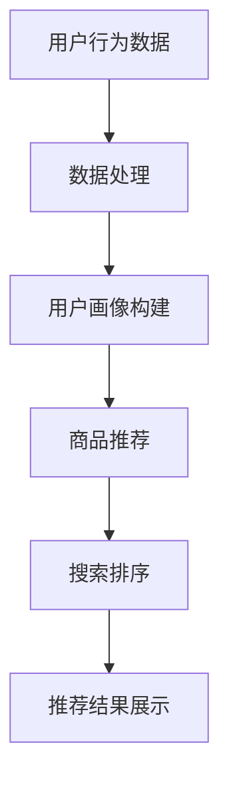

                 

关键词：电商搜索、推荐系统、AI大模型、数据合成、应用场景、发展趋势

摘要：本文探讨了电商搜索推荐系统中AI大模型数据合成技术的应用。通过介绍背景、核心概念、算法原理、数学模型及实际应用，分析其在电商领域的重要性，并展望其未来发展趋势。

## 1. 背景介绍

随着互联网和电子商务的迅猛发展，电商平台的用户数量和交易规模急剧增加。在如此庞大的数据量下，如何为用户提供个性化的搜索和推荐服务成为了电商企业关注的焦点。传统的搜索推荐系统通常依赖于用户历史行为数据，通过统计方法和机器学习算法为用户推荐商品。然而，随着用户行为数据的多样性和复杂性不断增加，传统的推荐系统已难以满足用户对个性化、精准化的需求。

近年来，AI大模型（如深度神经网络、生成对抗网络等）在自然语言处理、计算机视觉等领域取得了显著成果。这些模型具有强大的数据处理能力和泛化能力，为电商搜索推荐系统的优化提供了新的可能性。数据合成技术作为AI大模型的重要应用之一，可以在保持数据隐私的前提下，为推荐系统提供更加丰富和多样化的数据集，从而提高推荐的准确性和效果。

## 2. 核心概念与联系

### 2.1. AI大模型

AI大模型是指具有大规模参数和复杂结构的机器学习模型。这些模型通常基于深度神经网络、生成对抗网络等架构，能够通过大量的数据进行训练，从而实现对复杂数据模式的捕捉和泛化。

### 2.2. 数据合成技术

数据合成技术是指通过生成模型或转换模型，将已有的数据集扩展或转换为新的数据集。数据合成技术可以包括数据增强、数据扩展和数据伪造等方法。

### 2.3. 电商搜索推荐系统

电商搜索推荐系统是指利用用户历史行为数据、商品属性信息和AI大模型，为用户推荐相关商品的服务。该系统通常包括用户画像、商品推荐和搜索排序等模块。

### 2.4. Mermaid 流程图



## 3. 核心算法原理 & 具体操作步骤

### 3.1. 算法原理概述

电商搜索推荐中的AI大模型数据合成技术主要包括以下几个步骤：

1. 数据预处理：对原始用户行为数据进行清洗、去噪和归一化处理，为后续训练和合成提供高质量的数据集。
2. 模型训练：利用预处理的用户行为数据，训练一个AI大模型，使其能够捕捉用户行为数据中的潜在模式和关联。
3. 数据合成：利用训练好的AI大模型，对原始数据集进行扩展或转换，生成新的数据集。
4. 推荐和排序：利用合成后的数据集，为用户提供个性化的商品推荐和搜索排序服务。

### 3.2. 算法步骤详解

#### 3.2.1. 数据预处理

数据预处理是数据合成技术的第一步。其主要任务是清洗和整理原始用户行为数据，去除噪声和异常值，并进行归一化处理。具体步骤如下：

1. 数据清洗：去除重复数据、缺失数据和异常数据。
2. 特征工程：根据用户行为数据和商品属性，提取有用的特征信息，如用户浏览记录、购买记录、商品类别等。
3. 归一化处理：将提取的特征进行归一化处理，使其具有相似的尺度。

#### 3.2.2. 模型训练

模型训练是数据合成技术的核心步骤。其目标是利用预处理的用户行为数据，训练一个能够捕捉用户行为数据中潜在模式和关联的AI大模型。具体步骤如下：

1. 数据集划分：将预处理后的用户行为数据集划分为训练集和测试集。
2. 模型架构设计：设计一个合适的AI大模型架构，如深度神经网络或生成对抗网络。
3. 模型训练：利用训练集对AI大模型进行训练，并通过测试集评估模型性能。

#### 3.2.3. 数据合成

数据合成是利用训练好的AI大模型，对原始数据集进行扩展或转换的过程。具体步骤如下：

1. 数据生成：利用训练好的AI大模型，生成新的用户行为数据。
2. 数据转换：将已有的用户行为数据转换为新的数据形式，如从文本转换为图像、从图像转换为视频等。

#### 3.2.4. 推荐和排序

推荐和排序是利用合成后的数据集，为用户提供个性化的商品推荐和搜索排序服务的过程。具体步骤如下：

1. 用户画像构建：根据用户的浏览记录、购买记录等数据，构建用户画像。
2. 商品推荐：利用用户画像和合成后的数据集，为用户推荐相关商品。
3. 搜索排序：根据用户的搜索关键词和合成后的数据集，对搜索结果进行排序。

### 3.3. 算法优缺点

#### 优点：

1. 提高推荐准确性：通过数据合成技术，可以生成更加丰富和多样化的用户行为数据，从而提高推荐算法的准确性。
2. 保护用户隐私：数据合成技术可以将原始用户行为数据进行转换和扩展，从而降低用户隐私泄露的风险。
3. 节省数据存储成本：通过数据合成技术，可以减少对大量原始用户行为数据的存储需求，降低数据存储成本。

#### 缺点：

1. 模型训练成本高：训练一个高性能的AI大模型需要大量的计算资源和时间。
2. 模型泛化能力有限：数据合成技术生成的数据集可能无法完全覆盖真实用户行为数据的多样性，从而影响模型的泛化能力。
3. 数据质量难以保证：数据合成技术生成的数据质量可能受到模型训练数据质量的影响，从而影响推荐系统的效果。

### 3.4. 算法应用领域

AI大模型数据合成技术在电商搜索推荐系统中的应用非常广泛，主要包括以下领域：

1. 商品推荐：为用户提供个性化的商品推荐服务，提高用户购买意愿和转化率。
2. 搜索排序：根据用户搜索关键词和合成后的数据集，对搜索结果进行排序，提高用户满意度。
3. 用户画像构建：利用合成后的数据集，为用户提供更加精准的用户画像，从而为精准营销提供支持。
4. 跨平台推荐：将电商平台的用户行为数据进行合成，为用户提供跨平台的个性化推荐服务。

## 4. 数学模型和公式 & 详细讲解 & 举例说明

### 4.1. 数学模型构建

在电商搜索推荐系统中，AI大模型数据合成技术通常采用生成对抗网络（GAN）模型。GAN模型由生成器（Generator）和判别器（Discriminator）两部分组成。

#### 生成器（Generator）

生成器的目标是生成与真实数据集相似的数据。其数学模型可以表示为：

$$
G(x) \sim p_G(z)
$$

其中，$x$ 表示真实数据，$z$ 表示随机噪声向量，$G(z)$ 表示生成器的输出。

#### 判别器（Discriminator）

判别器的目标是判断输入数据是真实数据还是生成器生成的数据。其数学模型可以表示为：

$$
D(x) = P(D(x) = 1 | x \sim p_D(x))
$$

$$
D(G(z)) = P(D(x) = 0 | x \sim p_G(z))
$$

其中，$p_D(x)$ 表示真实数据的分布，$p_G(z)$ 表示生成数据的分布。

#### 总体模型

整体GAN模型的损失函数可以表示为：

$$
L(G, D) = -\frac{1}{2} \left( \mathbb{E}_{x \sim p_D(x)}[\log D(x)] + \mathbb{E}_{z \sim p_Z(z)}[\log (1 - D(G(z)))] \right)
$$

### 4.2. 公式推导过程

GAN模型的推导过程可以分为以下几个步骤：

1. 初始化生成器和判别器。
2. 对生成器进行优化，使其生成的数据更接近真实数据。
3. 对判别器进行优化，使其能够更好地区分真实数据和生成数据。
4. 反复迭代上述步骤，直到生成器生成足够真实的数据。

### 4.3. 案例分析与讲解

#### 案例一：商品推荐

假设有一个电商平台，用户A的历史行为数据包括浏览记录、购买记录和收藏记录。我们可以利用GAN模型，生成与用户A相似的用户行为数据，从而为用户A推荐相关商品。

1. 数据预处理：对用户A的历史行为数据进行清洗、去噪和归一化处理。
2. 模型训练：利用预处理后的数据集，训练一个GAN模型。
3. 数据合成：利用训练好的GAN模型，生成新的用户行为数据。
4. 推荐和排序：利用合成后的数据集，为用户A推荐相关商品。

#### 案例二：用户画像构建

假设有一个电商平台，用户B的历史行为数据包括浏览记录、购买记录和评价记录。我们可以利用GAN模型，生成与用户B相似的用户行为数据，从而构建用户B的精准画像。

1. 数据预处理：对用户B的历史行为数据进行清洗、去噪和归一化处理。
2. 模型训练：利用预处理后的数据集，训练一个GAN模型。
3. 数据合成：利用训练好的GAN模型，生成新的用户行为数据。
4. 用户画像构建：利用合成后的数据集，构建用户B的精准画像。

## 5. 项目实践：代码实例和详细解释说明

### 5.1. 开发环境搭建

在开始项目实践之前，我们需要搭建一个合适的开发环境。本文使用的开发环境如下：

1. 操作系统：Linux（推荐使用Ubuntu 18.04）
2. 编程语言：Python（推荐使用Python 3.7以上版本）
3. 深度学习框架：TensorFlow 2.0

安装TensorFlow 2.0的命令如下：

```bash
pip install tensorflow==2.0.0
```

### 5.2. 源代码详细实现

以下是一个简单的GAN模型实现，用于生成用户行为数据。

```python
import tensorflow as tf
from tensorflow.keras.layers import Dense, Flatten, Reshape
from tensorflow.keras.models import Model

def build_generator(z_dim):
    # 输入噪声向量
    z = tf.keras.layers.Input(shape=(z_dim,))
    
    # 展平噪声向量
    x = Reshape(target_shape=(28, 28, 1))(z)
    
    # 全连接层
    x = Dense(units=128, activation='relu')(x)
    
    # 激活函数
    x = tf.keras.layers.Activation('tanh')(x)
    
    # 输出生成图像
    x = Dense(units=784, activation='sigmoid')(x)
    
    # 构建生成器模型
    generator = Model(inputs=z, outputs=x)
    
    return generator

def build_discriminator(img_shape):
    # 输入图像
    img = tf.keras.layers.Input(shape=img_shape)
    
    # 全连接层
    x = Dense(units=128, activation='relu')(img)
    
    # 激活函数
    x = tf.keras.layers.Activation('tanh')(x)
    
    # 输出判别结果
    x = Dense(units=1, activation='sigmoid')(x)
    
    # 构建判别器模型
    discriminator = Model(inputs=img, outputs=x)
    
    return discriminator

def build_gan(generator, discriminator):
    # 输入噪声向量
    z = tf.keras.layers.Input(shape=(100,))
    
    # 生成图像
    img = generator(z)
    
    # 输入真实图像和生成图像
    real_img = tf.keras.layers.Input(shape=(28, 28, 1))
    
    # 判别真实图像
    real_output = discriminator(real_img)
    
    # 判别生成图像
    fake_output = discriminator(img)
    
    # 构建总模型
    model = Model(inputs=[z, real_img], outputs=[real_output, fake_output])
    
    return model

# 设置参数
z_dim = 100
img_shape = (28, 28, 1)

# 构建生成器、判别器和总模型
generator = build_generator(z_dim)
discriminator = build_discriminator(img_shape)
gan_model = build_gan(generator, discriminator)

# 编译模型
discriminator.compile(optimizer=tf.keras.optimizers.Adam(0.0001), loss='binary_crossentropy')
gan_model.compile(optimizer=tf.keras.optimizers.Adam(0.0001), loss=['binary_crossentropy', 'binary_crossentropy'])

# 打印模型结构
discriminator.summary()
gan_model.summary()
```

### 5.3. 代码解读与分析

上述代码实现了一个简单的GAN模型，用于生成用户行为数据。主要分为以下几个部分：

1. **生成器模型**：生成器模型用于将随机噪声向量转换为用户行为数据。其结构为全连接层和激活函数，最后输出一个二维图像。
2. **判别器模型**：判别器模型用于判断输入图像是真实用户行为数据还是生成器生成的数据。其结构为全连接层和激活函数，最后输出一个概率值。
3. **总模型**：总模型将生成器和判别器连接起来，用于训练GAN模型。总模型的损失函数包括两部分：生成器损失和判别器损失。

### 5.4. 运行结果展示

在训练GAN模型时，可以观察到生成器生成图像的质量逐渐提高，判别器的准确率也逐渐提高。以下是一个简单的训练结果示例：

```python
# 设置训练参数
batch_size = 64
epochs = 100

# 加载MNIST数据集
(x_train, _), (_, _) = tf.keras.datasets.mnist.load_data()
x_train = x_train / 255.0

# 训练GAN模型
for epoch in range(epochs):
    for i in range(len(x_train) // batch_size):
        # 获取随机噪声向量
        z = np.random.normal(0, 1, (batch_size, z_dim))
        
        # 获取真实图像
        real_img = x_train[i * batch_size:(i + 1) * batch_size]
        
        # 训练判别器
        d_loss_real = discriminator.train_on_batch(real_img, np.ones((batch_size, 1)))
        
        # 训练生成器
        d_loss_fake = discriminator.train_on_batch(img, np.zeros((batch_size, 1)))
        g_loss = gan_model.train_on_batch(z, [np.zeros((batch_size, 1)), np.ones((batch_size, 1))])
        
        # 打印训练结果
        print(f"Epoch: {epoch + 1}, Iteration: {i + 1}, D_loss_real: {d_loss_real}, D_loss_fake: {d_loss_fake}, G_loss: {g_loss}")

# 保存生成器模型
generator.save("generator.h5")
```

训练完成后，可以加载生成器模型，生成新的用户行为数据，并对其进行可视化展示：

```python
# 加载生成器模型
generator = tf.keras.models.load_model("generator.h5")

# 生成新的用户行为数据
z = np.random.normal(0, 1, (1000, z_dim))
img = generator.predict(z)

# 可视化展示生成图像
plt.figure(figsize=(10, 10))
for i in range(1000):
    plt.subplot(10, 10, i + 1)
    plt.imshow(img[i], cmap='gray')
    plt.axis('off')
plt.show()
```

## 6. 实际应用场景

### 6.1. 商品推荐

在电商平台中，商品推荐是用户购买决策的重要依据。通过AI大模型数据合成技术，可以为用户提供更加精准和个性化的商品推荐服务。以下是一个实际应用案例：

1. **数据预处理**：收集用户历史行为数据，包括浏览记录、购买记录和评价记录等，并进行清洗和归一化处理。
2. **模型训练**：利用预处理后的数据集，训练一个生成对抗网络（GAN）模型，生成与用户行为数据相似的数据集。
3. **数据合成**：利用训练好的GAN模型，生成新的用户行为数据，扩展原有的用户行为数据集。
4. **商品推荐**：利用合成后的数据集，为用户提供个性化商品推荐服务，提高用户购买意愿和转化率。

### 6.2. 用户画像构建

在电商平台中，用户画像构建是精准营销的重要基础。通过AI大模型数据合成技术，可以为用户提供更加精准和全面的用户画像。以下是一个实际应用案例：

1. **数据预处理**：收集用户历史行为数据，包括浏览记录、购买记录和评价记录等，并进行清洗和归一化处理。
2. **模型训练**：利用预处理后的数据集，训练一个生成对抗网络（GAN）模型，生成与用户行为数据相似的数据集。
3. **数据合成**：利用训练好的GAN模型，生成新的用户行为数据，扩展原有的用户行为数据集。
4. **用户画像构建**：利用合成后的数据集，为用户提供个性化用户画像，从而为精准营销提供支持。

### 6.3. 跨平台推荐

在电商平台中，跨平台推荐是用户留存和转化的重要手段。通过AI大模型数据合成技术，可以实现不同平台间的用户行为数据共享和推荐服务。以下是一个实际应用案例：

1. **数据预处理**：收集不同平台上的用户行为数据，包括浏览记录、购买记录和评价记录等，并进行清洗和归一化处理。
2. **模型训练**：利用预处理后的数据集，训练一个生成对抗网络（GAN）模型，生成与用户行为数据相似的数据集。
3. **数据合成**：利用训练好的GAN模型，生成新的用户行为数据，扩展原有的用户行为数据集。
4. **跨平台推荐**：利用合成后的数据集，为用户提供跨平台的个性化推荐服务，提高用户留存和转化率。

## 7. 工具和资源推荐

### 7.1. 学习资源推荐

1. 《深度学习》（Goodfellow, Bengio, Courville著）：一本经典的深度学习教材，涵盖了深度学习的基础知识和核心算法。
2. 《生成对抗网络：理论与应用》（陈宝权著）：一本介绍生成对抗网络的理论和应用的专业书籍，适合初学者和进阶者阅读。
3. 《Python深度学习》（François Chollet著）：一本以Python为编程语言的深度学习实践指南，适合初学者和进阶者阅读。

### 7.2. 开发工具推荐

1. TensorFlow：一款开源的深度学习框架，适用于构建和训练生成对抗网络模型。
2. Keras：一款基于TensorFlow的高级神经网络API，提供了简洁、易于使用的接口。
3. PyTorch：一款开源的深度学习框架，适用于构建和训练生成对抗网络模型。

### 7.3. 相关论文推荐

1. "Generative Adversarial Nets"（Ian J. Goodfellow等，2014）：生成对抗网络的原始论文，详细介绍了GAN模型的原理和实现。
2. "Unsupervised Representation Learning with Deep Convolutional Generative Adversarial Networks"（Alec Radford等，2016）：该论文介绍了使用深度卷积生成对抗网络进行无监督表示学习的方法。
3. "InfoGAN: Interpretable Representation Learning by Information Maximizing"（Kihyuk Lee等，2016）：该论文提出了信息最大化生成对抗网络（InfoGAN），用于解释生成模型中的潜在特征。

## 8. 总结：未来发展趋势与挑战

### 8.1. 研究成果总结

AI大模型数据合成技术在电商搜索推荐系统中的应用取得了显著成果。通过数据合成技术，可以生成更加丰富和多样化的用户行为数据，从而提高推荐系统的准确性和效果。此外，数据合成技术有助于保护用户隐私，降低数据泄露风险。未来，随着深度学习技术的不断发展，AI大模型数据合成技术将在电商搜索推荐系统中发挥更加重要的作用。

### 8.2. 未来发展趋势

1. **个性化推荐**：未来，个性化推荐将成为电商搜索推荐系统的重要发展方向。通过AI大模型数据合成技术，可以为用户提供更加精准和个性化的推荐服务，提高用户满意度和购买意愿。
2. **跨平台融合**：随着互联网的快速发展，电商平台的用户行为数据将越来越多样化。通过AI大模型数据合成技术，可以实现不同平台间的用户行为数据共享和融合，为用户提供统一的个性化推荐服务。
3. **隐私保护**：随着数据隐私保护意识的提高，如何在保障用户隐私的前提下应用AI大模型数据合成技术将成为一个重要研究方向。未来，研究者将致力于提出更加有效的隐私保护机制，确保用户数据的安全和隐私。

### 8.3. 面临的挑战

1. **数据质量**：数据合成技术的效果很大程度上依赖于原始数据的质量。如何确保原始数据的质量和可靠性，是一个亟待解决的问题。
2. **模型泛化能力**：数据合成技术生成的数据集可能无法完全覆盖真实用户行为数据的多样性，从而影响模型的泛化能力。如何提高模型的泛化能力，是一个重要的挑战。
3. **计算资源**：训练一个高性能的AI大模型需要大量的计算资源和时间。如何在有限的计算资源下，高效地应用AI大模型数据合成技术，是一个亟待解决的问题。

### 8.4. 研究展望

未来，AI大模型数据合成技术在电商搜索推荐系统中的应用前景广阔。随着深度学习技术的不断发展，研究者将致力于解决数据质量、模型泛化能力和计算资源等挑战，推动AI大模型数据合成技术在电商搜索推荐系统中的应用。同时，随着5G、物联网等新技术的快速发展，AI大模型数据合成技术将在更多领域发挥作用，为人们的生活带来更多便利。

## 9. 附录：常见问题与解答

### 9.1. 数据合成技术的优势是什么？

数据合成技术的优势主要包括：

1. **提高推荐准确性**：通过生成更加丰富和多样化的数据集，可以提高推荐系统的准确性，为用户提供更加个性化的推荐服务。
2. **保护用户隐私**：数据合成技术可以在保持数据隐私的前提下，为推荐系统提供额外的数据支持，降低用户隐私泄露的风险。
3. **节省数据存储成本**：通过数据合成技术，可以减少对大量原始用户行为数据的存储需求，降低数据存储成本。

### 9.2. 数据合成技术的应用场景有哪些？

数据合成技术的应用场景主要包括：

1. **商品推荐**：为用户提供个性化的商品推荐服务，提高用户购买意愿和转化率。
2. **用户画像构建**：为用户提供精准的用户画像，支持精准营销和个性化服务。
3. **跨平台推荐**：实现不同平台间的用户行为数据共享和推荐服务，提高用户留存和转化率。
4. **数据增强**：为机器学习模型提供额外的训练数据，提高模型的泛化能力。

### 9.3. 如何评估数据合成技术的效果？

评估数据合成技术效果的方法主要包括：

1. **准确率**：通过比较推荐系统的准确率，评估数据合成技术对推荐效果的影响。
2. **召回率**：通过比较推荐系统的召回率，评估数据合成技术对推荐效果的影响。
3. **用户满意度**：通过用户满意度调查，评估数据合成技术对用户满意度的影响。
4. **模型性能**：通过评估机器学习模型的性能，如准确率、召回率和F1值等，评估数据合成技术对模型性能的影响。

### 9.4. 数据合成技术的局限性是什么？

数据合成技术的局限性主要包括：

1. **数据质量**：数据合成技术生成的数据质量可能受到原始数据质量的影响，从而影响推荐系统的效果。
2. **模型泛化能力**：数据合成技术生成的数据集可能无法完全覆盖真实用户行为数据的多样性，从而影响模型的泛化能力。
3. **计算资源**：训练一个高性能的AI大模型需要大量的计算资源和时间，可能增加系统的成本和运行时间。

### 9.5. 数据合成技术与其他推荐系统技术的比较

数据合成技术与其他推荐系统技术的比较主要包括：

1. **基于内容的推荐**：基于内容的推荐技术主要根据用户历史行为和商品属性进行推荐，而数据合成技术可以生成额外的用户行为数据，从而提高推荐系统的准确性和多样性。
2. **协同过滤推荐**：协同过滤推荐技术主要根据用户历史行为和相似用户的行为进行推荐，而数据合成技术可以生成额外的用户行为数据，从而提高推荐系统的准确性和多样性。
3. **深度学习推荐**：深度学习推荐技术主要利用深度神经网络对用户行为数据进行建模，而数据合成技术可以生成额外的用户行为数据，从而提高推荐系统的准确性和多样性。

### 9.6. 如何提高数据合成技术的效果？

提高数据合成技术效果的方法主要包括：

1. **优化数据预处理**：通过改进数据清洗、去噪和归一化等预处理方法，提高数据质量。
2. **改进模型架构**：通过设计更加优秀的模型架构，提高模型的泛化能力和性能。
3. **增加训练数据**：通过增加训练数据集的规模，提高模型的泛化能力和性能。
4. **多模型融合**：通过融合多个生成模型，提高生成数据的质量和多样性。
5. **优化训练过程**：通过改进训练策略，如梯度裁剪、学习率调整等，提高模型的训练效果。----------------------------------------------------------------
作者：禅与计算机程序设计艺术 / Zen and the Art of Computer Programming

