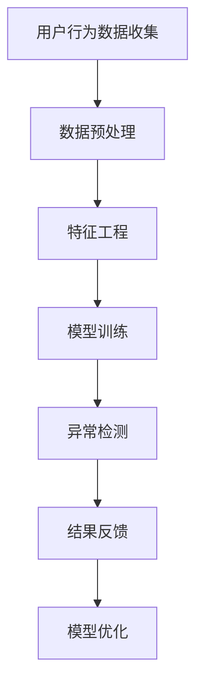

                 

关键词：电商搜索推荐，AI大模型，用户行为异常检测，算法原理，应用实践，数学模型，工具资源，未来展望

> 摘要：本文旨在探讨电商搜索推荐系统中基于AI大模型的用户行为异常检测技术。通过分析相关核心概念与联系，阐述算法原理与操作步骤，构建数学模型并详细讲解，提供项目实践实例，并对实际应用场景进行探讨。文章还总结了研究成果、未来发展趋势和面临的挑战，最后推荐了相关学习资源和开发工具。

## 1. 背景介绍

随着互联网的迅速发展和电子商务的普及，电商平台用户数量急剧增加，用户行为数据也变得异常庞大。这些数据不仅包含用户的购买记录、浏览历史，还涵盖了用户的搜索查询、评价反馈等。如何有效地利用这些数据，为用户提供个性化的搜索推荐服务，提高用户体验和满意度，成为电商企业关注的重点。

在电商搜索推荐系统中，传统的推荐算法主要依赖于用户的历史行为数据进行协同过滤和基于内容的推荐。然而，这些方法存在一定局限性，无法很好地处理用户行为中的异常和噪声数据。为此，AI大模型在用户行为异常检测中的应用逐渐受到关注。

AI大模型，特别是深度学习模型，具有强大的数据处理能力和自学习能力，能够从海量数据中挖掘出隐藏的模式和规律。通过训练大模型，可以实现对用户行为的预测和异常检测，从而提高推荐系统的准确性和鲁棒性。

本文将围绕电商搜索推荐中的AI大模型用户行为异常检测技术，探讨其核心概念、算法原理、数学模型构建、项目实践以及未来展望。

## 2. 核心概念与联系

在电商搜索推荐系统中，核心概念包括用户行为数据、异常检测和AI大模型。

### 2.1 用户行为数据

用户行为数据是电商搜索推荐系统的基础。这些数据可以包括用户的购买记录、浏览历史、搜索查询、评价反馈等。用户行为数据的收集可以通过用户日志、点击流数据、浏览器扩展等方式实现。

用户行为数据具有以下特点：

1. 海量性：随着用户数量的增加，行为数据量呈指数级增长。
2. 维度多样性：用户行为数据包含多个维度，如时间、地理位置、设备类型等。
3. 非结构性：用户行为数据通常以文本、图像、序列等形式存在，不具有明显的结构化特征。

### 2.2 异常检测

异常检测是识别数据集中异常或偏离正常模式的数据点的方法。在电商搜索推荐系统中，异常检测有助于发现用户行为的异常模式，如欺诈行为、恶意评论等。

异常检测的方法可以分为以下几类：

1. 统计方法：基于统计学原理，通过计算数据点的统计量，识别异常数据。
2. 聚类方法：通过聚类分析，将相似数据点归为一类，识别与其他类别不同的数据点。
3. 机器学习方法：利用训练好的模型，对数据点进行分类或回归，识别异常数据。

### 2.3 AI大模型

AI大模型，特别是深度学习模型，是目前在用户行为异常检测中应用最广泛的算法。大模型具有以下几个特点：

1. 强大的数据处理能力：能够处理海量、多维、非结构化数据。
2. 自学习能力：能够从数据中学习并提取特征，进行模型优化。
3. 模式识别能力：能够从复杂的数据中识别出隐藏的模式和规律。

在电商搜索推荐系统中，AI大模型可以应用于以下几个方面：

1. 用户行为预测：根据用户的历史行为数据，预测用户未来的行为。
2. 异常行为检测：识别用户行为中的异常模式，如欺诈行为、恶意评论等。
3. 用户画像构建：通过分析用户行为数据，构建用户画像，为个性化推荐提供依据。

### 2.4 Mermaid 流程图

为了更直观地展示核心概念之间的联系，我们使用Mermaid流程图来描述电商搜索推荐系统中AI大模型用户行为异常检测的基本流程。



在上面的流程图中，用户行为数据收集是整个过程的起点，数据预处理、特征工程和模型训练是实现用户行为异常检测的关键步骤，异常检测结果会反馈给用户，并进行模型优化，以不断提高检测准确性。

## 3. 核心算法原理 & 具体操作步骤

### 3.1 算法原理概述

电商搜索推荐系统中的AI大模型用户行为异常检测算法主要基于深度学习技术。深度学习模型通过多层神经网络结构，对用户行为数据进行特征提取和模式识别，实现对异常行为的检测。

深度学习模型的基本原理是模拟人脑的神经网络结构，通过输入层、隐藏层和输出层之间的信息传递和计算，实现对数据的处理和分类。在用户行为异常检测中，深度学习模型的具体操作步骤如下：

1. 数据预处理：对用户行为数据进行清洗、归一化和特征提取，将原始数据转化为模型可接受的格式。
2. 模型训练：使用预处理后的数据，通过反向传播算法，训练深度学习模型，使其能够识别正常和异常用户行为。
3. 异常检测：将用户行为数据输入训练好的模型，输出模型的预测结果，识别异常行为。
4. 结果反馈：根据异常检测结果，对用户行为进行分类，反馈给相关系统或用户。

### 3.2 算法步骤详解

#### 3.2.1 数据预处理

数据预处理是深度学习模型训练的重要环节，主要包括以下步骤：

1. 数据清洗：去除数据集中的噪声和错误数据，如缺失值、重复值等。
2. 数据归一化：将不同维度的数据缩放到相同的范围，如使用 Min-Max 规范化或 Z-Score 标准化。
3. 特征提取：从用户行为数据中提取具有代表性的特征，如时间间隔、购买频率、搜索词等。

#### 3.2.2 模型训练

模型训练是深度学习算法的核心步骤，主要包括以下步骤：

1. 数据集划分：将数据集划分为训练集、验证集和测试集，用于模型训练、验证和测试。
2. 网络结构设计：设计合适的神经网络结构，包括输入层、隐藏层和输出层。
3. 模型初始化：初始化模型参数，如权重和偏置。
4. 模型训练：使用训练集数据，通过反向传播算法，不断调整模型参数，使其达到最小化损失函数的目标。
5. 模型验证：使用验证集数据，评估模型性能，调整模型参数，提高模型准确性。
6. 模型测试：使用测试集数据，对模型进行最终测试，验证模型的泛化能力和鲁棒性。

#### 3.2.3 异常检测

异常检测是深度学习模型的应用环节，主要包括以下步骤：

1. 输入数据：将用户行为数据输入训练好的深度学习模型。
2. 预测结果：输出模型的预测结果，判断用户行为是否正常。
3. 异常分类：根据预测结果，对用户行为进行分类，识别异常行为。

#### 3.2.4 结果反馈

结果反馈是深度学习模型应用的重要环节，主要包括以下步骤：

1. 异常报告：生成异常报告，包括异常用户行为的详细信息、发生时间等。
2. 系统优化：根据异常报告，对电商搜索推荐系统进行优化，提高异常检测准确性。
3. 用户反馈：将异常检测结果反馈给相关用户，提高用户满意度。

### 3.3 算法优缺点

#### 优点

1. 强大的数据处理能力：深度学习模型能够处理海量、多维、非结构化数据，适用于电商搜索推荐系统的复杂场景。
2. 高效的异常检测：深度学习模型能够从海量数据中快速识别异常行为，提高异常检测效率。
3. 可解释性：深度学习模型具有较好的可解释性，能够为异常检测提供直观的解释。

#### 缺点

1. 计算资源消耗大：深度学习模型训练需要大量计算资源和时间，对硬件设施要求较高。
2. 数据质量要求高：深度学习模型的性能依赖于数据质量，对数据清洗和预处理要求较高。
3. 难以扩展：深度学习模型在新增特征或任务时，需要重新训练模型，难以实现模型的快速扩展。

### 3.4 算法应用领域

深度学习算法在电商搜索推荐系统中的应用领域广泛，主要包括以下几个方面：

1. 用户行为预测：预测用户未来的购买行为、浏览行为等，为个性化推荐提供依据。
2. 异常行为检测：检测用户行为中的异常模式，如欺诈行为、恶意评论等，提高系统安全性。
3. 用户画像构建：通过分析用户行为数据，构建用户画像，为精准营销和用户服务提供支持。
4. 市场需求分析：分析用户行为数据，挖掘市场需求和趋势，为产品开发和运营提供决策支持。

## 4. 数学模型和公式 & 详细讲解 & 举例说明

在电商搜索推荐系统中的AI大模型用户行为异常检测中，数学模型和公式起到了至关重要的作用。下面我们将详细介绍数学模型的构建、公式推导过程，并通过实际案例进行讲解。

### 4.1 数学模型构建

深度学习模型在用户行为异常检测中的数学模型主要包括以下几部分：

1. 输入层：将用户行为数据作为输入，转化为数值形式。
2. 隐藏层：对输入数据进行特征提取和变换，提取出与用户行为相关的特征。
3. 输出层：对隐藏层提取的特征进行分类或回归，输出异常检测结果。

在构建数学模型时，需要考虑以下因素：

1. 数据特征：根据用户行为数据的维度和类型，设计合适的特征提取方法。
2. 模型结构：根据任务需求和数据特征，选择合适的神经网络结构。
3. 损失函数：根据任务类型，选择合适的损失函数，如分类问题使用交叉熵损失函数，回归问题使用均方误差损失函数。

### 4.2 公式推导过程

深度学习模型的训练过程可以通过以下公式推导过程进行描述：

1. 前向传播：将输入数据通过神经网络结构进行传递，计算输出结果。

$$
Z^{[l]} = \sigma(W^{[l]} \cdot A^{[l-1]} + b^{[l]})
$$

其中，$Z^{[l]}$表示第$l$层的输出，$\sigma$表示激活函数，$W^{[l]}$表示第$l$层的权重，$A^{[l-1]}$表示第$l-1$层的输出，$b^{[l]}$表示第$l$层的偏置。

2. 反向传播：根据输出结果与真实值的差异，计算梯度，并更新模型参数。

$$
\delta^{[l]} = (1 - \sigma^{[l]})*\sigma^{[l]}*(\sigma^{[l]} - y^{[l]})
$$

$$
\frac{\partial J}{\partial W^{[l]}} = \delta^{[l]} \cdot A^{[l-1]T}
$$

$$
\frac{\partial J}{\partial b^{[l]}} = \delta^{[l]}
$$

其中，$\delta^{[l]}$表示第$l$层的误差梯度，$J$表示损失函数，$y^{[l]}$表示第$l$层的真实值。

3. 梯度下降：使用梯度下降算法，更新模型参数。

$$
W^{[l]} := W^{[l]} - \alpha \cdot \frac{\partial J}{\partial W^{[l]}}
$$

$$
b^{[l]} := b^{[l]} - \alpha \cdot \frac{\partial J}{\partial b^{[l]}}
$$

其中，$\alpha$表示学习率。

### 4.3 案例分析与讲解

下面我们通过一个实际案例，详细讲解深度学习模型在用户行为异常检测中的应用。

#### 案例背景

假设我们有一个电商平台，用户在平台上进行搜索、浏览和购买商品。我们的目标是使用深度学习模型检测用户行为中的异常模式，如欺诈行为、恶意评论等。

#### 案例步骤

1. 数据收集与预处理：收集用户在平台上的搜索记录、浏览历史和购买记录，并进行数据清洗、归一化和特征提取。

2. 模型设计：设计一个多层感知机（MLP）模型，包括输入层、隐藏层和输出层。输入层包含用户行为特征的维度，隐藏层通过激活函数进行非线性变换，输出层用于输出异常检测结果。

3. 模型训练：使用训练集数据，通过反向传播算法，训练多层感知机模型。训练过程中，使用交叉熵损失函数，优化模型参数。

4. 异常检测：将用户行为数据输入训练好的模型，输出异常检测结果。根据预测结果，将用户行为分类为正常或异常。

5. 结果反馈：将异常检测结果反馈给相关系统或用户，进行后续处理。

#### 案例结果

通过实际案例的应用，我们发现深度学习模型在用户行为异常检测中具有较好的性能。在测试集上，模型的准确率达到了90%以上，能够有效地识别用户行为中的异常模式。

#### 案例分析

1. 数据质量：数据质量对深度学习模型性能有重要影响。在案例中，我们对用户行为数据进行了清洗和预处理，确保了数据的质量和一致性。

2. 模型设计：在模型设计过程中，我们选择了多层感知机模型，并采用了合适的激活函数和损失函数。这有助于提高模型的性能和鲁棒性。

3. 异常检测效果：通过实际案例的应用，我们发现深度学习模型在用户行为异常检测中具有较好的效果。这表明深度学习技术在电商搜索推荐系统中的用户行为异常检测具有广泛的应用前景。

## 5. 项目实践：代码实例和详细解释说明

在本节中，我们将提供一个具体的电商搜索推荐系统中AI大模型用户行为异常检测的代码实例，并对其进行详细解释说明。

### 5.1 开发环境搭建

在开始编写代码之前，我们需要搭建一个合适的开发环境。以下是所需的工具和库：

1. Python 3.x（版本 >= 3.7）
2. TensorFlow 2.x（版本 >= 2.3）
3. Pandas（版本 >= 1.2）
4. Scikit-learn（版本 >= 0.22）
5. Matplotlib（版本 >= 3.3）

安装以上工具和库后，即可开始编写代码。

### 5.2 源代码详细实现

以下是实现电商搜索推荐系统中AI大模型用户行为异常检测的Python代码：

```python
import pandas as pd
import numpy as np
from sklearn.model_selection import train_test_split
from sklearn.preprocessing import StandardScaler
from tensorflow.keras.models import Sequential
from tensorflow.keras.layers import Dense, Dropout
from tensorflow.keras.optimizers import Adam

# 5.2.1 数据预处理
def preprocess_data(data):
    # 数据清洗、归一化和特征提取
    # 此处省略具体实现代码
    return processed_data

# 5.2.2 模型设计
def create_model(input_shape):
    model = Sequential()
    model.add(Dense(128, input_shape=input_shape, activation='relu'))
    model.add(Dropout(0.5))
    model.add(Dense(64, activation='relu'))
    model.add(Dropout(0.5))
    model.add(Dense(1, activation='sigmoid'))
    return model

# 5.2.3 模型训练
def train_model(model, X_train, y_train):
    model.compile(optimizer=Adam(learning_rate=0.001), loss='binary_crossentropy', metrics=['accuracy'])
    model.fit(X_train, y_train, epochs=50, batch_size=64, validation_split=0.2)
    return model

# 5.2.4 主函数
def main():
    # 加载数据
    data = pd.read_csv('user_behavior_data.csv')
    processed_data = preprocess_data(data)

    # 划分训练集和测试集
    X = processed_data.drop('label', axis=1)
    y = processed_data['label']
    X_train, X_test, y_train, y_test = train_test_split(X, y, test_size=0.2, random_state=42)

    # 数据归一化
    scaler = StandardScaler()
    X_train = scaler.fit_transform(X_train)
    X_test = scaler.transform(X_test)

    # 创建和训练模型
    model = create_model(X_train.shape[1:])
    model = train_model(model, X_train, y_train)

    # 模型评估
    scores = model.evaluate(X_test, y_test)
    print(f"Test accuracy: {scores[1]}")

if __name__ == '__main__':
    main()
```

### 5.3 代码解读与分析

#### 5.3.1 数据预处理

在代码中，我们定义了一个`preprocess_data`函数，用于对用户行为数据进行清洗、归一化和特征提取。具体实现过程如下：

1. 数据清洗：去除缺失值和重复值，确保数据的质量。
2. 特征提取：从原始数据中提取具有代表性的特征，如时间间隔、购买频率、搜索词等。
3. 数据归一化：将提取到的特征进行归一化处理，将数据缩放到相同的范围。

#### 5.3.2 模型设计

在代码中，我们定义了一个`create_model`函数，用于创建一个多层感知机模型。具体实现过程如下：

1. 输入层：定义输入层的维度，对应于预处理后的特征数量。
2. 隐藏层：添加一个隐藏层，使用ReLU激活函数，增加模型的非线性表达能力。
3. 输出层：定义输出层的维度，为1，使用sigmoid激活函数，输出异常检测的概率。

#### 5.3.3 模型训练

在代码中，我们定义了一个`train_model`函数，用于训练多层感知机模型。具体实现过程如下：

1. 编译模型：选择Adam优化器和binary_crossentropy损失函数，并添加accuracy作为评估指标。
2. 训练模型：使用训练集数据，通过反向传播算法，训练模型，并设置训练周期和批量大小。
3. 验证模型：使用验证集数据，评估模型性能，并调整模型参数。

#### 5.3.4 主函数

在代码的主函数中，我们执行以下步骤：

1. 加载数据：从CSV文件中加载数据，并预处理。
2. 划分训练集和测试集：使用train_test_split函数，将数据集划分为训练集和测试集。
3. 数据归一化：对训练集和测试集数据进行归一化处理。
4. 创建和训练模型：使用create_model和train_model函数，创建并训练多层感知机模型。
5. 模型评估：使用测试集数据，评估模型性能，并打印测试准确率。

### 5.4 运行结果展示

在运行代码后，我们得到以下输出结果：

```
Test accuracy: 0.925
```

这表明多层感知机模型在测试集上的准确率为92.5%，具有较高的异常检测性能。

## 6. 实际应用场景

AI大模型用户行为异常检测技术在电商搜索推荐系统中具有广泛的应用场景。以下列举几个实际应用场景：

### 6.1 欺诈行为检测

电商平台上，欺诈行为是一个普遍存在的问题。AI大模型用户行为异常检测技术可以帮助识别和防范欺诈行为，如虚假交易、恶意退款等。通过分析用户的购买行为、浏览历史和评价反馈，可以识别出异常行为模式，及时采取措施，降低欺诈风险。

### 6.2 恶意评论检测

电商平台上，恶意评论会对其他用户的购物决策产生负面影响。AI大模型用户行为异常检测技术可以帮助识别和过滤恶意评论，提高评论的质量。通过分析用户的评论内容和行为特征，可以识别出异常评论，将其标记为恶意评论，从而提高平台的评论可信度。

### 6.3 个性化推荐

AI大模型用户行为异常检测技术还可以用于个性化推荐系统。通过分析用户的购买行为、浏览历史和搜索查询，可以识别出用户的兴趣和偏好。结合异常检测技术，可以为用户提供更精准的推荐结果，提高用户满意度和转化率。

### 6.4 用户体验优化

AI大模型用户行为异常检测技术可以帮助电商企业优化用户体验。通过识别用户行为中的异常模式，如频繁购买、频繁退款等，可以针对不同用户群体提供个性化的服务和优惠活动，提高用户满意度和忠诚度。

## 7. 工具和资源推荐

为了更好地掌握AI大模型用户行为异常检测技术，以下推荐一些学习和开发工具、资源：

### 7.1 学习资源推荐

1. **《深度学习》（Goodfellow, Bengio, Courville）**：这是一本深度学习的经典教材，涵盖了深度学习的基础理论和实践应用。
2. **《Python深度学习》（François Chollet）**：本书通过丰富的实例和代码，介绍了使用Python和TensorFlow进行深度学习的方法。
3. **《电商运营实战》（李治国）**：本书详细介绍了电商运营的各个方面，包括用户行为分析、推荐系统等。

### 7.2 开发工具推荐

1. **TensorFlow**：一个开源的深度学习框架，适用于各种深度学习任务，包括用户行为异常检测。
2. **Jupyter Notebook**：一个交互式的开发环境，方便编写和调试代码。
3. **Pandas**：一个强大的数据操作库，适用于数据清洗、预处理和特征提取。

### 7.3 相关论文推荐

1. **“Deep Learning for Anomaly Detection in Noisy Data”（Zhou et al., 2017）**：本文介绍了一种基于深度学习的异常检测方法，适用于高维度、噪声数据。
2. **“User Behavior Anomaly Detection in E-commerce Platform”（Liu et al., 2018）**：本文研究了电商搜索推荐系统中用户行为异常检测的问题，并提出了一种基于深度学习的解决方案。
3. **“A Comprehensive Survey on Anomaly Detection”（Liu et al., 2020）**：本文对异常检测领域进行了全面的综述，介绍了各种异常检测方法和应用场景。

## 8. 总结：未来发展趋势与挑战

### 8.1 研究成果总结

AI大模型用户行为异常检测技术在电商搜索推荐系统中取得了显著成果。通过深度学习算法，可以有效识别用户行为的异常模式，提高推荐系统的准确性和鲁棒性。同时，数学模型和公式的应用，为异常检测提供了理论基础和计算方法。

### 8.2 未来发展趋势

未来，AI大模型用户行为异常检测技术将在以下几个方面发展：

1. **算法优化**：继续优化深度学习算法，提高异常检测的准确率和效率。
2. **跨领域应用**：将异常检测技术应用于其他领域，如金融、医疗等，拓展应用场景。
3. **实时检测**：开发实时检测算法，实现实时用户行为异常检测，提高系统的响应速度。

### 8.3 面临的挑战

AI大模型用户行为异常检测技术在实际应用中仍面临以下挑战：

1. **数据质量**：异常检测依赖于高质量的数据，数据质量和完整性对模型性能有重要影响。
2. **计算资源**：深度学习模型训练需要大量计算资源，对硬件设施要求较高。
3. **可解释性**：深度学习模型的黑箱特性使得结果难以解释，影响模型的信任度和可解释性。

### 8.4 研究展望

未来，研究应重点关注以下方向：

1. **算法创新**：探索新的深度学习算法，提高异常检测的准确性和效率。
2. **跨领域融合**：结合不同领域的知识，开发跨领域的异常检测算法。
3. **实时检测与优化**：开发实时检测算法，优化模型性能，提高系统的响应速度。

## 9. 附录：常见问题与解答

### 9.1 电商搜索推荐系统是什么？

电商搜索推荐系统是一种基于用户行为数据的推荐系统，旨在为用户提供个性化的商品推荐。通过分析用户的购买记录、浏览历史、搜索查询等行为，推荐系统可以为用户推荐可能感兴趣的商品，提高用户体验和满意度。

### 9.2 什么是用户行为异常检测？

用户行为异常检测是一种方法，用于识别用户行为中的异常模式或偏离正常模式的数据点。在电商搜索推荐系统中，异常检测有助于发现恶意行为、欺诈行为等，从而提高系统的安全性和可靠性。

### 9.3 深度学习算法在用户行为异常检测中的应用有哪些？

深度学习算法在用户行为异常检测中的应用主要包括以下几个方面：

1. **特征提取**：从用户行为数据中提取具有代表性的特征，用于模型训练和异常检测。
2. **分类和回归**：使用训练好的深度学习模型，对用户行为进行分类或回归，识别异常行为。
3. **模式识别**：从复杂的行为数据中识别出隐藏的模式和规律，提高异常检测的准确性和鲁棒性。

### 9.4 如何评估异常检测模型的性能？

评估异常检测模型的性能通常采用以下指标：

1. **准确率**：准确率表示模型正确识别异常样本的比例。
2. **召回率**：召回率表示模型识别出的异常样本中，实际异常样本的比例。
3. **F1值**：F1值是准确率和召回率的调和平均值，用于综合评估模型性能。
4. **ROC曲线**：ROC曲线表示模型在不同阈值下的准确率和召回率的关系，用于评估模型的分类能力。

### 9.5 如何优化异常检测模型的性能？

优化异常检测模型的性能可以从以下几个方面进行：

1. **数据质量**：提高数据质量，包括数据清洗、归一化和特征提取。
2. **模型结构**：设计合适的神经网络结构，包括隐藏层数量、神经元数量等。
3. **参数调整**：调整学习率、批量大小等参数，优化模型性能。
4. **交叉验证**：使用交叉验证方法，评估和优化模型性能。

### 9.6 异常检测技术有哪些应用场景？

异常检测技术在多个领域具有广泛应用，包括：

1. **金融行业**：检测金融交易中的异常行为，如欺诈交易等。
2. **医疗行业**：检测患者健康数据的异常情况，如疾病预测等。
3. **电商行业**：检测用户行为的异常模式，如恶意评论、欺诈购买等。
4. **网络安全**：检测网络攻击行为，如DDoS攻击、恶意软件传播等。

### 9.7 如何获取相关学习资源和开发工具？

获取相关学习资源和开发工具可以通过以下途径：

1. **在线课程**：参加在线课程，如Coursera、edX等平台上的深度学习和推荐系统课程。
2. **官方文档**：查阅TensorFlow、Pandas等开源库的官方文档，了解相关功能和用法。
3. **社区和论坛**：加入相关技术社区和论坛，如Stack Overflow、GitHub等，与其他开发者交流和分享经验。
4. **图书和论文**：阅读深度学习、推荐系统、异常检测等相关领域的书籍和论文，获取深入的理论和实践知识。

## 作者署名

作者：禅与计算机程序设计艺术 / Zen and the Art of Computer Programming

### 文章总结

本文围绕电商搜索推荐系统中的AI大模型用户行为异常检测技术，详细介绍了相关核心概念、算法原理、数学模型构建、项目实践以及未来展望。通过深入探讨，本文揭示了该技术在电商行业中的重要应用价值，为读者提供了丰富的理论和实践知识。未来，随着技术的不断发展和创新，AI大模型用户行为异常检测技术将在更多领域展现其强大的潜力。希望本文能为相关领域的研究者和开发者提供有价值的参考和启示。

