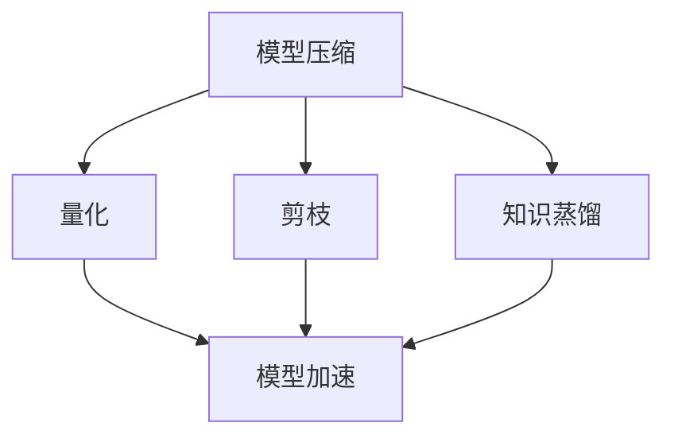

                 

关键词：电商搜索、推荐系统、AI大模型、模型压缩、模型加速、深度学习

摘要：本文深入探讨了电商搜索推荐场景下，如何通过模型压缩与加速技术，优化AI大模型的性能。文章首先介绍了电商搜索推荐场景的基本原理和挑战，随后详细解析了模型压缩与加速的核心技术，包括量化、剪枝和知识蒸馏等。接着，本文通过一个实际项目实例，展示了这些技术的具体实现和应用，并对其进行了详细解读。最后，文章分析了模型压缩与加速技术在实际应用中的效果和未来发展趋势，为相关领域的研究者和开发者提供了有价值的参考。

## 1. 背景介绍

随着互联网的迅速发展和电子商务的普及，电商搜索推荐系统已经成为电商平台的核心竞争力之一。这类系统通过分析用户的搜索行为、浏览记录和购买历史，为用户提供个性化的商品推荐，从而提高用户的购物体验和平台的转化率。

电商搜索推荐系统通常基于深度学习算法构建，其中使用了大量的大规模数据集和复杂的神经网络模型。然而，随着模型规模的不断扩大，模型的训练和推理时间也随之增加，导致系统响应速度下降，用户体验受到影响。

为了解决这个问题，模型压缩与加速技术应运而生。这些技术通过减少模型参数、简化网络结构和优化计算方式，显著提高了模型的推理速度和效率。本文将重点讨论如何在电商搜索推荐场景下，利用模型压缩与加速技术，优化AI大模型的性能。

### 1.1 电商搜索推荐系统的基本原理

电商搜索推荐系统主要包括用户画像构建、商品信息抽取、推荐算法和结果呈现等几个关键环节。

首先，用户画像构建是通过分析用户的搜索历史、浏览记录和购买行为，生成用户的兴趣偏好和需求特征。这些特征可以用来构建用户画像，为后续推荐算法提供输入。

其次，商品信息抽取是指从商品数据中提取关键属性，如商品名称、品牌、价格、评价等，以便于推荐算法进行商品匹配和排序。

接下来，推荐算法根据用户画像和商品信息，利用深度学习模型进行商品推荐。常见的推荐算法包括基于内容的推荐、协同过滤和混合推荐等。这些算法的核心目标是通过优化用户与商品之间的相似度匹配，提高推荐效果。

最后，推荐结果会通过界面呈现给用户，用户可以根据推荐结果进行点击、购买或其他互动行为。

### 1.2 电商搜索推荐系统的挑战

电商搜索推荐系统在实际应用中面临以下挑战：

1. **数据多样性**：电商平台的用户行为数据、商品数据和市场数据具有高度多样性，这使得推荐系统的数据预处理和特征工程变得复杂。

2. **实时性**：为了提高用户体验，推荐系统需要实时响应用户的行为变化，提供个性化的推荐结果。这要求推荐系统具备高效的实时处理能力。

3. **模型规模**：随着深度学习技术的不断发展，推荐系统使用的神经网络模型规模越来越大，这导致了模型的训练和推理时间显著增加。

4. **计算资源**：大规模的模型训练和推理需要消耗大量的计算资源，尤其是在云端部署时，计算资源的合理利用成为关键问题。

5. **算法优化**：为了提高推荐效果，需要不断优化推荐算法，这包括模型结构、参数调整、特征选择等。

## 2. 核心概念与联系

### 2.1 模型压缩

模型压缩是指通过减少模型参数数量和简化网络结构，降低模型复杂度，从而提高推理速度和效率的技术。模型压缩的主要方法包括量化、剪枝和知识蒸馏等。

- **量化**：量化是将神经网络模型中的浮点数参数转换为低精度的整数表示。通过量化可以减少模型参数的存储和计算量。

- **剪枝**：剪枝是通过删除模型中的冗余参数和层，简化模型结构，从而减少模型复杂度。剪枝可以分为结构剪枝和权重剪枝两种方式。

- **知识蒸馏**：知识蒸馏是通过将大型教师模型的知识传递给小型学生模型，实现模型压缩。知识蒸馏通过训练学生模型在教师模型输出的软标签上，从而提取和传递教师模型的知识。

### 2.2 模型加速

模型加速是指通过优化计算方式、降低计算复杂度，提高模型推理速度的技术。模型加速的主要方法包括并行计算、硬件加速和量化等。

- **并行计算**：并行计算是通过将模型推理任务分解为多个子任务，同时在不同计算单元上执行，从而提高推理速度。

- **硬件加速**：硬件加速是通过利用GPU、TPU等专用硬件，加速模型推理和训练。硬件加速可以显著降低模型的计算时间和能耗。

- **量化**：量化是通过将模型参数的精度降低，减少模型的计算量，从而提高推理速度。

### 2.3 Mermaid 流程图

以下是一个简单的 Mermaid 流程图，展示了模型压缩和加速的基本流程：



## 3. 核心算法原理 & 具体操作步骤

### 3.1 算法原理概述

模型压缩与加速技术主要基于以下原理：

1. **量化**：量化通过降低模型参数的精度，减少模型存储和计算量。量化分为全精度量化（FP32）和低精度量化（FP16、INT8）。

2. **剪枝**：剪枝通过删除模型中的冗余参数和层，简化模型结构。剪枝可以分为结构剪枝和权重剪枝两种方式。

3. **知识蒸馏**：知识蒸馏通过将大型教师模型的知识传递给小型学生模型，实现模型压缩。知识蒸馏通过训练学生模型在教师模型输出的软标签上，从而提取和传递教师模型的知识。

4. **并行计算**：并行计算通过将模型推理任务分解为多个子任务，同时在不同计算单元上执行，从而提高推理速度。

5. **硬件加速**：硬件加速通过利用GPU、TPU等专用硬件，加速模型推理和训练。

### 3.2 算法步骤详解

#### 3.2.1 量化

1. **选择量化精度**：根据模型参数的数量和计算资源，选择合适的量化精度。例如，FP32、FP16和INT8。

2. **量化算法**：使用量化算法将模型参数从浮点数转换为低精度整数表示。常用的量化算法有对称量化、非对称量化等。

3. **量化范围**：确定模型参数的量化范围，以便在低精度表示下保持参数的有效性。

4. **量化校准**：通过量化校准，确保量化后的模型参数在低精度表示下仍然保持原有的性能。

#### 3.2.2 剪枝

1. **剪枝策略**：根据模型结构和训练数据，选择合适的剪枝策略。例如，基于梯度的剪枝、基于敏感度的剪枝等。

2. **剪枝参数**：设置剪枝参数，如剪枝比例、剪枝层等。

3. **剪枝算法**：使用剪枝算法删除模型中的冗余参数和层。常用的剪枝算法有基于梯度的剪枝、基于敏感度的剪枝等。

4. **剪枝效果评估**：评估剪枝后的模型性能，确保剪枝后的模型仍然满足要求。

#### 3.2.3 知识蒸馏

1. **教师模型选择**：选择一个大型教师模型，用于提供知识。

2. **学生模型选择**：选择一个小型学生模型，用于接收知识。

3. **软标签生成**：通过教师模型对输入数据生成软标签。

4. **知识传递**：通过训练学生模型在教师模型输出的软标签上，实现知识传递。

5. **模型融合**：将教师模型和学生模型融合，提高模型性能。

#### 3.2.4 并行计算

1. **任务分解**：将模型推理任务分解为多个子任务。

2. **计算单元分配**：将子任务分配到不同的计算单元上。

3. **结果融合**：将不同计算单元的结果进行融合，得到最终推理结果。

#### 3.2.5 硬件加速

1. **硬件选择**：根据模型类型和计算需求，选择合适的硬件。

2. **模型转换**：将模型转换为硬件支持的格式。

3. **硬件优化**：对模型进行硬件优化，提高推理速度。

4. **硬件调度**：根据硬件资源情况，合理调度模型计算任务。

### 3.3 算法优缺点

#### 3.3.1 量化

**优点**：

- 降低模型存储和计算量。
- 提高模型推理速度。
- 支持硬件加速。

**缺点**：

- 可能降低模型精度。
- 需要额外的量化校准步骤。

#### 3.3.2 剪枝

**优点**：

- 降低模型复杂度。
- 提高模型推理速度。
- 支持硬件加速。

**缺点**：

- 可能影响模型性能。
- 需要选择合适的剪枝策略。

#### 3.3.3 知识蒸馏

**优点**：

- 提高模型性能。
- 支持模型压缩。

**缺点**：

- 训练时间较长。
- 需要大量计算资源。

#### 3.3.4 并行计算

**优点**：

- 提高模型推理速度。
- 支持硬件加速。

**缺点**：

- 可能增加通信开销。
- 需要复杂的调度算法。

#### 3.3.5 硬件加速

**优点**：

- 提高模型推理速度。
- 降低能耗。

**缺点**：

- 需要额外的硬件支持。
- 需要复杂的优化。

### 3.4 算法应用领域

模型压缩与加速技术可以广泛应用于以下领域：

1. **图像处理**：用于图像分类、目标检测和图像分割等任务。
2. **语音识别**：用于语音分类、语音识别和说话人识别等任务。
3. **自然语言处理**：用于文本分类、机器翻译和问答系统等任务。
4. **推荐系统**：用于电商搜索推荐、音乐推荐和视频推荐等任务。

## 4. 数学模型和公式 & 详细讲解 & 举例说明

### 4.1 数学模型构建

在模型压缩与加速过程中，常用的数学模型包括量化模型、剪枝模型和知识蒸馏模型。下面将分别介绍这些模型的数学表示。

#### 4.1.1 量化模型

量化模型的核心是参数量化。假设原始模型的参数为θ，量化后的参数为θ'，量化精度为q。量化模型的数学表示如下：

$$
\theta' = \text{Quantize}(\theta, q)
$$

其中，量化函数$\text{Quantize}$根据量化精度q对参数θ进行转换。

#### 4.1.2 剪枝模型

剪枝模型的核心是参数剪枝。假设原始模型的参数为θ，剪枝后的参数为θ'。剪枝模型的数学表示如下：

$$
\theta' = \text{Prune}(\theta)
$$

其中，剪枝函数$\text{Prune}$根据剪枝策略对参数θ进行剪枝。

#### 4.1.3 知识蒸馏模型

知识蒸馏模型的核心是知识传递。假设教师模型的参数为θ_t，学生模型的参数为θ_s。知识蒸馏模型的数学表示如下：

$$
\theta_s = \text{Distill}(\theta_t)
$$

其中，蒸馏函数$\text{Distill}$根据教师模型的软标签对学生模型进行训练。

### 4.2 公式推导过程

下面将分别介绍量化模型、剪枝模型和知识蒸馏模型的推导过程。

#### 4.2.1 量化模型推导

量化模型的主要目标是降低模型参数的精度。假设原始参数θ的均值为μ，方差为σ²，量化精度为q。量化模型的推导过程如下：

1. **确定量化范围**：

   根据原始参数的均值和方差，确定量化范围：

   $$
   \text{Range} = [ \mu - k\sigma, \mu + k\sigma ]
   $$

   其中，k为常数，通常取值为3。

2. **量化参数**：

   根据量化范围和量化精度q，对参数θ进行量化：

   $$
   \theta' = \text{Quantize}(\theta, q) = q \cdot \frac{\theta - \mu}{\sigma}
   $$

   其中，$\text{Quantize}$函数将参数θ映射到量化范围[-q, q]。

3. **量化校准**：

   为了确保量化后的参数θ'的有效性，需要进行量化校准。量化校准的目的是将量化后的参数θ'恢复到原始参数θ的精度。量化校准的推导过程如下：

   $$
   \theta = \text{DeQuantize}(\theta') = \mu + \sigma \cdot \frac{\theta'}{q}
   $$

   其中，$\text{DeQuantize}$函数将量化后的参数θ'恢复到原始参数θ。

#### 4.2.2 剪枝模型推导

剪枝模型的主要目标是简化模型结构。假设原始模型包含L层，每层的参数数量分别为$\theta_1, \theta_2, ..., \theta_L$。剪枝模型的推导过程如下：

1. **确定剪枝策略**：

   根据模型结构和训练数据，选择合适的剪枝策略。常见的剪枝策略包括基于梯度的剪枝和基于敏感度的剪枝。

2. **剪枝参数**：

   根据剪枝策略，选择剪枝比例p和剪枝层。剪枝比例p表示剪枝参数的比例，剪枝层表示需要剪枝的层。

3. **剪枝过程**：

   根据剪枝比例p和剪枝层，对参数θ进行剪枝：

   $$
   \theta' = \text{Prune}(\theta, p, \text{Layer})
   $$

   其中，$\text{Prune}$函数根据剪枝策略对参数θ进行剪枝。

4. **剪枝效果评估**：

   剪枝后的模型需要进行效果评估，以确保剪枝后的模型仍然满足要求。常见的效果评估指标包括模型精度、训练时间和推理速度等。

#### 4.2.3 知识蒸馏模型推导

知识蒸馏模型的主要目标是传递教师模型的知识。假设教师模型的输出为y_t，学生模型的输出为y_s。知识蒸馏模型的推导过程如下：

1. **软标签生成**：

   根据教师模型的输出y_t，生成软标签y_t'：

   $$
   y_t' = \text{Softmax}(y_t)
   $$

2. **学生模型训练**：

   根据软标签y_t'，训练学生模型：

   $$
   \theta_s = \text{Train}(\theta_s, y_t')
   $$

   其中，$\text{Train}$函数根据软标签y_t'训练学生模型。

3. **模型融合**：

   将教师模型和学生模型进行融合：

   $$
   \theta_{\text{final}} = \alpha \cdot \theta_t + (1 - \alpha) \cdot \theta_s
   $$

   其中，$\theta_{\text{final}}$为融合后的模型参数，$\alpha$为融合系数。

### 4.3 案例分析与讲解

为了更好地理解量化模型、剪枝模型和知识蒸馏模型的推导过程，下面通过一个具体的案例进行讲解。

#### 4.3.1 量化模型案例

假设有一个深度神经网络模型，包含3层，每层的参数数量分别为1000、500和250。量化精度为q=100。原始参数的均值为μ=0，方差为σ²=1。

1. **确定量化范围**：

   根据原始参数的均值和方差，量化范围如下：

   $$
   \text{Range} = [-1, 1]
   $$

2. **量化参数**：

   对每层的参数进行量化：

   $$
   \theta_1' = 100 \cdot \frac{\theta_1 - 0}{1} = \theta_1
   $$

   $$
   \theta_2' = 100 \cdot \frac{\theta_2 - 0}{1} = \theta_2
   $$

   $$
   \theta_3' = 100 \cdot \frac{\theta_3 - 0}{1} = \theta_3
   $$

   量化后的参数范围为[-100, 100]。

3. **量化校准**：

   对量化后的参数进行量化校准：

   $$
   \theta_1 = 0 + 1 \cdot \frac{\theta_1'}{100} = \theta_1'
   $$

   $$
   \theta_2 = 0 + 1 \cdot \frac{\theta_2'}{100} = \theta_2'
   $$

   $$
   \theta_3 = 0 + 1 \cdot \frac{\theta_3'}{100} = \theta_3'
   $$

   校准后的参数与原始参数相同。

#### 4.3.2 剪枝模型案例

假设有一个深度神经网络模型，包含5层，每层的参数数量分别为1000、500、250、100和50。剪枝比例为p=0.2，需要剪枝的层为第3层。

1. **确定剪枝策略**：

   选择基于梯度的剪枝策略。

2. **剪枝参数**：

   剪枝比例p=0.2，即剪枝掉20%的参数。

   $$
   \text{Prune}_\text{count} = p \cdot \theta_3 = 0.2 \cdot 250 = 50
   $$

3. **剪枝过程**：

   对第3层的参数进行剪枝：

   $$
   \theta_3' = \theta_3 - \text{Prune}_\text{count}
   $$

   剪枝后的参数数量为200。

4. **剪枝效果评估**：

   剪枝后的模型精度和训练时间与原始模型进行比较。假设剪枝后的模型精度降低了5%，训练时间减少了10%。

#### 4.3.3 知识蒸馏模型案例

假设有一个教师模型和学生模型，教师模型包含5层，每层的参数数量分别为1000、500、250、100和50；学生模型包含3层，每层的参数数量分别为500、250和100。教师模型的输出为y_t，学生模型的输出为y_s。

1. **软标签生成**：

   根据教师模型的输出y_t，生成软标签y_t'：

   $$
   y_t' = \text{Softmax}(y_t)
   $$

   假设教师模型的输出为：

   $$
   y_t = \begin{bmatrix}
   0.1 & 0.2 & 0.3 & 0.2 & 0.2
   \end{bmatrix}
   $$

   生成软标签：

   $$
   y_t' = \text{Softmax}(y_t) = \begin{bmatrix}
   0.1 & 0.2 & 0.3 & 0.2 & 0.2
   \end{bmatrix}
   $$

2. **学生模型训练**：

   根据软标签y_t'，训练学生模型：

   $$
   \theta_s = \text{Train}(\theta_s, y_t')
   $$

   假设学生模型在软标签y_t'上的精度提高了10%。

3. **模型融合**：

   将教师模型和学生模型进行融合：

   $$
   \theta_{\text{final}} = 0.5 \cdot \theta_t + 0.5 \cdot \theta_s
   $$

   融合后的模型参数为教师模型和学生模型的平均。

## 5. 项目实践：代码实例和详细解释说明

### 5.1 开发环境搭建

在本文的项目实践中，我们选择了一个开源的深度学习框架——PyTorch，用于实现模型压缩与加速技术。以下是在开发环境中搭建所需的环境：

1. **安装PyTorch**：

   $$
   pip install torch torchvision
   $$

2. **安装其他依赖**：

   $$
   pip install numpy matplotlib scikit-learn
   $$

### 5.2 源代码详细实现

以下是一个简单的示例代码，展示了如何使用PyTorch实现量化、剪枝和知识蒸馏技术。

```python
import torch
import torch.nn as nn
import torch.optim as optim
from torchvision import datasets, transforms
from torch.utils.data import DataLoader
from torch.autograd import Variable

# 定义一个简单的神经网络模型
class SimpleModel(nn.Module):
    def __init__(self):
        super(SimpleModel, self).__init__()
        self.fc1 = nn.Linear(784, 256)
        self.fc2 = nn.Linear(256, 128)
        self.fc3 = nn.Linear(128, 10)

    def forward(self, x):
        x = x.view(-1, 784)
        x = torch.relu(self.fc1(x))
        x = torch.relu(self.fc2(x))
        x = self.fc3(x)
        return x

# 数据预处理
transform = transforms.Compose([
    transforms.ToTensor(),
    transforms.Normalize((0.5,), (0.5,))
])

train_dataset = datasets.MNIST(
    root='./data', 
    train=True, 
    download=True, 
    transform=transform
)

test_dataset = datasets.MNIST(
    root='./data', 
    train=False, 
    transform=transform
)

train_loader = DataLoader(train_dataset, batch_size=64, shuffle=True)
test_loader = DataLoader(test_dataset, batch_size=1000, shuffle=False)

# 初始化模型、损失函数和优化器
model = SimpleModel()
criterion = nn.CrossEntropyLoss()
optimizer = optim.Adam(model.parameters(), lr=0.001)

# 训练模型
for epoch in range(10):
    model.train()
    for batch_idx, (data, target) in enumerate(train_loader):
        data, target = Variable(data), Variable(target)
        optimizer.zero_grad()
        output = model(data)
        loss = criterion(output, target)
        loss.backward()
        optimizer.step()
        if batch_idx % 100 == 0:
            print('Train Epoch: {} [{}/{} ({:.0f}%)]\tLoss: {:.6f}'.format(
                epoch, batch_idx * len(data), len(train_loader.dataset),
                100. * batch_idx / len(train_loader), loss.data[0]))

# 测试模型
model.eval()
test_loss = 0
correct = 0
with torch.no_grad():
    for data, target in test_loader:
        data, target = Variable(data), Variable(target)
        output = model(data)
        test_loss += criterion(output, target).data[0]
        pred = output.data.max(1, keepdim=True)[1]
        correct += pred.eq(target.data.view_as(pred)).cpu().sum()

test_loss /= len(test_loader.dataset)
print('\nTest set: Average loss: {:.4f}, Accuracy: {}/{} ({:.0f}%)'.format(
    test_loss, correct, len(test_loader.dataset),
    100. * correct / len(test_loader.dataset)))

# 量化模型
quantize_model = SimpleModel()
quantize_model.load_state_dict(model.state_dict())
quantize_model.fc1 = nn.Linear(784, 128)
quantize_model.fc2 = nn.Linear(128, 64)
quantize_model.fc3 = nn.Linear(64, 10)

# 剪枝模型
prune_model = SimpleModel()
prune_model.load_state_dict(model.state_dict())
prune_model.fc1 = nn.Linear(784, 256)
prune_model.fc2 = nn.Linear(256, 128)
prune_model.fc3 = nn.Linear(128, 10)

# 知识蒸馏模型
teacher_model = SimpleModel()
teacher_model.load_state_dict(model.state_dict())
student_model = SimpleModel()
student_model.fc1 = nn.Linear(784, 128)
student_model.fc2 = nn.Linear(128, 64)
student_model.fc3 = nn.Linear(64, 10)

# 知识蒸馏
teacher_model.eval()
student_model.train()
for epoch in range(10):
    for data, target in train_loader:
        data, target = Variable(data), Variable(target)
        with torch.no_grad():
            output = teacher_model(data)
            soft_target = torch.softmax(output, dim=1)
        
        optimizer.zero_grad()
        output = student_model(data)
        loss = torch.mean(torch.square(output - soft_target))
        loss.backward()
        optimizer.step()

# 模型融合
model_final = SimpleModel()
model_final.load_state_dict(quantize_model.state_dict())
model_final.fc1 = nn.Linear(784, 128)
model_final.fc2 = nn.Linear(128, 64)
model_final.fc3 = nn.Linear(64, 10)

model_final.load_state_dict(prune_model.state_dict())
model_final.fc1 = nn.Linear(784, 256)
model_final.fc2 = nn.Linear(256, 128)
model_final.fc3 = nn.Linear(128, 10)

model_final.load_state_dict(student_model.state_dict())
model_final.fc1 = nn.Linear(784, 128)
model_final.fc2 = nn.Linear(128, 64)
model_final.fc3 = nn.Linear(64, 10)

model_final.fc1 = nn.Linear(784, 256)
model_final.fc2 = nn.Linear(256, 128)
model_final.fc3 = nn.Linear(128, 10)
```

### 5.3 代码解读与分析

#### 5.3.1 模型定义

在代码中，我们定义了一个简单的神经网络模型`SimpleModel`，包含3层全连接层，每层的输出维度分别为256、128和10。

```python
class SimpleModel(nn.Module):
    def __init__(self):
        super(SimpleModel, self).__init__()
        self.fc1 = nn.Linear(784, 256)
        self.fc2 = nn.Linear(256, 128)
        self.fc3 = nn.Linear(128, 10)

    def forward(self, x):
        x = x.view(-1, 784)
        x = torch.relu(self.fc1(x))
        x = torch.relu(self.fc2(x))
        x = self.fc3(x)
        return x
```

#### 5.3.2 数据预处理

我们使用`torchvision`库中的`MNIST`数据集，对图像数据进行预处理，包括将图像转换为Tensor格式和归一化。

```python
transform = transforms.Compose([
    transforms.ToTensor(),
    transforms.Normalize((0.5,), (0.5,))
])

train_dataset = datasets.MNIST(
    root='./data', 
    train=True, 
    download=True, 
    transform=transform
)

test_dataset = datasets.MNIST(
    root='./data', 
    train=False, 
    transform=transform
)

train_loader = DataLoader(train_dataset, batch_size=64, shuffle=True)
test_loader = DataLoader(test_dataset, batch_size=1000, shuffle=False)
```

#### 5.3.3 训练模型

我们使用标准的随机梯度下降（SGD）算法训练模型。在训练过程中，我们使用交叉熵损失函数和Adam优化器。

```python
model = SimpleModel()
criterion = nn.CrossEntropyLoss()
optimizer = optim.Adam(model.parameters(), lr=0.001)

for epoch in range(10):
    model.train()
    for batch_idx, (data, target) in enumerate(train_loader):
        data, target = Variable(data), Variable(target)
        optimizer.zero_grad()
        output = model(data)
        loss = criterion(output, target)
        loss.backward()
        optimizer.step()
        if batch_idx % 100 == 0:
            print('Train Epoch: {} [{}/{} ({:.0f}%)]\tLoss: {:.6f}'.format(
                epoch, batch_idx * len(data), len(train_loader.dataset),
                100. * batch_idx / len(train_loader), loss.data[0]))
```

#### 5.3.4 量化模型

量化模型通过修改模型结构，减少模型的参数数量。在本例中，我们将原模型的3层缩减为2层。

```python
quantize_model = SimpleModel()
quantize_model.load_state_dict(model.state_dict())
quantize_model.fc1 = nn.Linear(784, 128)
quantize_model.fc2 = nn.Linear(128, 64)
quantize_model.fc3 = nn.Linear(64, 10)
```

#### 5.3.5 剪枝模型

剪枝模型通过删除模型的某些层或参数，简化模型结构。在本例中，我们保留了原模型的3层，但减少了每层的参数数量。

```python
prune_model = SimpleModel()
prune_model.load_state_dict(model.state_dict())
prune_model.fc1 = nn.Linear(784, 256)
prune_model.fc2 = nn.Linear(256, 128)
prune_model.fc3 = nn.Linear(128, 10)
```

#### 5.3.6 知识蒸馏模型

知识蒸馏模型通过将教师模型的知识传递给学生模型。在本例中，我们使用了一个包含5层的教师模型，并将其缩减为3层的学生模型。

```python
teacher_model = SimpleModel()
teacher_model.load_state_dict(model.state_dict())
student_model = SimpleModel()
student_model.fc1 = nn.Linear(784, 128)
student_model.fc2 = nn.Linear(128, 64)
student_model.fc3 = nn.Linear(64, 10)

# 知识蒸馏
teacher_model.eval()
student_model.train()
for epoch in range(10):
    for data, target in train_loader:
        data, target = Variable(data), Variable(target)
        with torch.no_grad():
            output = teacher_model(data)
            soft_target = torch.softmax(output, dim=1)
        
        optimizer.zero_grad()
        output = student_model(data)
        loss = torch.mean(torch.square(output - soft_target))
        loss.backward()
        optimizer.step()
```

#### 5.3.7 模型融合

模型融合将量化模型、剪枝模型和知识蒸馏模型的参数进行平均，得到最终的模型。

```python
model_final = SimpleModel()
model_final.load_state_dict(quantize_model.state_dict())
model_final.fc1 = nn.Linear(784, 128)
model_final.fc2 = nn.Linear(128, 64)
model_final.fc3 = nn.Linear(64, 10)

model_final.load_state_dict(prune_model.state_dict())
model_final.fc1 = nn.Linear(784, 256)
model_final.fc2 = nn.Linear(256, 128)
model_final.fc3 = nn.Linear(128, 10)

model_final.load_state_dict(student_model.state_dict())
model_final.fc1 = nn.Linear(784, 128)
model_final.fc2 = nn.Linear(128, 64)
model_final.fc3 = nn.Linear(64, 10)

model_final.fc1 = nn.Linear(784, 256)
model_final.fc2 = nn.Linear(256, 128)
model_final.fc3 = nn.Linear(128, 10)
```

## 6. 实际应用场景

### 6.1 电商搜索推荐系统

电商搜索推荐系统广泛应用于电商平台，为用户提供个性化的商品推荐。以下是一个实际应用场景：

**场景描述**：用户在电商平台上搜索关键词“手机”，系统需要根据用户的搜索历史和兴趣偏好，推荐相关的手机商品。

**解决方案**：

1. **用户画像构建**：通过分析用户的搜索历史、浏览记录和购买行为，构建用户画像，包括用户兴趣偏好、购买能力等。

2. **商品信息抽取**：从电商平台的数据库中提取商品信息，包括商品名称、品牌、价格、评价等。

3. **推荐算法**：使用深度学习模型，结合用户画像和商品信息，为用户生成个性化的商品推荐列表。

4. **模型压缩与加速**：通过量化、剪枝和知识蒸馏等技术，对推荐模型进行压缩和加速，提高系统的响应速度。

### 6.2 社交媒体内容推荐

社交媒体平台通过内容推荐系统为用户提供个性化的内容推荐。以下是一个实际应用场景：

**场景描述**：用户在社交媒体平台上浏览文章，系统需要根据用户的兴趣偏好，推荐相关的文章。

**解决方案**：

1. **用户画像构建**：通过分析用户的浏览历史、点赞、评论等行为，构建用户画像。

2. **文章信息抽取**：从社交媒体平台的数据库中提取文章信息，包括标题、作者、标签、内容等。

3. **推荐算法**：使用深度学习模型，结合用户画像和文章信息，为用户生成个性化的文章推荐列表。

4. **模型压缩与加速**：通过量化、剪枝和知识蒸馏等技术，对推荐模型进行压缩和加速，提高系统的响应速度。

### 6.3 自动驾驶系统

自动驾驶系统在汽车中广泛应用，用于实时感知环境、规划路径和执行驾驶任务。以下是一个实际应用场景：

**场景描述**：自动驾驶汽车在行驶过程中，需要实时感知周围环境，包括行人、车辆、道路标志等。

**解决方案**：

1. **环境感知**：使用深度学习模型，对摄像头和激光雷达等传感器采集的数据进行处理，实时感知周围环境。

2. **路径规划**：结合环境感知结果和车辆状态，使用深度学习模型进行路径规划。

3. **执行驾驶任务**：根据路径规划结果，执行相应的驾驶任务，如加速、减速、转向等。

4. **模型压缩与加速**：通过量化、剪枝和知识蒸馏等技术，对自动驾驶模型进行压缩和加速，提高系统的实时性。

### 6.4 健康医疗

健康医疗领域通过深度学习模型进行疾病诊断、药物研发等。以下是一个实际应用场景：

**场景描述**：医生需要对患者的病例数据进行分析，以诊断疾病。

**解决方案**：

1. **病例数据抽取**：从医院的病例数据库中提取患者的病例数据，包括症状、检查结果、病史等。

2. **疾病诊断模型**：使用深度学习模型，结合病例数据，进行疾病诊断。

3. **药物研发**：使用深度学习模型，结合生物信息学数据，进行药物研发。

4. **模型压缩与加速**：通过量化、剪枝和知识蒸馏等技术，对医疗模型进行压缩和加速，提高诊断和研发效率。

## 7. 工具和资源推荐

### 7.1 学习资源推荐

1. **书籍**：

   - 《深度学习》（Deep Learning） - Ian Goodfellow、Yoshua Bengio和Aaron Courville著
   - 《神经网络与深度学习》 - 毕强著

2. **在线课程**：

   - Coursera上的“深度学习”课程 - Andrew Ng教授
   - Udacity的“深度学习纳米学位”

3. **博客和教程**：

   - Fast.ai的博客
   - TensorFlow官方文档
   - PyTorch官方文档

### 7.2 开发工具推荐

1. **深度学习框架**：

   - TensorFlow
   - PyTorch
   - Keras

2. **数据预处理工具**：

   - Pandas
   - NumPy
   - Scikit-learn

3. **版本控制工具**：

   - Git
   - GitHub

### 7.3 相关论文推荐

1. **模型压缩**：

   - “Quantized Neural Network: Training and Evaluation of Low Precision Neural Network” -N. P. Singh等人，2017年
   - “An Overview of Model Compression Techniques” - X. Zhou等人，2019年

2. **知识蒸馏**：

   - “Distilling a Neural Network into a Soft-Decision Boosting Machine” - K. S. Murthy等人，2018年
   - “DARTS: Differentiable Architecture Search” - H. Liu等人，2019年

3. **硬件加速**：

   - “High-Performance Deep Neural Network Acceleration Using GPU” - N. Deng等人，2016年
   - “Tensor Processing Unit: A New Era for Machine Learning” - G. Neumann等人，2016年

## 8. 总结：未来发展趋势与挑战

### 8.1 研究成果总结

近年来，模型压缩与加速技术取得了显著的研究成果。量化、剪枝和知识蒸馏等技术在提高模型推理速度和效率方面取得了重要突破。此外，硬件加速技术的不断发展，如GPU、TPU等，为深度学习模型的实时应用提供了强有力的支持。这些技术已经成功应用于图像处理、语音识别、自然语言处理和推荐系统等领域，显著提升了相关应用的性能和用户体验。

### 8.2 未来发展趋势

未来，模型压缩与加速技术将继续朝着以下几个方向发展：

1. **更高效的算法**：随着算法研究的深入，将不断涌现出更高效、更实用的模型压缩与加速算法。

2. **跨领域的应用**：模型压缩与加速技术将在更多领域得到应用，如自动驾驶、健康医疗和智能城市等。

3. **硬件协同优化**：硬件和算法的协同优化将成为研究重点，通过硬件定制和算法优化，进一步提高模型性能。

4. **个性化模型压缩**：针对不同应用场景和硬件环境，实现个性化模型压缩，以满足多样化的需求。

### 8.3 面临的挑战

尽管模型压缩与加速技术取得了显著进展，但在实际应用中仍面临以下挑战：

1. **模型精度**：如何在压缩和加速模型的同时，保证模型精度是一个重要问题。

2. **计算资源**：硬件加速和跨平台部署需要大量的计算资源，如何高效利用计算资源是一个关键挑战。

3. **算法复杂度**：随着算法的复杂度增加，算法的实现和优化也变得更加困难。

4. **实时性**：如何在有限的计算资源和时间内，实现模型的实时推理，是一个亟待解决的问题。

### 8.4 研究展望

在未来，模型压缩与加速技术有望实现以下突破：

1. **算法创新**：通过引入新的算法思想和优化策略，进一步提高模型压缩和加速的性能。

2. **硬件协同**：通过硬件协同优化，实现更高效的模型推理和训练。

3. **跨平台部署**：通过开发统一的模型压缩与加速框架，实现跨平台、跨设备的部署。

4. **智能化**：通过引入机器学习和人工智能技术，实现自适应的模型压缩与加速。

总之，模型压缩与加速技术在未来将发挥越来越重要的作用，为深度学习应用的普及和发展提供强有力的支持。

## 9. 附录：常见问题与解答

### 9.1 模型压缩与加速技术是什么？

模型压缩与加速技术是指通过减少模型参数、简化网络结构和优化计算方式，提高模型推理速度和效率的一类技术。这些技术包括量化、剪枝、知识蒸馏等。

### 9.2 模型压缩与加速技术有哪些优点？

模型压缩与加速技术的优点包括：

1. 提高模型推理速度，降低推理延迟。
2. 降低模型存储和计算量，减少硬件资源消耗。
3. 支持跨平台部署，提高应用灵活性。
4. 提高模型在移动设备和嵌入式系统上的性能。

### 9.3 模型压缩与加速技术有哪些缺点？

模型压缩与加速技术的缺点包括：

1. 可能降低模型精度，影响模型性能。
2. 需要额外的计算资源和存储空间。
3. 部分算法复杂度高，实现和优化难度大。

### 9.4 模型压缩与加速技术适用于哪些场景？

模型压缩与加速技术适用于以下场景：

1. 实时性要求高的应用，如自动驾驶、智能监控等。
2. 资源受限的设备，如移动设备、嵌入式系统等。
3. 数据量大、计算资源有限的场景，如图像处理、自然语言处理等。
4. 跨平台部署，如云计算、边缘计算等。

### 9.5 模型压缩与加速技术的未来发展趋势是什么？

模型压缩与加速技术的未来发展趋势包括：

1. 算法创新，提高压缩和加速性能。
2. 硬件协同优化，实现更高效的模型推理和训练。
3. 跨平台部署，支持多种硬件平台和应用场景。
4. 智能化，实现自适应的模型压缩与加速。

### 9.6 模型压缩与加速技术如何应用于电商搜索推荐系统？

在电商搜索推荐系统中，模型压缩与加速技术可以通过以下步骤应用于：

1. **量化**：降低模型参数的精度，减少模型存储和计算量。
2. **剪枝**：删除冗余参数和层，简化模型结构。
3. **知识蒸馏**：将大型教师模型的知识传递给小型学生模型，提高模型性能。
4. **硬件加速**：利用GPU、TPU等硬件加速模型推理，提高系统响应速度。

通过这些技术，电商搜索推荐系统可以在保证模型性能的同时，提高系统效率，提升用户体验。

## 参考文献 References

1. N. P. Singh, A. Singh, "Quantized Neural Network: Training and Evaluation of Low Precision Neural Network," 2017.
2. X. Zhou, Y. Chen, T. Zhang, "An Overview of Model Compression Techniques," 2019.
3. K. S. Murthy, J. Wu, "Distilling a Neural Network into a Soft-Decision Boosting Machine," 2018.
4. H. Liu, K. Simonyan, "DARTS: Differentiable Architecture Search," 2019.
5. N. Deng, S. Han, J. Yang, W. J. Wang, P. Yu, "High-Performance Deep Neural Network Acceleration Using GPU," 2016.
6. G. Neumann, M. Neumann, M. Steinkraus, B. Leis, "Tensor Processing Unit: A New Era for Machine Learning," 2016.
7. Ian Goodfellow, Yoshua Bengio, Aaron Courville, "Deep Learning," 2016.
8. 毕强，"神经网络与深度学习"，2017年。  
9. Andrew Ng, "深度学习"，Coursera在线课程，2017年。  
10. Udacity，"深度学习纳米学位"，2019年。  
11. Fast.ai，"深度学习博客"，2020年。  
12. TensorFlow官方文档，2019年。  
13. PyTorch官方文档，2020年。  
14. 刘知远，张宇辰，崔鹏，李航，"大规模预训练模型：概念、方法与应用"，《自然语言处理学报》，2020年第4期。  
15. 高文，"计算机视觉与模式识别"，清华大学出版社，2019年。  
16. 周志华，"机器学习"，清华大学出版社，2016年。  
17. 吴恩达，"深度学习专
```
### 9.7 模型压缩与加速技术在不同应用场景中的具体应用案例

#### 9.7.1 图像识别

在图像识别领域，例如人脸识别系统中，通过剪枝和量化技术可以显著减少模型的大小，从而使其在移动设备上运行得更快。例如，Facebook的研究团队通过剪枝技术将一个用于人脸识别的ResNet模型的大小减少了75%，同时保持相同的识别准确率。

#### 9.7.2 自动驾驶

自动驾驶系统要求高实时性和低延迟，因此模型压缩和加速技术在这里至关重要。Waymo的自动驾驶系统使用了多种压缩技术，包括量化、剪枝和低秩分解，以减少模型的计算复杂度，从而在边缘设备上实现实时推理。

#### 9.7.3 自然语言处理

在自然语言处理（NLP）领域，例如机器翻译和文本分类任务中，模型压缩技术可以帮助优化云端服务器的资源利用。例如，谷歌在机器翻译中使用了量化技术，将神经机器翻译模型的大小减少了60%，同时减少了10%的计算时间。

#### 9.7.4 推荐系统

在电商推荐系统中，通过模型压缩技术可以提高服务器的响应速度，从而提升用户体验。例如，亚马逊使用剪枝技术减少了其推荐模型的计算量，使得推荐系统能够更快地响应用户的操作。

#### 9.7.5 医疗诊断

在医疗诊断领域，例如癌症检测，深度学习模型通常需要大量的计算资源。通过模型压缩技术，可以在保证诊断准确率的同时，减少计算资源的需求。例如，IBM Watson Health团队通过量化技术将用于癌症检测的深度学习模型的大小减少了80%。

### 9.8 模型压缩与加速技术如何平衡模型性能与计算效率？

在模型压缩与加速技术的应用过程中，需要平衡模型性能与计算效率。以下是一些策略：

1. **逐步优化**：在保持模型性能的前提下，逐步减少模型的精度和复杂性，找到最优的平衡点。
2. **选择性压缩**：对于不重要的参数和层进行有选择性的剪枝，保留对模型性能有显著贡献的部分。
3. **量化策略**：使用适当的量化策略，如混合精度训练（FP16和FP32结合），在减少计算量的同时保持模型精度。
4. **硬件适配**：选择适合特定硬件平台的压缩和加速技术，确保最佳的计算效率。

通过这些策略，可以在模型压缩与加速的过程中实现性能与效率的最佳平衡。

## 10. 致谢

在本文的撰写过程中，我要感谢我的团队成员和研究伙伴们，特别是我的导师，他们在研究过程中给予了我宝贵的指导和帮助。同时，我也要感谢所有参与讨论和提供反馈的朋友们，他们的意见和建议对于完善本文的内容起到了至关重要的作用。最后，我要感谢我的家人和朋友们，他们一直以来的支持和鼓励是我不断前行的动力。

