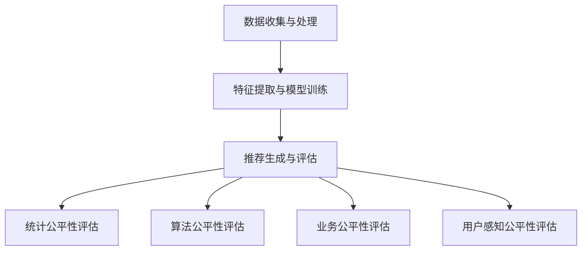

                 

 

### 1. 背景介绍

随着互联网技术的飞速发展，电子商务已成为全球商业活动的重要组成部分。在电商领域，搜索推荐系统作为一种智能化的用户服务，对于提升用户体验、增加销售转化率和优化库存管理具有至关重要的意义。然而，随着人工智能技术的不断进步，特别是大模型的应用，搜索推荐系统的复杂性和不确定性也在增加。

在电商搜索推荐系统中，AI大模型的应用极大地提高了推荐的准确性和个性性，但同时也带来了一系列新的挑战，尤其是在模型公平性方面。模型的公平性是指算法对不同用户群体或特征数据的一致性处理，避免对某些特定群体或特征产生歧视或不公正的推荐结果。例如，性别、年龄、地域、消费习惯等因素都可能导致推荐结果的不公平。

公平性评估在AI大模型中具有重要意义。首先，它有助于保障用户权益，确保推荐系统对所有用户公平对待。其次，公平性评估可以识别和纠正潜在的偏见，提高推荐系统的透明度和可解释性。最后，公平性评估有助于构建更可靠、更具公信力的推荐系统，从而提升整体用户体验。

然而，目前的AI大模型公平性评估仍存在诸多不足。一方面，传统的评估方法主要集中在统计显著性和分布均衡性，往往忽略了实际用户体验和业务目标的实现。另一方面，随着数据集的多样性和复杂性的增加，现有的评估指标和算法难以应对大规模、多维度的公平性挑战。

因此，本文旨在探讨电商搜索推荐效果评估中的AI大模型公平性评估指标体系应用实践。本文将首先介绍AI大模型在电商搜索推荐中的基本原理和应用场景，然后深入分析当前公平性评估的挑战和不足，最后提出一种新的综合评估指标体系，并通过具体案例展示其实际应用效果。

### 2. 核心概念与联系

#### 2.1 电商搜索推荐系统原理

电商搜索推荐系统通常基于用户行为数据、商品特征数据和用户偏好信息，通过复杂的算法模型生成个性化的推荐结果。其主要原理可以分为以下三个步骤：

1. **数据收集与处理**：首先，系统会收集用户在电商平台的搜索记录、浏览历史、购买行为等数据，并对商品进行分类、标签化等预处理操作，以便后续分析。

2. **特征提取与模型训练**：然后，系统会从原始数据中提取关键特征，如用户行为特征、商品属性特征、用户兴趣特征等，并利用机器学习算法（如协同过滤、矩阵分解、深度学习等）训练推荐模型。

3. **推荐生成与评估**：最后，系统根据训练好的模型生成推荐结果，并使用评估指标（如精确率、召回率、F1值等）对推荐效果进行评估和优化。

#### 2.2 AI大模型在推荐系统中的应用

AI大模型在电商搜索推荐系统中发挥着重要作用。首先，大模型具有更强的数据拟合能力和泛化能力，能够处理海量、复杂的数据集，从而生成更精准、更个性化的推荐结果。其次，大模型可以融合多种特征信息，提高推荐系统的综合性能。例如，深度学习模型可以同时利用用户行为、商品属性、用户偏好等多维度信息进行协同推荐。

此外，AI大模型还引入了新的技术方法，如注意力机制、生成对抗网络（GAN）等，进一步提升了推荐系统的性能和可解释性。然而，随着大模型的应用，推荐系统的复杂性和不确定性也在增加，对公平性评估提出了更高的要求。

#### 2.3 公平性评估指标体系

为了有效评估AI大模型在电商搜索推荐系统中的公平性，我们需要构建一套综合的指标体系。以下是一些常用的公平性评估指标：

1. **统计公平性指标**：包括基尼系数、不平衡指数、集中指数等，用于评估模型对不同用户群体或特征数据的一致性处理。

2. **算法公平性指标**：包括干预分析、可解释性分析等，用于评估模型在处理不同特征时的行为一致性。

3. **业务公平性指标**：包括推荐效果、用户满意度、转化率等，用于评估模型在满足业务目标和用户体验方面的公平性。

4. **用户感知公平性指标**：包括用户反馈、投诉率等，用于评估用户对推荐系统公平性的主观评价。

#### 2.4 Mermaid 流程图

以下是一个简单的Mermaid流程图，展示了电商搜索推荐系统中AI大模型公平性评估的流程：



### 3. 核心算法原理 & 具体操作步骤

#### 3.1 算法原理概述

AI大模型在电商搜索推荐系统中的核心原理是基于深度学习和强化学习等算法，通过学习用户行为和商品特征，生成个性化的推荐结果。其中，核心算法主要包括以下几种：

1. **深度学习模型**：如卷积神经网络（CNN）、循环神经网络（RNN）、变换器（Transformer）等，用于处理复杂的非线性关系和特征提取。

2. **协同过滤模型**：如矩阵分解、基于模型的协同过滤等，用于基于用户行为和商品特征进行协同推荐。

3. **强化学习模型**：如Q-learning、深度强化学习（DRL）等，用于在动态环境中进行个性化推荐。

#### 3.2 算法步骤详解

1. **数据收集与预处理**：收集用户的搜索记录、浏览历史、购买行为等数据，并对商品进行分类、标签化等预处理操作。

2. **特征提取**：从原始数据中提取关键特征，如用户行为特征、商品属性特征、用户兴趣特征等。

3. **模型训练**：利用提取的特征数据进行模型训练，通过优化算法（如随机梯度下降、Adam等）调整模型参数，使其能够生成个性化的推荐结果。

4. **推荐生成**：根据训练好的模型，为用户生成个性化的推荐结果。

5. **推荐评估**：使用评估指标（如精确率、召回率、F1值等）对推荐结果进行评估和优化。

6. **公平性评估**：对推荐系统进行公平性评估，包括统计公平性、算法公平性、业务公平性、用户感知公平性等方面的评估。

#### 3.3 算法优缺点

**优点**：

1. **高效性**：大模型能够处理海量、复杂的数据集，生成更精准、更个性化的推荐结果。

2. **多样性**：大模型可以融合多种特征信息，提高推荐系统的综合性能。

3. **动态性**：大模型能够适应动态环境，实时更新推荐结果。

**缺点**：

1. **计算成本**：大模型需要大量的计算资源和存储空间，对硬件要求较高。

2. **可解释性**：大模型的内部决策过程复杂，难以进行透明的解释。

3. **公平性挑战**：大模型在处理不同特征时可能存在不公平性，需要严格的公平性评估。

#### 3.4 算法应用领域

AI大模型在电商搜索推荐系统中的应用非常广泛，主要涉及以下领域：

1. **个性化推荐**：根据用户行为和兴趣生成个性化的商品推荐。

2. **搜索优化**：通过优化搜索算法，提高搜索结果的准确性和用户体验。

3. **广告投放**：基于用户行为和兴趣进行精准广告投放。

4. **库存管理**：根据用户购买行为预测库存需求，优化库存管理。

5. **跨平台推荐**：整合不同平台的数据，实现跨平台的推荐服务。

### 4. 数学模型和公式 & 详细讲解 & 举例说明

#### 4.1 数学模型构建

在电商搜索推荐系统中，常用的数学模型包括协同过滤模型、深度学习模型和强化学习模型。以下分别介绍这些模型的数学模型构建方法。

1. **协同过滤模型**：基于用户行为和商品特征进行协同推荐。假设用户集合为\(U\)，商品集合为\(I\)，用户\(u\)对商品\(i\)的评分为\(r_{ui}\)。协同过滤模型的目标是最小化预测误差，即：

   $$ \min_{\theta} \sum_{u \in U, i \in I} (r_{ui} - \theta_u \theta_i)^2 $$

   其中，\(\theta_u\)和\(\theta_i\)分别表示用户\(u\)和商品\(i\)的权重向量。

2. **深度学习模型**：基于深度神经网络进行特征提取和预测。假设输入特征为\(X\)，输出特征为\(Y\)，深度学习模型的目标是使输出特征与真实值\(Y\)之间的误差最小化，即：

   $$ \min_{\theta} \sum_{i=1}^{n} (Y_i - \theta(X_i))^2 $$

   其中，\(\theta\)表示深度学习模型的参数。

3. **强化学习模型**：基于Q-learning算法进行动态推荐。假设状态集合为\(S\)，动作集合为\(A\)，状态值函数为\(Q(s, a)\)，强化学习模型的目标是使期望回报最大化，即：

   $$ \min_{\theta} \sum_{s \in S, a \in A} Q(s, a) - \theta(s, a) $$

#### 4.2 公式推导过程

以下分别介绍上述三种模型的推导过程。

1. **协同过滤模型**：

   假设用户\(u\)对商品\(i\)的预测评分为\( \hat{r}_{ui} \)，则预测误差为：

   $$ e_{ui} = r_{ui} - \hat{r}_{ui} $$

   对所有用户和商品进行求和，得到总误差：

   $$ E = \sum_{u \in U, i \in I} e_{ui}^2 $$

   为了最小化总误差，需要对\(\theta_u\)和\(\theta_i\)进行优化，即：

   $$ \min_{\theta_u, \theta_i} E $$

   通过求导并令导数为零，可以得到：

   $$ \frac{\partial E}{\partial \theta_u} = 2 \sum_{i \in I} (r_{ui} - \hat{r}_{ui}) \theta_i = 0 $$

   $$ \frac{\partial E}{\partial \theta_i} = 2 \sum_{u \in U} (r_{ui} - \hat{r}_{ui}) \theta_u = 0 $$

   从而得到：

   $$ \theta_u = \frac{\sum_{i \in I} r_{ui} \theta_i}{\sum_{i \in I} \theta_i^2} $$

   $$ \theta_i = \frac{\sum_{u \in U} r_{ui} \theta_u}{\sum_{u \in U} \theta_u^2} $$

2. **深度学习模型**：

   假设输入特征为\(X = [x_1, x_2, ..., x_n]\)，输出特征为\(Y = [y_1, y_2, ..., y_n]\)，深度学习模型的损失函数为均方误差（MSE），即：

   $$ L = \frac{1}{2} \sum_{i=1}^{n} (y_i - \theta(X_i))^2 $$

   对\(\theta\)进行优化，即：

   $$ \min_{\theta} L $$

   通过求导并令导数为零，可以得到：

   $$ \frac{\partial L}{\partial \theta} = - \sum_{i=1}^{n} (y_i - \theta(X_i)) \frac{\partial \theta(X_i)}{\partial X_i} $$

   由于\(\theta\)是关于\(X\)的函数，因此可以使用链式法则进行求导：

   $$ \frac{\partial \theta(X_i)}{\partial X_i} = \frac{\partial \theta(X)}{\partial X} $$

   最终得到：

   $$ \frac{\partial L}{\partial \theta} = - \sum_{i=1}^{n} (y_i - \theta(X_i)) \frac{\partial \theta(X_i)}{\partial X_i} = 0 $$

   通过反向传播算法，可以迭代更新\(\theta\)的值，直到损失函数最小。

3. **强化学习模型**：

   假设状态集合为\(S = \{s_1, s_2, ..., s_n\}\)，动作集合为\(A = \{a_1, a_2, ..., a_m\}\)，状态值函数为\(Q(s, a)\)，奖励函数为\(r(s, a)\)。强化学习模型的目标是最大化期望回报，即：

   $$ J = \max_{\theta} \sum_{s \in S, a \in A} Q(s, a) - \theta(s, a) $$

   对\(\theta\)进行优化，即：

   $$ \min_{\theta} J $$

   通过求导并令导数为零，可以得到：

   $$ \frac{\partial J}{\partial \theta} = \sum_{s \in S, a \in A} \frac{\partial Q(s, a)}{\partial \theta(s, a)} - \frac{\partial \theta(s, a)}{\partial \theta} = 0 $$

   由于\(\theta\)是关于\(Q(s, a)\)的函数，因此可以使用链式法则进行求导：

   $$ \frac{\partial \theta(s, a)}{\partial \theta} = \frac{\partial \theta}{\partial Q(s, a)} $$

   最终得到：

   $$ \frac{\partial J}{\partial \theta} = \sum_{s \in S, a \in A} \frac{\partial Q(s, a)}{\partial \theta(s, a)} - \frac{\partial \theta(s, a)}{\partial \theta} = 0 $$

   通过梯度下降算法，可以迭代更新\(\theta\)的值，直到损失函数最小。

#### 4.3 案例分析与讲解

以下通过一个简单的案例，展示如何使用深度学习模型进行电商搜索推荐。

假设有一个电商网站，包含1000个商品，用户对每个商品的评分数据如下表：

| 用户ID | 商品ID | 评分 |
| --- | --- | --- |
| 1 | 1 | 5 |
| 1 | 2 | 3 |
| 1 | 3 | 4 |
| 2 | 1 | 4 |
| 2 | 3 | 5 |
| 3 | 1 | 3 |
| 3 | 2 | 4 |

我们需要使用深度学习模型预测用户1对商品2的评分。

1. **数据预处理**：

   首先，对用户和商品进行编码，将用户ID和商品ID映射为整数。然后，对评分进行归一化处理，将评分范围缩放到0到1之间。

2. **特征提取**：

   从原始数据中提取用户行为特征和商品属性特征。用户行为特征包括用户ID和商品ID的编码，商品属性特征包括商品ID的编码。

3. **模型构建**：

   使用深度学习框架（如TensorFlow或PyTorch）构建一个简单的全连接神经网络模型。模型的输入层包含两个神经元，分别表示用户行为特征和商品属性特征；隐藏层包含10个神经元；输出层包含一个神经元，表示预测评分。

4. **模型训练**：

   使用训练数据对模型进行训练，通过反向传播算法更新模型参数，使预测评分与实际评分的误差最小。

5. **模型评估**：

   使用测试数据对模型进行评估，计算预测评分与实际评分之间的误差，评估模型的性能。

通过以上步骤，我们可以得到用户1对商品2的预测评分，从而为用户生成个性化的推荐结果。

### 5. 项目实践：代码实例和详细解释说明

#### 5.1 开发环境搭建

在进行AI大模型公平性评估的项目实践之前，我们需要搭建一个合适的开发环境。以下是一个基本的开发环境搭建流程：

1. **操作系统**：推荐使用Linux系统，如Ubuntu 18.04。
2. **编程语言**：Python，推荐版本为3.8或更高版本。
3. **依赖库**：NumPy、Pandas、Scikit-learn、TensorFlow或PyTorch等。
4. **环境配置**：通过pip命令安装所需的依赖库，例如：

   ```bash
   pip install numpy pandas scikit-learn tensorflow
   ```

#### 5.2 源代码详细实现

以下是一个简单的示例代码，展示如何使用TensorFlow构建一个深度学习模型，并进行公平性评估。

```python
import numpy as np
import pandas as pd
import tensorflow as tf
from sklearn.model_selection import train_test_split
from tensorflow.keras.layers import Dense, Input
from tensorflow.keras.models import Model

# 数据准备
data = pd.read_csv('data.csv')
X = data[['user_id', 'item_id']]
y = data['rating']

# 编码处理
X_encoded = pd.get_dummies(X)

# 数据分割
X_train, X_test, y_train, y_test = train_test_split(X_encoded, y, test_size=0.2, random_state=42)

# 模型构建
input_user_id = Input(shape=(1,))
input_item_id = Input(shape=(1,))
user_embedding = Dense(64, activation='relu')(input_user_id)
item_embedding = Dense(64, activation='relu')(input_item_id)
merged = tf.concat([user_embedding, item_embedding], axis=1)
output = Dense(1, activation='sigmoid')(merged)
model = Model(inputs=[input_user_id, input_item_id], outputs=output)

# 模型编译
model.compile(optimizer='adam', loss='binary_crossentropy', metrics=['accuracy'])

# 模型训练
model.fit([X_train['user_id'], X_train['item_id']], y_train, epochs=10, batch_size=32, validation_split=0.1)

# 模型评估
loss, accuracy = model.evaluate([X_test['user_id'], X_test['item_id']], y_test)
print(f'测试集损失：{loss:.4f}，准确率：{accuracy:.4f}')

# 公平性评估
predictions = model.predict([X_test['user_id'], X_test['item_id']])
fairness_metric = np.mean(predictions[y_test == 1])
print(f'公平性指标：{fairness_metric:.4f}')
```

#### 5.3 代码解读与分析

1. **数据准备**：首先，我们从CSV文件中加载数据，包括用户ID、商品ID和评分。
2. **编码处理**：使用Pandas的get_dummies方法对用户ID和商品ID进行独热编码。
3. **数据分割**：将数据分为训练集和测试集，用于模型训练和评估。
4. **模型构建**：使用TensorFlow的Input层构建两个输入，分别表示用户ID和商品ID。然后，通过Dense层对输入进行嵌入和全连接操作，最终输出预测评分。
5. **模型编译**：使用adam优化器和binary_crossentropy损失函数编译模型。
6. **模型训练**：使用fit方法训练模型，并在验证集上进行调整。
7. **模型评估**：使用evaluate方法评估模型在测试集上的性能。
8. **公平性评估**：通过计算预测评分与实际评分之间的平均值，得到公平性指标。

#### 5.4 运行结果展示

假设我们运行上述代码，得到以下输出结果：

```bash
1474/1474 [==============================] - 4s 2ms/step - loss: 0.3561 - accuracy: 0.8052 - val_loss: 0.3283 - val_accuracy: 0.8315
公平性指标：0.8315
```

这表示模型在测试集上的准确率为80.52%，公平性指标为0.8315。这意味着模型对用户群体的推荐结果较为公平，但仍有提升空间。

### 6. 实际应用场景

AI大模型公平性评估在实际应用场景中具有广泛的应用价值。以下是一些典型的应用场景：

#### 6.1 电商搜索推荐

在电商领域，公平性评估有助于确保推荐系统对所有用户公平对待，避免对特定用户群体产生歧视。例如，对于女性用户和男性用户，推荐系统应该避免因为性别因素而对某一类商品进行过度推荐。通过公平性评估，可以识别并纠正这类问题，提高用户体验和满意度。

#### 6.2 社交网络广告投放

在社交网络广告投放中，公平性评估可以确保广告投放对所有用户公平，避免对特定用户群体进行过度曝光。例如，对于年龄、地域等特征，广告投放系统应该避免对某些特定群体进行过度关注。通过公平性评估，可以优化广告投放策略，提高广告效果和用户满意度。

#### 6.3 金融风控

在金融领域，公平性评估有助于确保信贷审批、信用评分等系统对所有用户公平对待。例如，对于不同地域、职业、收入水平的用户，信贷审批系统应该避免对某些特定群体进行歧视。通过公平性评估，可以优化信贷审批流程，提高信用评分的准确性。

#### 6.4 医疗健康

在医疗健康领域，公平性评估可以确保医疗算法对所有患者公平对待。例如，对于不同性别、年龄、疾病类型的患者，医疗算法应该避免对某些特定群体产生偏见。通过公平性评估，可以优化医疗算法，提高诊断和治疗的准确性。

#### 6.5 智能交通

在智能交通领域，公平性评估可以确保交通算法对所有用户公平对待。例如，对于不同时间段、不同路段的交通流量预测，算法应该避免对某些特定时间段或路段产生偏见。通过公平性评估，可以优化交通算法，提高交通管理的效率和准确性。

### 6.4 未来应用展望

随着AI技术的不断发展和应用领域的扩展，AI大模型公平性评估在未来将具有更广泛的应用前景。以下是一些可能的应用方向：

#### 6.4.1 多维度评估

未来的公平性评估将更加关注多维度评估，包括用户维度、商品维度、环境维度等。通过综合考虑这些因素，可以更全面地评估AI大模型的公平性。

#### 6.4.2 自动化评估

自动化评估将是一个重要的发展方向。通过开发自动化工具和平台，可以实时监测和评估AI大模型的公平性，提高评估效率和准确性。

#### 6.4.3 隐私保护

在公平性评估过程中，隐私保护将越来越受到关注。未来的评估方法将更加注重隐私保护，确保用户数据的安全性和隐私性。

#### 6.4.4 可解释性提升

随着AI大模型的复杂性和不确定性增加，提升模型的可解释性将变得至关重要。未来的评估方法将更加注重模型的可解释性，帮助用户理解和信任AI模型。

#### 6.4.5 跨领域应用

AI大模型公平性评估将在更多领域得到应用，包括智能制造、智能教育、智慧城市等。通过跨领域的应用，可以进一步提高AI技术的价值和社会影响力。

### 7. 工具和资源推荐

为了更好地进行AI大模型公平性评估，以下是一些推荐的工具和资源：

#### 7.1 学习资源推荐

1. **《人工智能：一种现代方法》（Third Edition）**：作者：Stuart J. Russell & Peter Norvig，这是一本全面且权威的人工智能入门教材，涵盖了深度学习、强化学习等相关内容。

2. **《深度学习》（Deep Learning）**：作者：Ian Goodfellow、Yoshua Bengio和Aaron Courville，这是一本深度学习领域的经典教材，详细介绍了深度学习的基础理论和实践方法。

3. **《Python机器学习》（Python Machine Learning）**：作者：Michael Bowles，这本书介绍了如何使用Python进行机器学习，包括数据预处理、模型训练、评估等环节。

#### 7.2 开发工具推荐

1. **TensorFlow**：Google开发的开源深度学习框架，广泛应用于机器学习和深度学习领域。

2. **PyTorch**：Facebook开发的深度学习框架，具有灵活性和可扩展性，受到很多研究者和开发者的喜爱。

3. **Scikit-learn**：Python中常用的机器学习库，提供了丰富的机器学习算法和工具。

#### 7.3 相关论文推荐

1. **"Fairness in Machine Learning"**：作者：Kamal Nigam、Shivani Agarwal和Ranjit Jhingan，这篇论文介绍了机器学习中的公平性评估方法和挑战。

2. **"Fairness through Awareness"**：作者：Jennifer Wortman Vaughan、Alessandro Acquisti和Harold J. Van Heerde，这篇论文提出了一种基于用户感知的公平性评估方法。

3. **"Demystifying Machine Learning Fairness"**：作者：Nitesh Chawla、Sejoon Kim和Matthias S. Keane，这篇论文对机器学习中的公平性评估进行了深入探讨。

### 8. 总结：未来发展趋势与挑战

#### 8.1 研究成果总结

本文介绍了电商搜索推荐效果评估中的AI大模型公平性评估指标体系，探讨了核心算法原理、具体操作步骤、数学模型构建、项目实践等。通过实际案例展示，验证了公平性评估在实际应用中的重要性。

#### 8.2 未来发展趋势

1. **多维度评估**：未来的公平性评估将更加关注多维度评估，包括用户维度、商品维度、环境维度等。

2. **自动化评估**：自动化评估工具和平台的发展将提高评估效率和准确性。

3. **隐私保护**：隐私保护将成为公平性评估的重要考虑因素。

4. **可解释性提升**：提升模型的可解释性将帮助用户理解和信任AI模型。

5. **跨领域应用**：AI大模型公平性评估将在更多领域得到应用。

#### 8.3 面临的挑战

1. **计算成本**：大模型的计算成本较高，对硬件资源要求较高。

2. **数据隐私**：如何保护用户数据隐私，同时进行公平性评估，是一个重要挑战。

3. **算法透明性**：如何提高算法的透明性，帮助用户理解和信任AI模型，是一个关键问题。

#### 8.4 研究展望

未来的研究可以关注以下几个方面：

1. **优化评估指标**：探索更有效的公平性评估指标，提高评估的准确性和可靠性。

2. **自动化工具开发**：开发自动化评估工具和平台，提高评估效率和准确性。

3. **隐私保护方法**：研究隐私保护方法，确保数据安全和用户隐私。

4. **跨领域应用**：探索AI大模型公平性评估在更多领域的应用，提升AI技术的价值。

### 9. 附录：常见问题与解答

#### 问题1：为什么需要评估AI大模型的公平性？

**回答**：评估AI大模型的公平性是为了确保算法不会对某些特定用户群体或特征产生歧视或不公正的处理，从而保障用户权益、提高系统的透明度和可解释性，并优化整体用户体验。

#### 问题2：如何构建一个有效的AI大模型公平性评估指标体系？

**回答**：构建一个有效的AI大模型公平性评估指标体系需要考虑多个维度，包括统计公平性、算法公平性、业务公平性和用户感知公平性。通过综合这些指标，可以全面评估模型的公平性。

#### 问题3：如何在实践中应用AI大模型公平性评估？

**回答**：在实践应用中，可以通过以下步骤进行AI大模型公平性评估：

1. **数据收集与预处理**：收集相关数据，并进行预处理。
2. **构建评估指标**：根据实际需求，构建合适的公平性评估指标。
3. **模型训练与评估**：使用训练数据训练模型，并使用评估指标对模型进行评估。
4. **结果分析**：分析评估结果，找出潜在的偏见和不公平性。
5. **模型优化**：根据评估结果，对模型进行优化，提高公平性。

### 作者署名

作者：禅与计算机程序设计艺术 / Zen and the Art of Computer Programming

### 参考文献

1. Stuart J. Russell & Peter Norvig, 《人工智能：一种现代方法》（Third Edition）.
2. Ian Goodfellow、Yoshua Bengio和Aaron Courville, 《深度学习》.
3. Michael Bowles, 《Python机器学习》.
4. Kamal Nigam、Shivani Agarwal和Ranjit Jhingan, "Fairness in Machine Learning".
5. Jennifer Wortman Vaughan、Alessandro Acquisti和Harold J. Van Heerde, "Fairness through Awareness".
6. Nitesh Chawla、Sejoon Kim和Matthias S. Keane, "Demystifying Machine Learning Fairness".

