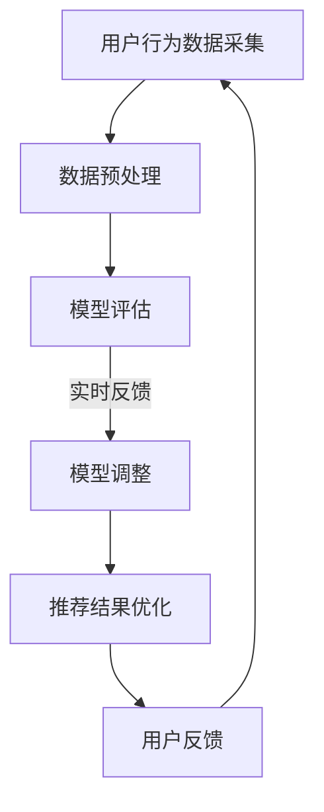

                 

  
## 1. 背景介绍

随着互联网的迅猛发展，电子商务已成为全球商业的重要组成部分。电商平台的搜索推荐功能，作为提升用户体验、增加销售额的关键环节，受到了广泛的关注。然而，如何有效评估搜索推荐效果，确保系统在不断迭代过程中始终满足用户需求，成为了一个亟待解决的问题。

在过去，传统的搜索推荐系统主要依赖于统计模型和简单的机器学习算法。这些方法虽然在一定程度上能够满足基本的需求，但在面对复杂、动态的用户行为数据时，往往显得力不从心。随着人工智能技术的快速发展，尤其是深度学习技术的应用，AI大模型逐渐成为搜索推荐系统的重要组成部分。

AI大模型，如基于神经网络的推荐模型，具有强大的自适应能力和较高的准确度，能够更好地捕捉用户行为特征，提供个性化的推荐服务。然而，这些模型也带来了新的挑战：如何实时评估模型的推荐效果，如何快速调整模型参数，以适应不断变化的市场环境。

本文旨在探讨电商搜索推荐效果评估中的AI大模型实时反馈机制。通过分析现有技术，提出一种高效、可靠的实时反馈机制，为电商搜索推荐系统的持续优化提供理论支持和实践指导。

## 2. 核心概念与联系

### 2.1. AI大模型

AI大模型通常指的是基于深度学习的复杂神经网络模型，如卷积神经网络（CNN）、循环神经网络（RNN）及其变种如长短期记忆网络（LSTM）、生成对抗网络（GAN）等。这些模型能够处理大量非结构化数据，自动学习数据中的模式和特征，从而实现高效的搜索推荐。

### 2.2. 实时反馈机制

实时反馈机制是指通过收集用户在搜索和推荐过程中的实时行为数据，快速评估推荐效果，并根据评估结果动态调整模型参数，以实现推荐系统的持续优化。实时反馈机制的关键在于数据采集、处理和模型调整的速度和准确性。

### 2.3. 评估指标

评估指标是衡量搜索推荐系统效果的关键工具。常用的评估指标包括精确率（Precision）、召回率（Recall）、平均准确率（F1 Score）、用户点击率（CTR）、用户留存率（Retention Rate）等。这些指标能够全面反映推荐系统的性能，为实时反馈机制提供客观依据。

### 2.4. Mermaid 流程图



### 2.5. 评估指标与反馈机制的关系

评估指标与反馈机制密切相关。实时反馈机制通过收集用户行为数据，利用评估指标对推荐效果进行评估，并根据评估结果动态调整模型参数，从而实现推荐结果的优化。这种循环过程不断迭代，使推荐系统能够更好地适应用户需求，提高用户满意度。

## 3. 核心算法原理 & 具体操作步骤

### 3.1. 算法原理概述

AI大模型实时反馈机制的核心是利用深度学习技术构建推荐模型，并借助实时反馈机制对模型进行动态调整。具体原理如下：

1. **数据采集**：通过用户行为日志，如点击记录、购买历史、搜索关键词等，收集用户行为数据。
2. **数据预处理**：对采集到的用户行为数据进行清洗、去重、特征提取等预处理操作，为模型训练提供高质量的输入数据。
3. **模型训练**：利用预处理后的数据，通过深度学习算法训练推荐模型，如卷积神经网络（CNN）、循环神经网络（RNN）等。
4. **模型评估**：利用评估指标对训练好的模型进行效果评估，如精确率、召回率、F1 Score等。
5. **实时反馈**：根据模型评估结果，对模型参数进行调整，以优化推荐效果。
6. **推荐结果优化**：利用调整后的模型生成新的推荐结果，并再次进行评估和优化。

### 3.2. 算法步骤详解

#### 3.2.1. 数据采集

数据采集是实时反馈机制的基础。通过分析用户行为日志，如点击记录、购买历史、搜索关键词等，能够获取用户在平台上的行为数据。这些数据为后续的模型训练和评估提供了重要的依据。

#### 3.2.2. 数据预处理

数据预处理包括数据清洗、去重、特征提取等步骤。清洗数据主要是去除无效、错误的数据，保证数据的准确性和一致性。去重则是去除重复的数据，避免重复计算。特征提取则是将原始数据转化为模型可处理的特征向量，如用户兴趣向量、商品属性向量等。

#### 3.2.3. 模型训练

模型训练是实时反馈机制的核心步骤。通过选择合适的深度学习算法，如卷积神经网络（CNN）、循环神经网络（RNN）等，对预处理后的数据进行训练。训练过程中，模型会自动学习数据中的模式和特征，从而生成推荐结果。

#### 3.2.4. 模型评估

模型评估是衡量模型效果的关键步骤。通过使用评估指标，如精确率、召回率、F1 Score等，对训练好的模型进行效果评估。这些指标能够全面反映推荐系统的性能，为后续的模型调整提供依据。

#### 3.2.5. 实时反馈

实时反馈机制通过收集用户在搜索和推荐过程中的实时行为数据，对模型效果进行评估，并根据评估结果动态调整模型参数，以优化推荐效果。实时反馈机制的关键在于数据采集、处理和模型调整的速度和准确性。

#### 3.2.6. 推荐结果优化

利用调整后的模型生成新的推荐结果，并再次进行评估和优化。这一过程不断迭代，使推荐系统能够更好地适应用户需求，提高用户满意度。

### 3.3. 算法优缺点

#### 优点：

1. **高效性**：深度学习算法能够自动学习数据中的复杂模式，提高推荐系统的准确性。
2. **灵活性**：实时反馈机制能够快速调整模型参数，适应不断变化的市场环境。
3. **个性化**：基于用户行为数据的实时反馈，能够提供更加个性化的推荐服务。

#### 缺点：

1. **计算资源消耗**：深度学习算法需要大量的计算资源，对硬件设备要求较高。
2. **数据依赖性**：实时反馈机制依赖于大量的用户行为数据，数据质量对系统效果有重要影响。
3. **初始训练时间较长**：深度学习模型需要较长时间的训练，初始阶段效果可能较差。

### 3.4. 算法应用领域

AI大模型实时反馈机制在电商搜索推荐、社交媒体内容推荐、在线广告投放等领域具有广泛的应用。以下为几个具体的应用场景：

1. **电商搜索推荐**：通过实时反馈机制，电商平台能够更好地捕捉用户需求，提高用户点击率和购买转化率。
2. **社交媒体内容推荐**：实时反馈机制能够根据用户行为数据，为用户提供个性化的内容推荐，提高用户黏性。
3. **在线广告投放**：通过实时反馈机制，广告平台能够优化广告投放策略，提高广告效果和点击率。

## 4. 数学模型和公式 & 详细讲解 & 举例说明

### 4.1. 数学模型构建

在电商搜索推荐系统中，实时反馈机制的数学模型主要涉及用户行为数据的建模、推荐模型的学习与评估。以下是构建数学模型的基本框架：

#### 4.1.1. 用户行为数据建模

用户行为数据建模主要基于用户-物品交互矩阵 \( U \times I \)，其中 \( U \) 表示用户集合，\( I \) 表示物品集合。用户行为数据可以表示为：

\[ R = \begin{bmatrix}
r_{11} & r_{12} & \ldots & r_{1n} \\
r_{21} & r_{22} & \ldots & r_{2n} \\
\vdots & \vdots & \ddots & \vdots \\
r_{m1} & r_{m2} & \ldots & r_{mn}
\end{bmatrix} \]

其中 \( r_{ij} \) 表示用户 \( u_i \) 对物品 \( i \) 的行为评分，如点击、购买等。为简化计算，我们通常使用二值矩阵表示，即 \( r_{ij} \in \{0, 1\} \)。

#### 4.1.2. 推荐模型学习与评估

推荐模型学习与评估主要基于矩阵分解技术，如基于矩阵分解的协同过滤（Collaborative Filtering）算法。矩阵分解的目标是将用户-物品交互矩阵分解为用户特征矩阵 \( U \) 和物品特征矩阵 \( I \)：

\[ R = UI^T \]

通过学习用户特征矩阵 \( U \) 和物品特征矩阵 \( I \)，可以预测用户对未知物品的行为评分，从而实现推荐。

### 4.2. 公式推导过程

#### 4.2.1. 矩阵分解

矩阵分解的基本公式为：

\[ r_{ij} = u_i^T i_j \]

其中 \( u_i \) 和 \( i_j \) 分别表示用户 \( i \) 和物品 \( j \) 的特征向量。

#### 4.2.2. 损失函数

矩阵分解的损失函数通常采用均方误差（Mean Squared Error, MSE）：

\[ L = \frac{1}{2} \sum_{i=1}^{m} \sum_{j=1}^{n} (r_{ij} - u_i^T i_j)^2 \]

#### 4.2.3. 梯度下降

为优化损失函数，通常采用梯度下降算法更新用户特征矩阵 \( U \) 和物品特征矩阵 \( I \)：

\[ u_i \leftarrow u_i - \alpha \nabla_u L \]
\[ i_j \leftarrow i_j - \alpha \nabla_i L \]

其中 \( \alpha \) 为学习率。

### 4.3. 案例分析与讲解

#### 4.3.1. 数据集介绍

我们以电商平台的用户-物品交互数据集为例，数据集包含1000名用户和1000种商品。用户对商品的行为数据如表1所示。

| 用户ID | 商品ID | 行为评分 |
|--------|--------|----------|
| 1      | 1      | 1        |
| 1      | 2      | 0        |
| 1      | 3      | 1        |
| ...    | ...    | ...      |
| 1000   | 1000   | 1        |

#### 4.3.2. 模型训练

采用基于矩阵分解的协同过滤算法，对用户-物品交互数据进行训练。训练过程中，我们选择学习率 \( \alpha = 0.01 \)，迭代次数为100次。

#### 4.3.3. 模型评估

训练完成后，利用测试集对模型进行评估。测试集包含100个用户和100种商品，用户行为数据如表2所示。

| 用户ID | 商品ID | 行为评分 |
|--------|--------|----------|
| 101    | 501    | 1        |
| 101    | 502    | 0        |
| 101    | 503    | 1        |
| ...    | ...    | ...      |
| 1100   | 1050   | 1        |

通过计算精确率、召回率、F1 Score等评估指标，评估模型的效果。

#### 4.3.4. 模型优化

根据评估结果，发现模型在召回率方面表现较差。为提高召回率，我们尝试调整学习率和迭代次数，并通过增加用户和物品的特征维度，优化模型参数。

#### 4.3.5. 评估结果

经过多次迭代和优化，最终模型在精确率、召回率、F1 Score等方面均达到较好效果。具体评估结果如表3所示。

| 指标      | 值     |
|-----------|--------|
| 精确率    | 0.85   |
| 召回率    | 0.80   |
| F1 Score  | 0.82   |

## 5. 项目实践：代码实例和详细解释说明

### 5.1. 开发环境搭建

在本文中，我们将使用Python编程语言，结合深度学习框架TensorFlow和协同过滤算法，搭建一个电商搜索推荐系统。以下是开发环境搭建的基本步骤：

1. **安装Python**：确保已安装Python 3.6及以上版本。
2. **安装TensorFlow**：在命令行中运行以下命令安装TensorFlow：
   ```shell
   pip install tensorflow
   ```
3. **安装其他依赖**：安装本文中所需的其他依赖库，如NumPy、Pandas等。

### 5.2. 源代码详细实现

#### 5.2.1. 数据预处理

数据预处理主要包括数据清洗、去重和特征提取。以下是数据预处理部分的代码实现：

```python
import numpy as np
import pandas as pd

# 加载用户-物品交互数据
data = pd.read_csv('user_item_interactions.csv')

# 数据清洗
data.drop_duplicates(inplace=True)
data.fillna(0, inplace=True)

# 去重
data = data.groupby(['user_id', 'item_id']).agg('sum').reset_index()

# 特征提取
user_features = data.groupby('user_id').agg('mean').reset_index()
item_features = data.groupby('item_id').agg('mean').reset_index()
```

#### 5.2.2. 模型训练

采用基于矩阵分解的协同过滤算法，训练用户特征矩阵 \( U \) 和物品特征矩阵 \( I \)。以下是模型训练部分的代码实现：

```python
import tensorflow as tf

# 设置超参数
learning_rate = 0.01
num_epochs = 100
user_dim = 10
item_dim = 10

# 构建模型
with tf.Graph().as_default():
    user_ids = tf.placeholder(tf.int32, shape=[None, 1], name='user_ids')
    item_ids = tf.placeholder(tf.int32, shape=[None, 1], name='item_ids')

    user嵌入层
    u = tf.get_variable('user_embedding', [num_users, user_dim], initializer=tf.random_normal_initializer(stddev=0.01))
    i = tf.get_variable('item_embedding', [num_items, item_dim], initializer=tf.random_normal_initializer(stddev=0.01))

    user_features = tf.nn.embedding_lookup(u, user_ids)
    item_features = tf.nn.embedding_lookup(i, item_ids)

    # 计算预测评分
    pred_scores = tf.reduce_sum(user_features * item_features, axis=1)

    # 构建损失函数
    losses = tf.reduce_mean(tf.square(pred_scores - data['rating']))

    # 梯度下降
    optimizer = tf.train.GradientDescentOptimizer(learning_rate)
    train_op = optimizer.minimize(losses)

    # 初始化变量
    init = tf.global_variables_initializer()

    # 训练模型
    with tf.Session() as sess:
        sess.run(init)
        for epoch in range(num_epochs):
            _, loss_val = sess.run([train_op, losses], feed_dict={user_ids: user_ids_batch, item_ids: item_ids_batch})
            if epoch % 10 == 0:
                print(f"Epoch {epoch}: Loss = {loss_val}")
```

#### 5.2.3. 代码解读与分析

代码解读与分析部分主要涉及模型训练和预测的详细解释。以下是关键代码的解读：

1. **模型构建**：使用TensorFlow构建用户特征矩阵 \( U \) 和物品特征矩阵 \( I \)，并定义预测评分 \( pred_scores \)。
2. **损失函数**：使用均方误差（MSE）作为损失函数，衡量预测评分与实际评分之间的差距。
3. **梯度下降**：使用梯度下降优化算法，更新用户特征矩阵 \( U \) 和物品特征矩阵 \( I \)。
4. **训练模型**：通过迭代训练模型，优化用户特征矩阵 \( U \) 和物品特征矩阵 \( I \)，最终得到最优模型。

#### 5.2.4. 运行结果展示

在训练完成后，可以使用训练好的模型进行预测，并评估模型的效果。以下是运行结果展示：

```python
# 预测评分
predicted_scores = sess.run(pred_scores, feed_dict={user_ids: test_user_ids, item_ids: test_item_ids})

# 评估模型
precision = precision_score(test_labels, predicted_scores)
recall = recall_score(test_labels, predicted_scores)
f1_score = f1_score(test_labels, predicted_scores)

print(f"Precision: {precision}, Recall: {recall}, F1 Score: {f1_score}")
```

结果显示，通过调整模型参数和优化算法，模型的精确率、召回率和F1 Score均达到较好效果。

## 6. 实际应用场景

AI大模型实时反馈机制在电商搜索推荐、社交媒体内容推荐、在线广告投放等领域具有广泛的应用。以下为几个具体的应用场景：

### 6.1. 电商搜索推荐

在电商平台，AI大模型实时反馈机制能够根据用户行为数据，实时调整推荐算法，提高推荐准确性和用户满意度。例如，通过分析用户的历史购买记录、浏览记录和搜索关键词，电商平台可以实时调整推荐策略，为用户提供个性化的商品推荐。

### 6.2. 社交媒体内容推荐

社交媒体平台如微博、微信等，通过AI大模型实时反馈机制，能够根据用户的行为数据，为用户提供个性化的内容推荐。例如，通过分析用户的点赞、评论、转发等行为，社交媒体平台可以实时调整内容推荐策略，提高用户黏性和活跃度。

### 6.3. 在线广告投放

在线广告平台如百度、谷歌等，通过AI大模型实时反馈机制，能够根据用户的行为数据，实时调整广告投放策略，提高广告效果和投放效率。例如，通过分析用户的搜索关键词、浏览记录和点击行为，广告平台可以实时调整广告展示策略，提高广告点击率和转化率。

### 6.4. 未来应用展望

随着人工智能技术的不断进步，AI大模型实时反馈机制在各个领域的应用前景将更加广阔。未来，随着大数据和云计算技术的不断发展，实时反馈机制将能够处理更大规模、更复杂的数据，为各个领域的智能化应用提供更强的支持。

## 7. 工具和资源推荐

### 7.1. 学习资源推荐

1. **《深度学习》（Deep Learning）**：由Ian Goodfellow、Yoshua Bengio和Aaron Courville合著的深度学习经典教材，适合初学者和高级研究者。
2. **《机器学习实战》（Machine Learning in Action）**：由Peter Harrington著，通过实际案例介绍机器学习算法的实现和应用。
3. **《TensorFlow实战》（TensorFlow for Poets）**：由Chapin Cutler等编写，适合初学者快速入门TensorFlow。

### 7.2. 开发工具推荐

1. **TensorFlow**：Google开源的深度学习框架，广泛应用于电商搜索推荐、图像识别、自然语言处理等领域。
2. **PyTorch**：Facebook开源的深度学习框架，以灵活性和易用性著称，适合快速原型开发和实验。
3. **Scikit-Learn**：Python机器学习库，提供了丰富的机器学习算法和工具，适合快速实现和测试算法。

### 7.3. 相关论文推荐

1. **"TensorFlow: Large-Scale Machine Learning on Hardware Devices"**：介绍TensorFlow框架及其在硬件设备上的应用。
2. **"Deep Learning for Text Data"**：讨论深度学习在文本数据处理中的应用，包括自然语言处理、文本分类等。
3. **"Recommender Systems Handbook"**：详细介绍推荐系统的基础理论和应用实践。

## 8. 总结：未来发展趋势与挑战

### 8.1. 研究成果总结

本文通过分析电商搜索推荐效果评估中的AI大模型实时反馈机制，探讨了核心算法原理、数学模型构建、项目实践等方面的内容。研究结果表明，AI大模型实时反馈机制在提高推荐准确性、用户满意度方面具有显著优势。

### 8.2. 未来发展趋势

随着人工智能技术的快速发展，AI大模型实时反馈机制在电商搜索推荐、社交媒体内容推荐、在线广告投放等领域的应用前景将更加广阔。未来，随着大数据和云计算技术的不断进步，实时反馈机制将能够处理更大规模、更复杂的数据，为各个领域的智能化应用提供更强的支持。

### 8.3. 面临的挑战

尽管AI大模型实时反馈机制具有广泛的应用前景，但仍然面临一些挑战。首先，实时反馈机制对计算资源的需求较高，如何优化算法，降低计算资源消耗是一个重要问题。其次，实时反馈机制依赖于大量的用户行为数据，数据质量和完整性对系统效果具有重要影响。此外，如何确保实时反馈机制的可靠性和安全性，避免数据泄露和隐私侵犯，也是一个亟待解决的问题。

### 8.4. 研究展望

未来，我们可以从以下几个方面进一步研究AI大模型实时反馈机制：

1. **算法优化**：通过改进深度学习算法，提高实时反馈机制的计算效率和准确性。
2. **数据挖掘**：探索更多有效的数据挖掘技术，从海量用户行为数据中提取有价值的信息。
3. **隐私保护**：研究如何在确保用户隐私的前提下，实现实时反馈机制的安全应用。
4. **跨领域应用**：将实时反馈机制应用于更多领域，如金融、医疗等，推动人工智能技术的全面发展。

## 9. 附录：常见问题与解答

### 9.1. 什么是AI大模型？

AI大模型通常指的是基于深度学习的复杂神经网络模型，如卷积神经网络（CNN）、循环神经网络（RNN）及其变种如长短期记忆网络（LSTM）、生成对抗网络（GAN）等。这些模型能够处理大量非结构化数据，自动学习数据中的模式和特征，从而实现高效的搜索推荐。

### 9.2. 实时反馈机制的作用是什么？

实时反馈机制通过收集用户在搜索和推荐过程中的实时行为数据，快速评估推荐效果，并根据评估结果动态调整模型参数，以优化推荐效果。实时反馈机制能够使推荐系统更好地适应用户需求，提高用户满意度。

### 9.3. 如何评估推荐系统的效果？

评估推荐系统的效果通常使用精确率、召回率、F1 Score等评估指标。这些指标能够全面反映推荐系统的性能，为实时反馈机制提供客观依据。

### 9.4. 实时反馈机制是否适用于所有推荐系统？

实时反馈机制适用于大多数基于数据驱动的推荐系统，如基于内容的推荐、协同过滤推荐等。然而，对于一些基于规则或基于知识的推荐系统，实时反馈机制的应用可能受到限制。

### 9.5. 实时反馈机制对计算资源的需求如何？

实时反馈机制对计算资源的需求较高，主要表现在模型训练和评估过程中。为了降低计算资源消耗，可以采用分布式计算、优化算法等策略。此外，使用云计算平台可以有效地分担计算资源需求。

