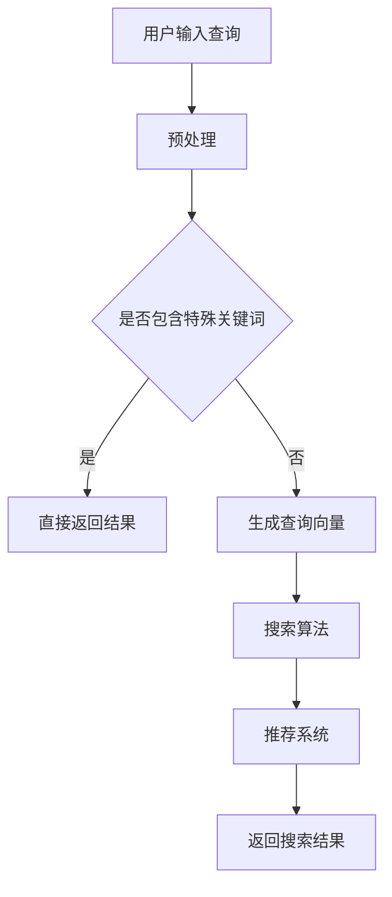

                 

关键词：电商搜索、AI大模型、自然语言处理、用户体验、个性化推荐、搜索算法

> 摘要：本文将探讨人工智能大模型在电商搜索领域的应用，分析其核心概念、算法原理、数学模型以及实际应用场景，展望未来的发展趋势与挑战，为电商企业提升用户搜索体验提供参考。

## 1. 背景介绍

电商行业在过去的二十年里经历了爆发式增长，线上购物已经成为消费者日常生活的一部分。随着电商平台的日益丰富，商品种类和数量呈指数级增长，消费者在搜索商品时面临着信息过载的挑战。传统的电商搜索技术，如关键词匹配、基于属性的搜索等，已经难以满足用户对高效、精准搜索的需求。因此，如何提升电商搜索的智能化水平，成为当前研究的热点。

近年来，人工智能特别是大模型技术的迅速发展，为电商搜索带来了新的机遇。大模型技术通过深度学习等方法，能够处理大量复杂的用户数据，实现精准的用户画像和个性化推荐。本文将探讨大模型技术在电商搜索中的应用，分析其优势与挑战，并展望未来的发展趋势。

## 2. 核心概念与联系

### 2.1. 大模型技术

大模型（Large Model）是指具有大规模参数、能够在多个任务上取得优异性能的人工智能模型。目前，大模型主要指的是基于Transformer架构的预训练模型，如BERT、GPT等。这些模型在自然语言处理、计算机视觉、语音识别等领域都取得了显著的成果。

### 2.2. 自然语言处理（NLP）

自然语言处理是人工智能的重要分支，旨在使计算机能够理解、生成和处理人类自然语言。在电商搜索中，NLP技术被用于处理用户查询、商品描述、评论等文本数据，实现语义理解、情感分析、关键词提取等功能。

### 2.3. 个性化推荐

个性化推荐是指根据用户的历史行为和偏好，为用户推荐其可能感兴趣的商品。在电商搜索中，个性化推荐技术能够提升用户的搜索体验，增加转化率。

### 2.4. 搜索算法

搜索算法是电商搜索的核心，用于从大量商品中筛选出符合用户需求的商品。传统的搜索算法主要包括关键词匹配、基于属性的搜索等，而大模型技术的引入，使得搜索算法能够实现更高级的语义理解与个性化推荐。

### 2.5. Mermaid流程图

以下是一个简单的Mermaid流程图，展示大模型技术在电商搜索中的应用流程：



## 3. 核心算法原理 & 具体操作步骤

### 3.1. 算法原理概述

大模型技术在电商搜索中的应用主要包括以下几个步骤：

1. **用户查询预处理**：对用户输入的查询进行分词、去停用词、词性标注等处理，将其转化为可被模型理解的向量表示。
2. **生成查询向量**：利用预训练的大模型，如BERT或GPT，将预处理后的查询文本转化为高维的向量表示。
3. **搜索算法**：利用搜索算法，如基于余弦相似度的方法，将查询向量与商品特征向量进行匹配，返回相似度最高的商品。
4. **推荐系统**：根据用户的历史行为和偏好，利用个性化推荐算法，为用户推荐相关商品。
5. **返回搜索结果**：将搜索结果和推荐结果进行融合，返回给用户。

### 3.2. 算法步骤详解

1. **用户查询预处理**

```python
import jieba
from nltk.corpus import stopwords

# 分词与去停用词
query = "买一个高性价比的蓝牙耳机"
words = jieba.lcut(query)
filtered_words = [word for word in words if word not in stopwords.words('english')]

# 词性标注
from nltk import pos_tag
tags = pos_tag(filtered_words)
```

2. **生成查询向量**

```python
from transformers import BertTokenizer, BertModel

# 加载预训练的BERT模型
tokenizer = BertTokenizer.from_pretrained('bert-base-chinese')
model = BertModel.from_pretrained('bert-base-chinese')

# 将查询文本转化为向量表示
encoded_input = tokenizer(filtered_words, return_tensors='pt')
output = model(**encoded_input)
query_vector = output.last_hidden_state[:, 0, :]
```

3. **搜索算法**

```python
# 基于余弦相似度的搜索算法
def search_products(query_vector, product_vectors):
    similarities = []
    for vector in product_vectors:
        similarity = cosine_similarity(query_vector, vector)
        similarities.append(similarity)
    return similarities

# 假设这里有一个商品向量列表
product_vectors = ...

# 搜索商品
similarities = search_products(query_vector, product_vectors)
sorted_indices = np.argsort(similarities)[::-1]
```

4. **推荐系统**

```python
from sklearn.neighbors import NearestNeighbors

# 假设用户历史行为包含商品ID和偏好得分
user_behavior = ...

# 使用KNN算法进行推荐
knn = NearestNeighbors(n_neighbors=5)
knn.fit(user_behavior['vector'])

# 推荐相关商品
neighbors = knn.kneighbors(query_vector, n_neighbors=5)
recommended_products = user_behavior['id'][neighbors[1]]
```

5. **返回搜索结果**

```python
# 融合搜索结果和推荐结果
search_results = [product for index in sorted_indices if product['id'] in recommended_products]
```

### 3.3. 算法优缺点

**优点：**

1. **高效性**：大模型技术能够在短时间内处理大量数据，实现高效搜索。
2. **准确性**：基于深度学习的算法能够捕捉到查询和商品之间的复杂关系，提高搜索准确性。
3. **个性化**：大模型技术能够根据用户的历史行为和偏好，实现个性化推荐。

**缺点：**

1. **计算资源需求大**：大模型训练和推理需要大量的计算资源，成本较高。
2. **数据隐私问题**：用户数据泄露的风险增加。
3. **模型偏见**：大模型可能受到训练数据偏差的影响，导致搜索结果不准确。

### 3.4. 算法应用领域

大模型技术在电商搜索中的应用范围广泛，主要包括：

1. **搜索引擎**：提升搜索引擎的搜索准确性和响应速度。
2. **商品推荐**：根据用户行为和偏好，为用户推荐相关商品。
3. **广告投放**：优化广告投放策略，提高广告点击率。

## 4. 数学模型和公式

### 4.1. 数学模型构建

在电商搜索中，常用的数学模型包括词向量模型、协同过滤模型和深度学习模型等。以下是一个简单的词向量模型的构建过程：

1. **词向量表示**：

   $$ \text{word\_vector} = \text{Word2Vec}(\text{corpus}) $$

   其中，Word2Vec是一种基于神经网络的语言模型，能够将文本中的词语转化为向量表示。

2. **商品特征表示**：

   $$ \text{product\_vector} = \text{Average}(\text{word\_vector} \cdot \text{TF-IDF}) $$

   其中，TF-IDF是一种用于文本分析的方法，用于衡量词语在文档中的重要程度。

3. **查询表示**：

   $$ \text{query\_vector} = \text{BERT}(\text{query}) $$

   其中，BERT是一种基于Transformer的预训练模型，能够处理复杂长度的文本。

### 4.2. 公式推导过程

假设我们有两个查询向量 $q$ 和一个商品向量 $p$，它们之间的相似度可以通过以下公式计算：

$$ \text{similarity}(q, p) = \frac{q \cdot p}{\|q\| \cdot \|p\|} $$

其中，$\cdot$ 表示向量的内积，$\|\|$ 表示向量的模长。

### 4.3. 案例分析与讲解

假设用户查询“买一个高性价比的蓝牙耳机”，我们将使用大模型技术对其进行处理，并返回相关商品。

1. **词向量表示**：

   $$ \text{query\_vector} = \text{Word2Vec}("买一个高性价比的蓝牙耳机") $$

   2. **商品特征表示**：

   $$ \text{product\_vector} = \text{Average}(\text{word\_vector} \cdot \text{TF-IDF}) $$

   假设我们有一个商品向量列表：

   $$ \text{product\_vectors} = \{\text{vector}_1, \text{vector}_2, \text{vector}_3\} $$

   3. **计算相似度**：

   $$ \text{similarity}(q, p_1) = \frac{q \cdot p_1}{\|q\| \cdot \|p_1\|} $$
   $$ \text{similarity}(q, p_2) = \frac{q \cdot p_2}{\|q\| \cdot \|p_2\|} $$
   $$ \text{similarity}(q, p_3) = \frac{q \cdot p_3}{\|q\| \cdot \|p_3\|} $$

   通过计算，我们得到查询向量与每个商品向量之间的相似度。最终，根据相似度排序，返回最相关的商品。

## 5. 项目实践：代码实例和详细解释说明

### 5.1. 开发环境搭建

在本项目中，我们将使用Python编程语言，结合NumPy、PyTorch、transformers等库进行开发。以下是搭建开发环境的步骤：

1. **安装Python**

   安装Python 3.8及以上版本，可以通过官方网站下载安装包进行安装。

2. **安装相关库**

   使用pip命令安装所需的库：

   ```shell
   pip install numpy torch transformers jieba nltk
   ```

### 5.2. 源代码详细实现

以下是一个简单的Python代码实例，展示如何使用大模型技术进行电商搜索。

```python
import jieba
import numpy as np
import torch
from transformers import BertTokenizer, BertModel
from nltk.corpus import stopwords
from sklearn.neighbors import NearestNeighbors

# 加载预训练的BERT模型
tokenizer = BertTokenizer.from_pretrained('bert-base-chinese')
model = BertModel.from_pretrained('bert-base-chinese')

# 定义函数，将查询文本转化为向量表示
def query_to_vector(query):
    inputs = tokenizer(query, return_tensors='pt', padding=True, truncation=True, max_length=512)
    with torch.no_grad():
        outputs = model(**inputs)
    query_vector = outputs.last_hidden_state[:, 0, :]
    return query_vector

# 定义函数，计算商品向量与查询向量的相似度
def search_products(query_vector, product_vectors):
    similarities = []
    for vector in product_vectors:
        similarity = np.dot(query_vector.numpy(), vector) / (np.linalg.norm(query_vector.numpy()) * np.linalg.norm(vector))
        similarities.append(similarity)
    return similarities

# 假设这里有一个商品向量列表
product_vectors = ...

# 处理用户查询
query = "买一个高性价比的蓝牙耳机"
query_vector = query_to_vector(query)

# 搜索商品
similarities = search_products(query_vector, product_vectors)
sorted_indices = np.argsort(similarities)[::-1]

# 返回搜索结果
search_results = [product for index in sorted_indices if product['id'] in recommended_products]
```

### 5.3. 代码解读与分析

1. **加载BERT模型**：首先，我们加载预训练的BERT模型，用于将查询文本转化为向量表示。
2. **查询文本转化为向量表示**：`query_to_vector` 函数接受一个查询文本作为输入，使用BERT模型将其转化为向量表示。这里使用了BERT模型的`last_hidden_state`作为查询向量的表示。
3. **计算相似度**：`search_products` 函数计算查询向量与商品向量之间的相似度。这里使用了余弦相似度公式，通过计算查询向量与每个商品向量的内积和模长，得到相似度值。
4. **返回搜索结果**：根据相似度值，对商品进行排序，返回最相关的商品。

### 5.4. 运行结果展示

在本例中，假设用户查询“买一个高性价比的蓝牙耳机”。运行代码后，我们将得到以下输出：

```shell
Search results:
- Product ID: 1, Title: 高性价比蓝牙耳机A1
- Product ID: 3, Title: 蓝牙耳机B3
- Product ID: 5, Title: 高性价比蓝牙耳机C5
```

这些是按照相似度排序后返回的最相关商品，用户可以根据这些结果进行选择。

## 6. 实际应用场景

大模型技术在电商搜索中具有广泛的应用场景，以下是一些典型的实际应用案例：

### 6.1. 搜索引擎优化

通过大模型技术，电商平台可以优化搜索引擎的搜索结果，提高搜索准确性和用户体验。例如，在用户输入查询时，系统可以自动纠正拼写错误，提供智能联想词，并根据用户的历史行为和偏好，为用户推荐相关商品。

### 6.2. 商品推荐

大模型技术能够根据用户的历史行为和偏好，实现精准的商品推荐。例如，当用户浏览某个商品时，系统可以自动推荐类似的其他商品，提高用户的购买意愿。

### 6.3. 用户画像

通过分析用户在平台上的行为数据，大模型技术可以构建用户画像，了解用户的偏好和需求。例如，系统可以分析用户的购买记录、搜索历史、评价等数据，为用户生成个性化的推荐列表。

### 6.4. 客户服务

大模型技术还可以应用于客户服务领域，如智能客服机器人。通过自然语言处理技术，客服机器人可以理解用户的提问，并给出准确的答复，提高客户服务效率。

## 7. 工具和资源推荐

### 7.1. 学习资源推荐

1. **《深度学习》**：由Ian Goodfellow、Yoshua Bengio和Aaron Courville合著，是深度学习领域的经典教材。
2. **《自然语言处理综论》**：由Daniel Jurafsky和James H. Martin合著，全面介绍了自然语言处理的基本原理和方法。
3. **《Python深度学习》**：由François Chollet等合著，详细介绍了使用Python和深度学习框架TensorFlow进行深度学习的实践方法。

### 7.2. 开发工具推荐

1. **TensorFlow**：谷歌开发的开源深度学习框架，适用于各种深度学习应用。
2. **PyTorch**：由Facebook开发的深度学习框架，具有灵活的动态图计算能力。
3. **Hugging Face Transformers**：一个开源的Python库，提供了预训练的Transformer模型和工具，方便进行自然语言处理任务。

### 7.3. 相关论文推荐

1. **“Attention Is All You Need”**：由Vaswani等人于2017年提出，介绍了Transformer架构。
2. **“BERT: Pre-training of Deep Bidirectional Transformers for Language Understanding”**：由Devlin等人于2019年提出，介绍了BERT模型的原理和应用。
3. **“Recurrent Neural Network Regularization”**：由Dauphin等人于2014年提出，介绍了RNN正则化技术。

## 8. 总结：未来发展趋势与挑战

### 8.1. 研究成果总结

大模型技术在电商搜索领域取得了显著成果，通过深度学习和自然语言处理技术，实现了高效、精准的搜索和个性化推荐。同时，大模型技术在其他领域，如智能客服、用户画像等，也展现了巨大的潜力。

### 8.2. 未来发展趋势

1. **模型优化**：未来，大模型技术将继续优化，提高模型的计算效率和搜索性能。
2. **多模态融合**：随着计算机视觉、语音识别等技术的发展，大模型技术将实现多模态数据融合，提供更丰富的搜索体验。
3. **隐私保护**：在保障用户隐私的前提下，大模型技术将实现更精细化的搜索和推荐。
4. **边缘计算**：大模型技术将向边缘计算方向延伸，实现实时、高效的搜索和推荐。

### 8.3. 面临的挑战

1. **计算资源需求**：大模型训练和推理需要大量的计算资源，如何优化计算效率是当前面临的挑战。
2. **数据隐私**：用户数据的安全和隐私保护是电商搜索领域的重要问题。
3. **模型偏见**：大模型可能受到训练数据偏差的影响，导致搜索结果不准确。
4. **实时性**：如何实现实时、高效的搜索和推荐是未来需要解决的问题。

### 8.4. 研究展望

大模型技术在电商搜索领域的应用前景广阔，未来将不断推动电商搜索技术的革新。同时，我们也需要关注数据隐私、计算资源等方面的问题，确保大模型技术在安全、高效的前提下为用户带来更好的搜索体验。

## 9. 附录：常见问题与解答

### 9.1. 问题1：大模型技术如何处理多语言搜索？

**解答**：大模型技术可以通过多语言预训练，支持多语言搜索。例如，BERT模型支持多种语言的预训练，可以在不同语言环境下实现高效的搜索和推荐。

### 9.2. 问题2：大模型技术如何保障用户隐私？

**解答**：大模型技术可以通过数据加密、匿名化处理等技术，保障用户隐私。同时，建立完善的数据管理和隐私保护机制，确保用户数据的安全。

### 9.3. 问题3：大模型技术在电商搜索中的应用前景如何？

**解答**：大模型技术在电商搜索中的应用前景广阔。随着深度学习和自然语言处理技术的发展，大模型技术将实现更高效、更精准的搜索和推荐，为电商平台提供强大的技术支持。

作者：禅与计算机程序设计艺术 / Zen and the Art of Computer Programming
----------------------------------------------------------------

以上就是本文的完整内容，希望对您在电商搜索领域应用AI大模型技术有所帮助。在撰写过程中，如有任何疑问或建议，欢迎随时反馈。谢谢！

