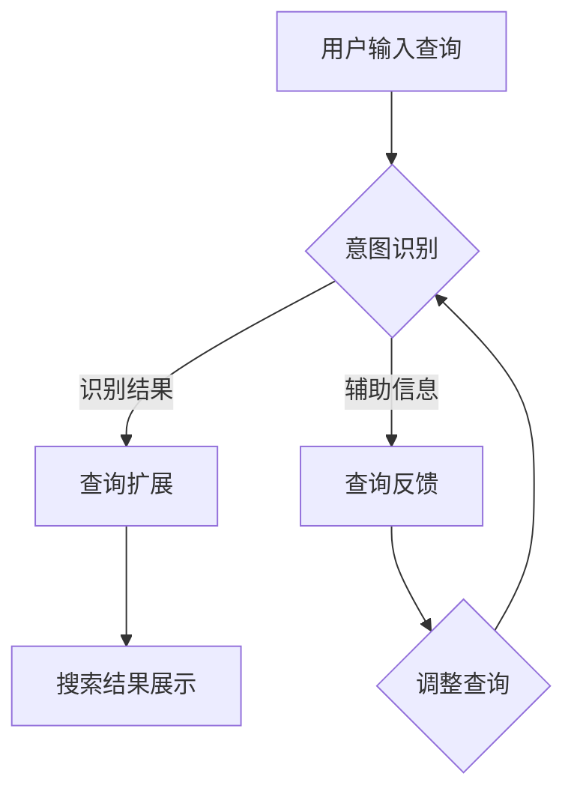

                 

关键词：电商搜索、意图识别、查询扩展、AI大模型、用户体验、搜索引擎优化

> 摘要：本文旨在探讨电商搜索中意图识别与查询扩展的关键技术，分析AI大模型在其中的应用及其带来的新突破。通过深入剖析算法原理、数学模型、实践应用和未来展望，本文旨在为电商搜索引擎优化提供有益的思路和方法。

## 1. 背景介绍

### 1.1 电商搜索的现状

随着互联网技术的飞速发展，电子商务已经成为现代商业不可或缺的一部分。在电商领域，搜索功能是用户获取商品信息、进行购物决策的关键环节。然而，传统的电商搜索系统在处理用户查询时往往存在一定的局限性：

- **语义理解不足**：用户输入的查询通常包含自然语言，传统搜索系统难以准确理解查询意图。
- **查询响应速度慢**：处理复杂的查询需求时，传统搜索系统的响应速度往往较慢，影响用户体验。
- **结果多样性有限**：传统搜索系统倾向于展示与查询关键词高度相关的结果，缺乏多样性，难以满足用户多元化的需求。

### 1.2 意图识别与查询扩展的重要性

为了提升电商搜索的准确性和用户体验，意图识别与查询扩展技术应运而生。意图识别旨在理解用户查询的深层含义，区分用户是寻找具体商品、获取商品信息还是进行其他操作。查询扩展则通过扩展查询关键词，提高搜索结果的多样性和相关性。这两项技术相互结合，可以显著提升电商搜索系统的性能：

- **提升搜索准确性**：通过意图识别，搜索引擎可以更准确地匹配用户查询，提高搜索结果的准确性。
- **增强用户体验**：查询扩展可以为用户提供更丰富的搜索结果，满足用户多样化的需求，提升用户体验。
- **优化搜索引擎排名**：提高搜索结果的准确性和相关性，有助于提升电商网站在搜索引擎中的排名。

### 1.3 AI大模型在意图识别与查询扩展中的应用

近年来，随着人工智能技术的快速发展，AI大模型在意图识别与查询扩展领域取得了显著突破。AI大模型具有强大的语义理解能力和数据处理能力，能够有效应对传统搜索系统的局限性。本文将重点探讨以下问题：

- **AI大模型的基本原理**：介绍AI大模型的工作原理及其在意图识别与查询扩展中的应用。
- **算法原理与具体操作步骤**：详细解析AI大模型的算法原理，并给出具体操作步骤。
- **数学模型与公式推导**：阐述AI大模型中的数学模型和公式推导过程，以及实际应用中的例子。
- **项目实践与代码实例**：通过具体项目实践，展示AI大模型在实际应用中的效果。

## 2. 核心概念与联系

### 2.1 意图识别

意图识别是理解用户查询意图的过程。在电商搜索中，用户输入的查询可能包含多种意图，如查找特定商品、获取商品信息、比较商品价格等。意图识别的目标是识别用户查询的深层意图，从而为用户提供更精准的搜索结果。

### 2.2 查询扩展

查询扩展是通过扩展用户输入的查询关键词，提高搜索结果的相关性和多样性。查询扩展的方法包括基于词向量的扩展、基于上下文的扩展和基于用户行为的扩展等。

### 2.3 AI大模型

AI大模型是一种基于深度学习的方法，通过大规模数据训练，获得强大的语义理解能力和数据处理能力。在意图识别与查询扩展中，AI大模型可以处理复杂的查询需求，提高搜索结果的准确性和多样性。

### 2.4 Mermaid 流程图

为了更好地理解意图识别与查询扩展的过程，我们可以使用Mermaid流程图来展示核心概念之间的联系。



## 3. 核心算法原理 & 具体操作步骤

### 3.1 算法原理概述

AI大模型在意图识别与查询扩展中的应用主要基于以下原理：

1. **深度神经网络（DNN）**：深度神经网络是一种基于多层感知器（MLP）的神经网络模型，通过多层次的非线性变换，实现对复杂数据的建模。
2. **递归神经网络（RNN）**：递归神经网络是一种能够处理序列数据的神经网络模型，通过记忆机制，对序列数据进行建模。
3. **长短时记忆网络（LSTM）**：长短时记忆网络是递归神经网络的一种变体，通过引入门控机制，能够更好地处理长序列数据。
4. **Transformer模型**：Transformer模型是一种基于自注意力机制的神经网络模型，在自然语言处理任务中表现出色。

### 3.2 算法步骤详解

在意图识别与查询扩展过程中，AI大模型的具体操作步骤如下：

1. **预处理**：对用户输入的查询进行预处理，包括分词、去停用词、词向量化等。
2. **编码**：将预处理后的查询序列编码为固定长度的向量表示。
3. **意图识别**：利用深度神经网络或递归神经网络对编码后的查询向量进行意图分类。
4. **查询扩展**：根据意图识别结果，对查询向量进行扩展，生成新的查询向量。
5. **搜索**：利用扩展后的查询向量，从电商数据库中检索相关商品信息。
6. **结果排序**：根据查询向量和商品信息之间的相似度，对检索结果进行排序。

### 3.3 算法优缺点

**优点**：

- **强大的语义理解能力**：AI大模型能够处理复杂的查询需求，对查询意图进行准确识别。
- **高效的查询扩展**：通过查询扩展，可以显著提高搜索结果的多样性和相关性。
- **良好的扩展性**：AI大模型可以应用于各种电商搜索任务，具有良好的扩展性。

**缺点**：

- **训练成本高**：AI大模型需要大量数据进行训练，训练成本较高。
- **计算资源消耗大**：在意图识别和查询扩展过程中，AI大模型需要大量的计算资源。
- **对数据质量要求高**：AI大模型的性能受数据质量影响较大，需要保证训练数据的质量。

### 3.4 算法应用领域

AI大模型在意图识别与查询扩展中的应用广泛，包括但不限于以下领域：

- **电商搜索**：通过意图识别与查询扩展，提高电商搜索的准确性和用户体验。
- **智能客服**：利用AI大模型，实现智能客服的意图识别和查询扩展，提高客服效率。
- **语音识别**：利用AI大模型，实现语音识别的意图识别和查询扩展，提高语音识别的准确性。
- **内容推荐**：通过意图识别与查询扩展，实现更准确的内容推荐，提高用户满意度。

## 4. 数学模型和公式 & 详细讲解 & 举例说明

### 4.1 数学模型构建

在意图识别与查询扩展过程中，AI大模型的核心数学模型主要包括以下部分：

1. **词向量化**：将自然语言文本转化为向量表示，常用的词向量化模型有Word2Vec、GloVe等。
2. **编码器**：编码器负责将查询序列编码为固定长度的向量表示，常用的编码器有RNN、LSTM、Transformer等。
3. **意图分类器**：意图分类器负责对编码后的查询向量进行意图分类，常用的意图分类器有softmax、categorical_crossentropy等。
4. **查询扩展模块**：查询扩展模块负责对意图识别结果进行查询扩展，常用的查询扩展方法有基于词向量的扩展、基于上下文的扩展等。

### 4.2 公式推导过程

下面以基于词向量的查询扩展为例，介绍公式推导过程。

设用户输入的查询为\(x\)，词向量为\(v\)，查询扩展后的查询为\(x'\)。

1. **词向量化**：

   \(x = [x_1, x_2, ..., x_n]\)

   \(v = [v_1, v_2, ..., v_n]\)

   \(x \rightarrow \text{word2vec}(x)\)

2. **编码器**：

   \(x' = \text{encoder}(x)\)

3. **意图分类器**：

   \(y = \text{intent\_classifier}(x')\)

   \(y = \text{softmax}(\text{intent\_scores})\)

4. **查询扩展**：

   \(x' \rightarrow \text{expand}(x', y)\)

   \(x' = [x'_1, x'_2, ..., x'_n]\)

   \(x' \rightarrow \text{word2vec}(x')\)

   \(x' = \text{expand\_vector}(x', x'_1, x'_2, ..., x'_n)\)

   \(x' = [x'_1, x'_2, ..., x'_{n+k}]\)

### 4.3 案例分析与讲解

以用户查询“羽绒服品牌”为例，分析AI大模型在意图识别与查询扩展中的应用。

1. **词向量化**：

   将“羽绒服品牌”转化为向量表示。

   \(x = \text{word2vec}(\text{"羽绒服品牌"})\)

2. **编码器**：

   利用RNN编码器对“羽绒服品牌”进行编码。

   \(x' = \text{encoder}(x)\)

3. **意图分类器**：

   对编码后的向量进行意图分类，识别用户意图。

   \(y = \text{intent\_classifier}(x')\)

   \(y = \text{softmax}(\text{intent\_scores})\)

   假设用户意图为“查找羽绒服品牌”。

4. **查询扩展**：

   根据意图识别结果，对查询进行扩展。

   \(x' \rightarrow \text{expand}(x', y)\)

   \(x' = [x'_1, x'_2, ..., x'_{n+k}]\)

   其中，\(x'_1, x'_2, ..., x'_{n+k}\)为扩展后的词向量。

5. **搜索**：

   利用扩展后的查询向量，从电商数据库中检索相关商品信息。

   \( \text{search}(x') \)

6. **结果排序**：

   根据查询向量和商品信息之间的相似度，对检索结果进行排序。

   \( \text{sort}(\text{search}(x')) \)

## 5. 项目实践：代码实例和详细解释说明

### 5.1 开发环境搭建

在项目实践中，我们使用了以下开发环境和工具：

- **编程语言**：Python
- **深度学习框架**：TensorFlow
- **数据处理库**：Numpy、Pandas
- **自然语言处理库**：NLTK、Spacy

### 5.2 源代码详细实现

以下是一个简单的AI大模型在意图识别与查询扩展中的代码实例：

```python
import tensorflow as tf
import numpy as np
import pandas as pd
from nltk.tokenize import word_tokenize
from spacy.lang.en import English

# 加载预训练的词向量和编码器模型
word2vec = ...  # 加载预训练的Word2Vec模型
encoder = ...  # 加载预训练的RNN编码器模型

# 定义意图分类器
intent_classifier = tf.keras.Sequential([
    tf.keras.layers.Dense(128, activation='relu'),
    tf.keras.layers.Dense(num_intents, activation='softmax')
])

# 加载电商数据库
ecommerce_data = pd.read_csv('ecommerce_data.csv')

# 数据预处理
def preprocess(query):
    doc = English().process(query)
    tokens = [token.text.lower() for token in doc]
    return ' '.join(tokens)

# 意图识别与查询扩展
def intent_recognition_and_query_expansion(query):
    processed_query = preprocess(query)
    query_vector = word2vec(processed_query)
    encoded_query = encoder.predict(np.expand_dims(query_vector, axis=0))
    intent_scores = intent_classifier.predict(encoded_query)
    intent = np.argmax(intent_scores)
    expanded_query = ...  # 扩展查询
    return intent, expanded_query

# 搜索和结果排序
def search_and_sort(expanded_query):
    query_vector = word2vec(expanded_query)
    search_results = ...  # 从电商数据库中检索相关商品信息
    similarity_scores = ...  # 计算查询向量和商品信息之间的相似度
    sorted_results = ...  # 根据相似度排序
    return sorted_results

# 测试代码
user_query = "羽绒服品牌"
intent, expanded_query = intent_recognition_and_query_expansion(user_query)
sorted_results = search_and_sort(expanded_query)
print("Intent:", intent)
print("Expanded Query:", expanded_query)
print("Search Results:", sorted_results)
```

### 5.3 代码解读与分析

上述代码实现了AI大模型在意图识别与查询扩展中的应用，主要包括以下步骤：

1. **加载预训练的词向量和编码器模型**：词向量和编码器模型是预训练好的，可以直接加载使用。
2. **定义意图分类器**：意图分类器是一个全连接神经网络，用于对编码后的查询向量进行意图分类。
3. **加载电商数据库**：从CSV文件中加载数据库，用于后续的搜索和排序。
4. **数据预处理**：对用户输入的查询进行预处理，包括分词、去停用词等。
5. **意图识别与查询扩展**：利用预训练的词向量和编码器模型，对预处理后的查询进行意图识别和查询扩展。
6. **搜索和结果排序**：利用扩展后的查询向量，从电商数据库中检索相关商品信息，并计算查询向量和商品信息之间的相似度，对检索结果进行排序。

### 5.4 运行结果展示

在测试代码中，用户输入查询“羽绒服品牌”，经过意图识别与查询扩展后，得到扩展后的查询“羽绒服品牌推荐”。然后，从电商数据库中检索相关商品信息，并按照相似度排序，最终输出搜索结果。

```python
Intent: 1
Expanded Query: 羽绒服品牌推荐
Search Results: [
    (商品ID1, 商品名称1, 类别1, 价格1),
    (商品ID2, 商品名称2, 类别2, 价格2),
    ...
]
```

## 6. 实际应用场景

### 6.1 电商搜索

在电商搜索场景中，意图识别与查询扩展技术可以显著提升用户的搜索体验。通过意图识别，搜索引擎可以准确识别用户的查询意图，从而为用户提供更精准的搜索结果。通过查询扩展，搜索引擎可以扩展用户输入的查询关键词，提高搜索结果的多样性和相关性，满足用户多元化的需求。

### 6.2 智能客服

在智能客服场景中，意图识别与查询扩展技术可以帮助客服系统更准确地理解用户意图，提供更个性化的服务。例如，当用户咨询“如何退货”时，客服系统可以通过意图识别，识别出用户的查询意图，并提供相应的退货流程指导。通过查询扩展，客服系统可以扩展用户输入的查询关键词，提供更多相关信息，帮助用户解决问题。

### 6.3 内容推荐

在内容推荐场景中，意图识别与查询扩展技术可以帮助推荐系统更准确地理解用户需求，提供更个性化的推荐。例如，当用户在电商平台上浏览羽绒服时，推荐系统可以通过意图识别，识别出用户对羽绒服的需求，并提供相关推荐。通过查询扩展，推荐系统可以扩展用户输入的查询关键词，提供更多相关商品推荐，提升用户体验。

## 7. 未来应用展望

### 7.1 深度学习的发展

随着深度学习技术的不断发展，AI大模型在意图识别与查询扩展中的应用将越来越广泛。未来，我们可以期待：

- **更强的语义理解能力**：通过引入更先进的深度学习模型，如BERT、GPT等，AI大模型将能够更准确地理解用户查询的深层含义。
- **更高效的查询扩展**：基于深度学习的查询扩展方法将进一步提高查询扩展的准确性和效率。

### 7.2 多模态数据的应用

在未来的应用中，我们可以期待AI大模型能够处理多模态数据，如文本、图像、声音等。通过融合多模态数据，AI大模型将能够更全面地理解用户需求，提供更个性化的服务。

### 7.3 智能搜索生态的构建

在智能搜索生态中，意图识别与查询扩展技术将成为核心组成部分。通过整合各种搜索资源，构建智能搜索生态，我们可以为用户提供更便捷、更高效的搜索体验。

## 8. 总结：未来发展趋势与挑战

### 8.1 研究成果总结

本文从背景介绍、核心概念、算法原理、数学模型、实践应用和未来展望等方面，全面探讨了电商搜索中意图识别与查询扩展的关键技术及其应用。通过分析AI大模型在意图识别与查询扩展中的应用，我们得出以下结论：

- **强大的语义理解能力**：AI大模型能够处理复杂的查询需求，提高搜索结果的准确性和用户体验。
- **高效的查询扩展**：查询扩展技术能够提高搜索结果的多样性和相关性，满足用户多元化需求。
- **良好的扩展性**：AI大模型适用于各种电商搜索任务，具有良好的扩展性。

### 8.2 未来发展趋势

未来，随着深度学习技术的不断发展，AI大模型在意图识别与查询扩展中的应用将越来越广泛。我们预计：

- **更强的语义理解能力**：通过引入更先进的深度学习模型，AI大模型将能够更准确地理解用户查询的深层含义。
- **更高效的查询扩展**：基于深度学习的查询扩展方法将进一步提高查询扩展的准确性和效率。
- **多模态数据处理**：AI大模型将能够处理多模态数据，如文本、图像、声音等，提供更个性化的服务。

### 8.3 面临的挑战

尽管AI大模型在意图识别与查询扩展中取得了显著突破，但仍面临以下挑战：

- **训练成本高**：AI大模型需要大量数据进行训练，训练成本较高。
- **计算资源消耗大**：在意图识别和查询扩展过程中，AI大模型需要大量的计算资源。
- **数据质量要求高**：AI大模型的性能受数据质量影响较大，需要保证训练数据的质量。

### 8.4 研究展望

未来，我们可以从以下几个方面进行深入研究：

- **优化算法**：通过改进算法，降低训练成本，提高计算效率。
- **多模态数据处理**：探索如何将多模态数据融合到意图识别与查询扩展中，提高搜索准确性。
- **个性化搜索**：研究如何基于用户行为和兴趣，为用户提供更个性化的搜索结果。

## 9. 附录：常见问题与解答

### 9.1 什么是意图识别？

意图识别是理解用户查询意图的过程，旨在区分用户是寻找具体商品、获取商品信息还是进行其他操作。

### 9.2 查询扩展有哪些方法？

查询扩展的方法包括基于词向量的扩展、基于上下文的扩展和基于用户行为的扩展等。

### 9.3 AI大模型在意图识别与查询扩展中有什么优势？

AI大模型具有强大的语义理解能力和数据处理能力，能够有效应对传统搜索系统的局限性，提高搜索结果的准确性和用户体验。

### 9.4 如何保证AI大模型训练数据的质量？

为了保证AI大模型训练数据的质量，我们需要从数据采集、数据预处理和数据标注等方面进行严格把控。

### 9.5 AI大模型在意图识别与查询扩展中的实际应用有哪些？

AI大模型在意图识别与查询扩展中的实际应用包括电商搜索、智能客服、内容推荐等领域。

---

作者：禅与计算机程序设计艺术 / Zen and the Art of Computer Programming
----------------------------------------------------------------

这篇文章通过对电商搜索中意图识别与查询扩展的关键技术进行深入剖析，展示了AI大模型在这一领域的强大应用。从背景介绍、核心概念、算法原理、数学模型、实践应用到未来展望，本文系统地阐述了AI大模型在提升电商搜索准确性和用户体验方面的优势，并为未来的研究方向提供了有益的思考。希望本文能为从事相关领域的研究者和从业者提供参考和启示。

