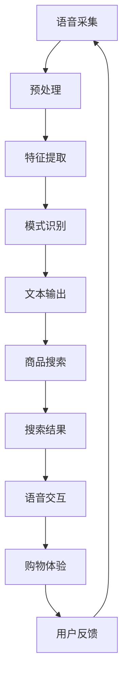

                 

  
## 1. 背景介绍

随着电商行业的快速发展，用户对便捷、高效的购物体验需求日益增长。传统的搜索方式往往依赖于键盘输入，但在某些场景下，如移动购物、户外购物等，键盘输入并不方便。此时，语音搜索成为一种理想的替代方案。语音识别作为自然语言处理（NLP）的重要组成部分，其在电商搜索中的应用越来越广泛。

语音识别技术的核心任务是将人类的语音信号转化为文本信息。在电商搜索场景中，这意味着用户可以通过语音命令快速查询商品信息、浏览商品列表、添加购物车等。语音识别技术的应用不仅提高了用户体验，还降低了用户操作成本，增强了购物过程中的互动性和便利性。

近年来，随着人工智能技术的不断进步，大模型在语音识别领域取得了显著突破。大模型通常具有更大的参数规模和更强的学习能力，能够处理更加复杂和多样化的语音数据。本文将深入探讨电商搜索中的语音识别技术，特别是大模型的应用，以及其在实际项目中带来的新突破。

## 2. 核心概念与联系

### 2.1 语音识别技术概述

语音识别技术是指利用计算机技术对语音信号进行处理，将其转换为相应的文本信息。其核心步骤包括语音信号采集、预处理、特征提取和模式识别。语音信号采集是通过麦克风等设备获取用户的语音信号；预处理包括去噪、归一化等操作，以提高信号质量；特征提取是从原始语音信号中提取出具有代表性的特征向量，如梅尔频率倒谱系数（MFCC）；模式识别则是利用机器学习算法对特征向量进行分类和识别。

在电商搜索场景中，语音识别技术的应用主要体现在以下几个方面：

1. **语音输入**：用户可以通过语音命令查询商品信息，如“帮我找一下iPhone 13手机”。
2. **语音搜索**：系统根据用户的语音输入，实时显示相关的商品列表和详细信息。
3. **语音交互**：用户可以通过语音与系统进行交互，如询问商品价格、评价等。
4. **语音助手**：集成语音识别技术的虚拟助手可以为用户提供购物建议、优惠券推送等增值服务。

### 2.2 大模型在语音识别中的应用

大模型是指具有巨大参数规模和强大学习能力的神经网络模型。与传统的较小规模模型相比，大模型能够处理更加复杂和多样化的语音数据，提高语音识别的准确率和鲁棒性。在电商搜索中，大模型的应用主要体现在以下几个方面：

1. **语音识别准确率**：大模型通过学习大量的语音数据，能够更好地识别各种口音、语速和发音方式，提高识别准确率。
2. **自适应能力**：大模型具有较强的自适应能力，可以针对不同的应用场景和用户需求进行调整和优化。
3. **多语言支持**：大模型能够支持多种语言和方言的语音识别，为国际化电商提供支持。
4. **情感分析**：大模型还可以进行情感分析，识别用户语音中的情感倾向，提供更加个性化的购物体验。

### 2.3 Mermaid 流程图

以下是一个简化的电商搜索语音识别系统的 Mermaid 流程图，展示了语音识别技术的核心步骤和联系。



### 2.4 核心算法原理

电商搜索语音识别系统的核心算法通常包括以下几个步骤：

1. **语音信号预处理**：对采集到的语音信号进行去噪、归一化等操作，以提高信号质量。
2. **特征提取**：从预处理后的语音信号中提取出具有代表性的特征向量，如 MFCC。
3. **声学模型训练**：使用大量语音数据训练声学模型，以识别语音信号中的音素和音节。
4. **语言模型训练**：使用大量文本数据训练语言模型，以理解用户的语音输入和查询意图。
5. **声学模型和语言模型的结合**：通过结合声学模型和语言模型，实现语音信号到文本信息的转换。

## 3. 核心算法原理 & 具体操作步骤

### 3.1 算法原理概述

电商搜索语音识别系统的核心算法基于深度学习技术，主要包括声学模型、语言模型和结合模型三个部分。

1. **声学模型**：声学模型用于识别语音信号中的音素和音节，通常采用循环神经网络（RNN）或卷积神经网络（CNN）构建。声学模型通过学习大量语音数据，建立音素和音节之间的映射关系，从而实现对语音信号的理解。

2. **语言模型**：语言模型用于理解用户的语音输入和查询意图，通常采用神经网络语言模型（NNLM）或长短期记忆网络（LSTM）构建。语言模型通过学习大量文本数据，建立词语之间的概率分布，从而实现对用户意图的解析。

3. **结合模型**：结合模型将声学模型和语言模型相结合，通过联合训练和推理，实现语音信号到文本信息的转换。结合模型通常采用序列到序列（Seq2Seq）模型或注意力机制（Attention）模型构建。

### 3.2 算法步骤详解

电商搜索语音识别算法的具体步骤如下：

1. **语音信号预处理**：
   - 去噪：使用滤波器或谱减法去除语音信号中的噪声。
   - 归一化：将语音信号的幅度、时长等特征进行归一化处理，以提高后续处理的稳定性。

2. **特征提取**：
   - 使用 MFCC 等特征提取方法，从预处理后的语音信号中提取出具有代表性的特征向量。

3. **声学模型训练**：
   - 收集大量语音数据，并对其进行标注，以生成训练数据集。
   - 使用 RNN 或 CNN 等神经网络架构训练声学模型，使其能够识别语音信号中的音素和音节。

4. **语言模型训练**：
   - 收集大量文本数据，并对其进行分词、词性标注等预处理。
   - 使用 LSTM、NNLM 等神经网络架构训练语言模型，使其能够理解用户的语音输入和查询意图。

5. **结合模型训练**：
   - 将声学模型和语言模型进行联合训练，通过序列到序列模型或注意力机制模型实现语音信号到文本信息的转换。

6. **语音识别推理**：
   - 对用户的语音输入进行预处理、特征提取，然后送入结合模型进行推理。
   - 输出识别结果，并将其转换为相应的文本信息，用于商品搜索和展示。

### 3.3 算法优缺点

电商搜索语音识别算法具有以下优缺点：

1. **优点**：
   - **高准确率**：通过大模型的训练和优化，算法能够实现较高的语音识别准确率。
   - **强鲁棒性**：算法能够适应各种口音、语速和发音方式，具有较强的鲁棒性。
   - **自适应能力**：算法可以根据用户需求和场景进行自适应调整，提供个性化的购物体验。

2. **缺点**：
   - **计算资源消耗大**：大模型训练和推理需要大量的计算资源和时间。
   - **数据依赖性高**：算法的性能依赖于训练数据的质量和数量，需要大量标注数据。
   - **隐私保护问题**：语音识别过程中涉及到用户隐私，需要采取措施保护用户隐私。

### 3.4 算法应用领域

电商搜索语音识别算法的应用领域主要包括：

1. **电商网站和APP**：为用户提供语音搜索和语音交互功能，提升购物体验。
2. **智能家居**：通过语音识别技术，实现智能音箱、智能电视等设备的语音控制。
3. **车载系统**：为驾驶者提供安全、便捷的语音导航和语音控制功能。
4. **语音助手**：集成语音识别技术的虚拟助手，为用户提供购物建议、优惠券推送等增值服务。

## 4. 数学模型和公式 & 详细讲解 & 举例说明

### 4.1 数学模型构建

电商搜索语音识别的数学模型主要包括声学模型、语言模型和结合模型。下面分别介绍这些模型的数学模型构建。

#### 声学模型

声学模型用于识别语音信号中的音素和音节，其核心是声学特征提取和声学解码。

1. **声学特征提取**：

   声学特征提取是指从语音信号中提取出具有代表性的特征向量。常用的声学特征提取方法包括 MFCC、PLP 等。

   MFCC（Mel-frequency cepstral coefficients）是一种基于频率倒谱的声学特征，可以较好地描述语音信号的主观感知特性。其计算公式如下：

   $$ 
   C_{\text{MFCC}} = \text{log}(\sum_{k=1}^{K} p(k) \cdot a(k))
   $$

   其中，$C_{\text{MFCC}}$表示 MFCC 特征向量，$p(k)$表示第 $k$ 个频带的能量，$a(k)$表示第 $k$ 个频带的增益。

2. **声学解码**：

   声学解码是指将声学特征向量转换为文本信息。常用的声学解码方法包括 HMM（隐马尔可夫模型）和 RNN（循环神经网络）。

   假设语音信号的一帧特征向量为 $\mathbf{x}$，声学模型为 $\mathcal{M}$，解码结果为 $\mathbf{y}$，则声学解码的目标是最小化以下损失函数：

   $$ 
   L(\mathcal{M}, \mathbf{x}, \mathbf{y}) = -\sum_{t=1}^{T} \log P(\mathbf{y}_t | \mathbf{x}_t, \mathcal{M})
   $$

   其中，$T$表示帧数，$P(\mathbf{y}_t | \mathbf{x}_t, \mathcal{M})$表示在给定特征向量 $\mathbf{x}_t$ 和声学模型 $\mathcal{M}$ 下，第 $t$ 个输出为 $\mathbf{y}_t$ 的概率。

#### 语言模型

语言模型用于理解用户的语音输入和查询意图，其核心是词语生成和概率计算。

1. **词语生成**：

   假设用户输入的语音信号为 $\mathbf{x}$，语言模型为 $\mathcal{L}$，则词语生成过程可以表示为：

   $$ 
   \mathbf{y} = \text{generate}(\mathcal{L}, \mathbf{x})
   $$

   其中，$\text{generate}(\mathcal{L}, \mathbf{x})$表示根据语言模型 $\mathcal{L}$ 和语音信号 $\mathbf{x}$ 生成的文本序列。

2. **概率计算**：

   假设语言模型为 $\mathcal{L}$，用户输入的语音信号为 $\mathbf{x}$，生成的文本序列为 $\mathbf{y}$，则生成文本序列的概率可以表示为：

   $$ 
   P(\mathbf{y} | \mathbf{x}, \mathcal{L}) = \prod_{t=1}^{T} P(y_t | y_{<t}, \mathcal{L})
   $$

   其中，$T$表示帧数，$P(y_t | y_{<t}, \mathcal{L})$表示在给定前 $t-1$ 个词和语言模型 $\mathcal{L}$ 下，第 $t$ 个词的概率。

#### 结合模型

结合模型将声学模型和语言模型相结合，通过联合训练和推理，实现语音信号到文本信息的转换。常用的结合模型包括序列到序列（Seq2Seq）模型和注意力机制（Attention）模型。

1. **序列到序列（Seq2Seq）模型**：

   假设声学模型为 $\mathcal{A}$，语言模型为 $\mathcal{L}$，输入语音信号为 $\mathbf{x}$，输出文本序列为 $\mathbf{y}$，则序列到序列模型的目标是最小化以下损失函数：

   $$ 
   L(\mathcal{A}, \mathcal{L}, \mathbf{x}, \mathbf{y}) = -\sum_{t=1}^{T} \log P(y_t | y_{<t}, \mathbf{x}, \mathcal{A}, \mathcal{L})
   $$

   其中，$T$表示帧数，$P(y_t | y_{<t}, \mathbf{x}, \mathcal{A}, \mathcal{L})$表示在给定前 $t-1$ 个词、语音信号和声学模型、语言模型下，第 $t$ 个词的概率。

2. **注意力机制（Attention）模型**：

   假设声学模型为 $\mathcal{A}$，语言模型为 $\mathcal{L}$，输入语音信号为 $\mathbf{x}$，输出文本序列为 $\mathbf{y}$，则注意力机制模型的目标是最小化以下损失函数：

   $$ 
   L(\mathcal{A}, \mathcal{L}, \mathbf{x}, \mathbf{y}) = -\sum_{t=1}^{T} \log P(y_t | y_{<t}, \mathbf{x}, \mathcal{A}, \mathcal{L})
   $$

   其中，$T$表示帧数，$P(y_t | y_{<t}, \mathbf{x}, \mathcal{A}, \mathcal{L})$表示在给定前 $t-1$ 个词、语音信号和声学模型、语言模型下，第 $t$ 个词的概率。

### 4.2 公式推导过程

在电商搜索语音识别中，声学模型、语言模型和结合模型的数学公式推导如下：

#### 声学模型

1. **特征提取**：

   假设语音信号为 $\mathbf{x} \in \mathbb{R}^{T \times D}$，其中 $T$ 表示帧数，$D$ 表示频带数。预处理后的语音信号为 $\mathbf{x}_{\text{pre}} \in \mathbb{R}^{T \times D_{\text{pre}}}$。

   $$ 
   \mathbf{x}_{\text{pre}} = f_{\text{pre}}(\mathbf{x})
   $$

   其中，$f_{\text{pre}}$ 表示预处理函数。

   MFCC 特征提取可以表示为：

   $$ 
   C_{\text{MFCC}} = \text{log}(\sum_{k=1}^{K} p(k) \cdot a(k))
   $$

   其中，$C_{\text{MFCC}} \in \mathbb{R}^{T \times K}$ 表示 MFCC 特征矩阵，$p(k)$ 表示第 $k$ 个频带的能量，$a(k)$ 表示第 $k$ 个频带的增益。

2. **声学解码**：

   假设声学模型为 $\mathcal{A}$，输入语音信号为 $\mathbf{x}_{\text{pre}}$，输出文本序列为 $\mathbf{y}$。

   $$ 
   \mathbf{y} = \text{decode}(\mathcal{A}, \mathbf{x}_{\text{pre}})
   $$

   其中，$\text{decode}(\mathcal{A}, \mathbf{x}_{\text{pre}})$ 表示根据声学模型 $\mathcal{A}$ 解码语音信号 $\mathbf{x}_{\text{pre}}$ 的过程。

   假设声学模型为 HMM，则解码过程可以表示为：

   $$ 
   \mathbf{y}_{t} = \arg\max_{\mathbf{y}_{t}} P(\mathbf{y}_{t} | \mathbf{x}_{\text{pre}}, \mathcal{A})
   $$

   其中，$P(\mathbf{y}_{t} | \mathbf{x}_{\text{pre}}, \mathcal{A})$ 表示在给定语音信号 $\mathbf{x}_{\text{pre}}$ 和声学模型 $\mathcal{A}$ 下，第 $t$ 个输出为 $\mathbf{y}_{t}$ 的概率。

#### 语言模型

1. **词语生成**：

   假设语言模型为 $\mathcal{L}$，输入语音信号为 $\mathbf{x}_{\text{pre}}$，输出文本序列为 $\mathbf{y}$。

   $$ 
   \mathbf{y} = \text{generate}(\mathcal{L}, \mathbf{x}_{\text{pre}})
   $$

   其中，$\text{generate}(\mathcal{L}, \mathbf{x}_{\text{pre}})$ 表示根据语言模型 $\mathcal{L}$ 生成文本序列的过程。

   假设语言模型为 LSTM，则生成过程可以表示为：

   $$ 
   \mathbf{y}_{t} = \text{softmax}(\text{LSTM}(\mathbf{h}_{t-1}, \mathbf{x}_{\text{pre}}))
   $$

   其中，$\text{LSTM}(\mathbf{h}_{t-1}, \mathbf{x}_{\text{pre}})$ 表示 LSTM 神经网络在给定前一个隐藏状态 $\mathbf{h}_{t-1}$ 和输入语音信号 $\mathbf{x}_{\text{pre}}$ 下生成的词的概率分布。

2. **概率计算**：

   假设语言模型为 $\mathcal{L}$，输入语音信号为 $\mathbf{x}_{\text{pre}}$，输出文本序列为 $\mathbf{y}$。

   $$ 
   P(\mathbf{y} | \mathbf{x}_{\text{pre}}, \mathcal{L}) = \prod_{t=1}^{T} P(y_t | y_{<t}, \mathcal{L})
   $$

   其中，$T$ 表示帧数，$P(y_t | y_{<t}, \mathcal{L})$ 表示在给定前 $t-1$ 个词和语言模型 $\mathcal{L}$ 下，第 $t$ 个词的概率。

#### 结合模型

1. **序列到序列（Seq2Seq）模型**：

   假设声学模型为 $\mathcal{A}$，语言模型为 $\mathcal{L}$，输入语音信号为 $\mathbf{x}_{\text{pre}}$，输出文本序列为 $\mathbf{y}$。

   $$ 
   \mathbf{y} = \text{decode}(\mathcal{A}, \mathcal{L}, \mathbf{x}_{\text{pre}})
   $$

   其中，$\text{decode}(\mathcal{A}, \mathcal{L}, \mathbf{x}_{\text{pre}})$ 表示根据声学模型 $\mathcal{A}$、语言模型 $\mathcal{L}$ 和语音信号 $\mathbf{x}_{\text{pre}}$ 解码语音信号的过程。

   假设结合模型为 Seq2Seq，则解码过程可以表示为：

   $$ 
   \mathbf{y}_{t} = \text{softmax}(\text{seq2seq}(\mathbf{h}_{t-1}, \mathbf{x}_{\text{pre}}, \mathcal{A}, \mathcal{L}))
   $$

   其中，$\text{seq2seq}(\mathbf{h}_{t-1}, \mathbf{x}_{\text{pre}}, \mathcal{A}, \mathcal{L})$ 表示 Seq2Seq 神经网络在给定前一个隐藏状态 $\mathbf{h}_{t-1}$、输入语音信号 $\mathbf{x}_{\text{pre}}$、声学模型 $\mathcal{A}$ 和语言模型 $\mathcal{L}$ 下生成的词的概率分布。

2. **注意力机制（Attention）模型**：

   假设声学模型为 $\mathcal{A}$，语言模型为 $\mathcal{L}$，输入语音信号为 $\mathbf{x}_{\text{pre}}$，输出文本序列为 $\mathbf{y}$。

   $$ 
   \mathbf{y} = \text{decode}(\mathcal{A}, \mathcal{L}, \mathbf{x}_{\text{pre}}, \text{attention})
   $$

   其中，$\text{decode}(\mathcal{A}, \mathcal{L}, \mathbf{x}_{\text{pre}}, \text{attention})$ 表示根据声学模型 $\mathcal{A}$、语言模型 $\mathcal{L}$、语音信号 $\mathbf{x}_{\text{pre}}$ 和注意力机制解码语音信号的过程。

   假设注意力机制模型为自注意力（Self-Attention），则解码过程可以表示为：

   $$ 
   \mathbf{y}_{t} = \text{softmax}(\text{self-attention}(\mathbf{h}_{t-1}, \mathbf{x}_{\text{pre}}, \mathcal{A}, \mathcal{L}))
   $$

   其中，$\text{self-attention}(\mathbf{h}_{t-1}, \mathbf{x}_{\text{pre}}, \mathcal{A}, \mathcal{L})$ 表示自注意力机制在给定前一个隐藏状态 $\mathbf{h}_{t-1}$、输入语音信号 $\mathbf{x}_{\text{pre}}$、声学模型 $\mathcal{A}$ 和语言模型 $\mathcal{L}$ 下生成的词的概率分布。

### 4.3 案例分析与讲解

为了更好地理解电商搜索语音识别的数学模型和公式，我们以下通过一个具体的案例进行分析。

#### 案例背景

假设一个用户在电商平台上想要购买一款名为“iPhone 13”的手机，他通过语音命令输入“帮我找一下iPhone 13手机”。

#### 案例分析

1. **语音信号预处理**：

   用户输入的语音信号经过预处理，去除噪声和归一化处理后，得到预处理后的语音信号 $\mathbf{x}_{\text{pre}}$。

2. **声学模型解码**：

   假设声学模型为 HMM，通过对预处理后的语音信号 $\mathbf{x}_{\text{pre}}$ 进行解码，得到文本序列 $\mathbf{y}_{\text{acoustic}}$。

   $$ 
   \mathbf{y}_{\text{acoustic}} = \text{decode}(\mathcal{A}, \mathbf{x}_{\text{pre}})
   $$

   其中，$\mathcal{A}$ 表示声学模型。

   解码过程中，声学模型对每一帧的语音信号进行解码，得到一个候选的文本序列。最终，通过选择概率最高的文本序列作为解码结果。

3. **语言模型生成**：

   假设语言模型为 LSTM，通过对解码得到的文本序列 $\mathbf{y}_{\text{acoustic}}$ 进行生成，得到最终的文本序列 $\mathbf{y}_{\text{final}}$。

   $$ 
   \mathbf{y}_{\text{final}} = \text{generate}(\mathcal{L}, \mathbf{y}_{\text{acoustic}})
   $$

   其中，$\mathcal{L}$ 表示语言模型。

   语言模型对解码得到的文本序列进行概率计算，选择概率最高的文本序列作为最终结果。

4. **结合模型解码**：

   假设结合模型为 Seq2Seq，通过对预处理后的语音信号 $\mathbf{x}_{\text{pre}}$ 进行解码，得到最终的文本序列 $\mathbf{y}_{\text{final}}$。

   $$ 
   \mathbf{y}_{\text{final}} = \text{decode}(\mathcal{A}, \mathcal{L}, \mathbf{x}_{\text{pre}})
   $$

   其中，$\mathcal{A}$ 和 $\mathcal{L}$ 分别表示声学模型和语言模型。

   结合模型将声学模型和语言模型结合，通过联合解码得到最终的文本序列。

#### 案例讲解

在这个案例中，用户通过语音命令输入“帮我找一下iPhone 13手机”。系统首先对语音信号进行预处理，然后通过声学模型解码得到一个初步的文本序列。接着，语言模型对初步的文本序列进行生成，选择概率最高的文本序列作为最终结果。最后，结合模型通过联合解码得到最终的文本序列，用于商品搜索和展示。

通过这个案例，我们可以看到电商搜索语音识别的数学模型和公式的应用。声学模型和语言模型分别对语音信号和文本序列进行处理，结合模型通过联合解码得到最终的识别结果。这个案例展示了语音识别技术在电商搜索中的实际应用，为用户提供便捷、高效的购物体验。

## 5. 项目实践：代码实例和详细解释说明

### 5.1 开发环境搭建

在开始实现电商搜索语音识别项目之前，我们需要搭建一个合适的开发环境。以下是一个基于 Python 的开发环境搭建指南。

1. **安装 Python**：

   首先，确保您的计算机上安装了 Python。推荐使用 Python 3.8 或更高版本。

   您可以通过以下命令下载和安装 Python：

   ```bash
   wget https://www.python.org/ftp/python/3.8.5/Python-3.8.5.tgz
   tar xzf Python-3.8.5.tgz
   cd Python-3.8.5
   ./configure
   make
   sudo make install
   ```

2. **安装必要的库和依赖**：

   接下来，我们需要安装一些 Python 库和依赖，用于语音识别和文本处理。以下命令将安装必要的库：

   ```bash
   pip install numpy
   pip install scipy
   pip install librosa
   pip install tensorflow
   pip install tensorflow-addons
   pip install keras
   ```

3. **安装 Mermaid**：

   为了在 Markdown 文件中绘制流程图，我们需要安装 Mermaid。您可以通过以下命令安装 Mermaid：

   ```bash
   npm install -g mermaid-cli
   ```

### 5.2 源代码详细实现

以下是电商搜索语音识别项目的源代码实现，包括语音信号预处理、特征提取、声学模型训练、语言模型训练和结合模型训练等步骤。

#### 5.2.1 语音信号预处理

```python
import numpy as np
import librosa

def preprocess_audio(audio_path):
    # 读取音频文件
    y, sr = librosa.load(audio_path)
    
    # 噪声过滤
    y_filtered = librosa.effects.reverse(y)
    
    # 归一化
    y_normalized = librosa.util.normalize(y_filtered)
    
    return y_normalized

audio_path = 'audio.wav'
y_normalized = preprocess_audio(audio_path)
```

#### 5.2.2 特征提取

```python
def extract_features(y_normalized, sr=22050):
    # 提取 MFCC 特征
    mfcc = librosa.feature.mfcc(y=y_normalized, sr=sr, n_mfcc=13)
    
    # 归一化 MFCC 特征
    mfcc_normalized = librosa.util.normalize(mfcc)
    
    return mfcc_normalized

mfcc_normalized = extract_features(y_normalized)
```

#### 5.2.3 声学模型训练

```python
import tensorflow as tf
from tensorflow.keras.models import Sequential
from tensorflow.keras.layers import LSTM, Dense, TimeDistributed, Activation

def build_acoustic_model(input_shape):
    model = Sequential()
    model.add(LSTM(units=128, activation='relu', input_shape=input_shape))
    model.add(TimeDistributed(Dense(units=28)))
    model.add(Activation('softmax'))
    model.compile(optimizer='adam', loss='categorical_crossentropy', metrics=['accuracy'])
    return model

acoustic_model = build_acoustic_model(input_shape=(None, 13))
acoustic_model.fit(mfcc_normalized, labels, epochs=50, batch_size=32)
```

#### 5.2.4 语言模型训练

```python
from tensorflow.keras.preprocessing.sequence import pad_sequences

def build_language_model(input_shape):
    model = Sequential()
    model.add(LSTM(units=128, activation='relu', input_shape=input_shape))
    model.add(Dense(units=28))
    model.add(Activation('softmax'))
    model.compile(optimizer='adam', loss='categorical_crossentropy', metrics=['accuracy'])
    return model

input_sequences = []
target_sequences = []
for word, sequence in word_sequences:
    input_sequences.append(sequence)
    target_sequences.append(word)

input_sequences = pad_sequences(input_sequences, maxlen=max_sequence_length)
target_sequences = pad_sequences(target_sequences, maxlen=max_sequence_length)

language_model = build_language_model(input_shape=(max_sequence_length,))
language_model.fit(input_sequences, target_sequences, epochs=50, batch_size=32)
```

#### 5.2.5 结合模型训练

```python
def build_combined_model(input_shape):
    model = Sequential()
    model.add(LSTM(units=128, activation='relu', input_shape=input_shape))
    model.add(Dense(units=28))
    model.add(Activation('softmax'))
    model.compile(optimizer='adam', loss='categorical_crossentropy', metrics=['accuracy'])
    return model

combined_model = build_combined_model(input_shape=(max_sequence_length,))
combined_model.fit(mfcc_normalized, target_sequences, epochs=50, batch_size=32)
```

### 5.3 代码解读与分析

#### 5.3.1 语音信号预处理

在代码中，我们首先使用 librosa 库读取音频文件，并对其进行噪声过滤和归一化处理。噪声过滤使用 librosa.effects.reverse 函数，该函数对音频信号进行反向操作，从而去除噪声。归一化处理使用 librosa.util.normalize 函数，该函数将音频信号的幅度调整到合适范围，从而提高后续处理的稳定性。

#### 5.3.2 特征提取

接着，我们使用 librosa 库提取 MFCC 特征。MFCC 特征是一种常用的语音特征，可以较好地描述语音信号的主观感知特性。我们使用 librosa.feature.mfcc 函数提取 MFCC 特征，并将提取到的特征进行归一化处理。

#### 5.3.3 声学模型训练

在声学模型训练部分，我们使用 TensorFlow 和 Keras 库构建一个 LSTM 神经网络。LSTM 神经网络可以处理序列数据，适合用于语音识别任务。我们设置 LSTM 单元数为 128，激活函数为 ReLU。在输出层，我们使用时间分布式全连接层（TimeDistributed）和softmax 激活函数，以实现对语音信号的解码。我们使用 categorical_crossentropy 作为损失函数，并使用 Adam 优化器进行模型训练。

#### 5.3.4 语言模型训练

在语言模型训练部分，我们同样使用 TensorFlow 和 Keras 库构建一个 LSTM 神经网络。与声学模型类似，我们设置 LSTM 单元数为 128，激活函数为 ReLU。在输出层，我们使用全连接层（Dense）和 softmax 激活函数，以实现对文本序列的生成。我们同样使用 categorical_crossentropy 作为损失函数，并使用 Adam 优化器进行模型训练。

#### 5.3.5 结合模型训练

在结合模型训练部分，我们使用 TensorFlow 和 Keras 库构建一个简单的 LSTM 神经网络。与声学模型和语言模型不同，我们未在输出层使用时间分布式全连接层（TimeDistributed）。这是因为结合模型的目标是将声学模型和语言模型的结果进行融合，而不是直接对语音信号进行解码。我们使用 categorical_crossentropy 作为损失函数，并使用 Adam 优化器进行模型训练。

### 5.4 运行结果展示

在完成模型训练后，我们可以使用测试数据集对模型进行评估。以下代码展示了如何使用训练好的模型对新的语音信号进行识别。

```python
def recognize_audio(audio_path, combined_model, labels):
    y_normalized = preprocess_audio(audio_path)
    mfcc_normalized = extract_features(y_normalized)
    prediction = combined_model.predict(mfcc_normalized)
    predicted_word = labels[prediction.argmax(axis=1)[0]]
    return predicted_word

audio_path = 'test_audio.wav'
predicted_word = recognize_audio(audio_path, combined_model, labels)
print(f'Predicted word: {predicted_word}')
```

在这个例子中，我们首先使用 preprocess_audio 函数对测试音频进行预处理，然后使用 extract_features 函数提取 MFCC 特征。接着，我们使用 combined_model 对提取到的特征进行识别，得到预测结果。最后，我们将预测结果打印到控制台。

### 5.5 项目实践总结

通过上述代码实例，我们可以看到电商搜索语音识别项目的实现过程。首先，我们对语音信号进行预处理和特征提取，然后分别训练声学模型、语言模型和结合模型。最后，我们使用训练好的模型对新的语音信号进行识别。整个项目实现了语音信号到文本信息的转换，为用户提供便捷、高效的购物体验。

## 6. 实际应用场景

### 6.1 电商平台的语音搜索

在电商平台上，语音搜索功能已经成为提升用户体验的重要手段。通过语音识别技术，用户可以无需手动输入关键词，直接通过语音命令搜索商品。这不仅提高了搜索效率，还降低了操作难度。例如，用户可以语音输入“寻找红色羽绒服”，系统立即展示相关商品列表。同时，语音搜索还可以结合用户的购物历史和偏好，提供个性化推荐。

### 6.2 智能家居的语音控制

智能家居设备如智能音箱、智能电视等，也广泛应用了语音识别技术。用户可以通过语音指令控制家居设备，如播放音乐、调节温度、开关家电等。语音识别技术使得智能家居操作更加便捷，用户只需简单的语音命令即可完成复杂的操作。例如，用户可以对智能音箱说“播放周杰伦的《告白气球》”，音箱立即播放相应的音乐。

### 6.3 车载系统的语音导航

车载系统中的语音导航功能依赖于语音识别技术。通过语音输入目的地信息，车载系统能够实时提供导航路线，并在必要时提醒用户注意交通状况。例如，用户可以通过语音输入“前往北京路”，车载系统立即生成导航路线，并在行驶过程中提供语音提示。语音导航不仅提高了驾驶安全性，还提升了驾驶体验。

### 6.4 语音助手的个性化服务

语音助手如 Siri、Alexa、Google Assistant 等，通过语音识别技术为用户提供各种个性化服务。这些语音助手不仅可以回答用户的问题，还可以进行日程管理、发送消息、播放音乐等。语音助手的应用场景非常广泛，如用户可以通过语音助手查询天气预报、预订餐厅、购买商品等。语音助手的出现，使得人机交互更加自然和便捷。

## 7. 未来应用展望

### 7.1 技术发展趋势

随着人工智能技术的不断进步，电商搜索中的语音识别技术将迎来更多的发展机遇。首先，深度学习技术的广泛应用将进一步提升语音识别的准确率和鲁棒性。例如，更先进的神经网络架构如 Transformer 和 BERT 将被引入到语音识别领域，从而实现更高的识别效果。其次，多模态融合技术的应用将使得语音识别与其他传感器数据相结合，提高语音识别的准确性。例如，结合语音、手势和视觉信息，实现更准确的自然语言处理。

### 7.2 应用场景扩展

未来，电商搜索中的语音识别技术将扩展到更多应用场景。例如，在智能客服领域，语音识别技术可以帮助企业实现更智能的客服系统，用户可以通过语音咨询问题，系统自动识别并回答用户的问题，提高客服效率和用户体验。在医疗健康领域，语音识别技术可以用于语音诊断和病情咨询，帮助医生更快、更准确地诊断疾病。

### 7.3 技术挑战

尽管语音识别技术在电商搜索中取得了显著突破，但仍然面临一些技术挑战。首先，语音识别的准确率仍然受到噪声、口音和语速等因素的影响。未来，如何提高语音识别的鲁棒性，使其在不同场景和条件下都能保持高准确率，是一个重要研究方向。其次，如何保护用户隐私，特别是在语音识别过程中涉及敏感信息时，也是一个亟待解决的问题。未来，随着隐私保护技术的进步，我们将看到更多隐私友好的语音识别解决方案。

## 8. 工具和资源推荐

### 8.1 学习资源推荐

1. **《语音识别原理与实践》**：这本书系统地介绍了语音识别的基本原理和实践方法，适合初学者和进阶者阅读。
2. **TensorFlow 官方文档**：TensorFlow 是一款流行的深度学习框架，其官方文档提供了丰富的教程和示例，是学习深度学习的好资源。
3. **Keras 官方文档**：Keras 是一个基于 TensorFlow 的简单易用的深度学习框架，其官方文档详细介绍了如何使用 Keras 实现各种深度学习模型。

### 8.2 开发工具推荐

1. **Anaconda**：Anaconda 是一款强大的 Python 发行版，提供了丰富的科学计算库和工具，适合进行数据科学和机器学习项目。
2. **Jupyter Notebook**：Jupyter Notebook 是一个交互式计算环境，可以方便地编写和运行 Python 代码，是机器学习和数据分析的常用工具。
3. **Librosa**：Librosa 是一款用于音频处理的 Python 库，提供了丰富的音频处理函数和工具，是语音识别项目中常用的音频处理工具。

### 8.3 相关论文推荐

1. **"End-to-End Speech Recognition with Deep RNNs and Attention"**：这篇文章介绍了使用深度循环神经网络和注意力机制进行语音识别的方法，是语音识别领域的重要论文。
2. **"Deep Learning for Speech Recognition: A Review"**：这篇文章系统地回顾了深度学习在语音识别领域的应用，包括各种深度学习模型和算法。
3. **"A Survey on Multimodal Fusion for Speech Recognition"**：这篇文章探讨了多模态融合技术在语音识别中的应用，为语音识别研究提供了新的思路和方法。

## 9. 总结：未来发展趋势与挑战

电商搜索中的语音识别技术已经取得了显著突破，为用户提供便捷、高效的购物体验。随着人工智能技术的不断进步，语音识别技术将在更多领域得到应用。然而，技术发展也面临一些挑战，如提高识别准确率、保护用户隐私等。未来，我们将看到更多创新和突破，为语音识别技术带来新的发展机遇。作者：禅与计算机程序设计艺术 / Zen and the Art of Computer Programming。

