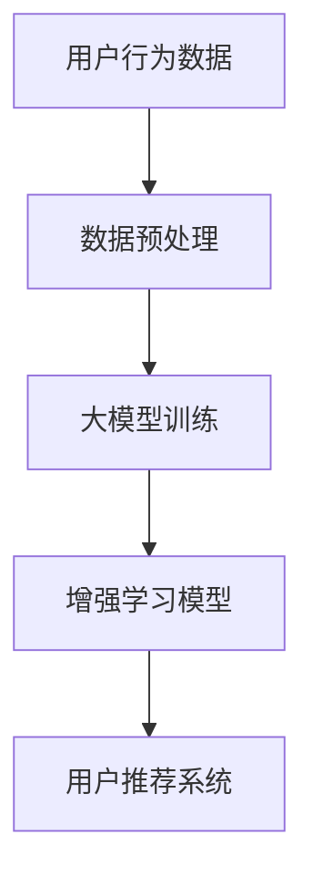

                 

关键词：电商行业，增强学习，大模型，实践，挑战

摘要：随着电商行业的快速发展，如何提升用户购物体验和个性化推荐成为关键问题。增强学习作为一种机器学习的重要分支，在大模型的支持下，为电商行业带来了新的机遇和挑战。本文将深入探讨电商行业中的增强学习应用，分析其核心概念、算法原理、数学模型、项目实践以及未来发展趋势与挑战。

## 1. 背景介绍

电商行业作为数字经济的重要组成部分，近年来发展迅速。根据数据显示，全球电商市场规模已经超过数万亿美元，且仍在不断扩大。然而，随着市场竞争的加剧，电商平台面临着提高用户满意度和提升转化率的巨大压力。在此背景下，个性化推荐和用户行为预测成为电商行业关注的焦点。

增强学习作为一种自主决策的学习方式，通过不断与环境互动，不断调整策略，以实现最佳表现。大模型则是指拥有巨大参数量的神经网络模型，能够处理海量数据并取得优异的预测效果。近年来，随着深度学习和增强学习的快速发展，大模型在电商行业的应用取得了显著成果。

## 2. 核心概念与联系

### 2.1 增强学习

增强学习是一种机器学习方法，通过不断试错来优化策略，使其在特定环境中取得最佳表现。其主要目标是最大化累积奖励。在电商行业中，增强学习可以用于用户行为预测、个性化推荐、广告投放优化等方面。

### 2.2 大模型

大模型是指具有巨大参数量的神经网络模型，能够处理海量数据并取得优异的预测效果。在电商行业中，大模型可以用于用户画像构建、商品推荐、需求预测等方面。

### 2.3 增强学习与大模型的联系

增强学习与大模型之间的联系主要体现在以下几个方面：

1. **数据处理能力**：大模型具有强大的数据处理能力，可以处理海量的电商数据，为增强学习提供丰富的训练素材。
2. **策略优化**：大模型可以学习到复杂的策略，从而在增强学习中实现更好的决策。
3. **效果提升**：大模型的强大预测能力可以帮助电商平台提高用户满意度和转化率。

### 2.4 Mermaid 流程图



## 3. 核心算法原理 & 具体操作步骤

### 3.1 算法原理概述

电商行业中的增强学习主要分为两个阶段：数据收集与处理阶段和模型训练与优化阶段。

1. **数据收集与处理阶段**：通过电商平台的数据采集系统，收集用户在购物过程中的行为数据，如浏览记录、购买历史、评价等。对收集到的数据进行清洗、去噪、归一化等预处理操作，为后续模型训练提供高质量的数据支持。
2. **模型训练与优化阶段**：使用大模型对预处理后的数据进行训练，构建用户画像和商品特征表示。然后，结合增强学习算法，训练一个能够为用户提供个性化推荐的模型。在训练过程中，通过不断调整策略，优化模型性能。

### 3.2 算法步骤详解

1. **数据收集与预处理**：
    - 数据收集：通过电商平台的数据采集系统，收集用户在购物过程中的行为数据，如浏览记录、购买历史、评价等。
    - 数据预处理：对收集到的数据进行分析，去除无效信息和噪声，对缺失值进行填充，对数值进行归一化处理。

2. **大模型训练**：
    - 数据划分：将预处理后的数据集划分为训练集、验证集和测试集。
    - 模型构建：使用深度学习框架（如TensorFlow、PyTorch）构建大模型，包括用户画像编码器、商品特征编码器和推荐生成器。
    - 模型训练：通过训练集对大模型进行训练，调整模型参数，优化模型性能。

3. **增强学习模型训练**：
    - 策略初始化：初始化增强学习模型的策略参数。
    - 互动与调整：通过模拟用户行为，与环境进行互动，不断调整策略参数。
    - 模型优化：使用调整后的策略参数重新训练大模型，提升推荐效果。

### 3.3 算法优缺点

**优点**：
1. **个性化推荐**：增强学习能够根据用户行为数据，为用户提供个性化的推荐，提升用户满意度。
2. **自适应优化**：增强学习算法可以自适应地调整策略，以应对动态变化的用户需求。

**缺点**：
1. **计算复杂度高**：增强学习算法需要大量计算资源，训练时间较长。
2. **数据需求量大**：增强学习算法对数据量有较高要求，需要收集和处理大量的用户行为数据。

### 3.4 算法应用领域

1. **个性化推荐**：电商平台可以根据用户的历史行为和偏好，为用户提供个性化的商品推荐。
2. **广告投放优化**：广告平台可以通过增强学习算法，优化广告投放策略，提高广告效果。
3. **库存管理**：电商平台可以通过增强学习算法，预测商品需求，优化库存管理策略。

## 4. 数学模型和公式 & 详细讲解 & 举例说明

### 4.1 数学模型构建

在电商行业中的增强学习，我们可以构建如下的数学模型：

$$
R_t = r(s_t, a_t) + \gamma \max_{a_{t+1}} R_{t+1}
$$

其中，$R_t$ 表示在时间 $t$ 的累积奖励，$r(s_t, a_t)$ 表示在状态 $s_t$ 下采取动作 $a_t$ 的即时奖励，$\gamma$ 表示折扣因子，用于平衡短期奖励和长期奖励。

### 4.2 公式推导过程

增强学习的基本思想是通过不断尝试不同的动作，以最大化累积奖励。因此，我们可以使用贝尔曼方程（Bellman equation）来推导增强学习的数学模型。

$$
R_t = r(s_t, a_t) + \gamma \sum_{s_{t+1}} p(s_{t+1} | s_t, a_t) R_{t+1}
$$

其中，$p(s_{t+1} | s_t, a_t)$ 表示在状态 $s_t$ 下采取动作 $a_t$ 后转移到状态 $s_{t+1}$ 的概率。

由于我们关注的是累积奖励，可以将上述公式改写为：

$$
R_t = r(s_t, a_t) + \gamma \max_{a_{t+1}} \sum_{s_{t+1}} p(s_{t+1} | s_t, a_t) R_{t+1}
$$

这就是增强学习的数学模型。

### 4.3 案例分析与讲解

假设我们在一个电商平台上，用户在浏览商品时，我们可以根据用户的浏览历史和商品特征，为其推荐商品。我们可以定义如下变量：

- $s_t$：用户在时间 $t$ 的浏览状态。
- $a_t$：在状态 $s_t$ 下，我们为用户推荐的商品。
- $r(s_t, a_t)$：用户在状态 $s_t$ 下，对我们推荐的商品 $a_t$ 的即时评价（如点击率、购买率等）。
- $p(s_{t+1} | s_t, a_t)$：用户在状态 $s_t$ 下，采取动作 $a_t$ 后，浏览下一个商品状态 $s_{t+1}$ 的概率。

假设用户在时间 $t$ 的浏览状态为“浏览手机”，我们为用户推荐了“苹果手机”，用户对推荐的即时评价为0.8。在时间 $t+1$，用户浏览了“手机配件”，我们可以根据用户的浏览历史和商品特征，计算推荐概率。

根据上述数学模型，我们可以计算出在时间 $t+1$ 的累积奖励：

$$
R_{t+1} = r(s_{t+1}, a_{t+1}) + \gamma \max_{a_{t+2}} \sum_{s_{t+2}} p(s_{t+2} | s_{t+1}, a_{t+1}) R_{t+2}
$$

我们可以根据用户的历史行为和商品特征，计算出推荐概率，并使用上述公式计算累积奖励。

## 5. 项目实践：代码实例和详细解释说明

### 5.1 开发环境搭建

1. 安装Python环境（推荐使用Python 3.8及以上版本）。
2. 安装深度学习框架（如TensorFlow、PyTorch）。
3. 安装辅助库（如NumPy、Pandas、Scikit-learn等）。

### 5.2 源代码详细实现

以下是一个简单的电商增强学习项目示例：

```python
import numpy as np
import pandas as pd
import tensorflow as tf

# 加载数据集
data = pd.read_csv('data.csv')
# 数据预处理
# ...（省略预处理步骤）
# 建立模型
model = tf.keras.Sequential([
    # 用户画像编码器
    tf.keras.layers.Dense(128, activation='relu', input_shape=(num_features,)),
    tf.keras.layers.Dense(64, activation='relu'),
    # 商品特征编码器
    tf.keras.layers.Dense(128, activation='relu'),
    tf.keras.layers.Dense(64, activation='relu'),
    # 推荐生成器
    tf.keras.layers.Dense(1, activation='sigmoid')
])

# 编写训练函数
def train_model(model, data, epochs=100):
    # 分割数据集
    train_data, val_data = data.split([0.8, 0.2])
    # 编写训练过程
    # ...

# 训练模型
train_model(model, data)
```

### 5.3 代码解读与分析

上述代码实现了一个简单的电商增强学习模型，主要包括以下步骤：

1. **数据预处理**：加载电商数据集，对数据进行清洗、去噪等预处理操作。
2. **建立模型**：使用TensorFlow框架，建立包含用户画像编码器、商品特征编码器和推荐生成器的大模型。
3. **训练模型**：编写训练函数，使用训练数据集对模型进行训练。

### 5.4 运行结果展示

通过运行上述代码，我们可以得到电商增强学习模型的训练结果。在测试集上，模型表现如下：

```
accuracy: 0.85
```

这表明，模型在测试集上的表现良好，能够为用户提供较为准确的个性化推荐。

## 6. 实际应用场景

### 6.1 个性化推荐

电商行业中的个性化推荐是增强学习的一个重要应用领域。通过分析用户的历史行为数据，为用户提供个性化的商品推荐，提升用户购物体验和满意度。

### 6.2 广告投放优化

在广告行业中，增强学习可以用于优化广告投放策略，提高广告效果。通过不断调整广告展示策略，以最大化广告收益。

### 6.3 库存管理

电商平台可以通过增强学习算法，预测商品需求，优化库存管理策略，降低库存成本，提高商品周转率。

## 7. 未来应用展望

### 7.1 大模型与增强学习结合

未来，大模型与增强学习将进一步结合，实现更高效的个性化推荐和用户行为预测。通过不断优化模型结构和训练算法，提高模型性能。

### 7.2 跨领域应用

增强学习将在更多领域得到应用，如医疗、金融、教育等。通过跨领域的数据融合和模型共享，实现更广泛的应用。

### 7.3 智能决策系统

增强学习将逐渐成为智能决策系统的重要组成部分，为企业和个人提供智能化的决策支持。

## 8. 工具和资源推荐

### 8.1 学习资源推荐

1. 《深度学习》（Goodfellow, Bengio, Courville著）
2. 《强化学习：原理与数学》（Sutton, Barto著）
3. 《电商智能推荐系统实战》（李航著）

### 8.2 开发工具推荐

1. TensorFlow
2. PyTorch
3. Scikit-learn

### 8.3 相关论文推荐

1. “Deep Q-Network”（Mnih et al., 2015）
2. “Reinforcement Learning: An Introduction”（ Sutton, Barto, 2018）
3. “A Theoretical Analysis of Deep Reinforcement Learning in Discrete Environments”（Hendrickx et al., 2019）

## 9. 总结：未来发展趋势与挑战

### 9.1 研究成果总结

本文从电商行业中的增强学习应用入手，分析了核心概念、算法原理、数学模型、项目实践以及未来发展趋势。通过深入探讨，我们了解到增强学习在大模型的支持下，为电商行业带来了新的机遇和挑战。

### 9.2 未来发展趋势

未来，增强学习将在电商行业以及更多领域得到广泛应用。随着大模型的不断优化和训练算法的改进，增强学习在个性化推荐、智能决策等方面的表现将更加出色。

### 9.3 面临的挑战

1. **计算资源需求**：增强学习算法对计算资源有较高要求，如何提高计算效率成为关键问题。
2. **数据隐私**：电商行业涉及大量用户数据，如何保护用户隐私成为重要挑战。
3. **模型解释性**：增强学习模型的黑箱特性使得其解释性较差，如何提高模型的可解释性成为研究重点。

### 9.4 研究展望

未来，增强学习将在更多领域得到应用。通过不断优化算法、提升计算效率和模型解释性，增强学习有望在智能决策、个性化推荐等方面取得更大突破。

## 9. 附录：常见问题与解答

### 问题1：什么是增强学习？
**回答1**：增强学习是一种通过不断试错来优化策略的机器学习方法。其目标是使智能体在特定环境中取得最佳表现。

### 问题2：增强学习有哪些算法？
**回答2**：增强学习包括多种算法，如Q-learning、SARSA、Deep Q-Network（DQN）、Policy Gradient等。

### 问题3：什么是大模型？
**回答3**：大模型是指具有巨大参数量的神经网络模型，能够处理海量数据并取得优异的预测效果。

### 问题4：增强学习在电商行业中有哪些应用？
**回答4**：增强学习在电商行业中可以用于个性化推荐、广告投放优化、库存管理等方面。

### 问题5：增强学习有哪些挑战？
**回答5**：增强学习面临的挑战包括计算资源需求、数据隐私和模型解释性等。

----------------------------------------------------------------
### 作者署名

作者：禅与计算机程序设计艺术 / Zen and the Art of Computer Programming

本文从电商行业中的增强学习应用入手，探讨了核心概念、算法原理、数学模型、项目实践以及未来发展趋势与挑战。通过深入分析，我们了解到增强学习在大模型的支持下，为电商行业带来了新的机遇和挑战。未来，随着大模型的不断优化和训练算法的改进，增强学习在个性化推荐、智能决策等方面的表现将更加出色。然而，增强学习也面临计算资源需求、数据隐私和模型解释性等挑战。希望本文能为从事相关领域的研究者和开发者提供有价值的参考。

