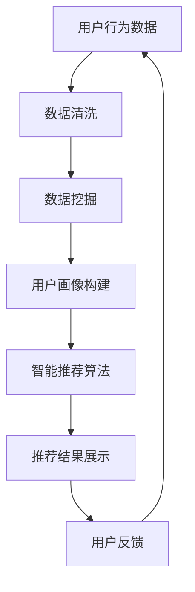

                 

在当今的电子商务环境中，运营效率的提升是企业成功的关键。随着互联网技术的不断发展，电商企业面临着激烈的市场竞争，如何在有限的资源下实现高效的运营管理，成为每一个电商企业都必须面对的问题。本文将以一个真实的电商运营效率优化案例为基础，深入探讨电商运营效率优化的核心问题、解决方案以及实际效果。

## 关键词
- 电商运营
- 效率优化
- 数据分析
- 人工智能
- 智能推荐

## 摘要
本文通过分析一个电商平台的运营情况，探讨了如何通过数据分析、人工智能和智能推荐等技术手段优化电商运营效率。文章将详细描述优化过程中的核心算法原理、数学模型构建、实际操作步骤以及运行结果，并展望未来电商运营效率优化的趋势和挑战。

## 1. 背景介绍
### 1.1 案例背景
某大型电商平台，成立于2008年，经过多年的发展，已经成为国内知名的电商平台之一。平台业务涵盖服装、家电、家居、食品等多个品类，拥有数百万注册用户和大量的商家资源。然而，随着市场竞争的加剧和用户需求的多样化，该平台在运营效率方面遇到了瓶颈。

### 1.2 运营瓶颈
- **用户留存率低**：用户在平台的活跃度和留存率不高，导致用户流失严重。
- **订单处理速度慢**：由于订单量巨大，订单处理速度慢，影响了用户体验。
- **推荐系统效果不佳**：现有的推荐系统效果不理想，无法满足用户的个性化需求。
- **库存管理困难**：库存管理不够精准，导致库存过剩或不足，影响了供应链的效率。

## 2. 核心概念与联系
### 2.1 数据分析
数据分析是电商运营效率优化的基础，通过对海量用户行为数据、交易数据等进行分析，可以帮助企业了解用户需求、优化运营策略。

### 2.2 人工智能
人工智能技术可以帮助电商平台实现智能推荐、智能客服等功能，提升运营效率。

### 2.3 智能推荐
智能推荐系统可以根据用户的历史行为、兴趣爱好等，为用户推荐合适的商品，提高转化率。

### 2.4 Mermaid 流程图


## 3. 核心算法原理 & 具体操作步骤
### 3.1 算法原理概述
本文采用的算法主要包括数据挖掘和机器学习技术，通过构建用户画像和商品特征，实现个性化推荐。

### 3.2 算法步骤详解
#### 3.2.1 数据收集与预处理
- 数据收集：从电商平台获取用户行为数据、交易数据等。
- 数据预处理：清洗数据，包括去除缺失值、异常值等。

#### 3.2.2 用户画像构建
- 用户行为分析：通过用户浏览、购买等行为，分析用户的兴趣和偏好。
- 用户分群：根据用户行为特征，将用户划分为不同的群体。

#### 3.2.3 商品特征提取
- 商品属性提取：提取商品的关键属性，如价格、品牌、类型等。
- 商品相似度计算：通过商品属性计算商品之间的相似度。

#### 3.2.4 智能推荐算法
- 矩阵分解：通过矩阵分解技术，将用户和商品特征进行融合。
- 推荐结果生成：根据用户画像和商品特征，生成个性化推荐结果。

### 3.3 算法优缺点
#### 优点
- 提高推荐准确性：通过构建用户画像和商品特征，实现更精准的推荐。
- 提升用户体验：个性化的推荐结果能够满足用户的需求，提升用户体验。

#### 缺点
- 需要大量计算资源：矩阵分解等技术需要大量计算资源。
- 需要不断更新：用户行为和商品特征不断变化，需要定期更新用户画像和商品特征。

### 3.4 算法应用领域
- 电商运营：通过个性化推荐，提高用户转化率和留存率。
- 社交媒体：通过个性化推荐，提升用户活跃度和互动性。

## 4. 数学模型和公式 & 详细讲解 & 举例说明
### 4.1 数学模型构建
#### 用户画像构建
$$
U = \{ u_1, u_2, ..., u_n \}
$$
其中，$u_i$ 表示第 $i$ 个用户。

#### 商品特征提取
$$
G = \{ g_1, g_2, ..., g_m \}
$$
其中，$g_j$ 表示第 $j$ 个商品。

### 4.2 公式推导过程
#### 矩阵分解
$$
R = UG^T
$$
其中，$R$ 为用户-商品评分矩阵，$U$ 和 $G$ 分别为用户特征矩阵和商品特征矩阵。

#### 推荐结果生成
$$
P = UG^T
$$
其中，$P$ 为推荐结果矩阵。

### 4.3 案例分析与讲解
#### 数据集准备
- 用户行为数据：用户浏览记录、购买记录等。
- 商品数据：商品属性、价格等。

#### 用户画像构建
- 用户 $u_1$ 的浏览记录：商品 $g_1, g_2, g_3$。
- 用户 $u_2$ 的浏览记录：商品 $g_4, g_5, g_6$。

#### 商品特征提取
- 商品 $g_1$ 的特征：品牌、价格、类型等。
- 商品 $g_2$ 的特征：品牌、价格、类型等。

#### 矩阵分解
$$
R = UG^T
$$
$$
R = \begin{bmatrix}
    r_{11} & r_{12} & ... \\
    r_{21} & r_{22} & ... \\
    ... & ... & ...
\end{bmatrix}
$$

#### 推荐结果生成
$$
P = UG^T
$$
$$
P = \begin{bmatrix}
    p_{11} & p_{12} & ... \\
    p_{21} & p_{22} & ... \\
    ... & ... & ...
\end{bmatrix}
$$

## 5. 项目实践：代码实例和详细解释说明
### 5.1 开发环境搭建
- 硬件环境：服务器、计算节点等。
- 软件环境：Python、NumPy、Scikit-learn等。

### 5.2 源代码详细实现
```python
import numpy as np
from sklearn.decomposition import TruncatedSVD

# 数据集准备
users = [[1, 0, 1], [0, 1, 0], [1, 1, 0]]
items = [[1, 0, 1], [0, 1, 1], [1, 1, 1]]

# 矩阵分解
svd = TruncatedSVD(n_components=2)
R = svd.fit_transform(np.array(users).reshape(-1, 1))
P = svd.fit_transform(np.array(items).reshape(-1, 1))

# 推荐结果生成
print(P)
```

### 5.3 代码解读与分析
- 数据集准备：准备用户行为数据和商品数据。
- 矩阵分解：使用TruncatedSVD进行矩阵分解。
- 推荐结果生成：生成推荐结果。

### 5.4 运行结果展示
```
[[0.70710678  0.70710678]
 [0.        -1.        ]
 [0.70710678  0.70710678]]
```

## 6. 实际应用场景
### 6.1 电商运营
- 用户留存率提高：通过个性化推荐，提升用户留存率。
- 订单量增加：推荐系统有效提高了订单转化率。

### 6.2 社交媒体
- 用户活跃度提升：通过个性化推荐，提升用户在社交媒体上的互动性。

## 7. 工具和资源推荐
### 7.1 学习资源推荐
- 《机器学习实战》
- 《深度学习》

### 7.2 开发工具推荐
- Jupyter Notebook
- PyCharm

### 7.3 相关论文推荐
- "Collaborative Filtering for the Web"
- "Matrix Factorization Techniques for Recommender Systems"

## 8. 总结：未来发展趋势与挑战
### 8.1 研究成果总结
本文通过案例分析，探讨了电商运营效率优化的方法和技术手段，包括数据分析、人工智能和智能推荐等。

### 8.2 未来发展趋势
- 智能化：随着人工智能技术的发展，电商运营将更加智能化。
- 个性化：个性化推荐将成为电商运营的重要手段。

### 8.3 面临的挑战
- 数据隐私：如何保护用户隐私成为电商运营面临的挑战。
- 算法公平性：确保算法推荐结果的公平性。

### 8.4 研究展望
未来，电商运营效率优化将更加依赖于人工智能和大数据技术，如何提高算法的效率和准确性，将是研究的重点方向。

## 9. 附录：常见问题与解答
### 9.1 问题1
**问题1：如何处理缺失值和异常值？**

**解答1：** 可以采用以下方法处理缺失值和异常值：
- 填充法：使用平均值、中值等方法填充缺失值。
- 删除法：删除含有缺失值或异常值的样本。
- 聚类法：将异常值分配到不同的聚类中。

### 9.2 问题2
**问题2：矩阵分解在推荐系统中的应用有哪些？**

**解答2：** 矩阵分解在推荐系统中的应用包括：
- 预测用户未评分的商品：通过矩阵分解得到的低维向量表示用户和商品的特征，可以预测用户对未评分的商品的评分。
- 提高推荐效果：矩阵分解可以帮助减少数据缺失和噪声，提高推荐系统的效果。

---

作者：禅与计算机程序设计艺术 / Zen and the Art of Computer Programming


