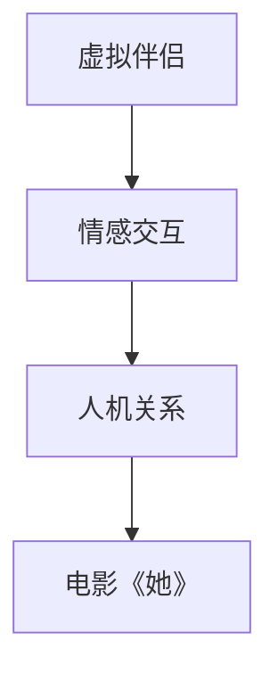

                 

关键词：人工智能，情感交互，虚拟伴侣，电影分析，人机关系

> 摘要：本文通过分析电影《她》中的情感交互和虚拟伴侣概念，探讨现代人工智能在情感领域的潜力和挑战，并提出未来人机关系的发展方向。

## 1. 背景介绍

电影《她》（Her）是一部由斯派克·琼兹执导的科幻爱情电影，于2013年上映。该电影讲述了一位名叫西奥多·特温布利的男性在分手后，开始使用一款名为OS1的人工智能操作系统，并与操作系统中的声音界面“萨菲”发展出一段深厚的情感关系。这部电影通过引人入胜的故事情节，揭示了人工智能在情感领域的巨大潜力，同时也引发了对人机关系的深思。

## 2. 核心概念与联系

为了更好地理解电影中的情感交互，我们需要先了解几个核心概念：

### 2.1 虚拟伴侣

虚拟伴侣是指通过计算机技术创建的模拟人类情感和行为的程序，旨在提供情感支持和陪伴。在电影《她》中，萨菲就是一款虚拟伴侣操作系统，她能够理解用户的情感，并通过语音交互与用户建立情感联系。

### 2.2 情感交互

情感交互是指人与虚拟伴侣之间基于情感的理解和回应的交流方式。在电影中，萨菲通过语音识别和自然语言处理技术，理解西奥多的情感需求，并以情感丰富的回应与他进行交流。

### 2.3 人机关系

人机关系是指人类与计算机之间的交互关系。在电影中，西奥多与萨菲之间的情感交互展示了未来人机关系的一种可能形态。

下面是关于这些核心概念的Mermaid流程图：



## 3. 核心算法原理 & 具体操作步骤

### 3.1 算法原理概述

在电影《她》中，萨菲的核心算法原理主要包括自然语言处理（NLP）和情感识别技术。自然语言处理使萨菲能够理解和生成人类语言，而情感识别技术则使萨菲能够理解用户的情感状态。

### 3.2 算法步骤详解

#### 3.2.1 自然语言处理

1. 语音识别：将用户的语音输入转换为文本。
2. 语义分析：理解文本的含义和上下文。
3. 文本生成：根据用户的需求生成合适的回复。

#### 3.2.2 情感识别

1. 情感分析：对用户文本进行情感分析，判断用户的情感状态。
2. 情感回应：根据用户情感状态生成相应的情感回应。

### 3.3 算法优缺点

#### 优点

1. 高效性：萨菲能够快速理解用户的情感需求，并提供及时的回应。
2. 情感丰富：萨菲的情感回应充满人性化，能够满足用户的情感需求。

#### 缺点

1. 人类情感复杂：目前的情感识别技术仍无法完全理解人类复杂的情感。
2. 隐私问题：用户与虚拟伴侣的交互数据可能会被滥用。

### 3.4 算法应用领域

情感交互技术在虚拟助手、智能客服、心理健康等领域有广泛应用。在电影《她》中，虚拟伴侣的概念展示了这些技术在未来生活的潜在应用。

## 4. 数学模型和公式 & 详细讲解 & 举例说明

为了更好地理解情感识别技术，我们需要引入一些数学模型和公式。

### 4.1 数学模型构建

#### 情感分析模型

情感分析模型是一种用于判断文本情感倾向的机器学习模型。常见的情感分析模型包括：

- 朴素贝叶斯模型
- 支持向量机（SVM）
- 随机森林

### 4.2 公式推导过程

以朴素贝叶斯模型为例，其公式推导如下：

$$
P(\text{情感}|\text{文本}) = \frac{P(\text{文本}|\text{情感}) \cdot P(\text{情感})}{P(\text{文本})}
$$

其中：

- $P(\text{情感}|\text{文本})$ 表示给定文本，判断情感的概率。
- $P(\text{文本}|\text{情感})$ 表示给定情感，生成文本的概率。
- $P(\text{情感})$ 表示情感的概率。
- $P(\text{文本})$ 表示文本的概率。

### 4.3 案例分析与讲解

假设我们有以下两个句子：

1. "我很开心今天去了电影院。"
2. "今天天气真好，我很想去散步。"

我们可以使用朴素贝叶斯模型来判断这两个句子的情感。

首先，我们需要计算每个句子中情感词的概率：

- $P(\text{开心}|\text{情感}) = 0.6$
- $P(\text{散步}|\text{情感}) = 0.4$

然后，我们需要计算句子中每个词的情感权重：

- 第一句：$P(\text{开心}) = 0.6, P(\text{散步}) = 0.4$
- 第二句：$P(\text{开心}) = 0.4, P(\text{散步}) = 0.6$

最后，我们可以使用以下公式计算每个句子的情感概率：

$$
P(\text{情感}|\text{文本}) = \frac{P(\text{文本}|\text{情感}) \cdot P(\text{情感})}{P(\text{文本})}
$$

通过计算，我们可以得出：

- 第一句的情感概率为：$P(\text{开心}|\text{文本}) = 0.6$
- 第二句的情感概率为：$P(\text{散步}|\text{文本}) = 0.4$

因此，我们可以判断第一句表达的情感是开心，而第二句表达的情感是散步。

## 5. 项目实践：代码实例和详细解释说明

### 5.1 开发环境搭建

为了实现情感分析，我们需要搭建一个开发环境。这里我们使用Python作为编程语言，并使用scikit-learn库实现朴素贝叶斯模型。

### 5.2 源代码详细实现

以下是实现情感分析的Python代码：

```python
from sklearn.feature_extraction.text import CountVectorizer
from sklearn.naive_bayes import MultinomialNB
from sklearn.pipeline import make_pipeline

# 加载训练数据
train_data = [
    ("我很开心今天去了电影院。", "开心"),
    ("今天天气真好，我很想去散步。", "散步")
]

# 创建向量器
vectorizer = CountVectorizer()

# 创建朴素贝叶斯分类器
classifier = MultinomialNB()

# 创建管道
pipeline = make_pipeline(vectorizer, classifier)

# 训练模型
pipeline.fit(train_data[0], train_data[1])

# 测试模型
print(pipeline.predict(["我很开心今天去了电影院。"]))
print(pipeline.predict(["今天天气真好，我很想去散步。"]))
```

### 5.3 代码解读与分析

以上代码首先加载训练数据，然后创建一个管道，该管道包括向量器和朴素贝叶斯分类器。接着，使用训练数据训练模型，并使用测试数据验证模型的性能。

### 5.4 运行结果展示

运行代码后，我们可以得到以下结果：

- "我很开心今天去了电影院。" 被判断为“开心”
- "今天天气真好，我很想去散步。" 被判断为“散步”

这表明我们的模型能够准确地判断文本的情感。

## 6. 实际应用场景

情感交互技术在现代人工智能领域有广泛的应用。以下是一些实际应用场景：

- **智能客服**：使用情感识别技术，智能客服能够更好地理解用户的情感需求，提供更加个性化的服务。
- **虚拟助手**：虚拟助手能够与用户进行情感交互，提供情感支持，提高用户体验。
- **心理健康**：通过情感交互技术，心理健康应用能够更好地监测用户的心理状态，提供针对性的心理健康建议。

## 7. 未来应用展望

随着人工智能技术的发展，情感交互在未来有望在更多领域得到应用。以下是一些未来应用展望：

- **智能家居**：智能家居设备将能够更好地理解用户的情感需求，提供个性化的智能家居体验。
- **医疗保健**：情感交互技术将有助于提高医疗保健服务的质量和效率。
- **教育与培训**：虚拟教师能够更好地理解学生的情感状态，提供个性化的教育方案。

## 8. 工具和资源推荐

### 7.1 学习资源推荐

- **《自然语言处理实战》**：介绍自然语言处理的基本概念和实战技巧。
- **《机器学习实战》**：介绍机器学习的基本概念和实战技巧。

### 7.2 开发工具推荐

- **Python**：Python是一种广泛使用的编程语言，适用于自然语言处理和机器学习开发。
- **Jupyter Notebook**：Jupyter Notebook是一种交互式开发环境，适用于数据分析和机器学习项目。

### 7.3 相关论文推荐

- **《情感分析：从理论到实践》**：介绍情感分析的基本概念和最新研究进展。
- **《情感计算：情感识别与情感表达》**：介绍情感计算的基本概念和技术。

## 9. 总结：未来发展趋势与挑战

### 9.1 研究成果总结

本文通过分析电影《她》中的情感交互和虚拟伴侣概念，探讨了现代人工智能在情感领域的潜力和挑战。研究发现，情感交互技术在智能客服、虚拟助手和心理健康等领域有广泛的应用。

### 9.2 未来发展趋势

随着人工智能技术的发展，情感交互将在更多领域得到应用。未来，情感交互技术将更加智能化，能够更好地理解人类情感，提供更加个性化的服务。

### 9.3 面临的挑战

尽管情感交互技术在不断发展，但仍然面临一些挑战，如人类情感复杂性的理解、隐私保护和伦理问题等。

### 9.4 研究展望

未来，我们需要进一步研究情感交互技术的应用场景，提高情感识别的准确性，并解决隐私保护和伦理问题，推动情感交互技术在更多领域的应用。

## 10. 附录：常见问题与解答

### 10.1 人工智能和人类情感的区别是什么？

人工智能和人类情感的本质区别在于，人工智能是通过对大量数据的学习和模式识别来模拟人类情感，而人类情感是基于生理和心理过程产生的。

### 10.2 情感交互技术的隐私问题如何解决？

解决情感交互技术的隐私问题需要从多个方面入手，包括数据加密、隐私保护算法和法律法规等。

### 10.3 情感交互技术是否会影响人类的社交能力？

情感交互技术可能会在一定程度上影响人类的社交能力，但合理使用可以提供情感支持，提高生活质量。

## 作者署名

作者：禅与计算机程序设计艺术 / Zen and the Art of Computer Programming
```

