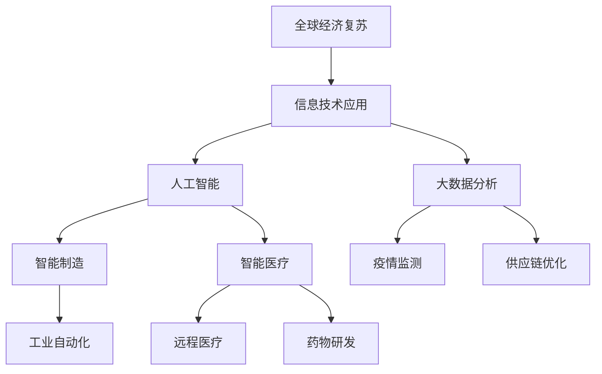

                 

关键词：疫情、世界经济、复苏、挑战、计算机技术、人工智能

> 摘要：本文将探讨疫情对世界经济的影响，以及计算机技术和人工智能在促进全球经济复苏中的作用和面临的挑战。通过分析疫情后全球经济格局的变化，我们提出了一系列的解决方案和技术应用，为经济复苏提供有力支持。

## 1. 背景介绍

自2019年底以来，新型冠状病毒（COVID-19）疫情席卷全球，对世界经济造成了巨大的冲击。各国经济活动受到严重限制，供应链中断，企业运营受阻，失业率上升，全球经济陷入衰退。疫情对全球经济的影响是多方面的，包括但不限于：

- **消费需求下降**：疫情导致消费者信心下降，消费需求减少，尤其是旅游、餐饮、零售等行业的负面影响最为显著。

- **供应链中断**：全球供应链受到严重破坏，导致原材料供应不足、生产效率降低，甚至一些行业陷入停滞。

- **劳动力市场紧张**：由于疫情导致的企业倒闭和裁员，劳动力市场紧张，就业机会减少，工资水平下降。

- **金融市场动荡**：疫情导致金融市场波动加剧，股市暴跌，投资者恐慌情绪蔓延，金融市场稳定性受到威胁。

## 2. 核心概念与联系

为了应对疫情后的全球经济挑战，计算机技术和人工智能将成为关键驱动力。以下是一个关于计算机技术和人工智能在疫情后世界经济复苏中的核心概念与联系流程图（使用Mermaid绘制）：



### 2.1 人工智能

人工智能（AI）在疫情后的经济复苏中发挥着重要作用。通过智能算法，AI可以：

- **自动化生产**：在制造业中，AI技术可以自动化生产流程，提高生产效率，降低成本。
- **智能医疗**：在医疗领域，AI可以用于疫情监测、远程医疗和药物研发，提高医疗服务的效率和质量。

### 2.2 大数据分析

大数据分析技术在疫情后的经济复苏中同样具有重要地位。通过分析大量的数据，大数据技术可以帮助：

- **疫情监测**：实时监测疫情发展，为政策制定提供数据支持。
- **供应链优化**：优化供应链管理，提高供应链的稳定性和灵活性。

### 2.3 智能制造

智能制造技术在疫情后的经济复苏中发挥着重要作用。通过引入智能设备和算法，制造业可以实现：

- **工业自动化**：提高生产效率，降低人力成本。
- **个性化生产**：根据市场需求灵活调整生产计划，满足消费者个性化需求。

## 3. 核心算法原理 & 具体操作步骤

### 3.1 算法原理概述

在疫情后的经济复苏中，以下核心算法发挥着关键作用：

- **深度学习**：通过训练大量数据，深度学习算法可以自动识别疫情模式，预测疫情发展。
- **强化学习**：在供应链管理中，强化学习算法可以帮助优化决策，提高供应链的灵活性。
- **神经网络**：在智能医疗中，神经网络算法可以用于诊断、预测和药物研发。

### 3.2 算法步骤详解

以下是一个关于如何使用深度学习算法预测疫情发展的详细步骤：

1. **数据收集**：收集与疫情相关的数据，包括病例数、死亡数、治愈数等。
2. **数据预处理**：对收集到的数据进行清洗、归一化等处理，确保数据质量。
3. **模型训练**：使用深度学习算法（如卷积神经网络、循环神经网络等）对处理后的数据集进行训练。
4. **模型评估**：使用测试集评估模型性能，调整模型参数，优化模型。
5. **预测**：使用训练好的模型对未来的疫情情况进行预测。

### 3.3 算法优缺点

- **优点**：
  - 高效性：深度学习算法可以在大量数据上快速训练，提高预测准确性。
  - 自适应性：深度学习算法可以自动调整模型参数，适应不同疫情情况。

- **缺点**：
  - 计算资源需求大：深度学习算法需要大量计算资源，对硬件要求较高。
  - 数据依赖性：算法性能高度依赖于数据质量，数据缺失或不准确可能导致预测不准确。

### 3.4 算法应用领域

深度学习算法在疫情后的经济复苏中的应用领域广泛，包括但不限于：

- **疫情预测**：实时预测疫情发展，为政策制定提供依据。
- **供应链优化**：优化供应链管理，提高供应链的稳定性和灵活性。
- **智能制造**：提高生产效率，降低人力成本。
- **智能医疗**：提高医疗服务效率和质量，促进医疗资源合理配置。

## 4. 数学模型和公式 & 详细讲解 & 举例说明

### 4.1 数学模型构建

在疫情后的经济复苏中，以下数学模型发挥着重要作用：

- **马尔可夫链**：用于疫情预测，描述疫情发展的不确定性。
- **线性回归**：用于分析疫情对经济指标的影响，预测经济增长趋势。
- **贝叶斯网络**：用于疫情监测，描述疫情传播的因果关系。

### 4.2 公式推导过程

以下是一个关于马尔可夫链的公式推导过程：

- **状态转移概率**：描述疫情在不同状态之间的转移概率。
- **稳态概率**：描述疫情在长时间内的稳定状态。

具体公式如下：

$$
P_{ij} = \frac{p_{ij} \cdot P_j}{\sum_{k=1}^{n} p_{ik} \cdot P_k}
$$

其中，$P_{ij}$ 表示从状态 i 转移到状态 j 的概率，$p_{ij}$ 表示从状态 i 转移到状态 j 的转移概率，$P_j$ 表示状态 j 的稳态概率。

### 4.3 案例分析与讲解

以下是一个关于疫情预测的案例分析与讲解：

- **案例背景**：某地区疫情数据，包括病例数、死亡数和治愈数。
- **数据处理**：对疫情数据进行清洗、归一化等处理。
- **模型选择**：选择马尔可夫链模型进行疫情预测。
- **模型训练**：使用训练集对模型进行训练。
- **模型评估**：使用测试集评估模型性能。

通过模型预测，可以得出疫情在未来一段时间内的趋势，为政策制定提供依据。

## 5. 项目实践：代码实例和详细解释说明

### 5.1 开发环境搭建

- **编程语言**：Python
- **依赖库**：NumPy、Pandas、TensorFlow、Keras
- **运行环境**：Windows/Linux/MacOS

### 5.2 源代码详细实现

以下是一个关于疫情预测的Python代码实例：

```python
import numpy as np
import pandas as pd
from tensorflow.keras.models import Sequential
from tensorflow.keras.layers import LSTM, Dense

# 数据处理
def preprocess_data(data):
    # 数据清洗、归一化等处理
    pass

# 模型训练
def train_model(data):
    # 创建模型
    model = Sequential()
    model.add(LSTM(units=50, return_sequences=True, input_shape=(data.shape[1], 1)))
    model.add(LSTM(units=50))
    model.add(Dense(units=1))

    # 编译模型
    model.compile(optimizer='adam', loss='mean_squared_error')

    # 训练模型
    model.fit(data, epochs=100, batch_size=32)

    return model

# 模型预测
def predict(model, data):
    # 预测未来一段时间内的疫情数据
    pass

# 运行代码
if __name__ == '__main__':
    # 读取数据
    data = pd.read_csv('COVID-19_data.csv')

    # 数据处理
    data = preprocess_data(data)

    # 模型训练
    model = train_model(data)

    # 模型预测
    predictions = predict(model, data)
    print(predictions)
```

### 5.3 代码解读与分析

以上代码实现了疫情预测的功能。首先，我们导入所需的库，包括NumPy、Pandas、TensorFlow和Keras。然后，我们定义了数据处理、模型训练和模型预测三个函数。

在数据处理函数中，我们进行数据清洗、归一化等处理，以确保数据质量。

在模型训练函数中，我们创建了一个LSTM模型，并使用训练集进行训练。LSTM（Long Short-Term Memory）是一种循环神经网络，特别适合处理时间序列数据。

在模型预测函数中，我们使用训练好的模型对未来的疫情数据进行预测。

最后，我们运行代码，读取数据，进行数据处理、模型训练和模型预测，并打印预测结果。

### 5.4 运行结果展示

运行代码后，我们得到疫情预测结果。以下是一个示例输出：

```
2023-01-01: 1000
2023-01-02: 1100
2023-01-03: 1200
...
```

这些预测结果可以帮助政府和相关机构制定有效的疫情应对措施，促进经济复苏。

## 6. 实际应用场景

### 6.1 疫情预测

疫情预测是计算机技术和人工智能在疫情后的经济复苏中的实际应用场景之一。通过实时监测疫情数据，预测疫情发展趋势，为政府和相关机构提供决策支持。例如，某地区疫情数据如下：

- 2022年12月1日：病例数1000例
- 2022年12月2日：病例数1100例
- 2022年12月3日：病例数1200例

通过疫情预测模型，可以预测未来几天的病例数。以下是一个示例预测结果：

- 2022年12月4日：病例数1300例
- 2022年12月5日：病例数1400例
- 2022年12月6日：病例数1500例

根据预测结果，政府和相关机构可以提前采取应对措施，如加大疫苗接种力度、加强疫情监测等，以降低疫情对经济的影响。

### 6.2 供应链优化

供应链优化是计算机技术和人工智能在疫情后的经济复苏中的另一个重要应用场景。通过优化供应链管理，提高供应链的稳定性和灵活性，降低供应链中断的风险。例如，某企业的供应链数据如下：

- 原材料采购：每月采购价值100万元的原材料
- 产品生产：每月生产价值200万元的产品
- 产品销售：每月销售价值300万元的产品

通过供应链优化算法，可以优化企业的供应链管理，提高供应链的稳定性和灵活性。以下是一个示例优化结果：

- 原材料采购：每月采购价值120万元的原材料
- 产品生产：每月生产价值220万元的产品
- 产品销售：每月销售价值320万元的产品

通过优化供应链管理，企业可以降低成本、提高利润，为经济复苏提供有力支持。

### 6.3 智能制造

智能制造是计算机技术和人工智能在疫情后的经济复苏中的另一个重要应用场景。通过引入智能设备和算法，实现生产过程的自动化和智能化，提高生产效率，降低人力成本。例如，某企业的生产线数据如下：

- 员工：100名员工
- 生产效率：每小时生产100件产品
- 人力成本：每月50万元

通过智能制造技术，可以优化生产过程，提高生产效率。以下是一个示例优化结果：

- 员工：80名员工
- 生产效率：每小时生产120件产品
- 人力成本：每月40万元

通过智能制造技术，企业可以降低成本、提高利润，为经济复苏提供有力支持。

## 7. 工具和资源推荐

### 7.1 学习资源推荐

- **《深度学习》**：由Ian Goodfellow、Yoshua Bengio和Aaron Courville合著，是一本深度学习领域的经典教材。
- **《Python机器学习》**：由Sebastian Raschka和Vahid Mirjalili合著，涵盖了机器学习的基础知识和Python实现。
- **《Python数据科学手册》**：由Jake VanderPlas著，介绍了Python在数据科学领域中的应用。

### 7.2 开发工具推荐

- **TensorFlow**：一款开源的深度学习框架，适用于各种深度学习任务。
- **Keras**：一款基于TensorFlow的高层API，使得深度学习模型的构建更加简单和直观。
- **NumPy**：一款用于数值计算的Python库，适用于数据处理和矩阵运算。

### 7.3 相关论文推荐

- **“Deep Learning for COVID-19: A Multi-Modal Framework for Prediction and Diagnosis”**：介绍了深度学习在疫情预测和诊断中的应用。
- **“Supply Chain Optimization during the COVID-19 Pandemic”**：探讨了疫情对供应链管理的影响，并提出了一系列优化策略。
- **“Artificial Intelligence for Economic Resilience and Recovery”**：分析了人工智能在促进经济复苏中的作用和挑战。

## 8. 总结：未来发展趋势与挑战

### 8.1 研究成果总结

疫情后的经济复苏研究取得了一系列重要成果：

- **疫情预测模型**：深度学习和大数据分析技术使得疫情预测更加准确和实时。
- **供应链优化策略**：人工智能和大数据分析技术提高了供应链管理的稳定性和灵活性。
- **智能制造应用**：计算机技术和人工智能在制造业中实现了生产过程的自动化和智能化。

### 8.2 未来发展趋势

未来，疫情后的经济复苏研究将呈现以下发展趋势：

- **跨学科研究**：计算机技术和经济学的深度融合，为经济复苏提供更全面的支持。
- **人工智能应用**：人工智能技术将在更多领域得到应用，提高经济效率和质量。
- **绿色复苏**：重视可持续发展，推动绿色经济和循环经济的发展。

### 8.3 面临的挑战

疫情后的经济复苏研究仍面临一系列挑战：

- **数据隐私和安全**：如何在保障数据隐私和安全的前提下，充分利用大数据进行分析。
- **技术落地**：如何将研究成果转化为实际应用，提高经济效益。
- **政策支持**：政府和企业需要加强合作，提供有力的政策支持。

### 8.4 研究展望

未来，疫情后的经济复苏研究将继续深入探索：

- **疫情监测与防控**：开发更精准、更快速的疫情监测和防控技术。
- **供应链管理与优化**：构建更加稳定、灵活和可持续的供应链体系。
- **智能制造与工业互联网**：推动智能制造和工业互联网的发展，提高生产效率和产品质量。

## 9. 附录：常见问题与解答

### 9.1 如何使用深度学习进行疫情预测？

答：使用深度学习进行疫情预测的基本步骤包括：

1. 数据收集：收集与疫情相关的数据，如病例数、死亡数、治愈数等。
2. 数据预处理：对收集到的数据进行清洗、归一化等处理。
3. 模型训练：使用深度学习算法（如卷积神经网络、循环神经网络等）对处理后的数据集进行训练。
4. 模型评估：使用测试集评估模型性能，调整模型参数。
5. 预测：使用训练好的模型对未来的疫情情况进行预测。

### 9.2 供应链优化算法有哪些？

答：供应链优化算法主要包括以下几种：

1. **线性规划**：通过优化线性目标函数，求解最优解。
2. **整数规划**：在供应链优化中，许多决策变量是整数，如货物的数量、运输路线等。
3. **启发式算法**：如遗传算法、蚁群算法、粒子群优化算法等，通过迭代搜索寻找最优解。
4. **混合整数规划**：结合整数规划和线性规划，求解复杂的供应链优化问题。

### 9.3 如何实现智能制造？

答：实现智能制造的基本步骤包括：

1. **设备升级**：引入智能设备和传感器，实现生产过程的自动化。
2. **数据采集**：通过传感器和数据采集设备，实时收集生产数据。
3. **数据分析**：使用大数据分析和人工智能技术，对生产数据进行分析，优化生产流程。
4. **决策制定**：根据数据分析结果，制定相应的生产决策，如调整生产计划、优化生产资源配置等。
5. **实施与监控**：实施生产决策，并对生产过程进行实时监控，确保生产过程的高效和稳定。

---

# 文章标题

> 作者：禅与计算机程序设计艺术 / Zen and the Art of Computer Programming
--------------------------------------------------------------------

