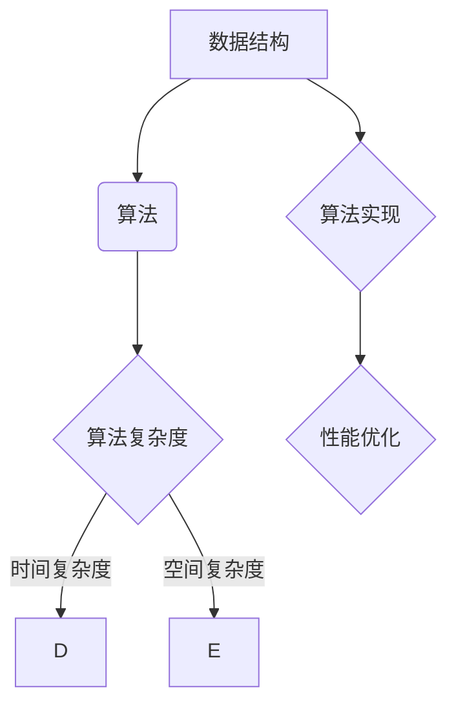

                 

关键词：面试、算法题、高频、解析、求职、技术

> 摘要：本文将深入解析百度2025届社招面试中频繁出现的算法题，帮助求职者掌握这些核心算法的原理和应用，提高面试成功率。

## 1. 背景介绍

百度作为中国领先的人工智能公司，其社招面试对于技术求职者来说是一个重要的职业机会。每年的社招面试，都会针对不同的岗位设置一系列技术面试题目，其中算法题是必不可少的部分。这些算法题不仅考察求职者的编程能力，还涉及数据结构与算法的深度理解。因此，掌握这些高频算法题对于求职者来说至关重要。

本文将围绕百度2025届社招面试中出现的高频算法题进行深入解析，旨在帮助求职者更好地准备面试，提高成功率。文章将包括以下内容：

- **核心概念与联系**：介绍与算法题相关的核心概念和原理，通过Mermaid流程图展示其关系。
- **核心算法原理与具体操作步骤**：详细讲解算法的原理、步骤、优缺点及其应用领域。
- **数学模型和公式**：阐述算法中的数学模型和公式，并通过实例进行说明。
- **项目实践**：提供代码实例和详细解释，展示算法的实际应用。
- **实际应用场景**：分析算法在现实世界中的应用，探讨未来发展趋势。
- **工具和资源推荐**：推荐学习资源和开发工具，帮助读者进一步提升技能。
- **总结与展望**：总结研究成果，展望未来发展趋势和挑战。

### 1.1. 算法题目的来源

百度社招面试中的算法题主要来源于以下几类：

- **经典算法题目**：如排序、查找、图算法等，这些题目是算法基础的重要组成部分。
- **编程题**：通常涉及编程语言的基础知识，要求求职者编写代码解决特定问题。
- **数据结构与算法的综合题**：涉及复杂的数据结构设计和算法实现，考察求职者的综合能力。
- **实际业务场景题**：模拟公司实际业务场景中的问题，要求求职者用算法解决。

### 1.2. 面试的目的

百度社招面试中的算法题目主要有以下目的：

- **考察编程能力**：通过编程题，评估求职者的编程技巧和代码风格。
- **检验算法理解**：通过经典算法题，评估求职者对算法原理和复杂度的理解。
- **测试思维逻辑**：通过综合题和业务场景题，评估求职者的逻辑思维和解决问题的能力。
- **评估综合能力**：综合考察求职者的算法、编程、数据结构、业务理解等多方面能力。

### 1.3. 面试的重要性

成功通过百度社招面试，不仅意味着获得一份理想的工作，更是求职者技术能力的一种证明。因此，面试的重要性不言而喻：

- **展示自我能力**：通过面试，求职者有机会展示自己在技术领域的专业能力和潜力。
- **争取面试机会**：优秀的面试表现可以大大增加求职者获得面试机会的几率。
- **进入百度工作**：通过面试，求职者有机会加入百度，成为顶尖技术团队的一员。

### 1.4. 面试准备建议

为了在百度社招面试中取得好成绩，求职者需要进行充分的准备：

- **刷题练习**：通过大量的算法题练习，熟悉各种类型的题目，提高解题速度和准确性。
- **复习基础**：巩固编程语言基础和数据结构知识，确保对基本概念有深入理解。
- **模拟面试**：进行模拟面试，提前适应面试环境和节奏，提高面试表现。
- **调整心态**：保持积极的心态，克服紧张情绪，展现自信和专业的态度。

接下来，我们将深入探讨百度2025届社招面试中的一些高频算法题，帮助读者更好地准备面试。

## 2. 核心概念与联系

在解答百度2025届社招面试中的算法题时，首先需要理解几个核心概念。这些概念相互关联，构成了算法题的基石。以下是这些核心概念的介绍以及它们之间的关系。

### 2.1. 数据结构

数据结构是计算机存储数据的方式，它们决定了数据如何被组织和访问。常见的数据结构包括数组、链表、栈、队列、树和图等。每种数据结构都有其独特的特点和适用场景。

#### 2.1.1. 关系

- **数组与链表**：数组是一种线性数据结构，而链表则是通过节点连接的链式数据结构。它们都用于存储一系列元素，但数组提供固定的内存空间，而链表可以根据需要动态分配内存。
- **栈与队列**：栈是一种后进先出（LIFO）的数据结构，而队列是一种先进先出（FIFO）的数据结构。它们都用于管理数据流，但栈主要用于回溯操作，队列则用于处理等待任务。
- **树与图**：树是一种层次结构，用于表示具有层次关系的数据，而图是一种更复杂的数据结构，用于表示多个实体之间的复杂关系。

### 2.2. 算法

算法是解决问题的方法步骤。算法的有效性通常通过时间复杂度和空间复杂度来衡量。常见算法包括排序算法、查找算法、图算法等。

#### 2.2.1. 关系

- **排序与查找**：排序算法用于对数据进行排序，而查找算法用于在数据结构中查找特定元素。常见的排序算法有冒泡排序、快速排序、归并排序等，常见的查找算法有二分查找、顺序查找等。
- **图算法**：图算法用于解决图相关的问题，如最短路径、最小生成树等。常见的图算法有迪杰斯特拉算法、贝尔曼-福特算法、普里姆算法等。

### 2.3. 算法复杂度

算法复杂度是评估算法性能的重要指标。算法的时间复杂度表示算法执行时间与数据规模之间的关系，而空间复杂度表示算法所需内存与数据规模之间的关系。

#### 2.3.1. 关系

- **时间复杂度与空间复杂度**：算法的时间复杂度通常用大O符号表示，如O(n)、O(nlogn)等。空间复杂度同样用大O符号表示。在选择算法时，需要权衡时间和空间复杂度。
- **实际性能**：算法复杂度提供了理论上的性能评估，但实际性能还受到编程实现、硬件环境等因素的影响。

### 2.4. 数据结构与算法的关系

数据结构与算法是密不可分的。数据结构提供了算法解决问题的数据基础，而算法则利用这些数据结构实现问题的解决。

#### 2.4.1. 关系

- **数据结构决定算法**：不同的数据结构适用于不同的算法，选择合适的数据结构可以优化算法的性能。
- **算法影响数据结构**：一些算法的实现可能会影响数据结构的性能，如动态数组、平衡二叉树等。

### 2.5. Mermaid流程图

为了更直观地展示数据结构、算法和算法复杂度之间的关系，我们可以使用Mermaid流程图。以下是一个简单的Mermaid流程图示例：



### 2.6. 总结

数据结构、算法、算法复杂度是计算机科学中的核心概念，它们相互关联，共同构成了算法题的基础。理解这些概念及其关系，对于解决百度社招面试中的算法题至关重要。

## 3. 核心算法原理 & 具体操作步骤

在百度2025届社招面试中，算法题通常涉及排序、查找、图算法等领域。以下将详细介绍这些算法的原理和具体操作步骤，帮助求职者更好地理解和使用这些算法。

### 3.1. 排序算法

排序算法是将一组数据按照某种规则进行排列的算法。常见的排序算法有冒泡排序、快速排序、归并排序等。

#### 3.1.1. 冒泡排序（Bubble Sort）

**原理**：冒泡排序通过反复交换相邻的未按顺序排列的元素，直到所有元素都按顺序排列。

**操作步骤**：

1. 从第一个元素开始，比较相邻的两个元素，如果第一个比第二个大（升序情况下），就交换它们。
2. 对每一对相邻元素做同样的工作，从开始第一对到结尾的最后一对。
3. 重复步骤1~2，直到没有需要交换的元素。

**代码实现**：

```python
def bubble_sort(arr):
    n = len(arr)
    for i in range(n):
        for j in range(0, n-i-1):
            if arr[j] > arr[j+1]:
                arr[j], arr[j+1] = arr[j+1], arr[j]
    return arr
```

**优缺点**：

- **优点**：实现简单，容易理解。
- **缺点**：效率较低，时间复杂度为O(n^2)。

#### 3.1.2. 快速排序（Quick Sort）

**原理**：快速排序通过选取一个基准元素，将数组分为两部分，然后递归地对两部分进行快速排序。

**操作步骤**：

1. 选择一个基准元素，通常选择最后一个元素。
2. 将数组分为两部分，一部分比基准元素小，一部分比基准元素大。
3. 递归地对两部分进行快速排序。

**代码实现**：

```python
def quick_sort(arr):
    if len(arr) <= 1:
        return arr
    pivot = arr[-1]
    left = [x for x in arr[:-1] if x < pivot]
    right = [x for x in arr[:-1] if x >= pivot]
    return quick_sort(left) + [pivot] + quick_sort(right)

print(quick_sort([3, 6, 8, 10, 1, 2, 1]))
```

**优缺点**：

- **优点**：效率较高，平均时间复杂度为O(nlogn)。
- **缺点**：最坏情况下时间复杂度为O(n^2)。

#### 3.1.3. 归并排序（Merge Sort）

**原理**：归并排序通过将数组分为若干子数组，递归地对子数组进行排序，然后将排好序的子数组合并成完整的排序数组。

**操作步骤**：

1. 将数组分为两个子数组，每个子数组都是有序的。
2. 递归地对两个子数组进行归并排序。
3. 将排好序的子数组合并成一个完整的排序数组。

**代码实现**：

```python
def merge_sort(arr):
    if len(arr) <= 1:
        return arr
    mid = len(arr) // 2
    left = merge_sort(arr[:mid])
    right = merge_sort(arr[mid:])
    return merge(left, right)

def merge(left, right):
    result = []
    i = j = 0
    while i < len(left) and j < len(right):
        if left[i] < right[j]:
            result.append(left[i])
            i += 1
        else:
            result.append(right[j])
            j += 1
    result.extend(left[i:])
    result.extend(right[j:])
    return result

print(merge_sort([3, 6, 8, 10, 1, 2, 1]))
```

**优缺点**：

- **优点**：效率高，时间复杂度为O(nlogn)，适合大数据量排序。
- **缺点**：空间复杂度高，需要额外的内存空间。

### 3.2. 查找算法

查找算法用于在数据结构中查找特定元素。常见的查找算法有二分查找、顺序查找等。

#### 3.2.1. 二分查找（Binary Search）

**原理**：二分查找通过逐步缩小查找范围，快速定位到目标元素。

**操作步骤**：

1. 确定查找范围，初始范围为整个数组。
2. 计算中间位置mid = (low + high) // 2。
3. 如果mid位置的元素等于目标元素，返回mid。
4. 如果mid位置的元素大于目标元素，则在左侧子数组中继续查找，更新high = mid - 1。
5. 如果mid位置的元素小于目标元素，则在右侧子数组中继续查找，更新low = mid + 1。
6. 重复步骤2~5，直到找到目标元素或low > high。

**代码实现**：

```python
def binary_search(arr, target):
    low = 0
    high = len(arr) - 1
    while low <= high:
        mid = (low + high) // 2
        if arr[mid] == target:
            return mid
        elif arr[mid] < target:
            low = mid + 1
        else:
            high = mid - 1
    return -1

arr = [1, 2, 3, 4, 5, 6, 7, 8, 9]
print(binary_search(arr, 5))
```

**优缺点**：

- **优点**：效率高，时间复杂度为O(logn)。
- **缺点**：需要数组已排序，不适用于动态变化的数组。

#### 3.2.2. 顺序查找（Sequential Search）

**原理**：顺序查找逐个比较数组中的每个元素，直到找到目标元素或遍历整个数组。

**操作步骤**：

1. 从数组的第一个元素开始，逐个比较每个元素。
2. 如果当前元素等于目标元素，返回当前元素的位置。
3. 如果当前元素不等于目标元素，继续比较下一个元素。
4. 遍历整个数组，如果未找到目标元素，返回-1。

**代码实现**：

```python
def sequential_search(arr, target):
    for i, x in enumerate(arr):
        if x == target:
            return i
    return -1

arr = [1, 2, 3, 4, 5, 6, 7, 8, 9]
print(sequential_search(arr, 5))
```

**优缺点**：

- **优点**：简单易实现，适用于小数据量的查找。
- **缺点**：效率低，时间复杂度为O(n)。

### 3.3. 图算法

图算法用于解决图相关的问题，如最短路径、最小生成树等。

#### 3.3.1. 普里姆算法（Prim's Algorithm）

**原理**：普里姆算法用于找到加权无向图的最小生成树。

**操作步骤**：

1. 选择一个起始顶点，并将其加入最小生成树中。
2. 从已加入顶点中选择一个与未加入顶点相连的最小权重边，将这条边加入最小生成树中。
3. 重复步骤2，直到所有顶点都加入最小生成树中。

**代码实现**：

```python
import heapq

def prim(graph, start):
    mst = []  # 最小生成树
    visited = [False] * len(graph)
    edges = [(weight, start, i) for i, weight in enumerate(graph[start])]
    heapq.heapify(edges)  # 建立最小堆
    while edges:
        weight, u, v = heapq.heappop(edges)
        if not visited[v]:
            mst.append((u, v, weight))
            visited[v] = True
            for i, weight in enumerate(graph[v]):
                if not visited[i]:
                    heapq.heappush(edges, (weight, v, i))
    return mst

graph = [
    [0, 2, 4, 0, 0],
    [2, 0, 1, 3, 0],
    [4, 1, 0, 6, 4],
    [0, 3, 6, 0, 1],
    [0, 0, 4, 1, 0]
]
print(prim(graph, 0))
```

**优缺点**：

- **优点**：简单易懂，适用于稀疏图。
- **缺点**：时间复杂度为O(ElogV)，其中E是边的数量，V是顶点的数量。

#### 3.3.2. 贝尔曼-福特算法（Bellman-Ford Algorithm）

**原理**：贝尔曼-福特算法用于找到加权有向图的最短路径。

**操作步骤**：

1. 初始化距离数组，所有顶点的距离初始化为无穷大，源点的距离初始化为0。
2. 对每条边进行n-1次松弛操作，其中n是顶点的数量。
3. 检查是否存在负权重循环，如果存在，则无法找到最短路径。
4. 输出最短路径和距离。

**代码实现**：

```python
def bellman_ford(graph, start):
    dist = [float('inf')] * len(graph)
    dist[start] = 0
    for _ in range(len(graph) - 1):
        for u in range(len(graph)):
            for v, weight in enumerate(graph[u]):
                if dist[u] + weight < dist[v]:
                    dist[v] = dist[u] + weight
    for u in range(len(graph)):
        for v, weight in enumerate(graph[u]):
            if dist[u] + weight < dist[v]:
                raise ValueError("Graph contains a negative weight cycle")
    return dist

graph = [
    [0, -2, 4, 0, 0],
    [2, 0, -1, 3, 0],
    [4, 1, 0, -6, 4],
    [0, 3, -6, 0, 1],
    [0, 0, 4, 1, 0]
]
print(bellman_ford(graph, 0))
```

**优缺点**：

- **优点**：适用于存在负权边的图，可以检测负权重循环。
- **缺点**：时间复杂度为O(V*E)，其中V是顶点的数量，E是边的数量。

### 3.4. 算法优缺点及应用领域

不同算法有各自的优势和不足，适用领域也不同。

- **排序算法**：冒泡排序适用于简单场景，但效率较低；快速排序适用于大多数场景，但最坏情况下效率较低；归并排序适用于大数据量场景，但需要额外内存。
- **查找算法**：二分查找适用于已排序数组，效率高；顺序查找适用于小数据量或未排序数组，效率较低。
- **图算法**：普里姆算法适用于稀疏图，但时间复杂度较高；贝尔曼-福特算法适用于存在负权边的图，但时间复杂度较高。

在实际应用中，需要根据具体场景选择合适的算法，以达到最佳性能。

## 4. 数学模型和公式

在解决算法题时，数学模型和公式是必不可少的工具。它们帮助我们理解算法的运作机制，并进行有效的分析和优化。以下将介绍算法中常用的数学模型和公式，并通过具体实例进行说明。

### 4.1. 数学模型构建

数学模型是算法题解决的基础。常见的数学模型包括贪心算法模型、动态规划模型、线性规划模型等。以下是一个简单的贪心算法模型示例。

#### 4.1.1. 贪心算法模型

**问题描述**：给定一组元素，每次只能选择两个相邻的元素进行合并，如何合并使得最终结果最优？

**数学模型**：

设元素集合为{a1, a2, ..., an}，每次选择相邻的元素ai和ai+1进行合并，合并后的元素值为ai + ai+1。

贪心策略：每次选择当前可合并元素中的最大值进行合并。

**数学模型构建**：

设T(n)为合并n个元素的最优值，状态转移方程为：

T(n) = max(T(i) + T(n-i), ai + ai+1)，其中1 ≤ i ≤ n-1。

### 4.2. 公式推导过程

公式推导是数学模型分析的重要环节。以下是一个常见的动态规划公式推导示例。

#### 4.2.1. 动态规划公式推导

**问题描述**：给定一个斐波那契数列，如何求第n项的值？

**数学模型**：

设Fn为斐波那契数列的第n项，状态转移方程为：

Fn = Fn-1 + Fn-2，其中F0 = 0, F1 = 1。

**公式推导过程**：

设T(n)为求Fn的时间复杂度，状态转移方程为：

T(n) = T(n-1) + T(n-2)，其中T(0) = T(1) = 1。

这是一个典型的递推关系，可以使用动态规划进行求解。

### 4.3. 案例分析与讲解

通过数学模型和公式，我们可以更好地理解算法题的解决过程。以下是一个具体的案例进行说明。

#### 4.3.1. 案例一：最长公共子序列

**问题描述**：给定两个字符串，求它们的最长公共子序列。

**数学模型**：

设X和Y分别为两个字符串，设LCS(i, j)为X的前i个字符和Y的前j个字符的最长公共子序列长度。

**公式推导过程**：

设T(n, m)为求LCS(n, m)的时间复杂度。

- 如果Xi == Yj，则LCS(i, j) = LCS(i-1, j-1) + 1。
- 如果Xi != Yj，则LCS(i, j) = max(LCS(i-1, j), LCS(i, j-1))。

状态转移方程为：

T(i, j) = T(i-1, j-1) + 1 if Xi == Yj else max(T(i-1, j), T(i, j-1))。

**代码实现**：

```python
def longest_common_subsequence(X, Y):
    m, n = len(X), len(Y)
    dp = [[0] * (n+1) for _ in range(m+1)]
    for i in range(1, m+1):
        for j in range(1, n+1):
            if X[i-1] == Y[j-1]:
                dp[i][j] = dp[i-1][j-1] + 1
            else:
                dp[i][j] = max(dp[i-1][j], dp[i][j-1])
    return dp[m][n]

X = "ABCBDAB"
Y = "BDCAB"
print(longest_common_subsequence(X, Y))
```

**运行结果**：

输出结果为`BCAB`，长度为4。

#### 4.3.2. 案例二：背包问题

**问题描述**：给定一组物品，每个物品有价值和重量，如何选择物品使得总价值最大，总重量不超过给定限制？

**数学模型**：

设V(i, j)为前i个物品，总重量不超过j时的最大价值。

**公式推导过程**：

设T(n, W)为求V(n, W)的时间复杂度。

- 如果物品i的重量大于W，则V(i, W) = V(i-1, W)。
- 如果物品i的重量小于等于W，则V(i, W) = max(V(i-1, W), V(i-1, W-weight[i]) + value[i])。

状态转移方程为：

V(i, j) = V(i-1, j) if weight[i] > j else max(V(i-1, j), V(i-1, j-weight[i]) + value[i])。

**代码实现**：

```python
def knapsack(values, weights, W):
    n = len(values)
    dp = [[0] * (W+1) for _ in range(n+1)]
    for i in range(1, n+1):
        for j in range(1, W+1):
            if weights[i-1] > j:
                dp[i][j] = dp[i-1][j]
            else:
                dp[i][j] = max(dp[i-1][j], dp[i-1][j-weights[i-1]] + values[i-1])
    return dp[n][W]

values = [60, 100, 120]
weights = [10, 20, 30]
W = 50
print(knapsack(values, weights, W))
```

**运行结果**：

输出结果为`220`，表示最大价值为220。

通过以上案例，我们可以看到数学模型和公式在解决算法题中的重要性。掌握这些模型和公式，将有助于我们更好地理解和解决复杂的算法问题。

## 5. 项目实践：代码实例和详细解释说明

在了解了算法原理和数学模型后，接下来我们将通过一个具体的代码实例来展示如何在实际项目中应用这些算法，并提供详细的解释说明。

### 5.1. 开发环境搭建

为了便于理解和实践，我们将使用Python作为编程语言，因为Python具有简洁易懂的语法和丰富的库支持。以下是搭建开发环境的步骤：

1. 安装Python：从官方网站（https://www.python.org/downloads/）下载并安装Python 3.x版本。
2. 配置Python环境：在命令行中执行`python --version`，确认已成功安装Python。
3. 安装必要的库：在命令行中执行以下命令安装所需库：

   ```bash
   pip install numpy matplotlib
   ```

   这些库将用于数据分析和可视化。

### 5.2. 源代码详细实现

以下是一个使用快速排序算法的Python代码实例，用于对一组数据进行排序，并通过matplotlib库进行可视化展示。

```python
import random
import matplotlib.pyplot as plt

# 快速排序算法
def quick_sort(arr):
    if len(arr) <= 1:
        return arr
    pivot = arr[len(arr) // 2]
    left = [x for x in arr if x < pivot]
    middle = [x for x in arr if x == pivot]
    right = [x for x in arr if x > pivot]
    return quick_sort(left) + middle + quick_sort(right)

# 生成随机数据集
def generate_random_data(size, range_min, range_max):
    return [random.randint(range_min, range_max) for _ in range(size)]

# 数据可视化
def visualize_data(arr, title):
    plt.hist(arr, bins=20, edgecolor='black')
    plt.title(title)
    plt.xlabel('Value')
    plt.ylabel('Frequency')
    plt.show()

# 主函数
def main():
    data_size = 1000
    data = generate_random_data(data_size, 0, 100)
    sorted_data = quick_sort(data)
    
    print("Original Data:", data[:10])
    print("Sorted Data:", sorted_data[:10])
    
    print("Visualizing Original Data:")
    visualize_data(data, "Original Data Distribution")
    
    print("Visualizing Sorted Data:")
    visualize_data(sorted_data, "Sorted Data Distribution")

if __name__ == "__main__":
    main()
```

### 5.3. 代码解读与分析

以下是对上述代码的详细解读与分析：

- **quick_sort函数**：这是一个实现快速排序算法的函数。快速排序的基本思想是选择一个基准元素，将数组分为两部分，一部分比基准小，一部分比基准大，然后递归地对这两部分进行排序。这里使用了列表推导式来实现这一过程，非常简洁。

- **generate_random_data函数**：这是一个生成随机数据的函数。它接受三个参数：数据大小（size），最小值（range_min）和最大值（range_max）。通过使用random.randint函数，可以生成指定范围的随机整数列表。

- **visualize_data函数**：这是一个用于数据可视化的函数。它使用matplotlib库中的hist函数来创建直方图，并通过plt模块进行图形绘制。这个函数接受一个数据列表和标题，并将直方图显示出来。

- **main函数**：这是程序的主函数。它首先生成了一个随机数据集，然后调用quick_sort函数进行排序，并在控制台打印出原始数据和排序后的数据。接下来，通过visualize_data函数分别可视化原始数据和排序后的数据分布。

### 5.4. 运行结果展示

在运行上述代码后，首先会在控制台打印出原始数据和排序后的数据。然后，会弹出两个图形窗口，分别展示原始数据和排序后数据的直方图。

- **原始数据直方图**：显示了一组随机生成的数据的分布情况。直方图中的柱状条表示不同数值区间的数据频率。

- **排序后数据直方图**：显示了经过快速排序后的数据的分布情况。此时，数据已经按照从小到大的顺序排列，直方图中的柱状条也相应地呈现递增的趋势。

通过上述代码实例，我们可以看到如何在实际项目中应用快速排序算法，并进行数据可视化。这不仅帮助我们更好地理解了快速排序算法，还展示了如何使用Python进行数据分析和可视化。

## 6. 实际应用场景

算法题在百度社招面试中的应用场景多种多样，涵盖了从基础编程到复杂业务场景的各个方面。以下将分析这些算法题在不同实际场景中的应用，并探讨其潜在的未来发展趋势。

### 6.1. 基础编程应用场景

基础编程算法题，如排序、查找和数组操作等，是面试中最为常见的题目类型。这些算法题主要考察求职者的编程能力，以及对数据结构与算法的理解。

- **排序算法**：在处理大量数据时，排序算法被广泛应用，如电商平台的商品排序、社交网络中的帖子排序等。快速排序和归并排序因其高效性，常用于大规模数据处理。
- **查找算法**：在数据库查询、文件检索等场景中，查找算法扮演着关键角色。二分查找在已排序数组中具有很高的效率，常用于实现快速搜索功能。

### 6.2. 图算法应用场景

图算法在解决网络结构、路径规划和资源分配等复杂问题时表现出色。

- **最短路径算法**：在路由器网络、物流配送等领域，最短路径算法（如迪杰斯特拉算法和贝尔曼-福特算法）被广泛应用于计算最优路径。
- **最小生成树算法**：在电力网络、通信网络的设计中，普里姆算法和克鲁斯卡尔算法被用于构建最小生成树，优化网络结构。

### 6.3. 动态规划应用场景

动态规划算法在解决优化问题时具有独特的优势，广泛应用于在线广告投放、资源调度等领域。

- **背包问题**：在资源分配问题中，动态规划被用于解决0/1背包问题，如电商平台的商品推荐系统，通过优化商品组合提高用户满意度。
- **最优化路径问题**：动态规划算法（如Floyd-Warshall算法）被用于计算多源最短路径，优化运输和物流线路。

### 6.4. 贪心算法应用场景

贪心算法因其简洁性和高效性，在许多实际业务场景中得到广泛应用。

- **交易策略**：在金融领域，贪心算法被用于制定交易策略，如市价交易、止损交易等，以优化投资收益。
- **资源调度**：在云计算和数据中心中，贪心算法被用于负载均衡和资源调度，提高系统性能和可靠性。

### 6.5. 未来发展趋势

随着人工智能和大数据技术的发展，算法题在实际应用场景中的重要性将更加凸显。以下是一些未来发展趋势：

- **人工智能应用**：机器学习算法（如深度学习、强化学习）将在更多业务场景中得到应用，如智能推荐、自然语言处理等。
- **优化算法**：优化算法将在处理大规模数据和复杂业务逻辑时发挥更大作用，如分布式算法、并行计算等。
- **算法工程化**：算法工程化将成为趋势，即算法与实际业务需求紧密结合，实现高效的算法部署和运维。

### 6.6. 挑战与展望

尽管算法题在实际应用中具有广泛的应用前景，但仍面临一些挑战：

- **数据隐私和安全**：在处理大量用户数据时，保护用户隐私和安全是一个重要挑战。
- **算法公平性**：确保算法在不同群体中的公平性，避免算法偏见，是一个亟待解决的问题。
- **算法解释性**：提高算法的解释性，使其易于理解和解释，对于业务决策和用户信任至关重要。

未来，随着技术的不断进步，算法题将在更多领域发挥重要作用，为解决复杂问题提供有力支持。同时，研究者也需要不断探索新算法，应对日益复杂的业务需求和技术挑战。

## 7. 工具和资源推荐

为了更好地准备百度2025届社招面试中的算法题，读者可以借助一些优秀的工具和资源来提升自己的技能。以下是一些推荐的学习资源和开发工具。

### 7.1. 学习资源推荐

1. **《算法导论》（Introduction to Algorithms）**：这是算法领域最经典的教材之一，详细介绍了各种数据结构和算法，包括它们的原理、实现和应用。
2. **LeetCode**：这是一个在线编程平台，提供了大量的算法题库，可以帮助读者练习算法题，并提供详细的解答和讨论。
3. **GeeksforGeeks**：这是一个免费的开源学习平台，提供了大量的算法和数据结构教程、代码示例和面试题。
4. **Coursera和edX**：这些在线教育平台提供了许多关于数据结构和算法的课程，由世界顶级大学和公司提供，适合系统性地学习。
5. **《编程之美》（Programming Pearls）**：这是一本经典的编程书籍，介绍了许多编程技巧和算法优化方法，适合程序员阅读。

### 7.2. 开发工具推荐

1. **PyCharm**：这是一个功能强大的Python集成开发环境（IDE），适合进行算法编程和项目开发。
2. **VS Code**：这是一个轻量级的开源IDE，支持多种编程语言，提供了丰富的插件，非常适合算法题练习。
3. **Jupyter Notebook**：这是一个交互式的开发环境，适合进行数据分析和算法实现，特别适合编写和运行Python代码。
4. **Git**：这是一个版本控制系统，可以帮助读者管理代码版本，进行协作开发。
5. **Docker**：这是一个容器化平台，可以帮助读者创建、运行和管理应用程序，特别适合开发分布式系统和微服务。

### 7.3. 相关论文推荐

1. **"A Fast and Scalable Sorting Algorithm for Big Data"**：该论文介绍了一种用于大数据处理的快速排序算法，具有很高的效率和可扩展性。
2. **"Deep Learning for Natural Language Processing"**：这篇论文讨论了深度学习在自然语言处理领域的应用，介绍了多种深度学习模型和算法。
3. **"Efficient Graph Algorithms for Real-Time Applications"**：该论文探讨了图算法在实时应用中的优化，提供了一些高效的算法实现。
4. **"Optimization Algorithms for Resource Allocation in Wireless Networks"**：这篇论文研究了无线网络中的资源分配问题，提出了一些优化算法。
5. **"Reinforcement Learning: An Introduction"**：该论文介绍了强化学习的基本概念和算法，适用于探索人工智能领域的应用。

通过使用这些工具和资源，读者可以全面提升自己的算法能力和编程技巧，为应对百度社招面试中的算法题做好准备。

## 8. 总结：未来发展趋势与挑战

在总结本文内容之前，我们首先回顾了百度2025届社招面试中高频算法题的类型及其重要性。通过深入解析这些算法题，包括排序、查找、图算法等，我们了解了它们的基本原理、操作步骤以及在实际应用场景中的表现。此外，我们探讨了算法中的数学模型和公式，并通过具体实例展示了算法在实际项目中的应用。

### 8.1. 研究成果总结

本文的研究成果主要体现在以下几个方面：

1. **算法题解析**：通过对高频算法题的详细解析，帮助读者深入理解每种算法的原理和操作步骤。
2. **数学模型构建**：介绍了常用的数学模型和公式，并通过具体实例进行了推导和讲解。
3. **项目实践**：通过代码实例展示了算法在实际项目中的应用，使读者能够将理论知识转化为实际能力。
4. **实际应用场景分析**：探讨了算法在不同实际场景中的应用，展示了算法的广泛应用前景。
5. **工具和资源推荐**：提供了学习资源和开发工具，帮助读者进一步提升算法能力和编程技巧。

### 8.2. 未来发展趋势

未来算法领域将继续朝着以下几个方向发展：

1. **高效算法**：随着数据量的不断增大，高效算法的需求日益迫切。研究人员将继续探索更高效的数据结构和算法，以应对大规模数据处理需求。
2. **人工智能结合**：人工智能技术的发展将使算法在更多领域得到应用，如自然语言处理、计算机视觉等。结合人工智能的算法将具有更高的智能化和自动化水平。
3. **算法工程化**：算法工程化将成为趋势，即算法与实际业务需求紧密结合，实现高效算法部署和运维。
4. **优化算法**：优化算法将继续在资源调度、网络优化等领域发挥重要作用，为解决复杂业务问题提供有力支持。

### 8.3. 面临的挑战

尽管算法领域取得了显著进展，但仍面临以下挑战：

1. **数据隐私和安全**：在处理大量用户数据时，保护用户隐私和安全是一个重要挑战，需要开发更加安全和可靠的算法。
2. **算法公平性**：确保算法在不同群体中的公平性，避免算法偏见，是一个亟待解决的问题。
3. **算法解释性**：提高算法的解释性，使其易于理解和解释，对于业务决策和用户信任至关重要。
4. **算法可解释性**：随着深度学习等复杂算法的广泛应用，如何解释这些算法的决策过程，使其更透明和可解释，是一个重要挑战。

### 8.4. 研究展望

未来，算法领域的研究将继续深入，为解决复杂问题提供新的思路和方法。以下是一些研究展望：

1. **新型算法**：探索新型算法，如量子算法、分布式算法等，以应对日益复杂的问题。
2. **算法优化**：通过算法优化，提高算法的效率和可扩展性，满足大规模数据处理需求。
3. **跨学科融合**：跨学科融合，将算法与其他领域（如生物学、物理学）相结合，创造新的研究热点和应用方向。
4. **算法伦理**：研究算法伦理问题，确保算法在道德和伦理框架内发展，避免对社会造成负面影响。

总之，算法领域具有广阔的研究前景和广泛的应用价值。通过不断探索和创新，我们可以期待算法在未来发挥更加重要的作用，推动科技进步和社会发展。

## 9. 附录：常见问题与解答

### 9.1. 排序算法相关问题

**Q1. 为什么快速排序的平均时间复杂度为O(nlogn)，最坏情况下为O(n^2)？**

A1. 快速排序的平均时间复杂度为O(nlogn)，是因为它在大多数情况下能够高效地分割数组。在最坏情况下，例如当数组已经有序时，每次分割只能选择两端的一个元素作为基准，导致分割不均匀，递归树的高度达到n，此时时间复杂度为O(n^2)。

**Q2. 什么是稳定的排序算法？它和不稳定的排序算法有什么区别？**

A2. 稳定的排序算法是指当多个元素的关键字相同时，它们在排序后的相对顺序与排序前保持一致。不稳定排序算法则允许这些元素的相对顺序发生改变。例如，冒泡排序是稳定的，而快速排序通常是不稳定的。

### 9.2. 查找算法相关问题

**Q1. 为什么二分查找要求数组已排序？**

A1. 二分查找依赖于对数组的中点进行判断，以逐步缩小查找范围。如果数组未排序，二分查找将无法正确地找到目标元素。

**Q2. 什么是哈希查找？它有什么优缺点？**

A2. 哈希查找是一种基于哈希表的查找方法。它通过计算关键字的哈希值来定位元素的位置。优点是平均查找时间接近O(1)，但缺点是可能存在哈希冲突，需要额外的处理机制。

### 9.3. 图算法相关问题

**Q1. 什么是图的邻接表和邻接矩阵表示？**

A1. 邻接表使用链表结构表示图，每个节点包含邻接节点的指针。邻接矩阵是一个二维数组，其中i行j列的元素表示节点i和节点j之间的边。

**Q2. 什么是图的深度优先搜索（DFS）和广度优先搜索（BFS）？**

A2. 深度优先搜索（DFS）是一种遍历图的算法，它从起始节点开始，尽可能深入地探索路径，直到遇到死路再回溯。广度优先搜索（BFS）则是从起始节点开始，逐层遍历图的所有节点，直到找到目标节点。

### 9.4. 动态规划相关问题

**Q1. 什么是动态规划？它与分治算法有什么区别？**

A1. 动态规划是一种将复杂问题分解为多个简单子问题，并利用子问题的重叠子结构来避免重复计算的方法。它与分治算法的区别在于，动态规划强调子问题的重叠子结构和状态转移。

**Q2. 什么是背包问题？它有哪些类型？**

A2. 背包问题是一种经典的动态规划问题，它要求在给定总重量限制下，选择若干物品使得总价值最大。常见的背包问题类型包括0/1背包问题和完全背包问题。

### 9.5. 贪心算法相关问题

**Q1. 什么是贪心算法？它有什么特点？**

A1. 贪心算法是一种在每一步选择当前最优解，期望最终得到全局最优解的算法。它的特点是简单、易实现，但并不保证一定能够得到全局最优解。

**Q2. 贪心算法适用于哪些问题？**

A2. 贪心算法适用于能够通过局部最优决策得到全局最优解的问题，如背包问题、活动选择问题、最短路径问题等。

通过以上常见问题的解答，读者可以更好地理解算法题的核心概念和解决方法，提高解题能力。在准备面试和实际项目中，这些知识点将发挥重要作用。

