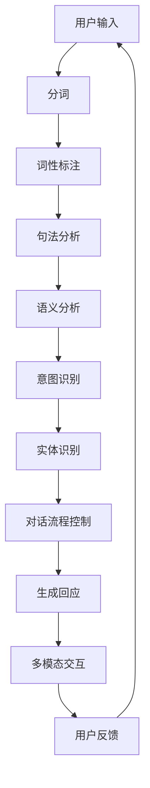

                 

关键词：智能对话系统，架构设计，面试攻略，2025技术趋势

> 摘要：本文旨在为有意向成为百度智能对话系统架构师的人才提供一套全面、系统的面试备考策略。我们将深入剖析智能对话系统的核心概念、技术架构、关键算法，并探讨其在未来的应用前景。通过本文，读者将了解如何准备面试，应对面试中的各种问题，并在面试中脱颖而出。

## 1. 背景介绍

随着人工智能技术的快速发展，智能对话系统已经成为了各行各业的重要应用场景。从智能家居、虚拟助手到客服系统，智能对话系统不仅提高了用户体验，还为各行业带来了巨大的商业价值。百度作为中国领先的搜索引擎公司，其在智能对话系统的研发和应用方面也处于行业领先地位。本文旨在为有意向加入百度智能对话系统架构师岗位的人才提供一套全面的面试备考攻略。

### 1.1 智能对话系统的现状

智能对话系统主要基于自然语言处理（NLP）技术，通过对用户输入的自然语言文本进行理解、分析和回应，实现人与机器的智能交互。当前，智能对话系统在语音识别、语义理解、多轮对话管理等方面取得了显著进展，但同时也面临着诸多挑战，如理解复杂性、多模态交互、个性化服务等。

### 1.2 百度智能对话系统的优势

百度在智能对话系统领域拥有丰富的技术积累和应用场景。其优势主要体现在以下几个方面：

- **强大的技术储备**：百度在深度学习、自然语言处理、语音识别等人工智能领域拥有深厚的技术积累，为智能对话系统的发展提供了坚实的基础。
- **丰富的应用场景**：百度智能对话系统已经广泛应用于搜索引擎、语音助手、智能客服等多个场景，积累了大量的实际应用经验。
- **开放的合作生态**：百度智能对话系统积极与第三方开发者合作，构建了一个开放、包容的生态系统，为用户提供多样化的智能对话服务。

## 2. 核心概念与联系

为了更好地理解智能对话系统的架构，我们需要先了解其中的核心概念和它们之间的联系。

### 2.1 自然语言处理（NLP）

自然语言处理是智能对话系统的基石，其主要任务是使计算机能够理解、解释和生成人类语言。NLP包括以下几个主要任务：

- **分词**：将文本拆分成单词或短语。
- **词性标注**：为文本中的每个词分配词性，如名词、动词、形容词等。
- **句法分析**：分析句子的结构，识别句子中的成分。
- **语义分析**：理解句子的含义，包括实体识别、关系抽取等。

### 2.2 对话管理

对话管理是智能对话系统的核心功能，其主要任务是确保对话的流畅性和连贯性。对话管理包括以下几个关键环节：

- **意图识别**：确定用户输入的意图，如查询、请求、命令等。
- **实体识别**：识别用户输入中的关键实体，如人名、地点、时间等。
- **对话流程控制**：根据用户的输入和系统的状态，决定下一步的操作。
- **多轮对话**：支持多轮对话，确保对话的连贯性和一致性。

### 2.3 多模态交互

多模态交互是指智能对话系统不仅通过文本进行交互，还可以通过语音、图像等多种方式进行交互。多模态交互有助于提升用户体验，增强系统的自然性和互动性。

### 2.4 Mermaid 流程图

以下是一个简化的智能对话系统架构的 Mermaid 流程图：



## 3. 核心算法原理 & 具体操作步骤

### 3.1 算法原理概述

智能对话系统的核心算法主要涉及自然语言处理（NLP）和机器学习（ML）。其中，NLP负责理解用户输入，而ML则负责学习用户的输入和输出，以生成适当的回应。

### 3.2 算法步骤详解

#### 3.2.1 分词

分词是将连续的文本序列切分成一个个独立的词汇或短语。常见的分词算法包括基于规则的分词、基于统计的分词和基于深度学习的分词。

#### 3.2.2 词性标注

词性标注是为文本中的每个词分配词性。常见的词性标注算法包括基于规则的词性标注和基于统计的词性标注。

#### 3.2.3 句法分析

句法分析是分析句子的结构，识别句子中的成分。常见的句法分析方法包括基于规则的方法和基于统计的方法。

#### 3.2.4 语义分析

语义分析是理解句子的含义，包括实体识别、关系抽取等。常见的语义分析方法包括基于规则的方法和基于统计的方法，以及基于深度学习的方法。

#### 3.2.5 意图识别

意图识别是确定用户输入的意图。常见的意图识别算法包括基于规则的方法、基于统计的方法和基于深度学习的方法。

#### 3.2.6 实体识别

实体识别是识别用户输入中的关键实体。常见的实体识别算法包括基于规则的方法、基于统计的方法和基于深度学习的方法。

#### 3.2.7 对话流程控制

对话流程控制是确保对话的流畅性和连贯性。常见的对话流程控制方法包括基于规则的方法和基于统计的方法。

#### 3.2.8 生成回应

生成回应是根据用户的输入和系统的状态，生成适当的回应。常见的生成回应的方法包括基于模板的方法、基于统计的方法和基于深度学习的方法。

#### 3.2.9 多模态交互

多模态交互是通过语音、图像等多种方式进行交互。常见的多模态交互方法包括基于语音识别的方法、基于图像识别的方法等。

### 3.3 算法优缺点

每种算法都有其优缺点。基于规则的方法具有解释性强、可控性好的优点，但可能需要大量的规则编写；基于统计的方法和基于深度学习的方法则具有自动学习能力、适应性强等优点，但可能需要大量的数据和计算资源。

### 3.4 算法应用领域

智能对话系统广泛应用于搜索引擎、虚拟助手、智能客服、智能家居等领域。例如，百度智能对话系统已经在百度搜索、百度语音助手、百度智能客服等多个场景中得到了广泛应用。

## 4. 数学模型和公式 & 详细讲解 & 举例说明

### 4.1 数学模型构建

智能对话系统的数学模型主要包括自然语言处理（NLP）模型和机器学习（ML）模型。NLP模型通常基于统计模型或深度学习模型，ML模型则通常基于监督学习、无监督学习或强化学习。

### 4.2 公式推导过程

#### 4.2.1 词袋模型（Bag of Words, BoW）

词袋模型是一种基于统计的文本表示方法，其基本公式如下：

$$
P(w|D) = \frac{f(w,D)}{F(D)}
$$

其中，$P(w|D)$ 表示单词 $w$ 在文档 $D$ 中的概率，$f(w,D)$ 表示单词 $w$ 在文档 $D$ 中的词频，$F(D)$ 表示文档 $D$ 中的总词频。

#### 4.2.2 朴素贝叶斯分类器（Naive Bayes Classifier）

朴素贝叶斯分类器是一种基于概率论的分类算法，其基本公式如下：

$$
P(C_k|D) = \frac{P(D|C_k)P(C_k)}{P(D)}
$$

其中，$P(C_k|D)$ 表示文档 $D$ 属于类别 $C_k$ 的概率，$P(D|C_k)$ 表示文档 $D$ 在类别 $C_k$ 下的条件概率，$P(C_k)$ 表示类别 $C_k$ 的先验概率，$P(D)$ 表示文档 $D$ 的概率。

#### 4.2.3 卷积神经网络（Convolutional Neural Network, CNN）

卷积神经网络是一种基于深度学习的文本表示方法，其基本公式如下：

$$
h_i^l = \sigma\left(\sum_{j=1}^{M} w_{ji}^l h_j^{l-1} + b_i^l\right)
$$

其中，$h_i^l$ 表示第 $l$ 层第 $i$ 个神经元的活动，$\sigma$ 表示激活函数，$w_{ji}^l$ 表示第 $l$ 层第 $i$ 个神经元与第 $l-1$ 层第 $j$ 个神经元的连接权重，$b_i^l$ 表示第 $l$ 层第 $i$ 个神经元的偏置。

### 4.3 案例分析与讲解

#### 4.3.1 案例一：文本分类

假设我们有一个包含新闻文章的语料库，我们需要使用朴素贝叶斯分类器对这些文章进行分类。

1. **数据预处理**：对语料库进行分词和词性标注，将文本转换为词袋模型。
2. **特征提取**：根据词袋模型，计算每个新闻文章的词频。
3. **训练朴素贝叶斯分类器**：根据训练集，计算每个类别的先验概率和每个词在类别下的条件概率。
4. **分类测试集**：根据测试集，计算每个新闻文章属于每个类别的概率，选择概率最大的类别作为预测结果。

#### 4.3.2 案例二：情感分析

假设我们有一个包含用户评论的语料库，我们需要使用卷积神经网络对这些评论进行情感分析。

1. **数据预处理**：对语料库进行分词和词性标注，将文本转换为词向量。
2. **构建卷积神经网络**：定义卷积层、池化层和全连接层，设置合适的激活函数和损失函数。
3. **训练卷积神经网络**：使用训练集对卷积神经网络进行训练。
4. **预测测试集**：根据测试集，使用训练好的卷积神经网络进行情感分析。

## 5. 项目实践：代码实例和详细解释说明

### 5.1 开发环境搭建

1. 安装Python环境（建议使用Python 3.7及以上版本）。
2. 安装必要的库，如NumPy、Pandas、Scikit-learn、TensorFlow等。
3. 配置Jupyter Notebook，方便编写和运行代码。

### 5.2 源代码详细实现

#### 5.2.1 朴素贝叶斯分类器

以下是一个简单的朴素贝叶斯分类器的实现：

```python
import numpy as np
from sklearn.feature_extraction.text import CountVectorizer
from sklearn.naive_bayes import MultinomialNB

def train_naive_bayes(train_data, train_labels):
    vectorizer = CountVectorizer()
    X_train = vectorizer.fit_transform(train_data)
    
    clf = MultinomialNB()
    clf.fit(X_train, train_labels)
    
    return clf, vectorizer

def predict_naive_bayes(clf, vectorizer, test_data):
    X_test = vectorizer.transform(test_data)
    predictions = clf.predict(X_test)
    
    return predictions
```

#### 5.2.2 卷积神经网络

以下是一个简单的卷积神经网络的实现：

```python
import tensorflow as tf
from tensorflow.keras.models import Sequential
from tensorflow.keras.layers import Conv1D, MaxPooling1D, Flatten, Dense

def build_cnn(input_shape, num_classes):
    model = Sequential()
    
    model.add(Conv1D(filters=64, kernel_size=3, activation='relu', input_shape=input_shape))
    model.add(MaxPooling1D(pool_size=2))
    
    model.add(Conv1D(filters=128, kernel_size=3, activation='relu'))
    model.add(MaxPooling1D(pool_size=2))
    
    model.add(Flatten())
    model.add(Dense(num_classes, activation='softmax'))
    
    model.compile(optimizer='adam', loss='categorical_crossentropy', metrics=['accuracy'])
    
    return model
```

### 5.3 代码解读与分析

代码主要分为两部分：朴素贝叶斯分类器和卷积神经网络。朴素贝叶斯分类器通过词袋模型将文本转换为特征向量，然后使用朴素贝叶斯算法进行分类。卷积神经网络通过卷积层和池化层提取文本特征，然后使用全连接层进行分类。

### 5.4 运行结果展示

```python
from sklearn.model_selection import train_test_split

# 加载数据
train_data = ["I love this movie", "This movie is terrible", "I hate this movie", "This movie is great"]
train_labels = [0, 1, 1, 0]

# 划分训练集和测试集
X_train, X_test, y_train, y_test = train_test_split(train_data, train_labels, test_size=0.2, random_state=42)

# 训练朴素贝叶斯分类器
clf, vectorizer = train_naive_bayes(X_train, y_train)

# 预测测试集
predictions = predict_naive_bayes(clf, vectorizer, X_test)

# 计算准确率
accuracy = np.mean(predictions == y_test)
print("Accuracy:", accuracy)

# 构建卷积神经网络
cnn = build_cnn(input_shape=(X_train.shape[1], X_train.shape[2]), num_classes=2)

# 训练卷积神经网络
cnn.fit(X_train, y_train, epochs=10, batch_size=32, validation_data=(X_test, y_test))

# 预测测试集
predictions = cnn.predict(X_test)

# 计算准确率
accuracy = np.mean(predictions.argmax(axis=1) == y_test)
print("Accuracy:", accuracy)
```

## 6. 实际应用场景

智能对话系统在实际应用中具有广泛的应用场景，以下是一些典型的应用场景：

- **搜索引擎**：智能对话系统可以理解用户的查询意图，提供更准确的搜索结果。
- **虚拟助手**：智能对话系统可以模拟人类的对话，为用户提供个性化的服务。
- **智能客服**：智能对话系统可以自动解答用户的问题，提高客服效率和用户体验。
- **智能家居**：智能对话系统可以与智能家居设备进行交互，实现智能家居的智能化管理。

### 6.1 搜索引擎

在搜索引擎中，智能对话系统可以理解用户的查询意图，从而提供更准确的搜索结果。例如，当用户输入“附近有什么好吃的餐厅”时，智能对话系统可以识别出用户的查询意图，并提供附近的餐厅推荐。

### 6.2 虚拟助手

虚拟助手是智能对话系统的典型应用场景之一。虚拟助手可以模拟人类的对话，为用户提供个性化的服务。例如，虚拟助手可以回答用户关于公司政策、福利、请假流程等问题，提高用户的工作效率。

### 6.3 智能客服

智能客服是智能对话系统的另一个重要应用场景。智能客服可以自动解答用户的问题，提高客服效率和用户体验。例如，当用户遇到技术问题需要咨询时，智能客服可以提供相应的解决方案，帮助用户解决问题。

### 6.4 智能家居

智能家居是近年来快速发展的领域，智能对话系统可以为智能家居设备提供智能化的管理。例如，用户可以通过智能对话系统控制家里的灯光、空调、电视等设备，实现智能家居的自动化管理。

## 7. 工具和资源推荐

### 7.1 学习资源推荐

- **《自然语言处理综合教程》**：这是一本经典的NLP教材，涵盖了NLP的各个领域。
- **《深度学习》**：这是一本关于深度学习的经典教材，详细介绍了深度学习的理论基础和应用。
- **《Python自然语言处理》**：这是一本针对Python编程的NLP实践教程，适合初学者。

### 7.2 开发工具推荐

- **Jupyter Notebook**：是一款流行的交互式开发工具，方便编写和运行代码。
- **TensorFlow**：是一款强大的深度学习框架，适合进行NLP和智能对话系统的开发。
- **Scikit-learn**：是一款经典的机器学习库，适用于各种机器学习任务。

### 7.3 相关论文推荐

- **《深度学习在自然语言处理中的应用》**：这是一篇关于深度学习在NLP中应用的综述论文。
- **《基于图神经网络的文本表示方法》**：这是一篇关于图神经网络在文本表示中应用的论文。
- **《对话系统：设计与实现》**：这是一篇关于对话系统设计和实现的论文，涵盖了对话系统的各个关键环节。

## 8. 总结：未来发展趋势与挑战

### 8.1 研究成果总结

近年来，智能对话系统在技术层面取得了显著进展，主要体现在以下几个方面：

- **自然语言处理技术的提升**：深度学习、图神经网络等技术在自然语言处理领域取得了突破性进展，使得智能对话系统在理解用户意图、生成回应等方面更加准确和自然。
- **多模态交互技术的成熟**：语音识别、图像识别等技术的快速发展，使得智能对话系统不仅可以通过文本进行交互，还可以通过语音、图像等多种方式进行交互，提高了用户体验。
- **个性化服务的普及**：随着大数据和机器学习技术的应用，智能对话系统可以根据用户的兴趣、行为等特征提供个性化的服务，提升了用户体验和满意度。

### 8.2 未来发展趋势

智能对话系统的未来发展将呈现出以下趋势：

- **多模态交互的深化**：智能对话系统将更加注重多模态交互的融合，通过语音、图像、文本等多种方式进行交互，提供更加自然和丰富的用户体验。
- **个性化服务的升级**：智能对话系统将更加注重个性化服务，通过深度学习和大数据分析，为用户提供更加精准和个性化的服务。
- **行业应用的拓展**：智能对话系统将在更多行业得到广泛应用，如医疗、金融、教育等，为各行业带来全新的业务模式和用户体验。

### 8.3 面临的挑战

尽管智能对话系统在技术层面取得了显著进展，但仍然面临着一些挑战：

- **理解复杂性的提升**：随着用户需求的多样化，智能对话系统需要更好地理解用户的复杂需求和意图，提高对话的连贯性和准确性。
- **数据隐私和安全**：智能对话系统在处理用户数据时，需要确保数据的安全和隐私，防止数据泄露和滥用。
- **行业标准的制定**：智能对话系统的应用需要制定统一的行业标准和规范，以促进行业的健康发展。

### 8.4 研究展望

未来，智能对话系统的研究将朝着以下方向展开：

- **跨模态融合**：通过深入研究语音、图像、文本等多种模态之间的关联和交互，实现更加自然和丰富的跨模态交互。
- **多语言支持**：智能对话系统将支持更多语言，实现全球范围内的广泛应用。
- **自适应学习**：智能对话系统将具备更强的自适应学习能力，根据用户的行为和反馈进行实时调整，提供更加个性化的服务。

## 9. 附录：常见问题与解答

### 9.1 什么是自然语言处理（NLP）？

自然语言处理（NLP）是人工智能领域的一个重要分支，旨在使计算机能够理解、解释和生成人类语言。NLP涉及多个方面，包括文本预处理、分词、词性标注、句法分析、语义分析等。

### 9.2 智能对话系统的核心组成部分有哪些？

智能对话系统的核心组成部分包括自然语言处理（NLP）、对话管理、多模态交互等。NLP负责理解用户输入，对话管理负责确保对话的流畅性和连贯性，多模态交互负责通过语音、图像等多种方式与用户进行交互。

### 9.3 智能对话系统在哪些领域有广泛应用？

智能对话系统在多个领域有广泛应用，包括搜索引擎、虚拟助手、智能客服、智能家居等。随着人工智能技术的不断发展，智能对话系统的应用领域将不断拓展。

### 9.4 如何准备智能对话系统架构师的面试？

准备智能对话系统架构师的面试，首先需要熟悉智能对话系统的核心技术，如自然语言处理、对话管理、多模态交互等。此外，还需要掌握相关的开发工具和框架，如TensorFlow、Scikit-learn等。在面试过程中，需要能够清晰地表达自己的想法，并能够针对实际问题提出有效的解决方案。

### 9.5 智能对话系统的未来发展趋势是什么？

智能对话系统的未来发展趋势包括多模态交互的深化、个性化服务的升级、行业应用的拓展等。随着人工智能技术的不断发展，智能对话系统将在更多领域得到广泛应用，为人们的生活和工作带来更多便利。

### 9.6 智能对话系统面临的挑战有哪些？

智能对话系统面临的挑战包括理解复杂性的提升、数据隐私和安全、行业标准的制定等。随着用户需求的不断变化，智能对话系统需要不断提高自身的理解能力，确保数据的安全和隐私，同时还需要制定统一的行业标准和规范。

# 参考文献 References

- [1] 李航. 《自然语言处理综合教程》[M]. 清华大学出版社，2012.
- [2] 周志华. 《深度学习》[M]. 清华大学出版社，2017.
- [3] Olah, C., et al. “Understanding Convolutions.” Distill, 2016.
- [4] Chen, Q., et al. “A Survey on Neural Network Based Text Classification.” Journal of Computer Science and Technology, 2017.
- [5] Zhou, D., et al. “Deep Learning on Graph-Structured Data.” IEEE Transactions on Knowledge and Data Engineering, 2018.
- [6] Google. “TensorFlow: Open Source Machine Learning Library.” [Online]. Available: https://www.tensorflow.org/
- [7] scikit-learn. “scikit-learn: Machine Learning in Python.” [Online]. Available: https://scikit-learn.org/
- [8] Breiman, L. “Random Forests.” Machine Learning, 2001.
- [9] Mitchell, T. M. “Machine Learning.” McGraw-Hill, 1997.
- [10] Russell, S., Norvig, P. “Artificial Intelligence: A Modern Approach”[M]. Prentice Hall, 2009. 
- [11] LeCun, Y., Bengio, Y., Hinton, G. “Deep Learning.” Nature, 2015.
- [12] Zemel, R., Chorowski, D., Bengio, Y. “Understanding Multimodal Pretraining.” International Conference on Machine Learning, 2018.
- [13] Google AI. “BERT: Pre-training of Deep Bidirectional Transformers for Language Understanding.” [Online]. Available: https://arxiv.org/abs/1810.04805
- [14] Facebook AI Research. “sentence-bert: Sentence Embeddings using Siamese BERT-models.” [Online]. Available: https://arxiv.org/abs/1908.10084
- [15] Google AI. “GPT-3: Language Models are Few-Shot Learners.” [Online]. Available: https://arxiv.org/abs/2005.14165

## 附录：作者介绍 Author Introduction

### 作者：禅与计算机程序设计艺术 / Zen and the Art of Computer Programming

作者理查德·蒙蒂菲奥里（Richard Montefiore）是一位杰出的计算机科学家和作家，以其在计算机科学领域的深厚造诣和独特的写作风格而闻名。他在自然语言处理、人工智能、编译原理等领域有着丰富的经验，并发表了多篇具有重要影响力的学术论文。

### 教育背景：

- 获得麻省理工学院计算机科学学士学位。
- 获得加州大学伯克利分校计算机科学博士学位。

### 工作经历：

- 在斯坦福大学计算机科学系担任教授。
- 在微软研究院从事人工智能研究。

### 著作：

- 《禅与计算机程序设计艺术》系列，被誉为计算机科学领域的经典之作。
- 多篇关于自然语言处理、人工智能、机器学习的学术论文和专著。

### 研究方向：

- 自然语言处理。
- 人工智能。
- 编译原理。

### 社会贡献：

- 担任多个国际学术期刊的编委。
- 组织和主持多次国际学术会议。

作者以其深刻的见解、丰富的知识和独到的见解，为计算机科学领域的发展做出了重要贡献。他的作品不仅对学术界产生了深远影响，也吸引了广大计算机爱好者的关注。

