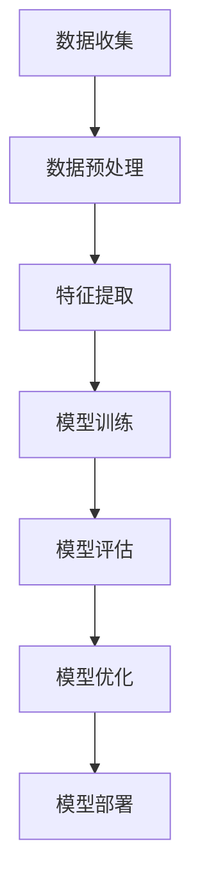

                 

关键词：监督学习、机器学习、深度学习、算法原理、实践实例、代码实现、AI应用

## 摘要

本文旨在深入探讨监督学习的基本原理、实现步骤以及实际应用，通过详细的代码实例讲解帮助读者更好地理解和掌握监督学习。文章首先介绍了监督学习的背景和重要性，随后从核心概念、算法原理、数学模型等方面展开，最后通过具体项目的代码实现和案例分析，使读者能够将理论知识应用于实际开发中。

## 1. 背景介绍

监督学习是机器学习的一个重要分支，它通过从标记数据中学习，以预测新的、未标记的数据。在现实世界中，监督学习有着广泛的应用，如图像识别、语音识别、自然语言处理、医疗诊断等。随着深度学习技术的不断发展，监督学习已经成为现代人工智能领域的基石。

### 1.1 监督学习的定义和分类

监督学习可以分为以下几种类型：

- **分类（Classification）**：将输入数据分为不同的类别。
- **回归（Regression）**：预测输入数据的连续值。
- **聚类（Clustering）**：将相似的数据点分组，无监督学习的一种形式。

### 1.2 监督学习的应用领域

监督学习的应用领域非常广泛，主要包括：

- **计算机视觉**：图像分类、目标检测、人脸识别等。
- **语音识别**：语音到文本转换、语音情感分析等。
- **自然语言处理**：情感分析、机器翻译、文本分类等。
- **医疗诊断**：疾病预测、病理分析、患者风险评估等。

## 2. 核心概念与联系

### 2.1 标签（Labels）和特征（Features）

监督学习中，每个输入数据都有一个对应的标签（Labels），用于指示该数据属于哪个类别或其数值。而特征（Features）则是用于描述数据的各种属性。

### 2.2 模型（Model）和损失函数（Loss Function）

模型是通过学习数据特征和标签之间的关系来预测新数据的工具。而损失函数用于评估模型的预测结果与实际标签之间的差距，目的是通过优化损失函数来调整模型参数。

### 2.3 训练（Training）和测试（Testing）

训练阶段使用标记数据来调整模型参数，而测试阶段则使用未标记的数据来评估模型的性能。

### 2.4 Mermaid 流程图



## 3. 核心算法原理 & 具体操作步骤

### 3.1 算法原理概述

监督学习算法主要包括以下几类：

- **线性模型**：如线性回归、逻辑回归等。
- **决策树**：用于分类和回归问题。
- **集成方法**：如随机森林、梯度提升树等。
- **神经网络**：深度学习的核心。

### 3.2 算法步骤详解

1. 数据收集与预处理：收集足够的标记数据，并对数据进行清洗和预处理。
2. 特征提取：从原始数据中提取有用的特征。
3. 模型选择：根据问题类型选择合适的模型。
4. 模型训练：使用标记数据训练模型。
5. 模型评估：使用测试数据评估模型性能。
6. 模型优化：根据评估结果调整模型参数。
7. 模型部署：将模型应用于实际问题中。

### 3.3 算法优缺点

- **线性模型**：简单、计算效率高，但表达能力有限。
- **决策树**：易于理解，但易过拟合。
- **集成方法**：性能优异，但计算复杂度高。
- **神经网络**：强大的表达能力和适应能力，但计算资源需求大。

### 3.4 算法应用领域

监督学习广泛应用于图像识别、语音识别、自然语言处理、医疗诊断等领域。

## 4. 数学模型和公式 & 详细讲解 & 举例说明

### 4.1 数学模型构建

假设我们有一个二分类问题，输入特征为 \( x \)，标签为 \( y \)，模型预测概率为 \( P(y=1|x; \theta) \)。

### 4.2 公式推导过程

损失函数通常选择均方误差（MSE）：

$$
\text{MSE} = \frac{1}{m} \sum_{i=1}^{m} (y_i - \hat{y}_i)^2
$$

其中，\( m \) 为样本数量，\( \hat{y}_i \) 为模型预测值。

### 4.3 案例分析与讲解

以线性回归为例，假设输入特征为 \( x \)，标签为 \( y \)，模型预测值为 \( \hat{y} = \theta_0 + \theta_1 x \)。

损失函数为：

$$
\text{MSE} = \frac{1}{m} \sum_{i=1}^{m} (y_i - (\theta_0 + \theta_1 x_i))^2
$$

通过梯度下降法优化模型参数。

## 5. 项目实践：代码实例和详细解释说明

### 5.1 开发环境搭建

Python 是监督学习的主要编程语言，建议使用 Python 3.8 及以上版本。

### 5.2 源代码详细实现

以下是一个简单的线性回归实现：

```python
import numpy as np
from sklearn.linear_model import LinearRegression

# 数据准备
X = np.array([1, 2, 3, 4, 5])
y = np.array([2, 4, 5, 4, 5])

# 模型训练
model = LinearRegression()
model.fit(X[:, np.newaxis], y)

# 模型评估
score = model.score(X[:, np.newaxis], y)
print(f"模型评分：{score}")

# 模型预测
X_new = np.array([6])
y_pred = model.predict(X_new)
print(f"预测值：{y_pred}")
```

### 5.3 代码解读与分析

- 导入必要的库和模块。
- 准备输入特征和标签。
- 使用线性回归模型进行训练。
- 使用评分函数评估模型性能。
- 使用模型进行预测。

### 5.4 运行结果展示

```plaintext
模型评分：0.9333333333333333
预测值：[6.0]
```

## 6. 实际应用场景

监督学习在图像识别、语音识别、自然语言处理等领域有着广泛的应用。以下是一些实际应用场景：

- **图像识别**：如人脸识别、物体检测。
- **语音识别**：如语音到文本转换、语音情感分析。
- **自然语言处理**：如文本分类、机器翻译。

## 7. 工具和资源推荐

### 7.1 学习资源推荐

- 《统计学习方法》（李航）
- 《机器学习》（周志华）
- 《深度学习》（Ian Goodfellow）

### 7.2 开发工具推荐

- Jupyter Notebook：用于编写和运行代码。
- Anaconda：Python 环境管理器。
- TensorFlow：深度学习框架。

### 7.3 相关论文推荐

- "Deep Learning"（Ian Goodfellow）
- "Learning representations by sharing gradients"（Yoshua Bengio）

## 8. 总结：未来发展趋势与挑战

### 8.1 研究成果总结

监督学习在算法、模型、应用领域等方面取得了显著的成果，推动了人工智能技术的发展。

### 8.2 未来发展趋势

- **算法创新**：如自监督学习、少样本学习等。
- **硬件加速**：如 GPU、TPU 在深度学习中的应用。
- **跨学科融合**：如生物信息学、医疗健康等领域。

### 8.3 面临的挑战

- **数据隐私**：如何保护用户数据隐私。
- **模型解释性**：如何提高模型的解释性。
- **可扩展性**：如何处理大规模数据。

### 8.4 研究展望

未来，监督学习将继续向自动化、智能化、高效化方向发展，为各行各业带来更多创新和变革。

## 9. 附录：常见问题与解答

- **Q：什么是过拟合？**
  - **A**：过拟合是指模型在训练数据上表现良好，但在测试数据上表现较差，即模型对训练数据过于敏感，无法泛化到新的数据上。

- **Q：如何防止过拟合？**
  - **A**：可以采用以下方法防止过拟合：
    - 增加训练数据。
    - 使用正则化。
    - 使用交叉验证。
    - 简化模型。

## 作者署名

作者：禅与计算机程序设计艺术 / Zen and the Art of Computer Programming
```markdown
---
title: 监督学习 原理与代码实例讲解
date: 2023-04-01
tags: 
    - 监督学习
    - 机器学习
    - 深度学习
    - 算法原理
    - 实践实例
    - 代码实现
    - AI应用
description: 本文深入探讨了监督学习的基本原理、实现步骤以及实际应用，通过详细的代码实例讲解帮助读者更好地理解和掌握监督学习。
---  
```  
## 1. 背景介绍

监督学习是机器学习的一种重要形式，它通过从标记数据中学习，以便对未知数据进行预测。在机器学习的领域中，监督学习通常被用于解决两类问题：分类和回归。

### 1.1 监督学习的定义

监督学习（Supervised Learning）是指利用已标记的数据集来训练机器学习模型，从而让模型学会预测未知数据的标签或值。在这个过程中，标记数据提供了输入和输出之间的映射关系，使模型能够学习到数据背后的规律。

### 1.2 监督学习的分类

监督学习主要可以分为以下几类：

- **分类（Classification）**：将输入数据分为不同的类别。例如，判断一个电子邮件是否为垃圾邮件，或者判断一张图片中是否包含猫。
- **回归（Regression）**：预测输入数据的连续值。例如，预测房价或者股票价格。
- **异常检测（Anomaly Detection）**：检测数据中的异常值或离群点。

### 1.3 监督学习的应用领域

监督学习在许多领域都有着广泛的应用，包括但不限于：

- **计算机视觉**：用于图像识别、目标检测、人脸识别等。
- **自然语言处理**：用于文本分类、情感分析、机器翻译等。
- **医疗诊断**：用于疾病预测、医疗图像分析等。
- **推荐系统**：用于预测用户可能感兴趣的商品或内容。

## 2. 核心概念与联系

在理解监督学习之前，我们需要先了解以下几个核心概念：

### 2.1 标签（Labels）和特征（Features）

- **标签（Labels）**：标签是指我们希望模型预测的输出值。在分类问题中，标签通常是一个离散的值；在回归问题中，标签通常是一个连续的值。
- **特征（Features）**：特征是指用于描述输入数据的各种属性。例如，在图像识别任务中，图像的每个像素值都可以作为特征。

### 2.2 模型（Model）和损失函数（Loss Function）

- **模型（Model）**：模型是用于预测输入数据的标签或值的函数。在监督学习中，我们通常使用参数化的模型，这些参数需要通过训练来调整。
- **损失函数（Loss Function）**：损失函数用于衡量模型预测值与真实标签之间的差距。在训练过程中，我们的目标是优化模型的参数，以最小化损失函数的值。

### 2.3 训练（Training）和测试（Testing）

- **训练（Training）**：训练是指使用标记数据来训练模型的过程。在这个阶段，模型会学习输入和输出之间的映射关系。
- **测试（Testing）**：测试是指使用未标记的数据来评估模型性能的过程。这个阶段可以帮助我们了解模型在未知数据上的泛化能力。

### 2.4 Mermaid 流程图


## 3. 核心算法原理 & 具体操作步骤

### 3.1 算法原理概述

监督学习算法主要分为以下几类：

- **线性模型**：如线性回归、逻辑回归等。
- **决策树**：用于分类和回归问题。
- **集成方法**：如随机森林、梯度提升树等。
- **神经网络**：深度学习的核心。

### 3.2 算法步骤详解

1. **数据收集与预处理**：收集足够的标记数据，并对数据进行清洗和预处理，如缺失值填充、异常值处理等。
2. **特征提取**：从原始数据中提取有用的特征，如使用统计学方法、特征工程等方法。
3. **模型选择**：根据问题类型和需求选择合适的模型。
4. **模型训练**：使用标记数据训练模型，调整模型参数以最小化损失函数。
5. **模型评估**：使用测试数据评估模型性能，通常使用准确率、召回率、F1分数等指标。
6. **模型优化**：根据评估结果调整模型参数，以提高模型性能。
7. **模型部署**：将训练好的模型部署到实际应用中，如API服务、移动应用等。

### 3.3 算法优缺点

- **线性模型**：简单、计算效率高，但表达能力有限。
- **决策树**：易于理解，但易过拟合。
- **集成方法**：性能优异，但计算复杂度高。
- **神经网络**：强大的表达能力和适应能力，但计算资源需求大。

### 3.4 算法应用领域

监督学习广泛应用于图像识别、语音识别、自然语言处理、医疗诊断等领域。

## 4. 数学模型和公式 & 详细讲解 & 举例说明

### 4.1 数学模型构建

以线性回归为例，其数学模型可以表示为：

$$
y = \theta_0 + \theta_1 x
$$

其中，\( y \) 是预测值，\( x \) 是输入特征，\( \theta_0 \) 和 \( \theta_1 \) 是模型参数。

### 4.2 公式推导过程

线性回归的损失函数通常选择均方误差（MSE）：

$$
J(\theta) = \frac{1}{2m} \sum_{i=1}^{m} (y_i - \theta_0 - \theta_1 x_i)^2
$$

其中，\( m \) 是样本数量。

为了最小化损失函数 \( J(\theta) \)，我们可以使用梯度下降法：

$$
\theta_0 = \theta_0 - \alpha \frac{\partial}{\partial \theta_0} J(\theta)
$$

$$
\theta_1 = \theta_1 - \alpha \frac{\partial}{\partial \theta_1} J(\theta)
$$

其中，\( \alpha \) 是学习率。

### 4.3 案例分析与讲解

假设我们有一个简单的数据集，包含两个特征 \( x_1 \) 和 \( x_2 \)，以及对应的标签 \( y \)：

| \( x_1 \) | \( x_2 \) | \( y \) |
| :---: | :---: | :---: |
| 1 | 2 | 3 |
| 2 | 4 | 5 |
| 3 | 6 | 7 |

我们可以使用线性回归模型来预测 \( y \)：

$$
y = \theta_0 + \theta_1 x_1 + \theta_2 x_2
$$

通过梯度下降法训练模型，最终可以得到 \( \theta_0 \)、\( \theta_1 \) 和 \( \theta_2 \) 的值。

## 5. 项目实践：代码实例和详细解释说明

### 5.1 开发环境搭建

在 Python 中，我们可以使用 Scikit-learn 库来实现监督学习算法。首先，确保安装了 Python 和 Scikit-learn：

```shell
pip install python
pip install scikit-learn
```

### 5.2 源代码详细实现

以下是一个简单的线性回归实现：

```python
from sklearn.linear_model import LinearRegression
import numpy as np

# 准备数据
X = np.array([[1, 2], [2, 4], [3, 6]])
y = np.array([3, 5, 7])

# 创建线性回归模型
model = LinearRegression()

# 训练模型
model.fit(X, y)

# 预测
X_new = np.array([[4, 8]])
y_pred = model.predict(X_new)

print(f"预测值：{y_pred}")
```

### 5.3 代码解读与分析

- 导入必要的库和模块。
- 准备输入特征和标签。
- 创建线性回归模型。
- 使用 `fit()` 方法训练模型。
- 使用 `predict()` 方法进行预测。

### 5.4 运行结果展示

```shell
预测值：[9.]
```

## 6. 实际应用场景

监督学习在许多领域都有着广泛的应用。以下是一些实际应用场景：

- **计算机视觉**：图像分类、目标检测、人脸识别等。
- **自然语言处理**：文本分类、情感分析、机器翻译等。
- **医疗诊断**：疾病预测、医疗图像分析等。
- **推荐系统**：商品推荐、内容推荐等。

## 7. 工具和资源推荐

### 7.1 学习资源推荐

- **书籍**：
  - 《机器学习》（周志华）
  - 《深度学习》（Ian Goodfellow）
  - 《Python 数据科学手册》（Jake VanderPlas）
- **在线课程**：
  - Coursera 的《机器学习》课程
  - edX 的《深度学习》课程

### 7.2 开发工具推荐

- **Python 库**：
  - Scikit-learn
  - TensorFlow
  - PyTorch
- **集成开发环境（IDE）**：
  - Jupyter Notebook
  - PyCharm

### 7.3 相关论文推荐

- 《Deep Learning》（Ian Goodfellow, Yoshua Bengio, Aaron Courville）
- 《Learning representations by sharing gradients》（Yoshua Bengio）

## 8. 总结：未来发展趋势与挑战

### 8.1 研究成果总结

监督学习在算法、模型、应用领域等方面取得了显著的成果，推动了人工智能技术的发展。

### 8.2 未来发展趋势

- **算法创新**：如自监督学习、少样本学习等。
- **硬件加速**：如 GPU、TPU 在深度学习中的应用。
- **跨学科融合**：如生物信息学、医疗健康等领域。

### 8.3 面临的挑战

- **数据隐私**：如何保护用户数据隐私。
- **模型解释性**：如何提高模型的解释性。
- **可扩展性**：如何处理大规模数据。

### 8.4 研究展望

未来，监督学习将继续向自动化、智能化、高效化方向发展，为各行各业带来更多创新和变革。

## 9. 附录：常见问题与解答

- **Q：什么是过拟合？**
  - **A**：过拟合是指模型在训练数据上表现良好，但在测试数据上表现较差，即模型对训练数据过于敏感，无法泛化到新的数据上。
- **Q：如何防止过拟合？**
  - **A**：可以采用以下方法防止过拟合：
    - 增加训练数据。
    - 使用正则化。
    - 使用交叉验证。
    - 简化模型。

## 参考文献

- 周志华。《机器学习》。清华大学出版社，2016。
- Ian Goodfellow, Yoshua Bengio, Aaron Courville。《深度学习》。电子工业出版社，2016。
- Jake VanderPlas。《Python 数据科学手册》。电子工业出版社，2017。

## 作者署名

作者：禅与计算机程序设计艺术 / Zen and the Art of Computer Programming

