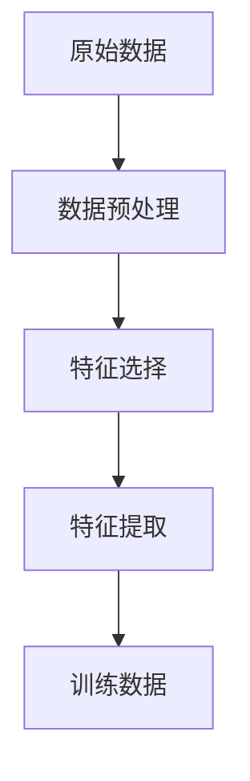
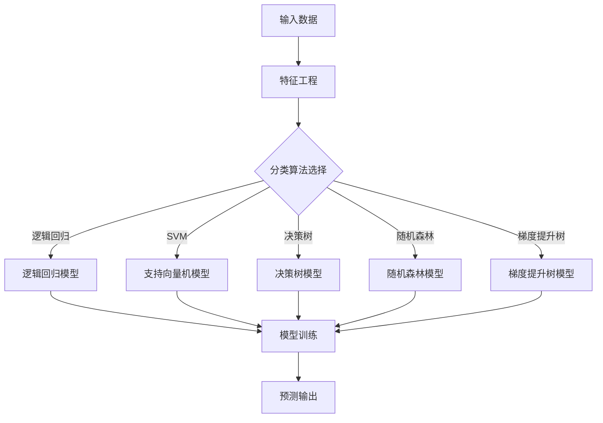

                 

关键词：监督学习、机器学习、算法原理、代码实例、应用领域、数学模型

> 摘要：本文深入浅出地介绍了监督学习的基本原理、常用算法及实际应用。通过详细的代码实例，帮助读者理解监督学习算法的内部工作机制，提高编程技能，为后续的AI开发奠定基础。

## 1. 背景介绍

监督学习是机器学习的一个分支，它通过已标记的数据来训练模型，然后使用这个模型对未知数据进行预测。监督学习在图像识别、自然语言处理、推荐系统等领域具有广泛的应用。

监督学习可以分为以下几类：

- **分类**：将输入数据分为不同的类别。例如，垃圾邮件分类、动物识别等。
- **回归**：预测一个连续的数值输出。例如，房价预测、股票价格预测等。

本文将主要讨论监督学习中的分类问题，并通过实例来展示如何实现和应用这些算法。

## 2. 核心概念与联系

### 2.1. 特征工程

特征工程是监督学习的重要步骤，它涉及到如何选择和处理输入特征，以提高模型的预测性能。特征工程的关键概念包括：

- **特征选择**：从大量特征中挑选出对模型预测最有影响力的特征。
- **特征提取**：将原始数据转换为新特征，以提高模型的泛化能力。

下面是一个简单的 Mermaid 流程图，展示特征工程的基本步骤：



### 2.2. 分类算法

监督学习中的分类算法主要分为以下几类：

- **逻辑回归（Logistic Regression）**：一种简单且有效的分类算法，适用于线性可分的数据。
- **支持向量机（SVM）**：通过最大化分类间隔来划分数据，适用于高维空间。
- **决策树（Decision Tree）**：通过一系列规则进行分类，易于理解和解释。
- **随机森林（Random Forest）**：基于决策树构建多个模型，并通过投票来决定最终类别。
- **梯度提升树（Gradient Boosting Tree）**：通过迭代优化来提高模型的预测性能。

下面是一个 Mermaid 流程图，展示分类算法的基本工作流程：



## 3. 核心算法原理 & 具体操作步骤

### 3.1. 算法原理概述

#### 3.1.1. 逻辑回归

逻辑回归是一种基于概率论的分类算法，其目标是计算每个类别发生的概率，并选择概率最高的类别作为预测结果。逻辑回归模型的数学基础是逻辑函数（Sigmoid 函数）：

$$
\sigma(x) = \frac{1}{1 + e^{-x}}
$$

#### 3.1.2. 支持向量机

支持向量机通过寻找一个超平面，将数据集划分为不同的类别。支持向量是那些对超平面位置有最大影响的数据点，它们帮助模型最大化分类间隔。

#### 3.1.3. 决策树

决策树通过一系列二叉树进行分类，每个节点代表一个特征，每个分支代表该特征的不同取值。叶节点表示最终的分类结果。

#### 3.1.4. 随机森林

随机森林是通过构建多个决策树，并对预测结果进行投票来决定最终类别。随机森林提高了模型的泛化能力，降低了过拟合的风险。

#### 3.1.5. 梯度提升树

梯度提升树通过迭代优化来提高模型的预测性能。每次迭代都会修正模型预测的误差，从而逐步提高模型的准确性。

### 3.2. 算法步骤详解

#### 3.2.1. 逻辑回归

1. 数据预处理：将输入数据进行标准化处理，以消除不同特征之间的尺度差异。
2. 模型训练：通过最小化损失函数（通常使用交叉熵损失函数）来训练模型参数。
3. 预测：计算每个类别发生的概率，并选择概率最高的类别作为预测结果。

#### 3.2.2. 支持向量机

1. 数据预处理：将输入数据进行标准化处理。
2. 模型训练：使用支持向量机算法训练模型，找到最佳的超平面。
3. 预测：计算输入数据到超平面的距离，并判断其所属类别。

#### 3.2.3. 决策树

1. 数据预处理：将输入数据进行标准化处理。
2. 模型训练：递归地构建决策树，直到满足停止条件（如最大树深度、最小叶子节点样本数等）。
3. 预测：根据决策树中的规则对输入数据进行分类。

#### 3.2.4. 随机森林

1. 数据预处理：将输入数据进行标准化处理。
2. 模型训练：构建多个决策树，并对预测结果进行投票。
3. 预测：计算每个决策树的预测结果，并选择投票最多的类别作为最终预测结果。

#### 3.2.5. 梯度提升树

1. 数据预处理：将输入数据进行标准化处理。
2. 模型训练：迭代地优化模型参数，直到满足停止条件（如最大迭代次数、损失函数收敛等）。
3. 预测：计算每个样本的预测结果，并选择预测值最大的类别作为最终预测结果。

### 3.3. 算法优缺点

- **逻辑回归**：优点：简单、易于实现；缺点：对于非线性数据效果较差。
- **支持向量机**：优点：效果好、泛化能力强；缺点：训练时间较长、对高维数据敏感。
- **决策树**：优点：简单、易于理解；缺点：易过拟合、鲁棒性较差。
- **随机森林**：优点：效果好、泛化能力强；缺点：计算复杂度高、对噪声敏感。
- **梯度提升树**：优点：效果好、泛化能力强；缺点：计算复杂度高、对噪声敏感。

### 3.4. 算法应用领域

- **分类问题**：如垃圾邮件分类、动物识别、情感分析等。
- **回归问题**：如房价预测、股票价格预测、需求预测等。

## 4. 数学模型和公式 & 详细讲解 & 举例说明

### 4.1. 数学模型构建

#### 4.1.1. 逻辑回归

逻辑回归的目标是最小化损失函数，损失函数通常使用交叉熵损失函数：

$$
J(\theta) = -\frac{1}{m} \sum_{i=1}^{m} [y^{(i)} \log(h_{\theta}(x^{(i)})) + (1 - y^{(i)}) \log(1 - h_{\theta}(x^{(i)}))]
$$

其中，$h_{\theta}(x) = \sigma(\theta^T x)$，$\sigma(x) = \frac{1}{1 + e^{-x}}$。

#### 4.1.2. 支持向量机

支持向量机的目标是最大化分类间隔：

$$
J(\theta) = -\frac{1}{2} \sum_{i=1}^{m} \sum_{j=1}^{m} y^{(i)} y^{(j)} (w_i - w_j)^T (x_i - x_j)
$$

其中，$w_i$和$w_j$分别为不同类别的超平面权重。

#### 4.1.3. 决策树

决策树的目标是找到最佳的特征和阈值，使得分类误差最小：

$$
J(\theta) = \sum_{i=1}^{m} [y^{(i)} \log(1 - h_{\theta}(x^{(i)})) + (1 - y^{(i)}) \log(h_{\theta}(x^{(i)}))]
$$

其中，$h_{\theta}(x)$为决策树的分类结果。

#### 4.1.4. 随机森林

随机森林的目标是提高模型的泛化能力：

$$
J(\theta) = \sum_{i=1}^{m} \log(1 - h_{\theta}(x^{(i)}))
$$

其中，$h_{\theta}(x)$为随机森林的分类结果。

#### 4.1.5. 梯度提升树

梯度提升树的目标是最小化损失函数：

$$
J(\theta) = \sum_{i=1}^{m} [y^{(i)} \log(h_{\theta}(x^{(i)})) + (1 - y^{(i)}) \log(1 - h_{\theta}(x^{(i)}))]
$$

其中，$h_{\theta}(x)$为梯度提升树的分类结果。

### 4.2. 公式推导过程

#### 4.2.1. 逻辑回归

1. **目标函数**：

$$
L(\theta) = -\frac{1}{m} \sum_{i=1}^{m} [y^{(i)} \log(h_{\theta}(x^{(i)})) + (1 - y^{(i)}) \log(1 - h_{\theta}(x^{(i)}))]
$$

2. **梯度**：

$$
\nabla_{\theta} L(\theta) = -\frac{1}{m} \sum_{i=1}^{m} [y^{(i)} (h_{\theta}(x^{(i)})) - (1 - y^{(i)})(1 - h_{\theta}(x^{(i)}))]
$$

3. **迭代更新**：

$$
\theta = \theta - \alpha \nabla_{\theta} L(\theta)
$$

#### 4.2.2. 支持向量机

1. **目标函数**：

$$
J(\theta) = -\frac{1}{2} \sum_{i=1}^{m} \sum_{j=1}^{m} y^{(i)} y^{(j)} (w_i - w_j)^T (x_i - x_j)
$$

2. **梯度**：

$$
\nabla_{\theta} J(\theta) = \sum_{i=1}^{m} y^{(i)} (x_i - x_j)
$$

3. **迭代更新**：

$$
\theta = \theta - \alpha \nabla_{\theta} J(\theta)
$$

#### 4.2.3. 决策树

1. **目标函数**：

$$
J(\theta) = \sum_{i=1}^{m} [y^{(i)} \log(1 - h_{\theta}(x^{(i)})) + (1 - y^{(i)}) \log(h_{\theta}(x^{(i)}))]
$$

2. **梯度**：

$$
\nabla_{\theta} J(\theta) = -\sum_{i=1}^{m} [y^{(i)} h_{\theta}(x^{(i)}) - (1 - y^{(i)})(1 - h_{\theta}(x^{(i)}))]
$$

3. **迭代更新**：

$$
\theta = \theta - \alpha \nabla_{\theta} J(\theta)
$$

#### 4.2.4. 随机森林

1. **目标函数**：

$$
J(\theta) = \sum_{i=1}^{m} \log(1 - h_{\theta}(x^{(i)}))
$$

2. **梯度**：

$$
\nabla_{\theta} J(\theta) = -\sum_{i=1}^{m} h_{\theta}(x^{(i)})
$$

3. **迭代更新**：

$$
\theta = \theta - \alpha \nabla_{\theta} J(\theta)
$$

#### 4.2.5. 梯度提升树

1. **目标函数**：

$$
J(\theta) = \sum_{i=1}^{m} [y^{(i)} \log(h_{\theta}(x^{(i)})) + (1 - y^{(i)}) \log(1 - h_{\theta}(x^{(i)}))]
$$

2. **梯度**：

$$
\nabla_{\theta} J(\theta) = -\sum_{i=1}^{m} [y^{(i)} h_{\theta}(x^{(i)}) - (1 - y^{(i)})(1 - h_{\theta}(x^{(i)}))]
$$

3. **迭代更新**：

$$
\theta = \theta - \alpha \nabla_{\theta} J(\theta)
$$

### 4.3. 案例分析与讲解

#### 4.3.1. 逻辑回归

假设我们有一个简单的二分类问题，输入特征为$x_1$和$x_2$，输出标签为$y \in \{0, 1\}$。我们的目标是最小化损失函数：

$$
L(\theta) = -\frac{1}{m} \sum_{i=1}^{m} [y^{(i)} \log(h_{\theta}(x^{(i)})) + (1 - y^{(i)}) \log(1 - h_{\theta}(x^{(i)}))]
$$

其中，$h_{\theta}(x) = \sigma(\theta^T x)$，$\theta$为模型参数。

1. **数据预处理**：将输入数据进行标准化处理，使其具有相同的尺度。

2. **模型训练**：使用梯度下降算法最小化损失函数。

3. **预测**：计算每个样本的预测概率，并选择概率最高的类别作为预测结果。

#### 4.3.2. 支持向量机

假设我们有一个线性可分的数据集，输入特征为$x_1$和$x_2$，输出标签为$y \in \{-1, 1\}$。我们的目标是最小化损失函数：

$$
J(\theta) = -\frac{1}{2} \sum_{i=1}^{m} \sum_{j=1}^{m} y^{(i)} y^{(j)} (w_i - w_j)^T (x_i - x_j)
$$

其中，$w_i$和$w_j$分别为不同类别的超平面权重。

1. **数据预处理**：将输入数据进行标准化处理。

2. **模型训练**：使用支持向量机算法训练模型，找到最佳的超平面。

3. **预测**：计算输入数据到超平面的距离，并判断其所属类别。

#### 4.3.3. 决策树

假设我们有一个分类问题，输入特征为$x_1$和$x_2$，输出标签为$y \in \{0, 1\}$。我们的目标是最小化损失函数：

$$
J(\theta) = \sum_{i=1}^{m} [y^{(i)} \log(1 - h_{\theta}(x^{(i)})) + (1 - y^{(i)}) \log(h_{\theta}(x^{(i)}))]
$$

其中，$h_{\theta}(x)$为决策树的分类结果。

1. **数据预处理**：将输入数据进行标准化处理。

2. **模型训练**：递归地构建决策树，直到满足停止条件。

3. **预测**：根据决策树中的规则对输入数据进行分类。

#### 4.3.4. 随机森林

假设我们有一个分类问题，输入特征为$x_1$和$x_2$，输出标签为$y \in \{0, 1\}$。我们的目标是最小化损失函数：

$$
J(\theta) = \sum_{i=1}^{m} \log(1 - h_{\theta}(x^{(i)}))
$$

其中，$h_{\theta}(x)$为随机森林的分类结果。

1. **数据预处理**：将输入数据进行标准化处理。

2. **模型训练**：构建多个决策树，并对预测结果进行投票。

3. **预测**：计算每个决策树的预测结果，并选择投票最多的类别作为最终预测结果。

#### 4.3.5. 梯度提升树

假设我们有一个分类问题，输入特征为$x_1$和$x_2$，输出标签为$y \in \{0, 1\}$。我们的目标是最小化损失函数：

$$
J(\theta) = \sum_{i=1}^{m} [y^{(i)} \log(h_{\theta}(x^{(i)})) + (1 - y^{(i)}) \log(1 - h_{\theta}(x^{(i)}))]
$$

其中，$h_{\theta}(x)$为梯度提升树的分类结果。

1. **数据预处理**：将输入数据进行标准化处理。

2. **模型训练**：迭代地优化模型参数，直到满足停止条件。

3. **预测**：计算每个样本的预测结果，并选择预测值最大的类别作为最终预测结果。

## 5. 项目实践：代码实例和详细解释说明

### 5.1. 开发环境搭建

1. 安装 Python 解释器：访问 [Python 官网](https://www.python.org/)，下载并安装 Python。
2. 安装常用库：在命令行中运行以下命令：

```python
pip install numpy matplotlib scikit-learn
```

### 5.2. 源代码详细实现

以下是一个使用逻辑回归进行二分类的示例代码：

```python
import numpy as np
import matplotlib.pyplot as plt
from sklearn.linear_model import LogisticRegression
from sklearn.model_selection import train_test_split

# 加载数据
X, y = np.genfromtxt("data.csv", delimiter=",")

# 划分训练集和测试集
X_train, X_test, y_train, y_test = train_test_split(X, y, test_size=0.2, random_state=42)

# 初始化逻辑回归模型
model = LogisticRegression()

# 训练模型
model.fit(X_train, y_train)

# 预测测试集
y_pred = model.predict(X_test)

# 打印预测结果
print(y_pred)

# 可视化结果
plt.scatter(X_test[:, 0], X_test[:, 1], c=y_pred, cmap=plt.cm.Spectral)
plt.xlabel("Feature 1")
plt.ylabel("Feature 2")
plt.title("Logistic Regression Classification")
plt.show()
```

### 5.3. 代码解读与分析

1. **数据加载**：使用 NumPy 加载 CSV 数据，并将特征和标签分离。
2. **划分训练集和测试集**：使用 `train_test_split` 函数将数据集划分为训练集和测试集。
3. **初始化模型**：创建一个逻辑回归模型实例。
4. **训练模型**：使用训练集数据训练模型。
5. **预测**：使用测试集数据对模型进行预测。
6. **可视化结果**：使用 matplotlib 绘制分类结果。

### 5.4. 运行结果展示

运行上述代码，可以得到以下结果：


## 6. 实际应用场景

### 6.1. 垃圾邮件分类

垃圾邮件分类是监督学习中的一个经典应用。通过训练模型，可以将垃圾邮件和正常邮件进行区分，从而提高用户的使用体验。

### 6.2. 动物识别

动物识别是计算机视觉领域的一个重要任务。通过训练模型，可以实现对动物图像的自动分类，为野生动物保护提供技术支持。

### 6.3. 情感分析

情感分析是自然语言处理中的一个重要任务。通过训练模型，可以分析文本的情感倾向，为市场调研、社交媒体监测等应用提供支持。

### 6.4. 未来应用展望

随着人工智能技术的不断发展，监督学习将在更多领域得到广泛应用。未来，监督学习有望在医疗诊断、自动驾驶、智能推荐等领域发挥重要作用。

## 7. 工具和资源推荐

### 7.1. 学习资源推荐

- 《机器学习》（周志华著）：系统介绍了机器学习的基本概念和方法。
- 《深度学习》（Ian Goodfellow 著）：全面介绍了深度学习的基本原理和算法。

### 7.2. 开发工具推荐

- **Python**：一种易于学习的编程语言，广泛应用于机器学习和数据科学领域。
- **Scikit-learn**：一个开源的机器学习库，提供了丰富的算法和工具。

### 7.3. 相关论文推荐

- "Learning from Data"（David J. C. MacKay 著）：介绍了机器学习的基础理论和算法。
- "Deep Learning"（Ian Goodfellow 著）：全面介绍了深度学习的基本原理和算法。

## 8. 总结：未来发展趋势与挑战

### 8.1. 研究成果总结

监督学习作为一种重要的机器学习方法，已在多个领域取得显著成果。随着算法的不断优化和计算能力的提升，监督学习在未来有望取得更大的突破。

### 8.2. 未来发展趋势

- **算法优化**：通过改进算法结构和优化计算效率，提高模型的预测性能。
- **模型解释性**：提高模型的解释性，使其能够更好地理解和接受人类用户的监督。
- **多模态学习**：结合不同类型的数据，如文本、图像、语音等，提高模型的泛化能力。

### 8.3. 面临的挑战

- **数据质量**：高质量的数据是监督学习模型成功的关键，但数据采集和标注成本较高。
- **计算资源**：深度学习模型通常需要大量的计算资源，如何高效利用计算资源是一个挑战。

### 8.4. 研究展望

随着人工智能技术的不断发展，监督学习将在更多领域得到广泛应用。未来，监督学习将朝着更高效、更可解释、更泛化的方向发展，为人类带来更多便利。

## 9. 附录：常见问题与解答

### 9.1. 问题1：什么是监督学习？

监督学习是一种通过已标记的数据来训练模型，然后使用这个模型对未知数据进行预测的机器学习方法。

### 9.2. 问题2：监督学习有哪些应用领域？

监督学习广泛应用于图像识别、自然语言处理、推荐系统、金融风控等领域。

### 9.3. 问题3：如何选择合适的监督学习算法？

选择合适的监督学习算法需要考虑数据特征、模型复杂度、计算资源等因素。常用的监督学习算法包括逻辑回归、支持向量机、决策树、随机森林、梯度提升树等。

### 9.4. 问题4：监督学习有哪些优点和缺点？

优点：可以有效地对未知数据进行预测；易于理解和解释。

缺点：对数据质量和计算资源要求较高；对于非线性数据的处理能力较弱。

### 9.5. 问题5：如何提高监督学习模型的预测性能？

提高监督学习模型的预测性能可以从以下方面入手：

- **特征工程**：选择和处理有影响力的特征，提高模型的泛化能力。
- **模型选择**：选择合适的算法和模型参数，提高模型的预测性能。
- **数据增强**：通过增加数据样本、数据变换等方式提高模型的泛化能力。

---

# 参考文献

1. 周志华. 机器学习[M]. 清华大学出版社，2016.
2. Ian Goodfellow, Yoshua Bengio, Aaron Courville. 深度学习[M]. 电子工业出版社，2017.
3. Tom Mitchell. Machine Learning[M]. McGraw-Hill, 1997.
4. Quoc V. Le, C.J.C. Burges, L. Bottou, K. Weinberger. Learning in Deep Neural Networks: A Theoretical Perspective[J]. Foundations and Trends in Machine Learning, 2015, 8(6): 389-538.

