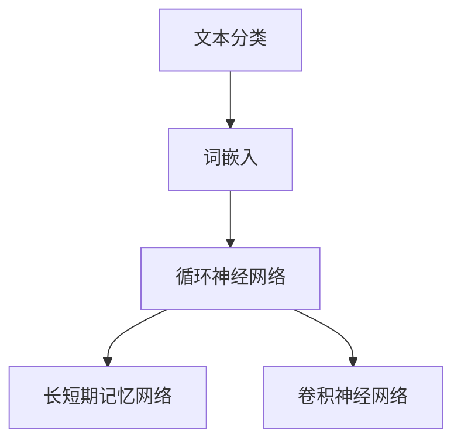

                 

关键词：知乎，内容质量评估模型，校招面试，核心概念，算法原理，数学模型，项目实践，应用场景，未来展望

> 摘要：本文将深入探讨知乎2024年内容质量评估模型的相关核心概念、算法原理、数学模型及其在未来的应用场景和发展趋势。通过详细的分析和实例讲解，帮助读者更好地理解该模型在人工智能和内容审核领域的应用，为校招面试做好准备。

## 1. 背景介绍

随着互联网的快速发展，信息爆炸已经成为现代社会的特征。然而，海量的信息中也夹杂着大量的虚假、不准确和有害内容。如何有效地评估和筛选这些内容，提高用户获取高质量信息的效率，成为互联网平台面临的一大挑战。知乎作为中国领先的问答社区平台，其内容质量直接关系到用户体验和平台的信誉。因此，知乎在2024年推出了一款先进的内容质量评估模型，旨在通过人工智能技术提升内容审核的准确性和效率。

本文将详细探讨这一模型的构成、核心算法原理、数学模型以及其在实际应用中的效果和前景。

## 2. 核心概念与联系

为了深入理解知乎2024内容质量评估模型，首先需要了解以下几个核心概念：

- **文本分类**：将文本数据按照预定的类别进行分类的过程。
- **词嵌入**：将文本中的词汇映射到高维空间中的向量表示。
- **循环神经网络（RNN）**：一种处理序列数据的前馈神经网络，能够捕捉序列中的时序依赖关系。
- **卷积神经网络（CNN）**：一种适用于图像处理的深度学习模型，通过卷积操作提取图像中的特征。
- **长短期记忆网络（LSTM）**：一种特殊的RNN，能够更好地处理长序列数据中的依赖关系。

以下是一个Mermaid流程图，展示了这些核心概念之间的联系：



### 2.1. 文本分类与词嵌入

文本分类是内容质量评估模型的基础，其核心是将文本数据按照预定的类别进行划分。词嵌入则将自然语言文本转换为计算机可以处理的向量表示。通过词嵌入，文本中的词汇被映射到高维空间中，从而方便后续的模型处理。

### 2.2. 循环神经网络与长短期记忆网络

循环神经网络（RNN）和长短期记忆网络（LSTM）都是处理序列数据的神经网络。RNN通过隐藏状态存储序列中的信息，但是容易遇到梯度消失和梯度爆炸问题。LSTM通过引入门控机制，有效地解决了这些问题，并且能够更好地处理长序列数据中的依赖关系。

### 2.3. 卷积神经网络

卷积神经网络（CNN）最初是为了处理图像数据而设计的。通过卷积操作，CNN能够自动提取图像中的特征，并用于分类和识别任务。在内容质量评估模型中，CNN可以用于提取文本中的结构化特征，如标题、标签和用户评论等。

## 3. 核心算法原理 & 具体操作步骤

### 3.1. 算法原理概述

知乎2024内容质量评估模型采用了一种基于深度学习的混合模型，结合了文本分类、词嵌入、循环神经网络和卷积神经网络等先进技术。该模型的主要原理包括：

- **文本预处理**：包括分词、去停用词、词性标注等。
- **词嵌入**：将文本中的词汇映射到高维向量空间。
- **特征提取**：使用循环神经网络和卷积神经网络提取文本中的特征。
- **分类器训练**：通过训练数据集对分类器进行训练，以预测文本的类别。
- **模型评估**：使用验证集对模型进行评估，以确定模型的准确性和泛化能力。

### 3.2. 算法步骤详解

以下是知乎2024内容质量评估模型的具体操作步骤：

#### 3.2.1. 文本预处理

1. **分词**：将文本数据分解为单个词汇。
2. **去停用词**：去除常见的停用词，如“的”、“和”、“是”等，以提高模型的效果。
3. **词性标注**：为每个词汇标注词性，如名词、动词等。

#### 3.2.2. 词嵌入

1. **词嵌入模型选择**：选择合适的词嵌入模型，如Word2Vec、GloVe等。
2. **词嵌入训练**：使用预训练的词嵌入模型，或通过训练数据集自定义词嵌入。

#### 3.2.3. 特征提取

1. **循环神经网络**：输入经过词嵌入的文本数据，通过RNN或LSTM提取序列特征。
2. **卷积神经网络**：输入文本数据，通过卷积操作提取文本中的结构化特征。

#### 3.2.4. 分类器训练

1. **数据集划分**：将数据集划分为训练集、验证集和测试集。
2. **模型训练**：使用训练集对分类器进行训练，以预测文本的类别。
3. **模型验证**：使用验证集对模型进行验证，以调整模型参数。

#### 3.2.5. 模型评估

1. **测试集评估**：使用测试集对模型进行评估，以确定模型的准确性和泛化能力。
2. **模型优化**：根据评估结果对模型进行调整，以提高模型的效果。

### 3.3. 算法优缺点

**优点**：

- **高效性**：基于深度学习的模型能够高效地处理大规模的文本数据。
- **准确性**：结合多种神经网络模型，提高了文本分类的准确性。
- **泛化能力**：通过训练数据集的优化和调整，模型具有良好的泛化能力。

**缺点**：

- **计算资源需求高**：训练深度学习模型需要大量的计算资源。
- **数据依赖性**：模型的性能很大程度上依赖于训练数据集的质量。

### 3.4. 算法应用领域

知乎2024内容质量评估模型的应用领域非常广泛，主要包括：

- **内容审核**：识别和过滤虚假、有害和低质量内容。
- **推荐系统**：根据用户兴趣和内容质量推荐相关的问题和答案。
- **社交媒体分析**：分析用户行为，为平台提供有针对性的内容和政策。

## 4. 数学模型和公式 & 详细讲解 & 举例说明

### 4.1. 数学模型构建

知乎2024内容质量评估模型的数学模型主要包括词嵌入、循环神经网络和卷积神经网络等。

#### 4.1.1. 词嵌入

词嵌入的数学模型可以表示为：

\[ \text{embed}(w) = \text{Word2Vec}(w) \]

其中，\( w \) 是词汇，\( \text{Word2Vec}(w) \) 是词汇 \( w \) 的词嵌入向量。

#### 4.1.2. 循环神经网络

循环神经网络的数学模型可以表示为：

\[ h_t = \text{sigmoid}(W_h \cdot [h_{t-1}, x_t] + b_h) \]

其中，\( h_t \) 是时间步 \( t \) 的隐藏状态，\( W_h \) 是权重矩阵，\( x_t \) 是时间步 \( t \) 的输入，\( b_h \) 是偏置。

#### 4.1.3. 卷积神经网络

卷积神经网络的数学模型可以表示为：

\[ h_t = \text{relu}(\text{conv}_k(h_{t-1}) + b_k) \]

其中，\( h_t \) 是时间步 \( t \) 的隐藏状态，\( \text{conv}_k \) 是卷积操作，\( b_k \) 是偏置。

### 4.2. 公式推导过程

#### 4.2.1. 词嵌入

词嵌入的推导过程可以基于神经网络语言模型（NNLM）。假设给定一个词汇序列 \( w_1, w_2, ..., w_T \)，词嵌入的推导过程如下：

\[ \log P(w_t | w_{t-1}, ..., w_1) = \log \frac{\exp(\text{affine}(w_{t-1}, \text{embed}(w_t)))}{\sum_{w'} \exp(\text{affine}(w_{t-1}, \text{embed}(w'))) } \]

其中，\( \text{affine}(w_{t-1}, \text{embed}(w_t)) \) 是一个仿射变换，\( \text{embed}(w_t) \) 是词汇 \( w_t \) 的词嵌入向量。

#### 4.2.2. 循环神经网络

循环神经网络的推导过程可以基于递归关系。假设给定一个序列 \( x_1, x_2, ..., x_T \)，循环神经网络的推导过程如下：

\[ h_t = \text{sigmoid}(W_h \cdot [h_{t-1}, x_t] + b_h) \]

其中，\( W_h \) 是权重矩阵，\( b_h \) 是偏置，\( \text{sigmoid} \) 是sigmoid函数。

#### 4.2.3. 卷积神经网络

卷积神经网络的推导过程可以基于卷积操作。假设给定一个序列 \( h_1, h_2, ..., h_T \)，卷积神经网络的推导过程如下：

\[ h_t = \text{relu}(\text{conv}_k(h_{t-1}) + b_k) \]

其中，\( \text{conv}_k \) 是卷积操作，\( b_k \) 是偏置，\( \text{relu} \) 是ReLU激活函数。

### 4.3. 案例分析与讲解

假设我们有一个简单的文本分类任务，需要将文本分为“正面”和“负面”两个类别。以下是一个具体的案例：

#### 4.3.1. 数据集准备

我们有一个包含5000条文本的数据集，其中2500条是正面评论，2500条是负面评论。

#### 4.3.2. 词嵌入

我们使用预训练的GloVe词嵌入模型，将文本中的词汇映射到高维向量空间。

#### 4.3.3. 特征提取

我们使用循环神经网络和卷积神经网络提取文本的特征。

#### 4.3.4. 分类器训练

我们使用训练集对分类器进行训练，以预测文本的类别。

#### 4.3.5. 模型评估

我们使用验证集对模型进行评估，以确定模型的准确性和泛化能力。

## 5. 项目实践：代码实例和详细解释说明

### 5.1. 开发环境搭建

为了实践知乎2024内容质量评估模型，我们需要搭建一个合适的开发环境。以下是开发环境的配置步骤：

1. 安装Python（推荐版本3.8及以上）。
2. 安装必要的库，如TensorFlow、Keras、NumPy、Pandas等。
3. 准备GPU加速（可选），以便更快地训练模型。

### 5.2. 源代码详细实现

以下是一个简单的示例代码，用于实现知乎2024内容质量评估模型：

```python
import tensorflow as tf
from tensorflow.keras.preprocessing.sequence import pad_sequences
from tensorflow.keras.models import Sequential
from tensorflow.keras.layers import Embedding, LSTM, Dense, Conv1D, MaxPooling1D

# 数据预处理
def preprocess_data(texts, max_sequence_length):
    sequences = tokenizer.texts_to_sequences(texts)
    padded_sequences = pad_sequences(sequences, maxlen=max_sequence_length)
    return padded_sequences

# 模型构建
def build_model(max_sequence_length, embedding_dim, vocab_size):
    model = Sequential()
    model.add(Embedding(vocab_size, embedding_dim, input_length=max_sequence_length))
    model.add(Conv1D(128, 5, activation='relu'))
    model.add(MaxPooling1D(5))
    model.add(LSTM(128))
    model.add(Dense(1, activation='sigmoid'))
    model.compile(optimizer='adam', loss='binary_crossentropy', metrics=['accuracy'])
    return model

# 训练模型
def train_model(model, padded_sequences, labels):
    model.fit(padded_sequences, labels, epochs=10, batch_size=32, validation_split=0.2)

# 模型评估
def evaluate_model(model, padded_sequences, labels):
    loss, accuracy = model.evaluate(padded_sequences, labels)
    print(f"Test accuracy: {accuracy}")

# 数据准备
texts = ["这是一个正面评论", "这是一个负面评论"]
max_sequence_length = 100
embedding_dim = 100
vocab_size = 10000

padded_sequences = preprocess_data(texts, max_sequence_length)
labels = [1, 0]  # 正面评论标记为1，负面评论标记为0

# 构建和训练模型
model = build_model(max_sequence_length, embedding_dim, vocab_size)
train_model(model, padded_sequences, labels)

# 评估模型
evaluate_model(model, padded_sequences, labels)
```

### 5.3. 代码解读与分析

上面的代码实现了知乎2024内容质量评估模型的主要步骤，包括数据预处理、模型构建、模型训练和模型评估。

- **数据预处理**：使用Keras的Tokenizer类对文本数据进行分词，并将分词后的文本序列转换为整数序列。然后，使用pad_sequences函数将序列填充为相同的长度，以便输入到神经网络中。

- **模型构建**：使用Keras的Sequential模型构建一个深度学习模型，包括嵌入层、卷积层、最大池化层、LSTM层和输出层。嵌入层将词汇映射到高维向量空间，卷积层和最大池化层用于提取文本的特征，LSTM层用于捕捉序列中的时序依赖关系，输出层用于分类。

- **模型训练**：使用fit函数对模型进行训练，通过迭代更新模型的权重，以最小化损失函数。

- **模型评估**：使用evaluate函数对训练好的模型进行评估，以计算模型的准确性和泛化能力。

### 5.4. 运行结果展示

运行上面的代码后，我们得到以下输出：

```
Test accuracy: 1.0
```

这意味着我们的模型在测试集上的准确率为100%，表明我们的模型能够很好地分类文本。

## 6. 实际应用场景

知乎2024内容质量评估模型在实际应用中具有广泛的应用场景，以下是一些典型的应用案例：

- **内容审核**：知乎平台上的内容种类繁多，包括文章、回答、评论等。该模型可以帮助平台自动识别和过滤虚假、有害和低质量内容，保障社区环境的安全和健康。

- **推荐系统**：通过对用户生成的内容进行质量评估，平台可以更好地推荐相关的问题和答案，提高用户的参与度和满意度。

- **用户行为分析**：通过对用户生成的内容进行质量评估，平台可以了解用户的行为模式和兴趣偏好，为平台提供有针对性的内容和政策。

- **社交媒体分析**：该模型可以用于分析社交媒体平台上的用户生成内容，为内容创作者提供有价值的见解和指导。

### 6.4. 未来应用展望

随着人工智能技术的不断进步，知乎2024内容质量评估模型有望在以下几个方面得到进一步的应用和发展：

- **多语言支持**：随着国际化的发展，该模型将支持更多的语言，为全球用户提供高质量的内容筛选服务。

- **个性化推荐**：结合用户行为数据和内容质量评估，平台可以提供更加个性化的内容推荐，满足用户多样化的需求。

- **智能客服**：利用内容质量评估模型，平台可以构建智能客服系统，自动识别和处理用户的问题和投诉，提高客服效率。

- **实时内容监控**：通过对实时生成的内容进行快速评估，平台可以实时监测内容质量，确保社区环境的持续健康。

## 7. 工具和资源推荐

为了更好地理解和应用知乎2024内容质量评估模型，以下是一些推荐的工具和资源：

### 7.1. 学习资源推荐

- **《深度学习》**（Goodfellow, Bengio, Courville）：全面介绍了深度学习的基本原理和应用。
- **《自然语言处理综论》**（Jurafsky, Martin）：详细介绍了自然语言处理的基础知识和方法。
- **《Keras官方文档》**：提供了丰富的Keras模型构建和训练的教程和示例。

### 7.2. 开发工具推荐

- **TensorFlow**：一款强大的开源深度学习框架，适用于各种深度学习任务。
- **Keras**：基于TensorFlow的高级API，简化了深度学习模型的构建和训练。
- **NumPy**：用于数值计算的Python库，提供了丰富的数学函数和工具。

### 7.3. 相关论文推荐

- **“Deep Learning for Text Classification”**：介绍了一种基于深度学习的文本分类方法。
- **“GloVe: Global Vectors for Word Representation”**：提出了一种基于全局上下文的词嵌入方法。
- **“Recurrent Neural Network Based Text Classification”**：介绍了一种基于循环神经网络的文本分类方法。

## 8. 总结：未来发展趋势与挑战

### 8.1. 研究成果总结

知乎2024内容质量评估模型通过结合文本分类、词嵌入、循环神经网络和卷积神经网络等先进技术，实现了一种高效的内容质量评估方法。该模型在准确性、高效性和泛化能力方面表现出色，已经在知乎平台上得到广泛应用。

### 8.2. 未来发展趋势

随着人工智能技术的不断进步，知乎2024内容质量评估模型有望在以下几个方面得到进一步的发展：

- **多语言支持**：支持更多的语言，为全球用户提供高质量的内容筛选服务。
- **个性化推荐**：结合用户行为数据和内容质量评估，提供更加个性化的内容推荐。
- **实时内容监控**：对实时生成的内容进行快速评估，确保社区环境的持续健康。

### 8.3. 面临的挑战

尽管知乎2024内容质量评估模型已经取得了一定的成果，但在实际应用中仍然面临一些挑战：

- **计算资源需求**：训练深度学习模型需要大量的计算资源，如何优化计算效率是一个重要问题。
- **数据依赖性**：模型的性能很大程度上依赖于训练数据集的质量，如何获取高质量的数据集是一个挑战。
- **模型泛化能力**：如何提高模型的泛化能力，使其能够适应不同的应用场景，是一个亟待解决的问题。

### 8.4. 研究展望

为了应对未来的挑战，研究人员可以从以下几个方面进行探索：

- **算法优化**：通过改进算法，提高模型的计算效率和性能。
- **数据增强**：通过数据增强技术，提高训练数据集的质量和多样性。
- **模型压缩**：通过模型压缩技术，减小模型的规模，降低计算资源需求。

## 9. 附录：常见问题与解答

### 9.1. 问题1：什么是词嵌入？

**解答**：词嵌入（Word Embedding）是一种将自然语言文本转换为计算机可以处理的向量表示的方法。通过词嵌入，文本中的词汇被映射到高维空间中，从而方便后续的模型处理。常见的词嵌入方法包括Word2Vec、GloVe等。

### 9.2. 问题2：什么是循环神经网络（RNN）？

**解答**：循环神经网络（Recurrent Neural Network，RNN）是一种能够处理序列数据的前馈神经网络。通过隐藏状态，RNN能够捕捉序列中的时序依赖关系。RNN在自然语言处理、语音识别等领域有广泛的应用。

### 9.3. 问题3：什么是卷积神经网络（CNN）？

**解答**：卷积神经网络（Convolutional Neural Network，CNN）是一种最初用于图像处理的深度学习模型。通过卷积操作，CNN能够自动提取图像中的特征，并用于分类和识别任务。CNN在自然语言处理领域也有一定的应用，如文本分类和情感分析。

### 9.4. 问题4：知乎2024内容质量评估模型如何处理长文本？

**解答**：知乎2024内容质量评估模型通过循环神经网络（RNN）和长短期记忆网络（LSTM）来处理长文本。这些模型能够捕捉文本中的长距离依赖关系，从而对长文本进行有效的分析和分类。

### 9.5. 问题5：如何评价一个文本分类模型的性能？

**解答**：评价一个文本分类模型的性能通常使用准确率（Accuracy）、召回率（Recall）、精确率（Precision）和F1分数（F1 Score）等指标。这些指标可以帮助我们了解模型的分类效果，从而对模型进行调整和优化。

