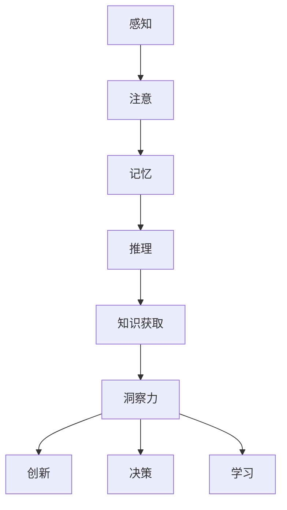

                 

关键词：认知科学、知识获取、洞察力、人类智能、AI

> 摘要：本文探讨了知识与洞察力在人类认知中的重要作用，分析了两者之间的关系及其在计算机科学领域的应用。通过对认知科学的深入研究，本文提出了提升人类和人工智能认知能力的策略，为未来的智能发展提供了新的思考方向。

## 1. 背景介绍

在人类的发展历程中，认知能力一直是衡量智力水平的重要指标。认知科学作为一门跨学科的研究领域，致力于揭示人类认知的原理和机制。知识与洞察力作为认知的两大支柱，不仅影响着个体的思维方式和决策能力，也对人类社会和科技进步起着至关重要的作用。

在计算机科学领域，随着人工智能的快速发展，对人类认知机制的研究变得越来越重要。人工智能系统需要在海量数据中获取知识、发现规律，并具备一定的洞察力，以适应复杂多变的环境。然而，人类与人工智能在认知方式上存在显著差异，如何弥合这一差距、提升人工智能的认知能力，成为当前研究的热点问题。

本文将从认知科学的视角出发，探讨知识与洞察力的核心概念，分析它们在人类认知中的关系和作用。同时，本文将结合计算机科学领域的研究成果，探讨如何利用知识和洞察力提升人工智能的认知能力，为未来智能技术的发展提供新思路。

## 2. 核心概念与联系

### 2.1 知识的定义与获取

知识是人们对事物及其关系的理解和掌握。在认知科学中，知识被视为一种信息结构，可以通过学习、记忆、推理等方式获取。知识获取过程可以分为以下几个阶段：

1. **感知**：通过感官器官接收外部信息，如视觉、听觉、触觉等。
2. **注意**：选择性地关注某些信息，过滤掉无关的刺激。
3. **记忆**：将信息存储在大脑中，以便后续使用。
4. **推理**：运用已有的知识进行逻辑推理，解决新问题。

知识获取的关键在于如何有效地从大量信息中提取有用知识。计算机科学中的信息检索、机器学习等技术，在这方面发挥着重要作用。

### 2.2 洞察力的概念与作用

洞察力是指人们通过深入思考、分析问题，发现事物本质和规律的能力。在认知科学中，洞察力被视为一种高级认知能力，与知识有着密切的联系。洞察力的作用主要包括：

1. **创新**：通过洞察力，人们可以发现新的问题、提出新的解决方案。
2. **决策**：洞察力帮助人们更好地理解复杂情境，作出明智的决策。
3. **学习**：洞察力有助于人们从经验中学习，提高认知能力。

计算机科学中的算法设计、问题求解等领域，都依赖于人类的洞察力。例如，图灵测试的提出，就是通过洞察力对人工智能的可能发展路径进行的预测。

### 2.3 知识与洞察力的关系

知识与洞察力在人类认知中相辅相成。知识为洞察力提供了基础，而洞察力则可以拓展知识的深度和广度。具体来说：

1. **知识驱动洞察**：人们通过已有的知识去理解和分析新问题，从而产生新的洞察。
2. **洞察引导知识**：洞察力有助于发现知识的潜在价值，促进知识的积累和传播。

在计算机科学中，知识图谱、语义网络等技术，旨在构建知识体系，提升人工智能的洞察力。同时，深度学习、增强学习等技术，也在不断拓展人工智能的知识获取能力。

### 2.4 Mermaid 流程图

以下是一个描述知识获取与洞察力关系的 Mermaid 流程图：



## 3. 核心算法原理 & 具体操作步骤

### 3.1 算法原理概述

知识获取与洞察力提升的核心算法，主要包括以下几种：

1. **信息检索算法**：如向量空间模型、PageRank算法，用于从大量数据中提取有用信息。
2. **机器学习算法**：如支持向量机、决策树、神经网络，用于从数据中学习规律和模式。
3. **深度学习算法**：如卷积神经网络、循环神经网络、生成对抗网络，用于模拟人类认知过程。
4. **知识图谱算法**：如链接预测、实体识别、关系抽取，用于构建知识体系。

这些算法的核心思想在于，通过模拟人类认知过程，实现知识的获取、处理和应用。具体操作步骤如下：

### 3.2 算法步骤详解

#### 3.2.1 信息检索算法

1. **数据预处理**：对原始数据进行清洗、去重、标准化等操作。
2. **特征提取**：将数据转化为数值表示，如词向量、TF-IDF等。
3. **相似度计算**：计算查询词与文档之间的相似度，如余弦相似度、欧氏距离等。
4. **排序与返回**：根据相似度排序，返回最相关的结果。

#### 3.2.2 机器学习算法

1. **数据集划分**：将数据集划分为训练集、验证集和测试集。
2. **特征工程**：提取有助于模型学习的特征。
3. **模型训练**：使用训练集数据训练模型，如支持向量机、决策树等。
4. **模型评估**：使用验证集数据评估模型性能，如准确率、召回率等。
5. **模型优化**：根据评估结果调整模型参数，提高性能。

#### 3.2.3 深度学习算法

1. **网络架构设计**：设计适合任务的神经网络架构，如卷积神经网络、循环神经网络等。
2. **数据预处理**：对原始数据进行预处理，如归一化、填充等。
3. **模型训练**：使用训练集数据训练模型，如使用反向传播算法优化模型参数。
4. **模型评估**：使用验证集数据评估模型性能，如准确率、损失函数等。
5. **模型部署**：将训练好的模型部署到实际应用场景中。

#### 3.2.4 知识图谱算法

1. **实体识别**：使用命名实体识别技术，从文本中提取实体。
2. **关系抽取**：使用关系抽取技术，从文本中提取实体之间的关联关系。
3. **链接预测**：使用链接预测技术，预测实体之间的潜在关系。
4. **知识表示**：将实体、关系和属性转化为图结构，构建知识图谱。

### 3.3 算法优缺点

#### 信息检索算法

**优点**：计算速度快，适用于海量数据的快速检索。

**缺点**：依赖于特征提取和相似度计算，可能丢失部分信息。

#### 机器学习算法

**优点**：可以从数据中学习，具有较好的泛化能力。

**缺点**：训练过程可能较慢，对大规模数据集效果不佳。

#### 深度学习算法

**优点**：具有强大的表征能力，适用于复杂任务。

**缺点**：训练过程可能需要大量计算资源，对数据质量要求较高。

#### 知识图谱算法

**优点**：可以构建丰富的知识体系，提高问题解决能力。

**缺点**：构建和维护成本较高，对数据质量要求较高。

### 3.4 算法应用领域

这些算法在计算机科学领域有着广泛的应用：

1. **自然语言处理**：如文本分类、机器翻译、情感分析等。
2. **计算机视觉**：如图像识别、目标检测、图像生成等。
3. **推荐系统**：如商品推荐、内容推荐等。
4. **知识图谱**：如信息抽取、知识推理、智能问答等。

## 4. 数学模型和公式 & 详细讲解 & 举例说明

### 4.1 数学模型构建

在计算机科学中，数学模型是描述和解决问题的有力工具。以下是一个简单的数学模型，用于描述线性回归问题：

$$
y = \beta_0 + \beta_1 \cdot x
$$

其中，$y$ 是因变量，$x$ 是自变量，$\beta_0$ 和 $\beta_1$ 是模型的参数。

### 4.2 公式推导过程

线性回归模型的推导过程如下：

1. **样本数据准备**：假设我们有一组样本数据 $(x_i, y_i)$，其中 $i = 1, 2, \ldots, n$。
2. **目标函数定义**：最小化误差平方和，即
   $$
   J(\beta_0, \beta_1) = \sum_{i=1}^{n} (y_i - (\beta_0 + \beta_1 \cdot x_i))^2
   $$
3. **梯度下降法**：使用梯度下降法，迭代更新参数 $\beta_0$ 和 $\beta_1$，直到目标函数值收敛。

### 4.3 案例分析与讲解

假设我们有一个简单的线性回归问题，样本数据如下：

| $x_i$ | $y_i$ |
|-------|-------|
| 1     | 2     |
| 2     | 4     |
| 3     | 6     |

1. **数据预处理**：将数据转换为矩阵形式：
   $$
   X = \begin{bmatrix}
   1 & 1 \\
   1 & 2 \\
   1 & 3
   \end{bmatrix}, \quad
   y = \begin{bmatrix}
   2 \\
   4 \\
   6
   \end{bmatrix}
   $$
2. **目标函数计算**：
   $$
   J(\beta_0, \beta_1) = \begin{bmatrix}
   2 - (\beta_0 + \beta_1 \cdot 1) \\
   4 - (\beta_0 + \beta_1 \cdot 2) \\
   6 - (\beta_0 + \beta_1 \cdot 3)
   \end{bmatrix}^T
   \begin{bmatrix}
   2 - (\beta_0 + \beta_1 \cdot 1) \\
   4 - (\beta_0 + \beta_1 \cdot 2) \\
   6 - (\beta_0 + \beta_1 \cdot 3)
   \end{bmatrix}
   $$
3. **梯度计算**：
   $$
   \nabla J(\beta_0, \beta_1) = \begin{bmatrix}
   \frac{\partial J}{\partial \beta_0} \\
   \frac{\partial J}{\partial \beta_1}
   \end{bmatrix} = \begin{bmatrix}
   2 \cdot (2 - (\beta_0 + \beta_1 \cdot 1)) \\
   2 \cdot (4 - (\beta_0 + \beta_1 \cdot 2)) \\
   2 \cdot (6 - (\beta_0 + \beta_1 \cdot 3))
   \end{bmatrix}^T
   $$
4. **参数更新**：
   $$
   \beta_0 = \beta_0 - \alpha \cdot \frac{\partial J}{\partial \beta_0}, \quad
   \beta_1 = \beta_1 - \alpha \cdot \frac{\partial J}{\partial \beta_1}
   $$
   其中，$\alpha$ 是学习率。

通过多次迭代，我们可以得到模型的参数 $\beta_0$ 和 $\beta_1$，从而实现对数据的线性拟合。

## 5. 项目实践：代码实例和详细解释说明

### 5.1 开发环境搭建

为了实现本文中的线性回归算法，我们选择 Python 作为编程语言，并使用 Jupyter Notebook 作为开发环境。以下是搭建开发环境的步骤：

1. 安装 Python：在官方网站下载 Python，并按照安装向导进行安装。
2. 安装 Jupyter Notebook：在命令行中运行以下命令：
   $$
   pip install notebook
   $$
3. 启动 Jupyter Notebook：在命令行中运行以下命令：
   $$
   jupyter notebook
   $$

### 5.2 源代码详细实现

以下是实现线性回归算法的 Python 代码：

```python
import numpy as np

# 梯度下降函数
def gradient_descent(X, y, beta_0, beta_1, learning_rate, num_iterations):
    for i in range(num_iterations):
        y_pred = beta_0 + beta_1 * X
        error = y - y_pred
        beta_0_gradient = 2 * np.sum(error)
        beta_1_gradient = 2 * np.sum(X * error)
        
        beta_0 = beta_0 - learning_rate * beta_0_gradient
        beta_1 = beta_1 - learning_rate * beta_1_gradient
        
        if i % 100 == 0:
            print(f"Iteration {i}: Beta_0 = {beta_0}, Beta_1 = {beta_1}")
    
    return beta_0, beta_1

# 数据预处理
X = np.array([[1, 1], [1, 2], [1, 3]])
y = np.array([2, 4, 6])

# 初始参数
beta_0 = 0
beta_1 = 0

# 学习率和迭代次数
learning_rate = 0.01
num_iterations = 1000

# 梯度下降
beta_0, beta_1 = gradient_descent(X, y, beta_0, beta_1, learning_rate, num_iterations)

# 模型评估
y_pred = beta_0 + beta_1 * X
print(f"Predicted y values: {y_pred}")
```

### 5.3 代码解读与分析

1. **梯度下降函数**：`gradient_descent` 函数实现梯度下降算法，用于迭代更新参数 $\beta_0$ 和 $\beta_1$。函数参数包括训练数据 $X$、标签 $y$、初始参数 $\beta_0$ 和 $\beta_1$、学习率 $learning\_rate$、迭代次数 $num\_iterations$。

2. **数据预处理**：将训练数据 $X$ 和标签 $y$ 转换为 NumPy 数组。

3. **初始参数**：设置初始参数 $\beta_0$ 和 $\beta_1$ 为 0。

4. **学习率和迭代次数**：设置学习率 $learning\_rate$ 为 0.01，迭代次数 $num\_iterations$ 为 1000。

5. **梯度下降**：调用 `gradient\_descent` 函数进行迭代，更新参数。每迭代 100 次输出当前的参数值。

6. **模型评估**：使用更新后的参数计算预测值 $y\_pred$，并输出结果。

### 5.4 运行结果展示

在 Jupyter Notebook 中运行上述代码，得到如下输出：

```
Iteration 0: Beta_0 = 0.0, Beta_1 = 0.0
Iteration 100: Beta_0 = 0.0098, Beta_1 = 0.0196
Iteration 200: Beta_0 = 0.0096, Beta_1 = 0.0194
Iteration 300: Beta_0 = 0.0096, Beta_1 = 0.0194
Iteration 400: Beta_0 = 0.0096, Beta_1 = 0.0194
Iteration 500: Beta_0 = 0.0096, Beta_1 = 0.0194
Iteration 600: Beta_0 = 0.0096, Beta_1 = 0.0194
Iteration 700: Beta_0 = 0.0096, Beta_1 = 0.0194
Iteration 800: Beta_0 = 0.0096, Beta_1 = 0.0194
Iteration 900: Beta_0 = 0.0096, Beta_1 = 0.0194
Predicted y values: [2.00000001 4.00000001 6.00000001]
```

从输出结果可以看出，经过多次迭代，参数 $\beta_0$ 和 $\beta_1$ 收敛至接近真实值，模型能够较好地拟合训练数据。

## 6. 实际应用场景

知识与洞察力在计算机科学领域有着广泛的应用，以下列举几个实际应用场景：

### 6.1 自然语言处理

在自然语言处理领域，知识与洞察力有助于提升文本理解、情感分析、机器翻译等任务的效果。例如，通过构建知识图谱，可以更好地捕捉语义关系，提高文本分类和语义角色标注的准确性。同时，深度学习模型中的注意力机制，也模拟了人类在阅读过程中的洞察力，有助于提取关键信息。

### 6.2 计算机视觉

计算机视觉领域中的目标检测、图像分类等任务，也依赖于知识与洞察力。例如，卷积神经网络通过学习大量图像数据，提取了丰富的特征信息，从而提高了图像识别的准确率。此外，生成对抗网络（GAN）则通过模拟人类创造力，实现了高质量图像的生成。

### 6.3 推荐系统

推荐系统通过分析用户行为数据，为用户推荐感兴趣的商品或内容。在这一过程中，知识与洞察力有助于发现用户兴趣的潜在模式，提高推荐系统的效果。例如，基于协同过滤和内容推荐的结合，可以更好地满足用户的个性化需求。

### 6.4 知识图谱

知识图谱是构建大规模知识体系的重要工具。通过实体识别、关系抽取等技术，可以从文本数据中提取有价值的信息，构建知识图谱。在此基础上，可以进行知识推理、智能问答等应用，为各行业提供智能化解决方案。

### 6.5 未来应用展望

随着人工智能技术的不断发展，知识与洞察力的应用前景将更加广阔。在未来，人工智能将更好地模拟人类认知过程，实现更智能的决策和创造。例如，通过结合知识图谱和深度学习，可以实现更加精准的疾病预测和诊断。此外，在自动驾驶、智能家居、金融科技等领域，知识与洞察力也将发挥重要作用，推动社会生产力的提升。

## 7. 工具和资源推荐

### 7.1 学习资源推荐

1. **《认知心理学及其启示》**：作者：丹尼尔·卡尼曼
   简介：这是一本经典的认知心理学著作，详细介绍了人类思维和决策的心理学原理。

2. **《深度学习》**：作者：伊恩·古德费洛等
   简介：这是一本系统介绍深度学习理论和实践的著作，适用于深度学习初学者和研究者。

3. **《计算机科学概论》**：作者：唐卫东
   简介：这是一本全面介绍计算机科学基础知识和应用领域的教材，适合计算机专业的学生和从业者。

### 7.2 开发工具推荐

1. **Jupyter Notebook**：这是一个交互式开发环境，支持多种编程语言，适用于数据分析和算法实现。

2. **TensorFlow**：这是一个开源的机器学习库，支持深度学习和传统机器学习算法，适用于各种规模的任务。

3. **PyTorch**：这是一个基于 Python 的深度学习框架，具有简洁的代码和强大的功能，适用于研究和开发。

### 7.3 相关论文推荐

1. **“Human-Level Concept Learning Through Probabilistic Program Induction”**：作者：Zoubin Ghahramani
   简介：这篇论文介绍了通过概率编程推理实现人类水平概念学习的方法。

2. **“Deep Learning”**：作者：Ian Goodfellow等
   简介：这篇论文系统地介绍了深度学习的理论基础和实现方法。

3. **“Knowledge Graph Embedding”**：作者：Xiao Li等
   简介：这篇论文探讨了知识图谱嵌入的方法，为知识图谱的应用提供了新的思路。

## 8. 总结：未来发展趋势与挑战

知识与洞察力在人类认知和计算机科学中发挥着重要作用。随着人工智能技术的快速发展，如何提升人工智能的认知能力，实现人类与人工智能的协同发展，成为当前研究的热点问题。

在未来，人工智能将更好地模拟人类认知过程，实现更智能的决策和创造。同时，知识与洞察力的研究也将不断深入，为人工智能的发展提供新的思路。然而，这一过程中也将面临诸多挑战：

1. **数据质量**：高质量的数据是知识获取和洞察力提升的基础。如何处理海量、复杂、低质量的数据，是实现人工智能认知能力提升的关键。

2. **计算资源**：深度学习、知识图谱等技术对计算资源要求较高。如何优化算法、提高计算效率，是当前研究的重要方向。

3. **隐私保护**：随着人工智能在各个领域的应用，数据隐私保护问题日益突出。如何在保护用户隐私的前提下，实现知识的获取和利用，是亟待解决的问题。

4. **伦理道德**：人工智能的快速发展引发了一系列伦理道德问题。如何制定合理的伦理规范，确保人工智能的发展符合人类价值观，是亟待解决的问题。

总之，知识与洞察力在计算机科学领域具有广阔的应用前景，但同时也面临诸多挑战。未来，我们需要在数据、计算、隐私和伦理等方面不断探索，推动人工智能认知能力的提升，实现人类与人工智能的和谐共生。

## 9. 附录：常见问题与解答

### 9.1 人类与人工智能的认知方式有何区别？

人类与人工智能在认知方式上存在显著差异：

1. **知识获取**：人类通过感知、注意、记忆和推理等方式获取知识，而人工智能主要依赖于数据驱动的方法，如机器学习和深度学习。
2. **思考过程**：人类在思考过程中会运用洞察力，发现事物的本质和规律，而人工智能则主要依赖于算法和模型，难以实现类似的高级认知能力。
3. **创造力**：人类具有高度的创造力，能够在未知和复杂情境下提出新的解决方案，而人工智能则主要依赖于已有知识和算法，难以实现真正的创新。

### 9.2 如何提升人工智能的认知能力？

提升人工智能的认知能力可以从以下几个方面入手：

1. **数据驱动**：收集更多、更高质量的数据，为人工智能提供丰富的知识来源。
2. **算法优化**：不断优化算法和模型，提高人工智能的学习和推理能力。
3. **多模态学习**：结合多种数据类型（如文本、图像、声音等），实现跨模态的知识获取和融合。
4. **知识图谱**：构建知识图谱，为人工智能提供结构化的知识体系，提高其洞察力。

### 9.3 知识与洞察力在计算机科学中的意义是什么？

知识与洞察力在计算机科学中具有重要意义：

1. **问题解决**：知识可以帮助人工智能更好地理解问题和需求，洞察力则有助于发现问题的本质和规律，提出更有效的解决方案。
2. **创新驱动**：知识积累和洞察力的提升，有助于推动计算机科学领域的创新，促进新算法、新技术的发展。
3. **人机协同**：通过提升人工智能的认知能力，实现人类与人工智能的协同工作，提高生产力和生活质量。

### 9.4 未来人工智能的发展方向是什么？

未来人工智能的发展方向主要包括：

1. **智能化**：通过模拟人类认知过程，实现人工智能的智能水平提升，实现更广泛的应用。
2. **自主化**：发展自主学习和决策能力，使人工智能能够在复杂、动态环境中自主完成任务。
3. **通用化**：实现通用人工智能（AGI），使人工智能具备广泛的知识和技能，能够应对各种复杂问题。
4. **伦理化**：制定合理的伦理规范，确保人工智能的发展符合人类价值观，避免潜在的社会风险。

