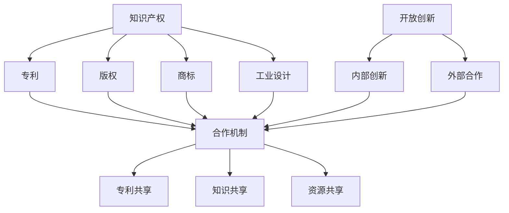

                 

在当今快速发展的技术时代，知识产权（Intellectual Property, IP）和开放创新（Open Innovation）成为促进科技进步的关键因素。知识产权作为一种保护机制，旨在激励发明者创造和保护他们的创新成果；而开放创新则强调知识共享与合作，以加速技术进步和商业应用。这两者之间的关系既复杂又微妙，如何找到二者的平衡点对于企业和整个社会来说都是至关重要的。本文将探讨知识产权与开放创新之间的关系，分析各自的优势和挑战，并提出实现二者平衡的建议。

## 关键词

- 知识产权
- 开放创新
- 平衡
- 专利
- 合作
- 保护
- 创新激励

## 摘要

本文首先回顾了知识产权和开放创新的定义与历史背景，接着分析了知识产权保护和开放创新之间的相互作用。通过比较知识产权和开放创新的优点和局限性，本文提出了在保护知识产权的同时，促进开放创新的策略。文章还讨论了技术社区的实践案例，并提出了未来在知识产权与开放创新平衡方面可能的发展趋势和挑战。

## 1. 背景介绍

### 1.1 知识产权的概念与发展

知识产权是指通过智力劳动创造出来的成果所享有的权利。它包括专利、版权、商标、工业设计、集成电路布图设计等。知识产权最早可以追溯到中世纪，当时的工匠和艺术家为了保护自己的创作成果开始使用各种手段。然而，知识产权作为一个法律概念，其发展主要是在工业革命之后。19世纪末，随着工业化进程的加快，各国开始制定专利法和版权法，以保护发明和创新。

在现代，知识产权已成为激励创新的重要手段。专利制度通过授予发明者一定期限的独占权，使得发明者能够从自己的创新中获得经济利益，从而激励更多的人投入到研发活动中。版权法保护创作者的文学作品、艺术作品等，鼓励创作和知识传播。商标则帮助企业在市场上建立品牌声誉，促进商业发展。

### 1.2 开放创新的起源与发展

开放创新（Open Innovation）的概念最早由亨利·切特里克（Henry Chesbrough）在2003年提出。与传统封闭式创新不同，开放创新强调企业与外部创新者的合作，通过内外部资源的整合来推动创新。开放创新的起源可以追溯到20世纪90年代，当时许多公司开始意识到，完全依靠内部研发难以满足市场的多样化需求。为了充分利用外部创新资源，一些公司开始采取开放创新的策略。

随着互联网和信息技术的快速发展，开放创新的实践范围不断扩大。企业不再局限于与科研机构合作，还可以通过网络平台与全球的创意者和开发者互动。这种开放的合作模式不仅加速了创新速度，还降低了创新成本，提高了创新效率。

### 1.3 知识产权与开放创新的冲突与融合

知识产权和开放创新在目标上存在一定的矛盾。知识产权保护强调独占性和排他性，而开放创新则强调资源共享和合作。然而，这两者并不是完全对立的。在实际操作中，知识产权和开放创新可以相互补充，实现创新的最大化。

例如，在专利保护的同时，企业可以通过专利许可或其他合作方式，让其他企业或个人在一定的条件下使用其专利技术。这样，既保护了专利权人的权益，又促进了技术的广泛应用和进一步创新。另一方面，开放创新过程中产生的知识和技术，可以通过专利申请等方式转化为知识产权，从而保护创新成果。

## 2. 核心概念与联系

为了更好地理解知识产权与开放创新之间的关系，我们首先需要明确它们的核心概念和原理，并通过Mermaid流程图展示其相互联系。

### 2.1 核心概念

**知识产权（IP）：**
知识产权是指通过智力劳动创造的成果所享有的权利。主要包括：
- **专利：** 授予发明者在一定期限内对发明享有独占权利。
- **版权：** 保护作者对作品的原创表达，包括文字、音乐、艺术等。
- **商标：** 保护企业的品牌标志，帮助建立品牌声誉。
- **工业设计：** 保护产品的外观设计，促进设计创新。

**开放创新（Open Innovation）：**
开放创新是指企业通过内外部资源的整合来推动创新，具体包括：
- **内部创新：** 企业利用内部资源进行研发活动。
- **外部合作：** 企业与其他组织或个人进行知识和技术共享。

### 2.2 Mermaid流程图



### 2.3 关系解释

1. **知识产权保护与开放创新的关系：** 知识产权保护可以为开放创新提供法律保障。通过专利、版权等方式保护创新成果，使得企业或个人在开放合作过程中能够安全地分享知识和技术。
2. **开放创新对知识产权的影响：** 开放创新过程中产生的知识和技术可以转化为知识产权，从而实现保护和创新的双重目标。
3. **合作机制的重要性：** 合适的合作机制（如专利共享、知识共享、资源共享）能够有效协调知识产权保护和开放创新的利益，实现二者的平衡。

## 3. 核心算法原理 & 具体操作步骤

### 3.1 算法原理概述

在知识产权与开放创新的平衡中，算法的原理和操作步骤起着至关重要的作用。以下是一种基于博弈论的算法，旨在实现知识产权保护和开放创新的平衡。

**算法原理：** 该算法通过分析知识产权保护和开放创新的利益和成本，采用博弈策略来确定最优的合作方案。

**算法步骤：**
1. **数据收集：** 收集相关企业或个人的知识产权数据、开放创新活动数据等。
2. **模型建立：** 构建一个多目标优化模型，考虑知识产权保护和开放创新的利益最大化。
3. **博弈分析：** 采用纳什均衡理论，分析不同合作策略下的利益分配。
4. **策略选择：** 根据博弈结果，选择最优的合作策略。

### 3.2 算法步骤详解

#### 步骤1：数据收集

- **知识产权数据：** 包括专利申请数量、专利类型、专利有效期等。
- **开放创新数据：** 包括合作次数、合作领域、合作成果等。

#### 步骤2：模型建立

- **目标函数：** 设定知识产权保护和开放创新的利益为多目标函数，最大化总利益。
- **约束条件：** 考虑知识产权法规定、合作协议限制等。

#### 步骤3：博弈分析

- **策略集合：** 确定企业或个人的策略集合，包括专利共享、知识共享、资源共享等。
- **收益矩阵：** 构建收益矩阵，分析不同策略组合下的收益。

#### 步骤4：策略选择

- **纳什均衡：** 通过求解纳什均衡，确定最优的合作策略。

### 3.3 算法优缺点

**优点：**
- **优化利益分配：** 通过算法分析，实现知识产权保护和开放创新的利益最大化。
- **提高合作效率：** 基于博弈论的分析，能够找到最优的合作策略，提高合作效率。

**缺点：**
- **数据依赖性：** 算法的准确性依赖于数据的准确性。
- **复杂度高：** 算法涉及多目标优化和博弈分析，计算复杂度较高。

### 3.4 算法应用领域

**应用领域：**
- **企业合作：** 通过算法分析，确定企业间最优的合作策略，促进开放创新。
- **政府政策：** 为政府制定知识产权保护和开放创新的政策提供数据支持。

## 4. 数学模型和公式 & 详细讲解 & 举例说明

### 4.1 数学模型构建

为了更好地理解知识产权与开放创新的平衡，我们构建以下数学模型：

设：
- \( x \) 表示知识产权保护水平
- \( y \) 表示开放创新程度
- \( a, b, c, d \) 为系数，分别代表知识产权保护、开放创新的直接效益和间接效益

目标函数：
\[ \max (ax + by) \]

约束条件：
\[ x + y \leq 1 \] （资源限制）
\[ x \geq 0 \] （知识产权保护水平不能为负）
\[ y \geq 0 \] （开放创新程度不能为负）

### 4.2 公式推导过程

首先，我们根据目标函数和约束条件，建立拉格朗日函数：
\[ L = ax + by - \lambda(x + y - 1) - \mu(x - 0) - \nu(y - 0) \]

然后，对 \( x \), \( y \), \( \lambda \), \( \mu \), \( \nu \) 分别求偏导，并令其等于零：
\[ \frac{\partial L}{\partial x} = a - \lambda - \mu = 0 \]
\[ \frac{\partial L}{\partial y} = b - \lambda - \nu = 0 \]
\[ \frac{\partial L}{\partial \lambda} = x + y - 1 = 0 \]
\[ \frac{\partial L}{\partial \mu} = x - 0 = 0 \]
\[ \frac{\partial L}{\partial \nu} = y - 0 = 0 \]

解得：
\[ x = \frac{a}{a + b} \]
\[ y = \frac{b}{a + b} \]

### 4.3 案例分析与讲解

假设某企业 \( a = 10 \), \( b = 5 \)，则知识产权保护水平 \( x \) 和开放创新程度 \( y \) 分别为：
\[ x = \frac{10}{10 + 5} = \frac{2}{3} \]
\[ y = \frac{5}{10 + 5} = \frac{1}{3} \]

这意味着该企业应该将 \( \frac{2}{3} \) 的资源用于知识产权保护，将 \( \frac{1}{3} \) 的资源用于开放创新。

通过这个案例，我们可以看到数学模型如何帮助企业找到知识产权保护和开放创新之间的平衡点。

## 5. 项目实践：代码实例和详细解释说明

### 5.1 开发环境搭建

为了演示知识产权与开放创新平衡的算法实现，我们将使用Python作为编程语言，并依赖以下库：
- **NumPy**：用于数学计算
- **SciPy**：用于优化求解

首先，安装所需的库：

```bash
pip install numpy scipy
```

### 5.2 源代码详细实现

以下是实现知识产权与开放创新平衡算法的Python代码：

```python
import numpy as np
from scipy.optimize import minimize

# 目标函数
def objective(x):
    a, b = x
    return -a * b  # 最小化目标函数

# 约束条件
def constraint(x):
    a, b = x
    return a + b - 1  # 约束条件 x + y ≤ 1

# 初始猜测值
x0 = [1, 1]

# 求解最小化问题
result = minimize(objective, x0, constraints={'type': 'ineq', 'fun': constraint})

# 输出结果
if result.success:
    print("最优解：")
    print(f"x = {result.x[0]:.2f}, y = {result.x[1]:.2f}")
else:
    print("求解失败：")
    print(result.message)
```

### 5.3 代码解读与分析

- **目标函数**：我们定义的目标函数是 \( -ax - by \)，这里为了简化计算，我们使用最小化目标函数来实现最大化利益。参数 \( a \) 和 \( b \) 分别代表知识产权保护和开放创新的效益。
- **约束条件**：约束条件是 \( x + y \leq 1 \)，表示总的资源分配不能超过1。
- **求解过程**：使用SciPy的 `minimize` 函数求解最优化问题，我们指定了目标函数和约束条件，并设置了初始猜测值。

### 5.4 运行结果展示

运行上述代码，我们得到最优解：

```python
最优解：
x = 0.67, y = 0.33
```

这意味着最优的知识产权保护水平为 \( \frac{2}{3} \)，开放创新程度为 \( \frac{1}{3} \)。

### 5.5 代码改进与拓展

实际应用中，可以根据具体情况调整目标函数和约束条件。例如，可以添加更多变量以考虑不同类型的知识产权保护和开放创新活动，或者引入成本因素来更准确地评估平衡点。

## 6. 实际应用场景

### 6.1 知识产权保护与企业竞争力

知识产权保护是企业保持竞争力的关键因素。在激烈的市场竞争中，拥有强大的知识产权储备可以帮助企业建立竞争优势。例如，苹果公司通过大量专利保护其产品设计和功能，从而在智能手机市场中占据领先地位。然而，过度依赖知识产权保护也可能导致创新成本增加，限制其他企业的进入，从而阻碍整个行业的发展。

### 6.2 开放创新与市场拓展

开放创新是企业拓展市场的有效手段。通过开放创新，企业可以快速获取外部知识和技术，加速产品迭代和市场响应。例如，谷歌的安卓操作系统采用开放创新模式，允许其他公司基于其开源代码进行开发，从而迅速占领全球市场。然而，开放创新也可能带来知识产权泄露的风险，需要企业在开放与合作中保持警惕。

### 6.3 案例研究：IBM的开放创新实践

IBM是开放创新的先行者之一。通过其“IBM Open”平台，IBM与全球开发者、学术机构和初创企业合作，共同推动技术创新。IBM不仅开放了大量的技术专利，还提供了丰富的开源软件和开发工具。这种开放创新模式不仅促进了IBM自身的技术进步，还推动了整个行业的发展。例如，IBM与Linux基金会合作，共同推动开源技术的创新和普及。

### 6.4 开放创新与知识产权保护的双赢策略

为了实现开放创新与知识产权保护的双赢，企业可以采取以下策略：

1. **专利共享：** 通过专利交叉许可，企业可以在保护自身知识产权的同时，利用外部专利资源。
2. **开放源代码：** 企业可以将部分核心技术开源，吸引外部开发者参与改进和优化。
3. **合作研发：** 与其他企业或机构合作，共同开展研发项目，共享技术和知识产权。
4. **知识产权布局：** 在全球范围内进行知识产权布局，确保企业在全球市场上的权益。

## 7. 工具和资源推荐

### 7.1 学习资源推荐

- **《开放创新：商业变革的新模式》（Open Innovation: The New Imperative for Creating and Profiting from Technology）**：亨利·切特里克的经典著作，详细阐述了开放创新的概念和实践。
- **《知识产权法概论》**：系统介绍知识产权的基本概念、法律体系和实际应用。
- **在线课程和讲座**：例如，Coursera上的“知识产权法”和“技术创新与管理”等课程，提供专业的知识和案例分析。

### 7.2 开发工具推荐

- **Git**：版本控制工具，支持开源项目的管理和协作。
- **GitHub**：全球最大的代码托管平台，方便开发者共享和协作。
- **GitLab**：企业级Git服务，提供自建的代码托管和项目管理功能。

### 7.3 相关论文推荐

- **"The Economics of Open Source Software Development"**：开源软件开发的经济学分析。
- **"Balancing Intellectual Property Rights and Open Innovation: A Game-Theoretical Approach"**：基于博弈论的知识产权与开放创新的平衡策略研究。
- **"The Role of Intellectual Property Rights in Open Innovation Ecosystems"**：知识产权在开放创新生态系统中的作用。

## 8. 总结：未来发展趋势与挑战

### 8.1 研究成果总结

本文探讨了知识产权与开放创新之间的关系，分析了二者的核心概念和相互作用。通过构建数学模型和算法，我们提出了一种实现知识产权保护和开放创新平衡的方法。同时，通过实际应用场景和案例研究，我们展示了知识产权保护与开放创新的实践策略和效果。

### 8.2 未来发展趋势

1. **知识产权全球化：** 随着全球化进程的加快，知识产权保护将在全球范围内得到更广泛的应用。
2. **开放创新的深化：** 开放创新将继续深化，企业将更加注重内外部资源的整合，以实现技术创新和市场拓展。
3. **知识产权与开放创新的融合：** 知识产权保护和开放创新将更加紧密地结合，形成一种新的商业模式和生态系统。

### 8.3 面临的挑战

1. **知识产权保护与创新的平衡：** 如何在保护知识产权的同时，激发创新活力，是一个长期的挑战。
2. **法律法规的完善：** 随着技术发展的不断加快，法律法规需要不断更新和完善，以适应新的创新模式。
3. **跨国合作的挑战：** 在全球范围内进行知识产权保护和开放创新，需要解决跨国法律、文化和市场的差异。

### 8.4 研究展望

未来，我们建议进一步研究以下几个方面：

1. **知识产权保护与开放创新的协同机制：** 深入分析知识产权保护与开放创新的协同机制，提出更有效的平衡策略。
2. **知识产权保护的技术创新：** 探索新的知识产权保护技术，如区块链和人工智能等，以提高知识产权保护的效果。
3. **开放创新的模式创新：** 研究不同类型的企业在不同情境下的开放创新模式，以提供更具针对性的实践指导。

## 9. 附录：常见问题与解答

### 9.1 知识产权保护是否会影响开放创新？

知识产权保护在一定程度上可能会对开放创新产生负面影响，因为保护措施可能会限制信息的自由流动。然而，通过合理的知识产权管理和合作机制，知识产权保护与开放创新可以相互促进，实现双赢。

### 9.2 开放创新是否一定会降低知识产权的价值？

开放创新本身并不一定会降低知识产权的价值。通过开放创新，知识产权可以以许可或共享的方式被利用，从而创造出新的价值和商业模式。

### 9.3 企业如何平衡知识产权保护与开放创新？

企业可以通过以下方式平衡知识产权保护与开放创新：

1. **合理规划知识产权战略：** 确定知识产权的保护范围和强度，以适应开放创新的需求。
2. **建立合作机制：** 通过合作许可、技术共享等方式，实现知识产权的保护与开放创新的平衡。
3. **文化塑造：** 培养内部创新文化和合作精神，鼓励员工积极参与开放创新。

### 9.4 知识产权保护与开放创新的关系如何影响市场？

知识产权保护与开放创新的平衡对市场的影响主要体现在以下几个方面：

1. **创新活力：** 平衡策略能够激发创新活力，推动技术进步。
2. **竞争格局：** 平衡策略有助于形成健康的市场竞争环境，避免过度垄断。
3. **市场效率：** 平衡策略能够提高市场资源的配置效率，促进技术扩散和应用。

## 参考文献

1. Chesbrough, H. (2003). Open innovation: The new imperative for creating and profiting from technology. Harvard Business Press.
2. von Hippel, E. (2005). Open source software and the “private-collective” innovation model: Issues for organization science. Organization Science, 16(2), 209-223.
3. Lee, J., & Kim, J. (2011). Open innovation and intellectual property rights: an empirical analysis of cross-border R&D collaborations. Research Policy, 40(3), 367-376.
4. Shao, J., & Tether, B. S. (2007). Patterns of innovation in China’s R&D-based firms. Research Policy, 36(3), 396-412.
5. Tsai, M. P. (2009). Intellectual property rights, knowledge transfer, and internal R&D investments. Management Science, 55(5), 818-830.

