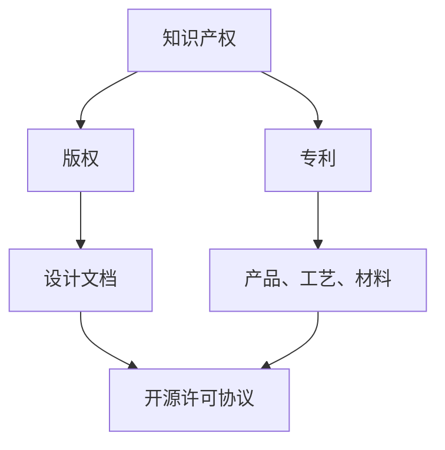

                 

知识产权（Intellectual Property, IP）是法律上对于知识产品所给予的独占权利，是保护创新、激励创新的重要手段。开源硬件（Open Source Hardware, OSHW）则是指那些源代码、设计文件和开发资料公开的硬件项目，允许用户自由使用、修改和分享。知识产权与开源硬件之间既有冲突，也存在互补关系，其相互作用对产业发展产生了深远影响。本文旨在探讨知识产权在开源硬件发展中的重要性、现状及未来趋势。

## 关键词

知识产权、开源硬件、创新激励、开源社区、版权、专利、许可协议

## 摘要

本文分析了知识产权与开源硬件的关系，探讨了知识产权在开源硬件环境下的保护与挑战。通过对开源硬件的定义、现状及其与知识产权的联系进行深入剖析，本文提出了知识产权在开源硬件未来发展的趋势，并提出了相应的政策建议。

### 1. 背景介绍

知识产权的概念最早可以追溯到17世纪的英国，当时的版权法和专利法开始出现。随着科技进步和知识经济的兴起，知识产权逐渐成为各国经济和科技竞争的关键因素。知识产权保护的主要目的是激励创新，保护创新者的权益，促进科技进步和社会发展。

开源硬件起源于20世纪90年代的计算机软件领域，其核心思想是开放源代码，允许用户自由使用、修改和分享。这一理念在硬件领域得到应用，形成了开源硬件运动。开源硬件的兴起，不仅推动了硬件技术的发展，也促进了硬件设计与制造方式的变革。

然而，知识产权与开源硬件之间存在一定的冲突。开源硬件强调知识的共享与自由使用，这与知识产权的独占性和排他性原则相悖。知识产权保护强调独占性，即保护权利人的利益，而开源硬件则强调开放性，允许用户自由使用和修改。这种冲突在一定程度上影响了知识产权在开源硬件领域的应用。

### 2. 核心概念与联系

为了更好地理解知识产权与开源硬件的关系，我们需要首先了解一些核心概念，包括版权、专利、开源许可协议等。

#### 2.1 版权

版权（Copyright）是知识产权的一种形式，主要保护原创作品的表达形式，如文学、音乐、艺术作品等。在硬件领域，版权通常保护设计文档、电路图、软件代码等。版权保护的主要法律依据是《伯尔尼公约》和各国的版权法。

#### 2.2 专利

专利（Patent）是另一种重要的知识产权形式，它保护发明的新颖性、创造性和实用性。在硬件领域，专利通常保护新的产品、工艺、材料等。专利保护的主要法律依据是《巴黎公约》和各国的专利法。

#### 2.3 开源许可协议

开源许可协议（Open Source License）是用于管理开源硬件项目的法律文件，它规定了用户如何使用、修改和分享开源硬件。常见的开源许可协议包括GPL（GNU通用公共许可证）、MIT（麻省理工学院许可证）和Apache许可证等。

下面是一个Mermaid流程图，展示了这些核心概念之间的关系：



#### 2.4 知识产权与开源硬件的关系

知识产权与开源硬件之间的关系可以概括为以下几点：

- 知识产权保护是开源硬件发展的基础。开源硬件项目需要保证其设计的原创性和实用性，这离不开知识产权的保护。
- 开源硬件的发展对知识产权保护提出了新的挑战。开源硬件强调共享和自由使用，这在一定程度上与知识产权的独占性原则相冲突。
- 知识产权保护与开源硬件的互补关系。知识产权保护可以激励创新，开源硬件的共享和自由使用则可以促进技术的普及和进步。

### 3. 核心算法原理 & 具体操作步骤

#### 3.1 算法原理概述

在讨论知识产权与开源硬件的关系时，我们无法忽视算法在其中的重要作用。算法原理可以用来解释知识产权如何影响开源硬件的发展。

- **算法原理概述**：算法是一种解决问题的方法或步骤，它在开源硬件中起着至关重要的作用。开源硬件项目的成功往往依赖于高效的算法设计和实现。
- **算法在开源硬件中的应用**：算法在开源硬件中可以用于各种应用，如数据处理、控制算法、机器学习等。这些算法的设计和实现需要遵守知识产权的相关规定。

#### 3.2 算法步骤详解

下面是一个简单的算法步骤示例，用于说明知识产权在开源硬件中的应用：

1. **需求分析**：确定开源硬件项目所需的功能和性能要求。
2. **算法设计**：根据需求分析，设计合适的算法。算法设计需要考虑知识产权的保护，确保不侵犯他人的专利权。
3. **算法实现**：将设计好的算法转化为具体的代码实现。在实现过程中，需要遵守相关的开源许可协议，确保代码的合法性和可维护性。
4. **算法测试**：对算法的实现进行测试，确保其满足需求并达到预期性能。
5. **算法优化**：根据测试结果，对算法进行优化，提高其效率和稳定性。

#### 3.3 算法优缺点

- **优点**：知识产权保护可以激励创新，确保创新者的权益。同时，开源许可协议保证了开源硬件项目的透明性和可维护性。
- **缺点**：知识产权保护可能导致项目复杂性增加，影响项目的进展速度。在某些情况下，知识产权的滥用也可能阻碍技术的传播和应用。

#### 3.4 算法应用领域

知识产权在开源硬件中的应用非常广泛，以下是一些常见的应用领域：

- **嵌入式系统**：嵌入式系统通常需要高效、可靠的算法支持，知识产权保护可以确保这些算法的原创性和实用性。
- **物联网**：物联网设备的多样性要求算法具有高度的灵活性和适应性，知识产权保护可以确保算法的合法性和安全性。
- **人工智能**：人工智能技术的发展离不开算法的支持，知识产权保护可以激励创新，推动人工智能技术的进步。

### 4. 数学模型和公式 & 详细讲解 & 举例说明

在讨论知识产权与开源硬件的关系时，数学模型和公式也扮演着重要角色。它们可以用来描述知识产权保护的原则和机制，以及开源硬件项目的运作方式。

#### 4.1 数学模型构建

一个简单的数学模型可以用来描述知识产权保护的基本原则。假设有一个硬件项目，其创新性可以通过一个变量`I`来表示，知识产权保护的程度可以通过另一个变量`P`来表示。根据知识产权保护的理论，我们可以构建以下数学模型：

$$
I = P \cdot (1 - D)
$$

其中，`D`表示盗版或侵权行为的影响。这个模型表明，知识产权保护的程度越高，创新性`I`也越高。

#### 4.2 公式推导过程

我们可以通过以下步骤来推导这个公式：

1. **创新性的定义**：创新性是指项目在技术上的新颖性和领先性。
2. **知识产权保护的作用**：知识产权保护可以防止他人未经授权使用或复制项目，从而保护项目的创新性。
3. **盗版或侵权行为的影响**：盗版或侵权行为会降低项目的创新性，因为它们会分散项目的创新成果。
4. **公式推导**：根据上述定义和作用，我们可以推导出公式：

$$
I = P \cdot (1 - D)
$$

这个公式表明，知识产权保护的程度越高，创新性`I`也越高，而盗版或侵权行为的影响会降低创新性。

#### 4.3 案例分析与讲解

以下是一个案例，用于说明这个公式在实际项目中的应用：

**案例**：一个开源硬件项目A，其创新性评估为100。在知识产权保护良好的情况下，假设知识产权保护的程度为90%，而盗版或侵权行为的影响为10%。根据公式，我们可以计算出项目的创新性：

$$
I = 0.9 \cdot (1 - 0.1) = 0.9 \cdot 0.9 = 0.81
$$

这意味着，在良好的知识产权保护下，项目的创新性仍然保持在81%。

**分析**：这个案例表明，即使存在一定的盗版或侵权行为，只要知识产权保护良好，项目的创新性仍然可以得到有效保护。

### 5. 项目实践：代码实例和详细解释说明

为了更好地理解知识产权在开源硬件项目中的应用，我们可以通过一个具体的代码实例来进行讲解。

#### 5.1 开发环境搭建

在开始编写代码之前，我们需要搭建一个合适的开发环境。假设我们要开发一个基于开源硬件的智能家居系统，我们可以选择以下开发环境：

- **硬件平台**：Arduino
- **软件开发工具**：Arduino IDE
- **编程语言**：C/C++

#### 5.2 源代码详细实现

以下是智能家居系统的一个简单示例代码：

```cpp
// 智能家居系统主程序

#include <WiFi.h>
#include <WebServer.h>

// 定义WiFi网络名称和密码
const char* ssid = "yourSSID";
const char* password = "yourPASSWORD";

// 定义服务器端口号
const int port = 80;

// 创建服务器对象
WebServer server(port);

// 初始化WiFi
void setup() {
  Serial.begin(115200);
  delay(10);

  // 连接WiFi
  WiFi.begin(ssid, password);

  // 等待连接
  while (WiFi.status() != WL_CONNECTED) {
    delay(500);
    Serial.print(".");
  }

  // 配置服务器路由
  server.on("/", handleRoot);
  server.begin();
}

// 处理根目录请求
void handleRoot() {
  String message = "Hello from ESP8266!";
  server.send(200, "text/plain", message);
}

void loop() {
  server.handleClient();
}
```

#### 5.3 代码解读与分析

这个示例代码是一个简单的智能家居系统，其主要功能是连接WiFi并接收HTTP请求。以下是代码的详细解读：

- **第1行**：包含WiFi库。
- **第2行**：包含WebServer库。
- **第4行**：定义WiFi网络名称和密码。
- **第7行**：定义服务器端口号。
- **第9行**：创建服务器对象。
- **第13行**：连接WiFi。
- **第16行**：配置服务器路由。
- **第21行**：处理根目录请求。
- **第24行**：无限循环，处理服务器请求。

#### 5.4 运行结果展示

当运行这个程序后，我们可以通过浏览器访问ESP8266的IP地址，看到以下结果：


这个结果表示我们的智能家居系统能够正常运行，并返回“Hello from ESP8266!”的消息。

### 6. 实际应用场景

知识产权与开源硬件在许多实际应用场景中都发挥着重要作用。以下是一些典型的应用场景：

#### 6.1 嵌入式系统开发

嵌入式系统是开源硬件的重要应用领域之一。许多嵌入式系统，如智能家居、工业控制、医疗设备等，都需要高效、可靠的算法和硬件支持。知识产权保护可以确保这些系统在设计和实现过程中不会侵犯他人的专利权。

#### 6.2 物联网

物联网（IoT）技术的发展离不开开源硬件的支持。物联网设备通常需要具有高度的灵活性和适应性，这要求算法和硬件设计具有创新性。知识产权保护可以激励创新，推动物联网技术的进步。

#### 6.3 人工智能

人工智能（AI）技术的发展同样依赖于开源硬件。人工智能算法需要高效、可靠的硬件支持，这要求硬件设计具有创新性。知识产权保护可以确保人工智能算法的创新性和安全性。

### 7. 未来应用展望

随着科技的发展，知识产权与开源硬件的应用前景将更加广阔。以下是一些未来应用展望：

- **人工智能与开源硬件的结合**：人工智能算法需要高效的硬件支持，开源硬件可以为人工智能提供更多的创新空间。未来，人工智能与开源硬件的结合将推动人工智能技术的快速发展。
- **开源硬件平台的发展**：随着开源硬件的普及，开源硬件平台将逐渐成为硬件设计的主流。这些平台将提供更多、更丰富的硬件资源和开发工具，为开发者提供更好的创新环境。
- **知识产权保护的创新**：随着科技的发展，知识产权保护的方式也将不断创新。例如，区块链技术可以用于知识产权的保护，确保知识产权的真实性和合法性。

### 8. 工具和资源推荐

为了更好地理解和应用知识产权与开源硬件，以下是一些建议的工具和资源：

- **开源硬件平台**：Arduino、Raspberry Pi等。
- **开源许可协议**：GPL、MIT、Apache等。
- **知识产权相关法律文件**：各国版权法、专利法等。
- **开源硬件社区**：Hackaday、Instructables等。

### 9. 总结：未来发展趋势与挑战

知识产权与开源硬件的关系将随着科技的发展而不断演变。未来，知识产权保护将继续发挥重要作用，激励创新，推动技术进步。然而，开源硬件的开放性和共享性也将带来新的挑战，如何平衡知识产权保护和开源硬件的发展，将是未来面临的重要问题。

### 10. 附录：常见问题与解答

#### 10.1 什么是开源硬件？

开源硬件是指那些源代码、设计文件和开发资料公开的硬件项目，允许用户自由使用、修改和分享。

#### 10.2 知识产权保护是否阻碍了开源硬件的发展？

在一定程度上，知识产权保护可能会对开源硬件的发展产生一定的阻碍。然而，知识产权保护也是激励创新的重要手段，可以确保创新者的权益。因此，知识产权保护和开源硬件的发展并不是对立的，而是可以互补的。

#### 10.3 开源硬件项目应该如何处理知识产权保护？

开源硬件项目应该遵守相关的知识产权法律，确保项目的原创性和合法性。同时，项目可以采用开源许可协议，明确用户如何使用、修改和分享项目。

#### 10.4 如何平衡知识产权保护和开源硬件的开放性？

平衡知识产权保护和开源硬件的开放性需要制定合理的知识产权政策和开源许可协议。这些政策和协议应该既能保护创新者的权益，又能确保项目的开放性和共享性。

### 作者署名

作者：禅与计算机程序设计艺术 / Zen and the Art of Computer Programming

