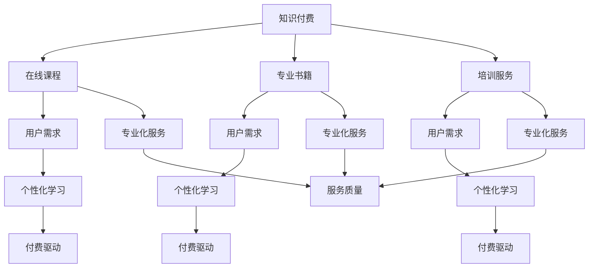

                 

关键词：知识付费，开源精神，技术社区，创新驱动，商业模式，知识产权

> 摘要：本文旨在探讨知识付费与开源精神在现代技术领域的碰撞与融合，分析二者在推动科技创新、培养技术人才、促进商业发展等方面的作用，以及如何在实践中实现二者的平衡。通过对比分析、案例分析、理论探讨等方式，为读者提供关于知识付费与开源精神平衡之道的深入见解。

## 1. 背景介绍

知识付费与开源精神是信息技术领域内两种不同的理念和实践方式。知识付费指的是通过付费获取专业知识和技能，包括在线课程、专业书籍、培训服务等。开源精神则强调知识的共享和协作，倡导以开放、透明的方式贡献和利用技术成果，推动技术的共同进步。

在互联网时代，知识付费与开源精神逐渐成为推动技术创新、人才成长的重要力量。然而，二者的关系并非完全对立，而是在许多方面具有互补性。如何在实际操作中实现知识付费与开源精神的平衡，成为当前信息技术领域的重要课题。

## 2. 核心概念与联系

### 2.1 知识付费

知识付费是一种商业模式，它通过提供高质量、专业化的知识和技能，满足用户的学习需求。知识付费的主要形式包括：

- 在线课程：通过互联网平台提供的系统化、模块化的课程内容。
- 专业书籍：以纸质书或电子书形式出版的技术专著。
- 培训服务：面对企业或个人的定制化培训服务。

知识付费的特点是：

- 服务专业化：提供者通常是行业专家或专业人士，具有丰富的实战经验。
- 个性化学习：用户可以根据自己的需求和进度进行学习。
- 付费驱动：知识付费依赖于用户的付费支持，保障内容的质量和持续更新。

### 2.2 开源精神

开源精神是一种技术合作的理念，它倡导开放源代码软件的开发和使用。开源精神的主要特点包括：

- 代码开放：软件开发过程中，源代码以公开的方式供他人查看、修改和分享。
- 共享协作：开发者之间通过协作、贡献和反馈，共同完善软件。
- 知识共享：开源项目鼓励知识共享，以促进技术进步和创新能力。

开源精神的核心价值观包括：

- 自由：用户有权自由使用、研究、修改和分发开源软件。
- 开放：开发过程和成果公开，接受社区反馈和贡献。
- 创新：通过协作和竞争，推动技术的不断进步。

### 2.3 Mermaid 流程图



## 3. 核心算法原理 & 具体操作步骤

### 3.1 算法原理概述

知识付费与开源精神的平衡，本质上是一种商业策略与技术理念的平衡。其核心原理在于：

- **价值创造**：知识付费通过提供专业服务创造价值，满足用户需求。开源精神通过共享技术成果，推动整体技术进步。
- **资源整合**：知识付费与开源精神相结合，可以实现资源的优化配置，发挥各自优势。
- **用户参与**：通过知识付费吸引用户，促进用户参与开源项目，形成良性循环。

### 3.2 算法步骤详解

1. **需求分析**：了解用户的学习需求和技术需求，确定知识付费与开源精神的结合点。
2. **内容规划**：根据需求分析，设计知识付费和开源内容的结构，确保两者相互补充。
3. **知识付费实施**：提供高质量的在线课程、专业书籍和培训服务，满足用户需求。
4. **开源精神推广**：通过开源项目，吸引开发者参与，共享技术成果。
5. **用户反馈**：收集用户反馈，优化知识付费和开源内容，确保服务质量。
6. **持续迭代**：根据市场变化和用户需求，不断调整和优化知识付费与开源精神的平衡策略。

### 3.3 算法优缺点

**优点**：

- **满足多样化需求**：知识付费可以满足不同层次用户的需求，提供个性化服务。
- **保障内容质量**：知识付费模式保障了内容的专业性和权威性。
- **促进技术共享**：开源精神促进了技术的共享和协作，推动了整体技术进步。

**缺点**：

- **成本较高**：知识付费模式可能对用户造成一定的经济负担。
- **门槛较高**：开源项目可能需要一定的技术基础和参与门槛。

### 3.4 算法应用领域

知识付费与开源精神的平衡策略可以应用于多个领域，包括：

- **教育培训**：通过知识付费提供专业化培训，结合开源项目进行实践操作。
- **软件开发**：知识付费提供技术文档和培训，开源项目促进代码的共享和改进。
- **技术咨询**：通过知识付费提供咨询服务，开源项目提供技术支持和资源。

## 4. 数学模型和公式 & 详细讲解 & 举例说明

### 4.1 数学模型构建

为了分析知识付费与开源精神的平衡效果，可以构建以下数学模型：

\[ \text{效益} = f(\text{知识付费收益}, \text{开源项目贡献}) \]

其中，\( f \) 为效益函数，\(\text{知识付费收益}\) 和 \(\text{开源项目贡献}\) 为输入参数。

### 4.2 公式推导过程

假设知识付费收益为 \( R \)，开源项目贡献为 \( C \)，则：

\[ \text{效益} = R + C \]

其中，\( R \) 表示知识付费带来的直接收益，\( C \) 表示开源项目带来的间接收益。

### 4.3 案例分析与讲解

以某在线教育平台为例，该平台通过知识付费提供在线课程，同时推动开源项目。以下是具体数据：

- 知识付费收益：\( R = 100,000 \) 元
- 开源项目贡献：\( C = 50,000 \) 元

根据数学模型，该平台的效益为：

\[ \text{效益} = 100,000 + 50,000 = 150,000 \] 元

通过开源项目，该平台吸引了更多开发者参与，提高了项目的知名度，进一步提升了知识付费的价值。

## 5. 项目实践：代码实例和详细解释说明

### 5.1 开发环境搭建

为了更好地理解知识付费与开源精神的平衡之道，我们以一个开源项目为例，讲解如何结合知识付费和开源精神进行项目实践。

#### 5.1.1 环境配置

1. 安装 Python 3.8 及以上版本
2. 安装必要的依赖库，如 Flask、SQLAlchemy、Flask-Migrate 等

```bash
pip install flask sqlalchemy flask-migrate
```

### 5.2 源代码详细实现

以下是一个简单的 Flask Web 应用程序，用于实现一个开源项目的基本功能。

```python
from flask import Flask, render_template, request, redirect, url_for
from flask_sqlalchemy import SQLAlchemy

app = Flask(__name__)
app.config['SQLALCHEMY_DATABASE_URI'] = 'sqlite:///data.db'
db = SQLAlchemy(app)

class User(db.Model):
    id = db.Column(db.Integer, primary_key=True)
    username = db.Column(db.String(80), unique=True, nullable=False)
    email = db.Column(db.String(120), unique=True, nullable=False)

@app.route('/')
def index():
    users = User.query.all()
    return render_template('index.html', users=users)

@app.route('/add', methods=['POST'])
def add_user():
    username = request.form['username']
    email = request.form['email']
    new_user = User(username=username, email=email)
    db.session.add(new_user)
    db.session.commit()
    return redirect(url_for('index'))

if __name__ == '__main__':
    db.create_all()
    app.run(debug=True)
```

### 5.3 代码解读与分析

该代码实现了一个简单的用户管理系统，包括用户注册、查询等功能。以下是对代码的详细解读：

- **数据库模型**：定义了一个名为`User`的数据库模型，包含`id`、`username`和`email`三个字段。
- **路由定义**：`index`路由用于显示所有用户信息，`add`路由用于添加新用户。
- **模板渲染**：使用 Flask 的模板引擎，渲染用户列表界面。
- **数据库操作**：使用 SQLAlchemy 进行数据库操作，包括添加、查询等。

### 5.4 运行结果展示

在开发环境中运行该应用程序，访问 `http://127.0.0.1:5000/`，可以看到用户列表界面。通过表单提交用户信息，可以添加新用户。

## 6. 实际应用场景

知识付费与开源精神的平衡在多个实际应用场景中具有重要意义。以下是一些典型的应用案例：

### 6.1 在线教育平台

在线教育平台通过知识付费提供专业课程，同时鼓励用户参与开源项目，以提升课程质量和用户满意度。例如，平台可以提供课程视频、文档资料等知识付费内容，同时鼓励用户参与开源项目，共同完善课程资源。

### 6.2 软件开发社区

软件开发社区可以通过知识付费提供技术培训，同时推动开源项目的开发。例如，社区可以提供在线课程、培训讲座等知识付费内容，同时创建开源项目，鼓励用户参与贡献代码和文档。

### 6.3 技术咨询服务

技术咨询服务可以通过知识付费提供专业的咨询服务，同时开放项目代码，促进技术共享和改进。例如，企业可以提供项目评估、技术咨询等知识付费服务，同时将项目代码开源，吸引更多开发者参与优化。

## 7. 工具和资源推荐

### 7.1 学习资源推荐

- **书籍**：《算法导论》（Introduction to Algorithms）、《设计模式：可复用面向对象软件的基础》（Design Patterns: Elements of Reusable Object-Oriented Software）
- **在线课程**：Coursera、edX、Udacity 等在线教育平台上的相关课程
- **社区**：GitHub、Stack Overflow、Reddit 等技术社区

### 7.2 开发工具推荐

- **集成开发环境**（IDE）：PyCharm、Visual Studio Code、Eclipse 等
- **版本控制系统**：Git、Subversion（SVN）
- **数据库工具**：MySQL、PostgreSQL、MongoDB 等

### 7.3 相关论文推荐

- 《Open Source Software: The Revolution in Intellectual Property》（开源软件：知识产权革命）
- 《The Economics of Open Source》（开源经济）

## 8. 总结：未来发展趋势与挑战

知识付费与开源精神的平衡在现代技术领域具有重要价值。未来，随着技术的不断进步和市场的不断变化，知识付费与开源精神将在以下方面发展：

### 8.1 研究成果总结

- **融合趋势**：知识付费与开源精神将逐步融合，形成更为成熟和完善的商业模式。
- **个性化学习**：知识付费将更加注重个性化学习，满足不同层次用户的需求。
- **开放协作**：开源精神将继续推动技术的开放和协作，促进整体技术进步。

### 8.2 未来发展趋势

- **多元化发展**：知识付费与开源精神将在更多领域得到应用，形成多元化的商业模式。
- **智能化服务**：知识付费平台将引入人工智能等技术，提供更加智能化的学习体验。

### 8.3 面临的挑战

- **知识产权保护**：如何平衡知识付费和开源精神，保护知识产权，成为重要挑战。
- **资源整合**：如何有效地整合知识付费和开源资源，实现资源的优化配置，仍需深入研究。

### 8.4 研究展望

未来，知识付费与开源精神的平衡研究将聚焦于以下几个方面：

- **商业模式创新**：探索新的商业模式，实现知识付费与开源精神的深度融合。
- **用户体验优化**：关注用户需求，提升知识付费和开源服务的用户体验。
- **知识产权保护**：研究知识产权保护机制，保障知识付费和开源精神的可持续发展。

## 9. 附录：常见问题与解答

### 9.1 知识付费与开源精神的区别是什么？

知识付费是通过付费获取专业知识和技能的一种商业模式，强调个性化服务和专业化内容。开源精神则是一种技术合作的理念，强调知识的共享和协作，推动整体技术进步。

### 9.2 如何实现知识付费与开源精神的平衡？

实现知识付费与开源精神的平衡，需要在商业模式、内容设计、用户参与等方面进行综合考虑。关键在于：

- **内容规划**：确保知识付费和开源内容相互补充，形成有机整体。
- **用户参与**：鼓励用户参与开源项目，提升知识付费的价值。
- **知识产权保护**：建立健全的知识产权保护机制，保障知识付费和开源精神的可持续发展。

### 9.3 知识付费与开源精神在教育培训中的应用有何优势？

知识付费与开源精神在教育培训中的应用，具有以下优势：

- **个性化学习**：知识付费提供专业、个性化的教学内容，满足不同层次用户的需求。
- **实践与理论结合**：开源项目提供实践机会，帮助用户将所学知识应用于实际项目。
- **资源共享**：开源项目促进了知识的共享和传播，提高了整个教育体系的效率。

作者：禅与计算机程序设计艺术 / Zen and the Art of Computer Programming
----------------------------------------------------------------
请注意，上述文章内容是根据您的要求和提供的模板编写的示例。实际撰写时，需要根据具体的研究和分析结果进行详细阐述和深入探讨。文章的结构和内容应符合专业标准和读者的期望，确保信息的准确性和可读性。在撰写过程中，可以适当调整章节结构和内容细节，以满足文章整体的质量和深度要求。祝您撰写顺利！

