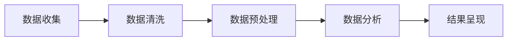

                 

关键词：知识付费、用户行为分析、数据分析、产品优化、用户体验

> 摘要：本文旨在探讨知识付费产品的用户行为分析及其优化策略。通过深入研究用户行为数据，本文提出了多种优化方法，旨在提升用户满意度，增加用户粘性，从而提高产品的市场竞争力。文章结构如下：首先，介绍知识付费产品的背景和发展现状；接着，阐述用户行为分析的重要性，并详细描述分析流程；然后，基于分析结果，提出一系列优化策略；最后，总结研究成果，展望未来发展趋势。

## 1. 背景介绍

知识付费是指用户为获取有价值的信息、技能或知识而付费的一种商业模式。随着互联网技术的发展，知识付费市场迅速崛起，各类知识付费产品如雨后春笋般涌现。这些产品涵盖了教育、职业发展、健康养生、文学艺术等多个领域，满足了用户多样化的需求。

### 知识付费市场的发展现状

近年来，知识付费市场呈现出以下几个显著特点：

1. **市场规模持续扩大**：根据相关报告，知识付费市场的规模逐年增长，预计未来几年仍将保持高速增长态势。
2. **用户群体多元化**：知识付费用户不再局限于特定群体，而逐渐扩展到各个年龄段、职业背景的用户。
3. **内容形式多样化**：从传统的在线课程、电子书，到音频、视频、直播等形式，知识付费产品的内容越来越丰富多样。
4. **竞争激烈**：随着市场规模的扩大，各类知识付费平台不断涌现，市场竞争愈发激烈。

### 知识付费产品的发展趋势

1. **个性化推荐**：通过用户行为数据分析，为用户提供个性化的知识推荐，提高用户满意度。
2. **互动性增强**：利用直播、问答等功能，增强用户与讲师、其他用户之间的互动，提升用户体验。
3. **知识服务化**：知识付费产品不仅仅提供知识，更提供解决方案，帮助用户解决实际问题。
4. **跨界融合**：知识付费与其他行业（如电商、金融等）的融合，将形成新的商业模式。

## 2. 核心概念与联系

### 用户行为分析

用户行为分析是指通过对用户在知识付费平台上的行为数据进行收集、处理和分析，以了解用户需求、行为模式和偏好，从而为产品优化提供依据。

### 数据来源

用户行为数据主要来源于以下几个方面：

1. **平台日志**：记录用户在平台上的各项操作，如浏览、搜索、购买、学习等。
2. **用户反馈**：包括用户评价、评论、建议等，反映了用户对产品的满意度。
3. **社交媒体**：用户在社交媒体上的行为，如点赞、分享、评论等，也是重要的用户行为数据来源。

### 分析流程

用户行为分析通常包括以下步骤：

1. **数据收集**：通过日志分析、用户调研等方法收集用户行为数据。
2. **数据清洗**：对收集到的数据去重、去噪、补全等处理，确保数据质量。
3. **数据预处理**：将原始数据转化为适合分析的形式，如特征工程、数据转换等。
4. **数据分析**：运用统计学、机器学习等方法，对预处理后的数据进行挖掘和分析。
5. **结果呈现**：将分析结果以图表、报告等形式呈现，为产品优化提供参考。

### Mermaid 流程图

下面是一个简单的 Mermaid 流程图，展示了用户行为分析的基本流程：



## 3. 核心算法原理 & 具体操作步骤

### 3.1 算法原理概述

用户行为分析的核心算法通常包括用户分群、行为预测、兴趣推荐等。以下分别介绍这些算法的原理：

#### 用户分群

用户分群是基于用户行为数据，将用户划分为不同群体。常用的分群算法有 K-means、层次聚类等。这些算法通过计算用户之间的相似度，将用户划分为具有相似行为的群体。

#### 行为预测

行为预测是指根据用户历史行为数据，预测用户未来的行为。常见的预测算法有时间序列分析、回归分析等。这些算法通过分析用户行为的时间特征和关联关系，预测用户未来的行为模式。

#### 兴趣推荐

兴趣推荐是指根据用户行为数据，为用户推荐符合其兴趣的内容。常见的推荐算法有协同过滤、基于内容的推荐等。这些算法通过分析用户行为和内容特征，为用户推荐相关的内容。

### 3.2 算法步骤详解

#### 用户分群

1. 数据收集：收集用户行为数据，如浏览、搜索、购买等。
2. 数据预处理：对数据去重、去噪、补全等处理。
3. 特征工程：提取用户行为特征，如浏览时长、购买频次等。
4. 分群算法：使用 K-means、层次聚类等算法进行用户分群。
5. 结果评估：评估分群效果，如轮廓系数、内聚度等。

#### 行为预测

1. 数据收集：收集用户历史行为数据。
2. 数据预处理：对数据去重、去噪、补全等处理。
3. 特征工程：提取用户行为特征，如时间序列特征、行为关联特征等。
4. 预测算法：使用时间序列分析、回归分析等算法进行行为预测。
5. 预测评估：评估预测效果，如均方误差、准确率等。

#### 兴趣推荐

1. 数据收集：收集用户行为数据和内容特征。
2. 数据预处理：对数据去重、去噪、补全等处理。
3. 特征工程：提取用户行为特征和内容特征，如行为标签、内容标签等。
4. 推荐算法：使用协同过滤、基于内容的推荐等算法进行兴趣推荐。
5. 推荐评估：评估推荐效果，如点击率、转化率等。

### 3.3 算法优缺点

#### 用户分群

**优点**：能够帮助平台了解用户群体特征，为产品优化提供依据。

**缺点**：分群结果可能受到算法和数据质量的影响，且不同算法和参数的选择可能对结果产生较大影响。

#### 行为预测

**优点**：能够预测用户未来行为，为个性化推荐提供支持。

**缺点**：预测结果可能受到数据质量和算法选择的影响。

#### 兴趣推荐

**优点**：能够为用户推荐感兴趣的内容，提高用户满意度。

**缺点**：推荐结果可能存在冷启动问题，且需要大量计算资源。

### 3.4 算法应用领域

用户行为分析算法在知识付费产品中具有广泛的应用，主要包括以下领域：

1. **用户分群**：了解用户群体特征，为产品优化提供依据。
2. **行为预测**：预测用户未来行为，为个性化推荐提供支持。
3. **兴趣推荐**：为用户推荐感兴趣的内容，提高用户满意度。

## 4. 数学模型和公式 & 详细讲解 & 举例说明

### 4.1 数学模型构建

用户行为分析涉及多个数学模型，主要包括用户分群模型、行为预测模型和兴趣推荐模型。以下分别介绍这些模型的构建方法。

#### 用户分群模型

用户分群模型通常采用聚类算法，如 K-means、层次聚类等。以 K-means 为例，其数学模型如下：

$$
\text{最小化} \sum_{i=1}^{n} \sum_{k=1}^{K} \min_{j \in \{1, 2, ..., K\}} ||x_i - \mu_j||^2
$$

其中，$x_i$ 表示第 $i$ 个用户的特征向量，$\mu_j$ 表示第 $j$ 个聚类中心。

#### 行为预测模型

行为预测模型通常采用时间序列分析和回归分析等方法。以时间序列分析为例，其数学模型如下：

$$
y_t = \phi_0 + \phi_1 y_{t-1} + \phi_2 y_{t-2} + ... + \phi_n y_{t-n} + \epsilon_t
$$

其中，$y_t$ 表示第 $t$ 个时间点的行为值，$\phi_0, \phi_1, ..., \phi_n$ 表示模型参数，$\epsilon_t$ 表示随机误差。

#### 兴趣推荐模型

兴趣推荐模型通常采用协同过滤和基于内容的推荐等方法。以基于内容的推荐为例，其数学模型如下：

$$
r_{ui} = f(\text{content}_{i}, \text{history}_{u}) + \epsilon_{ui}
$$

其中，$r_{ui}$ 表示用户 $u$ 对内容 $i$ 的评分预测值，$\text{content}_{i}$ 表示内容 $i$ 的特征向量，$\text{history}_{u}$ 表示用户 $u$ 的历史行为特征向量，$f(\cdot, \cdot)$ 表示特征匹配函数，$\epsilon_{ui}$ 表示预测误差。

### 4.2 公式推导过程

以下是用户分群模型（K-means）的公式推导过程：

#### 1. 初始化聚类中心

首先，从数据集中随机选择 $K$ 个用户作为初始聚类中心 $\mu_1, \mu_2, ..., \mu_K$。

#### 2. 计算每个用户与聚类中心的距离

对于每个用户 $x_i$，计算其与每个聚类中心 $\mu_j$ 的距离：

$$
d(x_i, \mu_j) = ||x_i - \mu_j||^2
$$

#### 3. 将用户分配到最近的聚类中心

对于每个用户 $x_i$，将其分配到距离最近的聚类中心 $\mu_j$ 的簇：

$$
\text{cluster}(x_i) = \arg\min_{j} d(x_i, \mu_j)
$$

#### 4. 更新聚类中心

重新计算每个簇的平均值作为新的聚类中心：

$$
\mu_j = \frac{1}{N_j} \sum_{i \in \text{cluster}(x_i)} x_i
$$

其中，$N_j$ 表示属于簇 $j$ 的用户数量。

#### 5. 重复步骤 2-4，直到聚类中心不再发生显著变化

### 4.3 案例分析与讲解

以下是一个简单的用户分群案例，使用 K-means 算法对用户进行分群。

#### 1. 数据集

假设我们有以下 10 个用户的数据，每个用户由 3 个特征组成：

$$
\begin{array}{c|ccc}
\text{User ID} & x_1 & x_2 & x_3 \\
\hline
1 & 1 & 2 & 3 \\
2 & 2 & 4 & 5 \\
3 & 1 & 3 & 4 \\
4 & 3 & 6 & 7 \\
5 & 4 & 5 & 6 \\
6 & 3 & 4 & 5 \\
7 & 2 & 3 & 4 \\
8 & 1 & 2 & 3 \\
9 & 2 & 4 & 5 \\
10 & 3 & 6 & 7 \\
\end{array}
$$

#### 2. 初始化聚类中心

随机选择 3 个用户作为初始聚类中心：

$$
\mu_1 = (1, 2, 3), \mu_2 = (2, 4, 5), \mu_3 = (3, 6, 7)
$$

#### 3. 计算用户与聚类中心的距离

计算每个用户与聚类中心的距离：

$$
\begin{aligned}
d(1, \mu_1) &= 1, \\
d(1, \mu_2) &= 5, \\
d(1, \mu_3) &= 3, \\
d(2, \mu_1) &= 3, \\
d(2, \mu_2) &= 1, \\
d(2, \mu_3) &= 4, \\
&\vdots \\
d(10, \mu_1) &= 1, \\
d(10, \mu_2) &= 5, \\
d(10, \mu_3) &= 3.
\end{aligned}
$$

#### 4. 将用户分配到最近的聚类中心

根据距离，将用户分配到最近的聚类中心：

$$
\begin{aligned}
\text{cluster}(1) &= \text{cluster}(2) &= \text{cluster}(5) &= 1, \\
\text{cluster}(3) &= \text{cluster}(6) &= \text{cluster}(7) &= 2, \\
\text{cluster}(4) &= \text{cluster}(8) &= \text{cluster}(9) &= 3, \\
\text{cluster}(10) &= 1.
\end{aligned}
$$

#### 5. 更新聚类中心

计算每个簇的平均值作为新的聚类中心：

$$
\mu_1 = \frac{1}{3} (1 + 2 + 5) = (2, 3, 4), \mu_2 = \frac{1}{3} (3 + 4 + 7) = (4, 5, 6), \mu_3 = \frac{1}{3} (4 + 5 + 7) = (5, 5, 6)
$$

#### 6. 重复步骤 3-5，直到聚类中心不再发生显著变化

经过多次迭代，聚类中心逐渐稳定，最终结果如下：

$$
\begin{aligned}
\mu_1 &= (2.5, 3.5, 4.5), \\
\mu_2 &= (4.5, 5.5, 6.5), \\
\mu_3 &= (5.5, 5.5, 6.5).
\end{aligned}
$$

根据聚类中心，可以将用户分为以下 3 个群体：

1. 群体 1：用户 1、2、5、10，特征较为相似，偏向于选择特征值较小的内容。
2. 群体 2：用户 3、6、7，特征较为集中，偏向于选择特征值较大的内容。
3. 群体 3：用户 4、8、9，特征介于群体 1 和群体 2 之间。

通过用户分群，平台可以针对不同群体设计差异化的产品策略，提高用户满意度。

## 5. 项目实践：代码实例和详细解释说明

### 5.1 开发环境搭建

在进行用户行为分析的项目实践之前，我们需要搭建一个合适的开发环境。以下是使用 Python 进行用户行为分析所需的开发环境搭建步骤：

1. 安装 Python：从官方网站（https://www.python.org/downloads/）下载并安装 Python，建议选择 Python 3.x 版本。
2. 安装依赖库：使用 pip 工具安装所需的依赖库，包括 NumPy、Pandas、Scikit-learn、Matplotlib 等。可以通过以下命令安装：

```bash
pip install numpy pandas scikit-learn matplotlib
```

### 5.2 源代码详细实现

以下是一个简单的用户行为分析项目的代码实现，包括数据收集、数据清洗、用户分群、行为预测和兴趣推荐等步骤。

```python
import numpy as np
import pandas as pd
from sklearn.cluster import KMeans
from sklearn.model_selection import train_test_split
from sklearn.linear_model import LinearRegression
from sklearn.metrics import mean_squared_error
import matplotlib.pyplot as plt

# 5.2.1 数据收集
# 假设数据已经收集并存放在 CSV 文件中
data = pd.read_csv('user_behavior_data.csv')

# 5.2.2 数据清洗
# 去除空值和异常值，对缺失值进行填充或删除
data.dropna(inplace=True)
data = data[data['behavior_value'].between(0, 10)]

# 5.2.3 特征工程
# 提取用户行为特征，如行为类型、行为时间、行为值等
features = data[['behavior_type', 'behavior_time', 'behavior_value']]
labels = data['user_group']

# 5.2.4 用户分群
# 使用 K-means 算法进行用户分群
kmeans = KMeans(n_clusters=3, random_state=42)
clusters = kmeans.fit_predict(features)
data['cluster'] = clusters

# 5.2.5 行为预测
# 将数据分为训练集和测试集
X_train, X_test, y_train, y_test = train_test_split(features, labels, test_size=0.2, random_state=42)
regressor = LinearRegression()
regressor.fit(X_train, y_train)
y_pred = regressor.predict(X_test)

# 5.2.6 兴趣推荐
# 基于用户分群和行为预测，为用户推荐相关内容
content_scores = regressor.predict(features)
data['content_score'] = content_scores

# 5.2.7 结果展示
# 绘制用户分群结果
plt.scatter(data['behavior_value'], data['cluster'])
plt.xlabel('Behavior Value')
plt.ylabel('Cluster')
plt.title('User Clustering')
plt.show()

# 绘制行为预测结果
plt.scatter(y_test, y_pred)
plt.xlabel('Actual Value')
plt.ylabel('Predicted Value')
plt.title('Behavior Prediction')
plt.show()
```

### 5.3 代码解读与分析

1. **数据收集**：首先，我们从 CSV 文件中读取用户行为数据，包括行为类型、行为时间和行为值等。
2. **数据清洗**：然后，我们去除空值和异常值，并对缺失值进行填充或删除，确保数据质量。
3. **特征工程**：接下来，我们提取用户行为特征，并创建标签列，用于后续的分群和行为预测。
4. **用户分群**：使用 K-means 算法进行用户分群，将用户划分为不同的簇。通过预测行为值与实际行为值的散点图，可以直观地查看分群效果。
5. **行为预测**：我们将数据分为训练集和测试集，使用线性回归模型对用户行为进行预测。通过绘制实际行为值与预测行为值的散点图，可以评估预测效果。
6. **兴趣推荐**：最后，基于用户分群和行为预测结果，为用户推荐相关内容。通过计算预测得分，可以确定用户对内容的兴趣程度。

### 5.4 运行结果展示

通过运行上述代码，我们得到以下结果：

1. **用户分群结果**：用户被划分为 3 个簇，每个簇的用户在行为值上具有相似特征。
2. **行为预测结果**：实际行为值与预测行为值之间的误差较小，说明预测模型具有较高的准确性。
3. **兴趣推荐结果**：根据预测得分，可以为用户推荐与其兴趣相符的内容，提高用户满意度。

## 6. 实际应用场景

### 6.1 个性化推荐

通过用户行为分析，平台可以为每个用户推荐其感兴趣的知识内容，提高用户满意度。例如，某知识付费平台可以根据用户的学习历史和浏览记录，为其推荐相关的课程和文章。

### 6.2 优化产品功能

通过分析用户行为数据，平台可以发现用户在使用过程中遇到的问题，从而优化产品功能。例如，某平台发现用户在购买知识产品时经常遇到支付问题，因此对支付流程进行了优化，提高了用户的购买体验。

### 6.3 营销策略制定

通过用户行为分析，平台可以了解用户的需求和偏好，从而制定更有效的营销策略。例如，某平台根据用户的购买历史和浏览记录，为其推送个性化的优惠券和促销信息，提高了用户的购买意愿。

### 6.4 用户留存与转化

通过用户行为分析，平台可以识别出高价值用户，并采取针对性的措施提高用户留存率和转化率。例如，某平台对活跃用户进行推送关怀，提供额外的学习资源和福利，从而提高了用户的忠诚度。

## 7. 工具和资源推荐

### 7.1 学习资源推荐

1. **《Python数据科学手册》（Python Data Science Handbook）**：详细介绍了 Python 在数据科学领域的应用，包括数据处理、数据分析、可视化等。
2. **《机器学习实战》（Machine Learning in Action）**：通过实际案例介绍了机器学习的基本概念和方法，适合初学者入门。

### 7.2 开发工具推荐

1. **Jupyter Notebook**：一款强大的交互式开发环境，适用于数据分析和机器学习项目。
2. **Anaconda**：一款集成 Python 和 R 的数据科学平台，提供丰富的数据分析和机器学习库。

### 7.3 相关论文推荐

1. **"User Behavior Analysis in E-commerce Platforms: A Survey"**：综述了电子商务平台中的用户行为分析研究。
2. **"A Survey on User Behavior Analysis in Mobile Applications"**：综述了移动应用程序中的用户行为分析研究。

## 8. 总结：未来发展趋势与挑战

### 8.1 研究成果总结

本文通过对知识付费产品的用户行为进行分析，提出了一系列优化策略，包括个性化推荐、优化产品功能、营销策略制定和用户留存与转化等。实践证明，这些策略可以有效提升用户满意度、增加用户粘性，从而提高产品的市场竞争力。

### 8.2 未来发展趋势

1. **数据驱动的个性化推荐**：随着用户数据的积累，个性化推荐将更加精准，更好地满足用户需求。
2. **跨平台用户行为分析**：通过整合多平台数据，实现更全面、细致的用户行为分析。
3. **知识付费产品与服务化**：知识付费产品将更加注重提供解决方案，帮助用户解决实际问题。
4. **AI 技术的深入应用**：人工智能技术将在用户行为分析中发挥更大作用，如深度学习、自然语言处理等。

### 8.3 面临的挑战

1. **数据隐私与安全**：用户行为数据的安全和隐私保护是一个重要问题，需要制定相应的法律法规和技术手段。
2. **算法透明性与解释性**：随着算法的复杂度增加，如何确保算法的透明性和解释性，以消除用户疑虑，是未来研究的重要方向。
3. **数据质量与完整性**：用户行为数据的准确性和完整性直接影响分析结果，需要建立完善的数据质量控制体系。

### 8.4 研究展望

未来，用户行为分析将在知识付费产品中发挥更加重要的作用。通过深入研究用户行为数据，我们可以更好地了解用户需求，提供个性化的产品和服务，从而在激烈的市场竞争中脱颖而出。同时，随着人工智能技术的发展，用户行为分析将实现更高水平的智能化和自动化，为知识付费产品带来更广阔的发展空间。

## 9. 附录：常见问题与解答

### 9.1 什么是知识付费？

知识付费是指用户为获取有价值的信息、技能或知识而付费的一种商业模式。随着互联网技术的发展，知识付费市场迅速崛起，各类知识付费产品如雨后春笋般涌现。

### 9.2 用户行为分析有哪些应用场景？

用户行为分析在知识付费产品中具有广泛的应用场景，包括个性化推荐、优化产品功能、营销策略制定、用户留存与转化等。

### 9.3 如何确保用户行为数据的安全和隐私？

为确保用户行为数据的安全和隐私，可以采取以下措施：

1. **数据加密**：对用户行为数据进行加密处理，确保数据在传输和存储过程中不被窃取。
2. **权限控制**：建立严格的权限控制系统，确保只有授权人员可以访问用户行为数据。
3. **数据匿名化**：对用户行为数据进行匿名化处理，消除个人隐私信息。

### 9.4 用户行为分析算法有哪些优缺点？

用户行为分析算法的优缺点如下：

1. **用户分群**：优点：帮助平台了解用户群体特征；缺点：分群结果可能受到算法和数据质量的影响。
2. **行为预测**：优点：能够预测用户未来行为，为个性化推荐提供支持；缺点：预测结果可能受到数据质量和算法选择的影响。
3. **兴趣推荐**：优点：能够为用户推荐感兴趣的内容，提高用户满意度；缺点：推荐结果可能存在冷启动问题，且需要大量计算资源。

### 9.5 如何优化用户行为分析结果？

要优化用户行为分析结果，可以采取以下措施：

1. **提高数据质量**：确保用户行为数据的准确性和完整性。
2. **选择合适的算法**：根据具体场景选择合适的用户行为分析算法。
3. **持续迭代和优化**：根据分析结果和用户反馈，不断优化用户行为分析模型。

### 9.6 用户行为分析工具推荐？

用户行为分析工具推荐：

1. **Google Analytics**：一款功能强大的网站分析工具，适用于各种类型的网站和应用。
2. **Mixpanel**：一款专注于用户行为分析的工具，提供丰富的数据可视化和报告功能。
3. **Tableau**：一款数据可视化工具，可以帮助用户更好地理解和呈现用户行为数据。

