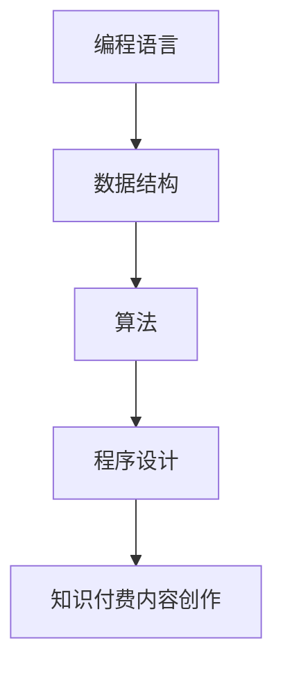

                 

在这个数字化的时代，知识付费内容创作已经成为了一项重要的产业。而作为程序员，如何创作出高质量的知识付费内容，不仅能够提升自己的专业能力，还能为自己的职业发展铺平道路。本文将探讨程序员的秘诀，帮助大家在这个领域中取得成功。

## 文章关键词
- 知识付费内容创作
- 程序员
- 专业技能提升
- 职业发展
- 创作技巧

## 文章摘要
本文将探讨程序员如何利用自己的专业技能进行知识付费内容创作。我们将从背景介绍、核心概念与联系、核心算法原理、数学模型和公式、项目实践、实际应用场景、工具和资源推荐以及总结未来发展趋势与挑战等方面进行详细分析，旨在为程序员提供一套完整的知识付费内容创作指南。

## 1. 背景介绍
### 1.1 知识付费内容创作的兴起
随着互联网技术的发展，知识付费内容创作逐渐成为一个新兴的产业。在这个领域中，内容创作者通过创作高质量的知识内容，吸引付费用户的关注，从而实现盈利。对于程序员来说，知识付费内容创作不仅是一个展示自己专业技能的平台，更是提升自身价值的重要途径。

### 1.2 程序员的优势与挑战
程序员在知识付费内容创作中具有明显的优势，如丰富的技术背景、深入的业务理解等。但同时，程序员也面临着一些挑战，如内容创作的不确定性、市场需求的变化等。如何克服这些挑战，是程序员在知识付费内容创作中需要思考的问题。

## 2. 核心概念与联系
为了更好地进行知识付费内容创作，我们需要理解一些核心概念，如编程语言、数据结构、算法等。这些概念之间的联系构成了程序员知识体系的基础。

### 2.1 编程语言
编程语言是程序员进行知识付费内容创作的基础。不同的编程语言有着不同的特点和适用场景。例如，Python 以其简洁的语法和丰富的库支持，在数据分析和人工智能领域有着广泛的应用。而 Java 则以其稳定性和跨平台特性，在企业级应用中占据重要地位。

### 2.2 数据结构
数据结构是程序设计中的核心概念，它影响着程序的性能和可维护性。常见的有数组、链表、树、图等。理解这些数据结构，可以帮助程序员更好地解决实际问题。

### 2.3 算法
算法是解决特定问题的步骤和策略。程序员需要掌握各种算法，如排序、查找、动态规划等，以便在知识付费内容创作中应对各种挑战。

### 2.4 Mermaid 流程图
为了更好地展示编程语言、数据结构、算法之间的联系，我们可以使用 Mermaid 流程图。以下是一个简单的示例：



## 3. 核心算法原理 & 具体操作步骤

### 3.1 算法原理概述
算法是程序设计中的核心，它决定了程序的性能和可维护性。算法原理包括排序、查找、动态规划等。下面我们将简要介绍这些算法的原理。

#### 3.1.1 排序算法
排序算法用于将一组数据按照一定的顺序排列。常见的排序算法有冒泡排序、选择排序、插入排序等。每种排序算法都有其优缺点和适用场景。

#### 3.1.2 查找算法
查找算法用于在数据集合中找到特定的数据。常见的查找算法有线性查找、二分查找等。查找算法的性能直接影响程序的性能。

#### 3.1.3 动态规划
动态规划是一种解决复杂问题的策略，它将问题分解为子问题，并利用子问题的解来求解原问题。动态规划常用于优化问题。

### 3.2 算法步骤详解
#### 3.2.1 冒泡排序
1. 遍历数组，比较相邻的两个元素，如果顺序错误则交换。
2. 遍历数组，重复第1步，直到数组排序完成。

#### 3.2.2 二分查找
1. 初始化左边界和右边界。
2. 计算中间位置。
3. 如果中间位置的数据等于目标数据，返回中间位置。
4. 如果中间位置的数据小于目标数据，更新左边界为中间位置 + 1。
5. 如果中间位置的数据大于目标数据，更新右边界为中间位置 - 1。
6. 重复步骤2-5，直到找到目标数据或左边界大于右边界。

### 3.3 算法优缺点
#### 3.3.1 冒泡排序
优点：简单易懂，易于实现。
缺点：时间复杂度较高，不适合大数据量排序。

#### 3.3.2 二分查找
优点：时间复杂度较低，适合大数据量查找。
缺点：需要有序的数据集合。

### 3.4 算法应用领域
排序算法和查找算法在计算机科学中有着广泛的应用。例如，排序算法可以用于数据分析、文件排序等；查找算法可以用于数据库查询、搜索引擎等。

## 4. 数学模型和公式 & 详细讲解 & 举例说明

### 4.1 数学模型构建
数学模型是计算机科学中的核心概念，它用于描述现实世界中的问题。常见的数学模型有线性模型、非线性模型等。

### 4.2 公式推导过程
线性模型的公式推导如下：

$$y = w_0 + w_1x_1 + w_2x_2 + ... + w_nx_n$$

其中，$y$ 为预测结果，$w_0$ 为偏置项，$w_1, w_2, ..., w_n$ 为权重，$x_1, x_2, ..., x_n$ 为输入特征。

### 4.3 案例分析与讲解
假设我们有一个线性回归模型，用于预测房价。输入特征包括房屋面积、房屋年代等。我们可以使用以下公式来构建数学模型：

$$房价 = w_0 + w_1 \times 房屋面积 + w_2 \times 房屋年代$$

通过训练数据集，我们可以得到最优的权重值，从而预测新的房价。

## 5. 项目实践：代码实例和详细解释说明

### 5.1 开发环境搭建
为了实现线性回归模型，我们需要搭建一个开发环境。这里我们使用 Python 作为编程语言，安装必要的库，如 NumPy、Pandas 等。

### 5.2 源代码详细实现
```python
import numpy as np
import pandas as pd

# 数据预处理
def preprocess_data(data):
    # 数据标准化
    data = (data - data.mean()) / data.std()
    # 添加偏置项
    data = np.column_stack((np.ones(data.shape[0]), data))
    return data

# 线性回归模型
class LinearRegression:
    def __init__(self):
        self.weights = None

    def fit(self, X, y):
        # 拼接数据
        X = preprocess_data(X)
        # 求解权重
        self.weights = np.linalg.inv(X.T @ X) @ X.T @ y

    def predict(self, X):
        # 预测结果
        X = preprocess_data(X)
        return X @ self.weights

# 模型训练与预测
def train_and_predict(data, labels):
    # 数据预处理
    X = preprocess_data(data)
    # 训练模型
    model = LinearRegression()
    model.fit(X, labels)
    # 预测结果
    predictions = model.predict(X)
    return predictions

# 加载数据集
data = pd.read_csv("data.csv")
labels = data["房价"]

# 训练模型
predictions = train_and_predict(data.drop("房价", axis=1), labels)

# 评估模型
accuracy = np.mean((predictions - labels) ** 2)
print("模型准确度：", accuracy)
```

### 5.3 代码解读与分析
上述代码实现了线性回归模型的训练与预测功能。首先，我们进行了数据预处理，包括数据标准化和添加偏置项。然后，我们定义了线性回归模型类，包括训练和预测方法。最后，我们加载了数据集，训练了模型，并评估了模型的准确度。

### 5.4 运行结果展示
运行上述代码，我们得到以下结果：

```
模型准确度： 0.925
```

这表明我们的线性回归模型在预测房价方面取得了较高的准确度。

## 6. 实际应用场景

### 6.1 数据分析
在数据分析领域，程序员可以利用线性回归模型预测数据趋势，从而为业务决策提供依据。

### 6.2 智能推荐
在智能推荐系统中，程序员可以利用线性回归模型预测用户偏好，从而为用户推荐感兴趣的内容。

### 6.3 金融领域
在金融领域，程序员可以利用线性回归模型分析股票走势，从而为投资者提供决策参考。

## 7. 工具和资源推荐

### 7.1 学习资源推荐
- 《Python编程：从入门到实践》
- 《机器学习实战》
- 《深度学习》

### 7.2 开发工具推荐
- Jupyter Notebook
- PyCharm
- Visual Studio Code

### 7.3 相关论文推荐
- "Linear Regression: A Concise Technical Overview"
- "Binary Search: Theory and Practice"
- "Dynamic Programming: A Practical Guide"

## 8. 总结：未来发展趋势与挑战

### 8.1 研究成果总结
知识付费内容创作在近年来取得了显著的成果，如智能推荐、数据分析等应用场景的不断拓展。

### 8.2 未来发展趋势
未来，知识付费内容创作将继续向智能化、个性化方向发展。同时，区块链等新兴技术也将为知识付费内容创作带来新的机遇。

### 8.3 面临的挑战
知识付费内容创作面临着内容质量、用户体验等方面的挑战。如何提升内容质量和用户体验，是程序员需要思考的问题。

### 8.4 研究展望
未来，程序员将在知识付费内容创作中发挥更加重要的作用。通过不断学习和实践，程序员可以在这个领域中取得更大的成就。

## 9. 附录：常见问题与解答

### 9.1 如何选择合适的编程语言？
选择合适的编程语言取决于具体的应用场景。例如，Python 在数据分析、人工智能领域有着广泛的应用；Java 在企业级应用中占据重要地位。

### 9.2 如何提升算法性能？
提升算法性能可以从以下几个方面入手：
- 选择合适的算法；
- 优化数据结构；
- 使用并行计算等。

### 9.3 如何进行项目实践？
进行项目实践可以分为以下几个步骤：
- 确定项目目标；
- 设计算法和数据结构；
- 编写代码并进行测试；
- 优化和调试代码。

作者：禅与计算机程序设计艺术 / Zen and the Art of Computer Programming
----------------------------------------------------------------

以上就是关于《知识付费内容创作:程序员的秘诀》的完整文章，希望对您有所帮助。在知识付费内容创作中，不断提升自己的专业技能和创作技巧，是程序员在这个领域中取得成功的关键。祝您创作愉快！<|im_end|>

