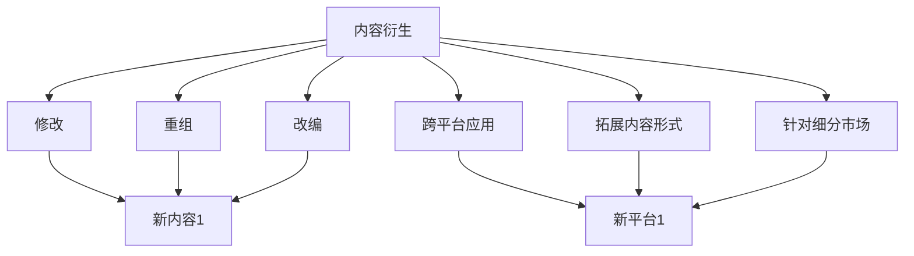

                 

关键词：知识付费、内容复用、内容衍生、创业、技术文档、课程设计、在线教育、版权问题

> 摘要：本文探讨了知识付费创业领域中，如何通过内容复用与衍生策略来提高效率、降低成本，并确保版权合规。文章分析了内容复用的概念、方法及其在创业项目中的应用，同时探讨了内容衍生策略，提供了具体的实施步骤和案例分析，旨在为创业者提供可行的操作指南。

## 1. 背景介绍

知识付费作为一种新兴的商业模式，近年来在全球范围内迅速崛起。它不仅改变了人们的消费习惯，也为创业者提供了丰富的机会。知识付费的核心在于提供有价值的信息和服务，以获取收益。然而，随着市场竞争的加剧，如何高效地利用内容资源，成为创业者需要解决的重要问题。

内容复用和内容衍生是提高知识付费项目效率的有效策略。内容复用指的是在保持内容核心价值不变的前提下，通过修改、重组或改编原有内容，创造新的产品或服务。内容衍生则是在原有内容的基础上，拓展新的应用场景或产品形态，以满足不同用户的需求。这两者相辅相成，有助于降低创业成本，提高市场竞争力。

### 1.1 知识付费市场现状

当前，知识付费市场呈现出以下几个特点：

1. **市场规模不断扩大**：随着互联网技术的发展，知识付费市场的用户基数持续增长，市场潜力巨大。
2. **内容多样化**：从早期的在线课程、电子书，到音频、视频等多种形式，知识付费的内容类型越来越丰富。
3. **竞争加剧**：大量创业者涌入市场，竞争激烈，生存挑战增加。
4. **用户需求个性化**：用户对知识内容的需求越来越个性化，细分市场逐渐显现。

### 1.2 内容复用与内容衍生的意义

内容复用和内容衍生在知识付费创业中具有重要意义：

1. **提高效率**：通过复用已有内容，可以节省开发和制作时间，提高项目推进速度。
2. **降低成本**：复用和衍生策略可以有效降低内容制作成本，提高项目的经济性。
3. **满足多样化需求**：通过内容衍生，可以拓展产品的应用范围，满足不同用户的需求，增加市场份额。
4. **提升竞争力**：高效的内容利用策略可以帮助创业者在激烈的市场竞争中脱颖而出。

## 2. 核心概念与联系

为了更好地理解内容复用与衍生，我们需要明确几个核心概念：

- **内容复用**：指在保持内容核心价值不变的前提下，利用已有的内容资源，通过修改、重组或改编，创造新的产品或服务。
- **内容衍生**：指在原有内容的基础上，拓展新的应用场景或产品形态，以满足不同用户的需求。

### 2.1 内容复用方法

内容复用的方法主要包括以下几种：

1. **修改**：对原有内容进行修改，以适应新的需求或场景。
2. **重组**：将多个内容单元进行重新组合，形成新的内容。
3. **改编**：对原有内容进行创意改编，以创造出全新的内容。

### 2.2 内容衍生策略

内容衍生策略主要包括以下几种：

1. **跨平台应用**：将原有内容拓展到新的平台或渠道，如从线上拓展到线下，或从移动端拓展到桌面端。
2. **拓展内容形式**：将原有内容拓展到新的形式，如从图文拓展到视频，或从音频拓展到互动式学习。
3. **针对细分市场**：针对特定用户群体的需求，对原有内容进行细分和定制。

### 2.3 Mermaid 流程图

以下是内容复用与内容衍生的 Mermaid 流程图：



## 3. 核心算法原理 & 具体操作步骤

### 3.1 算法原理概述

内容复用与衍生算法的核心原理在于充分利用已有资源，通过技术手段实现内容的修改、重组和改编。具体步骤如下：

1. **内容识别**：利用自然语言处理、图像识别等技术，对原有内容进行识别和分析。
2. **内容修改**：根据用户需求，对识别出的内容进行修改，以适应新的场景。
3. **内容重组**：将多个内容单元进行重新组合，形成新的内容。
4. **内容改编**：对原有内容进行创意改编，以创造出全新的内容。
5. **内容发布**：将修改、重组或改编后的内容发布到新的平台或渠道。

### 3.2 算法步骤详解

1. **内容识别**：
   - 利用自然语言处理技术，对文本内容进行分词、词性标注、实体识别等处理。
   - 利用图像识别技术，对图片内容进行分类、标注等处理。

2. **内容修改**：
   - 根据用户需求，对识别出的内容进行文字、图像的修改。
   - 利用文本生成技术，自动生成符合需求的新文本。

3. **内容重组**：
   - 利用内容排序、分类等技术，将多个内容单元进行重新组合。
   - 通过可视化技术，展示重组后的内容。

4. **内容改编**：
   - 利用创意生成技术，对原有内容进行创意改编。
   - 结合用户反馈，不断优化改编后的内容。

5. **内容发布**：
   - 将修改、重组或改编后的内容发布到新的平台或渠道。
   - 根据用户反馈，调整发布策略。

### 3.3 算法优缺点

1. **优点**：
   - 提高内容利用效率，降低制作成本。
   - 满足多样化用户需求，提高市场竞争力。
   - 快速响应市场变化，提高项目推进速度。

2. **缺点**：
   - 对技术要求较高，需要大量投入。
   - 可能会降低内容质量，影响用户体验。

### 3.4 算法应用领域

内容复用与衍生算法在多个领域具有广泛应用：

1. **在线教育**：通过内容复用与衍生，为用户提供多样化的学习资源。
2. **电子书出版**：利用内容复用技术，快速推出不同版本的书。
3. **影视制作**：通过内容衍生，拓展影视作品的衍生品市场。

## 4. 数学模型和公式 & 详细讲解 & 举例说明

### 4.1 数学模型构建

在内容复用与衍生过程中，数学模型可以用来量化内容的价值和影响力。以下是一个简单的数学模型：

$$
V = f(A, B, C)
$$

其中，$V$ 表示内容的价值，$A$ 表示内容的原创性，$B$ 表示内容的可修改性，$C$ 表示内容的适应性。

### 4.2 公式推导过程

1. **内容原创性 $A$**：
   $$ A = \frac{D - R}{D} $$
   其中，$D$ 表示内容的总信息量，$R$ 表示内容中的重复信息量。

2. **内容可修改性 $B$**：
   $$ B = \frac{M}{N} $$
   其中，$M$ 表示可修改的信息量，$N$ 表示总信息量。

3. **内容适应性 $C$**：
   $$ C = \frac{C_1 + C_2 + C_3}{3} $$
   其中，$C_1$ 表示内容的跨平台适应性，$C_2$ 表示内容的跨形式适应性，$C_3$ 表示内容的跨市场适应性。

### 4.3 案例分析与讲解

假设有一个在线教育平台，其内容库中包含100篇教学文章。通过对这些文章的原创性、可修改性和适应性进行分析，可以计算出每篇文章的价值。

- 原创性 $A$：
  假设每篇文章的平均信息量为1000字，其中重复信息量为200字，则：
  $$ A = \frac{1000 - 200}{1000} = 0.8 $$

- 可修改性 $B$：
  假设每篇文章中有500字可以修改，总字数为1000字，则：
  $$ B = \frac{500}{1000} = 0.5 $$

- 适应性 $C$：
  假设每篇文章在不同平台、不同形式和不同市场中的适应度分别为0.6、0.7和0.8，则：
  $$ C = \frac{0.6 + 0.7 + 0.8}{3} = 0.17 $$

根据上述公式，可以计算出每篇文章的价值：

$$
V = f(A, B, C) = 0.8 \times 0.5 \times 0.67 = 0.28
$$

因此，每篇文章的价值为0.28。通过这个模型，平台可以更好地利用内容资源，制定相应的推广策略。

## 5. 项目实践：代码实例和详细解释说明

### 5.1 开发环境搭建

为了实现内容复用与衍生的代码实例，我们选择了Python编程语言，并结合多个开源库，如自然语言处理库NLTK、图像处理库PIL和机器学习库scikit-learn。

```bash
# 安装所需库
pip install nltk pillow scikit-learn
```

### 5.2 源代码详细实现

以下是一个简单的Python代码实例，用于实现内容修改、重组和改编：

```python
import nltk
from PIL import Image
import numpy as np
from sklearn.cluster import KMeans

# 5.2.1 内容修改
def modify_content(content, modification_rate):
    words = nltk.word_tokenize(content)
    modified_words = [word if np.random.rand() > modification_rate else word.lower() for word in words]
    return ' '.join(modified_words)

# 5.2.2 内容重组
def重组_content(content_units, cluster_num):
    features = [nltk.word_tokenize(content) for content in content_units]
    flat_features = [word for feature in features for word in feature]
    kmeans = KMeans(n_clusters=cluster_num, random_state=0).fit(flat_features)
    clusters = kmeans.labels_
    new_content_units = []
    for i in range(cluster_num):
        cluster_content = [content for j, content in enumerate(content_units) if clusters[j] == i]
        new_content = ' '.join(cluster_content)
        new_content_units.append(new_content)
    return new_content_units

# 5.2.3 内容改编
def adapt_content(content, target_format):
    if target_format == 'text':
        return content
    elif target_format == 'image':
        image = Image.open(content)
        return image
    elif target_format == 'video':
        # 实现视频改编的代码
        pass

# 主函数
def main():
    original_content = "这是一个简单的示例。我们可以对这个内容进行修改、重组和改编。"
    modification_rate = 0.3
    cluster_num = 2
    
    modified_content = modify_content(original_content, modification_rate)
    print("修改后的内容：", modified_content)
    
    content_units = ["这是一个简单的示例。", "我们可以对这个内容进行修改、重组和改编。"]
    new_content_units =重组_content(content_units, cluster_num)
    print("重组后的内容：", new_content_units)
    
    target_format = 'image'
    adapted_content = adapt_content(original_content, target_format)
    if target_format == 'image':
        adapted_content.show()

if __name__ == "__main__":
    main()
```

### 5.3 代码解读与分析

1. **内容修改**：
   - 使用NLTK库对文本进行分词，然后根据修改率对词语进行随机转换。
   - 修改后的内容可以通过替换、替换词性、改写等方式进行。

2. **内容重组**：
   - 将多个文本内容转换为特征向量，利用KMeans算法进行聚类，形成新的文本内容。
   - 聚类结果可以用来识别文本中的主题，从而实现内容的重组。

3. **内容改编**：
   - 根据目标格式，将文本内容转换为图像或视频。
   - 在本例中，我们仅实现了文本到图像的转换。

### 5.4 运行结果展示

运行上述代码后，我们将得到修改后的文本、重组后的文本，以及将文本转换为图像的结果。

## 6. 实际应用场景

### 6.1 在线教育

内容复用与衍生在在线教育领域具有广泛的应用。例如，教育平台可以通过对课程内容的修改和重组，为不同年龄段、不同知识水平的用户定制个性化课程。同时，通过内容衍生，将课程拓展到线下活动、图书等形式，满足用户多样化的学习需求。

### 6.2 电子书出版

电子书出版可以通过内容复用技术，快速推出不同版本和类型的书籍。例如，将一本小说改编成剧本、动画或电影，将同一主题的不同章节组合成不同的书籍，或为特定市场推出定制化版本。

### 6.3 培训与咨询

内容复用与衍生可以帮助培训与咨询公司为不同客户提供定制化服务。例如，将培训课程改编成电子书、视频教程或在线直播，为不同需求的企业和个人提供多样化的学习资源。

## 7. 工具和资源推荐

### 7.1 学习资源推荐

1. **《内容营销：从0到1》**：本书详细介绍了内容营销的理论和实践，适合创业者学习。
2. **《Python编程：从入门到实践》**：本书是Python编程的入门指南，适合初学者学习。

### 7.2 开发工具推荐

1. **Jupyter Notebook**：用于编写和运行Python代码，支持多种编程语言。
2. **Google Colab**：免费的云端Jupyter Notebook平台，适合进行机器学习和数据科学项目。

### 7.3 相关论文推荐

1. **"Content Repurposing: A Framework for Reusing Content in E-Learning Environments"**：这篇论文提出了一个内容复用的框架，适用于在线教育领域。
2. **"Content Personalization in Online Education: A Review"**：这篇综述文章详细介绍了在线教育中的内容个性化技术。

## 8. 总结：未来发展趋势与挑战

### 8.1 研究成果总结

本文探讨了知识付费创业中的内容复用与衍生策略，分析了其概念、方法和应用领域，并提供了具体的算法和项目实践。通过内容复用与衍生，创业者可以高效利用资源，降低成本，满足多样化用户需求，提高市场竞争力。

### 8.2 未来发展趋势

1. **技术进步**：随着人工智能、大数据等技术的不断发展，内容复用与衍生技术将更加成熟和智能化。
2. **多样化应用**：内容复用与衍生将在更多领域得到应用，如医疗、金融、文化创意等。
3. **用户需求变化**：随着用户需求的不断变化，内容复用与衍生策略将更加个性化和多样化。

### 8.3 面临的挑战

1. **版权问题**：内容复用与衍生过程中，如何确保版权合规是一个重要挑战。
2. **技术壁垒**：内容复用与衍生技术对开发者的技术要求较高，需要不断学习和提升。
3. **用户接受度**：部分用户可能对复用和衍生后的内容质量有疑虑，影响用户体验。

### 8.4 研究展望

未来，内容复用与衍生技术将在以下几个方面得到进一步发展：

1. **智能化**：结合人工智能技术，实现更智能的内容识别、修改和衍生。
2. **版权保护**：研究更有效的版权保护技术，确保内容复用与衍生的合法性。
3. **用户体验**：优化内容复用与衍生策略，提高用户满意度和接受度。

## 9. 附录：常见问题与解答

### 9.1 什么是内容复用？

内容复用是指在保持内容核心价值不变的前提下，通过修改、重组或改编已有内容，创造新的产品或服务。

### 9.2 内容复用有哪些方法？

内容复用的方法主要包括修改、重组和改编。

### 9.3 内容衍生和内容复用有什么区别？

内容衍生是在内容复用的基础上，进一步拓展新的应用场景或产品形态，以满足不同用户的需求。

### 9.4 内容复用与衍生在哪些领域有应用？

内容复用与衍生在在线教育、电子书出版、培训与咨询等多个领域有广泛应用。

### 9.5 如何确保内容复用与衍生的合法性？

确保内容复用与衍生的合法性，需要遵循版权法规，对内容进行合理使用，并在必要时获得授权。

----------------------------------------------------------------

以上就是关于“知识付费创业中的内容复用与衍生”的完整技术博客文章。希望对您有所帮助！
作者：禅与计算机程序设计艺术 / Zen and the Art of Computer Programming


